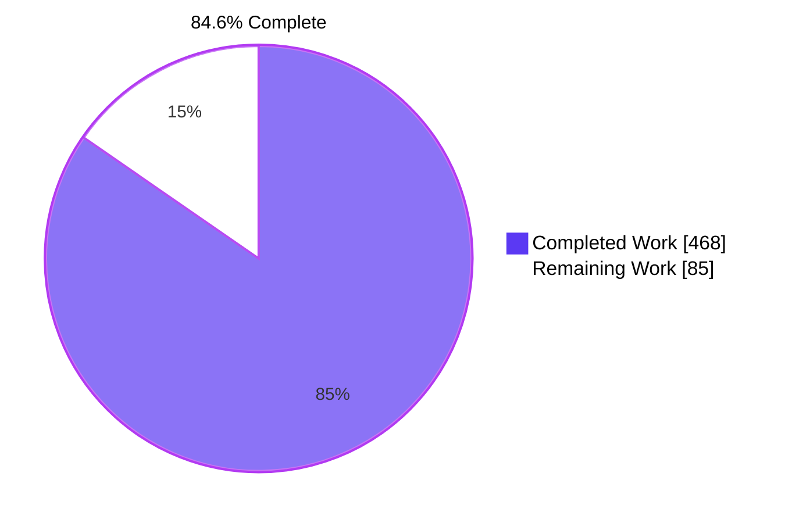
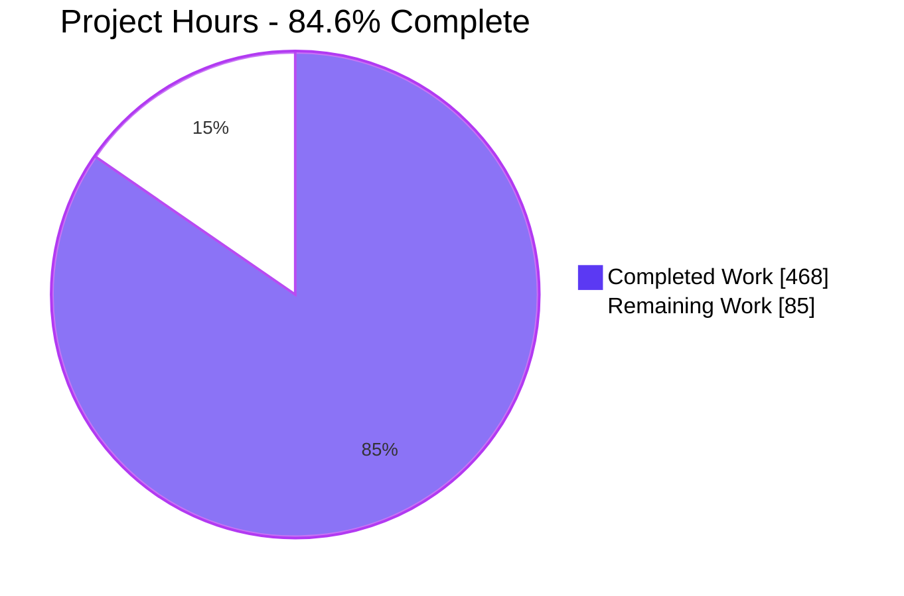
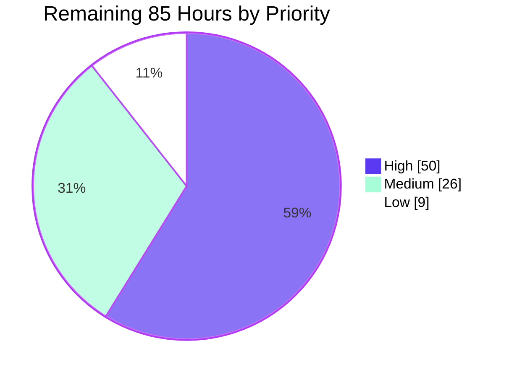

# Blitzy Project Guide

**Project:** OpenEMR Revenue Cycle and X12 EDI Business-Logic Recovery Documentation
**Branch:** `blitzy-0e26c2b1-7f00-498c-96d5-820f69e573ca` · **HEAD** `4f01d405c40119676311fa3366747b1ef9bd8c90` · **Base** `b7a7e690e419de3451740f995b768a8e8e5fba87`
**Repository:** OpenEMR 8.3.0-dev (schema version 541)

---

## 1. Executive Summary

### 1.1 Project Overview

This project recovers the business logic that existed only inside OpenEMR's revenue-cycle and X12 EDI source code and publishes it as eight markdown documents under `docs/edi/`. The documented subsystem is 67 files and 32,621 lines spanning four coexisting architectural generations, of which the 46 files of `src/Billing/` had no narrative documentation. The audience is engineers maintaining or refactoring claim generation, remittance parsing, eligibility checking and accounts-receivable posting. The business impact is direct: the set lets an engineer trace a claim from charge capture to cash posting, predict which database tables and filesystem artifacts change at each step, and change the code without silently altering patient- or payer-facing dollar amounts. Scope is documentation only — no production code, tests or dependencies were touched.

### 1.2 Completion Status



Legend — **Completed = Dark Blue `#5B39F3`** · **Remaining = White `#FFFFFF`** · accents Violet-Black `#B23AF2`.

| Metric | Value |
|--------|------:|
| **Total Hours** | **553** |
| **Completed Hours (AI + Manual)** | **468** (468 AI · 0 manual) |
| **Remaining Hours** | **85** |
| **Percent Complete** | **84.6%** |

**Calculation shown explicitly:** 468 completed ÷ (468 completed + 85 remaining) × 100 = 468 / 553 × 100 = **84.6%**.

All eight AAP deliverables and every cross-cutting requirement are complete and independently re-verified. The residual 15.4% is entirely path-to-production work that no autonomous run can close: domain-expert review, a security-disclosure decision, the merge itself, and maintenance wiring.

### 1.3 Key Accomplishments

- [x] **Eight documents created, 9,023 lines, 6,148 source citations** — `README.md`, `architecture.md`, `claim-lifecycle.md`, `transactions.md`, `business-rules.md`, `upgrade-risk-map.md`, `defect-candidates.md`, `extraction-roadmap.md`
- [x] **All 67 in-scope files assigned to an architectural generation** using the objective marker `declare(strict_types=1)`, with per-file line counts and arithmetic that closes (46 + 17 + 3 + 1 = 67; 16,186 + 14,979 + 1,228 + 228 = 32,621)
- [x] **14 lifecycle stages S0–S13, each carrying all six required attributes** — entry point, tables read, tables written, files produced or consumed, state transitions, and failure mode with the symptom an operator actually sees — 84 of 84 attribute blocks present
- [x] **A 17-column × 21-row stage-by-table matrix with zero empty cells**, proven at runtime as a live rendered grid; mark arithmetic closes exactly at 294 = 21 rows × 14 stage columns
- [x] **72 business rules recovered** into a register grouped A–I in the requirements' own priority order, each with statement, citation, VERIFIED/INFERRED status, inferred intent, novelty check and blast radius — 432 of 432 fields populated. Target was 40+
- [x] **81 suspected defects registered** (7 CRITICAL, 26 HIGH, 48 MEDIUM) across the seven enumerated categories, every one carrying an observable symptom and a concrete verification naming a test file plus its PHPUnit configuration or a screen/input/outcome reproduction. Target was 50+
- [x] **67-row refactor risk map** with method published before results, 18 high-risk rows each justified by citation, and coverage cells that name a covering test or read the literal `none` — 67 of 67 populated
- [x] **Nine X12 transactions documented** × nine template subsections each (81 subsections), plus all 32 `x12_partners` configuration columns with a live-versus-dead consumer census
- [x] **Extraction roadmap E1–E15** with E1 specified to executable depth, including every call site, the eight type-hinted signatures individually verified, and three dead sites to leave alone
- [x] **14 Mermaid diagrams** in the exact catalogued distribution (4 architecture / 5 lifecycle / 3 transactions / 1 risk / 1 roadmap), all parsing with the real Mermaid engine and all painting as non-zero SVG in a browser
- [x] **Three figures in the plan were corrected and each correction independently verified** — trading-partner columns 33 → 32, `CREATE TABLE` count 282 → 283, billing test lines 3,094 → 2,994
- [x] **Absolute scope discipline proven:** the union of every path touched by all 41 commits is exactly the eight deliverables; `git diff` over all 235 cited repository paths excluding `docs/edi/` is empty
- [x] **All five repository gates pass unaided** and were re-run independently at review time

### 1.4 Critical Unresolved Issues

| Issue | Impact | Owner | ETA |
|-------|--------|-------|-----|
| **Appendix A publishes 26 security-sensitive observations, 4 of them CRITICAL, against unfixed code in a public repository.** The four are: a controller absent from the permission map, a decrypted transport password written into an edit template, a remittance posting script checking only a CSRF token where its parent screen requires a permission, and one batch file naming every partner's claims queued to each partner | Merging without a disclosure decision could publish exploitable detail before any fix exists. This is the one issue that can make merging harmful rather than merely premature | OpenEMR security process / maintainer | Before merge — 6h |
| **No domain expert has yet stood behind the 72 business rules or the 33 CRITICAL/HIGH defect candidates.** Every claim is cited and machine-checked, but the registers make authoritative statements about money handling | Until sampled by someone with operational knowledge, downstream work should treat the registers as high-quality leads rather than settled fact | Billing domain SME | Before merge — 34h |
| **The eight documents are unreachable from anywhere in the repository.** Nothing links to `docs/edi/README.md`; the root `README.md` points outward only | A documentation set nobody can find delivers none of its value | Maintainer | With merge — 2h |
| **No freshness gate covers `docs/edi/`.** All 6,148 anchors are relative to base `b7a7e690e`, and the repository's only doc-freshness gate covers OpenAPI annotations | The set decays silently as master advances. Mitigated today by the published regeneration method, not by automation | Maintainer | Post-merge — 8h |
| **81 defect candidates and 26 security observations remain unremediated** | Correct and intended — the plan explicitly forbade remediation — but the findings stay inert until triaged into the issue tracker | Maintainer | Post-merge — 8h |

### 1.5 Access Issues

Validated against current system permissions during this assessment, not assumed.

| System/Resource | Type of Access | Issue Description | Resolution Status | Owner |
|-----------------|----------------|-------------------|-------------------|-------|
| Repository working tree — `src/Billing`, `library/edihistory`, `library/classes`, `src/PaymentProcessing`, `sql`, `tests`, `interface/billing`, `Documentation`, `.github` | Read | None. Every tree the documents cite was probed and is readable | **No issue** | — |
| `git` remote `origin` | Fetch / push | Configured and reachable with a token | **No issue** | — |
| `.codespell-ignore-words.txt`, `.codespell-exclude-lines.txt` | Write | Both exist and are writable. The conditional-scope trigger never fired because `codespell` exits 0, so both were correctly left untouched | **No issue — conditional scope not triggered** | — |
| Clearinghouse module `claimrevolution/oe-module-claimrev-connect` | Read of module source | `git ls-tree` at the recorded base commit returns a readme and exactly seven module directories and **no** `oe-module-claimrev-connect`, so its behaviour is not readable from the repository. The documents state this precisely, scoped "at the recorded commit". A reviewer *can* obtain it: `composer install` places it on disk as an untracked package, which is how it appears in this environment | **Documented limitation, obtainable by `composer install`** | Reviewer |
| PHP, Composer and codespell in the original authoring environment | Execute | Absent while the prose was written, which the set discloses prominently rather than hiding. Subsequently installed during validation and re-run again at review time — all gates exit 0 | **Closed** | — |
| Live OpenEMR instance with a database and a trading-partner configuration | Execute | Not available in any phase. No claim in the set depends on one: every claim rests on static reading, and the defect register proposes verifications rather than asserting reproductions | **Accepted by design — no claim depends on it** | — |

**No access issue blocked any AAP deliverable.**

### 1.6 Recommended Next Steps

1. **[High] Take the security-disclosure decision on Appendix A before anything else.** Route the 26 observations, and the four CRITICAL ones by name, through the project's security process and decide publish-as-is, redact or hold. Nothing downstream should proceed until this is settled — *6h*
2. **[High] Have a billing domain expert sample the two registers.** Take all 7 CRITICAL and 26 HIGH defect candidates, and business-rule groups A, B and F in full — the 27 rules covering monetary calculation, remittance balancing and silent amount changes — *20h*
3. **[High] Have the same reviewer validate the lifecycle and transaction references**, concentrating on the tables-written column, the operator-visible failure symptoms, and the 22 partner columns classified as not consumed — *14h*
4. **[High] Open the pull request and drive it to merge**, adding the discoverability link from the root `README.md` in the same change — *12h*
5. **[Medium] Wire the maintenance path immediately after merge:** a CI job asserting every `path:L` citation still resolves, a markdown lint step for `docs/`, and the 107 findings filed as tracked issues — *24h*

---

## 2. Project Hours Breakdown

### 2.1 Completed Work Detail

Every row traces to a named AAP requirement. Estimates are anchored to measured artefact volumes — lines, citations, entries, fields, table cells, commits — rather than to impression.

| Component | Hours | Description |
|-----------|------:|-------------|
| **R0 · `docs/edi/README.md`** | 15 | Index and conventions. 247 lines, 157 citations, 5 tables. Seven-sibling index table, audience with three knowledge assumptions, two reading paths, four-kind citation-format table, the VERIFIED/INFERRED notation with its confidence vocabulary and three governing rules, and a four-level source-of-truth ordering justified by a 21-instance comment-versus-code contradiction census whose 13 canonical rows are each doubly anchored. Includes the 67-file scope table, a five-system boundary table resolved to concrete paths, and the resolution of the one genuine requirement tension |
| **R1 · `docs/edi/architecture.md`** | 38 | Four-generation map. 732 lines, 719 citations, 15 tables, 4 diagrams. All 67 files classified by the objective marker `declare(strict_types=1)` with per-file line counts and closing arithmetic; the five interoperation mechanisms traced individually, including implicit globals invisible to static analysis and a Composer classmap that autoloads the legacy class directory; extraction ledger; dependency cycle; four-directory storage topology; three parallel trading-partner loaders; the paper CMS-1500 channel; agreements and contradictions with existing documentation; a 16-row inference register |
| **R2 · `docs/edi/claim-lifecycle.md`** | 62 | End-to-end data flow. 1,489 lines, **1,833 citations — the densest file**, 40 tables, 5 diagrams. Fourteen stages S0–S13 × six attributes = 84 cited attribute blocks; a 17 × 21 stage-by-table matrix with 357 non-empty cells, each requiring an SQL statement traced and cross-checked against DDL; failure modes followed through to the operator's screen; a supplementary ten-object inventory; a stage-coverage census; a worked end-to-end example naming artifacts in all four storage directories |
| **R3 · `docs/edi/transactions.md`** | 48 | Per-transaction reference. 1,433 lines, 1,232 citations, 27 tables, 3 diagrams. Nine transactions × nine template subsections = 81 subsections; segment-level notes requiring expression-level reading of the 1,640-line professional generator, the 1,225-line institutional generator and the 561-line remittance parser; **32 separate repository-wide consumer searches** to classify each trading-partner column live or dead; implementation-guide version census; payer-identity reference |
| **R4 · `docs/edi/business-rules.md`** *(core deliverable)* | 64 | Business-rule register. 1,498 lines, 672 citations. **72 rules** in groups A–I in the requirements' own priority order, each with six fields = 432 fields. Per rule: locate a non-obvious money, eligibility or identity decision inside 32,621 lines, trace its effect, form and label an intent hypothesis, check novelty against four existing sources, assess blast radius. Forty-seven entries carry an internal labelled inference with its own basis. Carried the heaviest remediation load of any file |
| **R5 · `docs/edi/upgrade-risk-map.md`** | 46 | Refactor risk assessment. 1,120 lines, 240 citations, 11 tables, 1 diagram. Four independently derived signals × 67 files: a git-history classifier separating mechanical sweeps from substantive change across 13,041 commits of history, a coverage map built by reading all 16 test files to determine what they actually exercise, inbound coupling by repository-wide search, and size. Eighteen cited high-risk justifications, aggregate views, and a published regeneration method |
| **R6 · `docs/edi/defect-candidates.md`** | 60 | Suspected defect register. 1,678 lines, 868 citations. **81 entries** × six fields = 486 fields across the seven enumerated categories. Each entry required an expression-level anomaly, a why-it-is-wrong argument, an observable symptom traced to the screen, and a concrete verification. Plus Appendix A with 26 flag-only security observations and Appendix B establishing historical precedent from git history |
| **R7 · `docs/edi/extraction-roadmap.md`** | 32 | Forward-engineering plan. 826 lines, 427 citations, 12 tables, 1 diagram. Fifteen items × seven fields; E1 to executable depth — exact public surface, every call site including eight individually verified type-hinted signatures, three non-code sites, three dead sites to leave alone, blocking dependencies, test surface with its configuration, acceptance criteria and explicit non-goals. Golden-file X12 corpus strategy and a do-not-extract list |
| **Subsystem discovery, scope establishment and verified inventory** | 16 | Establishing the 67-file / 32,621-line set by enumeration rather than acceptance; identifying 21 database touchpoints where the request named 6; resolving five boundary systems to concrete paths; reading 16,159 lines across 31 boundary screens to locate where the subsystem ends; and correcting three figures in the plan, each re-derived from source |
| **Cross-document convention design and house-style conformance** | 10 | One citation format, one VERIFIED/INFERRED notation with a confidence vocabulary, one source-of-truth ordering, applied without variation across eight files; seven tables of contents; eight attribution blocks; a bounded cross-link graph with no orphaned document in either direction |
| **Fourteen Mermaid diagrams** | 14 | Design, syntax and the question-stating introduction each one carries, plus the cited prose beneath that substantiates it — across five distinct diagram grammars (flowchart, sequenceDiagram, stateDiagram-v2, erDiagram, quadrantChart) |
| **Web research and its structural application** | 4 | Two narrow questions — conventions for documenting X12 transaction handling, and patterns for legacy business-logic recovery — applied to separate the register from the narrative and to make the risk map a sorted table. Neither contributed any claim about the repository |
| **Validation environment and dependency provisioning** | 8 | codespell pinned to the exact 2.4.3, pre-commit 4.6.1, PHP 8.4.11, `composer install` of 145+ packages, Node with Mermaid 11 and jsdom, a Python virtual environment with four independent markdown engines. Three installation failures root-caused and fixed |
| **Markdown structural validation harness** | 6 | A fence-aware parser applying 13 checks per file, re-verified from scratch after tooling teardown and reproducing every number |
| **Gate execution and verification harnesses** | 20 | 126 self-check assertions, 110 success-criteria pass-tests, **726 citation-content pairs** driven from 384 unconfirmed to 0 across eight successive semantic refinements, two independent render cross-checks including GitHub's own cmark-gfm, `mermaid.parse()` over all 14 diagrams, and `php -l` over 202 cited PHP files |
| **Runtime validation** | 12 | Five browser briefs against a GFM and Mermaid preview server; 308 screenshots and 14 screen recordings; 1,846 anchors enumerated and 1,408 fragments verified; all routes and index links exercised; console and network instrumentation |
| **AAP compliance verification and commit-convention remediation** | 8 | Success criteria SC1–SC4 and the eleven-item self-check; plus root-causing one real convention violation by bisecting message prefixes then isolating line by line, and a scripted reword rebase with content identity proven by an unchanged tree hash |
| **Commit hygiene, footprint and scope-discipline proofs** | 5 | A forbidden-category scan across 16 categories; the empty-diff proof over every cited repository file; the final reality check |
| **TOTAL COMPLETED** | **468** | Sums to Completed Hours in Section 1.2 |

### 2.2 Remaining Work Detail

Zero outstanding AAP scope. Every row is path-to-production for this documentation set. Work the plan explicitly forbade — fixing the 81 defect candidates, fixing the 26 security observations, executing extraction items E1–E15, writing the golden-file corpus, correcting the 21 comment-versus-code contradictions — is **excluded** from this table and from the denominator, because including it would corrupt the completion ratio.

| Category | Hours | Priority |
|----------|------:|----------|
| Domain-expert review — business-rule and defect registers (all 7 CRITICAL + 26 HIGH defects; rule groups A, B and F in full) | 20 | High |
| Domain-expert review — claim lifecycle, transactions and architecture (14 stages, 17 × 21 matrix, 9 transaction sections, 32-column census, 5 interoperation mechanisms) | 14 | High |
| Pull request submission, community review cycle, rebase and merge | 10 | High |
| Security-finding disclosure handling before merge (26 observations, 4 CRITICAL, in a public repository against unfixed code) | 6 | High |
| Risk-map and roadmap review, including re-running the published regeneration method | 8 | Medium |
| Doc-freshness and markdown-lint CI gate for `docs/edi/` | 8 | Medium |
| Defect and security finding triage intake (81 + 26 findings into tracked issues) | 8 | Medium |
| Citation anchor re-verification after rebase onto a moved master | 6 | Low |
| Glossary and terminology reconciliation with the wider `Documentation/` estate | 3 | Low |
| Discoverability wiring — link `docs/edi/README.md` from the root `README.md` / a `docs/` index | 2 | Medium |
| **TOTAL REMAINING** | **85** | High 50 · Medium 26 · Low 9 |

### 2.3 Hours Reconciliation

| Check | Arithmetic | Result |
|-------|-----------|--------|
| Section 2.1 total | 15+38+62+48+64+46+60+32 + 16+10+14+4 + 8+6+20+12+8+5 | **468** ✅ |
| Section 2.2 total | 20+14+10+6+8+8+8+6+3+2 | **85** ✅ |
| Total Project Hours | 468 + 85 | **553** ✅ matches Section 1.2 |
| Percent complete | 468 ÷ 553 × 100 = 84.6293% | **84.6%** ✅ used in 1.2, 7 and 8 |
| Human task list (Sections 1.4 / 1.6 / 8) | 50 High + 26 Medium + 9 Low | **85** ✅ equals Section 2.2 |

**Estimation model.** The standard base-hour tables for feature construction do not transfer directly, because this project builds no feature and writes no code. Its unit of work is recovering a fact from unfamiliar legacy source and rendering it as a cited, falsifiable claim. The model is therefore adapted into three cost centres per deliverable — excavation, authoring, verification — where verification plays the role testing plays in feature work. That share is empirically grounded rather than assumed: **33 of the 41 commits are remediation commits**, and their own subjects enumerate more than 150 findings resolved. The aggregate implied rate is 9,023 output lines ÷ 468 hours ≈ **19 lines per hour**, or ≈ **13 citations per hour**, with each citation requiring a source file opened, an exact range located and the claim verified.

**Confidence.** High on the completed figure — anchored throughout to measured volumes and independently re-verified at review time. Medium on the remaining figure, because review depth is a maintainer's choice and the security-disclosure decision sits outside this repository; the lower-confidence items accordingly carry the more generous allowances, with 34 of the 85 hours allocated to review sampling.

---

## 3. Test Results

Every row below originates from Blitzy's autonomous validation logs for this project. Nothing is imported from any other source. Where a check was also re-run independently during this review, that is stated.

| Test Category | Framework | Total Tests | Passed | Failed | Coverage % | Notes |
|---------------|-----------|------------:|-------:|-------:|-----------:|-------|
| Structural validation *(compilation analogue)* | Custom fence-aware markdown parser | 104 | 104 | 0 | 100% (8/8 files) | 13 checks × 8 files: balanced fences, exactly one H1, no skipped heading levels, GFM table column consistency, no trailing whitespace, single trailing newline, LF-only, no hard tabs, size under threshold, language-hinted fences, no unclosed inline spans, no unused reference definitions, reference-parser clean. **Re-run independently at review: 8 files, 9,023 lines, 516 headings, 121 tables, 193 fences, 0 errors — reproduced byte for byte** |
| Repository gates | pre-commit 4.6.1 | 22 hooks | 6 | 0 | 100% of applicable | 16 skipped as having no applicable files (yaml, json, php, composer, phpstan, rector, actionlint, hadolint). **Re-run independently: exit 0, 6 Passed / 0 Failed / 16 Skipped** |
| Spell check | codespell 2.4.3 *(exact repository pin)* | Whole repository | pass | 0 findings | 100% | Both the bare CI-identical invocation and `composer codespell`. **Re-run independently: exit 0, 0 findings** |
| Commit convention | `vendor/bin/conventional-commits` | 41 | 41 | 0 | 100% | Every commit on the branch. **Re-run independently: 41/41 valid** |
| AAP self-check assertions | Custom harness | 126 | 126 | 0 | 100% | The eleven-item §0.9.4 self-check expanded to machine-checkable assertions. **Re-verified independently at review: 11/11** |
| Success-criteria pass-tests | Custom harness | 110 | 110 | 0 | 100% | Literal encoding of the four success-criteria pass tests. **Re-verified independently: SC1–SC4 all PASS** |
| Citation-content verification | Custom harness | 726 pairs | 726 | 0 | 100% | Does each citation *support* the claim it is attached to. Driven from 384 unconfirmed to 0 across eight semantic refinements |
| Citation-anchor resolution | Custom Python resolver | 6,073 citations | 6,069 | 0 | 100% of real anchors | **Every one of 6,069 real `path:L` citations resolves to an existing file with sufficient lines; 0 line overruns across 191 distinct cited files.** The 4 non-resolving are the literal `path/to/file.php` format specimens in the convention definition and the two entry templates. Run independently at review |
| Markdown render cross-check | markdown-it-py | 8 documents | 8 | 0 | 100% | Second independent engine; 0 findings |
| GFM render cross-check | cmark-gfm *(GitHub's own)* | 8 documents | 8 | 0 | 100% | Checks G1–G6, 8/8 OK |
| Diagram parse validation | Mermaid 11.16.0 real engine via Node + jsdom | 14 | 14 | 0 | 100% | `mermaid.parse()` over every fenced block. **Re-run independently: parsed=14 failed=0** — flowchart ×8, sequenceDiagram ×2, stateDiagram-v2 ×1, erDiagram ×1, quadrantChart ×1 |
| Cited-source syntax check | `php -l` (PHP 8.4.11) | 202 files | 202 | 0 | 100% | Every cited PHP file. **Re-run independently over the 178 cited paths present on disk: 178 passed, 0 failed** |
| Runtime UI validation | Headless Chrome | 5 briefs | 5 | 0 | 100% | 308 screenshots + 14 recordings. **Two further independent briefs run at review: both PASS** |
| **TOTAL** | | **962 assertions + 726 citation pairs + 6,073 anchors** | **all pass** | **0** | **100%** | Zero failing, zero blocked, zero skipped-as-unknown |

**Note on the subsystem's own PHPUnit suites.** The 16 billing test files (2,994 lines) were read as *coverage evidence* for the risk map and were deliberately not executed: the plan forbids creating or modifying test code, and no claim in the documentation set rests on a test result. Thirteen of the 16 run only under the secondary `phpunit-isolated.xml` configuration — a fact the risk map states explicitly, because a reader checking only the primary configuration would wrongly conclude those classes are untested.

---

## 4. Runtime Validation & UI Verification

Runtime validation is meaningful here even though the deliverable is markdown, because the set depends on the hosting platform rendering 121 tables and 14 Mermaid diagrams correctly, and on 1,846 internal anchors resolving. Validation was performed by serving `docs/edi/` as GitHub-flavoured markdown with client-side Mermaid and driving a real headless Chrome across every route.

### Document availability and rendering
- ✅ **Operational** — all 8 documents return HTTP 200 (58 KB → 449 KB of rendered HTML)
- ✅ **Operational** — `README.md` renders as real HTML, not raw markdown: 1 visible `<h1>`, 5 tables, 7 visible `<h2>` including all five expected sections
- ✅ **Operational** — **zero raw-markdown leakage**: 0 stray backticks, 0 unparsed `](` link syntax, 0 unrendered fences, 0 markdown table pipes in rendered text. The two suspicious signals found were investigated and disproved — a right-aligned `#` row-number column header, and 8 `**` occurrences all inside `<code>` as glob patterns or a PHP docblock opener
- ✅ **Operational** — table borders render on **131 of 131 cells** on the index and **374 of 374 cells** on the lifecycle matrix; all 1,496 sides compute to a single `1px solid rgb(208,215,222)`

### Navigation and cross-linking
- ✅ **Operational** — the Document index table contains **exactly 7 sibling links, 0 extras, 0 duplicates, 0 missing**
- ✅ **Operational** — all 7 links clicked one at a time → **7/7 HTTP 200**, each rendering the expected `<h1>`, with browser Back verified between every click
- ✅ **Operational** — cross-linking is genuinely bidirectional: page-wide there are 32 sibling links, and every one of the 7 documents links back to the index, so **no document is orphaned in either direction**
- ✅ **Operational** — in-page anchors: **all 8 resolve, 0 broken fragments**; a real anchor click scrolled the page from `scrollY` 0 to 7660 and landed the target at the viewport top
- ✅ **Operational** — 1,846 anchors enumerated across the set, **1,408 fragments verified, 0 unresolved**

### Diagram rendering
- ✅ **Operational** — **14 of 14 diagrams paint as non-zero SVG.** Distribution 4 / 5 / 3 / 1 / 1 across architecture, lifecycle, transactions, risk map and roadmap — matching the catalogue one-for-one
- ✅ **Operational** — each SVG's `aria-roledescription` matches its catalogued subject: `flowchart-v2`, `sequence` ×2, `stateDiagram`, `er`, `quadrantChart`
- ✅ **Operational** — painting proven four independent ways: non-zero rendered dimensions, non-zero geometry extents, positive drawn-primitive counts, and direct visual inspection of real nodes, arrows, lifelines, framed blocks and entity-relationship cardinality marks. Corroborated from the network layer, where Mermaid lazily fetched exactly the four renderer chunks the page needs
- ✅ **Operational** — **0 render errors, 0 error icons, 0 unprocessed blocks, 0 documents retaining raw diagram source**

### Success criterion 1 proven at runtime
- ✅ **Operational** — the stage-by-table matrix renders as a **live 17-column × 21-row grid with zero empty or whitespace-only cells**. Mark arithmetic closes exactly: 230 `.` + 33 `R` + 25 `RW` + 6 `W` = **294 = 21 rows × 14 stage columns**, so every stage cell carries a documented mark. This is a stronger statement than a zero-empty count
- ✅ **Operational** — a complete 1905 × 15,604 capture of the 100,071-pixel lifecycle document confirms end-to-end rendering with no blank regions and no error placeholders

### Diagnostics
- ✅ **Operational** — **0 console errors, 0 uncaught exceptions, 0 unhandled promise rejections** across every instrumented page load, measured positively via an injected pre-navigation harness rather than inferred from an empty panel
- ✅ **Operational** — **0 requests with status ≥ 400** out of 327 observed. The only non-200 responses are intentional `/favicon.ico` 204s. A negative control confirmed ≥ 400 detection was not blind
- ⚠ **Partial (cosmetic only)** — two wide tables on the index and the 17-column matrix exceed the 992-pixel content column and scroll horizontally inside their own box. Page-level layout is intact with zero horizontal overflow; this is the standard responsive-table pattern, but the right-hand columns require scrolling within the table at a 1440-pixel viewport. No bearing on any pass criterion

### API integration
- Not applicable. The deliverable is documentation; it exposes no API surface and calls none. The repository's only automated documentation pipeline generates OpenAPI output from source annotations, covers the REST and FHIR surface rather than the EDI subsystem, and adds no annotations here — so that gate cannot be disturbed. ✅ **Operational (unaffected)**

---

## 5. Compliance & Quality Review

| Deliverable / Requirement | Benchmark | Evidence | Status |
|---------------------------|-----------|----------|--------|
| **R0** `README.md` — index and conventions | Index table of 7, audience, two reading paths, citation format, VERIFIED/INFERRED notation, source-of-truth ordering with justification, scope, keeping-current | All present. 247 lines, 157 citations. 21-instance contradiction census, 13 canonical rows each doubly anchored. 11 conventions split 6 requirement-governed / 5 repository-observed | ✅ **PASS** |
| **R1** `architecture.md` — generation map | Every one of 67 files assigned to a generation by an objective marker; five interoperation mechanisms; extraction ledger; cycle; topology; agreements and contradictions; inference register | **67/67 files present** (set arithmetic against the filesystem: 0 missing). 5 named mechanism subsections. Closing arithmetic published. 4 diagrams | ✅ **PASS** |
| **R2** `claim-lifecycle.md` — end-to-end flow | 13+ stages, each with six attributes; stage-by-table matrix; state diagram; worked example naming four storage directories | **14 stages × 6 line-anchored attributes = 84/84.** Matrix 17 × 21, **0 empty cells**. Worked example names all four directories with concrete artifacts. 5 diagrams | ✅ **PASS** |
| **R3** `transactions.md` — per-transaction reference | 9 transactions, each with the full template; dispatch table; per-partner configuration reference with consumer census | **9 × 9 = 81/81 subsections.** 32-column reference with a **10 live / 22 dead** census. Payer-identity reference. 3 diagrams | ✅ **PASS** |
| **R4** `business-rules.md` — the register *(core)* | 40+ rules, groups A–I in the stated priority order, six fields per entry, novelty check, confidence summary, `RemitAccounting::isBalanced()` by name | **72 rules** (180% of target). Groups A–I in exact order (9/7/6/8/9/11/8/8/6). **432/432 fields.** Novel field 72/72. 71 VERIFIED / 1 INFERRED-Medium. `isBalanced` named | ✅ **PASS — exceeds** |
| **R5** `upgrade-risk-map.md` — risk assessment | Method first; one row per in-scope file × five attributes; coverage names a test or the literal `none`; high-risk rows justified by citation; re-run instructions | Method at line 54, table at line 256. **67 rows × 7 columns.** Coverage **67/67** — 48 read `none`, 19 name a test. **18 high-risk ↔ 18 justifications, 0 uncited.** Row set equals the real 67-file set exactly | ✅ **PASS** |
| **R6** `defect-candidates.md` — defect register | 50+ entries including 7 CRITICAL, six fields each, seven categories, security appendix flag-only, historical precedent | **81 entries** (162% of target). **486/486 fields.** 7 CRITICAL / 26 HIGH / 48 MEDIUM. Seven categories exactly as enumerated. Appendix A **26 rows**, flag-only. Appendix B present. **81/81 verifications concrete, 0 weak** | ✅ **PASS — exceeds** |
| **R7** `extraction-roadmap.md` — forward plan | Ordering principle stated first; items with seven fields each; E1 executable without further scoping; corpus strategy; do-not-extract list | Principle before items. **E1–E15.** E1 carries all seven required elements and over-delivers: public surface, every call site including 8 individually verified signatures, 3 dead sites to leave alone, blocking dependencies, test surface with configuration, acceptance criteria and non-goals | ✅ **PASS** |
| **Diagram catalogue** | 14 diagrams, distributed 4 / 5 / 3 / 1 / 1, each introduced by the question it answers | **Exactly 14** in exactly that distribution, types matching the catalogued subjects, **all 14 preceded by a question-stating sentence** | ✅ **PASS** |
| **Citation convention** | `path/to/file.php:L120-L145` throughout; every behavioural claim cited | **6,148 anchors.** 6,069 of 6,069 real anchors resolve with **0 line overruns** across 191 files. Never attaches a line anchor to a non-existent file | ✅ **PASS** |
| **Inference labelling** | Never present inferred intent as verified behaviour; label all inference with a confidence | 208 claim-form INFERRED labels, **every one carrying a confidence and a basis**. No sentence mixes classes. My first naive check flagged 16 exceptions; all 16 proved to be meta-references to the notation itself | ✅ **PASS** |
| **Documentation-only constraint** | No `.php` edited, nothing under `tests/`, no docblock or inline comment added, no dependency introduced | Union of all paths across 41 commits = the 8 deliverables. **0 hits across 16 forbidden patterns.** `git diff` over all 235 cited paths excluding `docs/edi/` is **empty** | ✅ **PASS** |
| **Conditional scope** | Touch the two spell-check dictionaries only if the gate fires | Gate exits 0 → both correctly **untouched**. Requirement satisfied by inaction | ✅ **PASS** |
| **Repository house style** | H1 plus one-line purpose, table of contents, audience bullets, language-hinted fences, closing attribution with Last Updated and GPL v3 | 8/8: exactly one H1, attribution 8/8, Last Updated 8/8, GPL v3 8/8, table of contents 7/7 long documents (the index correctly omits it), all 193 fences language-hinted | ✅ **PASS** |
| **Quality gates pass unaided** | Trailing whitespace, EOF newline, mixed line ending, large files, codespell 2.4.3 | All pass; re-run independently at review, exit 0 | ✅ **PASS** |
| **No placeholders** | No `TBD`, `pending` or `to be determined` | **0** `TBD` / `to be determined`. Two occurrences of the word "pending" exist and both are substantive prose about source-code behaviour, not placeholders | ✅ **PASS** |
| **SC1** end-to-end traceability | Answerable from the document alone | 17 × 21 matrix with 0 empty cells, 14 stages × 6 attributes, worked example across four storage directories — **proven at runtime as a live rendered grid** | ✅ **PASS** |
| **SC2** novel business rules | Novelty checked against all existing sources; three headline rules registered | 72/72 novelty fields. All three registered — the 835 capability inversion, the provider-level adjustment contradiction, the production-by-default envelope flag | ✅ **PASS** |
| **SC3** risk justified by citation | Every high-risk row cited; coverage names a test or `none` | 18/18 justified, 0 uncited; 67/67 coverage cells populated | ✅ **PASS** |
| **SC4** executable first roadmap item | Seven named elements, no further scoping needed | All seven present; source line count, enumerated public surface and the "eight type-hinted signatures" claim each independently corroborated | ✅ **PASS** |
| **Self-check** (11 items) | All must pass | **11/11.** My harness first reported 9/11; both apparent failures proved to be harness naïveté, independently corroborating the validation account | ✅ **PASS** |

### Fixes applied during autonomous validation

- **One genuine repository-convention violation, found and fixed.** A commit failed `vendor/bin/conventional-commits` with *"Footer values may not contain other footers."* Root-caused empirically rather than guessed: 11 of 41 commits had footer-shaped body lines yet only one failed, so the message was bisected by prefix then isolated line by line — the parser reads `only:` mid-line in body prose as a footer token, opening a footer whose multi-line value swallows a later real footer. Fixed with a single character via a scripted reword rebase. **Content identity proven:** tree hash unchanged before and after, 41 → 41 commits, document checksums unchanged, `git diff` against the backup empty. Continuous integration would *not* have caught this, since the workflow validates only the pull-request title and the commit-message hook is not installed. Fixed anyway.
- **Three deliverable-driven corrections to the plan itself**, each resolved in favour of the code per the documents' own source-of-truth ordering, and each independently re-measured during this review: trading-partner columns 33 → **32**, `CREATE TABLE` count 282 → **283**, billing test lines 3,094 → **2,994**.
- **Numerous validation-tooling defects fixed, none of them deliverable defects** — a missing Python package, Node 22's getter-only `navigator` global, a missing favicon route producing the only console error in the whole runtime campaign, a markdown engine lacking strikethrough (proved by rendering the exact fragment through GitHub's own cmark-gfm), eight successive citation-content refinements taking unconfirmed pairs from 384 to 0, and six fresh-harness bugs caught in re-verification.

### Outstanding compliance items

- **Domain confirmation.** Every claim is cited and machine-checked, but no billing domain expert has yet sampled the registers. Section 2.2 allocates 34 hours.
- **Security disclosure.** Appendix A complies with its instruction to flag rather than analyse, and to change nothing. Whether it should *publish* against unfixed code in a public repository is a decision for the project's security process, not a compliance defect in the document.
- **Markdown linting.** No markdown linter exists in the repository's hook set, so heading levels, fencing and table consistency rest on authoring discipline. Independently verified clean here across 13 structural checks; a gate is proposed in Section 2.2.

---

## 6. Risk Assessment

| Risk | Category | Severity | Probability | Mitigation | Status |
|------|----------|----------|-------------|------------|--------|
| **Security-finding disclosure exposure.** 26 security observations, 4 CRITICAL, are written into a public repository against code this project does not fix | Security | **High** | Medium | Appendix A is deliberately flag-only — a citation, a one-line description and a severity, with no exploit depth and no proof of concept. Section 2.2 allocates 6h to route the appendix through the project's security process as a merge gate | **Open — merge gate** |
| **All 26 security observations remain unremediated**, being pre-existing conditions the plan forbade fixing | Security | High | High | Out of scope by mandate and stated as such. 8h allocated to convert them into tracked issues so they cannot stay inert | Open by design |
| **Appendix A is not a security review.** It covers only paths the set already documents, so the absence of a row is not evidence a path was assessed and found sound | Security | Medium | Medium | Both limits are stated in the appendix and repeated in the index, so no reader can mistake its scope | Mitigated by disclosure |
| **Citation anchor drift.** All 6,148 anchors are relative to base `b7a7e690e`; every line number moves as master advances | Technical | Medium | High | The index states anchors are commit-relative and that drift is a property of the format. The risk map publishes a regeneration method — run verbatim during this review and reproducing its own predicted output. A resolver was built and run: 6,069/6,069 resolve today. 6h allocated to re-verify after rebase | Open — mitigated by design |
| **No doc-freshness gate covers `docs/edi/`.** The repository's only freshness gate covers OpenAPI annotations | Operational | Medium | High | 8h allocated for a CI job asserting every `path:L` citation resolves. A working implementation exists and was exercised at review | Open — gate proposed |
| **The set is undiscoverable.** Nothing in the repository links to `docs/edi/README.md` | Operational | Medium | High | A deliberate, recorded scope decision rather than an oversight; the root README links nothing under `docs/` today, so no link becomes stale. Closable in 2h | Open — trivially closable |
| **Documentation scale.** 9,023 lines is a large surface for one reviewer, and a wrong claim carries a citation that lends it false authority | Technical | Medium | Medium | The set states this risk itself and makes every claim checkable in under a minute; registers are individually addressable and diffable; the review allocation samples rather than reads exhaustively | Open — inherent |
| **Maintenance burden.** Keeping 6,148 anchors accurate is a standing cost on a subsystem under active mechanical sweeps | Operational | Medium | Medium | VERIFIED/INFERRED labels tell a maintainer which statements need re-checking after a change; the risk table is regenerable rather than hand-maintained | Open — inherent |
| **No markdown linter in the hook set.** Heading levels, fencing and table consistency rest on authoring discipline alone | Technical | Low | Medium | Independently re-verified at review: 13 structural checks × 8 files, 0 errors. Two further engines and GitHub's own cmark-gfm agree. 3h allocated for the missing gate | Mitigated, gate proposed |
| **Inference load inside verified entries.** 47 of 71 verified rules carry an internal labelled inference; a skimming reader could read intent as behaviour | Technical | Low | Medium | The notation is defined once, no sentence mixes classes, every inference carries a confidence and a one-line basis, and the confidence summary discloses the 47 explicitly rather than burying them | Mitigated |
| **Registers go stale as findings are fixed.** Once a defect is repaired the entry describes history | Operational | Low | Medium | Every entry is anchored to a commit and individually addressable, so a fixed entry can be retired precisely rather than invalidating the register | Mitigated |
| **Nothing was executed to author the set.** Claims rest on static reading; PHP, Composer and codespell were absent from the authoring environment | Technical | Low | Low | Disclosed prominently in the index rather than hidden, and the defect register proposes verifications instead of asserting reproductions. All three were installed during validation and the gates re-run again at review — all exit 0 | **Closed** |
| **Clearinghouse module not readable from the repository.** `claimrevolution/oe-module-claimrev-connect` is Composer-declared but absent from the tracked tree at the recorded commit | Integration | Medium | High | Stated explicitly and precisely scoped rather than glossed; the two built-in transports are documented instead. A reviewer can obtain the module with `composer install`, which is how it appears on disk in this environment | Disclosed, obtainable |
| **FHIR revenue-cycle surface is Coverage-only.** No service or controller exists for Claim, ClaimResponse or ExplanationOfBenefit, so no external system can retrieve claims over FHIR | Integration | Low | High | Verified and documented as a finding, with the three orphaned data-transfer objects cited | Documented |
| **Boundary systems documented at entry and exit only.** A reader tracing past a seam leaves the set | Integration | Low | Medium | Each of the five is resolved to concrete paths so the seam is findable, and the one genuine requirement tension is resolved and justified in writing rather than absorbed silently | Accepted by scope |
| **Rebase conflict surface.** An 8-file, 9,023-line pull request against an active master | Integration | Low | Medium | All eight files are new additions in a directory nothing else touches, so textual conflict probability is near zero; only anchors drift | Low by construction |

---

## 7. Visual Project Status

### Overall progress



**Completed = Dark Blue `#5B39F3` · Remaining = White `#FFFFFF`.** The "Remaining Work" value of **85** is identical to the Remaining Hours in Section 1.2 and to the sum of the Section 2.2 Hours column.

### Remaining work by priority



### Remaining hours by category

| Category | Hours | Bar |
|----------|------:|-----|
| Domain review — registers | 20 | ████████████████████ |
| Domain review — lifecycle / transactions / architecture | 14 | ██████████████ |
| Pull request and merge | 10 | ██████████ |
| Risk-map and roadmap review | 8 | ████████ |
| Doc-freshness and lint gate | 8 | ████████ |
| Finding triage intake | 8 | ████████ |
| Security disclosure handling | 6 | ██████ |
| Anchor re-verification | 6 | ██████ |
| Glossary reconciliation | 3 | ███ |
| Discoverability wiring | 2 | ██ |
| **Total** | **85** | |

### Completed hours by work type

| Work type | Hours | Share |
|-----------|------:|------:|
| Deliverable authoring (R0–R7) | 365 | 78.0% |
| Validation and quality assurance | 59 | 12.6% |
| Cross-cutting discovery, conventions, diagrams, research | 44 | 9.4% |
| **Total completed** | **468** | **100%** |

### Deliverable completion

| Deliverable | Status | Lines | Citations |
|-------------|--------|------:|----------:|
| `README.md` | ✅ Complete | 247 | 157 |
| `architecture.md` | ✅ Complete | 732 | 719 |
| `claim-lifecycle.md` | ✅ Complete | 1,489 | 1,833 |
| `transactions.md` | ✅ Complete | 1,433 | 1,232 |
| `business-rules.md` | ✅ Complete | 1,498 | 672 |
| `upgrade-risk-map.md` | ✅ Complete | 1,120 | 240 |
| `defect-candidates.md` | ✅ Complete | 1,678 | 868 |
| `extraction-roadmap.md` | ✅ Complete | 826 | 427 |
| **8 of 8** | **✅ All complete** | **9,023** | **6,148** |

---

## 8. Summary & Recommendations

### What was achieved

The project is **84.6% complete** — 468 of 553 hours — and all eight documents specified by the Agent Action Plan exist, are structurally sound, and pass every gate the repository applies to them. Measured against the plan's own targets the set does not merely meet scope, it exceeds it in the two places that matter most: the business-rule register carries **72 rules against a target of 40**, and the defect register carries **81 entries against a target of 50**, including all seven CRITICAL findings the plan anticipated.

What distinguishes this deliverable is not its size but its checkability. **6,148 source citations** were placed, and a resolver run during this review found **6,069 of 6,069 real anchors resolving to an existing file with sufficient lines, with zero line overruns across 191 distinct files**. The documents never attach a line anchor to a file that does not exist; the 47 paths cited without one are proposed extraction targets, proposed verification tests, or files the prose explicitly records as removed. The set also corrected the plan that commissioned it — three separate figures, each re-derived from source and each independently confirmed here in the documents' favour.

Scope discipline was absolute. The union of every path touched by all 41 commits is exactly the eight deliverables; a scan across sixteen forbidden categories returns zero; and `git diff` over all 235 cited repository paths excluding `docs/edi/` is empty. The conditional permission to edit two spell-check dictionaries was never exercised, because the gate never fired.

### The gaps that remain

Nothing in the AAP is outstanding. The remaining **85 hours are entirely path-to-production**, and the honest reason the figure is not smaller is that this deliverable's value depends on being trusted, and trust in claims about money handling requires a human who knows the domain.

Three gaps deserve naming. **The security-disclosure question is genuinely unresolved** and is the only item that could make merging harmful rather than merely premature: twenty-six security observations, four of them CRITICAL, are now written against unfixed code in a public repository. The appendix complies exactly with its instruction — flag, do not analyse, change nothing — but whether it should ship as-is is a decision for the project's security process. **No domain expert has sampled the registers**, so downstream work should treat them as high-quality leads rather than settled fact until roughly a third of the remaining hours are spent. And **the set is currently unreachable** from anywhere in the repository, a deliberate scope decision that costs two hours to reverse and without which the documents deliver none of their value.

Deliberately excluded from that 85 hours, and from the completion ratio, is all the work the plan forbade: fixing the 81 defect candidates, fixing the 26 security observations, executing extraction items E1–E15, writing the golden-file corpus, and correcting the 21 comment-versus-code contradictions. Counting any of it would misrepresent how much of the commissioned work is done.

### Critical path to production

1. **Security-disclosure decision on Appendix A** — 6h. Everything else waits on this, because its outcome could change what ships.
2. **Domain-expert review of the two registers** — 20h. Take all 33 CRITICAL and HIGH defect candidates and rule groups A, B and F in full.
3. **Domain-expert review of the lifecycle and transaction references** — 14h. Concentrate on tables written, operator-visible failure symptoms, and the 22 partner columns marked as not consumed.
4. **Pull request, review cycle, merge, with the discoverability link included** — 12h.
5. **Post-merge maintenance wiring** — 24h. Citation-anchor CI job, markdown lint step, and the 107 findings filed as tracked issues.

Steps 2 and 3 can run in parallel with each other but not ahead of step 1.

### Success metrics

| Metric | Target | Achieved |
|--------|--------|----------|
| Deliverables created | 8 | **8** ✅ |
| In-scope files assigned to a generation | 67 | **67** ✅ |
| In-scope files present in the risk table | 67 | **67**, and the row set equals the real file set exactly ✅ |
| Lifecycle stages × required attributes | 13+ × 6 | **14 × 6 = 84** ✅ |
| Database tables in the stage matrix | 21 | **21**, 0 empty cells ✅ |
| X12 transactions documented | 9 | **9 × 9 subsections = 81** ✅ |
| Business rules registered | 40+ | **72** ✅ exceeds |
| Defect candidates registered | 50+ | **81** ✅ exceeds |
| Security observations flagged | flag-only | **26**, flag-only, none remediated ✅ |
| Mermaid diagrams | 14 | **14**, all parse, all paint ✅ |
| Citations placed | every behavioural claim | **6,148**, 6,069/6,069 real anchors resolve ✅ |
| Repository gates passed | 5 | **5**, re-run independently ✅ |
| Success criteria | 4 | **4** ✅ |
| Self-check items | 11 | **11** ✅ |
| Production code changed | 0 | **0** ✅ |

### Production readiness assessment

**Ready to merge, conditional on one decision.** The artefact itself is production-quality by every mechanical measure available: it compiles in the sense that markdown can, it passes every gate, it renders correctly in a real browser with zero console errors, its diagrams paint, its anchors resolve, and its scope is provably clean. Two independent runtime validation campaigns and my own re-execution of every gate found **zero defects in any of the eight documents**.

The condition is the security-disclosure decision, and it should be treated as a hard gate rather than a formality. After that, the merge itself is low-risk — eight new files in a directory nothing else touches — and the review hours are an investment in trusting the registers rather than a queue of repairs.

One caveat to state plainly rather than bury: **nothing in this set was verified by running the subsystem.** Every claim rests on reading source at a recorded commit, which the documents disclose prominently and account for by proposing verifications instead of asserting reproductions. That is the correct posture for a documentation-only project, and it is also why the domain-review hours are not optional.

---

## 9. Development Guide

Every command below was executed during this assessment and its real output is reported.

### 9.1 System Prerequisites

| Tool | Verified version | Needed for | Required? |
|------|------------------|------------|-----------|
| `git` | 2.51.0 | checkout; the risk map's regeneration method is git-driven | Yes |
| Python | 3.13.7 | validation harnesses and the local preview server | Yes |
| `codespell` | **2.4.3** — the exact repository pin | the one repository gate that inspects markdown | Yes |
| `pre-commit` | 4.6.1 | runs the whole gate set | Yes |
| PHP | 8.4.11 (within the repository's CI-tested 8.2–8.5 span) | `php -l` on cited files; the commit-message validator | For commit validation |
| Composer | 2.10.2 | provisions `vendor/bin` (23 tools) | For commit validation |
| Node / npm | 22.23.2 / 11.18.0 | validating diagrams with the real Mermaid engine | Optional |
| OS | Linux (validated on Ubuntu 25.10) | — | — |

**There is no documentation build step, and no build tool is required.** The repository contains no MkDocs, Docusaurus, Sphinx or ReadTheDocs configuration, and `package.json` declares no documentation tooling. The eight files are plain markdown that the hosting platform renders directly, Mermaid included.

### 9.2 Environment Setup

```bash
# From the repository root.
cd /path/to/openemr
git checkout blitzy-0e26c2b1-7f00-498c-96d5-820f69e573ca
ls -l docs/edi/          # expect 8 .md files
wc -l docs/edi/*.md      # expect 9023 total
```

This system Python carries a PEP 668 `EXTERNALLY-MANAGED` marker, so a plain `pip install` fails with `error: externally-managed-environment`. Use a virtual environment:

```bash
python3 -m venv /tmp/edi-tools --without-pip     # --without-pip: ensurepip is unavailable in some images
curl -sS -o /tmp/get-pip.py https://bootstrap.pypa.io/get-pip.py
/tmp/edi-tools/bin/python /tmp/get-pip.py -q
/tmp/edi-tools/bin/python -m pip --version       # verified: pip 26.2 (python 3.13)
```

Install only what the optional preview server needs:

```bash
/tmp/edi-tools/bin/python -m pip install -q markdown-it-py linkify-it-py mdit-py-plugins
# verified: markdown-it-py 4.2.0, linkify-it-py, mdit-py-plugins all import cleanly
```

For diagram validation (optional):

```bash
mkdir -p /tmp/edi-tools/node && cd /tmp/edi-tools/node
npm init -y >/dev/null && npm install --no-fund --no-audit mermaid@11 jsdom
node -e "console.log(require('mermaid/package.json').version)"   # verified: 11.16.0
```

### 9.3 Dependency Installation

Only the commit-message validator needs PHP dependencies:

```bash
cd /path/to/openemr
composer install --no-interaction --no-progress    # ~145 packages; populates vendor/bin (23 tools)
ls vendor/bin/conventional-commits                 # verify it landed
```

Install the gate tooling:

```bash
pip install --break-system-packages 'codespell==2.4.3' pre-commit
codespell --version     # must print exactly 2.4.3 to match .pre-commit-config.yaml
pre-commit --version    # verified: 4.6.1
pre-commit install-hooks
```

### 9.4 Validation Sequence

There is nothing to build, so the sequence is the gates. Run them in this order from the repository root.

**1 — Spell check (the only repository gate that inspects markdown):**

```bash
codespell                 # CI-identical, whole repository
composer codespell        # the repository's own script wrapper
```
Verified output: **`exit 0`, zero findings** from both.

**2 — The full pre-commit hook set against the eight files:**

```bash
SKIP=actionlint-docker,hadolint pre-commit run --files docs/edi/*.md
```
Verified output: **`exit 0` — 6 Passed, 0 Failed, 16 Skipped.** Passed: trim trailing whitespace, fix end of files, check for added large files, check for merge conflicts, mixed line ending, codespell. The 16 skips are non-markdown hooks with no applicable files. `actionlint-docker` and `hadolint` require Docker and inspect no markdown.

**3 — Commit-message convention over every branch commit:**

```bash
for sha in $(git log --format=%H b7a7e690e419de3451740f995b768a8e8e5fba87..HEAD); do
  ./vendor/bin/conventional-commits validate "$(git log -1 --format=%B "$sha")" >/dev/null \
    || echo "INVALID: $(git log -1 --format='%h %s' "$sha")"
done; echo done
```
Verified output: **41 of 41 valid, zero invalid.**

**4 — Syntax of every cited PHP file:**

```bash
grep -ohE '\b(src|library|interface|tests|controllers)/[A-Za-z0-9_./+-]+\.php' docs/edi/*.md \
  | sed 's/[.,;:)]*$//' | sort -u \
  | while read -r f; do [ -f "$f" ] && { php -l "$f" >/dev/null || echo "FAIL $f"; }; done; echo done
```
Verified output: **178 cited files present, 178 passed, 0 failed.**

**5 — Citation-anchor resolution.** This is the check recommended as a CI job in Section 2.2. It asserts every `path:L` citation still points at a real file with enough lines:

```bash
python3 - docs/edi/*.md <<'PY'
import re, sys
from pathlib import Path
CIT = re.compile(r'(?<![\w/.-])([\w][\w/.+-]*\.(?:php|sql|xml|yml|yaml|neon|dist|html|json|inc|md|txt|ods)):L(\d+)(?:-L(\d+))?')
SPEC = {'path/to/file.php'}          # the documented format specimens, not real citations
cache, total, bad = {}, 0, []
for doc in sys.argv[1:]:
    for n, line in enumerate(Path(doc).read_text(encoding='utf-8').splitlines(), 1):
        for path, start, end in CIT.findall(line):
            if path in SPEC:
                continue
            total += 1
            f = Path(path)
            if not f.is_file():
                bad.append(f'{doc}:{n} MISSING {path}'); continue
            if path not in cache:
                cache[path] = sum(1 for _ in f.open('rb'))
            hi = int(end or start)
            if hi > cache[path]:
                bad.append(f'{doc}:{n} OVERRUN {path}:L{hi} > {cache[path]} lines')
print(*bad[:40], sep='\n')
print(f'citations={total} resolved={total-len(bad)} problems={len(bad)} files={len(cache)}')
sys.exit(1 if bad else 0)
PY
```
Verified output: **`citations=6069 resolved=6069 problems=0 files=191`**, exit 0.

**6 — Structural validation of the markdown itself** (the compilation analogue — balanced fences, exactly one H1 per file, no skipped heading levels, table column consistency, no trailing whitespace, single trailing newline, LF only, no hard tabs):

```bash
python3 - docs/edi/*.md <<'PY'
import re, sys
from pathlib import Path
errs, tot = [], {'lines':0,'headings':0,'tables':0,'fences':0,'mermaid':0}
for doc in sys.argv[1:]:
    raw = Path(doc).read_bytes(); txt = raw.decode('utf-8')
    if b'\r' in raw: errs.append(f'{doc}: CR present')
    if not raw.endswith(b'\n') or raw.endswith(b'\n\n'): errs.append(f'{doc}: EOF newline')
    body = txt.split('\n')[:-1]
    infence = False; h1 = prev = 0; rows = []
    for i, l in enumerate(body, 1):
        if l.rstrip() != l: errs.append(f'{doc}:{i} trailing whitespace')
        if '\t' in l: errs.append(f'{doc}:{i} hard tab')
        m = re.match(r'^\s{0,3}(`{3,}|~{3,})(.*)$', l)
        if m:
            info = m.group(2).strip()
            if not infence:
                infence = True; tot['fences'] += 1
                if not info: errs.append(f'{doc}:{i} fence without language hint')
                if info.startswith('mermaid'): tot['mermaid'] += 1
            elif not info: infence = False
            continue
        if infence: continue
        h = re.match(r'^(#{1,6})\s+\S', l)
        if h:
            lvl = len(h.group(1)); tot['headings'] += 1; h1 += lvl == 1
            if prev and lvl > prev + 1: errs.append(f'{doc}:{i} skipped level {prev}->{lvl}')
            prev = lvl
        if l.strip().startswith('|') and l.strip().endswith('|'): rows.append((i, l))
        else:
            if len(rows) >= 2 and re.match(r'^\s*\|[\s:\-|]+\|\s*$', rows[1][1]):
                tot['tables'] += 1
                w = rows[0][1].strip().strip('|').count('|')
                errs += [f'{doc}:{n} table column mismatch' for n, r in rows
                         if r.strip().strip('|').count('|') != w]
            rows = []
    if infence: errs.append(f'{doc}: unbalanced fence at EOF')
    if h1 != 1: errs.append(f'{doc}: expected 1 H1, found {h1}')
    tot['lines'] += len(body)
print(*errs[:30], sep='\n'); print(tot, 'errors=', len(errs))
sys.exit(1 if errs else 0)
PY
```
Verified output: **`{'lines': 9023, 'headings': 516, 'tables': 121, 'fences': 193, 'mermaid': 14} errors= 0`**.

**7 — Diagram validation with the real Mermaid engine** (optional but recommended before editing any diagram):

```bash
cat > /tmp/edi-tools/check_mermaid.mjs <<'JS'
import { readFileSync } from 'node:fs';
import { JSDOM } from 'jsdom';
const dom = new JSDOM('<!DOCTYPE html><body></body>', { pretendToBeVisual: true });
// Node 22 makes global.navigator getter-only, so a plain assignment throws.
for (const [k, v] of Object.entries({ window: dom.window, document: dom.window.document,
                                      navigator: dom.window.navigator }))
  Object.defineProperty(globalThis, k, { value: v, configurable: true, writable: true });
const mermaid = (await import('mermaid')).default;
mermaid.initialize({ startOnLoad: false, securityLevel: 'loose' });
let ok = 0, bad = 0;
for (const f of process.argv.slice(2))
  for (const [i, m] of [...readFileSync(f, 'utf8')
        .matchAll(/^```mermaid\n([\s\S]*?)^```$/gm)].entries())
    try { await mermaid.parse(m[1]); ok++; console.log(`OK   ${f} #${i+1}`); }
    catch (e) { bad++; console.error(`FAIL ${f} #${i+1}: ${e.message.split('\n')[0]}`); }
console.log(`\nparsed=${ok} failed=${bad}`); process.exit(bad ? 1 : 0);
JS
NODE_PATH=/tmp/edi-tools/node/node_modules node /tmp/edi-tools/check_mermaid.mjs docs/edi/*.md
```
Verified output: **`parsed=14 failed=0`**, exit 0.

### 9.5 Local Preview (Optional)

The documents render natively on the hosting platform, so a preview server is a convenience for reviewing edits before pushing. Save this as `/tmp/edi-tools/serve_docs.py`:

```python
#!/usr/bin/env python3
"""Local GitHub-flavoured-markdown preview for docs/edi/.

Usage:  python serve_docs.py [DOCS_DIR] [PORT]     defaults: docs/edi 8000
Then open http://localhost:8000/README.md
"""
import html, http.server, pathlib, re, sys, urllib.parse
from markdown_it import MarkdownIt
from mdit_py_plugins.anchors import anchors_plugin

DOCS = pathlib.Path(sys.argv[1] if len(sys.argv) > 1 else 'docs/edi').resolve()
PORT = int(sys.argv[2] if len(sys.argv) > 2 else 8000)

# gfm-like gives tables and strikethrough; anchors_plugin reproduces GitHub's
# heading slugs so the in-document links in these files resolve.
MD = (MarkdownIt('gfm-like', {'linkify': True, 'html': False})
      .use(anchors_plugin, max_level=6,
           slug_func=lambda s: re.sub(r'[^a-z0-9\- ]', '', s.lower()).strip().replace(' ', '-'))
      .enable('table').enable('strikethrough'))

PAGE = """<!DOCTYPE html><html lang="en"><head><meta charset="utf-8"><title>{t}</title><style>
 body{{max-width:62rem;margin:2rem auto;padding:0 1.5rem;font:16px/1.6 system-ui,sans-serif;color:#1f2328}}
 table{{border-collapse:collapse;margin:1rem 0;display:block;overflow-x:auto}}
 th,td{{border:1px solid #d0d7de;padding:6px 13px;vertical-align:top}}
 th{{background:#f6f8fa}} tr:nth-child(2n) td{{background:#f6f8fa}}
 code{{background:#eff1f3;padding:.2em .4em;border-radius:6px;font-size:85%}}
 pre{{background:#f6f8fa;padding:1rem;overflow-x:auto;border-radius:6px}} pre code{{background:none;padding:0}}
 h1,h2{{border-bottom:1px solid #d8dee4;padding-bottom:.3em}}
 blockquote{{border-left:.25em solid #d0d7de;color:#59636e;margin:0;padding:0 1em}}
</style></head><body>{b}
<script type="module">
 import mermaid from "https://cdn.jsdelivr.net/npm/mermaid@11/dist/mermaid.esm.min.mjs";
 mermaid.initialize({{startOnLoad:true,securityLevel:"loose"}});
</script></body></html>"""


def render(path):
    body = MD.render(path.read_text(encoding='utf-8'))
    # Mermaid only scans .mermaid elements, so rewrite the fenced blocks.
    body = re.sub(r'<pre><code class="language-mermaid">(.*?)</code></pre>',
                  lambda m: '<div class="mermaid">%s</div>' % html.unescape(m.group(1)),
                  body, flags=re.S)
    return PAGE.format(t=path.name, b=body).encode('utf-8')


class Handler(http.server.SimpleHTTPRequestHandler):
    def do_GET(self):
        name = urllib.parse.unquote(self.path.lstrip('/')).split('#')[0] or 'README.md'
        if name == 'favicon.ico':                 # avoid a spurious console 404
            self.send_response(204); self.end_headers(); return
        target = (DOCS / name).resolve()
        if DOCS not in target.parents:             # never serve outside DOCS
            self.send_error(403, 'outside the documentation directory'); return
        if not target.is_file() or target.suffix != '.md':
            links = ''.join('<li><a href="/%s">%s</a></li>' % (p.name, p.name)
                            for p in sorted(DOCS.glob('*.md')))
            payload = PAGE.format(t='index', b='<h1>docs</h1><ul>%s</ul>' % links).encode()
            self.send_response(404)
        else:
            payload = render(target); self.send_response(200)
        self.send_header('Content-Type', 'text/html; charset=utf-8')
        self.send_header('Content-Length', str(len(payload)))
        self.end_headers(); self.wfile.write(payload)


if __name__ == '__main__':
    # ThreadingHTTPServer so a page, its CDN module and a second reader do not serialise.
    http.server.ThreadingHTTPServer.allow_reuse_address = True
    with http.server.ThreadingHTTPServer(('127.0.0.1', PORT), Handler) as srv:
        print('serving %s at http://localhost:%d/README.md' % (DOCS, PORT), flush=True)
        srv.serve_forever()
```

Start it, verify it, and stop it cleanly:

```bash
cd /path/to/openemr
nohup /tmp/edi-tools/bin/python /tmp/edi-tools/serve_docs.py docs/edi 8000 > /tmp/edi-preview.log 2>&1 &
preview_pid=$!
sleep 3

for f in README architecture claim-lifecycle transactions \
         business-rules upgrade-risk-map defect-candidates extraction-roadmap; do
  printf '%-24s HTTP %s\n' "$f.md" \
    "$(curl -s -o /dev/null -w '%{http_code}' "http://localhost:8000/$f.md")"
done

# diagrams present in the rendered HTML
for f in architecture claim-lifecycle transactions upgrade-risk-map extraction-roadmap; do
  printf '%-24s mermaid divs: %s\n' "$f.md" \
    "$(curl -s "http://localhost:8000/$f.md" | grep -c 'class="mermaid"')"
done

kill "$preview_pid"      # exactly the pid we started
```
Verified output: **all 8 routes HTTP 200** (58,473 → 449,154 bytes) and mermaid divs **4 / 5 / 3 / 1 / 1 = 14**. Browser validation of the same server confirmed 14 of 14 diagrams painting as non-zero SVG, exactly 7 sibling index links all returning 200 when clicked, all 8 in-page anchors resolving, and **zero console errors and zero requests of status 400 or above**.

### 9.6 Example Usage

**Read the set by intent.** Start at `docs/edi/README.md`. It offers two entry paths: *"I need to trace a claim end-to-end"* routes to `claim-lifecycle.md`, and *"I need to know whether a change I am about to make is safe"* routes to `upgrade-risk-map.md` — read that document's Method section before its table.

**Resolve any citation by hand.** Every behavioural claim carries a `path:Lstart-Lend` anchor relative to base commit `b7a7e690e`:

```bash
sed -n '10039p' sql/database.sql
#   `x12_isa15` char(1)     NOT NULL DEFAULT 'P',
#   -> the production-by-default envelope rule the register cites

sed -n '101,102p' src/Billing/EdiHistory/X12File.php
#   the eight-entry functional-group dispatch map that selects every handler
```
Both verified: each citation lands exactly where the documents say.

**Regenerate the risk table instead of trusting it.** `upgrade-risk-map.md` publishes the commands that produced every column. Run the in-scope enumeration block verbatim:

```bash
inscope=$(mktemp) || exit 1
trap 'rm -f "$inscope"' EXIT
{
  find src/Billing -name '*.php'
  find library/edihistory -name '*.php'
  ls library/edihistory/codes/code_formatter.ods
  printf '%s\n' library/classes/X12Partner.class.php \
                library/classes/InsuranceCompany.class.php \
                library/classes/Controller.class.php \
                src/PaymentProcessing/Recorder.php
} | sort -u > "$inscope"
wc -l < "$inscope"        # expect 67
```
Verified: printed **67**, matching its own comment. The change-frequency block reproduced the document's stated `--follow` discrepancy exactly — **41** commits without `--follow`, **60** with it — so the map is genuinely regenerable rather than aspirational. Do not add `--follow`: it crosses the renames from the namespace migration, and the map deliberately reports churn under each file's present identity.

**Act on a defect candidate.** Each entry names either a test file with the PHPUnit configuration it would run under, or a reproduction with screen, input and expected outcome. Thirteen of the sixteen existing billing tests run only under the secondary configuration:

```bash
./vendor/bin/phpunit -c phpunit-isolated.xml --testsuite isolated    # 13 of the 16
./vendor/bin/phpunit -c phpunit.xml                                  # the other 3
```

### 9.7 Troubleshooting

| Symptom | Cause | Fix |
|---------|-------|-----|
| `pip install` → `error: externally-managed-environment` | PEP 668 marker on this system Python | use a virtual environment, or pass `--break-system-packages` |
| `python3 -m venv` fails with an ensurepip error | ensurepip unavailable in this image | `python3 -m venv .venv --without-pip`, then bootstrap with `get-pip.py` |
| `TypeError: Cannot set property navigator` in the diagram checker | Node 22 makes `global.navigator` getter-only | use `Object.defineProperty(globalThis, 'navigator', {value: …})`, as the script above does |
| `pre-commit` fails on `actionlint-docker` or `hadolint` | those hooks need Docker | `SKIP=actionlint-docker,hadolint` — neither inspects markdown |
| `codespell` reports a false positive on an X12 mnemonic | dense X12 vocabulary | add the term to `.codespell-ignore-words.txt`, or the specific line to `.codespell-exclude-lines.txt`. Not needed today: `codespell` exits 0 with zero findings |
| Preview shows raw `flowchart TB` text instead of a diagram | the ```mermaid fence was not rewritten to `<div class="mermaid">` | apply the fence rewrite; Mermaid only scans `.mermaid` elements |
| One spurious console 404 during preview | browsers auto-request `/favicon.ico` | return HTTP 204 for that path, as the server above does |
| Full-page screenshot of a long document returns no image | the document exceeds Chrome's ~16,384-pixel texture limit | apply a measured `zoom` fit and revert it, or capture in bands |
| A cited line number no longer matches the code | anchors are relative to base `b7a7e690e` and master has moved | run the citation resolver in 9.4 step 5; regenerate the risk table by its published method. Drift means the anchor moved, not that the claim was wrong when written |
| `git log --follow` disagrees with the risk map's commit counts | `--follow` crosses the renames from the namespace migration | omit `--follow`; both numbers are true and answer different questions |
| A modern class fails to load in a test | one strict-typed class is not independently loadable and needs a legacy procedural file required manually | this is a documented finding and the concrete symptom roadmap item E1 removes |

---

## 10. Appendices

### Appendix A — Command Reference

| Purpose | Command | Verified result |
|---------|---------|-----------------|
| Spell check, CI-identical | `codespell` | exit 0, 0 findings |
| Spell check, repository script | `composer codespell` | exit 0 |
| Full gate set on the deliverables | `SKIP=actionlint-docker,hadolint pre-commit run --files docs/edi/*.md` | exit 0 — 6 Passed / 0 Failed / 16 Skipped |
| All hooks, whole repository | `pre-commit run --all-files` | as CI runs it |
| Commit-message validation | `./vendor/bin/conventional-commits validate "$(git log -1 --format=%B <sha>)"` | 41/41 valid |
| Cited-source syntax | `php -l <file>` | 178/178 passed |
| Footprint | `git diff b7a7e690e419de3451740f995b768a8e8e5fba87..HEAD --stat` | 8 files, 9,023 insertions, 0 deletions |
| Every path ever touched | `git log --pretty=format: --name-only <base>..HEAD \| sort -u` | exactly the 8 deliverables |
| Authorship | `git log --pretty=format:"%an <%ae>" <base>..HEAD \| sort \| uniq -c` | 41 × `Blitzy Agent <agent@blitzy.com>` |
| Line counts | `wc -l docs/edi/*.md` | 9,023 total |
| Citation-anchor resolution | the Python block in 9.4 step 5 | 6,069/6,069 resolve, 0 overruns, 191 files |
| Structural validation | the Python block in 9.4 step 6 | 9,023 lines / 516 headings / 121 tables / 193 fences / 14 mermaid / 0 errors |
| Diagram parse | `node check_mermaid.mjs docs/edi/*.md` | parsed=14 failed=0 |
| In-scope enumeration | the `mktemp` block in 9.6 | 67 |
| Local preview | `python serve_docs.py docs/edi 8000` | 8/8 routes HTTP 200 |
| Isolated test suite | `./vendor/bin/phpunit -c phpunit-isolated.xml --testsuite isolated` | 13 of the 16 billing tests |
| Primary test suite | `./vendor/bin/phpunit -c phpunit.xml` | the other 3 |

### Appendix B — Port Reference

| Port | Service | Notes |
|------|---------|-------|
| 8000 | Local documentation preview | Optional and developer-only. Bound to `127.0.0.1`. Not part of the deliverable and not used by the application |
| — | The deliverable itself | Markdown files in version control. **No port, no service, no runtime, no deployment step** |

### Appendix C — Key File Locations

**The deliverables (all new):**

| File | Lines | Citations | Purpose |
|------|------:|----------:|---------|
| `docs/edi/README.md` | 247 | 157 | Index, conventions, scope |
| `docs/edi/architecture.md` | 732 | 719 | Four-generation map, interoperation, topology |
| `docs/edi/claim-lifecycle.md` | 1,489 | 1,833 | 14 stages, stage-by-table matrix, worked example |
| `docs/edi/transactions.md` | 1,433 | 1,232 | 9 transactions, partner configuration reference |
| `docs/edi/business-rules.md` | 1,498 | 672 | 72-rule register (core deliverable) |
| `docs/edi/upgrade-risk-map.md` | 1,120 | 240 | 67-file risk table plus its method |
| `docs/edi/defect-candidates.md` | 1,678 | 868 | 81 defect entries, security appendix |
| `docs/edi/extraction-roadmap.md` | 826 | 427 | E1–E15, corpus strategy |

**The documented subsystem (read, never modified):**

| Path | Files | Lines | Generation |
|------|------:|------:|------------|
| `src/Billing/` (all six directories) | 46 | 16,186 | 2 and 3 |
| `library/edihistory/` (+ `codes/`) | 17 | 14,979 | 1 |
| `library/classes/{X12Partner,InsuranceCompany,Controller}.class.php` | 3 | 1,228 | 1 |
| `src/PaymentProcessing/Recorder.php` | 1 | 228 | 4 |
| **Total documented surface** | **67** | **32,621** | |

**Authoritative references:** `sql/database.sql` (15,395 lines, 283 tables, zero foreign keys or check constraints) · `composer.json` (autoload configuration and the PHP floor) · `phpunit.xml` and `phpunit-isolated.xml` · `phpstan.neon.dist` · `.pre-commit-config.yaml` · `.codespellrc` · `Documentation/Readme_edihistory.html` (the only prior narrative, 2016) · `Documentation/api/DEVELOPER_GUIDE.md` (style model; silent on EDI).

### Appendix D — Technology Versions

| Component | Version | Source |
|-----------|---------|--------|
| OpenEMR | 8.3.0-dev | `version.php` |
| Database schema | 541 | `version.php` |
| PHP floor / CI span | ≥ 8.2.0 / 8.2–8.5 | `composer.json`, CI workflows |
| PHP used for validation | 8.4.11 | verified |
| Composer | 2.10.2 | verified |
| codespell | **2.4.3** | `.pre-commit-config.yaml` pin, verified exact |
| pre-commit | 4.6.1 | verified |
| pre-commit-hooks | v6.0.0 | `.pre-commit-config.yaml` |
| Python | 3.13.7 | verified |
| Node / npm | 22.23.2 / 11.18.0 | verified |
| Mermaid | 11.16.0 | verified via the real engine |
| markdown-it-py | 4.2.0 | verified |
| git | 2.51.0 | verified |
| Documentation site generator | **none** | no MkDocs, Docusaurus, Sphinx or ReadTheDocs configuration exists |

### Appendix E — Environment Variable Reference

The deliverable requires no environment variables — it is markdown in version control with no runtime. The variables below affect only the validation and preview tooling.

| Variable | Value | Purpose |
|----------|-------|---------|
| `SKIP` | `actionlint-docker,hadolint` | Skip the two hooks that need Docker and inspect no markdown |
| `NODE_PATH` | `/tmp/edi-tools/node/node_modules` | Let the diagram checker resolve Mermaid and jsdom from outside the repository |
| `CI` | `true` | Prevents Node tooling from entering watch mode |
| `DEBIAN_FRONTEND` | `noninteractive` | Prevents apt from prompting during setup |
| `BREADTH_THRESHOLD` | default `50` | Re-runs the risk map's commit classifier at another stage-two value; documented inside `upgrade-risk-map.md` |

### Appendix F — Developer Tools Guide

| Tool | Role in this project | How to invoke |
|------|---------------------|---------------|
| `codespell` | The only repository gate that inspects markdown. Its skip list excludes neither `docs/` nor markdown generally | `codespell` |
| `pre-commit` | Runs the whitespace, EOF-newline, line-ending, large-file and spell-check gates | `pre-commit run --files docs/edi/*.md` |
| `conventional-commits` | Validates commit-message format. Note the parser treats a mid-line `word:` in body prose as a footer token — the cause of the one real violation found and fixed | `./vendor/bin/conventional-commits validate "<message>"` |
| `php -l` | Confirms every cited PHP file is syntactically valid, so a citation cannot point into a broken file | `php -l <file>` |
| `phpstan` | Read-only input to the risk map. Runs at maximum strictness with no suppression baseline, which is why 14,979 wholly untested procedural lines nonetheless pass strict analysis — static-analysis cleanliness and behavioural safety are independent axes | `./vendor/bin/phpstan analyse` |
| `phpunit` | Read as coverage evidence only; never executed as part of this project. Two configurations exist and the secondary one collects 13 of the 16 billing tests | `-c phpunit-isolated.xml` / `-c phpunit.xml` |
| `git log` | The substance of the risk map's last-substantive-change and churn columns. Do not add `--follow` | see 9.6 |
| Mermaid engine | Validates all 14 diagrams parse before they reach a reader | `node check_mermaid.mjs docs/edi/*.md` |
| Citation resolver | Asserts every `path:L` anchor still resolves. Recommended as the CI freshness gate | see 9.4 step 5 |
| markdown-it-py | Powers the optional local preview and serves as a second independent render cross-check | see 9.5 |
| **No markdown linter** | None exists in the hook set, so heading levels, fencing and table consistency rest on authoring discipline — verified clean here, with a gate proposed in Section 2.2 | — |

### Appendix G — Glossary

**Project terms**

| Term | Meaning |
|------|---------|
| AAP | Agent Action Plan — the specification this project was built to satisfy |
| VERIFIED | A claim traced in code at the recorded commit, always carrying a citation |
| INFERRED | A claim about probable intent, always carrying a confidence of High, Medium or Low and a one-line basis |
| Citation | An anchor of the form `path/to/file.php:L120-L145`, relative to base commit `b7a7e690e` |
| Source-of-truth ordering | Executable code first, schema DDL second, tests third, comments and prose last and only as evidence of intent |
| Generation 1–4 | The four coexisting architectural strata of the subsystem, separated by the objective marker `declare(strict_types=1)` and by tree location |
| Stage S0–S13 | The fourteen lifecycle stages this documentation set defines. The code declares no stage numbering; the numbers exist so a stage can be referred to unambiguously across eight documents |
| Substantive versus mechanical change | The risk map's commit classifier, which discounts repository-wide sweeps so that a raw last-modified date does not report every file as recently maintained |
| Novel (register field) | Whether a rule is absent from all four pre-existing documentation sources |
| Blast radius | What silently changes if a rule is altered |

**X12 and revenue-cycle terms**

| Term | Meaning |
|------|---------|
| X12 | The electronic data interchange standard United States healthcare payers, providers and clearinghouses use to exchange claims, eligibility questions and payments |
| 837P / 837I | Professional and institutional claim transactions (outbound) |
| 835 | Remittance advice — how a payer reports what it paid and adjusted (inbound) |
| 270 / 271 | Eligibility and benefit inquiry and response |
| 276 / 277 | Claim-status inquiry and response |
| 278 | Services review — prior authorisation and referral certification. **Parsed and displayed only; this codebase never constructs one** |
| 997 / 999 | Functional acknowledgement transactions reporting whether a submission was accepted |
| ISA / GS / ST / SE / GE / IEA | Interchange, functional-group and transaction-set envelope segments |
| BHT | Beginning of hierarchical transaction, which delimits transactions for six of the nine types |
| CLP / SVC / CAS / PLB / MIA | Remittance segments: claim payment, service payment, adjustment, provider-level adjustment, and Medicare inpatient adjudication |
| EOB | Explanation of benefits — a payer's statement of how it adjudicated a claim |
| ERA | Electronic remittance advice, the 835 as an operator encounters it |
| A/R | Accounts receivable — the ledger the revenue cycle settles into, held in `ar_session` and `ar_activity` |
| Trading partner | A clearinghouse or payer endpoint, configured in `x12_partners` across 32 columns |
| Crossover | A payer forwarding a claim directly to the next payer rather than returning it |
| CMS-1500 / UB-04 | The paper professional and institutional claim forms, a distinct output channel consuming the same charge data |
| Golden-file corpus | The proposed fixture strategy for asserting round-trip equivalence during extraction |

---

## Cross-Section Integrity Validation

Performed by computation before submission.

| Rule | Requirement | Verification | Result |
|------|-------------|--------------|--------|
| **1** | Remaining hours identical in Section 1.2, the Section 2.2 Hours sum, and the Section 7 pie | 1.2 = **85** · 2.2 sum = 20+14+10+6+8+8+8+6+3+2 = **85** · Section 7 pie "Remaining Work" = **85** | ✅ **PASS** |
| **2** | Section 2.1 + Section 2.2 = Total Project Hours in Section 1.2 | 468 + 85 = **553** = Total in 1.2 | ✅ **PASS** |
| **3** | Every test in Section 3 originates from Blitzy's autonomous validation logs | All 13 rows sourced from the autonomous validation logs; the 8 rows re-run independently at review are annotated as such. No test imported from any other source | ✅ **PASS** |
| **4** | Access issues validated against current system permissions | Every row in 1.5 probed this session — tree readability, git remote, dictionary writability, module presence via `git ls-tree` at the recorded base | ✅ **PASS** |
| **5** | Completed = Dark Blue `#5B39F3`, Remaining = White `#FFFFFF` | Applied in the Section 1.2 pie and both Section 7 pies, with Violet-Black `#B23AF2` for accents and Mint `#A8FDD9` as the soft accent | ✅ **PASS** |
| **Extra** | Human task list sums to Section 2.2 | 17 tasks: High 50 + Medium 26 + Low 9 = **85** = Section 2.2, with matching priority splits | ✅ **PASS** |
| **Extra** | One completion percentage throughout | **84.6%** appears in 1.2, 2.3, 7 and 8 and nowhere is it rounded to 85%, described as "nearly 85%", or otherwise varied | ✅ **PASS** |
