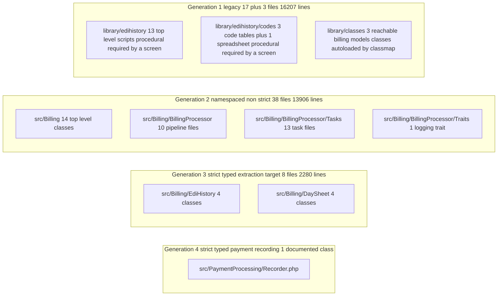
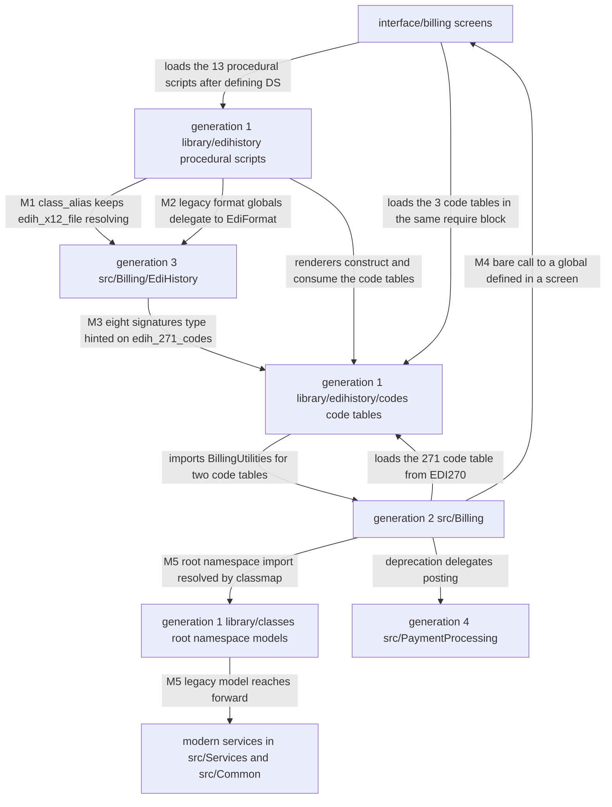
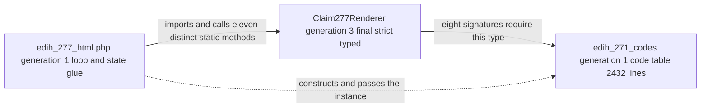
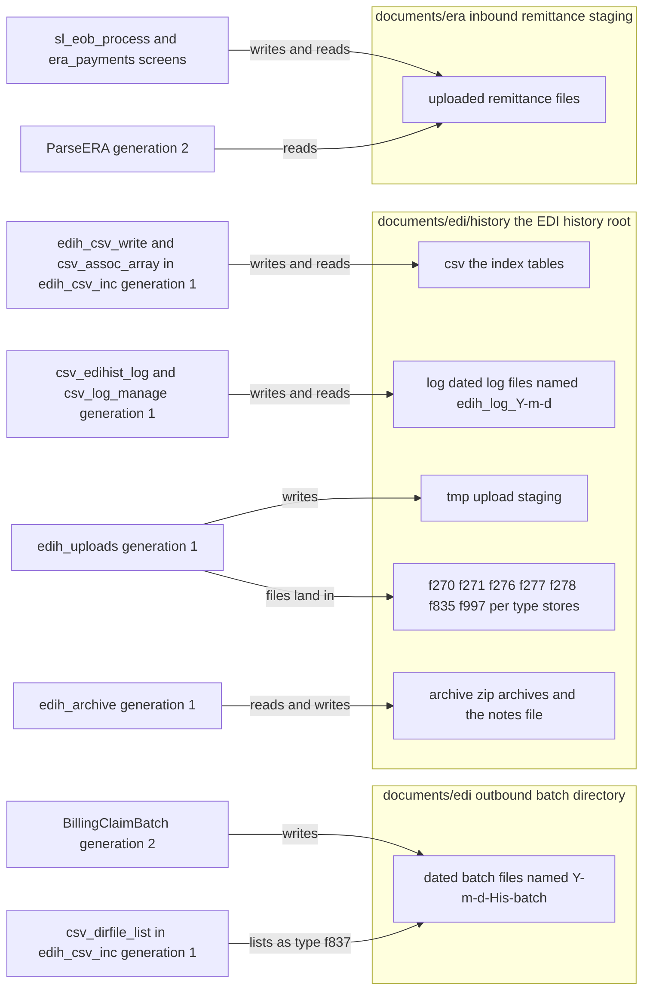

# OpenEMR Revenue Cycle and X12 EDI Architecture

The subsystem named in the title above is OpenEMR's revenue cycle together with its handling of X12, the electronic data interchange (EDI) standard that United States healthcare payers, providers and clearinghouses use to exchange claims, eligibility questions and payments; this document explains why several versions of that subsystem coexist in this tree, how to tell which one you are looking at, and how they call one another.

**Scope and sources.** This document assigns all 67 in-scope files of that revenue-cycle and X12 EDI subsystem to an architectural generation, documents the five mechanisms by which those generations invoke each other, records the on-disk storage topology, and keeps the ledger of what has been extracted from the legacy tree so far. It was traced from `src/Billing/` (46 files), `library/edihistory/` (17 files), three reachable models in `library/classes/`, one class in `src/PaymentProcessing/` documented at boundary level, and the autoload configuration in `composer.json`. Those file counts are this run's own, taken by listing the PHP files beneath each path at the commit recorded below. The full enumeration lives in this document: every one of the 67 files appears with its line count, and with a note where it has nothing else notable about it, in [Component to Generation Map](#component-to-generation-map). [README.md](README.md) carries the four-row surface summary of the same total, and is the index for the set rather than the per-file enumeration. Each of the five interoperation mechanisms is anchored where it is described below rather than here. Every X12 term this document uses is expanded in [The X12 vocabulary used in this document](#the-x12-vocabulary-used-in-this-document); conventions, claim classes and the source-of-truth ordering are defined once in [README.md](README.md) and are used here without variation.

**Provenance.** Every line anchor below is relative to branch `master` at head commit `b7a7e690e419de3451740f995b768a8e8e5fba87`, on project version 8.3.0-dev (`version.php:L17-L20`). No code was executed to produce this document: PHP and Composer are not installed in the authoring environment, so every claim rests on static reading of file contents at that commit. Counts were derived by enumeration rather than carried over from any existing document.

## Table of Contents

- [Why Four Generations Coexist](#why-four-generations-coexist)
    - [The X12 vocabulary used in this document](#the-x12-vocabulary-used-in-this-document)
    - [How to tell which generation you are in](#how-to-tell-which-generation-you-are-in)
- [The Four Generations](#the-four-generations)
    - [The objective marker](#the-objective-marker)
    - [How the project itself describes the split](#how-the-project-itself-describes-the-split)
    - [What final means and does not mean here](#what-final-means-and-does-not-mean-here)
    - [Why generation four matters concretely](#why-generation-four-matters-concretely)
- [Component to Generation Map](#component-to-generation-map)
    - [Generation 2 top level classes in src/Billing](#generation-2-top-level-classes-in-srcbilling)
    - [Generation 2 the batch pipeline](#generation-2-the-batch-pipeline)
    - [Generation 2 the task family](#generation-2-the-task-family)
    - [Generation 3 the strict typed classes](#generation-3-the-strict-typed-classes)
    - [Generation 1 the legacy edihistory tree](#generation-1-the-legacy-edihistory-tree)
    - [Generation 1 the reachable library classes](#generation-1-the-reachable-library-classes)
    - [Generation 4 the payment recording class](#generation-4-the-payment-recording-class)
    - [Files inside src/Billing that are not on the X12 path](#files-inside-srcbilling-that-are-not-on-the-x12-path)
    - [Coverage arithmetic](#coverage-arithmetic)
- [The Five Interoperation Mechanisms](#the-five-interoperation-mechanisms)
    - [Mechanism 1 the class_alias shim](#mechanism-1-the-class_alias-shim)
    - [Mechanism 2 the global function backfill](#mechanism-2-the-global-function-backfill)
    - [Mechanism 3 modern signatures type hinted on legacy classes](#mechanism-3-modern-signatures-type-hinted-on-legacy-classes)
    - [Mechanism 4 implicit globals invisible to static analysis](#mechanism-4-implicit-globals-invisible-to-static-analysis)
    - [Mechanism 5 the Composer autoload configuration](#mechanism-5-the-composer-autoload-configuration)
    - [How little of this is an explicit include](#how-little-of-this-is-an-explicit-include)
- [Extraction Status Ledger](#extraction-status-ledger)
- [The Dependency Cycle the Extraction Created](#the-dependency-cycle-the-extraction-created)
- [Storage Topology](#storage-topology)
- [Three Parallel Trading Partner Loaders](#three-parallel-trading-partner-loaders)
- [The Paper CMS 1500 Channel](#the-paper-cms-1500-channel)
- [Agreements and Contradictions with Existing Documentation](#agreements-and-contradictions-with-existing-documentation)
    - [The 2016 legacy readme](#the-2016-legacy-readme)
    - [The architecture stub](#the-architecture-stub)
    - [The developer guide](#the-developer-guide)
    - [Comment versus code contradictions inside the subsystem](#comment-versus-code-contradictions-inside-the-subsystem)
- [Inference Register](#inference-register)
- [Documentation Attribution](#documentation-attribution)

## Why Four Generations Coexist

VERIFIED: four bodies of code that do overlapping jobs are all present in the repository, and all four are reachable inside a single request. Reachability is not a figure of speech here: the modern trees are autoloaded by the mapping at `composer.json:L173-L176`, the legacy classes by the classmap at `composer.json:L177-L179`, eight legacy global-function files on every single request by the eager list at `composer.json:L180-L189`, and the whole legacy procedural tree by the sixteen `require_once` statements the operator screen issues in one block at `interface/billing/edih_main.php:L71-L86`. None of the three older bodies has been emptied in favour of a newer one: each still holds code that executes, and the three compatibility artifacts cited two paragraphs below are all still in place.

INFERRED (confidence: High): the subsystem reached this shape by accretion rather than by replacement, each effort wrapping or partially lifting its predecessor while keeping the older call sites working. Basis: three independent compatibility artifacts, each of which is described as exactly that by its own source text and each of which is still present and still reachable, cited in the next paragraph.

No document in the repository records that history, so it can only be reconstructed from what the migrations left in the tree. VERIFIED: a 21-line file exists whose entire body is one `class_alias` call, and whose own docblock says the class was lifted out and that the file remains so that procedural callers keep resolving the old name (`library/edihistory/edih_x12file_class.php:L3-L17`, `library/edihistory/edih_x12file_class.php:L21`). VERIFIED: three global formatting functions still exist but now do nothing except forward to a class, with a comment on each saying so (`library/edihistory/edih_csv_inc.php:L1070-L1075`, `library/edihistory/edih_csv_inc.php:L1084-L1089`, `library/edihistory/edih_csv_inc.php:L1098-L1103`). VERIFIED: a method on a deprecated posting helper still exists but constructs a class from a different namespace and hands the work over (`src/Billing/SLEOB.php:L221`, `src/Billing/SLEOB.php:L234-L247`).

Those three artifacts are not the same kind of thing, and the difference decides how much work removing one costs. VERIFIED: the first two are pure forwarding and hold no logic of their own. The alias file declares no class at all; its whole body is the single `class_alias` statement at `library/edihistory/edih_x12file_class.php:L21`. Each of the three global formatters is a one-line `return` of the corresponding static method, at `library/edihistory/edih_csv_inc.php:L1074`, `library/edihistory/edih_csv_inc.php:L1088` and `library/edihistory/edih_csv_inc.php:L1102`, with no branch, no default and no reshaping of the argument.

VERIFIED: the third is not pure forwarding, and a reader planning a migration needs the distinction. The two deprecated posting helpers transform their arguments before delegating, and each transformation is behaviour that would be lost if the method were deleted rather than rewritten. Both split a `code:modifier` string on its first colon into two separate fields, at `src/Billing/SLEOB.php:L134-L140` and `src/Billing/SLEOB.php:L225-L231`. Both read the posting user from the active session rather than taking it as a parameter, at `src/Billing/SLEOB.php:L142` and `src/Billing/SLEOB.php:L233`. Both synthesise the complementary monetary field as the literal string `'0.0'`, so a payment is recorded with a zero adjustment at `src/Billing/SLEOB.php:L156` and an adjustment is recorded with a zero payment at `src/Billing/SLEOB.php:L244`. And both rename the remaining positional arguments into the keyed payload the newer method expects, at `src/Billing/SLEOB.php:L143-L158` and `src/Billing/SLEOB.php:L234-L247`, including mapping the adjustment reason onto the same payload key the payment path uses for its memo, at `src/Billing/SLEOB.php:L246`.

VERIFIED: the division of responsibility between the two generations is therefore split rather than clean. Generation 4 owns the write and its transaction, at `src/PaymentProcessing/Recorder.php:L143` and `src/PaymentProcessing/Recorder.php:L169`; generation 2 still owns the parameter-transformation contract that turns legacy call-site arguments into that payload. A refactor that retired these two methods and pointed their callers straight at the newer class would have to reproduce all four transformations, or it would change what is written to accounts receivable without changing anything a caller can see.

INFERRED (confidence: High): each of those three is a migration that stopped once backward compatibility was secured, with the removal of the old entry point left for later. Basis: in all three cases the source text at the cited lines states that the work moved elsewhere while the old entry point is still exported and still called; what remains differs between them, being only the forwarding in the first two and the forwarding plus an argument-shaping layer in the third.

One consequence for a reader is concrete enough to state before the map itself: two components can hold two versions of the same arithmetic, and only one of them is on the path that touches money. VERIFIED: the generation-3 balance test adds provider-level adjustments into the accounted total at `src/Billing/EdiHistory/RemitAccounting.php:L29`, while the generation-2 remittance parser excludes them from accounts receivable at `src/Billing/ParseERA.php:L429-L431`; the only caller of that balance test is the legacy history viewer at `library/edihistory/edih_835_html.php:L1291`, so that balance test is never on the code path that writes accounts receivable. The rule and the discrepancy themselves belong to [business-rules.md](business-rules.md) and [defect-candidates.md](defect-candidates.md). This document therefore comes before the lifecycle document: following a claim through the system requires first knowing which copy of a component the request reached.

### The X12 vocabulary used in this document

X12, expanded in the purpose statement above as the electronic data interchange (EDI) standard used between United States healthcare payers, providers and clearinghouses, encodes each exchange as a flat text file of segments; a transaction set inside such a file is identified by a number. The numbers and segment identifiers below appear throughout this document, and each is expanded here rather than assumed, because the audience for this set is assumed to know PHP and SQL and not to know X12. This table is the document's own glossary, so a reader who arrives here by search rather than from the top has every term in one place.

| Term | Expansion | Relevance here |
|------|-----------|----------------|
| 837 | Health care claim | The outbound claim transaction set; this subsystem builds two flavours of it, from two separate entry points (`src/Billing/X125010837P.php:L40`, `src/Billing/X125010837I.php:L26`) |
| 837P | 837 professional | Professional claims, built by `genX12837P()` at `src/Billing/X125010837P.php:L40` |
| 837I | 837 institutional | Institutional claims, built by `generateX12837I()` at `src/Billing/X125010837I.php:L26` |
| 835 | Health care claim payment and remittance advice | The inbound payment transaction set, parsed by `parseERA()` at `src/Billing/ParseERA.php:L85` |
| 270 | Eligibility, coverage or benefit inquiry | The outbound eligibility question, assembled segment by segment at `src/Billing/EDI270.php:L50-L307` and dispatched from `src/Billing/EDI270.php:L379` |
| 271 | Eligibility, coverage or benefit information | The inbound eligibility answer, parsed at `src/Billing/EDI270.php:L927` and rendered at `library/edihistory/edih_271_html.php:L568` |
| 276 | Health care claim status request | The outbound status question. It is recognised by the dispatch map (`src/Billing/EdiHistory/X12File.php:L101`) and given a request-date column in the file index (`library/edihistory/edih_csv_inc.php:L745-L746`), but nothing in the documented surface constructs one |
| 277 | Health care claim status notification | The inbound status answer, rendered at `library/edihistory/edih_277_html.php:L271`. It covers the 277CA claim acknowledgement variant too: the parser reads the transaction-type code out of the BHT segment and branches on it, treating `TH` as the acknowledgement flavour, at `library/edihistory/edih_csv_parse.php:L513-L519`, and the legacy code table defines `TH` as a receipt acknowledgement at `library/edihistory/codes/edih_271_code_class.php:L62` |
| 278 | Health care services review information | Authorisation and referral. Recognised by the dispatch map (`src/Billing/EdiHistory/X12File.php:L102`) and rendered at `library/edihistory/edih_278_html.php:L39`, but never generated here |
| 997 | Functional acknowledgement | The older syntactic acknowledgement of a transmitted file, read for rejections at `library/edihistory/edih_997_error.php:L320` |
| 999 | Implementation acknowledgement | The current syntactic acknowledgement. The dispatch map routes functional group `FA` to it (`src/Billing/EdiHistory/X12File.php:L102`) and one branch accepts either number (`src/Billing/EdiHistory/X12File.php:L827`), which is why it is documented together with the 997 |
| ISA and IEA | Interchange control header and trailer | The outermost envelope of an X12 file, emitted first by both generators (`src/Billing/X125010837P.php:L60`, `src/Billing/X125010837I.php:L44`) |
| GS and GE | Functional group header and trailer | The group envelope (`src/Billing/X125010837P.php:L79`, `src/Billing/X125010837I.php:L64`); its GS01 code is what this subsystem dispatches on (`src/Billing/EdiHistory/X12File.php:L101-L102`) |
| ST and SE | Transaction set header and trailer | The envelope around one transaction (`src/Billing/X125010837P.php:L101`, `src/Billing/X125010837I.php:L76`) |
| BHT | Beginning of hierarchical transaction | Emitted immediately after ST (`src/Billing/X125010837P.php:L108-L115`, `src/Billing/X125010837I.php:L83`); its third element is the value the file index stores as the trace that ties a claim back to its batch (`library/edihistory/edih_csv_parse.php:L322`, `library/edihistory/edih_csv_parse.php:L331`) |

Two of these are worth flagging now because they shape the architecture rather than just the file format. The functional group code in GS01 is the value this subsystem uses to decide what kind of file it is holding, from a map of eight codes at `src/Billing/EdiHistory/X12File.php:L101-L102`; that single map is why [transactions.md](transactions.md) is organised by transaction type. And the 837 has no legacy renderer at all - `library/edihistory/` contains no file whose name mentions 837, and an 837 opened in the history browser falls through to the generic segment display rather than to a renderer of its own (`library/edihistory/edih_io.php:L399-L401`) - so outbound claim construction is handled only in generation 2 while much of the inbound rendering is still done in generation 1.

### How to tell which generation you are in

Three checks, in order, answer the question for any file in the subsystem.

1. **Is it under `library/`?** Then it is generation 1. Under `library/edihistory/` it is procedural and not autoloaded at all, so it is reachable only once something has explicitly required it: usually a screen, as the sixteen `require_once` statements at `interface/billing/edih_main.php:L71-L86` do, and in one case a generation-2 class, at `src/Billing/EDI270.php:L35`. Under `library/classes/` it is a root-namespace class that is autoloaded, because the classmap at `composer.json:L177-L179` names that directory and no other.
2. **Is it under `src/` without `declare(strict_types=1)`?** Then it is generation 2: namespaced and autoloaded, but written in the same coding idiom as the procedural code it replaced.
3. **Is it under `src/` with `declare(strict_types=1)`?** Then it is generation 3 or 4, distinguished only by namespace: `OpenEMR\Billing\EdiHistory` and `OpenEMR\Billing\DaySheet` are generation 3, `OpenEMR\PaymentProcessing` is generation 4.

The following block map answers one question: which trees hold which generation, and how big is each. It carries no dependency edges, because the ways the generations reach one another are the subject of [The Five Interoperation Mechanisms](#the-five-interoperation-mechanisms) and of the diagram there. The three links between the blocks are layout-only invisible links whose sole effect is to stack the four blocks vertically so the labels stay readable; they assert nothing.



The figures in that diagram are the in-scope figures, and they are the sum of the per-file counts published in [Component to Generation Map](#component-to-generation-map): generation 1 is the 17 files of `library/edihistory/` at 14,979 PHP lines plus the three `library/classes/` models at 1,228 lines; generation 2 is the 14 top-level `src/Billing/` files at 10,945 lines plus 10 pipeline files at 1,225, 13 task files at 1,693 and one trait at 43; generation 3 is `src/Billing/EdiHistory/` at 2,054 lines plus `src/Billing/DaySheet/` at 226. Generation 4 contributes one documented file, `src/PaymentProcessing/Recorder.php` at 228 lines, and it is a concrete implementation documented here at boundary level: what this set records is the surface its methods present to the revenue cycle, not their internals. The namespace it belongs to holds 14 files and 1,846 lines in total, of which 10 declare strict types.

## The Four Generations

| Generation | Location | Idiom | Objective marker | Files | PHP lines | Strict-typed |
|------------|----------|-------|------------------|------:|----------:|-------------:|
| 1 | `library/edihistory/`, `library/edihistory/codes/`, `library/classes/` | Procedural functions in the two `edihistory` directories, root-namespace classes in `library/classes/`; two different loading routes, described below the table | Not under `src/`; no namespace declaration | 20 | 16,207 | 1 |
| 2 | `src/Billing/` top level, `BillingProcessor/`, `BillingProcessor/Tasks/`, `BillingProcessor/Traits/` | Namespaced and autoloaded, but untyped signatures, static entry points and reference parameters | Under `src/`, no `declare(strict_types=1)` | 38 | 13,906 | 0 |
| 3 | `src/Billing/EdiHistory/`, `src/Billing/DaySheet/` | Strict-typed classes with static methods and value objects | `declare(strict_types=1)` | 8 | 2,280 | 8 |
| 4 | `src/PaymentProcessing/` | Strict-typed service classes | `declare(strict_types=1)` plus the `OpenEMR\PaymentProcessing` namespace | 1 documented of 14 | 228 documented of 1,846 | 1 documented of 10 in the namespace |

Sources for the table: the file and line counts are enumerated per file in [Component to Generation Map](#component-to-generation-map); the strict-types counts are the presence of `declare(strict_types=1)` in each file, for example `src/Billing/EdiHistory/X12File.php:L20`, `src/Billing/EdiHistory/EdiFormat.php:L22`, `library/edihistory/edih_x12file_class.php:L19` and `src/PaymentProcessing/Recorder.php:L11`. Each idiom in the third column is one representative anchor away as well: generation 1 as bare procedural functions at `library/edihistory/edih_271_html.php:L568` and as root-namespace classes at `library/classes/X12Partner.class.php:L17`; generation 2 as a static entry point whose parameters are untyped and one of which is taken by reference, at `src/Billing/X125010837I.php:L26`; generation 3 as static methods with fully typed signatures at `src/Billing/EdiHistory/Claim277Renderer.php:L282` and as immutable value objects at `src/Billing/DaySheet/BillRow.php:L17`; and generation 4 as a namespaced service class at `src/PaymentProcessing/Recorder.php:L22-L23`.

Two entries in that table need their own paragraph, because a single figure would misreport them.

**Generation 1 is loaded two different ways, and only one of them is an include.** The procedural tree has no autoloading at all, so a file in it exists for a request only once something has required it, and the requires come from two places rather than one. The operator screen is the sole bulk loader: it requires all sixteen PHP files of `library/edihistory/` in a single block at `interface/billing/edih_main.php:L71-L86`, and it is also the only production loader of the compatibility alias, which it requires at `interface/billing/edih_main.php:L73` and which is required nowhere else in the repository. One generation-2 class loads independently of that screen: `src/Billing/EDI270.php:L35` requires the 271 code table at file scope, so that one file of the sixteen is reachable from the eligibility path with no screen involved, which is why the eligibility builder can resolve its `edih_271_codes` import at `src/Billing/EDI270.php:L27` outside the history browser entirely. The three root-namespace models in `library/classes/` are the opposite case: they are autoloaded with no `require` anywhere in the consuming file, because the classmap at `composer.json:L177-L179` names that directory, as [Mechanism 5](#mechanism-5-the-composer-autoload-configuration) sets out. Keeping the two routes apart matters in practice, because the include-only route explains behaviour that otherwise looks arbitrary, including why the compatibility alias described in [Mechanism 1](#mechanism-1-the-class_alias-shim) exists only after that screen has been entered, while the classmapped route explains how a generation-2 file can construct a generation-1 class with nothing in its header to say so.

**Generation 1 contains one strict-typed file, and it holds no code.** That file is the compatibility alias `library/edihistory/edih_x12file_class.php`, which declares strict types at `library/edihistory/edih_x12file_class.php:L19` and whose entire body is the single `class_alias` statement at `library/edihistory/edih_x12file_class.php:L21`. It is counted in the table because the marker is applied mechanically and exceptions would defeat that, and it is called out here because it is the one place the marker does not indicate authorship era. The file in its present form is an artifact of the extraction rather than legacy code that acquired strict types: the commit that emptied it, `2aa354729` of 2026-04-28, is the one that lifted the class body to `OpenEMR\Billing\EdiHistory\X12File`, and the docblock it left behind says exactly that at `library/edihistory/edih_x12file_class.php:L3-L17`. It declares no class, so no behaviour anywhere is type-checked as a result of it.

### The objective marker

Generations are assigned in this document by the presence or absence of `declare(strict_types=1)`, not by reading style. The marker partitions the modern billing tree exactly: it appears in 8 of the 46 files under `src/Billing/`, and those eight are precisely the four classes in `src/Billing/EdiHistory/` and the four in `src/Billing/DaySheet/`, with no exceptions in either direction. A reader can re-derive the entire generation-2 versus generation-3 split with one search for that declaration, which is why it is used here in preference to any judgement about code quality or age.

The marker's reach outside `src/Billing/` is smaller and is stated here so the 8-of-46 figure is not mistaken for the whole census. Across the 67 files this document covers, ten declare strict types: those eight, plus the alias `library/edihistory/edih_x12file_class.php:L19` and the payment recorder `src/PaymentProcessing/Recorder.php:L11`. None of the three `library/classes/` models declares it.

INFERRED (confidence: High): within `src/Billing/` the declaration marks authorship era rather than a per-file stylistic choice. Basis: it partitions 46 files exactly along directory boundaries with no mixed directory, which a per-file preference would not produce. The reading is scoped to `src/Billing/` on purpose, because the tenth file carrying the marker is the alias shim, whose present form dates from the extraction rather than from the legacy tree's own authorship.

### How the project itself describes the split

The repository states the `src/` versus `library/` versus `interface/` division in its own contributor guidance, inside a fenced block under `## Project Structure` at `CLAUDE.md:L3`. Quoted verbatim from `CLAUDE.md:L6-L8`:

```text
/src/              - Modern PSR-4 code (OpenEMR\ namespace)
/library/          - Legacy procedural PHP code
/interface/        - Web UI controllers and templates
```

The same document restates the rule as a directive rather than a description at `CLAUDE.md:L346-L347`, where it requires PSR-4 namespacing under `OpenEMR\` for `/src/` and says new code goes in `/src/` while legacy helpers go in `/library/`. The first anchor is quoted verbatim above and the second is cited and summarised, because together they are the only in-repository statement of the boundary that this document's generation model rests on. Neither file is modified by this documentation run.

### What final means and does not mean here

Generation 3 is often described as a set of strict-typed final classes. That is half right, and the half that is wrong carries an implication about extension that does not hold.

Two of the four are final: `final class Claim277Renderer` at `src/Billing/EdiHistory/Claim277Renderer.php:L30` and `final class EdiFormat` at `src/Billing/EdiHistory/EdiFormat.php:L26`. Both additionally declare a private constructor, at `src/Billing/EdiHistory/Claim277Renderer.php:L32-L34` and `src/Billing/EdiHistory/EdiFormat.php:L28-L30`, so neither can be extended nor instantiated.

Two are not final: `class X12File` at `src/Billing/EdiHistory/X12File.php:L82` and `class RemitAccounting` at `src/Billing/EdiHistory/RemitAccounting.php:L17`. `X12File` is instantiable by design, since legacy code constructs it through the compatibility alias, for instance at `library/edihistory/edih_csv_inc.php:L590`. `RemitAccounting` exposes a single static method, `isBalanced()` at `src/Billing/EdiHistory/RemitAccounting.php:L27`, and declares no constructor at all.

INFERRED (confidence: Medium): the non-finality of `RemitAccounting` is an omission rather than a decision. Basis: the two final classes both also declare private constructors as a deliberate no-extension stance, while `RemitAccounting` has only static members and would lose nothing by matching them.

The other four generation-3 files, in `src/Billing/DaySheet/`, are all strict-typed and all final, and two are additionally readonly: `final class DaySheetAggregator` at `src/Billing/DaySheet/DaySheetAggregator.php:L23`, `final class SlotTotals` at `src/Billing/DaySheet/SlotTotals.php:L17`, `final readonly class BillRow` at `src/Billing/DaySheet/BillRow.php:L17` and `final readonly class DaySheetTotals` at `src/Billing/DaySheet/DaySheetTotals.php:L17`. So the "strict-typed final classes" description holds for the day-sheet half of generation 3 without qualification and for the EDI half only in part.

### Why generation four matters concretely

The subsystem is commonly described as having three generations. It has four, and the fourth is not a curiosity: it is the current destination of an extraction that is already under way.

VERIFIED: the legacy accounts-receivable adjustment poster is marked deprecated in favour of a class in a different namespace, at `src/Billing/SLEOB.php:L221`, which reads `@deprecated Use \OpenEMR\PaymentProcessing\Recorder::recordActivity directly`. The same method already does exactly that, constructing the recorder and delegating to it at `src/Billing/SLEOB.php:L234-L247`, having imported it at `src/Billing/SLEOB.php:L20`. The destination namespace holds 14 files and 1,846 lines, of which 10 declare strict types.

The consequence is practical rather than taxonomic. VERIFIED: every responsibility the [Extraction Status Ledger](#extraction-status-ledger) records as lifted out of `library/` landed somewhere under `src/Billing/`, while the accounts-receivable delegation at `src/Billing/SLEOB.php:L143-L158` and `src/Billing/SLEOB.php:L234-L247` goes to `src/PaymentProcessing/` instead. A model with only three generations, all of them inside `src/Billing/`, has no name for that second destination, so recording generation 4 is what lets [extraction-roadmap.md](extraction-roadmap.md) name the target the project has already chosen for this responsibility.

INFERRED (confidence: Medium): `Recorder` is intended as the destination for accounts-receivable recording generally, not only for adjustments. Basis: the deprecation notice names `recordActivity` without qualification, and the method it deprecates is one of several posting helpers in the same class.

## Component to Generation Map

Every one of the 67 in-scope files appears below with its generation, its line count and one line about what it is for. Files with nothing notable about them are still listed with that one line, because an omission is indistinguishable from an oversight. Line counts were taken at the recorded commit; they are given so that the size distribution is visible in the same table as the generation. Risk classification itself, which combines size with change history, inbound coupling and test coverage, is the subject of [upgrade-risk-map.md](upgrade-risk-map.md) and is not attempted here.

### Generation 2 top level classes in src/Billing

Fourteen files, 10,945 lines. This is where most of the subsystem's behaviour lives, and none of it declares strict types.

| File | Lines | Responsibility |
|------|------:|----------------|
| `src/Billing/Claim.php` | 2,287 | The claim data model both 837 generators read; loads the trading partner at `src/Billing/Claim.php:L162` and instantiates a generation-1 payer class at `src/Billing/Claim.php:L289` |
| `src/Billing/BillingUtilities.php` | 1,996 | The claim write path - `addBilling()` at `src/Billing/BillingUtilities.php:L1434` inserts the charge row and `updateClaim()` at `src/Billing/BillingUtilities.php:L1522` advances its state - plus large hardcoded X12 code tables: claim status at `src/Billing/BillingUtilities.php:L22`, claim adjustment reasons at `src/Billing/BillingUtilities.php:L42` and remittance advice remarks at `src/Billing/BillingUtilities.php:L336` |
| `src/Billing/X125010837P.php` | 1,640 | Builds the 837P professional claim; entry point `genX12837P()` at `src/Billing/X125010837P.php:L40` |
| `src/Billing/X125010837I.php` | 1,225 | Builds the 837I institutional claim over the UB-04 array; entry point `generateX12837I()` at `src/Billing/X125010837I.php:L26` |
| `src/Billing/EDI270.php` | 1,162 | Builds the 270 eligibility inquiry from `src/Billing/EDI270.php:L379` and parses the 271 response at `src/Billing/EDI270.php:L927`, including the real-time HTTP path at `src/Billing/EDI270.php:L776` |
| `src/Billing/Hcfa1500.php` | 762 | Builds the paper CMS-1500 claim form; entry point `genHcfa1500()` at `src/Billing/Hcfa1500.php:L146`. Not an X12 path, see [The Paper CMS 1500 Channel](#the-paper-cms-1500-channel) |
| `src/Billing/ParseERA.php` | 561 | Parses the inbound 835 remittance advice from `src/Billing/ParseERA.php:L85` and drives posting through a callback it invokes per claim at `src/Billing/ParseERA.php:L144` and once at end of file at `src/Billing/ParseERA.php:L553` |
| `src/Billing/BillingReport.php` | 308 | Query and display helpers for the billing report screen - the shared query fragment at `src/Billing/BillingReport.php:L24` and the report-array builder at `src/Billing/BillingReport.php:L263` - consumed by that screen at `interface/billing/billing_report.php:L67`. Not an X12 path |
| `src/Billing/SLEOB.php` | 304 | Accounts-receivable posting helpers; carries the generation-4 deprecation at `src/Billing/SLEOB.php:L221` and one of the subsystem's two `library/` includes at `src/Billing/SLEOB.php:L17` |
| `src/Billing/InvoiceSummary.php` | 255 | Per-invoice charge and payment summary, class declared at `src/Billing/InvoiceSummary.php:L43`; consumed by the EOB posting screen at `interface/billing/sl_eob_process.php:L25` |
| `src/Billing/MiscBillingOptions.php` | 161 | Date-qualifier entries for the CMS-1500 boxes 14 and 15: the select builder at `src/Billing/MiscBillingOptions.php:L56` and the qualifier-to-description lookup at `src/Billing/MiscBillingOptions.php:L139`, supporting both the paper form and claim-level billing attributes |
| `src/Billing/PaymentGateway.php` | 152 | Credit-card gateway support; selects the gateway implementation at `src/Billing/PaymentGateway.php:L135` and is instantiated only by the front-desk payment screen at `interface/patient_file/front_payment_cc.php:L27`. Not an X12 path and not part of the claim lifecycle |
| `src/Billing/HCFAInfo.php` | 78 | Row and column bookkeeping for the CMS-1500 form: it reduces a row and column to one sortable position at `src/Billing/HCFAInfo.php:L60-L63` and compares two entries on it at `src/Billing/HCFAInfo.php:L72-L77`, which is what lets the form be composed out of page order and sorted afterwards at `src/Billing/Hcfa1500.php:L105`. Not an X12 path |
| `src/Billing/InsurancePolicyTypes.php` | 54 | Hardcoded policy-type codes, declared as constants from `src/Billing/InsurancePolicyTypes.php:L21`; see the note below, because its consumers are not what its docblock suggests |

`src/Billing/InsurancePolicyTypes.php` needs one extra line, because it is easy to misfile. Its docblock states the values are fixed by the 837P standard (`src/Billing/InsurancePolicyTypes.php:L3-L5`) and an inline comment repeats the point (`src/Billing/InsurancePolicyTypes.php:L19-L20`), which suggests a claim-generation dependency. VERIFIED: no in-scope X12 generator reads it. Its only consumers are an insurance display card at `src/Patient/Cards/InsuranceViewCard.php:L37`, a coverage validator at `src/Validators/CoverageValidator.php:L156`, and a legacy patient include at `library/patient.inc.php:L54`. It declares codes defined by the 837P standard without being on the 837P write path.

### Generation 2 the batch pipeline

Ten files, 1,225 lines, in `src/Billing/BillingProcessor/`. Four of the ten are interfaces, which makes this the most explicitly designed part of the subsystem.

| File | Lines | Declaration | Responsibility |
|------|------:|-------------|----------------|
| `src/Billing/BillingProcessor/BillingClaimBatch.php` | 280 | `class` at `src/Billing/BillingProcessor/BillingClaimBatch.php:L25` | The batch file: accumulates claims, rewrites the envelope and writes the file to disk |
| `src/Billing/BillingProcessor/BillingClaim.php` | 239 | `class` implementing `\JsonSerializable` at `src/Billing/BillingProcessor/BillingClaim.php:L20` | One claim as submitted from the billing manager screen, including its per-partner routing data |
| `src/Billing/BillingProcessor/BillingProcessor.php` | 223 | `class` at `src/Billing/BillingProcessor/BillingProcessor.php:L49` | Takes the billing manager's input, selects the task and runs it over the claim set |
| `src/Billing/BillingProcessor/X12RemoteTracker.php` | 216 | `class` extending `BaseService` at `src/Billing/BillingProcessor/X12RemoteTracker.php:L22` | The transport outbox and its status vocabulary for remote submission |
| `src/Billing/BillingProcessor/BillingLogger.php` | 140 | `class` at `src/Billing/BillingProcessor/BillingLogger.php:L42` | Logging extracted from the original procedural batch script |
| `src/Billing/BillingProcessor/BillingClaimBatchControlNumber.php` | 31 | `class` at `src/Billing/BillingProcessor/BillingClaimBatchControlNumber.php:L20` | Allocates the two envelope control numbers for a batch from the same database sequence, differing only in padding: the interchange number is left-padded with zeros to nine characters at `src/Billing/BillingProcessor/BillingClaimBatchControlNumber.php:L22-L25`, and the functional-group number is returned unpadded at `src/Billing/BillingProcessor/BillingClaimBatchControlNumber.php:L27-L30` |
| `src/Billing/BillingProcessor/LoggerInterface.php` | 26 | `interface` at `src/Billing/BillingProcessor/LoggerInterface.php:L17` | Lets a processing task write to the billing log; default implementation is the trait below |
| `src/Billing/BillingProcessor/GeneratorInterface.php` | 25 | `interface` extending `ProcessingTaskInterface` at `src/Billing/BillingProcessor/GeneratorInterface.php:L18` | The contract for tasks that produce an output file |
| `src/Billing/BillingProcessor/GeneratorCanValidateInterface.php` | 23 | `interface` at `src/Billing/BillingProcessor/GeneratorCanValidateInterface.php:L16` | Optional contract for a generator that can validate before generating |
| `src/Billing/BillingProcessor/ProcessingTaskInterface.php` | 22 | `interface` at `src/Billing/BillingProcessor/ProcessingTaskInterface.php:L15` | The contract every processing task implements |

### Generation 2 the task family

Thirteen files, 1,693 lines, in `src/Billing/BillingProcessor/Tasks/`: eleven concrete tasks and two abstract bases. The concrete tasks are where the choice of output format is made, so this table doubles as the map from a billing-manager action to the code that produces the artifact.

| File | Lines | Kind | What it produces or does |
|------|------:|------|--------------------------|
| `src/Billing/BillingProcessor/Tasks/GeneratorX12Direct.php` | 370 | Concrete, `class` at `src/Billing/BillingProcessor/Tasks/GeneratorX12Direct.php:L34` | An 837P for direct submission, calling `X125010837P::genX12837P()` at `src/Billing/BillingProcessor/Tasks/GeneratorX12Direct.php:L241` |
| `src/Billing/BillingProcessor/Tasks/GeneratorHCFA_PDF.php` | 234 | Concrete, `class` at `src/Billing/BillingProcessor/Tasks/GeneratorHCFA_PDF.php:L30` | A CMS-1500 PDF, calling `Hcfa1500::genHcfa1500()` at `src/Billing/BillingProcessor/Tasks/GeneratorHCFA_PDF.php:L95-L96` |
| `src/Billing/BillingProcessor/Tasks/GeneratorX12.php` | 219 | Concrete, `class` at `src/Billing/BillingProcessor/Tasks/GeneratorX12.php:L35` | An 837P batch file, calling `X125010837P::genX12837P()` at `src/Billing/BillingProcessor/Tasks/GeneratorX12.php:L70` |
| `src/Billing/BillingProcessor/Tasks/GeneratorHCFA.php` | 179 | Concrete, `class` at `src/Billing/BillingProcessor/Tasks/GeneratorHCFA.php:L29` | CMS-1500 text output, calling `Hcfa1500::genHcfa1500()` at `src/Billing/BillingProcessor/Tasks/GeneratorHCFA.php:L65-L66` |
| `src/Billing/BillingProcessor/Tasks/GeneratorUB04X12.php` | 160 | Concrete, `class` at `src/Billing/BillingProcessor/Tasks/GeneratorUB04X12.php:L30` | An 837I batch file, calling `X125010837I::generateX12837I()` at `src/Billing/BillingProcessor/Tasks/GeneratorUB04X12.php:L46` |
| `src/Billing/BillingProcessor/Tasks/AbstractGenerator.php` | 115 | Abstract, `abstract class` at `src/Billing/BillingProcessor/Tasks/AbstractGenerator.php:L27` | The generator template; drives each claim through `$this->generate()` at `src/Billing/BillingProcessor/Tasks/AbstractGenerator.php:L58` |
| `src/Billing/BillingProcessor/Tasks/GeneratorUB04Form_PDF.php` | 88 | Concrete, `class` at `src/Billing/BillingProcessor/Tasks/GeneratorUB04Form_PDF.php:L28` | A UB-04 form PDF, using the procedural helpers `ub04_dispose()` at `src/Billing/BillingProcessor/Tasks/GeneratorUB04Form_PDF.php:L42` and `get_ub04_array()` at `src/Billing/BillingProcessor/Tasks/GeneratorUB04Form_PDF.php:L52` |
| `src/Billing/BillingProcessor/Tasks/GeneratorHCFA_PDF_IMG.php` | 67 | Concrete, `class` at `src/Billing/BillingProcessor/Tasks/GeneratorHCFA_PDF_IMG.php:L30` extending `GeneratorHCFA_PDF` | The same CMS-1500 PDF with the form image behind it, at `src/Billing/BillingProcessor/Tasks/GeneratorHCFA_PDF_IMG.php:L48-L49` |
| `src/Billing/BillingProcessor/Tasks/GeneratorUB04NoForm.php` | 64 | Concrete, `class` at `src/Billing/BillingProcessor/Tasks/GeneratorUB04NoForm.php:L28` | UB-04 output without the pre-printed form, at `src/Billing/BillingProcessor/Tasks/GeneratorUB04NoForm.php:L44` and `src/Billing/BillingProcessor/Tasks/GeneratorUB04NoForm.php:L49` |
| `src/Billing/BillingProcessor/Tasks/AbstractProcessingTask.php` | 59 | Abstract, `abstract class` at `src/Billing/BillingProcessor/Tasks/AbstractProcessingTask.php:L18` | The base every task extends |
| `src/Billing/BillingProcessor/Tasks/GeneratorExternal.php` | 50 | Concrete, `class` at `src/Billing/BillingProcessor/Tasks/GeneratorExternal.php:L21` | Delegates to a site-supplied exporter, included dynamically at `src/Billing/BillingProcessor/Tasks/GeneratorExternal.php:L30-L32` and instantiated at `src/Billing/BillingProcessor/Tasks/GeneratorExternal.php:L35` |
| `src/Billing/BillingProcessor/Tasks/TaskReopen.php` | 49 | Concrete, `class` at `src/Billing/BillingProcessor/Tasks/TaskReopen.php:L21` | Reopens claims rather than generating anything: `execute()` at `src/Billing/BillingProcessor/Tasks/TaskReopen.php:L30` calls `BillingUtilities::updateClaim()` with claim status 1 and a bill-process value of 0 at `src/Billing/BillingProcessor/Tasks/TaskReopen.php:L33-L41`, and the utility turns any status of 1 or less into `billed = 0` at `src/Billing/BillingUtilities.php:L1597-L1599` |
| `src/Billing/BillingProcessor/Tasks/TaskMarkAsClear.php` | 39 | Concrete, `class` at `src/Billing/BillingProcessor/Tasks/TaskMarkAsClear.php:L20` | Marks claims as cleared rather than generating anything: `execute()` at `src/Billing/BillingProcessor/Tasks/TaskMarkAsClear.php:L29` delegates to `clearClaim()` at `src/Billing/BillingProcessor/Tasks/AbstractProcessingTask.php:L47-L58`, which passes claim status 2, and the utility turns status 2 into `billed = 1, bill_date = NOW()` at `src/Billing/BillingUtilities.php:L1592-L1596` |

`src/Billing/BillingProcessor/Traits/WritesToBillingLog.php`, 43 lines, is the single file in `src/Billing/BillingProcessor/Traits/`: the `trait` at `src/Billing/BillingProcessor/Traits/WritesToBillingLog.php:L20` that supplies the default `LoggerInterface` implementation to processing tasks.

### Generation 3 the strict typed classes

Eight files, 2,280 lines, split across two namespaces with unrelated subjects. VERIFIED: this is the generation that generation 1 calls back into, and the traffic runs both ways. The alias at `library/edihistory/edih_x12file_class.php:L21` republishes a generation-3 class under its old procedural name, the legacy 277 renderer calls generation-3 static methods between `library/edihistory/edih_277_html.php:L136` and `library/edihistory/edih_277_html.php:L229`, the hollowed-out legacy formatters forward to `EdiFormat` at `library/edihistory/edih_csv_inc.php:L1074`, `library/edihistory/edih_csv_inc.php:L1088` and `library/edihistory/edih_csv_inc.php:L1102`, and the legacy 835 renderer calls the balance test at `library/edihistory/edih_835_html.php:L1291`. Generation 1 also reaches generation 2 in one place, importing `BillingUtilities` at `library/edihistory/codes/edih_835_code_class.php:L41` to read two of its code tables at `library/edihistory/codes/edih_835_code_class.php:L216` and `library/edihistory/codes/edih_835_code_class.php:L219`; what distinguishes generation 3 is that the return traffic exists as well, which is what makes the cycle in [The Dependency Cycle the Extraction Created](#the-dependency-cycle-the-extraction-created) possible.

| File | Lines | Declaration | Responsibility |
|------|------:|-------------|----------------|
| `src/Billing/EdiHistory/X12File.php` | 1,566 | `class` at `src/Billing/EdiHistory/X12File.php:L82`, strict types at `src/Billing/EdiHistory/X12File.php:L20` | Reads and validates an X12 file; holds the functional-group dispatch map at `src/Billing/EdiHistory/X12File.php:L101-L102`. Lifted from the legacy tree, per its own docblock at `src/Billing/EdiHistory/X12File.php:L6-L9` |
| `src/Billing/EdiHistory/Claim277Renderer.php` | 373 | `final class` at `src/Billing/EdiHistory/Claim277Renderer.php:L30` | Renders 277 claim-status segments as HTML; every helper is static and eight take a generation-1 code table |
| `src/Billing/EdiHistory/EdiFormat.php` | 83 | `final class` at `src/Billing/EdiHistory/EdiFormat.php:L26` | The canonical date, money and percentage formatters for EDI display; the legacy globals now forward here |
| `src/Billing/EdiHistory/RemitAccounting.php` | 32 | `class` at `src/Billing/EdiHistory/RemitAccounting.php:L17` | `isBalanced()` at `src/Billing/EdiHistory/RemitAccounting.php:L27`: whether an 835 remittance balances, compared in integer cents at `src/Billing/EdiHistory/RemitAccounting.php:L30` |
| `src/Billing/DaySheet/BillRow.php` | 74 | `final readonly class` at `src/Billing/DaySheet/BillRow.php:L17` | One input row to the day-sheet aggregator; a constructor-promoted value object |
| `src/Billing/DaySheet/SlotTotals.php` | 69 | `final class` at `src/Billing/DaySheet/SlotTotals.php:L17` | Per-slot accumulator for the day-sheet report |
| `src/Billing/DaySheet/DaySheetAggregator.php` | 54 | `final class` at `src/Billing/DaySheet/DaySheetAggregator.php:L23` | Aggregates day-sheet rows; not an X12 path |
| `src/Billing/DaySheet/DaySheetTotals.php` | 29 | `final readonly class` at `src/Billing/DaySheet/DaySheetTotals.php:L17` | The aggregated per-user, per-provider and grand totals |

The balance test in `RemitAccounting` is the component in this table where a remittance is judged to reconcile or not. Its arithmetic and its disagreement with the parser that feeds accounts receivable are registered as a rule in [business-rules.md](business-rules.md) and as a defect candidate in [defect-candidates.md](defect-candidates.md); this document records only that the class exists, is not final, and sits in generation 3.

The four `src/Billing/DaySheet/` classes are in scope because the documented surface is all of `src/Billing/`, and they are not on the X12 path. VERIFIED: their only consumer is a report screen, which imports all three of the public ones at `interface/billing/print_daysheet_report_num1.php:L20-L22` and runs the aggregator at `interface/billing/print_daysheet_report_num1.php:L140`. The aggregator's docblock at `src/Billing/DaySheet/DaySheetAggregator.php:L5-L11` states that it replaces a fixed set of twenty per-slot accumulator variables in that same screen and that the previous code silently dropped rows past the twentieth distinct user or provider; under the source-of-truth ordering in [README.md](README.md) that docblock is evidence of intent rather than of behaviour, and the behavioural claim is not repeated here.

### Generation 1 the legacy edihistory tree

Seventeen files, of which sixteen are PHP totalling 14,979 lines. The thirteen top-level scripts are the whole of the EDI history feature: parsing, indexing, rendering, uploading and archiving.

| File | Lines | Responsibility |
|------|------:|----------------|
| `library/edihistory/edih_csv_inc.php` | 1,892 | The general-utility include: path helpers, the per-type parameter table at `library/edihistory/edih_csv_inc.php:L718-L757`, the setup routine at `library/edihistory/edih_csv_inc.php:L381`, and the formatting globals at `library/edihistory/edih_csv_inc.php:L1047-L1103` |
| `library/edihistory/edih_csv_parse.php` | 1,599 | Parses X12 files into CSV index rows, treating each interchange envelope as a separate indexed file. Each per-transaction builder loops the envelope map and keys its output by the interchange control number (`library/edihistory/edih_csv_parse.php:L265`), writes one file row per envelope carrying that number as the file's control value (`library/edihistory/edih_csv_parse.php:L282-L286`), and skips any transaction belonging to a different envelope (`library/edihistory/edih_csv_parse.php:L292-L294`); the same shape repeats in the five sibling builders at `library/edihistory/edih_csv_parse.php:L97`, `library/edihistory/edih_csv_parse.php:L436`, `library/edihistory/edih_csv_parse.php:L753`, `library/edihistory/edih_csv_parse.php:L1044` and `library/edihistory/edih_csv_parse.php:L1281` |
| `library/edihistory/edih_835_html.php` | 1,589 | Renders an 835 remittance for display, including the claim payment summary at `library/edihistory/edih_835_html.php:L25` |
| `library/edihistory/edih_archive.php` | 1,305 | The only archival routine in the subsystem: `edih_archive_main()` at `library/edihistory/edih_archive.php:L1090` turns an ageing period into a cut-off date (`library/edihistory/edih_archive.php:L1098`, computed as a month or year offset at `library/edihistory/edih_archive.php:L186-L189`), names a zip file after that date (`library/edihistory/edih_archive.php:L1106`), selects the index rows and files older than it (`library/edihistory/edih_archive.php:L1201`), splits each CSV index into rows kept and rows archived (`library/edihistory/edih_archive.php:L1206`), builds the zip (`library/edihistory/edih_archive.php:L1247`), moves the aged files out of the live directories (`library/edihistory/edih_archive.php:L1269`) and installs the archive read-only (`library/edihistory/edih_archive.php:L1283-L1284`) |
| `library/edihistory/edih_segments.php` | 1,238 | Formats raw X12 segments for display: the generic renderer at `library/edihistory/edih_segments.php:L22` walks the segment list at `library/edihistory/edih_segments.php:L39`, delegating to per-transaction builders between `library/edihistory/edih_segments.php:L57` and `library/edihistory/edih_segments.php:L961`, and the dispatcher that picks one is at `library/edihistory/edih_segments.php:L1062` |
| `library/edihistory/edih_csv_data.php` | 949 | Renders CSV index data as HTML tables. The header-ordered rendering is `edih_csv_to_html()` at `library/edihistory/edih_csv_data.php:L464`, which emits the header row at `library/edihistory/edih_csv_data.php:L607` and then one cell per key in array order at `library/edihistory/edih_csv_data.php:L625-L646`; that order is the CSV file's own header line, because the reader keys every row by the fields of the first line (`library/edihistory/edih_csv_inc.php:L1315-L1321`). Its docblock attributes that ordering to a different function in the same file, which is registered under [Comment versus code contradictions inside the subsystem](#comment-versus-code-contradictions-inside-the-subsystem) |
| `library/edihistory/edih_278_html.php` | 916 | Renders a 278 services-review file; entry point `edih_278_transaction_html()` at `library/edihistory/edih_278_html.php:L39` |
| `library/edihistory/edih_io.php` | 753 | Input and output helpers, and the only database query in the entire legacy tree, at `library/edihistory/edih_io.php:L737` |
| `library/edihistory/edih_271_html.php` | 628 | Renders a 271 eligibility response only; entry point `edih_271_html()` at `library/edihistory/edih_271_html.php:L568`, per-transaction body at `library/edihistory/edih_271_html.php:L43`. The 270 request has no HTML renderer: the branch that handles both is selected for five transaction types at `library/edihistory/edih_io.php:L413` but carries a case only for the 271 at `library/edihistory/edih_io.php:L440`, so a 270 falls through to the raw segment display at `library/edihistory/edih_io.php:L443-L445` |
| `library/edihistory/edih_uploads.php` | 576 | Upload handling, starting with the multi-file array rearrangement at `library/edihistory/edih_uploads.php:L22` |
| `library/edihistory/edih_997_error.php` | 335 | Extracts rejection information from a 997 or 999 acknowledgement, at `library/edihistory/edih_997_error.php:L41` |
| `library/edihistory/edih_277_html.php` | 307 | What remains of the 277 renderer after the case bodies were lifted out; imports the modern renderer at `library/edihistory/edih_277_html.php:L24` |
| `library/edihistory/edih_x12file_class.php` | 21 | The compatibility alias described in [Mechanism 1](#mechanism-1-the-class_alias-shim); no class body at all |
| `library/edihistory/codes/edih_271_code_class.php` | 2,432 | `class edih_271_codes` at `library/edihistory/codes/edih_271_code_class.php:L26`: the largest single file in the subsystem, and a dependency of two generations |
| `library/edihistory/codes/edih_835_code_class.php` | 264 | The code table for values unique to the 835: `class edih_835_codes` at `library/edihistory/codes/edih_835_code_class.php:L43` fills eight lists in its constructor at `library/edihistory/codes/edih_835_code_class.php:L54`, each keyed by an 835 element or segment identifier - from the payment-method element at `library/edihistory/codes/edih_835_code_class.php:L58` through the claim-status element at `library/edihistory/codes/edih_835_code_class.php:L101` to the provider-level adjustment reasons at `library/edihistory/codes/edih_835_code_class.php:L156` - and serves them through `get_835_code()` at `library/edihistory/codes/edih_835_code_class.php:L222`. Two of the eight are not local: they are imported from generation 2 at `library/edihistory/codes/edih_835_code_class.php:L216` and `library/edihistory/codes/edih_835_code_class.php:L219` |
| `library/edihistory/codes/edih_997_codes.php` | 175 | Acknowledgement error-code text, at `library/edihistory/codes/edih_997_codes.php:L37` |
| `library/edihistory/codes/code_formatter.ods` | not PHP | An OpenDocument spreadsheet sitting beside the three code tables; it contributes no lines to the 14,979 total |

INFERRED (confidence: Medium): `code_formatter.ods` is the source from which the three PHP code tables were generated. Basis: its name and its placement in the same directory as exactly those three files, with no code in the repository referencing it.

The rendering coverage of this tree is as informative for what it lacks as for what it holds, and one branch of the input and output script decides all of it. VERIFIED: HTML rendering exists for the 271 at `library/edihistory/edih_io.php:L440`, for the 277 at `library/edihistory/edih_io.php:L438`, for the 278 at `library/edihistory/edih_io.php:L442`, for the 835 at `library/edihistory/edih_io.php:L408` and `library/edihistory/edih_io.php:L411`, and for the acknowledgement family through `library/edihistory/edih_csv_data.php:L221`, which calls the report builder at `library/edihistory/edih_997_error.php:L320`. There is no HTML renderer for the 837, which is routed to the raw segment display instead at `library/edihistory/edih_io.php:L401`. There is none for the 270 and none for the 276 either: the branch that handles them is selected for all five of the 270, 271, 276, 277 and 278 types at `library/edihistory/edih_io.php:L413`, and inside it only the 277, 271 and 278 have a case, so the 270 and the 276 fall to the segment display at `library/edihistory/edih_io.php:L443-L445` under a comment stating that HTML display is not available for them. The 271 renderer is therefore a 271 renderer and nothing more, and this branch does not share it with the 270. VERIFIED: a different router does hand it a 270, without making it a 270 renderer. The whole-file display function calls it for either type at `library/edihistory/edih_io.php:L628-L629`, while the renderer's own file-level entry point loads whatever it receives as an eligibility response at `library/edihistory/edih_271_html.php:L574`, so what that route produces is a 270 read with 271 element semantics rather than a rendered 270; the per-transaction consequence is in [transactions.md](transactions.md) and the refactor consequence in [upgrade-risk-map.md](upgrade-risk-map.md). VERIFIED: no file in this tree generates an 837 either. Both generators are generation-2 files, `src/Billing/X125010837P.php` and `src/Billing/X125010837I.php`, listed under [Generation 2 top level classes in src/Billing](#generation-2-top-level-classes-in-srcbilling); a reader who cannot find a legacy 837 renderer or generator is therefore not looking at a gap in this document. The per-transaction consequences of those asymmetries are set out in [transactions.md](transactions.md).

### Generation 1 the reachable library classes

Three files, 1,228 lines, in `library/classes/`. These are root-namespace classes rather than procedural scripts, and they are reachable from modern code without any include at all, because the classmap at `composer.json:L177-L179` covers this directory, for the reason set out in [Mechanism 5](#mechanism-5-the-composer-autoload-configuration).

| File | Lines | Declaration | Responsibility |
|------|------:|-------------|----------------|
| `library/classes/X12Partner.class.php` | 496 | `class X12Partner extends ORDataObject` at `library/classes/X12Partner.class.php:L17` | The trading-partner model, documenting the ISA and GS element positions inline at `library/classes/X12Partner.class.php:L28-L36` and `library/classes/X12Partner.class.php:L40`; never instantiated from `src/` |
| `library/classes/InsuranceCompany.class.php` | 416 | `class InsuranceCompany extends ORDataObject` at `library/classes/InsuranceCompany.class.php:L32` | The payer model instantiated by the claim model; its constructor at `library/classes/InsuranceCompany.class.php:L84` reaches forward into a modern service at `library/classes/InsuranceCompany.class.php:L90` and into `X12Partner` at `library/classes/InsuranceCompany.class.php:L100` |
| `library/classes/Controller.class.php` | 316 | `class Controller extends Smarty implements ControllerInterface` at `library/classes/Controller.class.php:L27` | The legacy controller base the trading-partner and payer screens are built on: it extends the Smarty template engine at `library/classes/Controller.class.php:L27` and carries an in-repository move-to-`src/` TODO at `library/classes/Controller.class.php:L26`. Its two EDI-scope subclasses are `controllers/C_X12Partner.class.php:L18` and `controllers/C_InsuranceCompany.class.php:L7`, but the base is shared far more widely than this subsystem; see the coupling note below the table |

The third row needs its coupling stated at full size, because the two subclasses named in it are the EDI-scope ones and not the whole set, and a migration reader who took them for the whole set would badly under-estimate the blast radius. VERIFIED: fourteen classes extend `Controller` directly in production code. Ten of them are the registered controllers, and the class names its own registry inline at `library/classes/Controller.class.php:L35-L45`, mapping ten controller keys to class suffixes; the corresponding classes are `controllers/C_Document.class.php:L37`, `controllers/C_DocumentCategory.class.php:L10`, `controllers/C_Hl7.class.php:L15`, `controllers/C_InsuranceCompany.class.php:L7`, `controllers/C_InsuranceNumbers.class.php:L15`, `controllers/C_PatientFinder.class.php:L5`, `controllers/C_Pharmacy.class.php:L15`, `controllers/C_PracticeSettings.class.php:L17`, `controllers/C_Prescription.class.php:L35` and `controllers/C_X12Partner.class.php:L18`. Four more extend it from outside that registry entirely: the clickmap base at `interface/clickmap/C_AbstractClickmap.php:L34` and three clinical form controllers at `interface/forms/prior_auth/C_FormPriorAuth.class.php:L20`, `interface/forms/ros/C_FormROS.class.php:L25` and `interface/forms/soap/C_FormSOAP.class.php:L21`.

Two consequences follow for anyone planning work on this file. Inbound coupling on `Controller` is a whole-application concern rather than a revenue-cycle one: the two EDI-scope subclasses are two of fourteen, so a change to the base reaches document management, prescriptions, pharmacy, practice settings, patient finding, HL7, clickmaps and three clinical forms as well as the trading-partner and payer screens. And the move-to-`src/` note at `library/classes/Controller.class.php:L26` is not an EDI task despite this file being reachable from EDI code, so it belongs to the do-not-extract reasoning of [extraction-roadmap.md](extraction-roadmap.md) rather than to its ordered items. This document lists the file because EDI screens reach it, not because the subsystem owns it.

### Generation 4 the payment recording class

One file is documented, and only at boundary level, because it is the named destination of an in-progress extraction rather than part of the subsystem's own code. It is a concrete implementation and not an interface: `class Recorder` at `src/PaymentProcessing/Recorder.php:L22` implements session lookup at `src/PaymentProcessing/Recorder.php:L43`, session creation at `src/PaymentProcessing/Recorder.php:L70` and activity recording at `src/PaymentProcessing/Recorder.php:L143`, the last of these inside a transaction opened at `src/PaymentProcessing/Recorder.php:L169`. What this documentation set covers is the contract those methods present to the revenue cycle, not their internals.

| File | Lines | Declaration | Why it is documented |
|------|------:|-------------|----------------------|
| `src/PaymentProcessing/Recorder.php` | 228 | `class Recorder` at `src/PaymentProcessing/Recorder.php:L22`, strict types at `src/PaymentProcessing/Recorder.php:L11` | The class named by the deprecation notice at `src/Billing/SLEOB.php:L221` and already called at `src/Billing/SLEOB.php:L234-L247` |

### Files inside src/Billing that are not on the X12 path

Nine of the 46 files under `src/Billing/` do not participate in X12 generation or parsing. They are in scope because the documented surface is all of `src/Billing/`, and they are documented at responsibility level with this note attached, so that a reader can tell they were examined and found to be off the X12 path rather than missed.

| File | Lines | Why it is off the X12 path |
|------|------:|----------------------------|
| `src/Billing/Hcfa1500.php` | 762 | Produces the paper CMS-1500 form rather than an X12 transaction; entry point `genHcfa1500()` at `src/Billing/Hcfa1500.php:L146` |
| `src/Billing/BillingReport.php` | 308 | Query and display helpers for the billing report screen (`src/Billing/BillingReport.php:L24`, `src/Billing/BillingReport.php:L263`), consumed by that screen at `interface/billing/billing_report.php:L67` |
| `src/Billing/PaymentGateway.php` | 152 | Card-payment gateway configuration and calls: gateway selection at `src/Billing/PaymentGateway.php:L135`, card submission at `src/Billing/PaymentGateway.php:L81` |
| `src/Billing/HCFAInfo.php` | 78 | Layout bookkeeping for the paper form: one sortable position per entry at `src/Billing/HCFAInfo.php:L60-L63` and the comparator over it at `src/Billing/HCFAInfo.php:L72-L77` |
| `src/Billing/InsurancePolicyTypes.php` | 54 | Declares 837P-defined codes as constants from `src/Billing/InsurancePolicyTypes.php:L21` but is read only by a display card (`src/Patient/Cards/InsuranceViewCard.php:L37`), a validator (`src/Validators/CoverageValidator.php:L156`) and a legacy include (`library/patient.inc.php:L54`) |
| `src/Billing/DaySheet/BillRow.php` | 74 | Day-sheet report input row; `final readonly class BillRow` at `src/Billing/DaySheet/BillRow.php:L17` |
| `src/Billing/DaySheet/SlotTotals.php` | 69 | Day-sheet report accumulator; `final class SlotTotals` at `src/Billing/DaySheet/SlotTotals.php:L17`, folding one row in at a time at `src/Billing/DaySheet/SlotTotals.php:L36` |
| `src/Billing/DaySheet/DaySheetAggregator.php` | 54 | Day-sheet report aggregation; `final class DaySheetAggregator` at `src/Billing/DaySheet/DaySheetAggregator.php:L23`, entry point `aggregate()` at `src/Billing/DaySheet/DaySheetAggregator.php:L28` |
| `src/Billing/DaySheet/DaySheetTotals.php` | 29 | Day-sheet report result object; `final readonly class DaySheetTotals` at `src/Billing/DaySheet/DaySheetTotals.php:L17` |

`src/Billing/MiscBillingOptions.php` is excluded from that list, and the exclusion needs its own justification. Its docblock describes it as supplying the date qualifiers for the CMS-1500 boxes 14 and 15 (`src/Billing/MiscBillingOptions.php:L3-L4`), which is paper-form vocabulary. VERIFIED: the same claim-level attributes reach the X12 output too. The claim model loads that form's row into `$claim->billing_options` at `src/Billing/Claim.php:L82` through the query at `src/Billing/Claim.php:L176-L181`, and the 837P generator reads it when deciding whether to emit a resubmission reference at `src/Billing/X125010837P.php:L818`. The file is therefore on the boundary rather than off the path.

### Coverage arithmetic

The counts in this document are checkable rather than asserted. Files: 46 under `src/Billing/`, 17 under `library/edihistory/`, 3 in `library/classes/`, and 1 in `src/PaymentProcessing/`, which is 46 + 17 + 3 + 1 = 67. Lines: 16,186 + 14,979 + 1,228 + 228 = 32,621. The `src/Billing/` figure decomposes as 10,945 top level + 1,225 pipeline + 1,693 tasks + 43 trait + 226 day sheet + 2,054 EDI history = 16,186. The `library/edihistory/` figure counts PHP only, which is why that tree contributes 17 files but 16 files' worth of lines.

Regrouped by generation, the same 67 files come out as 20 files and 16,207 lines in generation 1, 38 files and 13,906 lines in generation 2, 8 files and 2,280 lines in generation 3, and 1 documented file and 228 lines in generation 4. Generation 1 is the largest single stratum by lines and generation 2 by behaviour, in the sense that generation 2 holds every 837 generator, the remittance parser, the eligibility builder and the batch pipeline, as the tables above show.

The strict-typed share of the documented surface is 10 of the 67 files and 2,529 lines, which is 7.75 per cent of 32,621. That figure is not the same as generation 3, so the two are set out separately: generation 3 accounts for 2,280 of those lines across 8 files, the generation-1 alias shim for 21 lines that declare no class (`library/edihistory/edih_x12file_class.php:L19`), and the generation-4 payment recorder for 228 (`src/PaymentProcessing/Recorder.php:L11`). Equating generation 3 with the strict-typed surface would understate it by two files and 249 lines.

## The Five Interoperation Mechanisms

Four generations in one request only works because five distinct compatibility devices are in place. No document in the repository assembles the five into one picture, which is what this section exists to do; two of them are described from the inside by the docblocks of the files that implement them, cited under [Mechanism 1](#mechanism-1-the-class_alias-shim) and [Mechanism 2](#mechanism-2-the-global-function-backfill), and the remaining three are described nowhere. Three of the five are also invisible in the header of the file that depends on them, which is why reading a single file is not enough to know what it needs at runtime.

The following diagram answers one question: by what route does each generation reach the others. It carries three kinds of edge, and reading the wrong kind as the wrong thing is the easiest mistake to make here. Edges whose label begins with a mechanism number are the five compatibility devices themselves, correspond to the numbered subsections below, and are substantiated by the citations there rather than by the diagram. Edges whose label begins with the word `loads` run from a loader to what it requires, and are the only edges in the diagram that mean an include. Every remaining edge is a consumption or delegation dependency, running from the code that needs something to the thing it needs. The distinction matters most around the code tables, which are both loaded and consumed, and by different parties: they are required by the operator screen and by one generation-2 class, while the code that actually calls them is the procedural renderers and one generation-3 class.



The five mechanism edges are substantiated in the five subsections below. The four unnumbered edges are substantiated here, because they are what makes the mechanism edges reachable and because two of them are easy to draw backwards. VERIFIED: the two `loads` edges into the code tables are the whole of the loading picture for that directory. The operator screen requires the three code tables at `interface/billing/edih_main.php:L84-L86`, in the same block as the thirteen procedural scripts at `interface/billing/edih_main.php:L71-L83`, and `src/Billing/EDI270.php:L35` requires the 271 table on its own. VERIFIED: the consumption edge runs the other way, from the procedural code into the tables and never back. The 277 renderer constructs a 271 code table and holds it in a local variable at `library/edihistory/edih_277_html.php:L96`, the 835 renderer takes an 835 code table as a parameter at `library/edihistory/edih_835_html.php:L25`, and no file under `library/edihistory/codes/` requires, includes or calls any of the thirteen procedural scripts. VERIFIED: the code tables do nonetheless reach forward into generation 2, which is the fourth unnumbered edge, and they reach it by import rather than by include: `library/edihistory/codes/edih_835_code_class.php:L41` imports `OpenEMR\Billing\BillingUtilities` and reads two of its constant tables, the claim adjustment reason codes at `library/edihistory/codes/edih_835_code_class.php:L216` and the remittance advice remark codes at `library/edihistory/codes/edih_835_code_class.php:L219`. So a generation-1 code table that only a screen can load is populated in part from a generation-2 class that the autoloader supplies.

### Mechanism 1 the class_alias shim

`library/edihistory/edih_x12file_class.php` is 21 lines long and contains no class body. Its docblock at `library/edihistory/edih_x12file_class.php:L3-L17` states that the class body was lifted to `OpenEMR\Billing\EdiHistory\X12File` and that the file remains so that existing procedural callers keep resolving the unqualified `edih_x12_file` symbol. It declares strict types at `library/edihistory/edih_x12file_class.php:L19` and its entire executable content is one statement at `library/edihistory/edih_x12file_class.php:L21`:

```php
class_alias(\OpenEMR\Billing\EdiHistory\X12File::class, 'edih_x12_file');
```

The receiving class corroborates the arrangement from its own side at `src/Billing/EdiHistory/X12File.php:L6-L9`, which records that it was lifted out of the legacy file and that the old name is preserved as an alias so existing callers keep working unchanged.

Two facts make this more than a formality. First, the alias is load-bearing: the old name is still used across the legacy tree, including as a return type declaration at `library/edihistory/edih_csv_inc.php:L582` and as a constructor call at `library/edihistory/edih_csv_inc.php:L590`. Second, the alias exists only if that shim file was required, and it is required in exactly one place in the repository, at `interface/billing/edih_main.php:L73`. A `class_alias` call is a runtime statement rather than a declaration, so no autoloader can produce it: any code path that reaches legacy EDI history code without passing through that screen will not have the alias.

INFERRED (confidence: High): the alias was retained specifically to avoid editing the legacy call sites, not because the old name is preferred. Basis: the shim's own docblock states the file remains so procedural callers keep resolving the symbol, and the lifted class carries the reciprocal note.

### Mechanism 2 the global function backfill

`src/Billing/EdiHistory/EdiFormat.php` holds the canonical date, money and percentage formatters for EDI display. Its docblock at `src/Billing/EdiHistory/EdiFormat.php:L3-L20` states that the class exists so that namespaced code such as `Claim277Renderer` can call these routines without depending on the non-autoloaded procedural include `library/edihistory/edih_csv_inc.php`, and that the global `edih_format_date()`, `edih_format_money()` and `edih_format_percent()` functions delegate to it as a backfill until every legacy call site is migrated. The class is declared `final` at `src/Billing/EdiHistory/EdiFormat.php:L26` with a private constructor at `src/Billing/EdiHistory/EdiFormat.php:L28-L30`.

The delegation is real and can be read at the three legacy definitions. `edih_format_date()` at `library/edihistory/edih_csv_inc.php:L1070-L1075` returns `EdiFormat::date()`, `edih_format_money()` at `library/edihistory/edih_csv_inc.php:L1084-L1089` returns `EdiFormat::money()`, and `edih_format_percent()` at `library/edihistory/edih_csv_inc.php:L1098-L1103` returns `EdiFormat::percent()`. Each carries a comment saying the canonical implementation now lives in the autoloadable class.

The direction of this edge is what distinguishes it. VERIFIED: the three legacy functions have been hollowed out, so a caller that still uses the procedural name is executing strict-typed generation-3 code. One legacy formatter was not lifted, `edih_format_telephone()` at `library/edihistory/edih_csv_inc.php:L1047-L1059`, so that one function still has no namespaced counterpart and remains the include's own implementation.

### Mechanism 3 modern signatures type hinted on legacy classes

The 277 claim-status renderer is a partial lift, and it advertises that in its signatures. `src/Billing/EdiHistory/Claim277Renderer.php:L28` is `use edih_271_codes;`, a root-namespace generation-1 class imported into a `final` generation-3 class declared at `src/Billing/EdiHistory/Claim277Renderer.php:L30`. Eight of its methods take that legacy class as a parameter, at `src/Billing/EdiHistory/Claim277Renderer.php:L42`, `src/Billing/EdiHistory/Claim277Renderer.php:L76`, `src/Billing/EdiHistory/Claim277Renderer.php:L111`, `src/Billing/EdiHistory/Claim277Renderer.php:L138`, `src/Billing/EdiHistory/Claim277Renderer.php:L182`, `src/Billing/EdiHistory/Claim277Renderer.php:L296`, `src/Billing/EdiHistory/Claim277Renderer.php:L313` and `src/Billing/EdiHistory/Claim277Renderer.php:L336`. The narrowest example is the private helper at `src/Billing/EdiHistory/Claim277Renderer.php:L42`:

```php
private static function code(edih_271_codes $cd, string $set, string $value): string
```

The consequence needs stating precisely, because the loose version of it is wrong. The dependency is per method, not per class. Eight of the renderer's methods cannot be called unless the legacy code table has been loaded, because PHP resolves a parameter type when the call is made and the type names a class that no autoloader can find: `library/edihistory/codes/` is not covered by the classmap, as [Mechanism 5](#mechanism-5-the-composer-autoload-configuration) sets out. The other four public methods take no `edih_271_codes` parameter and so carry no such dependency: `rowClass()` at `src/Billing/EdiHistory/Claim277Renderer.php:L58`, `trn()` at `src/Billing/EdiHistory/Claim277Renderer.php:L161`, `qtyString()` at `src/Billing/EdiHistory/Claim277Renderer.php:L261` and `amt()` at `src/Billing/EdiHistory/Claim277Renderer.php:L282`. Nothing in the class declaration itself references the legacy type either; the statement at `src/Billing/EdiHistory/Claim277Renderer.php:L28` is an import, which resolves no class on its own.

What that leaves is still the point of this mechanism: the renderer cannot be exercised in full without generation 1, and its test tree shows the cost. The renderer's own test requires the legacy code table by hand in `setUpBeforeClass()` at `tests/Tests/Isolated/Billing/EdiHistory/Claim277RendererTest.php:L35-L38`, reaching five directory levels up to do it, and then constructs one at `tests/Tests/Isolated/Billing/EdiHistory/Claim277RendererTest.php:L43`. A strict-typed final class in `src/` therefore has a hard type dependency on a 2,432-line procedural code table in `library/edihistory/codes/` across two thirds of its public surface. That is both a coverage fact for [upgrade-risk-map.md](upgrade-risk-map.md) and the justification for the first item in [extraction-roadmap.md](extraction-roadmap.md).

### Mechanism 4 implicit globals invisible to static analysis

Some cross-generation calls are not declared at all. They work because a function or a constant happens to be in scope by the time the code runs.

The clearest case sits in the remittance parser. `src/Billing/ParseERA.php:L553` is a bare call:

```php
eob_process_era_callback_check($out);
```

That function is defined in neither the file nor any of its imports; its only definition in the repository is at `interface/billing/sl_eob_process.php:L220`, inside the EOB posting screen. A namespaced class in `src/Billing/` therefore calls a global function that exists only because a particular screen defined it, and PHP will fall back to the global namespace for an unqualified function call, so nothing in the class signals the dependency. The parser's imports are limited to a single modern helper at `src/Billing/ParseERA.php:L17`, which makes the omission plain on inspection of the header.

Constants work the same way. `library/edihistory/edih_csv_inc.php:L77-L79` defines `DS` as the directory separator at include time, and the same file defines the constant `_EDIH` at `library/edihistory/edih_csv_inc.php:L75`, which reads as a direct-access marker but which nothing in the repository ever tests. Legacy path expressions are built from `DS` throughout, including the base-path expression at `library/edihistory/edih_csv_inc.php:L335` and the whole per-type parameter table at `library/edihistory/edih_csv_inc.php:L738-L757`, so no file in that tree can compose a path until this include has run. The operator screen defends against the ordering problem by defining `DS` itself, guarded, before the requires, at `interface/billing/edih_main.php:L64-L66`.

VERIFIED: this particular implicit dependency does not cross into the modern namespace. `DS` appears 177 times in `library/edihistory/` and nowhere in `src/Billing/` except inside an unrelated comment at `src/Billing/Claim.php:L1101`; generation 2 uses the PHP built-in `DIRECTORY_SEPARATOR` instead, for instance when composing the batch directory at `src/Billing/BillingProcessor/BillingClaimBatch.php:L65`. The code tables under `library/edihistory/codes/` are subject to the same loading rule as the rest of the tree for a different reason: they are not covered by the classmap, so they exist only if something required them.

INFERRED (confidence: High): the defensive redefinition of `DS` in the screen exists because the include order could not be guaranteed. Basis: the screen guards the definition with `!defined("DS")` and the include it later loads guards it identically, which is the shape of two authors independently protecting against the other running first.

### Mechanism 5 the Composer autoload configuration

The mechanism that makes generation 1 reachable from generation 2 without any include at all is in the manifest rather than in any PHP file. `composer.json:L173-L176` maps the `OpenEMR\` prefix to `src` under PSR-4. `composer.json:L177-L179` then adds a classmap over `library/classes`, which makes every root-namespace class in that directory autoloadable with no `require` and no path anywhere in the consuming file. `composer.json:L180-L189` declares eight files that are loaded eagerly on every request: `library/global_functions.inc.php`, `library/htmlspecialchars.inc.php`, `library/formdata.inc.php`, `library/sanitize.inc.php`, `library/formatting.inc.php`, `library/date_functions.php`, `library/validation/validate_core.php` and `library/translation.inc.php`. A short `exclude-from-classmap` list at `composer.json:L190-L195` removes four paths from the classmap, none of them in this subsystem.

VERIFIED: exactly three root-namespace imports exist across all 46 files of `src/Billing/`. They are `use InsuranceCompany;` at `src/Billing/Claim.php:L17`, `use edih_271_codes;` at `src/Billing/EDI270.php:L27`, and `use edih_271_codes;` at `src/Billing/EdiHistory/Claim277Renderer.php:L28`. Only the first is satisfied by the classmap, because the classmap covers `library/classes` and not `library/edihistory/codes`. `src/Billing/EDI270.php` solves its own problem with a `require_once` at `src/Billing/EDI270.php:L35`; `src/Billing/EdiHistory/Claim277Renderer.php` does not, which is the same gap that [Mechanism 3](#mechanism-3-modern-signatures-type-hinted-on-legacy-classes) shows up in the test tree.

The classmap import is what makes the dependency easy to miss, because the import statement names a class with no namespace and no path, and resolution depends entirely on a manifest entry two directories away. The generation-2 consumer is the claim model, which constructs the legacy payer class at `src/Billing/Claim.php:L289`:

```php
$orow = new InsuranceCompany($drow['provider']);
```

The sandwich closes on the other side. That generation-1 class immediately reaches forward into modern code: its constructor instantiates a modern service at `library/classes/InsuranceCompany.class.php:L90` and a second legacy model at `library/classes/InsuranceCompany.class.php:L100`, and both it and that second model extend a modern base class, at `library/classes/InsuranceCompany.class.php:L32` and `library/classes/X12Partner.class.php:L17`. So a single property access on a claim can run generation-2 code, then generation-1 code, then modern service code, with no include statement anywhere on the path.

### How little of this is an explicit include

A reader might reasonably expect a family of `require` statements linking the modern billing namespace to the legacy tree. There is almost none, and the exact census matters because it establishes that the coupling is configuration-driven rather than visible in code.

VERIFIED: seven `include` or `require` statements exist across all 46 files of `src/Billing/`, and only two of them reach into `library/`.

| Statement | Target | Note |
|-----------|--------|------|
| `src/Billing/SLEOB.php:L17` | `library/patient.inc.php` | One of the two `library/` includes; executed at file scope, so importing the class loads the include |
| `src/Billing/EDI270.php:L35` | `library/edihistory/codes/edih_271_code_class.php` | The other `library/` include; the only place a modern file makes its own `edih_271_codes` import resolvable |
| `src/Billing/InvoiceSummary.php:L37` | `custom/code_types.inc.php` | Reaches into the site-customisable tree rather than `library/` |
| `src/Billing/BillingProcessor/Tasks/GeneratorUB04Form_PDF.php:L26` | `interface/billing/ub04_dispose.php` | A generation-2 class requiring a screen-tree file |
| `src/Billing/BillingProcessor/Tasks/GeneratorUB04NoForm.php:L26` | `interface/billing/ub04_dispose.php` | The same file, required again |
| `src/Billing/BillingProcessor/Tasks/GeneratorUB04X12.php:L28` | `interface/billing/ub04_dispose.php` | The same file, required a third time |
| `src/Billing/BillingProcessor/Tasks/GeneratorExternal.php:L32` | A path built at `src/Billing/BillingProcessor/Tasks/GeneratorExternal.php:L30` from a global | A dynamic `include_once` of a site-supplied exporter, guarded by `file_exists()` at `src/Billing/BillingProcessor/Tasks/GeneratorExternal.php:L31` |

Three of the seven point at `interface/billing/ub04_dispose.php`, which means the dependency direction between the modern task classes and the screen tree runs the opposite way to the layering the project describes at `CLAUDE.md:L6-L8`: `src/` requires from `interface/`.

One further fact corrects an expectation in the other direction. VERIFIED: an include that older material names as part of this subsystem no longer exists as a file at all. The invoice-summary logic is now the namespaced class `src/Billing/InvoiceSummary.php`, declared at `src/Billing/InvoiceSummary.php:L43` and consumed as an import at `interface/billing/sl_eob_process.php:L25`; the commit that introduced that class, `fe6393321`, deleted `library/invoice_summary.inc.php` in the same change. A reader searching for the legacy include will not find it and should not conclude it was missed.

## Extraction Status Ledger

The extraction out of `library/edihistory/` is partial and still moving. The ledger below records, per responsibility, what remains in generation 1, what has been lifted into generation 3, what has been lifted somewhere else, and the anchor that settles it. A blank cell means nothing has moved.

| Responsibility | Still in generation 1 | Lifted to generation 3 | Lifted elsewhere | Citation |
|----------------|----------------------|------------------------|------------------|----------|
| X12 file reading and validation | The alias only, 21 lines with no class body | `src/Billing/EdiHistory/X12File.php`, 1,566 lines | | `library/edihistory/edih_x12file_class.php:L21` and `src/Billing/EdiHistory/X12File.php:L82` |
| Date, money and percentage formatting for display | The three global functions, now hollow, plus `edih_format_telephone()` which did not move | `src/Billing/EdiHistory/EdiFormat.php`, 83 lines | | `library/edihistory/edih_csv_inc.php:L1070-L1103` and `library/edihistory/edih_csv_inc.php:L1047-L1059` |
| 277 claim-status rendering | `library/edihistory/edih_277_html.php`, 307 lines of loop and state glue | `src/Billing/EdiHistory/Claim277Renderer.php`, 373 lines of segment rendering | | `library/edihistory/edih_277_html.php:L24` and `src/Billing/EdiHistory/Claim277Renderer.php:L30` |
| Remittance balance arithmetic | | `src/Billing/EdiHistory/RemitAccounting.php`, 32 lines | | `src/Billing/EdiHistory/RemitAccounting.php:L27-L30` |
| The 271 and 277 code table | `library/edihistory/codes/edih_271_code_class.php`, 2,432 lines, and two generations depend on it | | | `library/edihistory/codes/edih_271_code_class.php:L26`, consumed at `src/Billing/EdiHistory/Claim277Renderer.php:L28` and `src/Billing/EDI270.php:L27` |
| The 835 code table | `library/edihistory/codes/edih_835_code_class.php`, 264 lines | | | `library/edihistory/edih_835_html.php:L25` takes it as a parameter |
| The acknowledgement code table | `library/edihistory/codes/edih_997_codes.php`, 175 lines | | | `library/edihistory/codes/edih_997_codes.php:L37` |
| 271, 278 and 835 rendering | `library/edihistory/edih_271_html.php` 628 lines, `edih_278_html.php` 916, `edih_835_html.php` 1,589 | | | `library/edihistory/edih_278_html.php:L39` and `library/edihistory/edih_835_html.php:L25` |
| Acknowledgement rejection extraction | `library/edihistory/edih_997_error.php`, 335 lines | | | `library/edihistory/edih_997_error.php:L41` |
| CSV indexing and the per-type parameter table | `library/edihistory/edih_csv_inc.php` 1,892 lines, `edih_csv_parse.php` 1,599, `edih_csv_data.php` 949 | | | `library/edihistory/edih_csv_inc.php:L718-L757` |
| Segment display formatting | `library/edihistory/edih_segments.php`, 1,238 lines | | | `library/edihistory/edih_segments.php:L16` |
| Archival and restore | `library/edihistory/edih_archive.php`, 1,305 lines | | | `library/edihistory/edih_archive.php:L5` |
| Upload handling | `library/edihistory/edih_uploads.php` 576 lines, `edih_io.php` 753 | | | `library/edihistory/edih_uploads.php:L22` |
| Accounts-receivable recording, **partially** lifted; see the paragraph below the table for what moved and what did not | The argument-shaping layer in front of the payment and adjustment writes, which did not move | | The payment and adjustment write itself, to `src/PaymentProcessing/Recorder.php` | `src/Billing/SLEOB.php:L143-L158` and `src/Billing/SLEOB.php:L234-L247` |
| Invoice summary | | | `src/Billing/InvoiceSummary.php` in generation 2 | `interface/billing/sl_eob_process.php:L25` |
| Day-sheet aggregation | | `src/Billing/DaySheet/`, four classes | | `interface/billing/print_daysheet_report_num1.php:L20-L22` |

The accounts-receivable row is the one entry in that ledger where a single word decides whether a reader plans the right work, so it is broken out here. The extraction is **partial**, and the half that has not moved is the half that writes the deposit header and the charge line.

VERIFIED: two of the four posting helpers in `src/Billing/SLEOB.php` delegate to generation 4. `arPostPayment()` constructs a `Recorder` and calls `recordActivity()` at `src/Billing/SLEOB.php:L143-L158`, and `arPostAdjustment()` does the same at `src/Billing/SLEOB.php:L234-L247`; both carry the deprecation notice naming that class, at `src/Billing/SLEOB.php:L120` and `src/Billing/SLEOB.php:L221`.

VERIFIED: neither of those two is a bare pass-through, so the word delegate needs qualifying before anyone plans against it. Each shapes its arguments first, in the four ways set out in [Why Four Generations Coexist](#why-four-generations-coexist): a `code:modifier` split at `src/Billing/SLEOB.php:L134-L140` and `src/Billing/SLEOB.php:L225-L231`, a session read for the posting user at `src/Billing/SLEOB.php:L142` and `src/Billing/SLEOB.php:L233`, a synthesised zero for whichever monetary field the call does not supply at `src/Billing/SLEOB.php:L156` and `src/Billing/SLEOB.php:L244`, and a rename of the remaining positional arguments into the keyed payload at `src/Billing/SLEOB.php:L143-L158` and `src/Billing/SLEOB.php:L234-L247`. What has been lifted is the write and its transaction, at `src/PaymentProcessing/Recorder.php:L169`; what has not been lifted is the mapping from a legacy call site to that payload. This ledger row is therefore two responsibilities, not one, and only the lower of them has moved.

VERIFIED: the other two have no generation-4 involvement at all. `arGetSession()` at `src/Billing/SLEOB.php:L70-L90` issues its own `SELECT session_id FROM ar_session` at `src/Billing/SLEOB.php:L77-L80` and its own `INSERT INTO ar_session` at `src/Billing/SLEOB.php:L87-L89`, and `arPostSession()` at `src/Billing/SLEOB.php:L93-L105` builds and runs a second, differently shaped `INSERT INTO ar_session` at `src/Billing/SLEOB.php:L95-L102`. `arPostCharge()` at `src/Billing/SLEOB.php:L165-L207` posts through `BillingUtilities::addBilling()` at `src/Billing/SLEOB.php:L194-L207`, which is generation 2. None of the three calls into `src/PaymentProcessing/`.

The generation-4 class does have a session surface of its own that these callers do not use: `getSessionIdForReference()` at `src/PaymentProcessing/Recorder.php:L43` and `createSession()` at `src/PaymentProcessing/Recorder.php:L70`. Session handling is therefore available in the target and still being done in the source at the same time.

INFERRED (confidence: Medium): session creation was left behind because the two legacy session writers are not interchangeable and consolidating them is a behavioural change rather than a move. Basis: `arGetSession()` reuses an existing row when one matches and otherwise inserts six columns, while `arPostSession()` always inserts and sets twelve columns, several of them hardcoded literals; a single replacement would have to choose between those two behaviours.

One measurement crystallises where the extraction has reached. `library/edihistory/edih_277_html.php` is 307 lines and the class extracted from it, `src/Billing/EdiHistory/Claim277Renderer.php`, is 373. The extracted renderer is larger than the legacy file that remains. VERIFIED: the per-segment case bodies moved out and only the loop and state-machine glue stayed behind. INFERRED (confidence: Medium): the next extraction from this tree will leave a similarly shaped remainder, a caller that keeps its loop and delegates its per-case work. Basis: this is the only completed renderer extraction in the subsystem, so the pattern rests on a single instance; the alias shim at `library/edihistory/edih_x12file_class.php:L21` is a second instance of the same principle applied to a whole class rather than to case bodies. The legacy file still drives the whole render: it constructs the code table at `library/edihistory/edih_277_html.php:L96` and then calls eleven static renderer methods between `library/edihistory/edih_277_html.php:L136` and `library/edihistory/edih_277_html.php:L229`.

## The Dependency Cycle the Extraction Created

Lifting the segment rendering out of the 277 renderer while leaving the code table behind produced a dependency edge in each direction between generation 1 and generation 3: outward at `library/edihistory/edih_277_html.php:L24` and back at `src/Billing/EdiHistory/Claim277Renderer.php:L28`. At the generation level that is a cycle, and its exact shape and bounded consequences are set out below.

The following diagram answers one question: what exactly makes this circular. Read the two solid edges as the cycle and the dashed edge as the ordinary same-generation dependency that makes it visible in a single request.



Both solid edges are verified. The generation-1 to generation-3 edge is the import at `library/edihistory/edih_277_html.php:L24`, which is `use OpenEMR\Billing\EdiHistory\Claim277Renderer;`, followed by the twelve call sites between `library/edihistory/edih_277_html.php:L136` and `library/edihistory/edih_277_html.php:L229`, which reach eleven distinct static methods because the row-class helper is called twice. The generation-3 back to generation-1 edge is the import at `src/Billing/EdiHistory/Claim277Renderer.php:L28` and the eight signatures listed in [Mechanism 3](#mechanism-3-modern-signatures-type-hinted-on-legacy-classes). The dashed edge is the instance construction at `library/edihistory/edih_277_html.php:L96`, where the legacy file builds the code table itself and hands it to the modern class as an argument.

The precise shape matters for anyone planning work here, so it is worth stating exactly. At file level this is not a cycle: it is a diamond, in which the legacy renderer depends on both the modern class at `library/edihistory/edih_277_html.php:L24` and the code table at `library/edihistory/edih_277_html.php:L96`, and the modern class depends on the code table at `src/Billing/EdiHistory/Claim277Renderer.php:L28`. At generation level it is a cycle, because generation 3 contains a hard type dependency on generation 1 while generation 1 contains a call into generation 3. The consequence is bounded and is worth stating at its true size rather than larger: the eight type-dependent methods of `Claim277Renderer` listed in [Mechanism 3](#mechanism-3-modern-signatures-type-hinted-on-legacy-classes) cannot be exercised without the legacy code table, so the renderer cannot be tested in full in isolation. It does not extend to generation 3 as a whole. The other three generation-3 EDI classes carry no such dependency: `src/Billing/EdiHistory/X12File.php`, `src/Billing/EdiHistory/EdiFormat.php` and `src/Billing/EdiHistory/RemitAccounting.php` import nothing from the root namespace, as the three-import census in [Mechanism 5](#mechanism-5-the-composer-autoload-configuration) establishes, and the four `src/Billing/DaySheet/` classes are not on this path at all. Breaking the cycle requires moving the code table, and that move is sequenced as the first item in [extraction-roadmap.md](extraction-roadmap.md).

## Storage Topology

Four directories are in play. Three of them belong to the EDI history feature and one belongs to the remittance posting path, and the relationship between the last two is set out below because no existing document states it.

The following diagram answers one question: which component writes and which reads each directory. Paths are shown relative to the site directory, which is the per-site root that the application resolves at runtime.



The base path of the history tree is settled in code rather than in documentation. `library/edihistory/edih_csv_inc.php:L329-L340` defines `csv_edih_basedir()`, and its return expression at `library/edihistory/edih_csv_inc.php:L335` is:

```php
return OEGlobalsBag::getInstance()->get('OE_SITE_DIR') . DS . 'documents' . DS . 'edi' . DS . 'history';
```

That is an expression rather than a bare constant, and the distinction matters: the path is composed at call time from a globals bag lookup and the `DS` constant that [Mechanism 4](#mechanism-4-implicit-globals-invisible-to-static-analysis) describes, so it cannot be resolved by reading a configuration file. The upload staging path is derived from it one level down by `csv_edih_tmpdir()` at `library/edihistory/edih_csv_inc.php:L348-L360`.

The setup routine confirms the parentage explicitly. `csv_setup()` at `library/edihistory/edih_csv_inc.php:L381` builds the outbound directory first, at `library/edihistory/edih_csv_inc.php:L392`, and then derives the history root as its child at `library/edihistory/edih_csv_inc.php:L393`. It creates `csv`, `archive`, `log` and `tmp` between `library/edihistory/edih_csv_inc.php:L411` and `library/edihistory/edih_csv_inc.php:L441`, and the per-type directories between `library/edihistory/edih_csv_inc.php:L485` and `library/edihistory/edih_csv_inc.php:L508`. The per-type paths themselves come from the parameter table at `library/edihistory/edih_csv_inc.php:L718-L757`, where each of the seven non-837 types is `history` plus a directory named for the transaction, at `library/edihistory/edih_csv_inc.php:L743-L757`.

Those seven do not all hold inbound material, and the parameter table says which is which rather than leaving it to be guessed. VERIFIED: two of them are typed as request stores, and the table names their claim-date column `ReqDate` accordingly, for the 276 status request at `library/edihistory/edih_csv_inc.php:L745-L746` and for the 270 eligibility request at `library/edihistory/edih_csv_inc.php:L749-L750`. VERIFIED: only one of those two request types is produced by this codebase. The 270 is built here: the batch assembler emits its interchange at `src/Billing/EDI270.php:L376` and the real-time request path is entered at `src/Billing/EDI270.php:L379`. Nothing builds a 276: the type is recognised by the dispatch map at `src/Billing/EdiHistory/X12File.php:L101` and given its store and its request-date column, but no statement anywhere in the documented surface emits a 276 segment, which is the finding established file by file in [transactions.md](transactions.md). A row in the `f276` store therefore records a status inquiry that reached this system's disk from somewhere else and not one this system sent. INFERRED (confidence: Low): the plausible origins are an external tool, a clearinghouse portal or a manual upload. Basis: the cited code establishes only that no generator exists and that the store admits files by a filename pattern; nothing anywhere in the documented surface records or distinguishes how a file arrives in a store, so the origin of a `f276` row cannot be narrowed from code alone and these three are candidates rather than findings. INFERRED (confidence: High): the request-date typing of the 276 store was written in anticipation of a generator that was never built. Basis: the store is classified as submitted rather than as a response at `library/edihistory/edih_csv_data.php:L65`, exactly as the 837 and 270 stores are, yet unlike those two no code produces the file being filed. VERIFIED: the other five hold material that arrived. The two response stores date their rows by the response, using `RspDate` for the 271 eligibility answer at `library/edihistory/edih_csv_inc.php:L751-L752` and for the acknowledgement family at `library/edihistory/edih_csv_inc.php:L743-L744`; the 277 status answer and the 835 remittance date theirs by service, using `SvcDate` at `library/edihistory/edih_csv_inc.php:L747-L748` and `library/edihistory/edih_csv_inc.php:L756-L757`; and the 278 authorisation store falls back to the file's own date with `FileDate` at `library/edihistory/edih_csv_inc.php:L753-L754`. The eighth entry in that table, `f837`, is the outbound batch directory and is the one entry whose path is not under the history root at all, at `library/edihistory/edih_csv_inc.php:L738-L739`.

The direction split matters when reading the index rather than only when creating the directories: a row in the 270 or 276 store records a question rather than an answer, so its date column answers when the question was asked, while a row in the 271, 277, 835 or acknowledgement store records something a payer or clearinghouse sent back. Treating all seven as inbound would make the two request stores look like unexplained duplicates of their own answers. The two request stores are nevertheless not equivalent in provenance, and conflating them is the error this section exists to prevent: a `f270` row can describe a request this system built, whereas a `f276` row can only describe a request that arrived already built.

The outbound side is written by generation 2. `src/Billing/BillingProcessor/BillingClaimBatch.php:L65` composes the batch directory as the site directory plus `documents` plus `edi`, and `src/Billing/BillingProcessor/BillingClaimBatch.php:L64` names the file from a timestamp in `Y-m-d-His` form with a `-batch` suffix. Generation 1 then treats that same directory as its `f837` store, at `library/edihistory/edih_csv_inc.php:L738`, which is how a batch file that generation 2 wrote appears in the history index without being copied.

The index tables themselves are written and read by the same include: the writer is `edih_csv_write()` at `library/edihistory/edih_csv_inc.php:L1348`, which creates the two csv files with their header rows at `library/edihistory/edih_csv_inc.php:L1377-L1393` and appends one row per record at `library/edihistory/edih_csv_inc.php:L1419-L1429`, and the reader is `csv_assoc_array()` at `library/edihistory/edih_csv_inc.php:L1284`, which parses them at `library/edihistory/edih_csv_inc.php:L1309`. The row content it writes is built by the per-transaction builders in `library/edihistory/edih_csv_parse.php`, for instance `edih_837_csv_data()` at `library/edihistory/edih_csv_parse.php:L245`, and rendered for the operator by `library/edihistory/edih_csv_data.php:L32-L34`.

The nesting of the history root inside the outbound directory is visible in the scanning code as a special case rather than as a comment. `csv_dirfile_list()` at `library/edihistory/edih_csv_inc.php:L861` lists the files of a type's directory using the parameter table, and when the type is `f837` it has to skip the entries named `history` and `README.txt` explicitly, at `library/edihistory/edih_csv_inc.php:L885-L890`, because its own index tree is a child of the directory it is listing. The `archive` subdirectory holds the zip archives produced by the archival routine, together with the operator notes file at `library/edihistory/edih_csv_inc.php:L271`, while the logs and their own rolled-up zip stay in `log`, at `library/edihistory/edih_csv_inc.php:L153` and `library/edihistory/edih_csv_inc.php:L198`. The write into `archive` is a move rather than a create: the zip is built in the `tmp` directory, at `library/edihistory/edih_archive.php:L340`, under a name derived from the ageing date at `library/edihistory/edih_archive.php:L1098-L1106`, and only once every transaction type has been processed is it renamed into `archive` and made read-only, at `library/edihistory/edih_archive.php:L1283-L1284`. The same directory is read back on the other side by the restore routine, which recomputes the path at `library/edihistory/edih_archive.php:L737` and looks for the named archive in it at `library/edihistory/edih_archive.php:L739-L740`. The log writer is the subsystem-wide logging helper at `library/edihistory/edih_csv_inc.php:L87`, which appends to a file named for the current date at `library/edihistory/edih_csv_inc.php:L93-L94` and `library/edihistory/edih_csv_inc.php:L99`, and the reader is the log viewer at `library/edihistory/edih_csv_inc.php:L120`.

Now the fact that no existing document records. The remittance staging directory is `documents/era`, a sibling of `documents/edi` rather than a child of it: the EOB posting screen composes it at `interface/billing/sl_eob_process.php:L749` and creates it if absent at `interface/billing/sl_eob_process.php:L750`, and the remittance intake screen composes the same path at `interface/billing/era_payments.php:L84`. Because the history index is rooted at `documents/edi/history`, it never indexes `documents/era`. A remittance can therefore be posted to accounts receivable and be entirely absent from the EDI history browser, and a remittance can be present in the history browser's `f835` store and never have been posted, because those are two different directories populated by two different code paths.

INFERRED (confidence: High): the split is deliberate rather than accidental. Basis: the comment immediately above the `f835` entry at `library/edihistory/edih_csv_inc.php:L755` says the project keeps its own directory for these files because the existing naming scheme was confusing, and a second comment at `library/edihistory/edih_csv_inc.php:L735` says this project never writes to the outbound directory.

There is one relocation between the two worlds, and it does not connect them. The upgrade branch inside `csv_setup()` moves files into the new `f835` directory from `history/era`, a history-local directory, at `library/edihistory/edih_csv_inc.php:L491-L498`. It does not read `documents/era`. The upgrade path therefore never migrated the posting directory into the index.

The legacy tree's relationship to the database is the corollary of all this, and it is stark. VERIFIED: the entire 14,979-line tree issues exactly one database query, at `library/edihistory/edih_io.php:L737`, a single `SELECT` of the `reference`, `pay_total` and `global_amount` columns from `ar_session` keyed on a payment reference. VERIFIED: that query serves one display function, `edih_disp_era_processed()` at `library/edihistory/edih_io.php:L729`, and its result selects between four operator strings at `library/edihistory/edih_io.php:L738-L747` reporting the remittance as posted, fully allocated, not allocated or not posted. Everything else the tree does is filesystem and comma-separated-value work.

INFERRED (confidence: Medium): the tree was built to stay off the database, and the single query is a later concession so the history browser could tell an operator whether a check had already been posted. Basis: one query in 14,979 lines, reading three columns of a single table and feeding only a display string, is the shape of an addition rather than of a design; no comment in the tree states the intent either way.

Which tables the rest of the subsystem touches, and at which lifecycle stage, is the subject of [claim-lifecycle.md](claim-lifecycle.md); the artifacts each stage produces in each of these four directories are named there too.

## Three Parallel Trading Partner Loaders

Loading a trading partner is implemented three times across two generations, and the implementation that documents the format best is the one the modern code never calls. The split is one generation-1 model and two generation-2 methods, not one per generation: `library/classes/X12Partner.class.php` is generation 1, while both `Claim::getX12Partner()` at `src/Billing/Claim.php:L162` and `EDI270::getX12Partner()` at `src/Billing/EDI270.php:L744` are generation 2, neither declaring `declare(strict_types=1)`. No generation-3 or generation-4 implementation of this responsibility exists.

The first is the model. `library/classes/X12Partner.class.php` is 496 lines and extends a modern base class at `library/classes/X12Partner.class.php:L17`. It is the only place in the repository where the meaning of the envelope fields is written down next to the fields themselves: the envelope properties are declared between `library/classes/X12Partner.class.php:L24` and `library/classes/X12Partner.class.php:L40`, and the inline comments at `library/classes/X12Partner.class.php:L28-L36` and `library/classes/X12Partner.class.php:L40` name their ISA and GS element positions, including the sender and receiver interchange identifier qualifiers, the sender and receiver identifiers as ISA06 and ISA08, the acknowledgement request flag as ISA14, the usage indicator as ISA15, and the application sender codes as GS02 and GS03. Its constructor sets the implementation-guide version and four envelope defaults at `library/classes/X12Partner.class.php:L68-L72`.

VERIFIED: it is never instantiated from the modern namespace. Every `new X12Partner` in the repository is in generation-1 or screen code, at `library/classes/X12Partner.class.php:L81` and `library/classes/X12Partner.class.php:L85`, `library/classes/InsuranceCompany.class.php:L100`, `controllers/C_X12Partner.class.php:L43`, `controllers/C_X12Partner.class.php:L45`, `controllers/C_X12Partner.class.php:L61`, `controllers/C_X12Partner.class.php:L74`, `controllers/C_InsuranceCompany.class.php:L36` and `interface/billing/billing_report.php:L116`. There is no such construction anywhere under `src/`.

The second is a method on the claim model. `src/Billing/Claim.php:L162` declares `getX12Partner($x12_partner_id)` and runs `SELECT * FROM x12_partners WHERE id = ?` at `src/Billing/Claim.php:L164-L165`, returning the raw row. It is called from the constructor at `src/Billing/Claim.php:L72`, so every claim built for generation carries a partner array rather than a partner object.

The third is a static method on the eligibility builder. `src/Billing/EDI270.php:L744` declares `getX12Partner($id = 0)` and issues the same query at `src/Billing/EDI270.php:L752`, additionally assigning the result to a global at `src/Billing/EDI270.php:L753` and returning all partners when no identifier is given. It carries its own comment acknowledging the duplication, immediately below the signature at `src/Billing/EDI270.php:L746`, which reads `// @TODO move to class`.

INFERRED (confidence: Low): the two modern implementations exist because a raw row was easier to thread through the untyped generator code than an object built on a template-engine-era base class. Basis: both modern versions return arrays and consume them positionally, and the one that annotates itself asks to be moved to a class rather than to be pointed at the existing one. The confidence is Low because that evidence establishes what the authors did and not why they did it, and no comment states the reason.

VERIFIED: the consequence for a maintainer is that the envelope semantics are written down in the copy that generation 2 does not call. The generators read the partner row through `Claim::getX12Partner()` at `src/Billing/Claim.php:L162`, reached from the constructor at `src/Billing/Claim.php:L72`, so an edit to the commented model at `library/classes/X12Partner.class.php:L28-L36` changes nothing about a generated claim. The per-column configuration reference lives in [transactions.md](transactions.md); whether and in what order the three should be consolidated is sequenced in [extraction-roadmap.md](extraction-roadmap.md) and is not decided here.

## The Paper CMS 1500 Channel

The same charge data that becomes an 837 also becomes paper, and the paper path sits inside `src/Billing/` alongside the X12 path without sharing any of it. `src/Billing/Hcfa1500.php`, 762 lines with its class at `src/Billing/Hcfa1500.php:L22`, builds the CMS-1500 claim form, and `src/Billing/HCFAInfo.php`, 78 lines with its class at `src/Billing/HCFAInfo.php:L19`, holds the row and column bookkeeping that lets the form be composed out of page order. VERIFIED: an entry reduces its row and column to a single sortable position at `src/Billing/HCFAInfo.php:L60-L63`, a static comparator orders two entries on that position at `src/Billing/HCFAInfo.php:L72-L77`, and the form builder relies on both - it appends entries for page rows 37, 38 and 40 before the diagnosis rows that belong between them, at `src/Billing/Hcfa1500.php:L85`, `src/Billing/Hcfa1500.php:L88-L89`, `src/Billing/Hcfa1500.php:L92` and `src/Billing/Hcfa1500.php:L97`, then sorts the whole list at `src/Billing/Hcfa1500.php:L105` before emitting it at `src/Billing/Hcfa1500.php:L107-L115`. The sort is not cosmetic: the emitter terminates the request outright if it is handed an item above the current line or left of the current column, at `src/Billing/Hcfa1500.php:L48-L50` and `src/Billing/Hcfa1500.php:L58-L60`.

What makes this a distinct output target rather than a variant of claim generation is that the batch pipeline reaches it through the same task interface it uses for X12. Three task classes call the paper builder, at `src/Billing/BillingProcessor/Tasks/GeneratorHCFA.php:L65-L66`, `src/Billing/BillingProcessor/Tasks/GeneratorHCFA_PDF.php:L95-L96` and `src/Billing/BillingProcessor/Tasks/GeneratorHCFA_PDF_IMG.php:L48-L49`, and two more produce UB-04 institutional paper output through the procedural helpers at `src/Billing/BillingProcessor/Tasks/GeneratorUB04Form_PDF.php:L42` and `src/Billing/BillingProcessor/Tasks/GeneratorUB04NoForm.php:L44-L49`. All five extend the same abstract generator as the X12 tasks, at `src/Billing/BillingProcessor/Tasks/AbstractGenerator.php:L27`, so paper and X12 output share one task lifecycle: the processor calls `setup()` once at `src/Billing/BillingProcessor/BillingProcessor.php:L130-L133`, then `execute()` once per claim at `src/Billing/BillingProcessor/BillingProcessor.php:L136-L140`, then `complete()` once at `src/Billing/BillingProcessor/BillingProcessor.php:L144-L147`. Its user-facing counterpart is the in-application help page `Documentation/help_files/cms_1500_help.php`, 120 lines, which is the only operator documentation for the paper channel.

The shared lifecycle is where the similarity ends, and the difference has to be stated because the loose version of it is wrong. Choosing paper rather than X12 is not only a choice of task: it also changes session state, which claims get processed, and which of two X12 generators runs.

VERIFIED: the choice writes session state, and only on one side. `src/Billing/BillingProcessor/BillingProcessor.php:L160` clears the session key `bn_x12` at the top of task selection, on every run without exception. Only the X12 branches set it again, at `src/Billing/BillingProcessor/BillingProcessor.php:L166`, `src/Billing/BillingProcessor/BillingProcessor.php:L169`, `src/Billing/BillingProcessor/BillingProcessor.php:L172`, `src/Billing/BillingProcessor/BillingProcessor.php:L175` and `src/Billing/BillingProcessor/BillingProcessor.php:L184`. The three CMS-1500 branches at `src/Billing/BillingProcessor/BillingProcessor.php:L178`, `src/Billing/BillingProcessor/BillingProcessor.php:L180` and `src/Billing/BillingProcessor/BillingProcessor.php:L182` and the two UB-04 paper branches at `src/Billing/BillingProcessor/BillingProcessor.php:L187` and `src/Billing/BillingProcessor/BillingProcessor.php:L189` leave it unset, as do the two marker tasks at `src/Billing/BillingProcessor/BillingProcessor.php:L162` and `src/Billing/BillingProcessor/BillingProcessor.php:L164` and the external exporter at `src/Billing/BillingProcessor/BillingProcessor.php:L191`. The fifth setter is the one exception to the paper reading of UB-04: `GeneratorUB04X12` at `src/Billing/BillingProcessor/BillingProcessor.php:L184-L185` is an institutional X12 task, not one of the two UB-04 paper tasks, and it sets the key like the other X12 branches.

VERIFIED: that key then decides which of the selected claims are processed at all. `prepareClaims()` reads it at `src/Billing/BillingProcessor/BillingProcessor.php:L100` and, only when it is set, drops every selected claim whose trading partner is unassigned and prints a per-claim notice to the screen instead of billing it, at `src/Billing/BillingProcessor/BillingProcessor.php:L113-L117`. The same operator selection therefore yields a smaller claim set on an X12 run than on a paper run whenever any selected claim has no partner assigned, and the paper run bills those claims silently while the X12 run reports them as skipped.

VERIFIED: the X12 side also carries a routing fork with no paper counterpart. When the site global `gen_x12_based_on_ins_co` is on, the same two buttons select `GeneratorX12Direct` at `src/Billing/BillingProcessor/BillingProcessor.php:L165-L170` rather than the batch-oriented `GeneratorX12` at `src/Billing/BillingProcessor/BillingProcessor.php:L171-L176`. No paper branch is gated on any global, so no equivalent fork exists on that side. A refactor that treated the two output targets as interchangeable because they share an ancestor would change session state, the processed claim set and the output route while appearing to change only the output format.

The channel is recorded in an architecture document because the same charge rows can leave the subsystem as paper rather than as X12, so an absent X12 artifact does not by itself mean a claim was never produced. Nothing in the paper path parses or generates X12, so it appears in this document only here and in the generation map.

## Agreements and Contradictions with Existing Documentation

Two documents in the repository bear on this subsystem, and one that ought to is silent. The instruction this documentation set follows is to note agreements and contradictions with observed code rather than to repeat existing material, so each is cited and none is restated, corrected or edited.

### The 2016 legacy readme

`Documentation/Readme_edihistory.html` is 246 lines and carries a GPL v2 header at `Documentation/Readme_edihistory.html:L1-L22`, whose copyright line at `Documentation/Readme_edihistory.html:L4` dates it to 2016 and names its author, Kevin McCormick. It is the only narrative account of any part of this subsystem, and it covers one of the four generations. It is a genuinely good document about generation 1 and it remains worth reading; the notes below record only where it agrees with the code and where it does not.

**Agreement on the handled transaction set.** `Documentation/Readme_edihistory.html:L46` enumerates the types the legacy tree deals with as the 837 claim, the 835 payment, the 270 benefit inquiry, the 271 benefit response, the 276 claim status inquiry, the 277 and 277CA claim status, the 278 authorisation and the 999 acknowledgement, and explicitly records that the 824 type is not dealt with. That list matches the dispatch map in the modern file reader at `src/Billing/EdiHistory/X12File.php:L101-L102`, which maps eight functional-group codes and includes no entry for the 824. A decade later the handled set is unchanged.

**Agreement on the storage tree and how the path is derived.** `Documentation/Readme_edihistory.html:L208-L211` states that the setup routine creates the tree at `documents/edi/history` under the site directory, with the subdirectories `archive csv f270 f271 f276 f277 f278 f835 f997 log tmp`, and `Documentation/Readme_edihistory.html:L217` credits `csv_edih_basedir()` with deriving the path. Both hold: the function is at `library/edihistory/edih_csv_inc.php:L329-L340`, the path is composed at `library/edihistory/edih_csv_inc.php:L335`, and the directory creation is at `library/edihistory/edih_csv_inc.php:L411-L441` and `library/edihistory/edih_csv_inc.php:L485-L508`. The document also describes the CSV file naming at `Documentation/Readme_edihistory.html:L213-L214`, which matches the parameter table at `library/edihistory/edih_csv_inc.php:L738-L757`.

**Internal self-contradiction, resolved by code.** The same document gives the storage location twice and differently. `Documentation/Readme_edihistory.html:L52` says the files and tables live under the site directory in `edi/history/`, while `Documentation/Readme_edihistory.html:L208-L211` says `documents/edi/history`. These cannot both be right. The code settles it at `library/edihistory/edih_csv_inc.php:L335`, which composes `documents` into the path: the later passage is correct and the earlier one omits a directory level. This is the clearest single illustration of why the source-of-truth ordering in [README.md](README.md) puts prose last.

**Agreement on the upgrade behaviour.** `Documentation/Readme_edihistory.html:L54-L55` describes what the upgrade does, in a passage this document paraphrases rather than quotes because the source text contains a typographical error. Its account is that existing index files are renamed with an `old_` prefix, that existing remittance files are moved into a newly created `f835` directory, that the setup function in the legacy include performs this, that the only other action is directory creation, and that eleven named directories must not be deleted. The code agrees on each point: the renaming loop is at `library/edihistory/edih_csv_inc.php:L465-L478`, the relocation into `f835` is at `library/edihistory/edih_csv_inc.php:L491-L498`, and the directory creation is at the anchors above. One clarification belongs with it, because the passage is easy to over-read: the files that are relocated come from a history-local `era` directory, at `library/edihistory/edih_csv_inc.php:L491`, and not from the `documents/era` staging directory the posting path uses, as [Storage Topology](#storage-topology) sets out.

**Contradiction with the repository, on the file inventory.** `Documentation/Readme_edihistory.html:L160-L181` inventories the legacy scripts. Its list of the thirteen top-level files at `Documentation/Readme_edihistory.html:L162-L174` matches the repository exactly. Its list of the `codes/` directory at `Documentation/Readme_edihistory.html:L178-L180` names three files; the directory holds four. The fourth is `library/edihistory/codes/code_formatter.ods`, which is not PHP and contributes no lines to the 14,979-line total, but which is present and is not mentioned.

**Agreement on the operator interface.** `Documentation/Readme_edihistory.html:L88-L103` describes each tab of the EDI history screen: uploading and processing new files at `Documentation/Readme_edihistory.html:L88`, the index tables and the per-encounter lookup at `Documentation/Readme_edihistory.html:L94`, the logs and notes at `Documentation/Readme_edihistory.html:L99`, and the ageing-period archive with its report, archive and restore actions at `Documentation/Readme_edihistory.html:L102`. All four tabs are still there, and all four are still dispatched through the display functions of `library/edihistory/edih_io.php`: uploading and processing at `library/edihistory/edih_io.php:L282` and `library/edihistory/edih_io.php:L177`, the index tables and the per-encounter lookup at `library/edihistory/edih_io.php:L659` and `library/edihistory/edih_io.php:L708`, the logs and notes at `library/edihistory/edih_io.php:L39-L50` and `library/edihistory/edih_io.php:L77`, and the archive report, archive and restore at `library/edihistory/edih_io.php:L130`, `library/edihistory/edih_io.php:L153` and `library/edihistory/edih_io.php:L110`. Those functions delegate to `library/edihistory/edih_uploads.php`, `library/edihistory/edih_csv_data.php`, `library/edihistory/edih_archive.php` and the log and notes helpers in `library/edihistory/edih_csv_inc.php` at `library/edihistory/edih_csv_inc.php:L116`, `library/edihistory/edih_csv_inc.php:L149` and `library/edihistory/edih_csv_inc.php:L266`, all of which are still required by the same screen at `interface/billing/edih_main.php:L71-L86`.

**A methodological agreement worth saying out loud.** Twice the author labels his own reasoning as an assumption rather than as a fact: at `Documentation/Readme_edihistory.html:L112`, about how remittance files are grouped internally, and at `Documentation/Readme_edihistory.html:L115`, about multiple interchange envelopes appended into one file being of the same type. That is precisely the verified-versus-inferred discipline this documentation set adopts, practised in this very subsystem a decade earlier, and it is what allows that document's factual claims and its guesses to be told apart today.

**One defect claim and one patch, both carried elsewhere.** The document records a single suspected defect about the value the claim generator writes into the BHT segment, at `Documentation/Readme_edihistory.html:L95`, and proposes a concrete patch for it at `Documentation/Readme_edihistory.html:L220-L235`. Both are paraphrased rather than quoted here, because the first of those passages also contains a typographical error in the product name. The claim and the fate of the patch belong to [defect-candidates.md](defect-candidates.md) and are not duplicated in this document.

### The architecture stub

`Documentation/SystemArchitecture.txt` is two lines long. `Documentation/SystemArchitecture.txt:L1-L2` says the system architecture description is on an external wiki and gives the address. It contains no billing, EDI, X12, claim or remittance content of any kind. That is the evidence that there is no in-repository architecture document to extend, and therefore the reason this file is a creation rather than an amendment to something existing.

### The developer guide

`Documentation/api/DEVELOPER_GUIDE.md` is the repository's engineer-facing guide and it is completely silent on this subsystem. VERIFIED: a word-boundary search of it for billing, x12, edi, 837, 835 and remittance returns nothing at all, and a case-insensitive search for claim returns only an unrelated JSON Web Token usage at `Documentation/api/DEVELOPER_GUIDE.md:L333-L334`, where the local variable holding decoded token claims is read. The silence is not an oversight to be noted in passing: it is the documentation gap this set exists to close, and the honest finding required by the instruction to reconcile against existing documentation is that there was nothing here to reconcile with.

Its value to this document is entirely as a style model, and that is how it was used. The opening convention of a single H1 followed by a one-line purpose statement is taken from `Documentation/api/DEVELOPER_GUIDE.md:L1-L3`, the table-of-contents form with sub-items indented by four spaces from `Documentation/api/DEVELOPER_GUIDE.md:L5-L48`, and the closing attribution block with its last-updated stamp and licence line from `Documentation/api/DEVELOPER_GUIDE.md:L1651-L1677` and from `Documentation/api/README.md:L182-L183`.

### Comment versus code contradictions inside the subsystem

[README.md](README.md) carries the canonical census of comment-versus-code contradictions in this subsystem: thirteen rows, each enumerated there with the anchor of the descriptive text and the anchor of the code that contradicts it. Every one of those thirteen rows sits in `src/Billing/`, in the operator help tree or in one billing test; **not one of them is in the legacy `library/edihistory/` tree**.

Eight further instances sit inside that legacy tree, and the table below enumerates them. They are **additional evidence for the same ordering, not substitutes for any canonical row**, and the split is clean in both directions: none of the thirteen is here, and all eight of these are. Thirteen contradictions therefore sit outside `library/edihistory/` and eight inside it, twenty-one in all, which is the figure [README.md](README.md) also publishes, and they fall into the same kinds it distinguishes. Five of the eight are of one kind: a file whose own docblock names a different file than the one it is in. The other three are each of a different kind - a docblock naming the wrong transaction type for the function directly beneath it, a comment announcing an access guard that is not in force, and a docblock attributing behaviour to the function it introduces when a different function performs it. They are recorded here because they are the direct evidence for the source-of-truth ordering, not because any of them changes behaviour.

| Anchor | What the descriptive text says | What the file is |
|--------|-------------------------------|------------------|
| `library/edihistory/edih_277_html.php:L4` | Names the file with the extension repeated twice | `library/edihistory/edih_277_html.php` |
| `library/edihistory/edih_277_html.php:L27-L28` | Describes the function below it as producing a display of the 271 eligibility report for a patient | The function at `library/edihistory/edih_277_html.php:L40` is the 277 claim-status transaction renderer, and its own parameter is the parsed 277 file object at `library/edihistory/edih_277_html.php:L35` |
| `library/edihistory/edih_278_html.php:L4` | Names the file as a 278 parsing test script | The 278 renderer, whose entry point is at `library/edihistory/edih_278_html.php:L39` |
| `library/edihistory/edih_835_html.php:L4` | Names the file with a `new_` prefix it does not carry | The 835 renderer, whose summary builder is at `library/edihistory/edih_835_html.php:L25` |
| `library/edihistory/codes/edih_271_code_class.php:L4` | Names the file as a 271 codes test script | The 2,432-line production code table, class declared at `library/edihistory/codes/edih_271_code_class.php:L26` |
| `library/edihistory/codes/edih_997_codes.php:L4` | Names the file as a 997 codes test script | The acknowledgement code text used by the error extractor, at `library/edihistory/codes/edih_997_codes.php:L37` |
| `library/edihistory/edih_archive.php:L15-L17` | Announces a security measure preventing direct web access, and names the calling script the file must be reached through | The guard immediately below it is commented out at `library/edihistory/edih_archive.php:L18`; no file bearing the named name exists at any path in the repository; and the constant that guard would have tested is defined by the operator screen at `interface/billing/edih_main.php:L34`. The same non-existent script is named again at `library/edihistory/edih_csv_inc.php:L52` |
| `library/edihistory/edih_csv_data.php:L31-L46` | States that the function below it orders its output using the CSV table header row, and declares two header helpers as used at `library/edihistory/edih_csv_data.php:L41-L42` | That function reads its fields by name at `library/edihistory/edih_csv_data.php:L77-L83` and calls neither helper. The header-ordered rendering is performed by a different function in the same file, at `library/edihistory/edih_csv_data.php:L464`, which emits the header row at `library/edihistory/edih_csv_data.php:L607` |

INFERRED (confidence: High): the five self-naming errors above - the rows anchored at `library/edihistory/edih_277_html.php:L4`, `library/edihistory/edih_278_html.php:L4`, `library/edihistory/edih_835_html.php:L4`, `library/edihistory/codes/edih_271_code_class.php:L4` and `library/edihistory/codes/edih_997_codes.php:L4` - are copy-and-rename artifacts from the files' original development rather than references to files that once existed. Basis: no file bearing any of the five asserted names has ever existed at any path in the repository's history; four of the five asserted names carry a `test_` or `new_` prefix, which is the shape of a scratch file renamed into place; and the original contribution that created this tree demonstrably did ship scratch files of exactly that shape next to the production ones, because `library/edihistory/test_edih_835_accounting.php` and `library/edihistory/test_edih_sftp_files.php` were both added by that same commit, `4854c13d0`, and both removed later.

The second row deserves separate mention. VERIFIED: a docblock describing a 271 eligibility report at `library/edihistory/edih_277_html.php:L27-L28` sits directly above the 277 claim-status renderer declared at `library/edihistory/edih_277_html.php:L40`, in a file that is one of the two halves of the dependency cycle documented above. The header names a different transaction type than the function beneath it, so it is not usable as a description of the file.

The last two rows matter for different reasons and are worth separating. The archive comment is the only one of the eight that describes a protection rather than a subject, so a reader who trusts it would believe the file cannot be reached directly when the line that would have enforced that is inert (`library/edihistory/edih_archive.php:L18`); the security-facing reading of that observation belongs in the appendix to [defect-candidates.md](defect-candidates.md) and is not pursued here. The CSV one is the reason the responsibility entry for `library/edihistory/edih_csv_data.php` in [Generation 1 the legacy edihistory tree](#generation-1-the-legacy-edihistory-tree) cites `library/edihistory/edih_csv_data.php:L464` rather than the function the docblock introduces: taking that docblock at its word would have pointed a reader at the wrong half of a 949-line file.

## Inference Register

Every claim this document makes about the code is either traced in the code and carries a citation, or is an inference about intent and carries an `INFERRED` label with a confidence and a basis. Statements about this document itself, such as what it covers, where a subject is documented instead and why a section exists, are neither and are not registered here. Every labelled inference in the body appears in the table below, so the document's whole inferential surface can be read at a glance and a future reader can see at once which statements are provisional. Nothing in this table is a behavioural claim; each is a statement about why the code is the way it is.

| Inference | Confidence | Basis | Related citation |
|-----------|-----------:|-------|------------------|
| The subsystem reached its present shape by accretion rather than by replacement, each effort wrapping or partially lifting its predecessor while keeping the older call sites working | High | Three independent compatibility artifacts, each described as exactly that by its own source text, are all still present and all still reachable | `library/edihistory/edih_x12file_class.php:L3-L17`, `library/edihistory/edih_csv_inc.php:L1070-L1075`, `src/Billing/SLEOB.php:L221` |
| Each of those three artifacts is a migration that stopped once backward compatibility was secured, with removal of the old entry point left for later | High | In all three the source text at the cited lines says the work moved elsewhere while the old entry point is still exported and still called; what remains differs, being only the forwarding in the first two and the forwarding plus an argument-shaping layer in the third | `library/edihistory/edih_x12file_class.php:L21`, `library/edihistory/edih_csv_inc.php:L1084-L1089`, `src/Billing/SLEOB.php:L234-L247` |
| `declare(strict_types=1)` marks authorship era rather than a per-file stylistic choice | High | It partitions 46 files exactly along directory boundaries with no mixed directory, which a per-file preference would not produce | `src/Billing/EdiHistory/X12File.php:L20`, `src/Billing/EdiHistory/EdiFormat.php:L22` |
| The non-finality of `RemitAccounting` is an omission rather than a decision | Medium | The two final generation-3 EDI classes both also declare private constructors as a deliberate no-extension stance, while this class has only static members | `src/Billing/EdiHistory/RemitAccounting.php:L17`, `src/Billing/EdiHistory/Claim277Renderer.php:L32-L34`, `src/Billing/EdiHistory/EdiFormat.php:L28-L30` |
| `Recorder` is intended as the destination for accounts-receivable recording generally, not only for adjustments | Medium | The deprecation notice names `recordActivity` without qualification, and the method it deprecates is one of several posting helpers in the same class | `src/Billing/SLEOB.php:L221` |
| `code_formatter.ods` is the source from which the three PHP code tables were generated | Medium | Its name and its placement in the same directory as exactly those three files, with no code in the repository referencing it | `library/edihistory/codes/code_formatter.ods` |
| The `class_alias` shim was retained to avoid editing legacy call sites, not because the old name is preferred | High | The shim's own docblock states the file remains so procedural callers keep resolving the symbol, and the lifted class carries the reciprocal note | `library/edihistory/edih_x12file_class.php:L3-L17`, `src/Billing/EdiHistory/X12File.php:L6-L9` |
| The defensive redefinition of the `DS` constant in the operator screen exists because include order could not be guaranteed | High | Both the screen and the include it later loads guard the definition identically, which is the shape of two authors each protecting against the other running first | `interface/billing/edih_main.php:L64-L66`, `library/edihistory/edih_csv_inc.php:L77-L79` |
| Session creation was left behind in generation 2 because the two legacy session writers are not interchangeable, so consolidating them would be a behavioural change rather than a move | Medium | `arGetSession()` reuses a matching row and otherwise inserts six columns, while `arPostSession()` always inserts and sets twelve, several of them hardcoded literals; one replacement would have to choose between those behaviours | `src/Billing/SLEOB.php:L70-L90`, `src/Billing/SLEOB.php:L93-L105` |
| The next extraction from the legacy tree will leave a similarly shaped remainder, a caller that keeps its loop and delegates its per-case work | Medium | Only one renderer extraction has been completed, so the pattern rests on a single instance; the alias shim is a second instance of the same principle applied to a whole class rather than to case bodies | `library/edihistory/edih_277_html.php:L136-L229`, `library/edihistory/edih_x12file_class.php:L21` |
| The separation of the remittance staging directory from the history index is deliberate rather than accidental | High | A comment above the `f835` parameter entry says the project keeps its own directory because the existing naming scheme was confusing, and a second says the project never writes to the outbound directory | `library/edihistory/edih_csv_inc.php:L755`, `library/edihistory/edih_csv_inc.php:L735` |
| The legacy tree was built to stay off the database, and its single query is a later concession so the history browser could report whether a check had been posted | Medium | One query in 14,979 lines, reading three columns of one table and feeding only a display string, is the shape of an addition rather than of a design, and no comment in the tree states the intent either way | `library/edihistory/edih_io.php:L729`, `library/edihistory/edih_io.php:L737` |
| The two modern trading-partner loaders exist because a raw row was easier to thread through untyped generator code than an object built on a template-engine-era base class | Low | Both modern versions return arrays and consume them positionally, and the one that annotates itself asks to be moved to a class rather than pointed at the existing model | `src/Billing/Claim.php:L164-L165`, `src/Billing/EDI270.php:L746`, `library/classes/X12Partner.class.php:L17` |
| The five self-naming errors in legacy docblocks are copy-and-rename artifacts from original development rather than references to files that once existed | High | No file bearing any of the five asserted names has ever existed at any path in the repository's history, four of the five carry a `test_` or `new_` prefix, and the contribution that created this tree did ship scratch files of that shape beside the production ones | `library/edihistory/edih_278_html.php:L4`, `library/edihistory/edih_835_html.php:L4`, `library/edihistory/codes/edih_271_code_class.php:L4` |
| The plausible origins of a `f276` file are an external tool, a clearinghouse portal or a manual upload | Low | The cited code establishes only that no generator exists and that the store admits files by a filename pattern; nothing in the documented surface records how a file arrives in a store, so these three are candidates rather than findings | `library/edihistory/edih_csv_inc.php:L745-L746`, `library/edihistory/edih_csv_data.php:L65` |
| The request-date typing of the `f276` store was written in anticipation of a status-inquiry generator that was never built | High | The store is classified as submitted rather than as a response, exactly as the `f837` and `f270` stores are, yet unlike those two no code anywhere produces the file being filed | `library/edihistory/edih_csv_data.php:L65`, `library/edihistory/edih_csv_inc.php:L745-L746` |

Sixteen inferences, of which eight are High confidence, six are Medium and two are Low. Each corresponds to exactly one `INFERRED` label in the body above. Every other statement this document makes about the code was verified against the cited range at the recorded commit.

---
## Documentation Attribution

### Authorship

This document was produced by reading the revenue-cycle and X12 EDI source of OpenEMR, its autoload configuration and its test tree at branch `master`, head commit `b7a7e690e419de3451740f995b768a8e8e5fba87`. It builds on the collective work of the OpenEMR community, and in particular on the 2016 account of the legacy EDI history tree at `Documentation/Readme_edihistory.html:L4`, which is cited here for its agreements and contradictions with observed code and is neither corrected nor superseded.

### Method

The generation model rests on one mechanical marker, `declare(strict_types=1)`, so that the classification can be re-derived with a single search rather than taken on trust. File and line counts were enumerated at the recorded commit. Facts were established from executable code first, schema definitions second, tests third, and comments last and only as evidence of intent, for the reasons set out in [README.md](README.md). No code was executed and no tests were run: PHP and Composer are not installed in the authoring environment, so every claim here rests on static reading. No source file, test, manifest or gate configuration was modified in producing it.

### Contributing

OpenEMR is an open-source project. To improve these documents:

- **Report Issues:** [GitHub Issues](https://github.com/openemr/openemr/issues)
- **Discuss:** [Community Forum](https://community.open-emr.org/)
- **Submit Changes:** [Pull Requests](https://github.com/openemr/openemr/pulls)

**Last Updated:** August 2026
**License:** GPL v3
