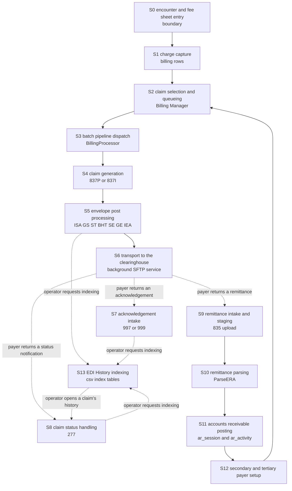
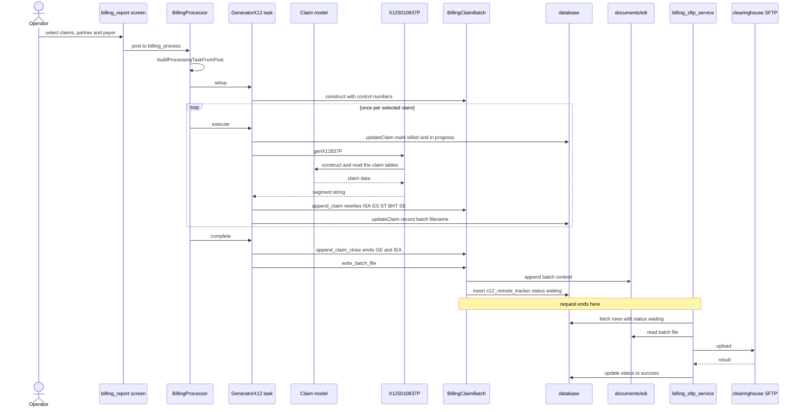
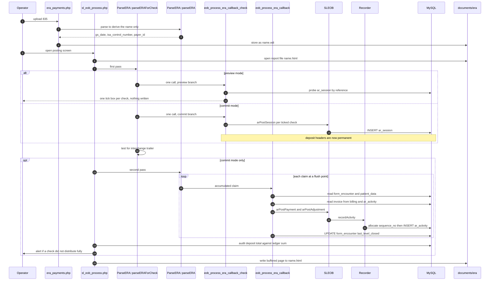
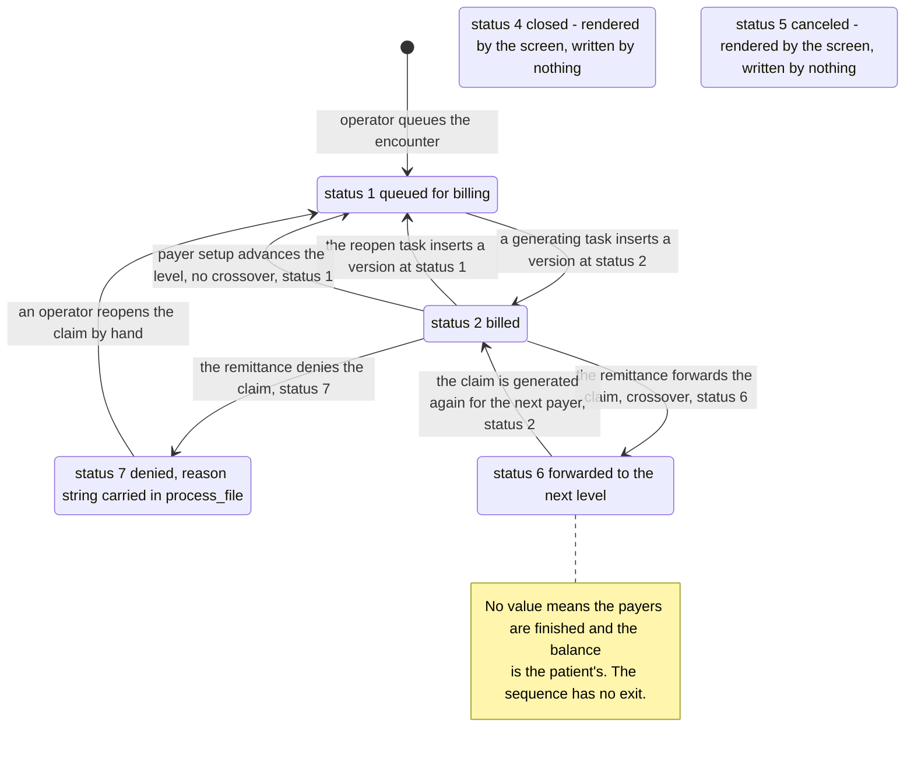
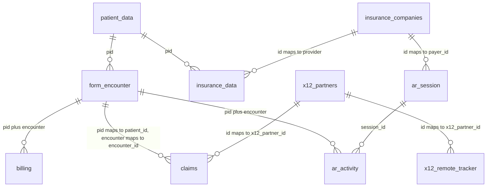

# OpenEMR Revenue Cycle Claim Lifecycle

What happens, in order, from the moment a charge is captured to the moment cash is posted against it, and what changes in the database and on disk when each step runs or fails.

**Scope and sources.** This document decomposes the revenue cycle into fourteen stages and records, for every one of them, the code entry point, the tables read, the tables written, the files produced or consumed, the state transitions and the failure modes together with the symptom an operator actually sees. It is traced from the charge-capture and claim-update paths in `src/Billing/BillingUtilities.php`, the batch pipeline under `src/Billing/BillingProcessor/`, the two claim generators `src/Billing/X125010837P.php` and `src/Billing/X125010837I.php`, the remittance parser `src/Billing/ParseERA.php`, the accounts-receivable poster `src/Billing/SLEOB.php`, the payment recorder `src/PaymentProcessing/Recorder.php`, the boundary screens `interface/billing/sl_eob_process.php` and `interface/billing/era_payments.php`, the legacy electronic data interchange (EDI) history index layer in `library/edihistory/`, and the schema in `sql/database.sql`. Every table named here is anchored to its own data definition language statement; every file named here is anchored to the code that composes its path. Conventions, the citation format and the two claim classes are defined once in [README.md](README.md) and are used here without variation. Which generation of the subsystem a given file belongs to, and how the generations reach one another, is the subject of [architecture.md](architecture.md).

**Provenance.** Every anchor below is relative to branch `master` at head commit `b7a7e690e419de3451740f995b768a8e8e5fba87`, on project version 8.3.0-dev (`version.php:L17-L20`). Nothing was executed to produce this document: PHP and Composer were not installed in the environment in which it was written, so no part of the subsystem was run and no test was invoked. Every claim rests on static reading of file contents at that commit.

## Table of Contents

- [How to Read a Stage](#how-to-read-a-stage)
    - [The six attributes](#the-six-attributes)
    - [The X12 vocabulary used in this document](#the-x12-vocabulary-used-in-this-document)
    - [Where the stage numbers come from](#where-the-stage-numbers-come-from)
    - [The four storage directories in one line each](#the-four-storage-directories-in-one-line-each)
- [The Revenue Cycle End to End](#the-revenue-cycle-end-to-end)
- [Stage S0 Encounter and Fee Sheet Entry](#stage-s0-encounter-and-fee-sheet-entry)
- [Stage S1 Charge Capture](#stage-s1-charge-capture)
- [Stage S2 Claim Selection and Queueing](#stage-s2-claim-selection-and-queueing)
- [Stage S3 Batch Pipeline Dispatch](#stage-s3-batch-pipeline-dispatch)
- [Stage S4 Claim Generation](#stage-s4-claim-generation)
- [Stage S5 Envelope Post Processing](#stage-s5-envelope-post-processing)
- [Stage S6 Transport to the Clearinghouse](#stage-s6-transport-to-the-clearinghouse)
- [Stage S7 Acknowledgement Intake](#stage-s7-acknowledgement-intake)
- [Stage S8 Claim Status Handling](#stage-s8-claim-status-handling)
- [Stage S9 Remittance Intake and Staging](#stage-s9-remittance-intake-and-staging)
- [Stage S10 Remittance Parsing](#stage-s10-remittance-parsing)
- [Stage S11 Accounts Receivable Posting](#stage-s11-accounts-receivable-posting)
- [Stage S12 Secondary and Tertiary Payer Setup](#stage-s12-secondary-and-tertiary-payer-setup)
- [Stage S13 EDI History Indexing](#stage-s13-edi-history-indexing)
- [The Stage by Table Matrix](#the-stage-by-table-matrix)
- [Claim Status Transitions](#claim-status-transitions)
- [The Core Revenue Cycle Tables](#the-core-revenue-cycle-tables)
- [What an Engineer Can Predict](#what-an-engineer-can-predict)
- [Related Documents](#related-documents)
- [Documentation Attribution](#documentation-attribution)

## How to Read a Stage

### The six attributes

Every stage below carries the same six attributes under the same six labels, in the same order, so that a stage can be read on its own and two stages can be compared without re-reading either in full.

| Attribute | What it records | Admissibility rule applied |
|-----------|-----------------|-----------------------------|
| **Entry point** | The file and line at which the stage begins executing | Anchored to the function or statement itself, never to a comment describing it |
| **Tables read** | Every table the stage queries, with the line of the query | One anchor per table per stage; a table read only through a service class is marked as such |
| **Tables written** | Every table the stage inserts into, updates or soft-deletes | Admissible only if the named column exists at a cited `sql/database.sql` anchor. Column names were checked against the schema, not against the code that writes them |
| **Files produced or consumed** | Every filesystem artifact, named together with the directory it lands in | The directory is anchored to the code that composes its path, since none of the four is a fixed literal |
| **State transitions** | Which column moves from which value to which value | Both the write and the column's own declaration are anchored |
| **Failure modes and operator-visible symptoms** | The internal behaviour on failure **and** what a human at the screen actually sees | Both halves are required. Where the answer is that the operator sees nothing, that is written down as the answer rather than omitted |

The second half of the last attribute is the one most often missing from documentation of this kind, and in this subsystem it is frequently the more consequential half. Four verified failure paths are either silent or actively misleading at the screen: a batch run that terminates the request mid-file (`src/Billing/BillingProcessor/BillingClaimBatch.php:L220-L226`), a transport failure that is overwritten with a success status (`src/Billing/BillingProcessor/X12RemoteTracker.php:L112-L121`), a tertiary-payer advance that does nothing and says nothing (`src/Billing/SLEOB.php:L285-L286`), and a remittance whose posting is abandoned part-way through by an unrecognised segment, leaving every claim that had already been flushed posted and every later one lost (`src/Billing/ParseERA.php:L467-L468`). Each is set out under its own stage, and each is cross-referenced to [defect-candidates.md](defect-candidates.md), which is where a suspected defect is registered with a verification. This document describes behaviour; it proposes no change to any of it.

### The X12 vocabulary used in this document

X12 is the electronic data interchange (EDI) standard that United States healthcare payers, providers and clearinghouses use to exchange claims, eligibility questions and payments. An X12 file is flat text divided into **segments**, each beginning with a two- or three-character segment identifier and continuing as delimiter-separated **elements**; segments are grouped into nested **loops** identified by number. A **transaction set** inside such a file is identified by a number, and the numbers below are the ones this subsystem handles. Every term is expanded here rather than assumed, because the audience for this set is assumed to know PHP and SQL and not to know X12. This table is this document's own glossary, so a reader arriving by search has every term in one place.

| Term | Expansion | Where it appears in this lifecycle |
|------|-----------|------------------------------------|
| 837 | Health care claim | The outbound claim, built in [S4](#stage-s4-claim-generation) |
| 837P | 837 professional | The professional flavour, built by `genX12837P()` at `src/Billing/X125010837P.php:L40` |
| 837I | 837 institutional | The institutional flavour, built by `generateX12837I()` at `src/Billing/X125010837I.php:L26` |
| 835 | Health care claim payment and remittance advice | The inbound payment file, parsed in [S10](#stage-s10-remittance-parsing) by `parseERA()` at `src/Billing/ParseERA.php:L85` |
| ERA | Electronic remittance advice | The everyday name for an 835 file, and the name of the directory it is staged in, composed at `interface/billing/sl_eob_process.php:L749` |
| EOB | Explanation of benefits | A payer's statement of how it adjudicated a claim; the screen that posts one is `interface/billing/sl_eob_process.php` |
| 270 and 271 | Eligibility inquiry and eligibility information | The pre-claim coverage check in [S0](#stage-s0-encounter-and-fee-sheet-entry), dispatched from `src/Billing/EDI270.php:L379` and parsed at `src/Billing/EDI270.php:L927` |
| 276 and 277 | Claim status request and claim status notification | The status exchange in [S8](#stage-s8-claim-status-handling); only the 277 answer is handled here |
| 278 | Health care services review information | Authorisation and referral. Recognised by the dispatch map at `src/Billing/EdiHistory/X12File.php:L102` and indexed in [S13](#stage-s13-edi-history-indexing), but never generated |
| 997 and 999 | Functional acknowledgement and implementation acknowledgement | The syntactic receipt for a transmitted file, read for rejections in [S7](#stage-s7-acknowledgement-intake) |
| ISA and IEA | Interchange control header and trailer | The outermost envelope, emitted at `src/Billing/X125010837P.php:L60` and rewritten in [S5](#stage-s5-envelope-post-processing) |
| GS and GE | Functional group header and trailer | The group envelope, emitted at `src/Billing/X125010837P.php:L79`; its first element is what this subsystem dispatches on at `src/Billing/EdiHistory/X12File.php:L101-L102` |
| ST and SE | Transaction set header and trailer | The envelope around a single transaction, emitted at `src/Billing/X125010837P.php:L101` and renumbered in [S5](#stage-s5-envelope-post-processing) |
| BHT | Beginning of hierarchical transaction | Emitted immediately after ST at `src/Billing/X125010837P.php:L108-L115`; its third element is the value [S5](#stage-s5-envelope-post-processing) substitutes |
| CLM | Claim information | The segment carrying the claim identifier, at `src/Billing/X125010837P.php:L673-L690` |
| CLP | Claim payment information | The 835 segment that opens one claim's payment detail, handled at `src/Billing/ParseERA.php:L235-L268` |
| SVC | Service payment information | The 835 segment carrying one service line's charge and payment, handled at `src/Billing/ParseERA.php:L346-L387` |
| CAS | Claim or service adjustment | The 835 segment carrying a reduction and its reason, handled at claim level at `src/Billing/ParseERA.php:L269-L295` and at service level at `src/Billing/ParseERA.php:L394-L416` |
| PLB | Provider level adjustment | An 835 adjustment against the provider rather than a claim, deliberately kept out of accounts receivable at `src/Billing/ParseERA.php:L429-L431` |
| MIA | Medicare inpatient adjudication information | An 835 segment the legacy renderer understands at `library/edihistory/edih_835_html.php:L531` and the modern parser does not recognise at all |
| LX | Header number | The 835 segment that opens loop 2000, a logical grouping of claim payment information as the source describes it at `src/Billing/ParseERA.php:L221`, and one of the four flush points, at `src/Billing/ParseERA.php:L219-L230`. Service-line detail is one level further in, at SVC and loop 2110 |
| BPR | Beginning segment for payment order | The 835 segment carrying the cheque amount and date, at `src/Billing/ParseERA.php:L148-L155` |
| TRN | Trace | The 835 segment carrying the cheque number, at `src/Billing/ParseERA.php:L156-L165` |
| NM1 | Individual or organizational name | Party identification; the qualifier in its first element decides whose name it is, as at `src/Billing/ParseERA.php:L296-L316` |
| DTM and DTP | Date or time, in the 835 and in the 277 respectively | Dates on a claim or service line, as at `src/Billing/ParseERA.php:L389-L393` |
| AMT | Monetary amount | A supplementary amount, such as the allowed amount at `src/Billing/ParseERA.php:L419-L421` |
| QTY | Quantity | A supplementary count, as at `src/Billing/ParseERA.php:L427-L428` |
| PWK | Paperwork | The segment announcing a supporting document, emitted at `src/Billing/X125010837P.php:L786-L792` |
| TA1 | Interchange acknowledgement | The interchange-level receipt inside a 997 or 999, read at `library/edihistory/edih_997_error.php:L69-L80` |
| IK3 and AK3 | Implementation and functional data segment note | The element identifying which segment a payer rejected, read at `library/edihistory/edih_997_error.php:L102-L117` |
| A/R | Accounts receivable | What is owed and by whom; the two tables that hold it are `ar_session` (`sql/database.sql:L10158`) and `ar_activity` (`sql/database.sql:L10188`) |
| SFTP | Secure File Transfer Protocol | The file-transfer mechanism by which a batch reaches a clearinghouse in [S6](#stage-s6-transport-to-the-clearinghouse); the six partner fields it requires are listed at `src/Billing/BillingProcessor/X12RemoteTracker.php:L35-L42` |

### Where the stage numbers come from

The fourteen stage numbers are this documentation set's own. VERIFIED: the code declares no stage numbering and no state machine object; a claim's position in the cycle is inferable only from column values, principally `claims.status` (`sql/database.sql:L383`), `billing.bill_process` (`sql/database.sql:L260`) and `form_encounter.last_level_billed` (`sql/database.sql:L2035`). The numbers exist so that a stage can be referred to unambiguously from the seven sibling documents. S0 is numbered zero because it is a boundary stage: its entry point is identified so that a reader can find the seam at which charges originate, and its screen internals are not documented.

Two structural points about the ordering are worth stating before the stages themselves, because both break the impression of a single linear pipeline.

VERIFIED: stages S1 through S6 are not one request. Charge capture and claim generation run inside operator-initiated web requests, but transport runs from a separate background service: the only caller of the upload routine is `library/billing_sftp_service.php:L26`, inside a function declared at `library/billing_sftp_service.php:L23` and gated on a site-level global at `library/billing_sftp_service.php:L25`. A batch file therefore sits in the outbound directory, with a queue row beside it, until that service next runs.

VERIFIED: the cycle re-enters itself rather than terminating. Posting a primary payer's remittance in S11 can queue the same encounter to the next payer through S12 (`interface/billing/sl_eob_process.php:L717-L727`), which reopens the claim (`src/Billing/SLEOB.php:L292-L296`) and returns it to S2. A single encounter can therefore traverse S2 through S12 up to three times, once per payer level.

### The four storage directories in one line each

Four directories are in play, and every file named in a stage below lands in exactly one of them. The topology, including which component writes and which reads each, is documented in [architecture.md](architecture.md); the one-line summary below exists so that this document's file lists can be read without leaving it.

| Directory | Path, relative to the site directory | Composed at | What it holds |
|-----------|--------------------------------------|-------------|---------------|
| Outbound batch | `documents/edi` | `src/Billing/BillingProcessor/BillingClaimBatch.php:L65` | Generated claim batch files |
| History root | `documents/edi/history` | `library/edihistory/edih_csv_inc.php:L335` | The index tables under `csv`, the per-transaction stores `f270` through `f997`, plus `log` and `archive` |
| History staging | `documents/edi/history/tmp` | `library/edihistory/edih_csv_inc.php:L348-L360` | Uploaded files before they are typed and filed |
| Remittance staging | `documents/era` | `interface/billing/sl_eob_process.php:L749` and `interface/billing/era_payments.php:L151` | Inbound remittance files and the posting reports written beside them |

VERIFIED: the remittance staging directory is a sibling of the outbound directory rather than a child, and the history root is a child of the outbound directory (`library/edihistory/edih_csv_inc.php:L392-L393`). The history index therefore never sees `documents/era`, and its own `f835` store is a different directory entirely (`library/edihistory/edih_csv_inc.php:L756-L757`). The consequence for a reader tracing a remittance is stated in [S9](#stage-s9-remittance-intake-and-staging) and [S13](#stage-s13-edi-history-indexing).

## The Revenue Cycle End to End

The following diagram answers one question: in what order do the fourteen stages run, and where does the flow leave one process and resume in another. Solid arrows are the forward progression the pipeline is built to follow. Dashed arrows are discontinuities: nothing in the documented surface advances the flow across them, and it resumes only when something outside the current request happens. There are seven, of two kinds - three payer responses that arrive as uploaded files, and four operator actions in the EDI History screen, which is the only thing in the subsystem that ever triggers indexing or reads the index back. The prose under each stage below carries the citations; this diagram carries none, by the convention that a node label is a name rather than evidence.

Three features of that shape are verified rather than schematic, and each is the reason a stage below reads the way it does.

VERIFIED: the arrow from S12 back to S2 is a real cycle, not a convenience. The cleanup block of the posting callback calls the secondary setup routine at `interface/billing/sl_eob_process.php:L717-L727`, and that routine reopens the claim by calling the claim updater with a status that leaves it unbilled at `src/Billing/SLEOB.php:L292-L296` and `src/Billing/SLEOB.php:L297-L302`, which returns the encounter to the queue the Billing Manager reads.

VERIFIED: the three dashed arrows out of S6 are not alternatives that the code chooses between. Nothing in the documented surface polls for or requests any of the three inbound file types. All three arrive because an operator uploads a file, through the EDI History upload handler at `interface/billing/edih_main.php:L149-L151` for acknowledgements and status notifications, and through the remittance intake screen at `interface/billing/era_payments.php:L117-L173` for remittances.

VERIFIED: the four dashed arrows touching S13 are dashed for the same reason as the three out of S6 - nothing advances them but an operator. Indexing runs only when the EDI History screen receives an explicit request, dispatched at `interface/billing/edih_main.php:L232-L237`, so a batch file written in S5 or an acknowledgement filed in S7 can sit unindexed indefinitely. The indexer then reads whatever files are present and writes index rows (`library/edihistory/edih_io.php:L254-L257`), and the operator screens read those rows back to display a claim's history (`library/edihistory/edih_csv_data.php:L291`). The pair of arrows between S13 and S8 is the index being written and then queried, not two different flows.

## Stage S0 Encounter and Fee Sheet Entry

A boundary stage. Its entry point is identified so that a reader can find the seam at which charges and coverage information originate; its screen internals, form rendering and clinical logic are not documented, per the scope statement in [README.md](README.md).

**Entry point.** Two independent ones. Charges enter through the fee sheet: the form computes a visit checksum as it is built at `interface/forms/fee_sheet/new.php:L487`, posts it back in a hidden field at `interface/forms/fee_sheet/new.php:L1768`, compares it on submission at `interface/forms/fee_sheet/new.php:L510-L511`, and calls `FeeSheet::save()`, declared at `library/FeeSheet.class.php:L925`, from the guarded branch at `interface/forms/fee_sheet/new.php:L534-L538`. Coverage information enters through the eligibility screens: `interface/billing/edi_270.php:L167` requests real-time eligibility and `interface/billing/edi_271.php:L65` parses a returned 271 through `EDI270::parseEdi271()` at `src/Billing/EDI270.php:L927`.

**Tables read.** The fee sheet reads `billing`, `drug_sales` and `form_encounter` to compute the visit checksum, in three subqueries at `library/FeeSheet.class.php:L321-L327`, `library/FeeSheet.class.php:L328-L334` and `library/FeeSheet.class.php:L335-L341`. The eligibility path reads `patient_data`, `users`, `facility`, `insurance_data` and `insurance_companies` in one join at `src/Billing/EDI270.php:L414-L418`, and reads `insurance_data` again for the copay at `src/Billing/EDI270.php:L686`, `eligibility_verification` at `src/Billing/EDI270.php:L693` and `benefit_eligibility` at `src/Billing/EDI270.php:L610`.

**Tables written.** The fee sheet writes `billing` and `drug_sales`; its charge insert is stage [S1](#stage-s1-charge-capture) and is documented there rather than duplicated here. The eligibility path writes two tables that no other stage touches: `eligibility_verification` by a `REPLACE INTO` at `src/Billing/EDI270.php:L701`, whose target columns `verification_id`, `insurance_id`, `response_id`, `eligibility_check_date` and `create_date` are declared at `sql/database.sql:L1648-L1655`; and `benefit_eligibility` by a delete-then-insert pair, deleting every row for the verification at `src/Billing/EDI270.php:L710` and inserting seventeen columns at `src/Billing/EDI270.php:L734-L737`, against the declaration at `sql/database.sql:L14082-L14099`.

**Files produced or consumed.** None on the fee sheet path. On the eligibility path, a 270 request and its 271 answer can be filed by an operator into the history stores `documents/edi/history/f270` and `documents/edi/history/f271`, whose paths come from the parameter table at `library/edihistory/edih_csv_inc.php:L749-L752`; nothing on this path writes them automatically.

**State transitions.** `eligibility_verification.eligibility_check_date` moves from its previous value to the current timestamp on every check, because the write at `src/Billing/EDI270.php:L701` is a `REPLACE INTO` keyed on `verification_id`, so a re-check replaces the row rather than appending a second one. `benefit_eligibility` has no state transition in the usual sense: its rows for a verification are deleted wholesale at `src/Billing/EDI270.php:L710` and rebuilt, and the table declares no primary key at all (`sql/database.sql:L14081-L14100`), so there is no row identity to transition.

**Failure modes and operator-visible symptoms.** Internally, the checksum comparison at `interface/forms/fee_sheet/new.php:L511` sets a message and records an audit event at `interface/forms/fee_sheet/new.php:L514-L523`, and because the charge-saving branch at `interface/forms/fee_sheet/new.php:L534` runs only when no message was raised, a concurrent edit discards the submission rather than merging it. The operator sees the message "Someone else has just changed this visit. Please cancel this page and try again." from `interface/forms/fee_sheet/new.php:L512`, which is explicit and actionable. VERIFIED: that guard does not cover the whole request. A diagnosis-update save runs earlier in the same handler, at `interface/forms/fee_sheet/new.php:L491-L501`, before the comparison at `interface/forms/fee_sheet/new.php:L510-L511`, so a diagnosis change can persist from a submission whose charge changes were then rejected. In that case the operator sees the same message and has no indication that part of the submission was kept.

## Stage S1 Charge Capture

**Entry point.** `BillingUtilities::addBilling()`, declared at `src/Billing/BillingUtilities.php:L1434-L1452`. VERIFIED: it has fourteen call sites across the repository, and they are not all clinical. The fee sheet calls it for every new item at `library/FeeSheet.class.php:L1149-L1167`; a clinical form calls it at `interface/forms/eye_mag/save.php:L863`; the encounter diagnosis screens call it at `interface/patient_file/encounter/diagnosis.php:L68`, `interface/patient_file/encounter/diagnosis.php:L81` and `interface/patient_file/encounter/diagnosis.php:L105`; the superbill screen calls it three times at `interface/patient_file/encounter/superbill_codes.php:L47-L51`; the checkout screens call it at `interface/patient_file/pos_checkout_normal.php:L649` and `interface/patient_file/pos_checkout_ippf.php:L1583`; the external interface calls it at `library/api.inc.php:L57` and `library/api.inc.php:L64`; and - the one that matters most for this document - the remittance poster calls it at `src/Billing/SLEOB.php:L194`, which means stage [S11](#stage-s11-accounts-receivable-posting) can create charges.

**Tables read.** On the insert path, `form_encounter` only, once, as a sanity check counting rows for the patient and encounter at `src/Billing/BillingUtilities.php:L1459-L1462`. The reversal path in the same file reads four more: `billing` and `drug_sales` in one union at `src/Billing/BillingUtilities.php:L1848-L1853` to find the last checkout timestamp, `ar_activity` at `src/Billing/BillingUtilities.php:L1861-L1863` and again at `src/Billing/BillingUtilities.php:L1875-L1877` to total what was posted, `form_encounter` again at `src/Billing/BillingUtilities.php:L1886-L1887` for the invoice reference number, and `users` at `src/Billing/BillingUtilities.php:L1800-L1806` to find the operator's invoice-number pool.

**Tables written.** `billing`, by one insert at `src/Billing/BillingUtilities.php:L1467-L1474`. Twenty-one columns are named at `src/Billing/BillingUtilities.php:L1467-L1469` and every one of them exists in the declaration at `sql/database.sql:L245-L275`: `date`, `encounter`, `code_type`, `code`, `code_text`, `pid`, `authorized`, `user`, `groupname`, `activity`, `billed`, `provider_id`, `modifier`, `units`, `fee`, `ndc_info`, `justify`, `notecodes`, `pricelevel`, `revenue_code` and `payer_id`. The money column among them is `fee`, declared `decimal(12,2)` at `sql/database.sql:L266`.

**Files produced or consumed.** None. This stage is purely a database write.

**State transitions.** Three columns are set at insert time and are then the levers the rest of the pipeline pulls.

| Column | Set to | Where | Declared at |
|--------|--------|-------|-------------|
| `activity` | The literal `1` | `src/Billing/BillingUtilities.php:L1470` | `sql/database.sql:L258` |
| `billed` | The `$billed` parameter, which defaults to `0` | `src/Billing/BillingUtilities.php:L1447` and `src/Billing/BillingUtilities.php:L1473` | `sql/database.sql:L257` |
| `authorized` | The `$authorized` parameter, coerced from any falsy value to the string `"0"` | `src/Billing/BillingUtilities.php:L1454-L1456` | `sql/database.sql:L254` |

VERIFIED: `activity` is a literal in the statement rather than a bound parameter (`src/Billing/BillingUtilities.php:L1470`), so no caller can create an inactive charge. Deactivation is a separate operation: `deleteBilling()` at `src/Billing/BillingUtilities.php:L1482` sets `activity = 0` at `src/Billing/BillingUtilities.php:L1484`, which is a soft delete rather than a row removal. Two further single-column transitions live in the same file: `authorizeBilling()` at `src/Billing/BillingUtilities.php:L1477-L1479` moves `authorized`, and `clearBilling()` at `src/Billing/BillingUtilities.php:L1487-L1489` empties `justify`.

VERIFIED: reversal is a separate path in the same file, and it is the only writer of two tables in this subsystem. `doVoid()` at `src/Billing/BillingUtilities.php:L1837` appends a row to `voids` at `src/Billing/BillingUtilities.php:L1895-L1905`, setting `patient_id`, `encounter_id`, `what_voided`, `date_voided`, `user_id`, `amount1`, `amount2`, `other_info`, `reason` and `notes`, all declared at `sql/database.sql:L10000-L10014`, plus `date_original` conditionally at `src/Billing/BillingUtilities.php:L1918`. On the purging variant it then soft-deletes the ledger lines at `src/Billing/BillingUtilities.php:L1930` or `src/Billing/BillingUtilities.php:L1949`, clears `billed` and `bill_date` on `billing` at `src/Billing/BillingUtilities.php:L1935` or `src/Billing/BillingUtilities.php:L1956` and on `drug_sales` at `src/Billing/BillingUtilities.php:L1941` or `src/Billing/BillingUtilities.php:L1961`, and calls `reOpenEncounterForBilling()` at `src/Billing/BillingUtilities.php:L1967`, which resets `last_level_billed`, `last_level_closed`, `stmt_count` and `last_stmt_date` on `form_encounter` at `src/Billing/BillingUtilities.php:L1989-L1994` against the declarations at `sql/database.sql:L2035-L2038`. On the non-purging variant it instead assigns a fresh invoice reference number, writing `form_encounter.invoice_refno` at `src/Billing/BillingUtilities.php:L1971-L1976` (`sql/database.sql:L2041`) and advancing the pool by updating `users` joined to the option list at `src/Billing/BillingUtilities.php:L1822-L1828`. VERIFIED: the whole block is gated at `src/Billing/BillingUtilities.php:L1894` on either purging or pools being in use, so a receipt void by a user with no pool configured writes nothing at all and returns silently. The operator sees no message either way, because `doVoid()` produces no output.

VERIFIED: the charge that stage [S11](#stage-s11-accounts-receivable-posting) creates from a remittance is inserted unauthorized. The call at `src/Billing/SLEOB.php:L194-L207` passes `0` for both the authorized flag and the provider, so a charge added because a payer paid for something absent from the claim arrives with `authorized` at `"0"`.

**Failure modes and operator-visible symptoms.** One failure mode, and it is abrupt. Internally, if the sanity check finds no matching encounter the function terminates the request with `die()` at `src/Billing/BillingUtilities.php:L1463-L1464`. The operator sees the bare translated string "Internal error: the referenced encounter no longer exists." on an otherwise blank or truncated page, with no navigation and no indication of how many of the other charges in the same submission were already written. Because the fee sheet loops over its items and calls this function once per new item at `library/FeeSheet.class.php:L1149`, a submission of several charges that trips this check leaves the earlier charges committed and the later ones absent. The insert itself has no failure branch: the return value of `sqlInsert()` at `src/Billing/BillingUtilities.php:L1472` is returned to the caller and the fee sheet does not test it.

## Stage S2 Claim Selection and Queueing

This stage is read-only. It is included as a stage rather than folded into S3 because the query that defines it decides which encounters can be billed at all, and a claim that this query does not return cannot reach any later stage.

**Entry point.** The Billing Manager screen, `interface/billing/billing_report.php`, which calls `BillingReport::getBillsBetween()` at `interface/billing/billing_report.php:L893` and `BillingReport::getBillsListBetween()` at `interface/billing/billing_report.php:L864`. The selecting statement is at `src/Billing/BillingReport.php:L135-L147`, in the method declared at `src/Billing/BillingReport.php:L125`. A second, reporting variant is at `src/Billing/BillingReport.php:L168-L180`, in the method at `src/Billing/BillingReport.php:L158`, with a copay branch that unions in `ar_activity` at `src/Billing/BillingReport.php:L188-L189`.

**Tables read.** Five in the selecting statement at `src/Billing/BillingReport.php:L135-L147`, joined outward from the encounter: `form_encounter` (`sql/database.sql:L2022`), then `billing` (`sql/database.sql:L245`) on encounter, patient, a code-type pattern and `activity = 1`, then `patient_data` (`sql/database.sql:L8334`), then `claims` (`sql/database.sql:L378`), then `insurance_data` (`sql/database.sql:L3306`) restricted to the primary row. The screen additionally reads `form_encounter` per row for the closed level at `interface/billing/billing_report.php:L1121`, and `ar_activity` (`sql/database.sql:L10188`) through the reporting variant at `src/Billing/BillingReport.php:L189`.

**Tables written.** None. Every write attributed to the act of billing happens in [S3](#stage-s3-batch-pipeline-dispatch) or later, after the operator has submitted the form.

**Files produced or consumed.** None.

**State transitions.** None. What this stage produces is a form submission, and the shape of that submission is the one piece of it a later stage depends on. VERIFIED: the form posts to the batch entry point at `interface/billing/billing_report.php:L743`, each selected claim is keyed patient-first as the patient identifier, a hyphen and the encounter identifier at `interface/billing/billing_report.php:L952`, and the payer for each claim is carried in a select element named `payer` at `interface/billing/billing_report.php:L1119`. The five submit buttons that reach the pipeline are `bn_mark` at `interface/billing/billing_report.php:L762` and `interface/billing/billing_report.php:L832`, `bn_x12` at `interface/billing/billing_report.php:L768`, `bn_x12_encounter` at `interface/billing/billing_report.php:L782` and `bn_reopen` at `interface/billing/billing_report.php:L835`.

**Failure modes and operator-visible symptoms.** Three. The characteristic failure mode of a selection query is invisibility, and two of these three are silent; the third is the most abrupt symptom in the whole screen.

Internally, the charge join is outer and its predicates sit in the join condition rather than in the where clause. VERIFIED: `billing` is joined with `LEFT OUTER JOIN` and the code-type pattern and `activity = 1` are both part of the `ON` condition, at `src/Billing/BillingReport.php:L138-L142`. An encounter with no matching charge row therefore still comes back, with every `billing.*` column null. The operator sees a row whose charge columns are blank, and nothing on the screen distinguishes an encounter that was never charged from one whose charges were all voided by setting `billing.activity` to 0, declared at `sql/database.sql:L266`. Both look identical, and both look like the encounter is simply not ready to bill.

Internally, the screen offers two date windows and its own source says one of them is the wrong one to use. VERIFIED: the criteria list presents "Date of Service" and "Date of Entry" as adjacent choices, mapped to `form_encounter.date` and `billing.date` respectively at `interface/billing/billing_report.php:L654-L657` and `interface/billing/billing_report.php:L670`, and the builder implements both, at `src/Billing/BillingReport.php:L79-L85` for the encounter date and `src/Billing/BillingReport.php:L86-L92` for the charge date. VERIFIED: the comment immediately above the selecting statement, at `src/Billing/BillingReport.php:L131-L133`, states that selecting by the date in the charge table is wrong because that column is only the data-entry date. Nothing on the screen repeats that warning. VERIFIED: the default is the safe one - a first load with no mode parameter sets "Date of Service = Today" at `interface/billing/billing_report.php:L722-L724`, alongside "Billing Status = Unbilled" at `interface/billing/billing_report.php:L725-L726`. The operator sees no symptom at all: a charge keyed weeks after the visit is present under one date window and absent under the other, both windows are labelled plausibly, and no message says which one the code considers correct. VERIFIED: one of the three fragments the statement interpolates is inert and can filter nothing. `$auth` is reset to the empty string at `src/Billing/BillingReport.php:L36` by the builder that every one of these methods calls first, and no statement anywhere assigns it again, so the fragment interpolated at `src/Billing/BillingReport.php:L146` is always empty.

Internally, an unrecognised search criterion terminates the request. VERIFIED: any criterion the builder does not match by name falls to the final else at `src/Billing/BillingReport.php:L100`, where its column and comparison are passed through `escape_identifier()` against six-item and two-item whitelists at `src/Billing/BillingReport.php:L102-L114` with the die-if-no-match argument set true. VERIFIED: that argument makes a miss fatal. `escape_identifier()` writes to the error log and calls `die()` at `library/formdata.inc.php:L229-L230`. The operator sees the Billing Manager page stop mid-render at a red sentence, "There was an OpenEMR SQL Escaping ERROR of the following string" followed by the rejected text, with no list, no navigation and no billing-specific explanation.

One restriction that is easy to attribute to this stage belongs to another. VERIFIED: the claim lookup bounded by `status > 0 AND status < 4` is in the claim updater, at `src/Billing/BillingUtilities.php:L1539-L1540`, not in this screen's query, and what it makes invisible is documented where it executes, under [S4](#stage-s4-claim-generation). VERIFIED: the selection query here applies no status restriction of any kind - it joins `claims` unrestricted at `src/Billing/BillingReport.php:L144`, so a claim the updater cannot find is still listed on this screen.

## Stage S3 Batch Pipeline Dispatch

This stage chooses which of eleven concrete tasks will handle the submission, builds the claim objects, and - for the two tasks that generate no file - completes the whole operation. For the nine generating tasks it hands over to [S4](#stage-s4-claim-generation).

**Entry point.** `interface/billing/billing_process.php`, a 65-line delegator: it checks the cross-site request token at `interface/billing/billing_process.php:L29`, constructs the processor at `interface/billing/billing_process.php:L32` and runs it at `interface/billing/billing_process.php:L33`. The processor's own entry point is `BillingProcessor::execute()` at `src/Billing/BillingProcessor/BillingProcessor.php:L78-L95`, which does exactly three things in order: build the task at `src/Billing/BillingProcessor/BillingProcessor.php:L81`, build the claim list at `src/Billing/BillingProcessor/BillingProcessor.php:L84`, and process them at `src/Billing/BillingProcessor/BillingProcessor.php:L89`.

The task is chosen by a single chain of conditions on the submitted button name at `src/Billing/BillingProcessor/BillingProcessor.php:L160-L192`. The order of that chain is behaviour, not formatting, because the buttons are not mutually exclusive at the HTTP level.

| Submitted name | Task constructed | At |
|----------------|------------------|----|
| `bn_reopen` | `TaskReopen` | `src/Billing/BillingProcessor/BillingProcessor.php:L162` |
| `bn_mark` | `TaskMarkAsClear` | `src/Billing/BillingProcessor/BillingProcessor.php:L164` |
| `bn_x12` with the per-insurer global set | `GeneratorX12Direct` | `src/Billing/BillingProcessor/BillingProcessor.php:L167` |
| `bn_x12_encounter` with the per-insurer global set | `GeneratorX12Direct`, encounter-claim variant | `src/Billing/BillingProcessor/BillingProcessor.php:L170` |
| `bn_x12` | `GeneratorX12` | `src/Billing/BillingProcessor/BillingProcessor.php:L173` |
| `bn_x12_encounter` | `GeneratorX12`, encounter-claim variant | `src/Billing/BillingProcessor/BillingProcessor.php:L176` |
| `bn_hcfa_txt_file` | `GeneratorHCFA` | `src/Billing/BillingProcessor/BillingProcessor.php:L178` |
| `bn_process_hcfa` | `GeneratorHCFA_PDF` | `src/Billing/BillingProcessor/BillingProcessor.php:L180` |
| `bn_process_hcfa_form` | `GeneratorHCFA_PDF_IMG` | `src/Billing/BillingProcessor/BillingProcessor.php:L182` |
| `bn_ub04_x12` | `GeneratorUB04X12` | `src/Billing/BillingProcessor/BillingProcessor.php:L185` |
| `bn_process_ub04` | `GeneratorUB04NoForm` | `src/Billing/BillingProcessor/BillingProcessor.php:L187` |
| `bn_process_ub04_form` | `GeneratorUB04Form_PDF` | `src/Billing/BillingProcessor/BillingProcessor.php:L189` |
| `bn_external` | `GeneratorExternal` | `src/Billing/BillingProcessor/BillingProcessor.php:L191` |

VERIFIED: a session flag is cleared at the top of that chain, at `src/Billing/BillingProcessor/BillingProcessor.php:L160`, and set again only by the five X12 branches, at `src/Billing/BillingProcessor/BillingProcessor.php:L166`, `src/Billing/BillingProcessor/BillingProcessor.php:L169`, `src/Billing/BillingProcessor/BillingProcessor.php:L172`, `src/Billing/BillingProcessor/BillingProcessor.php:L175` and `src/Billing/BillingProcessor/BillingProcessor.php:L184`. Because the chain runs at `src/Billing/BillingProcessor/BillingProcessor.php:L81` and the flag is read at `src/Billing/BillingProcessor/BillingProcessor.php:L100`, the value read always belongs to the current request rather than to a previous one. The flag exists to gate one check: the missing-partner skip described under failure modes below.

Each generating task then declares which action it is running, from three constants at `src/Billing/BillingProcessor/BillingProcessor.php:L62-L64`, derived from the submitted button at `src/Billing/BillingProcessor/BillingProcessor.php:L210-L222`: `btn-clear` maps to validate-and-clear, `btn-validate` to validate-only and `btn-continue` to normal. The base class turns that into one of three method calls at `src/Billing/BillingProcessor/Tasks/AbstractGenerator.php:L44-L60`.

**Tables read.** `x12_partners` (`sql/database.sql:L10025`), once per claim, in the `BillingClaim` constructor at `src/Billing/BillingProcessor/BillingClaim.php:L137`, which selects the processing format for the chosen partner. `claims` (`sql/database.sql:L378`), inside the claim updater, by the existing-claim lookup at `src/Billing/BillingUtilities.php:L1539-L1548` and by the version aggregate at `src/Billing/BillingUtilities.php:L1679`.

**Tables written.** For the two non-generating tasks, all three of this stage's writes happen here and the operation ends. `TaskReopen` calls the claim updater at `src/Billing/BillingProcessor/Tasks/TaskReopen.php:L33-L41`; `TaskMarkAsClear` calls it through `clearClaim()` at `src/Billing/BillingProcessor/Tasks/AbstractProcessingTask.php:L47-L58`. Both pass a true first argument, which is what selects the insert path rather than the update path. The updater writes:

- `claims`, by an insert at `src/Billing/BillingUtilities.php:L1688-L1692` for the ordinary case or `src/Billing/BillingUtilities.php:L1698-L1702` for the automatic-forward case, into the columns declared at `sql/database.sql:L379-L391`.
- `billing`, by an update at `src/Billing/BillingUtilities.php:L1648-L1649` restricted to `activity = 1` rows for the patient and encounter.
- `form_encounter`, by an update at `src/Billing/BillingUtilities.php:L1722-L1724`, but only when the status being written is 2 and the payer type is above zero, which the two guards at `src/Billing/BillingUtilities.php:L1720-L1721` enforce.

**Files produced or consumed.** None on this stage's own path. `TaskReopen` and `TaskMarkAsClear` both declare empty setup and complete methods, at `src/Billing/BillingProcessor/Tasks/TaskReopen.php:L25-L28` and `src/Billing/BillingProcessor/Tasks/TaskMarkAsClear.php:L24-L27` and `src/Billing/BillingProcessor/Tasks/TaskMarkAsClear.php:L35-L38`, so no batch is created and nothing is written to disk. The screen output is HTML rendered directly from the log at `interface/billing/billing_process.php:L52`, not a file.

**State transitions.** The claim-version allocation is the transition worth reading carefully, because a summary of it in either direction is misleading.

VERIFIED: the allocation is wrapped in a transaction. The insert path opens with `QueryUtils::inTransaction()` at `src/Billing/BillingUtilities.php:L1677` and closes it at `src/Billing/BillingUtilities.php:L1708`, and the read and the insert are both inside that closure.

VERIFIED: the read inside it is a plain aggregate. `src/Billing/BillingUtilities.php:L1679` selects `IFNULL(MAX(version), 0) + 1` for the patient and encounter with no `FOR UPDATE` clause and no locking hint, and the insert that follows at `src/Billing/BillingUtilities.php:L1688` or `src/Billing/BillingUtilities.php:L1698` has no unique-key retry around it. The target table's primary key is the composite `(patient_id, encounter_id, version)` at `sql/database.sql:L392`, and the version column's own comment concedes that it is incremented in code at `sql/database.sql:L381`.

The accurate statement is therefore neither that the allocation is unguarded nor that it is safe: the transaction is present, and the race is in the unlocked read. Two concurrent requests for the same patient and encounter can compute the same increment, at which point the second insert violates the composite primary key rather than silently overwriting. INFERRED (confidence: High): the transaction wrapper was added to make the read and the insert atomic with respect to each other rather than to serialise two concurrent allocations. Basis: the wrapper encloses exactly the read and the insert (`src/Billing/BillingUtilities.php:L1677-L1708`) and adds no locking clause to the read (`src/Billing/BillingUtilities.php:L1679`), which is what a read-then-write grouping looks like and not what a serialisation would require. The same unlocked-aggregate pattern appears in the accounts-receivable sequence allocator in [S11](#stage-s11-accounts-receivable-posting), where the code comments on the race itself.

The remaining transitions in this stage are the column moves the two non-generating tasks produce.

| Task | Column | From | To | Where |
|------|--------|------|----|-------|
| `TaskReopen` | `claims.status` | Any prior value | `1` | `src/Billing/BillingProcessor/Tasks/TaskReopen.php:L39` |
| `TaskReopen` | `claims.bill_process` | Any prior value | `0` | `src/Billing/BillingProcessor/Tasks/TaskReopen.php:L40` |
| `TaskReopen` | `billing.billed` | `1` | `0` | `src/Billing/BillingUtilities.php:L1598` writes the zero because the status is not above 1 |
| `TaskMarkAsClear` | `claims.status` | Any prior value | `2` | `src/Billing/BillingProcessor/Tasks/AbstractProcessingTask.php:L55` |
| `TaskMarkAsClear` | `billing.billed` | `0` | `1` | `src/Billing/BillingUtilities.php:L1593` |
| `TaskMarkAsClear` | `billing.bill_date` | `NULL` | `NOW()` | `src/Billing/BillingUtilities.php:L1595` |
| `TaskMarkAsClear` | `form_encounter.last_level_billed` | Prior level | The claim's payer type | `src/Billing/BillingUtilities.php:L1722-L1724` |

Those three `billing` columns are declared at `sql/database.sql:L257`, `sql/database.sql:L261` and, for the watermark, `sql/database.sql:L2035`. VERIFIED: the comment beside the `clearClaim()` call at `src/Billing/BillingProcessor/Tasks/AbstractProcessingTask.php:L56` states that the effect is to set the billed flag, and the code it describes does that indirectly, through the status-to-flag mapping at `src/Billing/BillingUtilities.php:L1593`, rather than by naming the column.

**Failure modes and operator-visible symptoms.** Three, of increasing severity.

Internally, a claim whose chosen trading partner is unassigned is skipped rather than failed: the guard at `src/Billing/BillingProcessor/BillingProcessor.php:L113-L117` prints a line and continues the loop. The operator sees the line "No X-12 partner assigned for claim" followed by the claim identifier, in the results list rendered at `interface/billing/billing_process.php:L52`. This is the well-behaved case: the message is specific, it names the claim, and the rest of the batch proceeds. VERIFIED: the guard fires only when the session flag is set, at `src/Billing/BillingProcessor/BillingProcessor.php:L113`, which by the chain above means only for the five X12 branches; a paper-form run with an unassigned partner is not skipped and produces no message.

Internally, a submission in which no claim carries the selection index produces an empty claim list, and the guard at `src/Billing/BillingProcessor/BillingProcessor.php:L88` then skips `processClaims()` entirely. Because setup and completion both live inside that method, at `src/Billing/BillingProcessor/BillingProcessor.php:L130` and `src/Billing/BillingProcessor/BillingProcessor.php:L144`, no batch is created and no completion output is produced. The operator sees the heading "Billing queue results" from `interface/billing/billing_process.php:L50` above an empty list, with no statement that nothing was selected.

Internally, a submission carrying none of the thirteen recognised button names leaves the task variable null, because the chain at `src/Billing/BillingProcessor/BillingProcessor.php:L161-L192` has no final else branch, and the very next statement calls a method on it at `src/Billing/BillingProcessor/BillingProcessor.php:L84`. The operator sees whatever the deployment does with an uncaught error: a blank page or an error page, with no billing-specific message at all, and no claim is touched. This is registered as a defect candidate in [defect-candidates.md](defect-candidates.md).

## Stage S4 Claim Generation

**Entry point.** Two generators, selected in [S3](#stage-s3-batch-pipeline-dispatch). The professional claim is built by `genX12837P()`, declared at `src/Billing/X125010837P.php:L40-L50` and called from `src/Billing/BillingProcessor/Tasks/GeneratorX12.php:L68-L79`. The institutional claim is built by `generateX12837I()`, declared at `src/Billing/X125010837I.php:L26` and called from `src/Billing/BillingProcessor/Tasks/GeneratorUB04X12.php:L44-L53`. Both return one string of segments, which the caller splits on the segment terminator and hands to the batch at `src/Billing/BillingProcessor/Tasks/GeneratorX12.php:L81` and `src/Billing/BillingProcessor/Tasks/GeneratorUB04X12.php:L55`.

Both generators load their data through one object. VERIFIED: each begins by constructing `Claim`, at `src/Billing/X125010837P.php:L53` and `src/Billing/X125010837I.php:L30`, and that constructor performs the stage's entire read phase in a fixed order at `src/Billing/Claim.php:L63-L91`. Segment-level detail for either transaction, including which element carries what, is in [transactions.md](transactions.md); this stage records what the generation touches.

**Tables read.** Thirteen in building the claim, all through the claim model unless noted, plus a fourteenth on the institutional path only and a fifteenth on the write path. The fourteenth and fifteenth follow the table.

| Table | Read at | DDL |
|-------|---------|-----|
| `billing` | `src/Billing/Claim.php:L98-L106`, joined to `code_types` and restricted to `activity = '1'` | `sql/database.sql:L245` |
| `code_types` | `src/Billing/Claim.php:L104`, as the inner join partner on `ct_key` | `sql/database.sql:L10596` |
| `form_encounter` | `src/Billing/Claim.php:L66`, through the encounter service rather than inline SQL | `sql/database.sql:L2022` |
| `patient_data` | `src/Billing/Claim.php:L81`, through the patient service | `sql/database.sql:L8334` |
| `facility` | `src/Billing/Claim.php:L70` and `src/Billing/Claim.php:L74-L76`, through the facility service | `sql/database.sql:L1845` |
| `users` | `src/Billing/Claim.php:L132`, with four further reads at `src/Billing/Claim.php:L825`, `src/Billing/Claim.php:L837`, `src/Billing/Claim.php:L860` and `src/Billing/Claim.php:L874` | `sql/database.sql:L9786` |
| `x12_partners` | `src/Billing/Claim.php:L164-L165` | `sql/database.sql:L10025` |
| `insurance_numbers` | `src/Billing/Claim.php:L135-L138` and `src/Billing/Claim.php:L170-L173` | `sql/database.sql:L3353` |
| `insurance_data` | `src/Billing/Claim.php:L261-L263` | `sql/database.sql:L3306` |
| `insurance_companies` | `src/Billing/Claim.php:L288` | `sql/database.sql:L3279` |
| `forms` and `form_misc_billing_options` | `src/Billing/Claim.php:L178-L183`, one join across both | `sql/database.sql:L2460` and `sql/database.sql:L2071` |
| `ar_activity` | `src/Billing/Claim.php:L148-L150`, to establish what the patient has already paid | `sql/database.sql:L10188` |

One further table is read by the institutional generator only, and it is the sole reference to it anywhere in the documented surface. VERIFIED: `codes` (`sql/database.sql:L1124`) is queried inside a per-service-line loop at `src/Billing/X125010837I.php:L988-L998`, by the statement at `src/Billing/X125010837I.php:L993`, which orders by revenue code descending and is bound with a code type derived at `src/Billing/X125010837I.php:L991` and the procedure code at `src/Billing/X125010837I.php:L992`. Being inside the loop, it issues one query per service line rather than one per claim.

A fifteenth table is read on this stage's write path rather than in building the claim, which is why the matrix marks it as read here as well as written. VERIFIED: both updater calls read `claims` (`sql/database.sql:L378`) before they write it. The first pass runs the version aggregate at `src/Billing/BillingUtilities.php:L1679` in order to allocate a version number, and the second pass runs the existing-claim lookup at `src/Billing/BillingUtilities.php:L1539-L1548` in order to find the row it will update in place.

**Tables written.** Three, all through the claim updater and all called by the generating task rather than by the generator itself. VERIFIED: `GeneratorX12` calls the updater twice per claim - once before generating, at `src/Billing/BillingProcessor/Tasks/GeneratorX12.php:L151-L162`, and once after, at `src/Billing/BillingProcessor/Tasks/GeneratorX12.php:L168`. The first call marks the claim billed and in progress; the second records the batch filename. The written tables are `claims` (insert, at `src/Billing/BillingUtilities.php:L1688` or `src/Billing/BillingUtilities.php:L1698`), `billing` (update, at `src/Billing/BillingUtilities.php:L1648-L1649`) and `form_encounter` (update, at `src/Billing/BillingUtilities.php:L1722-L1724`).

The institutional generator writes one extra thing into the claim row. VERIFIED: it serialises the 428-element institutional form array and passes it as the submitted-claim argument, at `src/Billing/BillingProcessor/Tasks/GeneratorUB04X12.php:L80` and again at `src/Billing/BillingProcessor/Tasks/GeneratorUB04X12.php:L112-L125`, which the updater appends to the claim set at `src/Billing/BillingUtilities.php:L1653` and writes into `claims.submitted_claim`, declared as `text` at `sql/database.sql:L391`. The array is padded to 428 entries at `src/Billing/X125010837I.php:L33-L37`.

**Files produced or consumed.** None directly. VERIFIED: both generators return a string and write nothing; the only write of batch *content* on the outbound path is in [S5](#stage-s5-envelope-post-processing). The outbound path does make one other filesystem change, and it creates a directory rather than a file: `GeneratorX12Direct::setup()` iterates every trading partner at `src/Billing/BillingProcessor/Tasks/GeneratorX12Direct.php:L90-L91` and, where the partner's configured local directory is set but does not exist, calls `mkdir()` on it recursively at `src/Billing/BillingProcessor/Tasks/GeneratorX12Direct.php:L102`. VERIFIED: that happens during setup, before any claim is generated, and its result decides where the batch is written - the batch directory is overridden to the partner's directory only when the directory is present or was successfully created, at `src/Billing/BillingProcessor/Tasks/GeneratorX12Direct.php:L114-L116`. Where it is not, the batch keeps the default directory from the batch constructor and the operator is told, by the line "Could not create directory for X12 partner" with the partner name at `src/Billing/BillingProcessor/Tasks/GeneratorX12Direct.php:L104` or "No directory for X12 partner" at `src/Billing/BillingProcessor/Tasks/GeneratorX12Direct.php:L96`. That divergence is what [S6](#stage-s6-transport-to-the-clearinghouse) has to reconcile.

**State transitions.** Seven columns move across two passes, and the relationship between those passes is the fact a reader most needs.

VERIFIED: only the first pass creates a claim version. It passes a true first argument at `src/Billing/BillingProcessor/Tasks/GeneratorX12.php:L152`, which selects the insert path at `src/Billing/BillingUtilities.php:L1657`. The second pass passes false at `src/Billing/BillingProcessor/Tasks/GeneratorX12.php:L168`, which selects the in-place update at `src/Billing/BillingUtilities.php:L1709-L1716`, keyed on the version the lookup at `src/Billing/BillingUtilities.php:L1539-L1548` found. The comment at `src/Billing/BillingProcessor/Tasks/GeneratorX12.php:L167` states the intent in as many words. The per-insurer variant behaves identically, with the same two arguments at `src/Billing/BillingProcessor/Tasks/GeneratorX12Direct.php:L166` and `src/Billing/BillingProcessor/Tasks/GeneratorX12Direct.php:L195`. A normal generation run therefore leaves exactly one new claim row behind, not two.

| Column | From | To | Where |
|--------|------|----|-------|
| `claims.version` | `n` | `n + 1` | `src/Billing/BillingUtilities.php:L1679` then `src/Billing/BillingUtilities.php:L1688` |
| `claims.status` | Prior value | `2` | `src/Billing/BillingProcessor/Tasks/GeneratorX12.php:L157` |
| `claims.bill_process` and `billing.bill_process` | `0` | `1`, then `2` on the second pass | `src/Billing/BillingProcessor/Tasks/GeneratorX12.php:L158` then `src/Billing/BillingProcessor/Tasks/GeneratorX12.php:L168` |
| `billing.billed` | `0` | `1` | `src/Billing/BillingUtilities.php:L1593` |
| `billing.bill_date` | `NULL` | `NOW()` | `src/Billing/BillingUtilities.php:L1595` |
| `claims.process_file` and `billing.process_file` | Empty | The batch filename | `src/Billing/BillingProcessor/Tasks/GeneratorX12.php:L168`, written at `src/Billing/BillingUtilities.php:L1616` and `src/Billing/BillingUtilities.php:L1618` |
| `claims.target` and `billing.target` | Empty | The partner's processing format | `src/Billing/BillingUtilities.php:L1623` and `src/Billing/BillingUtilities.php:L1625` |

Those columns are declared at `sql/database.sql:L381`, `sql/database.sql:L383`, `sql/database.sql:L385`, `sql/database.sql:L388` and `sql/database.sql:L389` for `claims`, and at `sql/database.sql:L257`, `sql/database.sql:L260`, `sql/database.sql:L261`, `sql/database.sql:L263` and `sql/database.sql:L268` for `billing`. VERIFIED: the second pass also stamps a timestamp, because the branch that writes the process file to `claims` writes `process_time` alongside it at `src/Billing/BillingUtilities.php:L1616` while the branch that writes it to `billing` writes `process_date` instead at `src/Billing/BillingUtilities.php:L1618` - two differently named columns, both declared, at `sql/database.sql:L387` and `sql/database.sql:L262`.

VERIFIED: the institutional generator writes a different target string. It passes the partner identifier with the literal suffix `-837I` at `src/Billing/BillingProcessor/Tasks/GeneratorUB04X12.php:L81-L94`, and on the second pass the fixed string `X12-837I` at `src/Billing/BillingProcessor/Tasks/GeneratorUB04X12.php:L112-L125`. The `target` column is `varchar(30)` at `sql/database.sql:L268` and `sql/database.sql:L389`.

**Failure modes and operator-visible symptoms.** Three, and the middle one is the least visible.

Internally, a claim with no billable charges is reported by the generator into the log string rather than by aborting: `src/Billing/X125010837P.php:L670` appends the line "*** This claim has no charges!" and generation continues. The operator sees that line in the results list at `interface/billing/billing_process.php:L52`, and the claim is nevertheless marked billed, because the marking call at `src/Billing/BillingProcessor/Tasks/GeneratorX12.php:L151-L162` runs before generation at `src/Billing/BillingProcessor/Tasks/GeneratorX12.php:L165` and is not conditional on its result.

Internally, the second updater call is tested and its failure is reported: the branch at `src/Billing/BillingProcessor/Tasks/GeneratorX12.php:L168-L169` prints "Internal error: claim" and the claim identifier and "not found!" when the update does not match a row. The operator sees that line.

VERIFIED: what makes that call able to miss is a status window, not an absent row. Passing false as the first argument sends the updater down the lookup path at `src/Billing/BillingUtilities.php:L1539-L1548`, which is restricted to `status > 0 AND status < 4`, takes only the highest version, and returns 0 at `src/Billing/BillingUtilities.php:L1550` when nothing matches - before writing anything. A claim whose most recent version carries a status outside that window is therefore invisible to every update the pipeline makes without creating a version, while remaining fully visible to the selection query in [S2](#stage-s2-claim-selection-and-queueing), which applies no status restriction. Four of the six status values in the vocabulary recorded under [Claim Status Transitions](#claim-status-transitions) sit outside that window: 4 and 5, which have no writer anywhere in the documented surface, and 6 and 7, which do. A claim left at the denied value 7 by [S11](#stage-s11-accounts-receivable-posting), or at the forwarded value 6 by [S12](#stage-s12-secondary-and-tertiary-payer-setup), is therefore outside that lookup's reach. VERIFIED: inside a generation run this does not bite, because the first pass has already inserted a version at the billed value before the second pass looks anything up. It bites where a caller asks only for an in-place update, with no insert ahead of it. VERIFIED: six call sites test that return value and print the message - `src/Billing/BillingProcessor/Tasks/GeneratorX12.php:L168`, `src/Billing/BillingProcessor/Tasks/GeneratorX12Direct.php:L195`, `src/Billing/BillingProcessor/Tasks/GeneratorHCFA.php:L85-L86`, `src/Billing/BillingProcessor/Tasks/GeneratorHCFA_PDF.php:L128-L129`, `src/Billing/BillingProcessor/Tasks/GeneratorUB04NoForm.php:L54` and `src/Billing/BillingProcessor/Tasks/GeneratorUB04Form_PDF.php:L73`. Two do not: the institutional disposal screen discards the return at `interface/billing/ub04_dispose.php:L50` and `interface/billing/ub04_dispose.php:L95`, so there the update is skipped in silence and the operator sees nothing. This is registered as a defect candidate in [defect-candidates.md](defect-candidates.md).

VERIFIED: nothing rolls back the first call, so a claim can be marked billed with its batch filename never recorded, which is exactly the state that makes a claim untraceable from the screen at `interface/billing/billing_report.php:L1227-L1230`, where the file link is rendered only when the process timestamp is present.

Internally, the validate-and-clear action marks claims billed and writes no file. VERIFIED: the action dispatch at `src/Billing/BillingProcessor/Tasks/AbstractGenerator.php:L44-L60` routes that action to `validateAndClear()`, which at `src/Billing/BillingProcessor/Tasks/GeneratorX12.php:L120-L138` performs the same marking call as the normal path and appends the claim to the in-memory batch, and the completion dispatch at `src/Billing/BillingProcessor/Tasks/AbstractGenerator.php:L76-L93` then routes to `completeToScreen()` rather than to `completeToFile()`. VERIFIED: `completeToScreen()` at `src/Billing/BillingProcessor/Tasks/GeneratorX12.php:L181-L189` closes the envelope, replaces the segment terminators with line breaks at `src/Billing/BillingProcessor/Tasks/GeneratorX12.php:L186` and echoes the result at `src/Billing/BillingProcessor/Tasks/GeneratorX12.php:L188`, while `completeToFile()` at `src/Billing/BillingProcessor/Tasks/GeneratorX12.php:L199-L218` is the only path that calls the file writer, at `src/Billing/BillingProcessor/Tasks/GeneratorX12.php:L202`. The operator sees the claim text on screen and the line "Successfully marked claim" with the identifier and "as billed" from `src/Billing/BillingProcessor/Tasks/GeneratorX12.php:L137`, which is accurate; what is not stated anywhere on screen is that no file exists. VERIFIED: the claim row afterwards has no batch filename and no process timestamp, because the marking call passes an empty process file at `src/Billing/BillingProcessor/Tasks/GeneratorX12.php:L130` and the writer only appends those two columns when that argument is non-empty, at `src/Billing/BillingUtilities.php:L1615-L1619`. The screen therefore shows a claim marked billed with no file link, because the link is rendered only when the process timestamp is present at `interface/billing/billing_report.php:L1227-L1228`. Whether that is intended or a trap is registered in [defect-candidates.md](defect-candidates.md).

One write in this stage happens on every call and is easy to miss. VERIFIED: the submitted-claim assignment at `src/Billing/BillingUtilities.php:L1653-L1654` is outside every conditional, so it is appended to the claim set unconditionally. A professional claim, whose caller passes no submitted-claim argument, therefore writes the empty-string default declared at `src/Billing/BillingUtilities.php:L1534` into `claims.submitted_claim`, a `text` column at `sql/database.sql:L391`, on every version. Only the institutional path puts real content there.

## Stage S5 Envelope Post Processing

The generators of [S4](#stage-s4-claim-generation) each emit a complete, self-contained X12 file: an interchange control header, a functional group header, a transaction set header, the claim, and all three trailers. A batch of several claims cannot simply be those files concatenated, because the envelope control numbers and counts have to be batch-wide. This stage rewrites them.

VERIFIED: it is not a separate pass over a finished file. The rewriting half runs inside the per-claim loop of S4, because the generating task calls `append_claim()` immediately after each generator returns, at `src/Billing/BillingProcessor/Tasks/GeneratorX12.php:L81`; the closing half runs once, from the completion method, at `src/Billing/BillingProcessor/Tasks/GeneratorX12.php:L201`.

**Entry point.** `BillingClaimBatch::append_claim()` at `src/Billing/BillingProcessor/BillingClaimBatch.php:L202`, which iterates the segments at `src/Billing/BillingProcessor/BillingClaimBatch.php:L209` and splits each on the element delimiter at `src/Billing/BillingProcessor/BillingClaimBatch.php:L213`. Its counterpart is `append_claim_close()` at `src/Billing/BillingProcessor/BillingClaimBatch.php:L272-L279`, and the file writer is `write_batch_file()` at `src/Billing/BillingProcessor/BillingClaimBatch.php:L153`.

What happens to each envelope segment is the substance of the stage.

| Segment | Treatment | Where |
|---------|-----------|-------|
| ISA, interchange control header | Kept from the first claim only, and rebuilt: the first 70 characters are preserved and the date, time, control number and closing elements are substituted | `src/Billing/BillingProcessor/BillingClaimBatch.php:L214-L217` |
| GS, functional group header | Kept from the first claim only, and rebuilt with the batch date, time and group control number | `src/Billing/BillingProcessor/BillingClaimBatch.php:L229-L239` |
| ST, transaction set header | Renumbered per claim from a running counter, formatted to four digits | `src/Billing/BillingProcessor/BillingClaimBatch.php:L240-L250` |
| BHT, beginning of hierarchical transaction | Its third element is substituted by string position, searching for the placeholder the generator emitted | `src/Billing/BillingProcessor/BillingClaimBatch.php:L252-L257` |
| SE, transaction set trailer | Rewritten so that its second element matches the renumbered ST | `src/Billing/BillingProcessor/BillingClaimBatch.php:L259-L262` |
| GE and IEA, group and interchange trailers | Discarded from every claim, by an explicit `continue` | `src/Billing/BillingProcessor/BillingClaimBatch.php:L264-L266` |
| GE and IEA, reissued | Emitted once at the end, with the batch-wide transaction and group counts | `src/Billing/BillingProcessor/BillingClaimBatch.php:L275` and `src/Billing/BillingProcessor/BillingClaimBatch.php:L278` |

VERIFIED: the placeholder the BHT substitution searches for is a literal in the professional generator, and the batch class says so: the comment at `src/Billing/BillingProcessor/BillingClaimBatch.php:L253` names the generator that sets it, and the substitution at `src/Billing/BillingProcessor/BillingClaimBatch.php:L254` searches for the six-character sequence that `src/Billing/X125010837P.php:L111` emits. The two files are coupled by an undeclared string constant. The institutional generator emits the same placeholder at `src/Billing/X125010837I.php:L86`.

VERIFIED: the two control numbers come from a shared database sequence, and validation runs use fixed values instead. The interchange control number is `str_pad()` of a generated identifier to nine characters at `src/Billing/BillingProcessor/BillingClaimBatchControlNumber.php:L22-L25`, and the group control number is the same identifier unpadded at `src/Billing/BillingProcessor/BillingClaimBatchControlNumber.php:L27-L30`. Both call `QueryUtils::ediGenerateId()` at `src/Common/Database/QueryUtils.php:L360-L363`, which draws from the `edi_sequences` table declared at `sql/database.sql:L1635-L1637` and seeded at `sql/database.sql:L1639`. The batch constructor bypasses both when the action is a validation, substituting the literals at `src/Billing/BillingProcessor/BillingClaimBatch.php:L63` and `src/Billing/BillingProcessor/BillingClaimBatch.php:L66`.

**Tables read.** None. This stage reads the segment text it was handed and the batch's own state.

**Tables written.** One, and only when the site-level automatic-upload global is set. VERIFIED: `write_batch_file()` inserts one `x12_remote_tracker` row per distinct trading partner in the batch, at `src/Billing/BillingProcessor/BillingClaimBatch.php:L177-L184`, through `X12RemoteTracker::create()` at `src/Billing/BillingProcessor/X12RemoteTracker.php:L141-L147` and the insert at `src/Billing/BillingProcessor/X12RemoteTracker.php:L152`. The four columns it sets - `x12_partner_id`, `x12_filename`, `status` and `claims` - are declared at `sql/database.sql:L14151-L14154`, and `create()` adds the two timestamps declared at `sql/database.sql:L14156-L14157`. The row's subsequent lifecycle is stage [S6](#stage-s6-transport-to-the-clearinghouse), which is why the matrix attributes the reads and updates of that table to S6 and only the insert to this stage.

**Files produced or consumed.** One file, and this is the only place on the outbound path that batch content is written to disk. The only other outbound filesystem change is the directory creation in [S4](#stage-s4-claim-generation)'s setup, at `src/Billing/BillingProcessor/Tasks/GeneratorX12Direct.php:L102`, which creates no file.

| Artifact | Directory | Named at | Written at |
|----------|-----------|----------|------------|
| `<Y-m-d-His>-batch.txt` | `documents/edi`, the outbound batch directory composed at `src/Billing/BillingProcessor/BillingClaimBatch.php:L65` | `src/Billing/BillingProcessor/BillingClaimBatch.php:L64` | `src/Billing/BillingProcessor/BillingClaimBatch.php:L159-L162` |
| `<Y-m-d-His>-batch-p<partnerId>.txt` | The partner's own local directory, set at `src/Billing/BillingProcessor/Tasks/GeneratorX12Direct.php:L115` | `src/Billing/BillingProcessor/Tasks/GeneratorX12Direct.php:L110`, by substituting the partner identifier into the name | `src/Billing/BillingProcessor/Tasks/GeneratorX12Direct.php:L294`, once per partner in a loop at `src/Billing/BillingProcessor/Tasks/GeneratorX12Direct.php:L292` |

VERIFIED: the file is opened in append mode, at `src/Billing/BillingProcessor/BillingClaimBatch.php:L159`. Because the name carries a whole-second timestamp taken once in the constructor, two batch runs starting within the same second append to one file rather than producing two. VERIFIED: the outbound directory is also the legacy index layer's store for outbound claims, at `library/edihistory/edih_csv_inc.php:L738`, which is how this file becomes visible to stage [S13](#stage-s13-edi-history-indexing) without being copied anywhere.

**State transitions.** Two internal counters and one column.

VERIFIED: the transaction-set counter increments once per ST segment seen, at `src/Billing/BillingProcessor/BillingClaimBatch.php:L241`, and its final value is written into the reissued GE trailer at `src/Billing/BillingProcessor/BillingClaimBatch.php:L275`. The group counter is what suppresses the second and subsequent GS segments, through the test at `src/Billing/BillingProcessor/BillingClaimBatch.php:L230`, and its value goes into the reissued IEA trailer at `src/Billing/BillingProcessor/BillingClaimBatch.php:L278`. The column transition is `x12_remote_tracker.status`, which comes into existence at the waiting value, from `src/Billing/BillingProcessor/BillingClaimBatch.php:L181` and the constant at `src/Billing/BillingProcessor/X12RemoteTracker.php:L24`.

**Failure modes and operator-visible symptoms.** Two, and the first is the most abrupt failure anywhere in this lifecycle.

Internally, the interchange header is length-checked and a mismatch terminates the request. VERIFIED: the length is computed after the segment terminator is discounted at `src/Billing/BillingProcessor/BillingClaimBatch.php:L219`, tested against 105 at `src/Billing/BillingProcessor/BillingClaimBatch.php:L220`, and a mismatch calls `die()` at `src/Billing/BillingProcessor/BillingClaimBatch.php:L221`. A second `die()` at `src/Billing/BillingProcessor/BillingClaimBatch.php:L226` fires when the input does not begin with ISA, from the branch at `src/Billing/BillingProcessor/BillingClaimBatch.php:L225`.

The operator sees a truncated page. Because these calls happen inside the per-claim loop of S4, everything already printed by the log stays on screen and everything after it is absent; the message itself is the raw string "Error:" followed by a line break and either the interchange length complaint naming the length found, from `src/Billing/BillingProcessor/BillingClaimBatch.php:L221`, or the must-begin-with-ISA complaint naming what was found instead, from `src/Billing/BillingProcessor/BillingClaimBatch.php:L226`. Two consequences are worse than the message. First, the claims processed before the failure have already been marked billed by the first updater call of S4, at `src/Billing/BillingProcessor/Tasks/GeneratorX12.php:L151-L162`, and nothing reverses that. Second, no file is written at all, because the writer is only reached from the completion method at `src/Billing/BillingProcessor/Tasks/GeneratorX12.php:L202` and the request never gets there - so the claims are marked billed with a `process_file` value naming a batch that does not exist. This is registered as a defect candidate in [defect-candidates.md](defect-candidates.md).

Internally, a file that cannot be opened is reported by return value rather than by exception: the else branch at `src/Billing/BillingProcessor/BillingClaimBatch.php:L163-L165` sets the failure flag, the writer returns it at `src/Billing/BillingProcessor/BillingClaimBatch.php:L188`, and the completion method turns it into a message at `src/Billing/BillingProcessor/Tasks/GeneratorX12.php:L203-L207`. The operator sees "Error Generating Batch File" from `src/Billing/BillingProcessor/Tasks/GeneratorX12.php:L206`. VERIFIED: the claims are still marked billed, for the same reason as above, and the queue rows are correctly not created, because the queueing block is guarded on the success flag at `src/Billing/BillingProcessor/BillingClaimBatch.php:L170-L172`.

## Stage S6 Transport to the Clearinghouse

**Entry point.** `X12RemoteTracker::sftpSendWaitingFiles()` at `src/Billing/BillingProcessor/X12RemoteTracker.php:L55`. VERIFIED: the class lives under `src/Billing/BillingProcessor/`, not directly under `src/Billing/`, so every citation of it in this document carries the `BillingProcessor` path element.

VERIFIED: this stage does not run in the batch request. Its only caller is `library/billing_sftp_service.php:L26`, inside the function declared at `library/billing_sftp_service.php:L23`, which is itself gated on the automatic-upload global at `library/billing_sftp_service.php:L25`. The file's own docblock describes it as the background service for billing at `library/billing_sftp_service.php:L4-L5`. A batch therefore waits in the outbound directory, with its queue row beside it, until that service next executes.

**Tables read.** Two, in one statement. VERIFIED: the waiting-row fetch at `src/Billing/BillingProcessor/X12RemoteTracker.php:L195-L205` selects from `x12_remote_tracker` (`sql/database.sql:L14149`) joined to `x12_partners` (`sql/database.sql:L10025`) on the partner identifier at `src/Billing/BillingProcessor/X12RemoteTracker.php:L198`, ordered newest first at `src/Billing/BillingProcessor/X12RemoteTracker.php:L200`. The six partner columns it needs are named at `src/Billing/BillingProcessor/X12RemoteTracker.php:L35-L42` and the projection is the constant at `src/Billing/BillingProcessor/X12RemoteTracker.php:L44-L46`.

**Tables written.** One: `x12_remote_tracker`, by the update at `src/Billing/BillingProcessor/X12RemoteTracker.php:L170`, reached from `update()` at `src/Billing/BillingProcessor/X12RemoteTracker.php:L163-L176`. The two columns it moves are `status` and `messages`, declared at `sql/database.sql:L14153` and `sql/database.sql:L14155`.

**Files produced or consumed.** One consumed, none produced locally. VERIFIED: the path to send is the partner's configured local directory concatenated directly with the queued filename, at `src/Billing/BillingProcessor/X12RemoteTracker.php:L75`, and if nothing exists at that path it is recomposed as the site's outbound directory plus the same filename at `src/Billing/BillingProcessor/X12RemoteTracker.php:L77`. The contents are read at `src/Billing/BillingProcessor/X12RemoteTracker.php:L80` and the upload is the call at `src/Billing/BillingProcessor/X12RemoteTracker.php:L112`, which sends them under the bare filename. Nothing is written to the local filesystem by this stage, and nothing is deleted: the batch file remains in place after a successful send, which is what leaves it available to [S13](#stage-s13-edi-history-indexing).

VERIFIED: that second path is not the unconfigured-directory case, because a partner with no local directory configured never reaches it. The local directory is one of the six required partner fields listed at `src/Billing/BillingProcessor/X12RemoteTracker.php:L35-L42`, and `validateSFTPCredentials()` at `src/Billing/BillingProcessor/X12RemoteTracker.php:L128-L139` fails each of the six on an `empty()` test at `src/Billing/BillingProcessor/X12RemoteTracker.php:L133`. VERIFIED: that validation is the first thing the loop does, at `src/Billing/BillingProcessor/X12RemoteTracker.php:L62`, and on failure the row is set to `parameter-error`, has the message "`X12 SFTP Local Dir` is required" appended, is persisted, and the iteration ends with `continue` at `src/Billing/BillingProcessor/X12RemoteTracker.php:L64-L70`. No path is composed, no file is read, no login is attempted and no upload occurs. The order of operations is therefore: validate all six partner fields, then locate the file, then send.

VERIFIED: what the fallback actually covers is a configured directory that does not contain the file, and there are two routes to that state. The first is a divergence created in [S4](#stage-s4-claim-generation): the single-file generator never overrides the batch directory, so its file is written to the batch constructor's default at `src/Billing/BillingProcessor/BillingClaimBatch.php:L65`, which is the site's outbound directory, while the queue row it produced carries a partner whose configured local directory is somewhere else. The only caller of the override is the per-insurer generator, at `src/Billing/BillingProcessor/Tasks/GeneratorX12Direct.php:L115`. The second route is a configured directory string without a trailing separator, because `src/Billing/BillingProcessor/X12RemoteTracker.php:L75` joins the directory and the filename with nothing between them. Both are registered in [defect-candidates.md](defect-candidates.md); together they are why the fallback is load-bearing rather than merely defensive.

**State transitions.** `x12_remote_tracker.status` moves through a vocabulary of eight values, declared as constants at `src/Billing/BillingProcessor/X12RemoteTracker.php:L24-L31`.

| Value | Constant declared at | Set at | Meaning at that point |
|-------|----------------------|--------|-----------------------|
| `waiting` | `src/Billing/BillingProcessor/X12RemoteTracker.php:L24` | `src/Billing/BillingProcessor/BillingClaimBatch.php:L181`, in [S5](#stage-s5-envelope-post-processing) | Queued, not yet attempted |
| `parameter-error` | `src/Billing/BillingProcessor/X12RemoteTracker.php:L25` | `src/Billing/BillingProcessor/X12RemoteTracker.php:L62-L71` | A required partner field was empty |
| `claim-file-error` | `src/Billing/BillingProcessor/X12RemoteTracker.php:L26` | `src/Billing/BillingProcessor/X12RemoteTracker.php:L81-L86` | The local file could not be read |
| `login-error` | `src/Billing/BillingProcessor/X12RemoteTracker.php:L27` | `src/Billing/BillingProcessor/X12RemoteTracker.php:L89-L97` | Authentication to the partner failed |
| `chdir-error` | `src/Billing/BillingProcessor/X12RemoteTracker.php:L28` | `src/Billing/BillingProcessor/X12RemoteTracker.php:L99-L105` | The remote directory could not be entered |
| `in-progress` | `src/Billing/BillingProcessor/X12RemoteTracker.php:L29` | `src/Billing/BillingProcessor/X12RemoteTracker.php:L108-L109` | The upload is about to be attempted |
| `upload-error` | `src/Billing/BillingProcessor/X12RemoteTracker.php:L30` | `src/Billing/BillingProcessor/X12RemoteTracker.php:L113-L116` | The upload call returned false |
| `success` | `src/Billing/BillingProcessor/X12RemoteTracker.php:L31` | `src/Billing/BillingProcessor/X12RemoteTracker.php:L120-L121` | Recorded as delivered |

VERIFIED: the upload-error constant is declared under a misspelled name at `src/Billing/BillingProcessor/X12RemoteTracker.php:L30` - the identifier is `STATUS_UPLOAD_ERRROR`, carrying three consecutive letters R where two belong - and is used under that same name on the failure path at `src/Billing/BillingProcessor/X12RemoteTracker.php:L113`. The stored value is unaffected, because the string literal the constant holds is correct. It is registered as a defect candidate in [defect-candidates.md](defect-candidates.md) rather than as a contradiction, because it is a code identifier and not descriptive text.

**Failure modes and operator-visible symptoms.** Of the eight statuses in the table above, five are error statuses: `parameter-error`, `claim-file-error`, `login-error`, `chdir-error` and `upload-error`. VERIFIED: four of the five are retained. Each of those four sets its status, appends its messages, persists the row and ends the iteration with `continue`, at `src/Billing/BillingProcessor/X12RemoteTracker.php:L64-L70`, `src/Billing/BillingProcessor/X12RemoteTracker.php:L82-L85`, `src/Billing/BillingProcessor/X12RemoteTracker.php:L92-L96` and `src/Billing/BillingProcessor/X12RemoteTracker.php:L100-L104`. VERIFIED: the fifth is overwritten. `upload-error` is the only one of the five whose branch does not `continue`, so the status it persisted is replaced by a success status two statements later - and that is the most consequential failure mode in this document.

VERIFIED, line by line: the upload result is tested at `src/Billing/BillingProcessor/X12RemoteTracker.php:L112`; the failure branch sets the upload-error status at `src/Billing/BillingProcessor/X12RemoteTracker.php:L113`, appends the message "Could not upload file." at `src/Billing/BillingProcessor/X12RemoteTracker.php:L114`, merges the transport library's own errors at `src/Billing/BillingProcessor/X12RemoteTracker.php:L115` and persists the row at `src/Billing/BillingProcessor/X12RemoteTracker.php:L116`; the branch then closes at `src/Billing/BillingProcessor/X12RemoteTracker.php:L117` with no `else` and no `return`. Execution continues to `src/Billing/BillingProcessor/X12RemoteTracker.php:L120`, which assigns the success status unconditionally, and `src/Billing/BillingProcessor/X12RemoteTracker.php:L121`, which persists it. The upload-error row written one statement earlier is overwritten by a success row.

The operator sees a delivered transmission. The Claim File Tracker screen, which `src/Billing/BillingProcessor/Tasks/GeneratorX12Direct.php:L284-L286` names to the operator as the place to check status, reads the same rows through `fetchAll()` at `src/Billing/BillingProcessor/X12RemoteTracker.php:L207-L215`, so an undelivered file is displayed with the success status. The failure message is not lost - it remains in the `messages` column, because the failure branch persisted it before the success assignment overwrote only the status - but nothing on the success path draws attention to it. There is no second signal anywhere, and it is worth being exact about what the second screen does and does not claim. VERIFIED: the Billing Manager reports generation, not delivery. Because the claim rows still carry the billed status and the batch filename written in [S4](#stage-s4-claim-generation), the screen renders the line "Claim was generated to file" followed by a link to the batch, at `interface/billing/billing_report.php:L1227-L1228`, and that is the strongest statement it makes about the file anywhere. It has no knowledge of `x12_remote_tracker` at all. So the two screens between them say "generated to file" and "success", the first of which is true and the second of which is not, and no screen in the system says "sent" in those words.

VERIFIED: the comment immediately above the success assignment, at `src/Billing/BillingProcessor/X12RemoteTracker.php:L119`, describes a change from waiting to in-progress, which is not what the next line does; the identical comment is correct twelve lines earlier at `src/Billing/BillingProcessor/X12RemoteTracker.php:L107-L108`, where it does sit above the in-progress assignment. That is one row of the contradiction census in [README.md](README.md). The behaviour itself is a CRITICAL entry in [defect-candidates.md](defect-candidates.md).

One further transport behaviour is worth recording as a failure mode because of what it does when there is more than one partner. VERIFIED: the batch writer queues the same filename for every distinct partner in the batch, at `src/Billing/BillingProcessor/BillingClaimBatch.php:L177-L184`, where the filename passed at `src/Billing/BillingProcessor/BillingClaimBatch.php:L180` is the single batch filename rather than anything partner-specific. The batch class's own docblock states this as the intent, at `src/Billing/BillingProcessor/BillingClaimBatch.php:L145-L147`. The consequence is that with two partners selected in one run, both receive the whole batch, including each other's claims. The operator sees two success rows and no warning. The per-insurer generator does not have this property, because it writes and queues one file per partner, at `src/Billing/BillingProcessor/Tasks/GeneratorX12Direct.php:L110` and `src/Billing/BillingProcessor/Tasks/GeneratorX12Direct.php:L292-L294`.

The following diagram answers one question: which component does what, in what order, on the outbound path from the operator's submission to the file arriving at the clearinghouse, and where the process boundary falls. The citations are in the S3 through S6 prose above.

One detail in that sequence is worth naming because a reader will meet it in the code. VERIFIED: the per-insurer variant calls the file writer with a partner identifier as an argument, at `src/Billing/BillingProcessor/Tasks/GeneratorX12Direct.php:L294`, while the method it calls declares no parameters at all, at `src/Billing/BillingProcessor/BillingClaimBatch.php:L153`. The argument is therefore discarded. It happens to be harmless, because that variant holds one batch object per partner and the writer uses the object's own state, established at `src/Billing/BillingProcessor/Tasks/GeneratorX12Direct.php:L110-L128`; the partner scoping comes from the object rather than from the argument.

## Stage S7 Acknowledgement Intake

A 997 functional acknowledgement or 999 implementation acknowledgement is the clearinghouse or payer telling this system whether the transmitted file was syntactically acceptable. This stage is where one arrives and is read.

**Entry point.** An operator upload. VERIFIED: nothing in the documented surface fetches, polls for or downloads an acknowledgement. The EDI History screen routes the upload at `interface/billing/edih_main.php:L149-L151` to `edih_disp_file_upload()` at `library/edihistory/edih_io.php:L282`, which calls `edih_upload_files()` at `library/edihistory/edih_io.php:L287` and then files the results with `edih_sort_upload()` at `library/edihistory/edih_io.php:L289`. The rejection detail is extracted later, on demand, by `edih_997_error()` at `library/edihistory/edih_997_error.php:L320`, reached from `edih_list_denied_claims()` at `library/edihistory/edih_csv_data.php:L221`.

The typing decision is worth recording because it determines which directory the file lands in and therefore whether it is ever seen again. VERIFIED: `edih_upload_match_file()` at `library/edihistory/edih_uploads.php:L88` constructs a file object at `library/edihistory/edih_uploads.php:L106` and prefers the file's own content: if the file has a functional group header, the type comes from the group code through `csv_file_type()` at `library/edihistory/edih_uploads.php:L108-L110`. Only if it has no such header does it fall back to matching the filename against the per-type regular expressions at `library/edihistory/edih_uploads.php:L112-L123`; the acknowledgement pattern is at `library/edihistory/edih_csv_inc.php:L744`. Anything that satisfies neither is refused at `library/edihistory/edih_uploads.php:L128-L132` or, if valid but unclassifiable, recorded as a rejection with the comment text set at `library/edihistory/edih_uploads.php:L135-L139`.

**Tables read.** None.

**Tables written.** None. This is the headline fact of the stage and it has a direct consequence: a payer rejecting a claim at the syntactic level changes nothing in `claims`, nothing in `billing` and nothing in `form_encounter`. The claim continues to read as billed, and the Billing Manager keeps showing the line "Claim was generated to file" with its batch link, at `interface/billing/billing_report.php:L1227-L1228` - a statement about generation that a rejection does not contradict, because no screen in the system reports delivery from anything other than the tracker row described in [S6](#stage-s6-transport-to-the-clearinghouse). VERIFIED: the entire 14,979-line legacy tree that owns this path issues exactly one database query, at `library/edihistory/edih_io.php:L737`, and that query reads `ar_session` for a payment reference and serves only the remittance-posted display at `library/edihistory/edih_io.php:L729`. It is not on the acknowledgement path at all.

**Files produced or consumed.** Three artifacts and two directories.

| Artifact | Directory | Where |
|----------|-----------|-------|
| The uploaded file, staged | `documents/edi/history/tmp`, from `library/edihistory/edih_csv_inc.php:L348-L360` | Moved there and made read-only at `library/edihistory/edih_uploads.php:L142-L145` |
| The uploaded file, filed | `documents/edi/history/f997`, from `library/edihistory/edih_csv_inc.php:L743` | Renamed into it at `library/edihistory/edih_uploads.php:L535` and made read-only at `library/edihistory/edih_uploads.php:L536` |
| Index rows | `documents/edi/history/csv/files_f997.csv` and `documents/edi/history/csv/claims_f997.csv`, from `library/edihistory/edih_csv_inc.php:L743-L744` | Appended by stage [S13](#stage-s13-edi-history-indexing) |

**State transitions.** No database column moves. Two filesystem transitions do, and both are one-way.

VERIFIED: the staged file moves from the staging directory into the per-type store at `library/edihistory/edih_uploads.php:L535`, and its mode is set to read-only at `library/edihistory/edih_uploads.php:L536`. VERIFIED: an existing file of the same name is not replaced. The test at `library/edihistory/edih_uploads.php:L533` reports the name as already present and skips it, which the comment at `library/edihistory/edih_uploads.php:L528-L529` states as the intent. A re-upload of a corrected file under the same name therefore has no effect.

The values the acknowledgement carries, and where each is read, are the substance of what an engineer needs from this stage. All are read by `edih_997_errdata()` at `library/edihistory/edih_997_error.php:L41`, looping the segments at `library/edihistory/edih_997_error.php:L67`.

| Segment | What is taken from it | Where |
|---------|-----------------------|-------|
| TA1, interchange acknowledgement | The submitted interchange control number, its date and time, the acknowledgement code and a note | `library/edihistory/edih_997_error.php:L69-L80` |
| AK1, functional group response header | The functional group type and identifier | `library/edihistory/edih_997_error.php:L82-L89` |
| AK2 or IK2, transaction set response header | The transaction set type and control number | `library/edihistory/edih_997_error.php:L91-L100` |
| AK3 or IK3, data segment note | The identifier, position and loop of the offending segment, and the error code | `library/edihistory/edih_997_error.php:L102-L117` |
| CTX, context | The segment and element context, and the patient account number when the context is a trigger | `library/edihistory/edih_997_error.php:L119-L136` |
| AK4 or IK4, data element note | The element position and its error code | `library/edihistory/edih_997_error.php:L138-L146` |
| AK5 or IK5, transaction set response trailer | One acknowledgement code, which is the accept-or-reject decision itself, read at `library/edihistory/edih_997_error.php:L151`, followed by up to four syntax-error codes read at `library/edihistory/edih_997_error.php:L152-L155` | `library/edihistory/edih_997_error.php:L148-L162` |
| AK9, functional group response trailer | The group-level accept or reject decision plus the counts received and accepted | `library/edihistory/edih_997_error.php:L164-L186` |

VERIFIED: the group-level accept-or-reject flag is the first element of AK9, read at `library/edihistory/edih_997_error.php:L175`, whose own comment records the two values it can take; the counts of transaction sets included, received and accepted follow at `library/edihistory/edih_997_error.php:L176-L178`. Segment-level notes beyond this belong to [transactions.md](transactions.md).

**Failure modes and operator-visible symptoms.** Four, and the last is the one that matters.

Internally, a file that is neither typeable by content nor matchable by name is refused before it is stored, at `library/edihistory/edih_997_error.php` never being reached because `library/edihistory/edih_uploads.php:L130-L131` returns false. The operator sees the file listed under a rejection heading with the comment recorded for it, rendered at `library/edihistory/edih_uploads.php:L546-L551`.

Internally, a file that cannot be moved into its type directory is reported and, if the permission change fails, deleted: `library/edihistory/edih_uploads.php:L537-L541` unlinks it after reporting. The operator sees the literal phrase "file save error" from `library/edihistory/edih_uploads.php:L539` or `library/edihistory/edih_uploads.php:L543`, with no distinction between the two causes.

Internally, a file whose name already exists in the store is skipped. The operator sees the phrase "file exists" from `library/edihistory/edih_uploads.php:L534`, which is accurate but reads as informational rather than as a refusal to update.

Internally, a rejection reported by the acknowledgement is written nowhere. VERIFIED: `edih_997_error()` at `library/edihistory/edih_997_error.php:L320-L335` builds an HTML string and returns it, at `library/edihistory/edih_997_error.php:L328`, and its only caller returns that string to a screen at `library/edihistory/edih_csv_data.php:L221-L222`. Nothing writes to any table. The operator sees the rejection only by asking for it, along one navigation path: the denied-claims request at `interface/billing/edih_main.php:L250-L251`, which reaches `edih_disp_denied_claims()` at `library/edihistory/edih_io.php:L301` and from there the extractor at `library/edihistory/edih_io.php:L308`. On every other screen in the application the claim continues to read as billed and generated to file, because those screens render `claims` and `billing`, which this stage never touched. Where a bad file path is supplied, the function returns the string set at `library/edihistory/edih_997_error.php:L330` instead. This gap between what the payer said and what the database records is registered in [defect-candidates.md](defect-candidates.md).

## Stage S8 Claim Status Handling

A 276 claim status request asks a payer what became of a claim; a 277 claim status notification is the answer. This stage is asymmetric, and the asymmetry is its most important property.

**Entry point.** VERIFIED: nothing in the documented surface constructs a 276. The functional-group code for a status request is present in the dispatch map at `src/Billing/EdiHistory/X12File.php:L101`, the file index reserves a store and a request-date column for the type at `library/edihistory/edih_csv_inc.php:L745-L746`, and a repository-wide search for that group code at the recorded commit finds it only in that dispatch map and in the parsing branches that read an inbound file - `library/edihistory/edih_csv_parse.php:L488`, `library/edihistory/edih_csv_parse.php:L531`, `library/edihistory/edih_csv_parse.php:L652` and `library/edihistory/edih_csv_parse.php:L1584` - never in any statement that builds a segment. A 276 in this system is a file that arrived from somewhere else and was uploaded.

The 277 answer has a real entry point: the transaction view at `interface/billing/edih_main.php:L247-L251` calls `edih_disp_x12trans()` at `library/edihistory/edih_io.php:L322`, which routes a status notification to `edih_277_html()` at `library/edihistory/edih_io.php:L438` and again at `library/edihistory/edih_io.php:L474`. That function, declared at `library/edihistory/edih_277_html.php:L271`, renders either one transaction, when a reference is supplied at `library/edihistory/edih_277_html.php:L285-L287`, or every transaction in the file, by looping the envelopes at `library/edihistory/edih_277_html.php:L290-L303`.

VERIFIED: the per-transaction rendering is where this stage crosses a generation boundary. `edih_277_transaction_html()` at `library/edihistory/edih_277_html.php:L40` is procedural legacy code, and it delegates every segment it meets to static methods on a strict-typed modern class, at eleven call sites between `library/edihistory/edih_277_html.php:L136` and `library/edihistory/edih_277_html.php:L229`, importing it at `library/edihistory/edih_277_html.php:L24`. That class in turn type-hints a legacy code table in its own signatures, at `src/Billing/EdiHistory/Claim277Renderer.php:L28`. The cycle this creates is documented in [architecture.md](architecture.md) and is the reason the first item of [extraction-roadmap.md](extraction-roadmap.md) is what it is.

**Tables read.** None. This stage reads files and index rows only.

**Tables written.** None. As with [S7](#stage-s7-acknowledgement-intake), a payer statement about a claim's status changes no column anywhere.

**Files produced or consumed.** Consumed: the status file in `documents/edi/history/f277`, whose path and pattern are at `library/edihistory/edih_csv_inc.php:L747-L748`, and for a request the corresponding `documents/edi/history/f276` store at `library/edihistory/edih_csv_inc.php:L745-L746`. Read for lookup: the index tables `claims_f277.csv` and `files_f277.csv` in `documents/edi/history/csv`, from the same two parameter rows, queried by trace at `library/edihistory/edih_io.php:L466`. Produced: nothing beyond the index rows that [S13](#stage-s13-edi-history-indexing) appends and a log line from `library/edihistory/edih_csv_inc.php:L87`.

**State transitions.** None in the database. One in the index: a status file moves from unindexed to indexed, which is what makes it findable by trace. VERIFIED: the trace that connects a status notification back to a claim is looked up through `csv_file_by_trace()`, called at `library/edihistory/edih_io.php:L466`, and the claim-date column the index stores for this type is the service date rather than the response date, at `library/edihistory/edih_csv_inc.php:L747-L748` - which differs from the acknowledgement and eligibility stores, both of which date by response, at `library/edihistory/edih_csv_inc.php:L743-L744` and `library/edihistory/edih_csv_inc.php:L751-L752`.

**Failure modes and operator-visible symptoms.** Three.

Internally, a status file that cannot be parsed produces a message string rather than an exception: `library/edihistory/edih_277_html.php:L279-L282` returns the filename followed by a parse-error phrase, and an envelope that cannot be read returns the string built at `library/edihistory/edih_277_html.php:L292`. The operator sees that sentence in place of the status table, and it names the file.

Internally, a lookup by trace that finds nothing is reported: `library/edihistory/edih_io.php:L470-L471` builds a message naming the trace and the type it searched, and logs the same text. The operator sees "Did not find" followed by the trace value and the table searched. VERIFIED: that one sentence is everything the status path says about a missing answer, and it conflates two entirely different situations. A payer that never answered and an answer that was never uploaded into the index both leave the same trace absent from the same table, so both reach `library/edihistory/edih_io.php:L470` and both produce that identical sentence. Nothing in the message, the log line at `library/edihistory/edih_io.php:L471`, or anywhere else on the screen separates them, and because [S7](#stage-s7-acknowledgement-intake) and this stage write no table, there is no stored state a reader could consult to tell them apart either.

Internally, no status information is ever reconciled against the claim. Because this stage writes nothing, a 277 saying a claim was rejected leaves `claims.status` at whatever the generation stage set, which for a normal run is the billed value 2 from `src/Billing/BillingProcessor/Tasks/GeneratorX12.php:L157`. The operator sees a billed claim on every screen except the history browser, and sees the rejection only by opening the specific status file. There is no queue, no flag and no message anywhere else in the application. The one status the application does record from a payer statement is recorded by the remittance path instead, in [S11](#stage-s11-accounts-receivable-posting), where a denial code drives a write at `interface/billing/sl_eob_process.php:L395`.

## Stage S9 Remittance Intake and Staging

An 835 is the payer's remittance advice: what it paid, on which claims, at which service lines, and why it did not pay the rest. This stage gets one onto disk under a name the rest of the system can find, and it does so in an order that surprises most readers.

**Entry point.** `interface/billing/era_payments.php`, whose upload branch opens at `interface/billing/era_payments.php:L117`. Access is gated first, at `interface/billing/era_payments.php:L37-L39`, on write permission for either billing or explanation-of-benefits posting.

VERIFIED: the file is parsed before it is stored, and the parse exists only to name it. `interface/billing/era_payments.php:L144` calls the remittance parser against the temporary upload path, passing a callback declared at `interface/billing/era_payments.php:L61`; that callback composes the storage name at `interface/billing/era_payments.php:L65-L66` out of three values the parser lifted from the envelope - the functional group date, the interchange control number with leading zeros stripped, and the payer identifier with leading zeros stripped. The destination path is only built afterwards, at `interface/billing/era_payments.php:L156`. The name a stored file gets is therefore a property of its contents rather than of what the operator called it.

VERIFIED: a completed parse is not a precondition for storage. The storage block runs from `interface/billing/era_payments.php:L150` to `interface/billing/era_payments.php:L171`, entirely outside the parse guard at `interface/billing/era_payments.php:L143-L148`, and the parse result is only appended to the alert text at `interface/billing/era_payments.php:L145-L147` - it is never tested to decide whether to store. Three cases therefore all reach the rename at `interface/billing/era_payments.php:L170`: a parse that read the file end to end, a parse that returned an error string part-way through, and a parse that was suppressed before it began by an unreadable compressed upload at `interface/billing/era_payments.php:L131-L141`. What differs between them is only how much of the name the parser managed to supply, and the two failure paths that follow from a name it could not supply are recorded under failure modes below.

The same callback also accumulates a search predicate. VERIFIED: for each claim in the file it resolves the internal claim key at `interface/billing/era_payments.php:L67` and, when both halves resolve, appends an escaped disjunct to a growing `WHERE` fragment at `interface/billing/era_payments.php:L69-L72`, which the screen later uses to list the encounters the remittance touches.

**Tables read.** Two, both reached through the claim-key resolver `slInvoiceNumber()` at `src/Billing/SLEOB.php:L28-L64`, and which one is read depends on the shape of the identifier the payer echoed back.

| Table | DDL anchor | Read where, and why |
|-------|-----------|---------------------|
| `billing` | `sql/database.sql:L245` | `src/Billing/SLEOB.php:L41-L42`, when the returned identifier splits into three parts, to confirm the encounter exists and is active |
| `patient_data` | `sql/database.sql:L8334` | `src/Billing/SLEOB.php:L46-L49`, when the identifier does not split at all, to recover the patient by surname and forename and then peel the encounter off the identifier by string length at `src/Billing/SLEOB.php:L51-L53` |

VERIFIED: the two-part case reads nothing. `src/Billing/SLEOB.php:L36-L38` simply splits the identifier and trusts both halves, so the common path through this stage issues no query at all. The rule that governs which shape the identifier takes, and why payers mangle it, is registered in [business-rules.md](business-rules.md).

**Tables written.** None. This stage is filesystem only.

**Files produced or consumed.**

| Artifact | Directory | Where |
|----------|-----------|-------|
| The upload, unzipped in place if it arrived compressed | The PHP temporary upload location | Extracted at `interface/billing/era_payments.php:L126-L142`, the first archive member only, at `interface/billing/era_payments.php:L129` |
| `<gsdate>_<isacontrol>_<payerid>.edi` | `documents/era`, composed at `interface/billing/era_payments.php:L151` | Renamed into place at `interface/billing/era_payments.php:L170` when no file of that name exists |
| `.pending_<gsdate>_<isacontrol>_<payerid>.edi` | `documents/era` | Written at `interface/billing/era_payments.php:L160-L161` when a file of that name already exists, so the upload survives the request while the operator is asked to confirm |

VERIFIED: `documents/era` is created on demand at `interface/billing/era_payments.php:L152`, and it is a sibling of `documents/edi` rather than a child of it. The consequence, recorded in [architecture.md](architecture.md), is that the history index never sees this directory: every store the index knows about hangs off `documents/edi/history`, per the parameter table at `library/edihistory/edih_csv_inc.php:L738-L757`, and none of those rows names `documents/era`.

**State transitions.** No column moves. Three filesystem transitions do.

| From | To | Where |
|------|----|-------|
| Temporary upload | `documents/era/<name>.edi` | `interface/billing/era_payments.php:L170` |
| Temporary upload | `documents/era/.pending_<name>.edi` | `interface/billing/era_payments.php:L161`, with the confirmation flag raised at `interface/billing/era_payments.php:L163` |
| `documents/era/.pending_<name>.edi` | `documents/era/<name>.edi` | `interface/billing/era_payments.php:L96`, on confirmation, overwriting the earlier file |

VERIFIED: the hidden `.pending_` path is validated before either the confirm or the cancel branch acts on it. The name must match an eight-digit date followed by two numeric fields, tested at `interface/billing/era_payments.php:L79`; the resolved real path must still sit beneath the remittance directory, tested at `interface/billing/era_payments.php:L91-L93` for confirmation and at `interface/billing/era_payments.php:L108-L110` for cancellation, which unlinks it at `interface/billing/era_payments.php:L111`.

**Failure modes and operator-visible symptoms.** Five, and two of them leave a file on disk that no screen will mention again.

Internally, a compressed upload that cannot be opened, read or rewritten sets a flag that suppresses the parse: `interface/billing/era_payments.php:L131-L141` sets it in three separate branches. The operator sees one of three distinct sentences appended to the alert text, from `interface/billing/era_payments.php:L132`, `interface/billing/era_payments.php:L135` or `interface/billing/era_payments.php:L139`, and the messages do name the cause.

Internally, when the parse is suppressed the naming variable keeps the empty value it was initialised with at `interface/billing/era_payments.php:L55`, because on the upload path it is assigned nowhere except inside the callback at `interface/billing/era_payments.php:L65`. Execution nonetheless falls through to the path construction at `interface/billing/era_payments.php:L156`, which composes a name from that empty string, and then to the rename at `interface/billing/era_payments.php:L170`. The operator sees the archive error message and no other indication; the file is stored under a name consisting of the extension alone, and because every later lookup keys on the envelope-derived name, nothing will find it. This is registered in [defect-candidates.md](defect-candidates.md).

Internally, a parse that fails partway returns a message string rather than throwing, and the return value is appended to the alert at `interface/billing/era_payments.php:L145-L147`. The operator sees the parser's own words, which name the offending segment where the parser knows it - the whitelist message from `src/Billing/ParseERA.php:L468` is one of these. The file is still stored afterwards, because the storage block at `interface/billing/era_payments.php:L150-L171` is outside the parse guard.

Internally, an upload whose derived name collides with an existing file is neither stored nor discarded: it becomes a hidden `.pending_` file at `interface/billing/era_payments.php:L160-L161`. The operator sees a confirmation prompt, raised by the flag at `interface/billing/era_payments.php:L163`. VERIFIED: if the operator abandons the page instead of answering, that `.pending_` file remains in `documents/era` indefinitely. No cleanup runs anywhere; the only unlink is the explicit cancellation at `interface/billing/era_payments.php:L111`.

Internally, the collision branch additionally probes for a report file of the same name at `interface/billing/era_payments.php:L165-L167` and raises a processed flag if one exists. The operator sees the prompt annotated as an already-processed remittance. This is the only warning in the intake path that a remittance may be about to be posted twice.

## Stage S10 Remittance Parsing

Parsing an 835 means walking its segments in order, accumulating one claim at a time, and handing each finished claim to a callback. This stage owns the walk. What the callback then does with the claim is [S11](#stage-s11-accounts-receivable-posting).

**Entry point.** Two static methods on the same class, and both are called, in sequence, from the posting screen at `interface/billing/sl_eob_process.php:L850-L851`.

`ParseERA::parseERAForCheck()` at `src/Billing/ParseERA.php:L482` is the first pass. VERIFIED: it reads exactly five segment types - the interchange header, which it treats as a no-op at `src/Billing/ParseERA.php:L523`; BPR, the financial information segment that carries the payment amount and date, at `src/Billing/ParseERA.php:L524-L528`; N1 with a payer qualifier, at `src/Billing/ParseERA.php:L530-L533`; N1 with a payee qualifier, at `src/Billing/ParseERA.php:L534-L538`; and TRN, the reassociation trace number that carries the check number and the paying entity identifiers, at `src/Billing/ParseERA.php:L539-L545`. Every other segment in the file is silently skipped, because the branch chain has no final else.

`ParseERA::parseERA()` at `src/Billing/ParseERA.php:L85` is the second pass and the real one. It reads the whole transaction.

VERIFIED: the first pass does not take its callback as an argument. It calls a global function by fixed name at `src/Billing/ParseERA.php:L553`, whereas the second pass invokes whatever callable it was handed, through `parseERA2100()` at `src/Billing/ParseERA.php:L81`. The first pass can therefore only run in a context that has already defined that one specific function, which is why the remittance intake screen calls only the second pass, at `interface/billing/era_payments.php:L144`, and the posting screen calls both.

**How the walk works, and what a flush point is.** Both passes read the file through the same buffered loop: top up a buffer to 2048 bytes at `src/Billing/ParseERA.php:L103-L105`, find the next segment terminator at `src/Billing/ParseERA.php:L107`, cut everything before it out as the current segment at `src/Billing/ParseERA.php:L112`, keep the rest at `src/Billing/ParseERA.php:L113`, and strip stray carriage returns and newlines from what remains at `src/Billing/ParseERA.php:L115`. The element and component separators are not configured; they are learned from the interchange header at `src/Billing/ParseERA.php:L118-L121`.

A flush point is a segment whose arrival means the claim currently being accumulated is finished. At a flush point the parser calls `parseERA2100()`, which - if a claim really was in progress, tested at `src/Billing/ParseERA.php:L23` - hands the accumulated array to the callback at `src/Billing/ParseERA.php:L81` and lets the caller reset it. Four segments are flush points, and each guards a different boundary.

| Flush point | Segment | Boundary it closes | Where |
|-------------|---------|--------------------|-------|
| 1 | ST, transaction set header | The previous transaction set, before the new one resets the loop and the segment counter | `src/Billing/ParseERA.php:L144` |
| 2 | LX, header number | The last claim of the previous loop 2000 claim-payment grouping, the level at which a payer summarises a provider's claims rather than a claim's service lines | `src/Billing/ParseERA.php:L229` |
| 3 | CLP, claim payment information | The previous claim, before the new claim's subscriber and flags are cleared at `src/Billing/ParseERA.php:L243-L250` | `src/Billing/ParseERA.php:L241` |
| 4 | SE, transaction set trailer | The final claim of the transaction set, before the control number and segment count are checked at `src/Billing/ParseERA.php:L444-L450` | `src/Billing/ParseERA.php:L442` |

Why four of them matters: the accumulated claim exists only in memory, and it is emitted only at a flush point. Anything that terminates the walk without reaching one loses the claim in progress silently. VERIFIED: the fourth flush point runs before the trailer checks, at `src/Billing/ParseERA.php:L442` against `src/Billing/ParseERA.php:L444-L450`, so a transaction set whose segment count is wrong has already had all of its claims posted by the time the mismatch is returned.

**Tables read.** Two, and only through the claim-key resolver, exactly as in [S9](#stage-s9-remittance-intake-and-staging): `billing` at `sql/database.sql:L245` and `patient_data` at `sql/database.sql:L8334`, both from `src/Billing/SLEOB.php:L41-L49`. The parser itself issues no query; every table this stage touches is touched by the callback it invokes.

**Tables written.** None by the parser. All writes belong to the callback and are recorded under [S11](#stage-s11-accounts-receivable-posting).

**Files produced or consumed.** Consumed: the staged remittance at `documents/era/<name>.edi`, whose path the posting screen composes at `interface/billing/sl_eob_process.php:L753-L754`. Produced: nothing. The parser opens the file read-only at `src/Billing/ParseERA.php:L91` and never writes.

**State transitions.** The transitions here are in the parser's own loop state rather than in any column, and one of them is load-bearing for every claim the callback receives.

| State | From | To | Where |
|-------|------|----|-------|
| Loop identifier | empty | `2000` | `src/Billing/ParseERA.php:L230`, on LX |
| Loop identifier | any | `2100` | `src/Billing/ParseERA.php:L242`, on CLP |
| Loop identifier | `2100` | `2110`, the service payment level | `src/Billing/ParseERA.php:L351`, on SVC, the service payment information segment |
| Loop identifier | any | empty | `src/Billing/ParseERA.php:L145` on ST and `src/Billing/ParseERA.php:L443` on SE |
| Segment counter | 0 | incremented per segment | `src/Billing/ParseERA.php:L471`, reset to 0 at `src/Billing/ParseERA.php:L147` |
| Accumulated claim | populated | emitted, then cleared by the caller | `src/Billing/ParseERA.php:L81`, reached from the four flush points |

VERIFIED: whether the amounts in that accumulated claim are adjusted before it is emitted depends on a site-level flag. `src/Billing/ParseERA.php:L37` gates the whole balancing block on a global setting; when it is on, the service payments are forced to sum to the claim payment and the service adjustments to the charged amount less the paid amount less the patient responsibility amount, computed at `src/Billing/ParseERA.php:L38-L52`, and where they do not already agree an artificial service line named for the claim is inserted at `src/Billing/ParseERA.php:L54-L63` carrying the difference at `src/Billing/ParseERA.php:L65-L71`. The operator is told, through the warning text set at `src/Billing/ParseERA.php:L61-L62`. VERIFIED: patient-responsibility adjustments are excluded from that arithmetic, at `src/Billing/ParseERA.php:L45`. The rule and its blast radius are registered in [business-rules.md](business-rules.md).

VERIFIED: provider-level adjustments are excluded from accounts receivable entirely. PLB, the provider adjustment segment, is read at `src/Billing/ParseERA.php:L429-L440` and every reason-and-amount pair it carries is turned into warning text at `src/Billing/ParseERA.php:L437-L438` rather than into a posting, on the stated grounds recorded in the comment at `src/Billing/ParseERA.php:L430-L431`. The same dollars are treated differently by the modern balance test, which is a contradiction registered in [business-rules.md](business-rules.md) and in [defect-candidates.md](defect-candidates.md).

**Failure modes and operator-visible symptoms.** Five. The fifth is the one that costs money.

Internally, a file that cannot be opened returns a message immediately, at `src/Billing/ParseERA.php:L92-L93`. The operator sees that sentence in the alert text, because the posting screen concatenates both passes' return values at `interface/billing/sl_eob_process.php:L849-L852`.

Internally, an envelope segment appearing inside an open loop returns a specific message and stops: the interchange header at `src/Billing/ParseERA.php:L127-L128`, the functional group header at `src/Billing/ParseERA.php:L136-L137`, the financial information segment at `src/Billing/ParseERA.php:L149-L150`, the group trailer at `src/Billing/ParseERA.php:L452-L453` and the interchange trailer at `src/Billing/ParseERA.php:L460-L461`. The operator sees the segment identifier named in the message. Claims already flushed are already posted.

Internally, a trailer whose control number or segment count does not match returns a message, at `src/Billing/ParseERA.php:L444-L450` for the transaction set and `src/Billing/ParseERA.php:L456-L457` for the functional group. The operator sees the mismatch named. VERIFIED: this is detected after the corresponding flush, so the message reports a problem with a transaction whose claims are already in accounts receivable.

Internally, a file that ends without an interchange trailer is reported at `src/Billing/ParseERA.php:L474-L476` in the second pass and at `src/Billing/ParseERA.php:L555-L557` in the first. The operator sees a premature-end message. VERIFIED: in the first pass that check runs after the callback at `src/Billing/ParseERA.php:L553`, so the deposit header has already been written by the time truncation is reported.

Internally, a segment the parser does not recognise abandons the rest of the file. VERIFIED: the branch chain ends at `src/Billing/ParseERA.php:L467` with an unconditional else whose only statement, at `src/Billing/ParseERA.php:L468`, returns a message naming the segment identifier. There is no skip and no warning path, so the claim being accumulated when the segment arrives is lost, and so is every claim after it.

VERIFIED: what has already reached accounts receivable is not lost. That return happens inside the same walk that has been flushing claims all along, so every claim closed by an earlier flush point - ST at `src/Billing/ParseERA.php:L144`, LX at `src/Billing/ParseERA.php:L229` or CLP at `src/Billing/ParseERA.php:L241` - was already handed to the callback at `src/Billing/ParseERA.php:L81` and is already posted. **The outcome is therefore position-dependent rather than all-or-nothing: how much of a remittance posts depends on where in the file the unrecognised segment sits.** A file whose first claim carries one posts nothing. A file whose fortieth claim carries one posts the thirty-nine before it and loses the fortieth and everything past it. The operator sees the same single sentence naming the segment in either case, with nothing in it to distinguish the two, and - this is the half that matters - the remittance still renders correctly in the history browser, because the legacy renderer walks the same file with a different and wider vocabulary.

The concrete instance is the Medicare inpatient adjudication segment MIA, which the legacy renderer understands at `library/edihistory/edih_835_html.php:L531-L540` and which has no branch anywhere in `src/Billing/ParseERA.php`, so it falls to `src/Billing/ParseERA.php:L467-L468`. An institutional remittance carrying it can be read in full on screen, while the claim that carries it and every claim filed after it in the same file can never be posted. The nearest handled neighbour, the outpatient adjudication segment MOA, is not posted either, but it is at least survivable: it is turned into a warning at `src/Billing/ParseERA.php:L318-L319`. This inversion, where the older component is the more capable one, is registered in [business-rules.md](business-rules.md) and in [defect-candidates.md](defect-candidates.md), and the segment vocabularies of both readers are compared in [transactions.md](transactions.md).

**The retry is where the position-dependence turns into a money problem, and nothing on the path prevents it.** VERIFIED: the deposit header for the check exists before the abort, because the posting screen runs the two passes in order at `interface/billing/sl_eob_process.php:L850-L851` and the first pass completes. VERIFIED: re-posting the same file writes a second one. Commit mode calls `SLEOB::arPostSession()` at `interface/billing/sl_eob_process.php:L277-L285`, and that method is an unconditional insert at `src/Billing/SLEOB.php:L95-L102` with no lookup of any kind, so every claim before the unrecognised segment is posted a second time under a second deposit. VERIFIED: the duplicate warning the screen does offer cannot catch it. Preview mode looks for an existing deposit by matching `ar_session.reference` against the bare check number at `interface/billing/sl_eob_process.php:L241`, colours the row red at `interface/billing/sl_eob_process.php:L243-L246` and prints a warning at `interface/billing/sl_eob_process.php:L265`, but the commit path stores that same reference prefixed with `ePay - ` at `src/Billing/SLEOB.php:L102`, so a deposit this screen created is not the shape its own duplicate check searches for. That same prefix defeats a second, independent reuse guard, on the other deposit writer, which is described under [S11](#stage-s11-accounts-receivable-posting). An operator who re-posts a remittance that failed part-way through therefore double-posts its earlier claims with no warning at either step. Both of those suspicions are registered in [defect-candidates.md](defect-candidates.md); this document records only that the path behaves this way.

## Stage S11 Accounts Receivable Posting

This is where money enters accounts receivable. That is the distinction being drawn, and it is narrower than it may sound: the earlier stages write a great deal of state - [S1](#stage-s1-charge-capture) creates the charge rows in `billing`, [S3](#stage-s3-batch-pipeline-dispatch) and [S4](#stage-s4-claim-generation) write `claims`, `billing` and `form_encounter`, and [S5](#stage-s5-envelope-post-processing) writes the transport outbox in `x12_remote_tracker` - but none of them writes a row to `ar_session` or `ar_activity`, and none of them changes what a patient or a payer owes. This stage is the first that does both.

**Entry point.** `interface/billing/sl_eob_process.php`, which refuses to run unless it was reached with a remittance name, at `interface/billing/sl_eob_process.php:L740-L741`. It defines two callbacks and hands one to each parser pass.

`eob_process_era_callback_check()` at `interface/billing/sl_eob_process.php:L220` receives the first pass. It has two modes. In preview mode, entered at `interface/billing/sl_eob_process.php:L226`, it renders one row per check with a tick box and writes nothing. In commit mode, the else at `interface/billing/sl_eob_process.php:L269`, it inserts one deposit header for every check the operator ticked, at `interface/billing/sl_eob_process.php:L277-L285`, and keeps the returned identifier in a global keyed by check number.

`eob_process_era_callback()` at `interface/billing/sl_eob_process.php:L297` receives the second pass, once per claim, and does the ledger work.

**Tables read.** Eight in evaluating the remittance, plus a ninth on the write path. The ninth follows the table.

| Table | DDL anchor | Read where |
|-------|-----------|------------|
| `form_encounter` | `sql/database.sql:L2022` | `interface/billing/sl_eob_process.php:L332-L335`, joined to the patient to prove the claim exists |
| `patient_data` | `sql/database.sql:L8334` | The same join at `interface/billing/sl_eob_process.php:L332-L335`, and separately in the claim-key resolver at `src/Billing/SLEOB.php:L46-L49` |
| `billing` | `sql/database.sql:L245` | `src/Billing/InvoiceSummary.php:L52-L54`, reached from `interface/billing/sl_eob_process.php:L341`, to build the invoice the remittance is checked against |
| `drug_sales` | `sql/database.sql:L1543` | `src/Billing/InvoiceSummary.php:L98-L99`, the same call, so dispensed drugs count toward the invoice |
| `insurance_data` | `sql/database.sql:L3306` | `src/Billing/InvoiceSummary.php:L123-L124`, the same call, and again when the next payer is resolved at `src/Billing/SLEOB.php:L258-L261` |
| `insurance_companies` | `sql/database.sql:L3279` | Joined to the coverage rows at `src/Billing/InvoiceSummary.php:L123-L124` |
| `ar_activity` | `sql/database.sql:L10188` | Three times: `src/Billing/InvoiceSummary.php:L131-L136` for prior activity, `src/PaymentProcessing/Recorder.php:L209-L213` for the next sequence number, and `interface/billing/sl_eob_process.php:L860-L863` for the distribution audit |
| `ar_session` | `sql/database.sql:L10158` | Twice: the duplicate-check probe at `interface/billing/sl_eob_process.php:L241` and the audit read at `interface/billing/sl_eob_process.php:L858` |

A ninth table is read on this stage's write path rather than in evaluating the remittance, which is why the matrix marks it as read here as well as written. VERIFIED: the denial branch calls the claim updater asking for a new version, at `interface/billing/sl_eob_process.php:L395`, and that path reads `claims` (`sql/database.sql:L378`) through the version aggregate at `src/Billing/BillingUtilities.php:L1679` before inserting.

**Tables written.** Five, and every column named below exists at the cited data definition anchor.

| Table | Columns written | Writer | DDL anchor |
|-------|-----------------|--------|-----------|
| `ar_session` | `payer_id`, `user_id`, `closed`, `reference`, `check_date`, `pay_total`, `post_to_date`, `deposit_date`, `patient_id`, `payment_type`, `adjustment_code`, `payment_method` | `src/Billing/SLEOB.php:L95-L97`, called at `interface/billing/sl_eob_process.php:L277` | `sql/database.sql:L10158-L10185` |
| `ar_activity` | `pid`, `encounter`, `sequence_no`, `code_type`, `code`, `modifier`, `payer_type`, `post_time`, `post_user`, `session_id`, `modified_time`, `pay_amount`, `adj_amount`, `memo`, `account_code`, `follow_up`, `follow_up_note`, `reason_code`, `post_date`, `payer_claim_number` | `src/PaymentProcessing/Recorder.php:L146-L167` | `sql/database.sql:L10188-L10212` |
| `billing` | The full charge row, when an unmatched procedure is added | `src/Billing/SLEOB.php:L194-L207`, reaching `src/Billing/BillingUtilities.php:L1467-L1470` | `sql/database.sql:L245-L278` |
| `form_encounter` | `last_level_closed`, and `last_level_billed` as well on the crossover path | `interface/billing/sl_eob_process.php:L702-L704` and `interface/billing/sl_eob_process.php:L711-L713` | `sql/database.sql:L2036` and `sql/database.sql:L2035` |
| `claims` | `status`, and `process_file` reused to carry the denial reason string | `interface/billing/sl_eob_process.php:L395`, reaching the claim updater | `sql/database.sql:L383` and `sql/database.sql:L388` |

VERIFIED: three structurally different writers exist for the deposit header, and they do not interoperate.

| Writer | Columns | Where |
|--------|---------|-------|
| `SLEOB::arGetSession()` | Six: `payer_id`, `user_id`, `reference`, `check_date`, `deposit_date`, `pay_total` | `src/Billing/SLEOB.php:L87-L89` |
| `SLEOB::arPostSession()` | Twelve, of which five are literals fixed in the statement text | `src/Billing/SLEOB.php:L95-L97` |
| `Recorder::createSession()` | Sixteen, including the created and modified timestamps and a zeroed global amount | `src/PaymentProcessing/Recorder.php:L74-L92` |

The incompatibility is not merely cosmetic. VERIFIED: the six-column writer is preceded by a reuse probe that matches an existing row on payer, reference, check date and deposit date, at `src/Billing/SLEOB.php:L77-L80`, and returns that row instead of inserting. The twelve-column writer stores the reference with a fixed prefix prepended to the check number, at `src/Billing/SLEOB.php:L102`. A deposit created by the remittance screen therefore carries a reference that the reuse probe can never match, so the two paths silently create parallel deposit headers for the same check.

**Files produced or consumed.** Consumed: the staged remittance at `documents/era/<name>.edi`, per `interface/billing/sl_eob_process.php:L753-L754`. Produced: one report file per posting run in the same directory, named for the remittance with an HTML extension, opened before any posting occurs. VERIFIED: the report name is suffixed with an incrementing counter so an earlier report is never overwritten, at `interface/billing/sl_eob_process.php:L756-L760`, and the file receives the entire buffered page output at `interface/billing/sl_eob_process.php:L910-L912`. The comment at `interface/billing/sl_eob_process.php:L744-L746` records the intent: open it early so a failure to write the report does not follow a run of successful postings.

**State transitions.**

| What | From | To | Where |
|------|------|----|-------|
| Deposit header | absent | one row per ticked check, open, with the payer and total from the remittance | `interface/billing/sl_eob_process.php:L277-L285` |
| Ledger line, payment | absent | one row with the paid amount and a zero adjustment | `src/Billing/SLEOB.php:L144-L158`, with the zero fixed at `src/Billing/SLEOB.php:L156` |
| Ledger line, adjustment | absent | one row with the adjustment amount and a zero payment | `src/Billing/SLEOB.php:L235-L247`, with the zero fixed at `src/Billing/SLEOB.php:L244` |
| Ledger sequence number | highest existing for the encounter | that plus one | `src/PaymentProcessing/Recorder.php:L209-L213` |
| `claims.status` | 2, billed | 7, denied, with the reason string packed into `process_file` | `interface/billing/sl_eob_process.php:L395` |
| `form_encounter.last_level_closed` | previous level | the level this remittance answered | `interface/billing/sl_eob_process.php:L713`, or with `last_level_billed` too at `interface/billing/sl_eob_process.php:L704` |
| A new charge | absent | an unauthorized billing row for a procedure the payer named and the invoice did not have | `src/Billing/SLEOB.php:L194-L207`, gated on a site global at `interface/billing/sl_eob_process.php:L501` |

VERIFIED: the invariant that a ledger line is either a payment or an adjustment but never both is not enforced by the schema. It is recorded only as a column comment at `sql/database.sql:L10200`, and it holds because the two posting helpers each hard-code the other amount to zero, at `src/Billing/SLEOB.php:L156` and `src/Billing/SLEOB.php:L244`. Any future writer that does not follow that convention would violate it without error.

VERIFIED: the payer type written into every ledger line is derived from a user-interface label by string offset. The label is chosen from the claim status code by a match expression at `interface/billing/sl_eob_process.php:L348-L352`, and the numeric level is then recovered by taking the substring from the fourth character onward, at `interface/billing/sl_eob_process.php:L566`, `interface/billing/sl_eob_process.php:L628`, `interface/billing/sl_eob_process.php:L649` and `interface/billing/sl_eob_process.php:L698`. The rule and the reason it matters are registered in [business-rules.md](business-rules.md).

VERIFIED: adjustments are treated asymmetrically by payer level, and the asymmetry changes dollars. When the adjustment group code is patient responsibility, or when the paying insurance is not the primary, the adjustment is posted with an amount of exactly zero, at `interface/billing/sl_eob_process.php:L622-L631` with the zero fixed at `interface/billing/sl_eob_process.php:L626`; the real figure survives only inside the note text assembled at `interface/billing/sl_eob_process.php:L619`. The comment at `interface/billing/sl_eob_process.php:L613-L615` states the reasoning for the non-primary case. Every other adjustment is posted at face value at `interface/billing/sl_eob_process.php:L643-L652`. A secondary payer's write-off therefore never reduces the patient balance in this system.

**Failure modes and operator-visible symptoms.** Seven, and three of them are silent or misleading.

Internally, a claim the remittance names that is not in the database sets an error flag at `interface/billing/sl_eob_process.php:L328` and never clears it, because the clear at `interface/billing/sl_eob_process.php:L340` is inside the branch that found the encounter. Every subsequent posting for that claim is suppressed by the `!$error` guards. The operator sees the sentence at `interface/billing/sl_eob_process.php:L366` naming the condition, on a highlighted row.

Internally, a denied claim posts nothing but does write: `interface/billing/sl_eob_process.php:L381` sets the error flag and `interface/billing/sl_eob_process.php:L395` updates the claim to the denied status while packing the reason codes into the file-name column, which the comment at `interface/billing/sl_eob_process.php:L394` presents as a deliberate reuse of an existing column. The operator sees the message at `interface/billing/sl_eob_process.php:L399-L403` telling them to follow up by hand, and afterwards sees the reason rendered in the billing queue.

Internally, a payment reversal posts nothing at all: `interface/billing/sl_eob_process.php:L405` sets the error flag. The operator sees the message at `interface/billing/sl_eob_process.php:L406-L410` telling them to enter it manually.

Internally, a procedure the payer names that the invoice does not have is either added as a charge or treated as an error, and which one happens is decided by a site global read at `interface/billing/sl_eob_process.php:L501`. When the global is off, `interface/billing/sl_eob_process.php:L504` raises the error flag and suppresses the rest of the claim. The operator sees a red row whose description, built at `interface/billing/sl_eob_process.php:L505`, says the code was returned by the payer; when the global is on they see a row built at `interface/billing/sl_eob_process.php:L502` saying it was added.

Internally, an adjustment on a service line the payer paid nothing for, and which is not one of the two reason codes recognised as a contractual write-off at `interface/billing/sl_eob_process.php:L599-L600`, sets the error flag at `interface/billing/sl_eob_process.php:L636-L641` and posts nothing. VERIFIED: that branch emits no message of its own. The operator sees the row rendered in the error class by the shared line writer at `interface/billing/sl_eob_process.php:L656-L666`, with no sentence anywhere on the page explaining why it was refused. This is registered in [defect-candidates.md](defect-candidates.md).

Internally, the duplicate-deposit warning cannot fire for a deposit this screen created. VERIFIED: the probe at `interface/billing/sl_eob_process.php:L241` matches the reference column against the raw check number, while the writer stores it with a fixed prefix at `src/Billing/SLEOB.php:L102`. The operator sees the warning row at `interface/billing/sl_eob_process.php:L264-L266` only if some other code path wrote an unprefixed reference; for the ordinary case of re-posting the same remittance twice they see nothing, and a second set of ledger lines is written. This is registered in [defect-candidates.md](defect-candidates.md).

Internally, the deposit header is committed before the file is known to be well formed. VERIFIED: the first pass calls its callback at `src/Billing/ParseERA.php:L553` and only then tests whether the file ended with an interchange trailer, at `src/Billing/ParseERA.php:L555-L557`. The operator sees a premature-end message, and the deposit rows are already in the database with a total taken from a truncated file. The compensating control is the distribution audit that runs afterwards, comparing each deposit total against the sum of its ledger lines at `interface/billing/sl_eob_process.php:L856-L871` and raising a browser alert at `interface/billing/sl_eob_process.php:L874` when they differ. VERIFIED: that alert names the check numbers that did not distribute fully, from the string built at `interface/billing/sl_eob_process.php:L854` and `interface/billing/sl_eob_process.php:L867`, and it does not roll anything back.

INFERRED (confidence: High): the sequence-number allocation for ledger lines is expected by its own author to be able to collide under concurrency. Basis: the comment at `src/PaymentProcessing/Recorder.php:L202-L206` states the race explicitly and proposes two remedies, and the allocation at `src/PaymentProcessing/Recorder.php:L209-L213` is an unlocked aggregate inside a transaction opened at `src/PaymentProcessing/Recorder.php:L169`, against a primary key that includes the sequence number at `sql/database.sql:L10210`. VERIFIED: two concurrent postings for the same encounter that compute the same next value produce a duplicate-key error on the second insert.

This is the same shape as the claim-version allocation in [S3](#stage-s3-batch-pipeline-dispatch), and the two are registered together in [defect-candidates.md](defect-candidates.md).

The question the next diagram answers is: in what order does an inbound remittance touch the database, and exactly when does a deposit header become permanent?

VERIFIED: the two branches of that diagram are the screen's two modes, and they are mutually exclusive. The test is at `interface/billing/sl_eob_process.php:L815`: when the request carries the original flag, only the first pass runs, at `interface/billing/sl_eob_process.php:L816`, and its output is the tick-box table echoed at `interface/billing/sl_eob_process.php:L817`. Otherwise the else branch at `interface/billing/sl_eob_process.php:L818` renders the posting table and both passes run. VERIFIED: the callback resolves the same distinction internally. `eob_process_era_callback_check()` tests the identical flag at `interface/billing/sl_eob_process.php:L226`, renders and probes in that branch, and inserts deposit headers only in the else at `interface/billing/sl_eob_process.php:L269`. A single run therefore either probes for duplicates or writes deposits - never both.

VERIFIED: in commit mode the two passes are invoked one after the other in a single concatenated expression at `interface/billing/sl_eob_process.php:L849-L852`, so their return messages are joined and shown together even though the first pass has already written to the database by the time the second begins. VERIFIED: the report file is opened before either pass, at `interface/billing/sl_eob_process.php:L756-L760`, and written after the page is complete in both modes, at `interface/billing/sl_eob_process.php:L910-L912`.

## Stage S12 Secondary and Tertiary Payer Setup

When one payer is finished with a claim, the claim has to be offered to the next one. This stage does that, and it is where the cycle re-enters itself at [S2](#stage-s2-claim-selection-and-queueing).

**Entry point.** `SLEOB::arSetupSecondary()` at `src/Billing/SLEOB.php:L271`, called from exactly one place in the documented surface: the cleanup block of the remittance callback, at `interface/billing/sl_eob_process.php:L718`.

VERIFIED: reaching it requires four conditions to hold at once, all tested at `interface/billing/sl_eob_process.php:L697` and `interface/billing/sl_eob_process.php:L717` - no error was raised for the claim, the run is not a dry run, every existing service item on the invoice received some response, and the remittance being posted is from the primary payer with a secondary payer on file for the service date.

**Tables read.** Two in resolving the next payer, plus a third on the write path. The third follows the table.

| Table | DDL anchor | Read where |
|-------|-----------|------------|
| `form_encounter` | `sql/database.sql:L2022` | `src/Billing/SLEOB.php:L281-L283`, for the service date and the level last billed |
| `insurance_data` | `sql/database.sql:L3306` | `src/Billing/SLEOB.php:L258-L261`, to find the payer for the next level, and again at `interface/billing/sl_eob_process.php:L717` to test that a secondary exists at all |

A third table is read on this stage's write path rather than in resolving the next payer, which is why the matrix marks it as read here as well as written. VERIFIED: both calls this stage makes ask the claim updater for a new version, at `src/Billing/SLEOB.php:L295` and `src/Billing/SLEOB.php:L300`, and that path reads `claims` (`sql/database.sql:L378`) through the version aggregate at `src/Billing/BillingUtilities.php:L1679` before inserting.

VERIFIED: the coverage lookup is bounded by a date window rather than taken as current. The predicate at `src/Billing/SLEOB.php:L259` accepts a row whose start date is on or before the service date or null, and whose end date is on or after the service date or null, ordering by start date descending and taking one row at `src/Billing/SLEOB.php:L260`. The level name it matches on is looked up from a fixed three-entry map at `src/Billing/SLEOB.php:L256`, and any level outside one to three is rejected before the query runs, at `src/Billing/SLEOB.php:L252-L254`.

**Tables written.** Two, plus a third that the same updater writes only under a status this stage never uses, listed here because a reader following the updater's code will see the statement and needs to know why it does not fire. This is why the matrix marks `form_encounter` as read-only for this stage.

| Table | Columns written | Where | DDL anchor |
|-------|-----------------|-------|-----------|
| `claims` | A new version row carrying `status` from `src/Billing/BillingUtilities.php:L1590`, `bill_process` from `src/Billing/BillingUtilities.php:L1606`, `target` from `src/Billing/BillingUtilities.php:L1623`, `payer_id` and `payer_type` from `src/Billing/BillingUtilities.php:L1630`, and `submitted_claim` unconditionally from `src/Billing/BillingUtilities.php:L1653` | `src/Billing/SLEOB.php:L295` and `src/Billing/SLEOB.php:L300`, reaching the claim updater at `src/Billing/BillingUtilities.php:L1688` or `src/Billing/BillingUtilities.php:L1698` | `sql/database.sql:L378-L393` |
| `billing` | `billed` set to 0 at `src/Billing/BillingUtilities.php:L1598`, `bill_process` at `src/Billing/BillingUtilities.php:L1608`, `target` at `src/Billing/BillingUtilities.php:L1625` and `payer_id` at `src/Billing/BillingUtilities.php:L1633`, applied to every active charge row for the encounter | The same updater, whose billing-table statement is at `src/Billing/BillingUtilities.php:L1648-L1649` | `sql/database.sql:L257`, `sql/database.sql:L260`, `sql/database.sql:L268`, `sql/database.sql:L259` |
| `form_encounter` | `last_level_billed` - **never from this stage** | `src/Billing/BillingUtilities.php:L1722-L1723`, reached only when the status being written is the billed value and the payer type is above zero, per the guards at `src/Billing/BillingUtilities.php:L1720-L1721` | `sql/database.sql:L2035` |

VERIFIED: the third write does not happen on this stage's normal path, because the status this stage writes is 1 or 6, never 2. The guard at `src/Billing/BillingUtilities.php:L1720` therefore fails, and `last_level_billed` is advanced later, by the generation stage, rather than here. What this stage does advance is `last_level_closed`, and that happens in [S11](#stage-s11-accounts-receivable-posting) at `interface/billing/sl_eob_process.php:L713`, immediately before this stage is called.

**Files produced or consumed.** None. This stage is entirely database work. Files reappear when the requeued claim is generated again, in [S4](#stage-s4-claim-generation).

**State transitions.**

| What | From | To | Where |
|------|------|----|-------|
| Next level | `last_level_billed` | that plus one, when the level is below three or is zero | `src/Billing/SLEOB.php:L285-L288` |
| `claims.status` | 2, billed | 1, queued, on the ordinary path | `src/Billing/SLEOB.php:L277`, written at `src/Billing/SLEOB.php:L295` or `src/Billing/SLEOB.php:L300` |
| `claims.status` | 2, billed | 6, forwarded, when the remittance said the payer forwarded the claim itself | `src/Billing/SLEOB.php:L273-L275` |
| `billing.bill_process` | 0 | 5, when a next payer was found | `src/Billing/SLEOB.php:L295` |
| `billing.bill_process` | 0 | 0, when no next payer was found, so the claim is merely reopened | `src/Billing/SLEOB.php:L300` |
| `billing.target` | the previous target | `hcfa`, when a next payer was found | `src/Billing/SLEOB.php:L295` |
| Payer fields | the previous payer | zero on the reopen path: minus one is passed at `src/Billing/SLEOB.php:L300` and normalised to zero at `src/Billing/BillingUtilities.php:L1582-L1584` before the insert | `src/Billing/BillingUtilities.php:L1630` |

VERIFIED: the crossover case writes a different status and produces a different operator message. When the remittance indicated the payer forwarded the claim onward, the status becomes 6 at `src/Billing/SLEOB.php:L275`, and the encounter's billed level is advanced alongside its closed level at `interface/billing/sl_eob_process.php:L702-L704` rather than being left for a later generation run.

**Failure modes and operator-visible symptoms.** Three, and the first two are completely silent.

Internally, a claim whose last billed level is already three never advances. VERIFIED: the condition at `src/Billing/SLEOB.php:L286` is a level below three combined with a non-empty level, or a level of zero; PHP evaluates the conjunction first, so at a level of exactly three both alternatives are false and the increment at `src/Billing/SLEOB.php:L287` is skipped. The level therefore stays at three, the payer lookup at `src/Billing/SLEOB.php:L290` returns the same tertiary payer that was just paid, and the claim is queued to that payer again at `src/Billing/SLEOB.php:L295`. The operator sees nothing. `arSetupSecondary()` returns void, at `src/Billing/SLEOB.php:L271`, and emits no output on either branch; the only message on this path is the secondary-billing sentence at `interface/billing/sl_eob_process.php:L721-L725`, which is written by the caller and says secondary regardless of the level actually queued. There is no transition to patient responsibility and no terminal state. This is the terminal-state gap drawn in [Claim Status Transitions](#claim-status-transitions), and it is registered in [defect-candidates.md](defect-candidates.md).

Internally, a claim answered by a secondary or tertiary payer never reaches this stage at all. VERIFIED: the call site at `interface/billing/sl_eob_process.php:L717` requires the primary flag set at `interface/billing/sl_eob_process.php:L354`, which is true only when the claim status code mapped to the primary label at `interface/billing/sl_eob_process.php:L348-L352`. A secondary remittance therefore closes its level at `interface/billing/sl_eob_process.php:L713` and stops. The operator sees no message, because that update has no accompanying output, and the claim sits with a closed level and no queued successor. VERIFIED: this makes the tertiary gap above largely unreachable from the remittance path, since the level can only be advanced from primary; a claim can be queued to a secondary automatically and must be advanced beyond that by hand from the billing queue.

Internally, no next payer on file is not an error. The else at `src/Billing/SLEOB.php:L297-L302` reopens the claim with the payer sentinel and a zero process flag, which returns it to the queue in [S2](#stage-s2-claim-selection-and-queueing) as an unrouted claim. The operator sees the same secondary-billing sentence at `interface/billing/sl_eob_process.php:L721-L725` in the queued case, and in this case sees nothing, because the guard at `interface/billing/sl_eob_process.php:L717` means the reopen branch is only reached when a secondary was found by that test but not by the level-specific lookup at `src/Billing/SLEOB.php:L290` - a combination that arises when the level being advanced to is not the level the caller tested for.

## Stage S13 EDI History Indexing

Every X12 file this system sends or receives is, in principle, discoverable afterwards by claim, by control number and by trace. That discoverability is not a database index; it is a set of comma-separated files on disk. This stage builds them.

**Entry point.** An explicit operator request. VERIFIED: indexing is never automatic. `interface/billing/edih_main.php:L232-L237` routes the process request to `edih_disp_file_process()` at `library/edihistory/edih_io.php:L177`, and that function is the only writer of the index.

The directory tree it writes into is created by a separate one-time setup routine, `csv_setup()` at `library/edihistory/edih_csv_inc.php:L381`, invoked from `interface/billing/edih_main.php:L101-L113` when the temporary directory is found missing. VERIFIED: it derives the base from the site directory at `library/edihistory/edih_csv_inc.php:L388`, builds the outbound directory at `library/edihistory/edih_csv_inc.php:L392` and the history root beneath it at `library/edihistory/edih_csv_inc.php:L393`, then creates the index, archive, log and temporary subdirectories at `library/edihistory/edih_csv_inc.php:L394-L397`.

**Tables read.** None by the indexing operation itself. One elsewhere in the same tree, and only one: the deposit-header read described under Tables written below, which belongs to the history browser's remittance-posted view rather than to indexing.

**Tables written.** None. VERIFIED: this is the stage that makes the whole legacy tree's relationship to the database plain. Across all 14,979 lines of `library/edihistory/` there is exactly one query, at `library/edihistory/edih_io.php:L737`, and it is a parameterized read of the deposit header by reference. Its only purpose is to answer whether a given check has already been posted, for the display function that begins at `library/edihistory/edih_io.php:L729`. Nothing in this stage, and nothing else in that tree, writes to any table. VERIFIED: the observable consequence is that a file can be fully indexed and viewable in the history browser while the claim it concerns shows no sign of it, because no column anywhere is written by indexing.

INFERRED (confidence: High): the separation is a design decision rather than an omission, and the history subsystem was built as a filesystem index intentionally kept apart from the ledger. Basis: a tree of 14,979 lines that reaches the database exactly once, for a read that only answers a display question, is very unlikely to have arrived at that ratio by accident.

**Files produced or consumed.** Consumed: whatever is sitting in each type's directory and is not yet in that type's index. Produced: two index files per type, plus a log.

| Artifact | Directory | Where |
|----------|-----------|-------|
| `files_<type>.csv`, one row per file | `documents/edi/history/csv` | Created with its header row at `library/edihistory/edih_csv_inc.php:L1373-L1385` and appended at `library/edihistory/edih_csv_inc.php:L1419-L1431` |
| `claims_<type>.csv`, one row per claim or transaction within a file | `documents/edi/history/csv` | Created at `library/edihistory/edih_csv_inc.php:L1387-L1399`, appended by the same loop |
| The subsystem log | `documents/edi/history/log` | Written by `csv_edihist_log()` at `library/edihistory/edih_csv_inc.php:L87`, reporting the row count at `library/edihistory/edih_csv_inc.php:L1438` |
| The source file itself | Unchanged, in its own type directory | Scanned at `library/edihistory/edih_io.php:L218-L230`, which skips the two directory entries and the batch process log by name |

VERIFIED: eight types are tracked, and the outbound batch type is the only one whose directory is not under the history root. Its row points at `documents/edi` directly, at `library/edihistory/edih_csv_inc.php:L738`, and the comment immediately above it at `library/edihistory/edih_csv_inc.php:L735` records that the subsystem only reads that directory and never writes to it. The remaining seven - acknowledgements, status requests, status responses, eligibility requests, eligibility responses, authorisations and remittances - each get their own directory beneath the history root, at `library/edihistory/edih_csv_inc.php:L743-L757`.

VERIFIED: the remittance type indexed here is not the remittance directory used by [S9](#stage-s9-remittance-intake-and-staging). The index expects remittances in `documents/edi/history/f835`, per `library/edihistory/edih_csv_inc.php:L756`, while the posting path stores them in `documents/era`, per `interface/billing/era_payments.php:L151`.

INFERRED (confidence: High): the divergence is a deliberate choice about naming rather than an accident. Basis: the comment immediately above the store definition, at `library/edihistory/edih_csv_inc.php:L755`, states the author's reason - that the existing naming scheme was considered confusing, so a separate directory was used instead. Per the source-of-truth ordering in [README.md](README.md), a comment is evidence of intent and not of behaviour, which is why this is labelled rather than asserted.

VERIFIED: the consequence, whatever the reason, is that a remittance posted through the accounts-receivable path is not indexed unless the operator also uploads it to the history browser, and the two copies then live in two directories.

**State transitions.**

| What | From | To | Where |
|------|------|----|-------|
| A file's index status | present in the type directory, absent from the index | present in both | `library/edihistory/edih_csv_inc.php:L1001`, which defines new as the set difference between the directory listing and the indexed names |
| Index file existence | absent or truncated | created with a header row and restricted permissions | `library/edihistory/edih_csv_inc.php:L1377-L1381` for the file index, `library/edihistory/edih_csv_inc.php:L1391-L1395` for the claim index |
| Uploaded file permissions | writable in the staging directory | read-only in the type directory | `library/edihistory/edih_uploads.php:L536` |

VERIFIED: the parse that produces the index rows is selected per type by `edih_parse_select()` at `library/edihistory/edih_csv_parse.php:L1562`, called at `library/edihistory/edih_io.php:L256`, and the rows are written by `edih_csv_write()` at `library/edihistory/edih_csv_inc.php:L1348`, called at `library/edihistory/edih_io.php:L257`. VERIFIED: the row is assembled by matching the parse output against the header order recorded when the index file was created, at `library/edihistory/edih_csv_inc.php:L1423-L1431`, so a header written by an older version of the code determines the column order of every row appended afterwards.

**Failure modes and operator-visible symptoms.** Four.

Internally, a missing or unwritable base directory stops the whole screen before any indexing: `interface/billing/edih_main.php:L91-L96` ends the request when the directory helpers return nothing. The operator sees a bare sentence saying directory path information was not obtained, and no page.

Internally, a setup run that cannot create one of the five directories ends the request at the corresponding branch - `library/edihistory/edih_csv_inc.php:L420`, `library/edihistory/edih_csv_inc.php:L429`, `library/edihistory/edih_csv_inc.php:L438` or `library/edihistory/edih_csv_inc.php:L447`, with two outer conditions at `library/edihistory/edih_csv_inc.php:L452` and `library/edihistory/edih_csv_inc.php:L457`. The operator sees a single sentence naming the directory it could not create, on an otherwise empty page. VERIFIED: setup also refuses to run over existing data, returning the message at `library/edihistory/edih_csv_inc.php:L408` rather than overwriting, and where it does proceed it renames a pre-existing index out of the way with a prefix rather than deleting it, at `library/edihistory/edih_csv_inc.php:L462-L469`.

Internally, an index file that cannot be opened for appending aborts that type and returns false: `library/edihistory/edih_csv_inc.php:L1433`. The operator sees a failure message naming the file. Rows already appended for earlier types remain.

Internally, a type directory with nothing new in it is skipped silently by the loop at `library/edihistory/edih_io.php:L233-L235`. The operator sees the sentence built at `library/edihistory/edih_io.php:L267`, which says there are no new files of that type. VERIFIED: because new is defined as a set difference at `library/edihistory/edih_csv_inc.php:L1001`, a file that was indexed once and then replaced on disk under the same name is not new and will never be reindexed; the index continues to describe the file that used to be there. Combined with the refusal to replace an existing name during upload, at `library/edihistory/edih_uploads.php:L533-L534`, this means a corrected retransmission cannot be filed or indexed under its original name at all. This is registered in [defect-candidates.md](defect-candidates.md).

## The Stage by Table Matrix

This is the table an engineer comes here for: which database tables change when stage N runs.

**A scope correction first, because the count is not what it is usually assumed to be.** The revenue cycle is commonly described as touching six tables. VERIFIED: the in-scope code reads or writes **twenty-one**, and every one of them is anchored below to the data definition statement that declares it. Fifteen of the twenty-one are additions to the usual six, and two of the additions outrank two of the originals: `users` and `insurance_data` carry more query sites in `src/Billing/` than either `claims` or `ar_activity` does.

Three properties of these declarations are worth stating once, because they shape every claim in this document.

- VERIFIED: `ar_session`, `ar_activity` and `code_types` are the only three of the twenty-one declared without backtick quoting around the table name, at `sql/database.sql:L10158`, `sql/database.sql:L10188` and `sql/database.sql:L10596`. The other eighteen are quoted. VERIFIED: the difference is cosmetic in effect, because the unquoted names are not reserved words and the statements parse identically.
    - INFERRED (confidence: Low): the quoting style tracks the era in which each table was added to the schema. Basis: a single consistent style would be expected from one authoring pass, so a minority style suggests a different pass; but no commit was examined to confirm it, and this document offers no evidence that the two styles correspond to two periods rather than to two authors.
- VERIFIED: every monetary column in the core revenue-cycle path is declared `decimal(12,2)`: `billing.fee` at `sql/database.sql:L266`, `ar_session.pay_total` at `sql/database.sql:L10166`, `ar_session.global_amount` at `sql/database.sql:L10169`, `ar_activity.pay_amount` at `sql/database.sql:L10200`, `ar_activity.adj_amount` at `sql/database.sql:L10201`, and both void totals at `sql/database.sql:L10008-L10009`. Two-decimal rounding is therefore enforced by the schema rather than chosen by the code. VERIFIED: the eligibility table is the exception and is not on the money path: `benefit_eligibility.amount` is `decimal(5,2)` at `sql/database.sql:L14093` and its `percent` is `decimal(3,2)` at `sql/database.sql:L14094`.
- VERIFIED: `code_types` is joined by convention rather than by constraint. The generation stage joins it to the charge rows on a key column at `src/Billing/Claim.php:L104`, and the schema declares no foreign key anywhere, which is a repository-wide property recorded in [README.md](README.md).

**How to read the marks.** `R` means the stage reads the table, `W` means it writes it, `RW` means both, and a dot means the stage does not touch it. The reference-count column is a count of query sites in `src/Billing/` inventoried at the recorded commit; the stage marks are derived independently, by following control flow. The two columns therefore answer different questions and do not have to agree: one query site can serve several stages, and one table can be reached from more than one site.

| Table | Refs | DDL anchor | S0 | S1 | S2 | S3 | S4 | S5 | S6 | S7 | S8 | S9 | S10 | S11 | S12 | S13 |
|-------|-----:|------------|----|----|----|----|----|----|----|----|----|----|-----|-----|-----|-----|
| `billing` | 13 | `sql/database.sql:L245` | RW | RW | R | W | RW | . | . | . | . | R | R | RW | W | . |
| `users` | 10 | `sql/database.sql:L9786` | R | RW | . | . | R | . | . | . | . | . | . | . | . | . |
| `insurance_data` | 10 | `sql/database.sql:L3306` | R | . | R | . | R | . | . | . | . | . | . | R | R | . |
| `form_encounter` | 8 | `sql/database.sql:L2022` | R | RW | R | W | RW | . | . | . | . | . | . | RW | R | . |
| `claims` | 8 | `sql/database.sql:L378` | . | . | R | RW | RW | . | . | . | . | . | . | RW | RW | . |
| `ar_activity` | 8 | `sql/database.sql:L10188` | . | RW | R | . | R | . | . | . | . | . | . | RW | . | . |
| `patient_data` | 5 | `sql/database.sql:L8334` | R | . | R | . | R | . | . | . | . | R | R | R | . | . |
| `insurance_companies` | 5 | `sql/database.sql:L3279` | R | . | . | . | R | . | . | . | . | . | . | R | . | . |
| `eligibility_verification` | 4 | `sql/database.sql:L1647` | RW | . | . | . | . | . | . | . | . | . | . | . | . | . |
| `ar_session` | 4 | `sql/database.sql:L10158` | . | . | . | . | . | . | . | . | . | . | . | RW | . | . |
| `x12_remote_tracker` | 3 | `sql/database.sql:L14149` | . | . | . | . | . | W | RW | . | . | . | . | . | . | . |
| `x12_partners` | 3 | `sql/database.sql:L10025` | . | . | . | R | R | . | R | . | . | . | . | . | . | . |
| `drug_sales` | 3 | `sql/database.sql:L1543` | RW | RW | . | . | . | . | . | . | . | . | . | R | . | . |
| `benefit_eligibility` | 3 | `sql/database.sql:L14081` | RW | . | . | . | . | . | . | . | . | . | . | . | . | . |
| `insurance_numbers` | 2 | `sql/database.sql:L3353` | . | . | . | . | R | . | . | . | . | . | . | . | . | . |
| `voids` | 1 | `sql/database.sql:L10000` | . | W | . | . | . | . | . | . | . | . | . | . | . | . |
| `forms` | 1 | `sql/database.sql:L2460` | . | . | . | . | R | . | . | . | . | . | . | . | . | . |
| `form_misc_billing_options` | 1 | `sql/database.sql:L2071` | . | . | . | . | R | . | . | . | . | . | . | . | . | . |
| `facility` | 1 | `sql/database.sql:L1845` | R | . | . | . | R | . | . | . | . | . | . | . | . | . |
| `codes` | 1 | `sql/database.sql:L1124` | . | . | . | . | R | . | . | . | . | . | . | . | . | . |
| `code_types` | 1 | `sql/database.sql:L10596` | . | . | . | . | R | . | . | . | . | . | . | . | . | . |

Five readings of that matrix are worth making explicit, because each one is a fact about the subsystem rather than about the table. Each is introduced in bold below; the fourth carries two paragraphs of elaboration because the mechanism behind it is not visible in the matrix itself.

VERIFIED: **stages S7 and S8 are empty rows in every column.** Acknowledgement intake and claim-status handling touch no table at all. A payer can reject a transmission syntactically, or report a claim as denied in a 277, and no column anywhere records it. This is the single largest gap in the data flow and it is why an operator can see a claim marked billed, with the line "Claim was generated to file" beside it at `interface/billing/billing_report.php:L1227-L1228`, while the payer has already refused it.

VERIFIED: **stage S13 is an empty row in every column too.** The indexing routine is `edih_disp_file_process()`, which spans `library/edihistory/edih_io.php:L177-L270` and issues no query of any kind; indexing is entirely filesystem and comma-separated-value work. The one database read anywhere in the legacy tree is not part of it. That read is the `ar_session` select at `library/edihistory/edih_io.php:L737`, and it belongs to `edih_disp_era_processed()`, a display function declared at `library/edihistory/edih_io.php:L729` that answers whether a check has already been posted and selects between four operator strings at `library/edihistory/edih_io.php:L738-L747`. It is reached from the history browser's own view of a remittance, not from an indexing run, which is why the matrix marks it nowhere. What that single query implies about the legacy tree's relationship to the ledger is set out in [architecture.md](architecture.md).

VERIFIED: **the only table any stage writes without also reading it somewhere in the cycle is `voids`**, at `src/Billing/BillingUtilities.php:L1895`. Nothing in the documented surface reads it back; it is an append-only journal.

VERIFIED: **`claims` is written by four stages and read by five.** The four writers are S3, S4, S11 and S12; the five readers are those same four plus [S2](#stage-s2-claim-selection-and-queueing). Every write is an insert of a new version row, at `src/Billing/BillingUtilities.php:L1688` or `src/Billing/BillingUtilities.php:L1698`, except the single in-place update at `src/Billing/BillingUtilities.php:L1713-L1715`.

VERIFIED: the reason all four writers are also readers is that an insert cannot allocate its own version without a read. `SELECT IFNULL(MAX(version), 0) + 1` runs at `src/Billing/BillingUtilities.php:L1679` immediately before the insert, inside the same transaction opened at `src/Billing/BillingUtilities.php:L1677`, and every insert path reaches it: S3 through `src/Billing/BillingProcessor/Tasks/TaskReopen.php:L33-L41` and `src/Billing/BillingProcessor/Tasks/AbstractProcessingTask.php:L49-L56`, S4 through `src/Billing/BillingProcessor/Tasks/GeneratorX12.php:L151-L162`, S11 through `interface/billing/sl_eob_process.php:L395` and S12 through `src/Billing/SLEOB.php:L295` and `src/Billing/SLEOB.php:L300`.

VERIFIED: only one of those reads is bounded by a status range, and it is not the aggregate. The version aggregate at `src/Billing/BillingUtilities.php:L1679` carries no status predicate, and neither does the queue join in S2, at `src/Billing/BillingReport.php:L144`. The single status-bounded read is the existing-claim lookup at `src/Billing/BillingUtilities.php:L1539-L1540`, taken only when the updater is asked not to create a version, which within these stages means S4's second pass. A row outside `status > 0 AND status < 4` is therefore invisible to that one lookup while remaining perfectly visible to the queue and to version allocation - the asymmetry described under [S4](#stage-s4-claim-generation).

VERIFIED: **`billing` is the only table touched by nine of the fourteen stages.** It is the charge queue, the state machine and the audit trail all at once, which is why it carries the highest reference count and why [upgrade-risk-map.md](upgrade-risk-map.md) treats anything that writes it as high consequence.

One table outside the twenty-one is reached indirectly and is disclosed here rather than folded into the matrix. VERIFIED: `edi_sequences`, declared at `sql/database.sql:L1635-L1637` and seeded at `sql/database.sql:L1639`, is read and advanced by the shared identifier generator at `src/Common/Database/QueryUtils.php:L360-L363`, which stage [S5](#stage-s5-envelope-post-processing) reaches through the control-number allocator. It is excluded from the matrix because no in-scope file names it in a statement of its own; it is named here so that a reader tracing control-number allocation does not conclude the sequence is held in memory.

## Claim Status Transitions

The question this diagram answers is: which values can `claims.status` hold, which code writes each one, and where does the sequence stop.

Every state in that diagram is a literal `claims.status` value, and nothing else. That restriction is deliberate. A claim's progress through this subsystem is not one state machine but four running in parallel, and mixing them into a single picture is what makes the transitions look inconsistent. The three that are not `claims.status` are recorded around this diagram rather than drawn into it.

- **`billing.billed`, declared at `sql/database.sql:L257`, is a separate flag on the charge rows.** VERIFIED: the updater sets it to 1 when the status being written is the billed value, at `src/Billing/BillingUtilities.php:L1593`, and back to 0 for every other status it writes, at `src/Billing/BillingUtilities.php:L1598`. A newly captured charge starts at 0, from the insert at `src/Billing/BillingUtilities.php:L1467-L1470`, before any `claims` row exists at all. Reversal moves it independently of `status`: `doVoid()` clears it at `src/Billing/BillingUtilities.php:L1837` onward while writing no status of its own.
- **`form_encounter.last_level_billed`, declared at `sql/database.sql:L2035`, is the payer-level axis.** VERIFIED: it advances only when the status being written is the billed value and the payer type is above zero, at `src/Billing/BillingUtilities.php:L1720-L1724`, and the level it advances to is computed in the payer-setup stage at `src/Billing/SLEOB.php:L285-L288`. That is the axis on which the tertiary self-loop described below occurs, not the status axis.
- **`claims.bill_process` and `billing.bill_process`, declared at `sql/database.sql:L385` and `sql/database.sql:L260`, are the processing-progress axis**, and the paragraph after the value table below sets out what makes them distinct from `status`.

VERIFIED: the crossover transition writes 6 and stops there; nothing converts a 6 into a 1. `arSetupSecondary()` chooses the value once, at `src/Billing/SLEOB.php:L273-L278` - 6 when the caller passed the crossover flag, 1 otherwise - and both of its updater calls, at `src/Billing/SLEOB.php:L295` and `src/Billing/SLEOB.php:L300`, write whichever value that choice produced. The only way out of 6 is the same way out of any status: a later run inserts a new version carrying a new value, which for a regenerated claim is the billed value.

VERIFIED: four status values have a writer in the documented surface, and two do not.

| Value | Meaning in the renderer | Written by |
|-------|------------------------|------------|
| 1 | Queued for billing | `src/Billing/BillingProcessor/Tasks/TaskReopen.php:L33-L41`, `src/Billing/SLEOB.php:L277` as written at `src/Billing/SLEOB.php:L295` and `src/Billing/SLEOB.php:L300`, `interface/patient_file/deleter.php:L420` and `interface/billing/ub04_dispose.php:L97` |
| 2 | Billed | `src/Billing/BillingProcessor/Tasks/AbstractProcessingTask.php:L49-L56`, and each generating task, for example `src/Billing/BillingProcessor/Tasks/GeneratorX12.php:L151` and `src/Billing/BillingProcessor/Tasks/GeneratorX12.php:L168` |
| 4 | "This claim has been closed" | **Nothing.** Rendered at `interface/billing/billing_report.php:L1235-L1238` |
| 5 | "This claim has been canceled" | **Nothing.** Rendered at `interface/billing/billing_report.php:L1240-L1243` |
| 6 | Forwarded to the next level | `src/Billing/SLEOB.php:L275` |
| 7 | Denied, with the reason string in `process_file` | `interface/billing/sl_eob_process.php:L395` |

VERIFIED: the renderer that turns these values into sentences is a single chain at `interface/billing/billing_report.php:L1194-L1230`. It reports a queued claim from `bill_process` rather than from `status`, at `interface/billing/billing_report.php:L1194-L1196`; it reports the forwarded case at `interface/billing/billing_report.php:L1205-L1207`; it unpacks the denial reason string by splitting on commas at `interface/billing/billing_report.php:L1211` and then on underscores at `interface/billing/billing_report.php:L1214`; and it offers the generated file for download only when a process time was recorded, at `interface/billing/billing_report.php:L1227-L1230`.

VERIFIED: `bill_process` is the third axis named above, and one of its values is written only by the payer-setup stage. `src/Billing/SLEOB.php:L295` sets it to 5 when a next payer was found, and the docblock of the field that carries the partner processing format concedes uncertainty about its own effect at `src/Billing/BillingProcessor/BillingClaim.php:L81-L89`. All four axes together, and the two status values that no writer produces, are why the queue and the update path can disagree about what a claim's state is.

**The terminal-state gap.** VERIFIED: there is no status value meaning the payers are finished and the balance is the patient's. The sequence ends by looping: a claim whose last billed level is already tertiary is requeued to the tertiary payer again, because the advance condition at `src/Billing/SLEOB.php:L286` cannot increment past three, and a claim answered by a non-primary payer is never advanced at all, because the call site at `interface/billing/sl_eob_process.php:L717` requires the primary flag. Both are described in full under [S12](#stage-s12-secondary-and-tertiary-payer-setup) and registered in [defect-candidates.md](defect-candidates.md).

## The Core Revenue Cycle Tables

The question this diagram answers is: how do the tables at the centre of the cycle join to one another, given that the schema declares no foreign keys.

Ten entities are drawn, and they fall into two groups. The **seven core tables**, the ones a claim's own data passes through from charge to cash, are `patient_data`, `form_encounter`, `billing`, `claims`, `insurance_data`, `ar_session` and `ar_activity`. The **three supporting tables** are drawn because two of those joins cannot be expressed without them and because the outbound path terminates in one of them: `insurance_companies`, which is what a coverage row and a deposit header both point at; `x12_partners`, which is what a claim row points at; and `x12_remote_tracker`, which is the transport outbox keyed on the same partner. The remaining eleven of the twenty-one tables in the matrix above are omitted deliberately, because none of them participates in a join between two of the seven.

VERIFIED: every edge in that diagram is a join written in application code, not a constraint. The encounter to charge join is written at `src/Billing/Claim.php:L98-L106`; the encounter to claim join uses differently named columns on each side, `pid` and `encounter` against `patient_id` and `encounter_id`, declared at `sql/database.sql:L2022` and `sql/database.sql:L378-L380`; the coverage row points at a payer through a column named `provider`, resolved at `src/Billing/SLEOB.php:L258-L261` and `src/Billing/Claim.php:L288`; the deposit to ledger-line join is written at `interface/billing/sl_eob_process.php:L860-L863`; and the partner to outbox join is written at `src/Billing/BillingProcessor/X12RemoteTracker.php:L198`.

VERIFIED: two of these tables have composite primary keys that include a counter allocated in application code, and both are described in this document as concurrency hazards. `claims` is keyed on patient, encounter and version at `sql/database.sql:L392`, with the version allocated at `src/Billing/BillingUtilities.php:L1679`; `ar_activity` is keyed on patient, encounter and sequence number at `sql/database.sql:L10210`, with the sequence allocated at `src/PaymentProcessing/Recorder.php:L209-L213`.

VERIFIED: `ar_activity` is soft-deleted rather than removed. Its `deleted` column is set to a timestamp at `src/Billing/BillingUtilities.php:L1930`, and every read that must ignore reversed lines tests it explicitly, for example at `interface/billing/sl_eob_process.php:L861` and `src/Billing/BillingUtilities.php:L1863`. A reader who omits that predicate will double-count every voided payment.

## What an Engineer Can Predict

This section is the test of whether the rest of the document works. One claim is walked from charge to cash, and at each stage the tables and the files it changes are named. Nothing here is new; every statement is a restatement of a stage above, which is the point.

**The scenario.** Patient 1234, encounter 5678, one office-visit procedure at 150.00. Trading partner 3 has automatic upload enabled and no local upload directory configured, so the batch stays in the site's outbound directory. The operator picks the per-insurer professional generator. The batch object is constructed once, at 14:30:12 on 26 July 2026, which fixes every filename below.

Three further facts about the scenario are stated rather than assumed, because without them several of the predictions below do not follow.

- **Coverage: a primary row and a secondary row, both effective on the service date.** The secondary row is what makes stage [S12](#stage-s12-secondary-and-tertiary-payer-setup) run at all. VERIFIED: the call is guarded at `interface/billing/sl_eob_process.php:L717` by two conditions - the remittance must be from the primary payer, and `arGetPayerID()` must return a payer for level 2, which it does only when a coverage row's date window brackets the service date, per the predicate at `src/Billing/SLEOB.php:L259`. With no secondary row on file the S12 line of the table below would read "None" for both columns.
- **The remittance: cheque 987654, one claim payment, 120.00 paid, and one CO-45 contractual adjustment of 10.00.** These are what make the [S11](#stage-s11-accounts-receivable-posting) row concrete. Of the 150.00 charged, 130.00 is credited by those two lines and 20.00 remains outstanding, which is the balance the secondary is billed for. VERIFIED: the payment posts first and the adjustment second, so the two ledger lines take sequence 1 and sequence 2 in that order - the payment call is at `interface/billing/sl_eob_process.php:L560` and the adjustment loop begins at `interface/billing/sl_eob_process.php:L596`. VERIFIED: reason code 45 is treated as a contractual write-off by the test at `interface/billing/sl_eob_process.php:L599-L600` and posts at its face value through `interface/billing/sl_eob_process.php:L641-L652`.
- **The remittance does not report a crossover.** That is what makes S12 write status 1 rather than status 6. VERIFIED: `arSetupSecondary()` chooses between the two on the crossover flag alone, at `src/Billing/SLEOB.php:L273-L278`, and the caller passes the flag it parsed out of the remittance at `interface/billing/sl_eob_process.php:L718`.

| Stage | Tables changed | Files changed, with the directory |
|-------|----------------|----------------------------------|
| S0 | None on the fee-sheet path beyond the charge itself | None |
| S1 | `billing` gains one row: `pid` 1234, `encounter` 5678, `fee` 150.00, `activity` 1, `billed` 0, `bill_process` 0 | None |
| S2 | None; the query returns the encounter and the operator submits it | None |
| S3 | Nothing is written. With a generating task selected, this stage only reads `x12_partners` for the processing format and builds the claim objects; the two non-generating tasks are the ones that write here | None |
| S4 | `claims` gains version 1, marked `status` 2 and `bill_process` 1, then the same row is updated in place to `bill_process` 2 with `process_file` set to the batch name and `process_time` stamped; `billing` moves `billed` to 1, `bill_date` and `process_date` to now, `bill_process` to 2, `process_file` to the batch name, `target` to the partner format and `payer_id` to the primary payer; `form_encounter.last_level_billed` moves to 1 | Segment text is accumulated in the batch object in memory only |
| S5 | `x12_remote_tracker` gains one row: partner 3, status `waiting`, `x12_filename` set to the batch name | `documents/edi/2026-07-26-143012-batch-p3.txt` is created and appended, in the **outbound batch directory**. The base name comes from `src/Billing/BillingProcessor/BillingClaimBatch.php:L64` and the per-partner suffix from `src/Billing/BillingProcessor/Tasks/GeneratorX12Direct.php:L110` |
| S6 | `x12_remote_tracker` moves from `waiting` to `parameter-error`, and stops there. It does not reach `in-progress` and it does not reach `success`, because the local directory is one of the six required partner fields checked at `src/Billing/BillingProcessor/X12RemoteTracker.php:L133` and the validation at `src/Billing/BillingProcessor/X12RemoteTracker.php:L62` fails and `continue`s before any path is composed. The `messages` column gains "`X12 SFTP Local Dir` is required" | None. No file is read, because the read at `src/Billing/BillingProcessor/X12RemoteTracker.php:L80` is never reached; no file is uploaded; nothing local is written or deleted. `documents/edi/2026-07-26-143012-batch-p3.txt` stays in the **outbound batch directory**, unsent |
| S7 | None | The payer's acknowledgement lands first in the **history temporary directory** as `documents/edi/history/tmp/<the name the operator's browser sent>`, read-only, per `library/edihistory/edih_uploads.php:L98` and `library/edihistory/edih_uploads.php:L142-L145`; it is then filed read-only into `documents/edi/history/f997` in the **history directory** |
| S8 | None | A status notification, if one is uploaded, is filed into `documents/edi/history/f277` in the **history directory** |
| S9 | None | The remittance is stored as `documents/era/<gsdate>_<isacontrol>_<payerid>.edi` in the **inbound remittance staging directory**; a colliding upload becomes `.pending_<name>.edi` in the same directory |
| S10 | None; the parser only reads | The staged remittance in the **inbound remittance staging directory** is read twice, once per pass |
| S11 | `ar_session` gains one deposit header for cheque 987654; `ar_activity` gains a payment line of 120.00 at sequence 1 and a CO-45 adjustment line of 10.00 at sequence 2, leaving 20.00 of the 150.00 charge outstanding; `form_encounter.last_level_closed` moves to 1 | `documents/era/<name>.html` is written in the **inbound remittance staging directory**, receiving the whole posting report |
| S12 | Because a secondary coverage row is effective on the service date, `claims` gains version 2 with `status` 1 - not 6, because the remittance reported no crossover - and `bill_process` 5; `billing` moves `billed` back to 0, `bill_process` to 5, `target` to the paper value and `payer_id` to the secondary payer | None |
| S13 | None | Two index rows are appended in the **history directory** under `documents/edi/history/csv`, one in `files_f997.csv` and one in `claims_f997.csv`, and a line is appended to the log under `documents/edi/history/log` |

Five predictions follow from that walk that a reader can make without opening any source file, and each is the practical payoff of a stage above.

- **The file is never sent, and the reason is a required field rather than a missing one.** The partner's local directory is not optional: it sits in the required-field list at `src/Billing/BillingProcessor/X12RemoteTracker.php:L35-L42` alongside the host, port, login, password and remote directory, and leaving it blank fails the same `empty()` test at `src/Billing/BillingProcessor/X12RemoteTracker.php:L133` that a blank password would fail. The outbox row therefore ends at `parameter-error` and the batch sits in the outbound directory indefinitely. The fallback path at `src/Billing/BillingProcessor/X12RemoteTracker.php:L77` cannot rescue it, because that statement is downstream of the validation that already stopped the row.

- **The claim row count is two, not one, and not four.** S4 inserts one version and then updates that same row in place; S12 inserts a second. Which of the two happens is decided by the updater's first argument, at `src/Billing/BillingUtilities.php:L1657` for the insert and `src/Billing/BillingUtilities.php:L1709` for the update. Querying `claims` for one encounter and expecting one row is wrong, and so is counting one row per pipeline step.
- **The batch file is not indexed by the history browser unless the operator asks.** Indexing is an explicit request, per `interface/billing/edih_main.php:L232-L237`, and the outbound directory is the one store the history subsystem only reads, per the comment at `library/edihistory/edih_csv_inc.php:L735`.
- **The remittance exists in one directory and the history index expects it in another.** S9 writes `documents/era`, per `interface/billing/era_payments.php:L151`; the index looks in `documents/edi/history/f835`, per `library/edihistory/edih_csv_inc.php:L756`.
- **If the payer had rejected the transmission, none of the table changes above would differ.** S7 writes nothing at all, so the claim would still read as billed at version 1 with a batch filename recorded.

And two predictions about failure, which is the attribute this document treats as mandatory.

**If the interchange header the batch produced is not exactly 105 characters, the request ends with a single sentence and no batch file at all.** VERIFIED: the length test and its `die()` are at `src/Billing/BillingProcessor/BillingClaimBatch.php:L221`, inside `append_claim()`, which is declared at `src/Billing/BillingProcessor/BillingClaimBatch.php:L202`. The only code in the class that writes to disk is `write_batch_file()`, declared at `src/Billing/BillingProcessor/BillingClaimBatch.php:L153`, whose `fopen` and `fwrite` are at `src/Billing/BillingProcessor/BillingClaimBatch.php:L159` and `src/Billing/BillingProcessor/BillingClaimBatch.php:L161`. Because the abort happens while the first claim is still being appended to the in-memory buffer, that writer is never reached: nothing is created in the outbound directory, not even an empty or truncated file.

Two rows of the table above do not hold under this failure - one partly, one entirely - and knowing which is the point of the prediction. VERIFIED: the S4 row's first half still holds and its second half does not. The first updater call runs before any appending, at `src/Billing/BillingProcessor/Tasks/GeneratorX12.php:L151-L162`, and it passes an empty string for the filename, at `src/Billing/BillingProcessor/Tasks/GeneratorX12.php:L159`, so version 1 does exist with `status` 2 and `bill_process` 1 but with **no** `process_file` and no `process_time`. The second updater call, which is the one that records the batch name, is at `src/Billing/BillingProcessor/Tasks/GeneratorX12.php:L168`, after the append, and never runs. The S5 row does not hold at all: no tracker row is inserted either, because that insert is inside `write_batch_file()` at `src/Billing/BillingProcessor/BillingClaimBatch.php:L177-L184`. A reader who expected a filename recorded against a file that was never created will not find one, because the field that would have carried it was never written.

**For a partner whose six required fields are all populated, so that the run reaches the upload rather than stopping at `parameter-error`, a failing upload still leaves the outbox row reading success.** VERIFIED: the overwrite is unconditional, at `src/Billing/BillingProcessor/X12RemoteTracker.php:L119-L121`.

In none of these cases does the claim's own state say anything is wrong.

## Related Documents

- [README.md](README.md) defines the citation format, the VERIFIED and INFERRED notation, the source-of-truth ordering and the scope of this documentation set. Read it first if any convention here is unfamiliar.
- [architecture.md](architecture.md) explains why four generations of this subsystem coexist, how they reach one another, and where the four storage directories named throughout this document come from.
- [transactions.md](transactions.md) is where the segment-level detail lives. This document says which stage builds or reads a transaction; that one says what is inside it and which trading-partner columns shape it.
- [business-rules.md](business-rules.md) registers the individual decisions about money, eligibility, claim identity and payer routing that the stages above embody, each with a confidence level.
- [defect-candidates.md](defect-candidates.md) registers every failure mode above that appears to be a defect rather than a design choice, with a suggested verification for each. Nothing in this documentation set fixes anything.
- [upgrade-risk-map.md](upgrade-risk-map.md) records, per file, how safe that file is to change, which is the question to ask before acting on anything here.
- [extraction-roadmap.md](extraction-roadmap.md) proposes the order in which the legacy parts of these stages should be lifted into the modern namespace.

---

## Documentation Attribution

### Authorship

Written for the OpenEMR project as part of the `docs/edi/` documentation set, from first-hand reading of the revenue-cycle and X12 EDI source at branch `master`, head commit `b7a7e690e419de3451740f995b768a8e8e5fba87`.

### Method

Stage boundaries were derived by following control flow from each entry point rather than from any existing document; the stage numbering S0 through S13 is this documentation set's own, and the code declares no stage numbering. Every asserted table write was checked against the column declarations in `sql/database.sql` rather than against the comments of the code that issues the statement, because descriptive text in this subsystem is demonstrably unreliable, as recorded in the contradiction census in [README.md](README.md). Nothing was executed: PHP and Composer were not installed in the authoring environment, so no claim here rests on observed runtime behaviour. Line anchors drift as code changes; each is relative to the head commit named above.

### Contributing

- Report an inaccurate citation or a missing stage attribute through GitHub Issues.
- Discuss the revenue cycle with the wider project on the OpenEMR Community Forum.
- Correct this document by Pull Request, keeping the six-attribute structure and the citation convention intact.

**Last Updated:** August 2026
**License:** GPL v3
