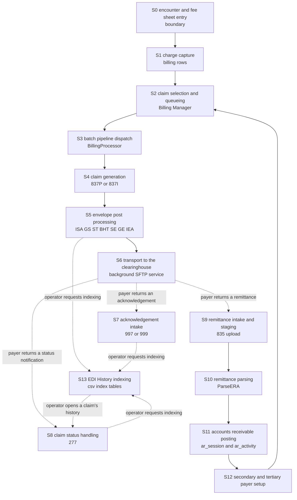
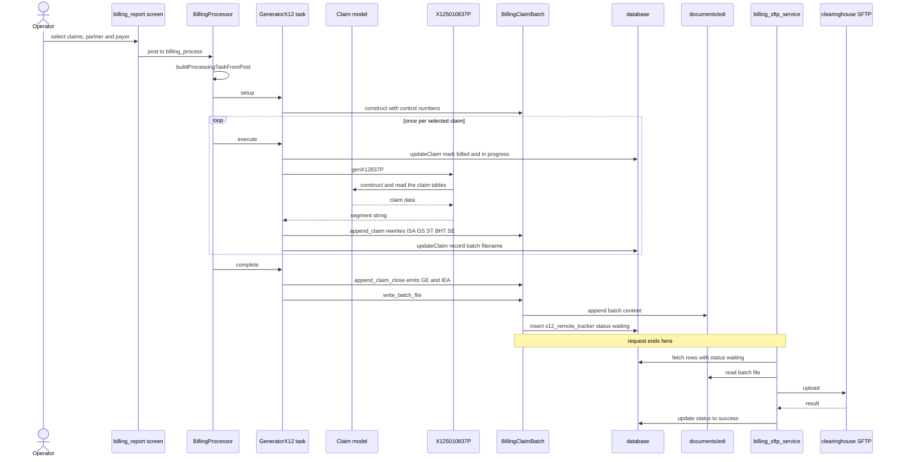
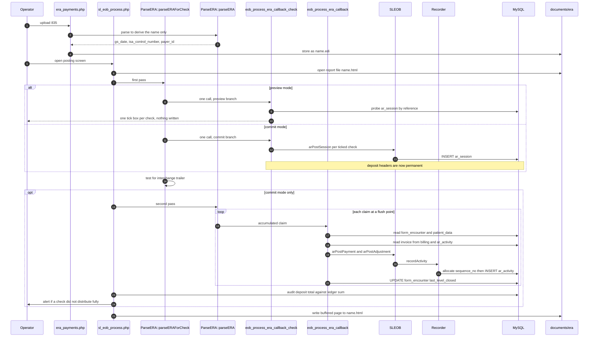
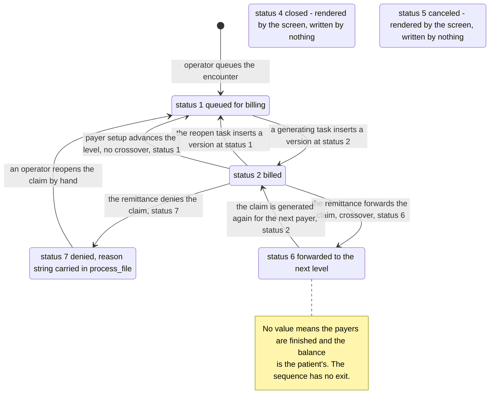
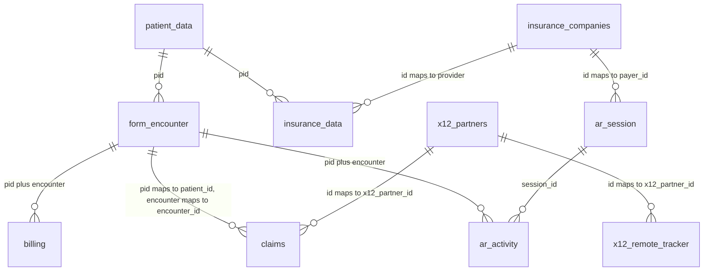

# OpenEMR Revenue Cycle Claim Lifecycle

What happens, in order, from the moment a charge is captured to the moment cash is posted against it, and what changes in the database and on disk when each step runs or fails.

**Scope and sources.** This document decomposes the revenue cycle into fourteen stages and records, for every one of them, the code entry point, the tables read, the tables written, the files produced or consumed, the state transitions and the failure modes together with the symptom an operator actually sees. It is traced from the charge-capture and claim-update paths in `src/Billing/BillingUtilities.php`, the batch pipeline under `src/Billing/BillingProcessor/`, the two claim generators `src/Billing/X125010837P.php` and `src/Billing/X125010837I.php`, the remittance parser `src/Billing/ParseERA.php`, the accounts-receivable poster `src/Billing/SLEOB.php`, the payment recorder `src/PaymentProcessing/Recorder.php`, the boundary screens `interface/billing/sl_eob_process.php` and `interface/billing/era_payments.php`, the legacy electronic data interchange (EDI) history index layer in `library/edihistory/`, and the schema in `sql/database.sql`. Every table named here is anchored to its own data definition language statement; every file named here is anchored to the code that composes its path. Conventions, the citation format and the two claim classes are defined once in [README.md](README.md) and are used here without variation. Which generation of the subsystem a given file belongs to, and how the generations reach one another, is the subject of [architecture.md](architecture.md).

**Provenance.** Every anchor below is relative to branch `master` at head commit `b7a7e690e419de3451740f995b768a8e8e5fba87`, on project version 8.3.0-dev (`version.php:L17-L20`). Nothing was executed to produce this document: PHP and Composer were not installed in the environment in which it was written, so no part of the subsystem was run and no test was invoked. Every claim rests on static reading of file contents at that commit.

## Table of Contents

- [How to Read a Stage](#how-to-read-a-stage)
    - [The six attributes](#the-six-attributes)
    - [The X12 vocabulary used in this document](#the-x12-vocabulary-used-in-this-document)
    - [Where the stage numbers come from](#where-the-stage-numbers-come-from)
    - [The four storage directories in one line each](#the-four-storage-directories-in-one-line-each)
    - [How a stage is reached](#how-a-stage-is-reached)
- [The Revenue Cycle End to End](#the-revenue-cycle-end-to-end)
- [Stage S0 Encounter and Fee Sheet Entry](#stage-s0-encounter-and-fee-sheet-entry)
- [Stage S1 Charge Capture](#stage-s1-charge-capture)
- [Stage S2 Claim Selection and Queueing](#stage-s2-claim-selection-and-queueing)
- [Stage S3 Batch Pipeline Dispatch](#stage-s3-batch-pipeline-dispatch)
- [Stage S4 Claim Generation](#stage-s4-claim-generation)
- [Stage S5 Envelope Post Processing](#stage-s5-envelope-post-processing)
- [Stage S6 Transport to the Clearinghouse](#stage-s6-transport-to-the-clearinghouse)
- [Stage S7 Acknowledgement Intake](#stage-s7-acknowledgement-intake)
- [Stage S8 Claim Status Handling](#stage-s8-claim-status-handling)
- [Stage S9 Remittance Intake and Staging](#stage-s9-remittance-intake-and-staging)
- [Stage S10 Remittance Parsing](#stage-s10-remittance-parsing)
- [Stage S11 Accounts Receivable Posting](#stage-s11-accounts-receivable-posting)
- [Stage S12 Secondary and Tertiary Payer Setup](#stage-s12-secondary-and-tertiary-payer-setup)
- [Stage S13 EDI History Indexing](#stage-s13-edi-history-indexing)
- [The Stage by Table Matrix](#the-stage-by-table-matrix)
    - [The supplementary inventory: ten further stored objects](#the-supplementary-inventory-ten-further-stored-objects)
- [Stage Test Coverage](#stage-test-coverage)
- [Claim Status Transitions](#claim-status-transitions)
- [The Core Revenue Cycle Tables](#the-core-revenue-cycle-tables)
- [What an Engineer Can Predict](#what-an-engineer-can-predict)
- [Related Documents](#related-documents)
- [Documentation Attribution](#documentation-attribution)

## How to Read a Stage

### The six attributes

Every stage below carries the same six attributes under the same six labels, in the same order, so that a stage can be read on its own and two stages can be compared without re-reading either in full.

| Attribute | What it records | Admissibility rule applied |
|-----------|-----------------|-----------------------------|
| **Entry point** | The file and line at which the stage begins executing | Anchored to the function or statement itself, never to a comment describing it |
| **Tables read** | Every table the stage queries, with the line of the query | One anchor per table per stage; a table read only through a service class is marked as such |
| **Tables written** | Every table the stage inserts into, updates or soft-deletes | Admissible only if the named column exists at a cited `sql/database.sql` anchor. Column names were checked against the schema, not against the code that writes them |
| **Files produced or consumed** | Every filesystem artifact, named together with the directory it lands in | The directory is anchored to the code that composes its path, since none of the four is a fixed literal |
| **State transitions** | Which column moves from which value to which value | Both the write and the column's own declaration are anchored |
| **Failure modes and operator-visible symptoms** | The internal behaviour on failure **and** what a human at the screen actually sees | Both halves are required. Where the answer is that the operator sees nothing, that is written down as the answer rather than omitted |

The second half of the last attribute is the one most often missing from documentation of this kind, and in this subsystem it is frequently the more consequential half. Four verified failure paths are either silent or actively misleading at the screen: a batch run that terminates the request mid-batch, leaving claims marked billed and no file at all (`src/Billing/BillingProcessor/BillingClaimBatch.php:L220-L226`), a transport failure that is overwritten with a success status (`src/Billing/BillingProcessor/X12RemoteTracker.php:L112-L121`), a tertiary-payer advance that requeues the claim to the payer that has just paid it while the screen reports it as requeued to the secondary (`src/Billing/SLEOB.php:L285-L286` with `interface/billing/sl_eob_process.php:L721-L725`), and a remittance whose posting is abandoned part-way through by an unrecognised segment, leaving every claim already flushed handed to the posting callback rather than necessarily written - the number that reaches accounts receivable is at most the number the parser emitted, and is zero in a dry run - and every later claim lost (`src/Billing/ParseERA.php:L467-L468`). Each is set out under its own stage, and each is cross-referenced to [defect-candidates.md](defect-candidates.md), which is where a suspected defect is registered with a verification. This document describes behaviour; it proposes no change to any of it.

There is deliberately no seventh attribute for test coverage. Whether a stage's code is exercised by a test is not a property of what that code does, and it changes as tests are added or removed, so recording it inside fourteen stage sections would put fourteen separate places out of date at once. Every stage's coverage verdict is instead collected in [Stage Test Coverage](#stage-test-coverage) below, which names the covering test file and the configuration that collects it, or the literal `none`, for each of S0 through S13. A reader deciding whether to trust a stage's description should read that section alongside it, because the verdict there is the literal `none` for six of the fourteen stages - S1, S2, S6, S7, S9 and S12 - and `none` for one half of each of two more, the charge-capture half of S0 and the poster in S11. That matrix is the exhaustive record; [The seven consequential gaps](#the-seven-consequential-gaps) beneath it expands the seven stages whose untested behaviour this document records as silent, abrupt or financially consequential, which is a subset selected by consequence and not a count of the stages that lack a test.

### The X12 vocabulary used in this document

X12 is the electronic data interchange (EDI) standard that United States healthcare payers, providers and clearinghouses use to exchange claims, eligibility questions and payments. An X12 file is flat text divided into **segments**, each beginning with a two- or three-character segment identifier and continuing as delimiter-separated **elements**; segments are grouped into nested **loops** identified by number. A **transaction set** inside such a file is identified by a number, and the numbers below are the ones this subsystem handles. Every term is expanded here rather than assumed, because the audience for this set is assumed to know PHP and SQL and not to know X12. This table is this document's own glossary, so a reader arriving by search has every term in one place.

| Term | Expansion | Where it appears in this lifecycle |
|------|-----------|------------------------------------|
| 837 | Health care claim | The outbound claim, built in [S4](#stage-s4-claim-generation) |
| 837P | 837 professional | The professional flavour, built by `genX12837P()` at `src/Billing/X125010837P.php:L40` |
| 837I | 837 institutional | The institutional flavour, built by `generateX12837I()` at `src/Billing/X125010837I.php:L26` |
| 835 | Health care claim payment and remittance advice | The inbound payment file, parsed in [S10](#stage-s10-remittance-parsing) by `parseERA()` at `src/Billing/ParseERA.php:L85` |
| ERA | Electronic remittance advice | The everyday name for an 835 file, and the name of the directory it is staged in, composed at `interface/billing/sl_eob_process.php:L749` |
| EOB | Explanation of benefits | A payer's statement of how it adjudicated a claim; the screen that posts one is `interface/billing/sl_eob_process.php` |
| 270 and 271 | Eligibility inquiry and eligibility information | The pre-claim coverage check in [S0](#stage-s0-encounter-and-fee-sheet-entry), dispatched from `src/Billing/EDI270.php:L379` and parsed at `src/Billing/EDI270.php:L927` |
| 276 and 277 | Claim status request and claim status notification | The status exchange in [S8](#stage-s8-claim-status-handling); only the 277 answer is handled here |
| 278 | Health care services review information | Authorisation and referral. Recognised by the dispatch map at `src/Billing/EdiHistory/X12File.php:L102` and indexed in [S13](#stage-s13-edi-history-indexing), but never generated |
| 997 and 999 | Functional acknowledgement and implementation acknowledgement | The syntactic receipt for a transmitted file, read for rejections in [S7](#stage-s7-acknowledgement-intake) |
| ISA and IEA | Interchange control header and trailer | The outermost envelope, emitted at `src/Billing/X125010837P.php:L60` and rewritten in [S5](#stage-s5-envelope-post-processing) |
| GS and GE | Functional group header and trailer | The group envelope, emitted at `src/Billing/X125010837P.php:L79`; its first element is what this subsystem dispatches on at `src/Billing/EdiHistory/X12File.php:L101-L102` |
| ST and SE | Transaction set header and trailer | The envelope around a single transaction, emitted at `src/Billing/X125010837P.php:L101` and renumbered in [S5](#stage-s5-envelope-post-processing) |
| BHT | Beginning of hierarchical transaction | Emitted immediately after ST at `src/Billing/X125010837P.php:L108-L115`; its third element is the value [S5](#stage-s5-envelope-post-processing) substitutes |
| CLM | Claim information | The segment carrying the claim identifier, at `src/Billing/X125010837P.php:L673-L690` |
| CLP | Claim payment information | The 835 segment that opens one claim's payment detail, handled at `src/Billing/ParseERA.php:L235-L268` |
| SVC | Service payment information | The 835 segment carrying one service line's charge and payment, handled at `src/Billing/ParseERA.php:L346-L387` |
| CAS | Claim or service adjustment | The 835 segment carrying a reduction and its reason, handled at claim level at `src/Billing/ParseERA.php:L269-L295` and at service level at `src/Billing/ParseERA.php:L394-L416` |
| PLB | Provider level adjustment | An 835 adjustment against the provider rather than a claim, deliberately kept out of accounts receivable at `src/Billing/ParseERA.php:L429-L431` |
| MIA | Medicare inpatient adjudication information | An 835 segment the legacy renderer understands at `library/edihistory/edih_835_html.php:L531` and the modern parser does not recognise at all |
| LX | Header number | The 835 segment that opens loop 2000, a logical grouping of claim payment information as the source describes it at `src/Billing/ParseERA.php:L221`, and one of the four flush points, at `src/Billing/ParseERA.php:L219-L230`. Service-line detail is one level further in, at SVC and loop 2110 |
| BPR | Beginning segment for payment order | The 835 segment carrying the cheque amount and date, at `src/Billing/ParseERA.php:L148-L155` |
| TRN | Trace | The 835 segment carrying the cheque number, at `src/Billing/ParseERA.php:L156-L165` |
| NM1 | Individual or organizational name | Party identification; the qualifier in its first element decides whose name it is, as at `src/Billing/ParseERA.php:L296-L316` |
| DTM and DTP | Date or time, in the 835 and in the 277 respectively | Dates on a claim or service line, as at `src/Billing/ParseERA.php:L389-L393` |
| AMT | Monetary amount | A supplementary amount, such as the allowed amount at `src/Billing/ParseERA.php:L419-L421` |
| QTY | Quantity | A supplementary count, as at `src/Billing/ParseERA.php:L427-L428` |
| PWK | Paperwork | The segment announcing a supporting document, emitted at `src/Billing/X125010837P.php:L786-L792` |
| TA1 | Interchange acknowledgement | The interchange-level receipt inside a 997 or 999, read at `library/edihistory/edih_997_error.php:L69-L80` |
| IK3 and AK3 | Implementation and functional data segment note | The element identifying which segment a payer rejected, read at `library/edihistory/edih_997_error.php:L102-L117` |
| A/R | Accounts receivable | What is owed and by whom; the two tables that hold it are `ar_session` (`sql/database.sql:L10158`) and `ar_activity` (`sql/database.sql:L10188`) |
| SFTP | SSH File Transfer Protocol | The file-transfer mechanism by which a batch reaches a clearinghouse in [S6](#stage-s6-transport-to-the-clearinghouse); the six partner fields it requires are listed at `src/Billing/BillingProcessor/X12RemoteTracker.php:L35-L42`. It is a file-transfer protocol carried over SSH, and not the unrelated FTPS |

### Where the stage numbers come from

The fourteen stage numbers are this documentation set's own. VERIFIED: the code declares no stage numbering and no state machine object; a claim's position in the cycle is inferable only from column values, principally `claims.status` (`sql/database.sql:L383`), `billing.bill_process` (`sql/database.sql:L260`) and `form_encounter.last_level_billed` (`sql/database.sql:L2035`). The numbers exist so that a stage can be referred to unambiguously from the seven sibling documents. S0 is numbered zero because it is a boundary stage: its entry point is identified so that a reader can find the seam at which charges originate, and its screen internals are not documented.

Two structural points about the ordering are worth stating before the stages themselves, because both break the impression of a single linear pipeline.

VERIFIED: stages S1 through S6 are not one request. Charge capture and claim generation run inside operator-initiated web requests, but transport runs from a separate background service: the only caller of the upload routine is `library/billing_sftp_service.php:L26`, inside a function declared at `library/billing_sftp_service.php:L23` and gated on a site-level global at `library/billing_sftp_service.php:L25`. A batch file therefore sits in the outbound directory, with a queue row beside it, until that service next runs.

VERIFIED: the cycle re-enters itself rather than terminating. Posting a primary payer's remittance in S11 can queue the same encounter to the next payer through S12 (`interface/billing/sl_eob_process.php:L717-L727`), which reopens the claim (`src/Billing/SLEOB.php:L292-L296`) and returns it to S2. A single encounter can therefore traverse S2 through S12 up to three times, once per payer level.

### The four storage directories in one line each

Four directories are in play, and every file named in a stage below lands in exactly one of them. The topology, including which component writes and which reads each, is documented in [architecture.md](architecture.md); the one-line summary below exists so that this document's file lists can be read without leaving it.

| Directory | Path, relative to the site directory | Composed at | What it holds |
|-----------|--------------------------------------|-------------|---------------|
| Outbound batch | `documents/edi` | `src/Billing/BillingProcessor/BillingClaimBatch.php:L65` | Generated claim batch files, and - the one thing in it that is not outbound - the 271 archives written by the eligibility upload screen through the filesystem encryption accessor, per `interface/globals.php:L368` and `interface/billing/edi_271.php:L44` |
| History root | `documents/edi/history` | `library/edihistory/edih_csv_inc.php:L335` | The index tables under `csv`, the per-transaction stores `f270` through `f997`, plus `log` and `archive` |
| History staging | `documents/edi/history/tmp` | `library/edihistory/edih_csv_inc.php:L348-L360` | Uploaded files before they are typed and filed |
| Remittance staging | `documents/era` | `interface/billing/sl_eob_process.php:L749` and `interface/billing/era_payments.php:L151` | Inbound remittance files and the posting reports written beside them |

VERIFIED: the remittance staging directory is a sibling of the outbound directory rather than a child, and the history root is a child of the outbound directory (`library/edihistory/edih_csv_inc.php:L392-L393`). The history index therefore never sees `documents/era`, and its own `f835` store is a different directory entirely (`library/edihistory/edih_csv_inc.php:L756-L757`). The consequence for a reader tracing a remittance is stated in [S9](#stage-s9-remittance-intake-and-staging) and [S13](#stage-s13-edi-history-indexing).

### How a stage is reached

Not every stage begins the same way, and which way a given stage begins is what its **Entry point** attribute records. Six of the fourteen begin at a screen with a URL of its own; the rest begin inside another stage's request, or when a file sent by a payer is uploaded.

VERIFIED: the six screens are `interface/billing/billing_process.php` ([S3](#stage-s3-batch-pipeline-dispatch)), `interface/billing/edi_270.php` and `interface/billing/edi_271.php` ([S0](#stage-s0-encounter-and-fee-sheet-entry)), `interface/billing/sl_eob_process.php` ([S11](#stage-s11-accounts-receivable-posting)), `interface/billing/era_payments.php` ([S9](#stage-s9-remittance-intake-and-staging)) and `interface/billing/edih_main.php` ([S7](#stage-s7-acknowledgement-intake) and [S13](#stage-s13-edi-history-indexing)). Each is cited again, with the line at which its own work begins, under the stage it opens. VERIFIED: only two of the six are menu entries, at `interface/main/tabs/menu/menus/standard.json:L1545-L1567`; the other four are opened from another screen, and which screen that is matters because it is where the operator actually is when the stage starts. The Billing Manager posts to the batch processor at `interface/billing/billing_report.php:L743`; the posting screen is opened from the EOB search screen at `interface/billing/sl_eob_search.php:L1309` and from the remittance intake screen at `interface/billing/era_payments.php:L237`; the remittance intake screen is linked from the payment screens, as at `interface/billing/new_payment.php:L369`; and the EDI History screen is the target of the forms on its own view partial, as at `interface/billing/edih_view.php:L106`.

## The Revenue Cycle End to End

The following diagram answers one question: in what order do the fourteen stages run, and where does the flow leave one process and resume in another. Solid arrows are the forward progression the pipeline is built to follow. Dashed arrows are discontinuities: nothing in the documented surface advances the flow across them, and it resumes only when something outside the current request happens. There are seven, of two kinds - three payer responses that arrive as uploaded files, and four operator actions in the EDI History screen, which is the only thing in the subsystem that ever triggers indexing or reads the index back. The prose under each stage below carries the citations; this diagram carries none, by the convention that a node label is a name rather than evidence.

Three features of that shape are verified rather than schematic, and each is the reason a stage below reads the way it does.

VERIFIED: the arrow from S12 back to S2 is a real cycle, not a convenience - **on one of that stage's two branches only.** The cleanup block of the posting callback calls the secondary setup routine at `interface/billing/sl_eob_process.php:L717-L727`, and on the ordinary branch that routine writes a status of 1, at `src/Billing/SLEOB.php:L277`, which the claim updater translates into `billed = 0` on the charge rows at `src/Billing/BillingUtilities.php:L1597-L1598`, returning the encounter to the queue the Billing Manager reads. VERIFIED: the crossover branch does not close this cycle. It writes a status of 6, at `src/Billing/SLEOB.php:L275`, and 6 is greater than 1, so the same updater writes `billed = 1` instead, at `src/Billing/BillingUtilities.php:L1592-L1593`. VERIFIED: the Billing Manager applies an unbilled criterion by default, setting it at `interface/billing/billing_report.php:L722-L726` and translating it into the predicate at `src/Billing/BillingReport.php:L46`, so a crossover claim is not on the screen an operator opens - it is reachable only by changing the search criteria. The full comparison of the two branches is under [S12](#stage-s12-secondary-and-tertiary-payer-setup).

VERIFIED: the three dashed arrows out of S6 are not alternatives that the code chooses between. Nothing in the documented surface polls for or requests any of the three inbound file types. All three arrive because an operator uploads a file, through the EDI History upload handler at `interface/billing/edih_main.php:L149-L151` for acknowledgements and status notifications, and through the remittance intake screen at `interface/billing/era_payments.php:L117-L173` for remittances.

VERIFIED: the four dashed arrows touching S13 are dashed for the same reason as the three out of S6 - nothing advances them but an operator. Indexing runs only when the EDI History screen receives an explicit request, dispatched at `interface/billing/edih_main.php:L232-L237`, so a batch file written in S5 or an acknowledgement filed in S7 can sit unindexed indefinitely. The indexer then reads whatever files are present and writes index rows (`library/edihistory/edih_io.php:L254-L257`), and the operator screens read those rows back to display a claim's history (`library/edihistory/edih_csv_data.php:L291`). The pair of arrows between S13 and S8 is the index being written and then queried, not two different flows.

## Stage S0 Encounter and Fee Sheet Entry

A boundary stage. Its entry point is identified so that a reader can find the seam at which charges and coverage information originate; its screen internals, form rendering and clinical logic are not documented, per the scope statement in [README.md](README.md).

**What the six attributes below cover for this stage, and what they deliberately do not.** The two entry points are treated differently on purpose, and a reader needs to know which half of this section is exhaustive.

- The eligibility path is documented in full, because it is an X12 path and therefore squarely inside this document's subject. In full means both directions and both screens: the outbound real-time 270 request that the eligibility batch screen sends over HTTP, including what happens when the payer, the transport or the request's own preconditions defeat it, and the inbound 271 that the upload screen stores, parses and persists. The segment composition of either transaction is not here; it is in [transactions.md](transactions.md).
- The fee sheet path is documented only where it touches the revenue cycle: the visit checksum that guards the submission, the charge insert that is stage [S1](#stage-s1-charge-capture), the copay accounts-receivable write, and the two writes that change what a later claim will say. All four are recorded below.
- VERIFIED: what is excluded is dispensing and pricing. `FeeSheet::save()`, declared at `library/FeeSheet.class.php:L925`, also updates drug inventory and dispensed-sale rows and reads drug and prescription rows, in the dispensing block at `library/FeeSheet.class.php:L1182-L1424`, and the price list is read to derive a fee at `library/FeeSheet.class.php:L505`, `library/FeeSheet.class.php:L689` and `library/FeeSheet.class.php:L1604-L1608`. Those objects are named here so that a reader knows they were examined and excluded rather than missed. `drug_sales` is the one of them that appears in this document's matrix, because the charge-capture and reversal paths reach it too.

**Entry point.** Two independent ones. Charges enter through the fee sheet: the form computes a visit checksum as it is built at `interface/forms/fee_sheet/new.php:L487`, posts it back in a hidden field at `interface/forms/fee_sheet/new.php:L1768`, compares it on submission at `interface/forms/fee_sheet/new.php:L510-L511`, and calls `FeeSheet::save()`, declared at `library/FeeSheet.class.php:L925`, from the guarded branch at `interface/forms/fee_sheet/new.php:L534-L538`. Coverage information enters through the eligibility screens: `interface/billing/edi_270.php:L167` requests real-time eligibility and `interface/billing/edi_271.php:L65` parses a returned 271 through `EDI270::parseEdi271()` at `src/Billing/EDI270.php:L927`. VERIFIED: the two eligibility screens are reached from the menu rather than from the fee sheet, at `interface/main/tabs/menu/menus/standard.json:L1545-L1567`, so neither path into this stage depends on the other having run.

**Tables read.** On the fee sheet path, within the scope stated above: `billing`, `drug_sales` and `form_encounter` for the visit checksum, in three subqueries at `library/FeeSheet.class.php:L321-L327`, `library/FeeSheet.class.php:L328-L334` and `library/FeeSheet.class.php:L335-L341`; and `ar_activity` when an existing copay is being edited, at `library/FeeSheet.class.php:L989-L992`.

On the eligibility path: `patient_data`, `users`, `facility`, `insurance_data` and `insurance_companies` in one join at `src/Billing/EDI270.php:L414-L418`, then `insurance_data` again for the copay at `src/Billing/EDI270.php:L686`, `eligibility_verification` at `src/Billing/EDI270.php:L693` and `benefit_eligibility` at `src/Billing/EDI270.php:L610`. VERIFIED: this path also reads `x12_partners` (`sql/database.sql:L10025`) through `EDI270::getX12Partner()`, either one partner by identifier at `src/Billing/EDI270.php:L752` or every partner at `src/Billing/EDI270.php:L755` when none was named.

VERIFIED: one further read is conditional on site configuration rather than on the transaction, and it is easy to miss because no billing file names the table. The 271 upload encrypts the file before storing it, at `interface/billing/edi_271.php:L59`, through the filesystem accessor at `src/BC/Crypto/ContextualEncryptionTrait.php:L31-L40`, which uses the database key source. Obtaining that key selects from `keys` (`sql/database.sql:L3511`) at `src/Common/Crypto/CryptoGen.php:L403`, and creates the key when absent by inserting at `src/Common/Crypto/CryptoGen.php:L429` and selecting it back at `src/Common/Crypto/CryptoGen.php:L432`. VERIFIED: the whole encryption step is skipped, and with it the `keys` access, when the `drive_encryption` global is off, at `src/BC/Crypto/ContextualEncryptionTrait.php:L36-L37` against the flag set at `src/Common/Crypto/CryptoGen.php:L83-L84`.

**This document therefore says "accessor" rather than "encrypted" throughout, because the accessor is a pass-through on either side when that global is off.** VERIFIED: on the skipped path the writing accessor returns its argument unchanged at `src/BC/Crypto/ContextualEncryptionTrait.php:L36-L37`, and the reading accessor returns its argument unchanged whenever the stored value carries no marker, at `src/BC/Crypto/ContextualEncryptionTrait.php:L62-L64`. The lifecycle consequence is that a stored 271 parses identically under either setting, so nothing downstream of this stage has to know which setting produced a given archive.

**Tables written.** On the fee sheet path, `billing` and `drug_sales` - the charge insert is stage [S1](#stage-s1-charge-capture) and is documented there rather than duplicated here - **and, for a copay, `ar_session` and `ar_activity`.** That last pair is the fact this stage is most often documented without, and it is the reason the claim that accounts receivable is first written later in the cycle is false.

VERIFIED: the copay branch is inside the same `FeeSheet::save()` this section names as its entry point, opening at `library/FeeSheet.class.php:L982`, and it writes the ledger both ways.

| Case | What is written | Where |
|------|-----------------|-------|
| A new copay | An insert into `ar_session` naming nine columns - `payer_id` as the literal `'0'`, `user_id`, `pay_total`, `payment_type` as `'patient'`, `description` as `'COPAY'`, `patient_id`, `payment_method` as the empty string, `adjustment_code` as `'patient_payment'` and `post_to_date` as the current time | `library/FeeSheet.class.php:L1008-L1014` |
| An edited copay whose amount changed | An update of the existing `ar_session` row, setting `user_id`, `pay_total`, `modified_time` and `post_to_date` | `library/FeeSheet.class.php:L993-L999` |
| An edited copay, either way | A soft delete of the prior ledger lines, setting `ar_activity.deleted` to the current time for the session's rows whose account code is `PCP` | `library/FeeSheet.class.php:L1001-L1005` |
| Both cases | An insert into `ar_activity` through the modern recorder, twenty columns at `src/PaymentProcessing/Recorder.php:L146-L167`, with the payer type `'0'`, an adjustment amount of `'0.0'` and the account code `PCP` | `library/FeeSheet.class.php:L1017-L1030` |

VERIFIED: the amount is sign-normalised before any of that happens - a negative fee is multiplied by minus one at `library/FeeSheet.class.php:L983-L985` - so a copay cannot be entered as a negative number here, and the reversal idiom this subsystem uses elsewhere is unavailable on this path. VERIFIED: the sequence number on the new ledger line is allocated by reading the maximum for the patient and encounter, at `src/PaymentProcessing/Recorder.php:L209-L213`, and the file's own comment at `src/PaymentProcessing/Recorder.php:L204-L206` records that this remains a race even inside the surrounding transaction opened at `src/PaymentProcessing/Recorder.php:L169`.

VERIFIED: the fee sheet also writes two columns that decide what a later claim will contain, which is why they are in scope here rather than excluded with the dispensing block. `form_encounter.provider_id` and `form_encounter.supervisor_id` are updated when the submitted default or supervising provider differs from the encounter's current one, at `library/FeeSheet.class.php:L1431-L1434` and `library/FeeSheet.class.php:L1439-L1442`, against the declarations at `sql/database.sql:L2022`; the provider on the encounter is what stage [S4](#stage-s4-claim-generation) renders as the claim's provider. `patient_data.pricelevel` is updated when the submitted price level differs from the patient's current one, at `library/FeeSheet.class.php:L1546-L1549`, and that level is what the price lookup above resolves a fee against. Both writes are conditional on a change and both log a fee-sheet message rather than raising anything visible.

On the eligibility path, two tables that no other stage touches: `eligibility_verification` by a `REPLACE INTO` at `src/Billing/EDI270.php:L701`, whose target columns `verification_id`, `insurance_id`, `response_id`, `eligibility_check_date` and `create_date` are declared at `sql/database.sql:L1648-L1655`; and `benefit_eligibility` by a delete-then-insert pair, deleting every row for the verification at `src/Billing/EDI270.php:L710` and inserting seventeen columns at `src/Billing/EDI270.php:L734-L737`, against the declaration at `sql/database.sql:L14082-L14099`. Conditionally, and only on first use with filesystem encryption enabled, `keys` as described above.

**Files produced or consumed.** None on the fee sheet path. Two things happen on the eligibility path, and they are usually conflated.

VERIFIED: **the 271 upload does write a file, and it writes it outside the history tree.** The destination directory is the `edi_271_file_path` global, set to the site's `documents/edi/` at `interface/globals.php:L368` and read at `interface/billing/edi_271.php:L38`. The stored name is that directory, then the current Unix timestamp, then the uploaded file's base name, concatenated at `interface/billing/edi_271.php:L44`, so each upload lands as `documents/edi/<timestamp><originalname>`.

VERIFIED: that name is not unique, and nothing on this path makes it so. The timestamp is `time()` at `interface/billing/edi_271.php:L44`, which has whole-second resolution; the base name is taken from the upload unchanged in the same expression; and the write is a plain `file_put_contents()` at `interface/billing/edi_271.php:L60` with no exclusive-create flag, no prior existence test, no suffix loop and no higher-resolution component anywhere in the composition. Two uploads carrying the same base name inside the same second therefore resolve to the same path, and the later write replaces the earlier archive. VERIFIED: neither the replacement nor the loss is reported. The write is tested only for a truthy byte count at `interface/billing/edi_271.php:L60`, and a write that replaces an existing file returns that count exactly as a write to a new path does, so the operator sees the ordinary confirmation message from `interface/billing/edi_271.php:L61` in both cases. The collision needs both halves of the name to agree, so it is reachable when an operator retries the same file within a second or two operators submit the payer's response under the name the payer gave it, and unreachable once the second has turned over.

The bytes are passed through the filesystem encryption accessor before being written, at `interface/billing/edi_271.php:L59-L60`, and the file is read straight back and passed through the matching decryption accessor in the same request in order to parse it, at `interface/billing/edi_271.php:L62-L65`. VERIFIED: both accessors are pass-throughs when the `drive_encryption` global is off, at `src/BC/Crypto/ContextualEncryptionTrait.php:L36-L37` against the flag set at `src/Common/Crypto/CryptoGen.php:L83-L84`, so the round trip within this request succeeds under either setting and the parse that follows it is unaffected. Nothing ever deletes the file, so this directory accumulates one archive per distinct name, which is one per upload except where the collision above merges two.

VERIFIED: that archive is not the history store, and the distinction matters to anyone looking for the file in the browser. The history stores for this transaction pair are `documents/edi/history/f270` and `documents/edi/history/f271`, whose paths come from the parameter table at `library/edihistory/edih_csv_inc.php:L749-L752`; the upload path writes to the parent `documents/edi` directory instead and files nothing into either store. An operator who wants a 271 to appear in the EDI History browser must upload it a second time, through that screen.

VERIFIED: `documents/edi` is the outbound batch directory, so a 271 archive is deposited alongside generated claim batches, and it is also the directory the history index treats as its outbound claim store, at `library/edihistory/edih_csv_inc.php:L738`. That store's scan is filtered by a batch-name pattern at `library/edihistory/edih_csv_inc.php:L739`, which an archive named from a timestamp and the operator's file name will not normally match, so the two uses coexist without colliding. VERIFIED: the comment at `library/edihistory/edih_csv_inc.php:L735`, which states that this project never writes to that directory, is accurate about the legacy tree and not about the directory - this upload path writes to it. VERIFIED: the batch 270 is not written to disk at all - it is echoed to the browser as a download, at `src/Billing/EDI270.php:L376` with the headers set at `interface/billing/edi_270.php:L192-L199`.

VERIFIED: one more file leaves this stage, and it displaces the page rather than accompanying it. When the 271 parse returns a log and the `disable_eligibility_log` global is off, the upload screen streams that log as an attachment named `elig-batch_log_<timestamp>.txt`, at `interface/billing/edi_271.php:L77-L88`, and terminates the request at `interface/billing/edi_271.php:L89`. On a successful upload the operator therefore receives a text file and never sees the confirmation message the code set a few lines earlier at `interface/billing/edi_271.php:L61`.

**What that downloaded log contains is worth recording where the file is named, because its content is wider than the word "log" suggests.** VERIFIED: on the batch request path the accumulator is appended once per patient row and carries the whole outbound 270 interchange text for that row, at `src/Billing/EDI270.php:L505`, together with the error accumulator, which on a rejected response carries the payer's own error code, error message and returned payload, at `src/Billing/EDI270.php:L867-L871`. VERIFIED: that accumulated text is what the batch eligibility screen streams to the browser as an attachment and nothing filters it, at `interface/billing/edi_270.php:L173-L188`. So the artifact this stage delivers to the operator is not a progress trace but the outbound interchange and the payer's reply verbatim, which is why it is described here as an artifact of the stage rather than as a log line.

**State transitions.** Three, two on the eligibility path and one on the fee sheet path.

`eligibility_verification.eligibility_check_date` moves from its previous value to the current timestamp on every check, because the write at `src/Billing/EDI270.php:L701` is a `REPLACE INTO` keyed on `verification_id`, so a re-check replaces the row rather than appending a second one. `benefit_eligibility` has no state transition in the usual sense: its rows for a verification are deleted wholesale at `src/Billing/EDI270.php:L710` and rebuilt, and the table declares no primary key at all (`sql/database.sql:L14081-L14100`), so there is no row identity to transition.

VERIFIED: on the copay path, `ar_activity.deleted` moves from null to the current timestamp for the session's prior `PCP` lines, at `library/FeeSheet.class.php:L1001-L1005`, and a replacement line is inserted immediately afterwards at `library/FeeSheet.class.php:L1017-L1030`. The soft-delete idiom is therefore already in use at this stage, before any payer is involved, and a copay edited three times leaves three superseded rows and one live one under the same session.

**Failure modes and operator-visible symptoms.** Eight: one on the fee sheet path, four on the 271 upload, and three on the outbound real-time 270 request.

Internally, the 271 upload rejects three classes of file before writing anything, accumulating a message rather than returning: a file over 350,000 bytes at `interface/billing/edi_271.php:L46-L48`, a file whose detected content type is not plain text at `interface/billing/edi_271.php:L49-L51`, and a file whose extension is one of four executable PHP extensions at `interface/billing/edi_271.php:L52-L55`. VERIFIED: nothing is stored or parsed when any of the three fires, because the storing branch is entered only when the accumulated message is still empty, at `interface/billing/edi_271.php:L56`. The operator sees the specific reason followed by the sentence "Sorry, there was a problem uploading your file" from `interface/billing/edi_271.php:L73`.

Internally, a write that does not succeed replaces the success message with a failure one, at `interface/billing/edi_271.php:L69-L71`, and no parse is attempted. The operator sees the sentence naming the file as having failed to save to the archive. VERIFIED: the test is the truthiness of the byte count returned at `interface/billing/edi_271.php:L60`, so an empty upload is reported this way as well, having written a zero-length file that remains on disk.

Internally, a stored file that reads back as nothing is reported as having failed to open, at `interface/billing/edi_271.php:L66-L68`, and the parse is skipped. VERIFIED: that message overwrites the success message already assigned at `interface/billing/edi_271.php:L61`, so the operator sees only the failure - but the stored file has already been written and stays there, in whichever of the two states the site's filesystem encryption setting produced.

Internally, a file that passes all of the above is parsed at `interface/billing/edi_271.php:L65` with no error branch at all: `EDI270::parseEdi271()` returns a log string, and the screen treats any string as success. The operator sees either the download described above or the confirmation message, and a 271 whose content was unusable is indistinguishable at the screen from one that persisted eligibility.

**Two of the three failure modes on the outbound real-time 270 request share one operator-visibility rule, so it is stated once before them; the third, a raised exception, bypasses this screen entirely and is treated separately under path one below.** VERIFIED: for the two that return accumulated text to the screen, whether the operator is told anything at all is decided by a single site global rather than by the failure. The eligibility batch screen computes a log flag as the negation of `disable_eligibility_log` at `interface/billing/edi_270.php:L165` and passes it into the request routine at `interface/billing/edi_270.php:L167`; the routine returns its accumulated log only when the flag is set, at `src/Billing/EDI270.php:L511-L513`, and otherwise returns the number of rows it processed, at `src/Billing/EDI270.php:L515`. With the flag set, the screen prefixes the sentence "One or more transactions failed" whenever the returned text contains the marker `Error:`, at `interface/billing/edi_270.php:L168-L172`, then streams the whole log as an attachment named `elig-log_<partner>_<timestamp>.txt` and terminates the request, at `interface/billing/edi_270.php:L173-L188`. VERIFIED: with the global on, and the flag therefore clear, the marker test still runs and still wraps the text, at `interface/billing/edi_270.php:L168-L172`, and the wrapped text is then discarded - the only statements that touch it after the test are inside the streaming branch, at `interface/billing/edi_270.php:L179`, `interface/billing/edi_270.php:L183` and `interface/billing/edi_270.php:L186`, the last of which is the one that emits it, and nothing outside that branch prints it at all. **So on a site with the eligibility log disabled, the two failures that return accumulated text - the precondition failure immediately below and the response-validation failure at the end of this stage - are silent: the operator sees the report screen redraw, with no error text of any kind and no indication that anything was attempted.** VERIFIED: this rule does not reach the third failure. On the raising path the request never returns to this screen, so nothing the screen prints is in play; the response is produced by the process-wide exception handler instead, at `src/Core/ErrorHandler.php:L94-L116`. The site global governs what this screen prints, not what that handler emits.

Internally, three preconditions are tested per patient row before any request is composed, and one failing row ends the whole batch. VERIFIED: a provider identifier of zero or a missing provider national provider identifier at `src/Billing/EDI270.php:L455-L457`, a payer with no eligibility identifier at `src/Billing/EDI270.php:L458-L460`, and a subscriber with no policy number or no date of birth at `src/Billing/EDI270.php:L461-L463` each append a sentence carrying the marker to an accumulator, which is tested and returned immediately afterwards at `src/Billing/EDI270.php:L464-L466`, before the interchange composition that begins at `src/Billing/EDI270.php:L468`. VERIFIED: the return is from inside the per-row loop opened at `src/Billing/EDI270.php:L451`, and it is a return rather than a `continue`, so it also discards the responses of every row already sent. Those responses accumulate in a local buffer at `src/Billing/EDI270.php:L502` and are parsed only after the loop, at `src/Billing/EDI270.php:L509`; a row that fails a precondition therefore means the payer answered for the earlier rows and this system persisted none of it, writing nothing to `eligibility_verification` or `benefit_eligibility` for any of them. VERIFIED: a failure of the request itself does not have that effect, because the accumulator is cleared at the end of every iteration at `src/Billing/EDI270.php:L506`, so the loop continues. The operator sees whatever the visibility rule above allows, and in neither case is the discarded work named.

Internally, the request is issued with no timeout, no retry and no exception handling of its own, and this single failure mode has two distinct paths according to whether the client raises or merely waits. The two are separated below because they differ in what the operator is told, and only one of them is silent. VERIFIED: the options array is assembled from exactly two entries, a headers map and a multipart body, at `src/Billing/EDI270.php:L843-L849`, and the call at `src/Billing/EDI270.php:L852` constructs its client inline with no configuration argument at all and passes only that array, so no connection timeout, no request timeout, no retry loop and no error-handling option is configured anywhere on this path. VERIFIED: neither file contains a `try` statement or a `catch` block. The enclosing method is declared at `src/Billing/EDI270.php:L776`, the routine that calls it at `src/Billing/EDI270.php:L496`, and the screen's own call site is at `interface/billing/edi_270.php:L167`; the only occurrence of the word in either file is prose inside a comment at `src/Billing/EDI270.php:L44`. Anything the client raises rather than returns therefore unwinds past all three frames.

**Path one, the client raises.** What unwinds does not vanish, and this is where an earlier reading of this screen goes wrong: the exception reaches a process-wide fallback handler that the screen installed before any of its own code ran. VERIFIED: the screen requires the global bootstrap at `interface/billing/edi_270.php:L23`, that bootstrap constructs an error handler at `interface/globals.php:L83-L88`, and the next line registers it at `interface/globals.php:L89` through the `set_exception_handler` call at `src/Core/ErrorHandler.php:L207-L209`. VERIFIED: the handler logs before it renders, at `src/Core/ErrorHandler.php:L96`, and a client exception lands in the fallback branch, which records the message `Uncaught exception!` with the exception attached at critical severity, at `src/Core/ErrorHandler.php:L188-L190`; the graded branch above it, which would downgrade the severity, applies only to exceptions implementing the framework's HTTP-exception interface, at `src/Core/ErrorHandler.php:L171-L183`. VERIFIED: the handler then builds a response at `src/Core/ErrorHandler.php:L103`, sets the status code and headers when none have been sent at `src/Core/ErrorHandler.php:L105-L112`, echoes the body at `src/Core/ErrorHandler.php:L114` and exits at `src/Core/ErrorHandler.php:L115`; for an exception that is not an HTTP exception the response is a 500 whose entire body is the fixed sentence `An error has occurred.`, at `src/Core/ErrorHandler.php:L130-L137`, the exception text being appended only when the handler was constructed with error display enabled, which `interface/globals.php:L87` derives from an environment variable being exactly `dev`. **So the operator is not left with nothing on this path: on any site not running in development mode the screen is replaced by an HTTP 500 carrying that one sentence, and a critical-severity entry is written to the log.** What is absent is the eligibility log and the report table, not a message and not a log record; no markup from this screen has been emitted at that point, because its document begins at `interface/billing/edi_270.php:L220`.

INFERRED (confidence: High): a payer that answers with a 4xx or 5xx status reaches path one rather than the returned-status arm at `src/Billing/EDI270.php:L864-L866`, so that arm is reachable only for statuses the client does not treat as an error. Basis: the client is constructed with no configuration argument at `src/Billing/EDI270.php:L852`, so every library default applies, and the documented default of the Guzzle HTTP client is to throw on error statuses; the dependency constraint `guzzlehttp/guzzle ^7.10.0` at `composer.json:L63` is verified, but the library is not vendored in this checkout and so the default itself could not be read from source here.

**Path two, the client waits.** VERIFIED: with no timeout configured the request is bounded only by the platform's own limits, and a stalled payer endpoint holds the browser for as long as those allow. VERIFIED: two facts in this repository decide what the operator is told when a limit expires instead of an exception being raised - the bootstrap deliberately declines to install the error handler, and says so, at `interface/globals.php:L90-L92`, and the handler class registers no shutdown function, installing exactly two things, at `src/Core/ErrorHandler.php:L199` and `src/Core/ErrorHandler.php:L209`. INFERRED (confidence: High): a request killed by an execution-time limit therefore produces neither the 500 body nor the critical log entry that path one produces. Basis: the two verified facts above, combined with documented PHP semantics under which an expiring execution-time limit is a fatal error rather than a thrown one and so never reaches an installed exception handler; nothing was executed to confirm it. **This is the path on which the operator genuinely sees nothing: a page that never arrives, with no eligibility log, no report table, no message and nothing from the handler above.**

Internally, a response that does return is validated on three counts, and the three are accumulated rather than distinguished. VERIFIED: the declared content length is compared with the received body length at `src/Billing/EDI270.php:L856-L857` and a mismatch appends a message at `src/Billing/EDI270.php:L861-L863` whose own words call it an integrity test, although the comparison supplies no digest, signature or message authentication code and establishes only that the body arrived at its declared length; a status other than 200 appends the reason phrase and the code at `src/Billing/EDI270.php:L864-L866`; and a response whose CAQH CORE error-code part is anything other than the success value appends that code and its message at `src/Billing/EDI270.php:L867-L869`, CAQH CORE being the Council for Affordable Quality Healthcare's Committee on Operating Rules for Information Exchange, whose connectivity rule defines the HTTP envelope this request travels in and whose multipart contract is set out in [transactions.md](transactions.md). VERIFIED: when any of the three has fired, the payload is appended as well and the accumulated text is returned in place of the 271, at `src/Billing/EDI270.php:L870-L873`; the caller detects the marker at `src/Billing/EDI270.php:L498`, diverts the text into the log at `src/Billing/EDI270.php:L499-L500` and leaves the response buffer untouched, so that row's response never reaches the 271 parser and nothing is written to `eligibility_verification` or `benefit_eligibility` for it. The operator sees the reason only under the visibility rule above.

Internally, the checksum comparison at `interface/forms/fee_sheet/new.php:L511` sets a message and records an audit event at `interface/forms/fee_sheet/new.php:L514-L523`, and because the charge-saving branch at `interface/forms/fee_sheet/new.php:L534` runs only when no message was raised, a concurrent edit discards the submission rather than merging it. The operator sees the message "Someone else has just changed this visit. Please cancel this page and try again." from `interface/forms/fee_sheet/new.php:L512`, which is explicit and actionable. VERIFIED: that guard does not cover the whole request. A diagnosis-update save runs earlier in the same handler, at `interface/forms/fee_sheet/new.php:L491-L501`, before the comparison at `interface/forms/fee_sheet/new.php:L510-L511`, so a diagnosis change can persist from a submission whose charge changes were then rejected. In that case the operator sees the same message and has no indication that part of the submission was kept.

## Stage S1 Charge Capture

**Entry point.** `BillingUtilities::addBilling()`, declared at `src/Billing/BillingUtilities.php:L1434-L1452`. VERIFIED: it has fourteen call sites across the repository, and they are not all clinical. The fee sheet calls it for every new item at `library/FeeSheet.class.php:L1149-L1167`; a clinical form calls it at `interface/forms/eye_mag/save.php:L863`; the encounter diagnosis screens call it at `interface/patient_file/encounter/diagnosis.php:L68`, `interface/patient_file/encounter/diagnosis.php:L81` and `interface/patient_file/encounter/diagnosis.php:L105`; the superbill screen calls it three times at `interface/patient_file/encounter/superbill_codes.php:L47-L51`; the checkout screens call it at `interface/patient_file/pos_checkout_normal.php:L649` and `interface/patient_file/pos_checkout_ippf.php:L1583`; the external interface calls it at `library/api.inc.php:L57` and `library/api.inc.php:L64`; and - the one that matters most for this document - the remittance poster calls it at `src/Billing/SLEOB.php:L194`, which means stage [S11](#stage-s11-accounts-receivable-posting) can create charges.

**Tables read.** On the insert path, `form_encounter` only, once, as a sanity check counting rows for the patient and encounter at `src/Billing/BillingUtilities.php:L1459-L1462`. The reversal path in the same file reads four more: `billing` and `drug_sales` in one union at `src/Billing/BillingUtilities.php:L1848-L1853` to find the last checkout timestamp, `ar_activity` at `src/Billing/BillingUtilities.php:L1861-L1863` and again at `src/Billing/BillingUtilities.php:L1875-L1877` to total what was posted, `form_encounter` again at `src/Billing/BillingUtilities.php:L1886-L1887` for the invoice reference number, and `users` joined to `list_options` at `src/Billing/BillingUtilities.php:L1800-L1806` to find the operator's invoice-number pool, the pool itself being a row in the option list selected by the operator's `irnpool` value.

**Tables written.** `billing`, by one insert at `src/Billing/BillingUtilities.php:L1467-L1474`. Twenty-one columns are named at `src/Billing/BillingUtilities.php:L1467-L1469` and every one of them exists in the declaration at `sql/database.sql:L245-L275`: `date`, `encounter`, `code_type`, `code`, `code_text`, `pid`, `authorized`, `user`, `groupname`, `activity`, `billed`, `provider_id`, `modifier`, `units`, `fee`, `ndc_info`, `justify`, `notecodes`, `pricelevel`, `revenue_code` and `payer_id`. The money column among them is `fee`, declared `decimal(12,2)` at `sql/database.sql:L266`.

**Files produced or consumed.** None. This stage is purely a database write.

**State transitions.** Three columns are set at insert time and are then the levers the rest of the pipeline pulls.

| Column | Set to | Where | Declared at |
|--------|--------|-------|-------------|
| `activity` | The literal `1` | `src/Billing/BillingUtilities.php:L1470` | `sql/database.sql:L258` |
| `billed` | The `$billed` parameter, which defaults to `0` | `src/Billing/BillingUtilities.php:L1447` and `src/Billing/BillingUtilities.php:L1473` | `sql/database.sql:L257` |
| `authorized` | The `$authorized` parameter, coerced from any falsy value to the string `"0"` | `src/Billing/BillingUtilities.php:L1454-L1456` | `sql/database.sql:L254` |

VERIFIED: `activity` is a literal in the statement rather than a bound parameter (`src/Billing/BillingUtilities.php:L1470`), so no caller can create an inactive charge. Deactivation is a separate operation: `deleteBilling()` at `src/Billing/BillingUtilities.php:L1482` sets `activity = 0` at `src/Billing/BillingUtilities.php:L1484`, which is a soft delete rather than a row removal. Two further single-column transitions live in the same file: `authorizeBilling()` at `src/Billing/BillingUtilities.php:L1477-L1479` moves `authorized`, and `clearBilling()` at `src/Billing/BillingUtilities.php:L1487-L1489` empties `justify`.

VERIFIED: reversal is a separate path in the same file, and it is the only writer of exactly two objects in this subsystem, `voids` and `list_options`; every other table it writes is also written by some other stage. `doVoid()` at `src/Billing/BillingUtilities.php:L1837` appends a row to `voids` at `src/Billing/BillingUtilities.php:L1895-L1905`, setting `patient_id`, `encounter_id`, `what_voided`, `date_voided`, `user_id`, `amount1`, `amount2`, `other_info`, `reason` and `notes`, all declared at `sql/database.sql:L10000-L10014`, plus `date_original` conditionally at `src/Billing/BillingUtilities.php:L1918`. On the purging variant it then soft-deletes the ledger lines at `src/Billing/BillingUtilities.php:L1930` or `src/Billing/BillingUtilities.php:L1949`, clears `billed` and `bill_date` on `billing` at `src/Billing/BillingUtilities.php:L1935` or `src/Billing/BillingUtilities.php:L1956` and on `drug_sales` at `src/Billing/BillingUtilities.php:L1941` or `src/Billing/BillingUtilities.php:L1961`, and calls `reOpenEncounterForBilling()` at `src/Billing/BillingUtilities.php:L1967`, which resets `last_level_billed`, `last_level_closed`, `stmt_count` and `last_stmt_date` on `form_encounter` at `src/Billing/BillingUtilities.php:L1989-L1994` against the declarations at `sql/database.sql:L2035-L2038`. On the non-purging variant it instead assigns a fresh invoice reference number, writing `form_encounter.invoice_refno` at `src/Billing/BillingUtilities.php:L1971-L1976` (`sql/database.sql:L2041`) and advancing the pool at `src/Billing/BillingUtilities.php:L1822-L1828`. VERIFIED: that statement joins `users` to `list_options` but its `SET` clause writes one column, `list_options.notes`, so the pool counter lives in the option list and `users` is read-only throughout this stage. That is why the matrix marks `users` as `R` in S1, while `list_options` is recorded as read and written here in [The supplementary inventory](#the-supplementary-inventory-ten-further-stored-objects), which is where it belongs because a numbering pool is not revenue-cycle data. VERIFIED: the whole block is gated at `src/Billing/BillingUtilities.php:L1894` on either purging or pools being in use, so a receipt void by a user with no pool configured writes nothing at all and returns silently. The operator sees no message either way, because `doVoid()` produces no output.

VERIFIED: the charge that stage [S11](#stage-s11-accounts-receivable-posting) creates from a remittance is inserted unauthorized. The call at `src/Billing/SLEOB.php:L194-L207` passes `0` for both the authorized flag and the provider, so a charge added because a payer paid for something absent from the claim arrives with `authorized` at `"0"`.

**Failure modes and operator-visible symptoms.** One failure mode, and it is abrupt. Internally, if the sanity check finds no matching encounter the function terminates the request with `die()` at `src/Billing/BillingUtilities.php:L1463-L1464`. The operator sees the bare translated string "Internal error: the referenced encounter no longer exists." on an otherwise blank or truncated page, with no navigation and no indication of how many of the other charges in the same submission were already written. Because the fee sheet loops over its items and calls this function once per new item at `library/FeeSheet.class.php:L1149`, a submission of several charges that trips this check leaves the earlier charges committed and the later ones absent. The insert itself has no failure branch: the return value of `sqlInsert()` at `src/Billing/BillingUtilities.php:L1472` is returned to the caller and the fee sheet does not test it.

## Stage S2 Claim Selection and Queueing

This stage is read-only. It is included as a stage rather than folded into S3 because the query that defines it decides which encounters can be billed at all, and a claim that this query does not return cannot reach any later stage.

**Entry point.** The Billing Manager screen, `interface/billing/billing_report.php`, which calls `BillingReport::getBillsBetween()` at `interface/billing/billing_report.php:L893` and `BillingReport::getBillsListBetween()` at `interface/billing/billing_report.php:L864`. The selecting statement is at `src/Billing/BillingReport.php:L135-L147`, in the method declared at `src/Billing/BillingReport.php:L125`. A second, reporting variant is at `src/Billing/BillingReport.php:L168-L180`, in the method at `src/Billing/BillingReport.php:L158`, with a copay branch that unions in `ar_activity` at `src/Billing/BillingReport.php:L188-L189`.

**Tables read.** Five in the selecting statement at `src/Billing/BillingReport.php:L135-L147`, joined outward from the encounter: `form_encounter` (`sql/database.sql:L2022`), then `billing` (`sql/database.sql:L245`) on encounter, patient, a code-type pattern and `activity = 1`, then `patient_data` (`sql/database.sql:L8334`), then `claims` (`sql/database.sql:L378`), then `insurance_data` (`sql/database.sql:L3306`) restricted to the primary row. The screen additionally reads `form_encounter` per row for the closed level at `interface/billing/billing_report.php:L1121`, and `ar_activity` (`sql/database.sql:L10188`) through the reporting variant at `src/Billing/BillingReport.php:L189`.

**Tables written.** None. Every write attributed to the act of billing happens in [S3](#stage-s3-batch-pipeline-dispatch) or later, after the operator has submitted the form.

**Files produced or consumed.** None.

**State transitions.** None. What this stage produces is a form submission, and the shape of that submission is the one piece of it a later stage depends on. VERIFIED: the form posts to the batch entry point at `interface/billing/billing_report.php:L743`, each selected claim is keyed patient-first as the patient identifier, a hyphen and the encounter identifier at `interface/billing/billing_report.php:L952`, and the payer for each claim is carried in a select element named `payer` at `interface/billing/billing_report.php:L1119`. The five submit buttons that reach the pipeline are `bn_mark` at `interface/billing/billing_report.php:L762` and `interface/billing/billing_report.php:L832`, `bn_x12` at `interface/billing/billing_report.php:L768`, `bn_x12_encounter` at `interface/billing/billing_report.php:L782` and `bn_reopen` at `interface/billing/billing_report.php:L835`.

**Failure modes and operator-visible symptoms.** Three. The characteristic failure mode of a selection query is invisibility, and two of these three are silent; the third is the most abrupt symptom in the whole screen.

Internally, the charge join is outer and its predicates sit in the join condition rather than in the where clause. VERIFIED: `billing` is joined with `LEFT OUTER JOIN` and the code-type pattern and `activity = 1` are both part of the `ON` condition, at `src/Billing/BillingReport.php:L138-L142`. An encounter with no matching charge row therefore still comes back, with every `billing.*` column null. The operator sees a row whose charge columns are blank, and nothing on the screen distinguishes an encounter that was never charged from one whose charges were all voided by setting `billing.activity` to 0, declared at `sql/database.sql:L258`. Both look identical, and both look like the encounter is simply not ready to bill.

Internally, the screen offers two date windows and its own source says one of them is the wrong one to use. VERIFIED: the criteria list presents "Date of Service" and "Date of Entry" as adjacent choices, mapped to `form_encounter.date` and `billing.date` respectively at `interface/billing/billing_report.php:L654-L657` and `interface/billing/billing_report.php:L670`, and the builder implements both, at `src/Billing/BillingReport.php:L79-L85` for the encounter date and `src/Billing/BillingReport.php:L86-L92` for the charge date. VERIFIED: the comment immediately above the selecting statement, at `src/Billing/BillingReport.php:L131-L133`, states that selecting by the date in the charge table is wrong because that column is only the data-entry date. Nothing on the screen repeats that warning. VERIFIED: the default is the safe one - a first load with no mode parameter sets "Date of Service = Today" at `interface/billing/billing_report.php:L722-L724`, alongside "Billing Status = Unbilled" at `interface/billing/billing_report.php:L725-L726`. The operator sees no symptom at all: a charge keyed weeks after the visit is present under one date window and absent under the other, both windows are labelled plausibly, and no message says which one the code considers correct. VERIFIED: one of the three fragments the statement interpolates is inert and can filter nothing. `$auth` is reset to the empty string at `src/Billing/BillingReport.php:L36` by the builder that every one of these methods calls first, and no statement anywhere assigns it again, so the fragment interpolated at `src/Billing/BillingReport.php:L146` is always empty.

Internally, an unrecognised search criterion terminates the request. VERIFIED: any criterion the builder does not match by name falls to the final else at `src/Billing/BillingReport.php:L100`, where its column and comparison are passed through `escape_identifier()` against six-item and two-item whitelists at `src/Billing/BillingReport.php:L102-L114` with the die-if-no-match argument set true. VERIFIED: that argument makes a miss fatal. `escape_identifier()` writes to the error log and calls `die()` at `library/formdata.inc.php:L229-L230`. The operator sees the Billing Manager page stop mid-render at a red sentence, "There was an OpenEMR SQL Escaping ERROR of the following string" followed by the rejected text, with no list, no navigation and no billing-specific explanation.

One restriction that is easy to attribute to this stage belongs to another. VERIFIED: the claim lookup bounded by `status > 0 AND status < 4` is in the claim updater, at `src/Billing/BillingUtilities.php:L1539-L1540`, not in this screen's query, and what it makes invisible is documented where it executes, under [S4](#stage-s4-claim-generation). VERIFIED: the selection query here applies no status restriction of any kind - it joins `claims` unrestricted at `src/Billing/BillingReport.php:L144`, so a claim the updater cannot find is still listed on this screen.

## Stage S3 Batch Pipeline Dispatch

This stage chooses which of eleven concrete tasks will handle the submission, builds the claim objects, and - for the two tasks that generate no file - completes the whole operation. For the nine generating tasks it hands over to [S4](#stage-s4-claim-generation).

**Entry point.** `interface/billing/billing_process.php`, a 65-line delegator: it obtains the active session at `interface/billing/billing_process.php:L28`, checks the cross-site request token at `interface/billing/billing_process.php:L29`, constructs the processor at `interface/billing/billing_process.php:L32` and runs it at `interface/billing/billing_process.php:L33`. VERIFIED: it is reached only as the target of the Billing Manager's form, at `interface/billing/billing_report.php:L743`, which is the sole reference to it anywhere in the repository, so this stage never starts except from an operator's action on the screen described in [S2](#stage-s2-claim-selection-and-queueing). The processor's own entry point is `BillingProcessor::execute()` at `src/Billing/BillingProcessor/BillingProcessor.php:L78-L95`, which does exactly three things in order: build the task at `src/Billing/BillingProcessor/BillingProcessor.php:L81`, build the claim list at `src/Billing/BillingProcessor/BillingProcessor.php:L84`, and process them at `src/Billing/BillingProcessor/BillingProcessor.php:L89`.

The task is chosen by a single chain of conditions on the submitted button name at `src/Billing/BillingProcessor/BillingProcessor.php:L160-L192`. The order of that chain is behaviour, not formatting, because the buttons are not mutually exclusive at the HTTP level.

| Submitted name | Task constructed | At |
|----------------|------------------|----|
| `bn_reopen` | `TaskReopen` | `src/Billing/BillingProcessor/BillingProcessor.php:L162` |
| `bn_mark` | `TaskMarkAsClear` | `src/Billing/BillingProcessor/BillingProcessor.php:L164` |
| `bn_x12` with the per-insurer global set | `GeneratorX12Direct` | `src/Billing/BillingProcessor/BillingProcessor.php:L167` |
| `bn_x12_encounter` with the per-insurer global set | `GeneratorX12Direct`, encounter-claim variant | `src/Billing/BillingProcessor/BillingProcessor.php:L170` |
| `bn_x12` | `GeneratorX12` | `src/Billing/BillingProcessor/BillingProcessor.php:L173` |
| `bn_x12_encounter` | `GeneratorX12`, encounter-claim variant | `src/Billing/BillingProcessor/BillingProcessor.php:L176` |
| `bn_hcfa_txt_file` | `GeneratorHCFA` | `src/Billing/BillingProcessor/BillingProcessor.php:L178` |
| `bn_process_hcfa` | `GeneratorHCFA_PDF` | `src/Billing/BillingProcessor/BillingProcessor.php:L180` |
| `bn_process_hcfa_form` | `GeneratorHCFA_PDF_IMG` | `src/Billing/BillingProcessor/BillingProcessor.php:L182` |
| `bn_ub04_x12` | `GeneratorUB04X12` | `src/Billing/BillingProcessor/BillingProcessor.php:L185` |
| `bn_process_ub04` | `GeneratorUB04NoForm` | `src/Billing/BillingProcessor/BillingProcessor.php:L187` |
| `bn_process_ub04_form` | `GeneratorUB04Form_PDF` | `src/Billing/BillingProcessor/BillingProcessor.php:L189` |
| `bn_external` | `GeneratorExternal` | `src/Billing/BillingProcessor/BillingProcessor.php:L191` |

VERIFIED: a session flag is cleared at the top of that chain, at `src/Billing/BillingProcessor/BillingProcessor.php:L160`, and set again only by the five X12 branches, at `src/Billing/BillingProcessor/BillingProcessor.php:L166`, `src/Billing/BillingProcessor/BillingProcessor.php:L169`, `src/Billing/BillingProcessor/BillingProcessor.php:L172`, `src/Billing/BillingProcessor/BillingProcessor.php:L175` and `src/Billing/BillingProcessor/BillingProcessor.php:L184`. Because the chain runs at `src/Billing/BillingProcessor/BillingProcessor.php:L81` and the flag is read at `src/Billing/BillingProcessor/BillingProcessor.php:L100`, the value read always belongs to the current request rather than to a previous one. The flag exists to gate one check: the missing-partner skip described under failure modes below.

Each generating task then declares which action it is running, from three constants at `src/Billing/BillingProcessor/BillingProcessor.php:L62-L64`, derived from the submitted button at `src/Billing/BillingProcessor/BillingProcessor.php:L210-L222`: `btn-clear` maps to validate-and-clear, `btn-validate` to validate-only and `btn-continue` to normal. The base class turns that into one of three method calls at `src/Billing/BillingProcessor/Tasks/AbstractGenerator.php:L44-L60`.

**Tables read.** Three. `x12_partners` (`sql/database.sql:L10025`), in two differently shaped reads; `edi_sequences`, indirectly and only on a generating task, as set out below; and `claims` (`sql/database.sql:L378`), inside the claim updater, by the existing-claim lookup at `src/Billing/BillingUtilities.php:L1539-L1548` and by the version aggregate at `src/Billing/BillingUtilities.php:L1679`.

The two partner reads are worth separating, because only one of them is per claim and the other decides where the whole run will write.

| Read | Shape | Where | What it is for |
|------|-------|-------|----------------|
| Per claim, one partner | One row, selected by the identifier the claim carries | `src/Billing/BillingProcessor/BillingClaim.php:L137`, in the `BillingClaim` constructor | Supplies the processing format, kept as the claim's target at `src/Billing/BillingProcessor/BillingClaim.php:L136-L142` |
| Once per run, every partner | `SELECT * from x12_partners` with no predicate, iterated to exhaustion | `src/Billing/BillingProcessor/Tasks/GeneratorX12Direct.php:L90-L91`, in `setup()` declared at `src/Billing/BillingProcessor/Tasks/GeneratorX12Direct.php:L85` | Builds the per-partner batch objects, filenames, directories and control state before any claim is seen |

VERIFIED: the second read exists only on the per-insurer generator, and it runs before the claim loop rather than inside it. `processClaims()` calls the task's `setup()` at `src/Billing/BillingProcessor/BillingProcessor.php:L130` and only then enters the loop at `src/Billing/BillingProcessor/BillingProcessor.php:L136-L140`. VERIFIED: for each partner row it constructs a separate batch at `src/Billing/BillingProcessor/Tasks/GeneratorX12Direct.php:L108`, rewrites that batch's filename to carry the partner identifier at `src/Billing/BillingProcessor/Tasks/GeneratorX12Direct.php:L110-L111`, points the batch at the partner's own directory when one is usable at `src/Billing/BillingProcessor/Tasks/GeneratorX12Direct.php:L114-L116`, and caches the whole row for later reference at `src/Billing/BillingProcessor/Tasks/GeneratorX12Direct.php:L119`. The filesystem side effects of that same loop, including the directory creation at `src/Billing/BillingProcessor/Tasks/GeneratorX12Direct.php:L102`, are described under [S4](#stage-s4-claim-generation).

VERIFIED: it also initialises two per-partner counters to zero, at `src/Billing/BillingProcessor/Tasks/GeneratorX12Direct.php:L122` and `src/Billing/BillingProcessor/Tasks/GeneratorX12Direct.php:L125`, keeps the batch in a map keyed on the partner identifier at `src/Billing/BillingProcessor/Tasks/GeneratorX12Direct.php:L128`, and then walks the whole selected claim list once per partner to mark that partner's final claim, at `src/Billing/BillingProcessor/Tasks/GeneratorX12Direct.php:L133-L139`.

VERIFIED: the consequence is that this read is unfiltered, and it is not free. Every partner row in the table gets a batch object, a filename and a directory check whether or not any claim in the submission is routed to that partner. Because each batch constructor allocates interchange and group control numbers unless the action is a validation - at `src/Billing/BillingProcessor/BillingClaimBatch.php:L63` and `src/Billing/BillingProcessor/BillingClaimBatch.php:L66`, which substitute the fixed values `000000001` and `2` on a validate action and otherwise call the allocator - **a normal run consumes two control numbers for every configured partner, not for every partner actually used**. VERIFIED: that allocation therefore happens at setup time, in this stage, and not when the envelope is written - the batch constructor runs from `setup()`, which `processClaims()` calls at `src/Billing/BillingProcessor/BillingProcessor.php:L130` before any claim is generated. This means a third table is reached from this stage, `edi_sequences` (`sql/database.sql:L1635`), though only indirectly through a shared helper rather than by any statement in an in-scope file, which is why it carries a zero reference count in the [stage by table matrix](#the-stage-by-table-matrix) while still being marked read and written here. The allocator itself is described under [S5](#stage-s5-envelope-post-processing), which is where the numbers are consumed.

**Tables written.** On a generating task, `edi_sequences` is advanced at setup time as described above, and nothing else is written in this stage. On the two non-generating tasks, `edi_sequences` is never touched, all three of this stage's claim-state writes happen here and the operation ends. `TaskReopen` calls the claim updater at `src/Billing/BillingProcessor/Tasks/TaskReopen.php:L33-L41`; `TaskMarkAsClear` calls it through `clearClaim()` at `src/Billing/BillingProcessor/Tasks/AbstractProcessingTask.php:L47-L58`. Both pass a true first argument, which is what selects the insert path rather than the update path. The updater writes:

- `claims`, by an insert at `src/Billing/BillingUtilities.php:L1688-L1692` for the ordinary case or `src/Billing/BillingUtilities.php:L1698-L1702` for the automatic-forward case, into the columns declared at `sql/database.sql:L379-L391`.
- `billing`, by an update at `src/Billing/BillingUtilities.php:L1648-L1649` restricted to `activity = 1` rows for the patient and encounter.
- `form_encounter`, by an update at `src/Billing/BillingUtilities.php:L1722-L1724`, but only when the status being written is 2 and the payer type is above zero, which the two guards at `src/Billing/BillingUtilities.php:L1720-L1721` enforce.

**Files produced or consumed.** None on this stage's own path. `TaskReopen` and `TaskMarkAsClear` both declare empty setup and complete methods, at `src/Billing/BillingProcessor/Tasks/TaskReopen.php:L25-L28` and `src/Billing/BillingProcessor/Tasks/TaskMarkAsClear.php:L24-L27` and `src/Billing/BillingProcessor/Tasks/TaskMarkAsClear.php:L35-L38`, so no batch is created and nothing is written to disk. The screen output is HTML rendered directly from the log at `interface/billing/billing_process.php:L52`, not a file.

**State transitions.** The claim-version allocation is the transition worth reading carefully, because a summary of it in either direction is misleading.

VERIFIED: the allocation is wrapped in a transaction. The insert path opens with `QueryUtils::inTransaction()` at `src/Billing/BillingUtilities.php:L1677` and closes it at `src/Billing/BillingUtilities.php:L1708`, and the read and the insert are both inside that closure.

VERIFIED: the read inside it is a plain aggregate. `src/Billing/BillingUtilities.php:L1679` selects `IFNULL(MAX(version), 0) + 1` for the patient and encounter with no `FOR UPDATE` clause and no locking hint, and the insert that follows at `src/Billing/BillingUtilities.php:L1688` or `src/Billing/BillingUtilities.php:L1698` has no unique-key retry around it. The target table's primary key is the composite `(patient_id, encounter_id, version)` at `sql/database.sql:L392`, and the version column's own comment concedes that it is incremented in code at `sql/database.sql:L381`.

The accurate statement is therefore neither that the allocation is unguarded nor that it is safe: the transaction is present, and the race is in the unlocked read. Two concurrent requests for the same patient and encounter can compute the same increment, at which point the second insert violates the composite primary key rather than silently overwriting. INFERRED (confidence: High): the transaction wrapper was added to make the read and the insert atomic with respect to each other rather than to serialise two concurrent allocations. Basis: the wrapper encloses exactly the read and the insert (`src/Billing/BillingUtilities.php:L1677-L1708`) and adds no locking clause to the read (`src/Billing/BillingUtilities.php:L1679`), which is what a read-then-write grouping looks like and not what a serialisation would require. The same unlocked-aggregate pattern appears in the accounts-receivable sequence allocator in [S11](#stage-s11-accounts-receivable-posting), where the code comments on the race itself.

The remaining transitions in this stage are the column moves the two non-generating tasks produce.

| Task | Column | From | To | Where |
|------|--------|------|----|-------|
| `TaskReopen` | `claims.status` | Any prior value | `1` | `src/Billing/BillingProcessor/Tasks/TaskReopen.php:L39` |
| `TaskReopen` | `claims.bill_process` | Any prior value | `0` | `src/Billing/BillingProcessor/Tasks/TaskReopen.php:L40` |
| `TaskReopen` | `billing.billed` | Any prior value, `1` on a claim that a generation run has billed | `0` | `src/Billing/BillingUtilities.php:L1597-L1598` writes the zero because the status is not above 1 |
| `TaskMarkAsClear` | `claims.status` | Any prior value | `2` | `src/Billing/BillingProcessor/Tasks/AbstractProcessingTask.php:L55` |
| `TaskMarkAsClear` | `billing.billed` | Any prior value, `0` on a claim not yet billed | `1` | `src/Billing/BillingUtilities.php:L1592-L1593` |
| `TaskMarkAsClear` | `billing.bill_date` | Any prior value, `NULL` on a first cycle | `NOW()` | `src/Billing/BillingUtilities.php:L1594-L1595` |
| `TaskMarkAsClear` | `form_encounter.last_level_billed` | Prior level | The claim's payer type | `src/Billing/BillingUtilities.php:L1722-L1724` |

Those three `billing` columns are declared at `sql/database.sql:L257`, `sql/database.sql:L261` and, for the watermark, `sql/database.sql:L2035`. VERIFIED: the comment beside the `clearClaim()` call at `src/Billing/BillingProcessor/Tasks/AbstractProcessingTask.php:L56` states that the effect is to set the billed flag, and the code it describes does that indirectly, through the status-to-flag mapping at `src/Billing/BillingUtilities.php:L1593`, rather than by naming the column.

**Failure modes and operator-visible symptoms.** Three, of increasing severity.

Internally, a claim whose chosen trading partner is unassigned is skipped rather than failed: the guard at `src/Billing/BillingProcessor/BillingProcessor.php:L113-L117` prints a line and continues the loop. The operator sees the line "No X-12 partner assigned for claim" followed by the claim identifier, in the results list rendered at `interface/billing/billing_process.php:L52`. This is the well-behaved case: the message is specific, it names the claim, and the rest of the batch proceeds. VERIFIED: the guard fires only when the session flag is set, at `src/Billing/BillingProcessor/BillingProcessor.php:L113`, which by the chain above means only for the five X12 branches; a paper-form run with an unassigned partner is not skipped and produces no message.

Internally, a submission in which no claim carries the selection index produces an empty claim list, and the guard at `src/Billing/BillingProcessor/BillingProcessor.php:L88` then skips `processClaims()` entirely. Because setup and completion both live inside that method, at `src/Billing/BillingProcessor/BillingProcessor.php:L130` and `src/Billing/BillingProcessor/BillingProcessor.php:L144`, no batch is created and no completion output is produced. The operator sees the heading "Billing queue results" from `interface/billing/billing_process.php:L50` above an empty list, with no statement that nothing was selected.

Internally, a submission carrying none of the thirteen recognised button names leaves the task variable null, because the chain at `src/Billing/BillingProcessor/BillingProcessor.php:L161-L192` has no final else branch, and the very next statement calls a method on it at `src/Billing/BillingProcessor/BillingProcessor.php:L84`. The operator sees whatever the deployment does with an uncaught error: a blank page or an error page, with no billing-specific message at all, and no claim is touched. This is registered as a defect candidate in [defect-candidates.md](defect-candidates.md).

## Stage S4 Claim Generation

**Entry point.** Two generators, selected in [S3](#stage-s3-batch-pipeline-dispatch). The professional claim is built by `genX12837P()`, declared at `src/Billing/X125010837P.php:L40-L50` and called from `src/Billing/BillingProcessor/Tasks/GeneratorX12.php:L68-L79`. The institutional claim is built by `generateX12837I()`, declared at `src/Billing/X125010837I.php:L26` and called from `src/Billing/BillingProcessor/Tasks/GeneratorUB04X12.php:L44-L53`. Both return one string of segments, which the caller splits on the segment terminator and hands to the batch at `src/Billing/BillingProcessor/Tasks/GeneratorX12.php:L81` and `src/Billing/BillingProcessor/Tasks/GeneratorUB04X12.php:L55`.

Both generators load their data through one object. VERIFIED: each begins by constructing `Claim`, at `src/Billing/X125010837P.php:L53` and `src/Billing/X125010837I.php:L30`, and that constructor performs the stage's entire read phase in a fixed order at `src/Billing/Claim.php:L63-L91`. Segment-level detail for either transaction, including which element carries what, is in [transactions.md](transactions.md); this stage records what the generation touches.

**Tables read.** Twenty-three, which is more than any other stage reads and needs unpacking in three parts. Thirteen are read in building the claim, all through the claim model unless noted, and they are the table below; a fourteenth is read on the institutional path only and a fifteenth on the write path, and both follow that table. The remaining eight are not revenue-cycle tables and are reached transitively, through services and models that the claim model constructs rather than through any statement in `src/Billing/`; they are enumerated with their routes and statements under [The supplementary inventory](#the-supplementary-inventory-ten-further-stored-objects), which is why the matrix itself has fifteen marks in the S4 column and not twenty-three.

| Table | Read at | DDL |
|-------|---------|-----|
| `billing` | `src/Billing/Claim.php:L98-L106`, joined to `code_types` and restricted to `activity = '1'` | `sql/database.sql:L245` |
| `code_types` | `src/Billing/Claim.php:L104`, as the inner join partner on `ct_key` | `sql/database.sql:L10596` |
| `form_encounter` | `src/Billing/Claim.php:L66`, through the encounter service rather than inline SQL | `sql/database.sql:L2022` |
| `patient_data` | `src/Billing/Claim.php:L81`, through the patient service | `sql/database.sql:L8334` |
| `facility` | `src/Billing/Claim.php:L70` and `src/Billing/Claim.php:L74-L76`, through the facility service | `sql/database.sql:L1845` |
| `users` | `src/Billing/Claim.php:L132`, with four further reads at `src/Billing/Claim.php:L825`, `src/Billing/Claim.php:L837`, `src/Billing/Claim.php:L860` and `src/Billing/Claim.php:L874` | `sql/database.sql:L9786` |
| `x12_partners` | `src/Billing/Claim.php:L164-L165` | `sql/database.sql:L10025` |
| `insurance_numbers` | `src/Billing/Claim.php:L135-L138` and `src/Billing/Claim.php:L170-L173` | `sql/database.sql:L3353` |
| `insurance_data` | `src/Billing/Claim.php:L261-L263` | `sql/database.sql:L3306` |
| `insurance_companies` | `src/Billing/Claim.php:L288` | `sql/database.sql:L3279` |
| `forms` and `form_misc_billing_options` | `src/Billing/Claim.php:L178-L183`, one join across both | `sql/database.sql:L2460` and `sql/database.sql:L2071` |
| `ar_activity` | `src/Billing/Claim.php:L148-L150`, to establish what the patient has already paid | `sql/database.sql:L10188` |

One further table is read by the institutional generator only, and it is the sole reference to it anywhere in the documented surface. VERIFIED: `codes` (`sql/database.sql:L1124`) is queried inside a per-service-line loop at `src/Billing/X125010837I.php:L988-L998`, by the statement at `src/Billing/X125010837I.php:L993`, which orders by revenue code descending and is bound with a code type derived at `src/Billing/X125010837I.php:L991` and the procedure code at `src/Billing/X125010837I.php:L992`. Being inside the loop, it issues one query per service line rather than one per claim.

A fifteenth table is read on this stage's write path rather than in building the claim, which is why the matrix marks it as read here as well as written. VERIFIED: both updater calls read `claims` (`sql/database.sql:L378`) before they write it. The first pass runs the version aggregate at `src/Billing/BillingUtilities.php:L1679` in order to allocate a version number, and the second pass runs the existing-claim lookup at `src/Billing/BillingUtilities.php:L1539-L1548` in order to find the row it will update in place.

**Tables written.** Three through the claim updater, and conditionally five more that have nothing to do with the claim. The three are all called by the generating task rather than by the generator itself. VERIFIED: `GeneratorX12` calls the updater twice per claim - once before generating, at `src/Billing/BillingProcessor/Tasks/GeneratorX12.php:L151-L162`, and once after, at `src/Billing/BillingProcessor/Tasks/GeneratorX12.php:L168`. The first call marks the claim billed and in progress; the second records the batch filename. The written tables are `claims` (insert, at `src/Billing/BillingUtilities.php:L1688` or `src/Billing/BillingUtilities.php:L1698`), `billing` (update, at `src/Billing/BillingUtilities.php:L1648-L1649`) and `form_encounter` (update, at `src/Billing/BillingUtilities.php:L1722-L1724`).

The five conditional writes are an identifier backfill rather than claim work, and they fire only on an installation with rows that still lack identifiers. VERIFIED: constructing the encounter service triggers it for `form_encounter`, `patient_data`, `users` and `facility` at `src/Services/EncounterService.php:L67-L68`, and it inserts into `uuid_registry` as well; the guard that makes it a no-op otherwise, and the statements involved, are set out under [The Stage by Table Matrix](#the-stage-by-table-matrix). They are recorded here because the matrix marks those four tables as written in this stage, and a reader who found no claim-related write to `patient_data` or `facility` would otherwise think the matrix wrong.

The institutional generator writes one extra thing into the claim row. VERIFIED: it serialises the 428-element institutional form array and passes it as the submitted-claim argument, at `src/Billing/BillingProcessor/Tasks/GeneratorUB04X12.php:L80` and again at `src/Billing/BillingProcessor/Tasks/GeneratorUB04X12.php:L112-L125`, which the updater appends to the claim set at `src/Billing/BillingUtilities.php:L1653` and writes into `claims.submitted_claim`, declared as `text` at `sql/database.sql:L391`. The array is padded to 428 entries at `src/Billing/X125010837I.php:L33-L37`.

**Files produced or consumed.** None directly. VERIFIED: both generators return a string and write nothing; the only write of batch *content* on the outbound path is in [S5](#stage-s5-envelope-post-processing). The outbound path does make one other filesystem change, and it creates a directory rather than a file: `GeneratorX12Direct::setup()` iterates every trading partner at `src/Billing/BillingProcessor/Tasks/GeneratorX12Direct.php:L90-L91` and, where the partner's configured local directory is set but does not exist, calls `mkdir()` on it recursively at `src/Billing/BillingProcessor/Tasks/GeneratorX12Direct.php:L102`. VERIFIED: that happens during setup, before any claim is generated, and its result decides where the batch is written - the batch directory is overridden to the partner's directory only when the directory is present or was successfully created, at `src/Billing/BillingProcessor/Tasks/GeneratorX12Direct.php:L114-L116`. Where it is not, the batch keeps the default directory from the batch constructor and the operator is told, by the line "Could not create directory for X12 partner" with the partner name at `src/Billing/BillingProcessor/Tasks/GeneratorX12Direct.php:L104` or "No directory for X12 partner" at `src/Billing/BillingProcessor/Tasks/GeneratorX12Direct.php:L96`. That divergence is what [S6](#stage-s6-transport-to-the-clearinghouse) has to reconcile. VERIFIED: the directory this stage creates is the partner's configured value used as given, with no path check before the recursive create; that value's route from the edit screen to this sink, and the other sinks it reaches, are recorded once in [S6](#stage-s6-transport-to-the-clearinghouse) rather than repeated here.

**State transitions.** Columns move across two passes, and two facts about them matter more than the values themselves: how the passes relate to each other, and that not one of the origins is a fixed value.

VERIFIED: the two tables this stage writes reach their new values by different mechanics, so the word "from" means two different things in the table below. `claims` gets a brand-new row on the first pass, at `src/Billing/BillingUtilities.php:L1687-L1693`, so its origin is the previous version's value only in the loose sense that a reader comparing versions will see it - any column the assembled claim set omits takes the schema default on the new row rather than carrying the previous version's value forward. `billing` charge rows are updated in place, at `src/Billing/BillingUtilities.php:L1644-L1650`, so their origin genuinely is the value the last cycle left behind.

**The From column below is the first-cycle case only.** A claim reaching this stage for a second or third payer arrives with none of those origins, and the later-cycle sequence is set out immediately after the table.

VERIFIED: only the first pass creates a claim version. It passes a true first argument at `src/Billing/BillingProcessor/Tasks/GeneratorX12.php:L152`, which selects the insert path at `src/Billing/BillingUtilities.php:L1657`. The second pass passes false at `src/Billing/BillingProcessor/Tasks/GeneratorX12.php:L168`, which selects the in-place update at `src/Billing/BillingUtilities.php:L1709-L1716`, keyed on the version the lookup at `src/Billing/BillingUtilities.php:L1539-L1548` found. The comment at `src/Billing/BillingProcessor/Tasks/GeneratorX12.php:L167` states the intent in as many words. The per-insurer variant behaves identically, with the same two arguments at `src/Billing/BillingProcessor/Tasks/GeneratorX12Direct.php:L166` and `src/Billing/BillingProcessor/Tasks/GeneratorX12Direct.php:L195`. A normal generation run therefore leaves exactly one new claim row behind, not two.

| Column | From, on a first cycle | To | Where |
|--------|-----------------------|----|-------|
| `claims.version` | `n`, the highest version already recorded for the encounter | `n + 1` | `src/Billing/BillingUtilities.php:L1679` then `src/Billing/BillingUtilities.php:L1688` |
| `claims.status` | No origin: on a first cycle no claim row exists at all, and the new row is created carrying the value in the To column. On a later cycle the value a reader would compare against is the previous version's | `2` | `src/Billing/BillingProcessor/Tasks/GeneratorX12.php:L157` |
| `claims.bill_process` and `billing.bill_process` | `0` on the charge rows, from the default at `sql/database.sql:L260`; no claim row exists yet to have an origin | `1` on the first pass, then `2` on the second | `src/Billing/BillingProcessor/Tasks/GeneratorX12.php:L158` then `src/Billing/BillingProcessor/Tasks/GeneratorX12.php:L168`, both written to the two tables together at `src/Billing/BillingUtilities.php:L1606-L1609` |
| `billing.billed` | `0`, from the charge insert at `src/Billing/BillingUtilities.php:L1467-L1470` | `1`, written again by each pass | `src/Billing/BillingUtilities.php:L1592-L1593` |
| `billing.bill_date` | `NULL`, from the default at `sql/database.sql:L261` | `NOW()`, written again by each pass, so the surviving value is the second pass's | `src/Billing/BillingUtilities.php:L1594-L1595` |
| `claims.process_file` and `claims.process_time` | `NULL` on the new version row, because the first pass passes an empty process file at `src/Billing/BillingProcessor/Tasks/GeneratorX12.php:L159` and the branch that would write them is skipped | The batch filename and `NOW()`, on the second pass only | `src/Billing/BillingUtilities.php:L1616`, reached only when the argument is non-empty, per `src/Billing/BillingUtilities.php:L1615` |
| `billing.process_file` and `billing.process_date` | `NULL` on the charge rows, from the defaults at `sql/database.sql:L263` and `sql/database.sql:L262` | The batch filename and `NOW()`, on the second pass only | `src/Billing/BillingUtilities.php:L1618` |
| `claims.target` and `billing.target` | `NULL`, from the defaults at `sql/database.sql:L389` and `sql/database.sql:L268` | The partner's processing format, set by the first pass and then written again unchanged by the second | `src/Billing/BillingUtilities.php:L1623` and `src/Billing/BillingUtilities.php:L1625`. VERIFIED: the second pass passes no target, at `src/Billing/BillingProcessor/Tasks/GeneratorX12.php:L168`, but the lookup path back-fills it from the row it found, at `src/Billing/BillingUtilities.php:L1573-L1575`, so the branch is entered rather than skipped and the same value is rewritten |
| `claims.payer_type` | Whatever the first pass wrote, from `getPayorType()` at `src/Billing/BillingProcessor/Tasks/GeneratorX12.php:L156` | `-1`, on the second pass | `src/Billing/BillingUtilities.php:L1630-L1632`. VERIFIED: the second pass passes minus one at `src/Billing/BillingProcessor/Tasks/GeneratorX12.php:L168`, and the inheritance block that back-fills omitted arguments from the found row, at `src/Billing/BillingUtilities.php:L1553-L1575`, covers payer identifier, status, bill process, partner, process file and target but **not** payer type, so the sentinel is written through to a `tinyint(4)` column declared at `sql/database.sql:L384` |

Those columns are declared at `sql/database.sql:L381`, `sql/database.sql:L383`, `sql/database.sql:L385`, `sql/database.sql:L388` and `sql/database.sql:L389` for `claims`, and at `sql/database.sql:L257`, `sql/database.sql:L260`, `sql/database.sql:L261`, `sql/database.sql:L263` and `sql/database.sql:L268` for `billing`. VERIFIED: the second pass also stamps a timestamp, because the branch that writes the process file to `claims` writes `process_time` alongside it at `src/Billing/BillingUtilities.php:L1616` while the branch that writes it to `billing` writes `process_date` instead at `src/Billing/BillingUtilities.php:L1618` - two differently named columns, both declared, at `sql/database.sql:L387` and `sql/database.sql:L262`.

**The later cycles.** A claim billed to a secondary or tertiary payer passes through this stage more than once, and on the second and subsequent passes the origins above do not apply. VERIFIED: the intervening stage is [S12](#stage-s12-secondary-and-tertiary-payer-setup), which writes its own values into the same two columns before the claim returns here, so the charge rows arrive carrying S12's values rather than the schema defaults.

| Column | After the first generation run | After [S12](#stage-s12-secondary-and-tertiary-payer-setup) | After the next run's first pass | After its second pass |
|--------|-------------------------------|------------------------------------------------------------|--------------------------------|-----------------------|
| `billing.bill_process` | `2` | `5`, passed at `src/Billing/SLEOB.php:L295` | `1` | `2` |
| `billing.target` | The partner's processing format | `hcfa`, passed at `src/Billing/SLEOB.php:L295` | The partner's processing format again | The same value rewritten, back-filled from the claim row at `src/Billing/BillingUtilities.php:L1573-L1575` |
| `billing.billed` | `1` | `0` on the ordinary branch, `1` on the crossover branch | `1` | `1` |

VERIFIED: the full secondary sequence for `bill_process` is therefore `2` to `5` to `1` to `2`, and for `target` it is the prior format to `hcfa` and back to the format. The S12 values are written to both tables by the same statements as any other cycle, at `src/Billing/BillingUtilities.php:L1606-L1609` for the process flag and `src/Billing/BillingUtilities.php:L1623-L1625` for the target; the return to `1` and then `2` is the ordinary two-pass behaviour described above, from `src/Billing/BillingProcessor/Tasks/GeneratorX12.php:L158` and `src/Billing/BillingProcessor/Tasks/GeneratorX12.php:L168`, and the return of the format comes from `getTarget()` at `src/Billing/BillingProcessor/Tasks/GeneratorX12.php:L160`, whose value is loaded per claim at `src/Billing/BillingProcessor/BillingClaim.php:L136-L142`.

VERIFIED: the reopen branch of S12 differs, because it passes zero rather than five, at `src/Billing/SLEOB.php:L300`, and passes no target at all, so `bill_process` goes `2` to `0` to `1` to `2` and the target is left at the previous run's format rather than being moved to `hcfa`. The crossover branch is a third case again: it moves the charge columns exactly as the ordinary branch does, but its claim row records none of them, and because it leaves `billed` at 1 the claim does not reappear on the queue screen's default view, so in practice it does not reach a next pass at all. Both are set out in [S12](#stage-s12-secondary-and-tertiary-payer-setup).

VERIFIED: the institutional generator writes a different target string. It passes the partner identifier with the literal suffix `-837I` at `src/Billing/BillingProcessor/Tasks/GeneratorUB04X12.php:L81-L94`, and on the second pass the fixed string `X12-837I` at `src/Billing/BillingProcessor/Tasks/GeneratorUB04X12.php:L112-L125`. The `target` column is `varchar(30)` at `sql/database.sql:L268` and `sql/database.sql:L389`.

**Failure modes and operator-visible symptoms.** Three, and the middle one is the least visible.

Internally, a claim with no billable charges is reported by the generator into the log string rather than by aborting: `src/Billing/X125010837P.php:L670` appends the line "*** This claim has no charges!" and generation continues. The operator sees that line in the results list at `interface/billing/billing_process.php:L52`, and the claim is nevertheless marked billed, because the marking call at `src/Billing/BillingProcessor/Tasks/GeneratorX12.php:L151-L162` runs before generation at `src/Billing/BillingProcessor/Tasks/GeneratorX12.php:L165` and is not conditional on its result.

Internally, the second updater call is tested and its failure is reported: the branch at `src/Billing/BillingProcessor/Tasks/GeneratorX12.php:L168-L169` prints "Internal error: claim" and the claim identifier and "not found!" when the update does not match a row. The operator sees that line.

VERIFIED: what makes that call able to miss is a status window, not an absent row. Passing false as the first argument sends the updater down the lookup path at `src/Billing/BillingUtilities.php:L1539-L1548`, which is restricted to `status > 0 AND status < 4`, takes only the highest version, and returns 0 at `src/Billing/BillingUtilities.php:L1550` when nothing matches - before writing anything. A claim whose most recent version carries a status outside that window is therefore invisible to every update the pipeline makes without creating a version, while remaining fully visible to the selection query in [S2](#stage-s2-claim-selection-and-queueing), which applies no status restriction. Four of the six status values in the vocabulary recorded under [Claim Status Transitions](#claim-status-transitions) sit outside that window: 4 and 5, which have no writer anywhere in the documented surface, and 6 and 7, which do. A claim left at the denied value 7 by [S11](#stage-s11-accounts-receivable-posting), or at the forwarded value 6 by [S12](#stage-s12-secondary-and-tertiary-payer-setup), is therefore outside that lookup's reach. VERIFIED: inside a generation run this does not bite, because the first pass has already inserted a version at the billed value before the second pass looks anything up. It bites where a caller asks only for an in-place update, with no insert ahead of it. VERIFIED: six call sites test that return value and print the message - `src/Billing/BillingProcessor/Tasks/GeneratorX12.php:L168`, `src/Billing/BillingProcessor/Tasks/GeneratorX12Direct.php:L195`, `src/Billing/BillingProcessor/Tasks/GeneratorHCFA.php:L85-L86`, `src/Billing/BillingProcessor/Tasks/GeneratorHCFA_PDF.php:L128-L129`, `src/Billing/BillingProcessor/Tasks/GeneratorUB04NoForm.php:L54` and `src/Billing/BillingProcessor/Tasks/GeneratorUB04Form_PDF.php:L73`. Two do not: the institutional disposal screen discards the return at `interface/billing/ub04_dispose.php:L50` and `interface/billing/ub04_dispose.php:L95`, so there the update is skipped in silence and the operator sees nothing. This is registered as a defect candidate in [defect-candidates.md](defect-candidates.md).

VERIFIED: nothing rolls back the first call, so a claim can be marked billed with its batch filename never recorded, which is exactly the state that makes a claim untraceable from the screen at `interface/billing/billing_report.php:L1227-L1230`, where the file link is rendered only when the process timestamp is present.

Internally, the validate-and-clear action marks claims billed and writes no file. VERIFIED: the action dispatch at `src/Billing/BillingProcessor/Tasks/AbstractGenerator.php:L44-L60` routes that action to `validateAndClear()`, which at `src/Billing/BillingProcessor/Tasks/GeneratorX12.php:L120-L138` performs the same marking call as the normal path and appends the claim to the in-memory batch, and the completion dispatch at `src/Billing/BillingProcessor/Tasks/AbstractGenerator.php:L76-L93` then routes to `completeToScreen()` rather than to `completeToFile()`. VERIFIED: `completeToScreen()` at `src/Billing/BillingProcessor/Tasks/GeneratorX12.php:L181-L189` closes the envelope, replaces the segment terminators with line breaks at `src/Billing/BillingProcessor/Tasks/GeneratorX12.php:L186` and echoes the result at `src/Billing/BillingProcessor/Tasks/GeneratorX12.php:L188`, while `completeToFile()` at `src/Billing/BillingProcessor/Tasks/GeneratorX12.php:L199-L218` is the only path that calls the file writer, at `src/Billing/BillingProcessor/Tasks/GeneratorX12.php:L202`. The operator sees the claim text on screen and the line "Successfully marked claim" with the identifier and "as billed" from `src/Billing/BillingProcessor/Tasks/GeneratorX12.php:L137`, which is accurate; what is not stated anywhere on screen is that no file exists. VERIFIED: the claim row afterwards has no batch filename and no process timestamp, because the marking call passes an empty process file at `src/Billing/BillingProcessor/Tasks/GeneratorX12.php:L130` and the writer only appends those two columns when that argument is non-empty, at `src/Billing/BillingUtilities.php:L1615-L1619`. The screen therefore shows a claim marked billed with no file link, because the link is rendered only when the process timestamp is present at `interface/billing/billing_report.php:L1227-L1228`. Whether that is intended or a trap is registered in [defect-candidates.md](defect-candidates.md).

One write in this stage happens on every call and is easy to miss. VERIFIED: the submitted-claim assignment at `src/Billing/BillingUtilities.php:L1653-L1654` is outside every conditional, so it is appended to the claim set unconditionally. A professional claim, whose caller passes no submitted-claim argument, therefore writes the empty-string default declared at `src/Billing/BillingUtilities.php:L1534` into `claims.submitted_claim`, a `text` column at `sql/database.sql:L391`, on every version. Only the institutional path puts real content there.

## Stage S5 Envelope Post Processing

The generators of [S4](#stage-s4-claim-generation) each emit a complete, self-contained X12 file: an interchange control header, a functional group header, a transaction set header, the claim, and all three trailers. A batch of several claims cannot simply be those files concatenated, because the envelope control numbers and counts have to be batch-wide. This stage rewrites them.

VERIFIED: it is not a separate pass over a finished file. The rewriting half runs inside the per-claim loop of S4, because the generating task calls `append_claim()` immediately after each generator returns, at `src/Billing/BillingProcessor/Tasks/GeneratorX12.php:L81`; the closing half runs once, from the completion method, at `src/Billing/BillingProcessor/Tasks/GeneratorX12.php:L201`.

**Entry point.** `BillingClaimBatch::append_claim()` at `src/Billing/BillingProcessor/BillingClaimBatch.php:L202`, which iterates the segments at `src/Billing/BillingProcessor/BillingClaimBatch.php:L209` and splits each on the element delimiter at `src/Billing/BillingProcessor/BillingClaimBatch.php:L213`. Its counterpart is `append_claim_close()` at `src/Billing/BillingProcessor/BillingClaimBatch.php:L272-L279`, and the file writer is `write_batch_file()` at `src/Billing/BillingProcessor/BillingClaimBatch.php:L153`.

What happens to each envelope segment is the substance of the stage.

| Segment | Treatment | Where |
|---------|-----------|-------|
| ISA, interchange control header | Kept from the first claim only, and rebuilt: the first 70 characters are preserved and the date, time, control number and closing elements are substituted | `src/Billing/BillingProcessor/BillingClaimBatch.php:L214-L217` |
| GS, functional group header | Kept from the first claim only, and rebuilt with the batch date, time and group control number | `src/Billing/BillingProcessor/BillingClaimBatch.php:L229-L239` |
| ST, transaction set header | Renumbered per claim from a running counter, formatted to four digits | `src/Billing/BillingProcessor/BillingClaimBatch.php:L240-L250` |
| BHT, beginning of hierarchical transaction | Its third element is substituted by string position, searching for the placeholder the generator emitted | `src/Billing/BillingProcessor/BillingClaimBatch.php:L252-L257` |
| SE, transaction set trailer | Rewritten so that its second element matches the renumbered ST | `src/Billing/BillingProcessor/BillingClaimBatch.php:L259-L262` |
| GE and IEA, group and interchange trailers | Discarded from every claim, by an explicit `continue` | `src/Billing/BillingProcessor/BillingClaimBatch.php:L264-L266` |
| GE and IEA, reissued | Emitted once at the end, with the batch-wide transaction and group counts | `src/Billing/BillingProcessor/BillingClaimBatch.php:L275` and `src/Billing/BillingProcessor/BillingClaimBatch.php:L278` |

VERIFIED: the placeholder the BHT substitution searches for is a literal in the professional generator, and the batch class says so: the comment at `src/Billing/BillingProcessor/BillingClaimBatch.php:L253` names the generator that sets it, and the substitution at `src/Billing/BillingProcessor/BillingClaimBatch.php:L254` searches for the six-character sequence that `src/Billing/X125010837P.php:L111` emits. The two files are coupled by an undeclared string constant. The institutional generator emits the same placeholder at `src/Billing/X125010837I.php:L86`.

VERIFIED: the two control numbers come from a shared database sequence, and validation runs use fixed values instead. The interchange control number is `str_pad()` of a generated identifier to nine characters at `src/Billing/BillingProcessor/BillingClaimBatchControlNumber.php:L22-L25`, and the group control number is the same identifier unpadded at `src/Billing/BillingProcessor/BillingClaimBatchControlNumber.php:L27-L30`. Both call `QueryUtils::ediGenerateId()` at `src/Common/Database/QueryUtils.php:L360-L363`, which draws from the `edi_sequences` table declared at `sql/database.sql:L1635-L1637` and seeded at `sql/database.sql:L1639`. The batch constructor bypasses both when the action is a validation, substituting the literals at `src/Billing/BillingProcessor/BillingClaimBatch.php:L63` and `src/Billing/BillingProcessor/BillingClaimBatch.php:L66`.

**Tables read.** None. This stage reads the segment text it was handed and the batch's own state.

**Tables written.** One, and only when the site-level automatic-upload global is set. VERIFIED: `write_batch_file()` inserts one `x12_remote_tracker` row per distinct trading partner in the batch, at `src/Billing/BillingProcessor/BillingClaimBatch.php:L177-L184`, through `X12RemoteTracker::create()` at `src/Billing/BillingProcessor/X12RemoteTracker.php:L141-L147` and the insert at `src/Billing/BillingProcessor/X12RemoteTracker.php:L152`. The four columns it sets - `x12_partner_id`, `x12_filename`, `status` and `claims` - are declared at `sql/database.sql:L14151-L14154`, and `create()` adds the two timestamps declared at `sql/database.sql:L14156-L14157`. The row's subsequent lifecycle is stage [S6](#stage-s6-transport-to-the-clearinghouse), which is why the matrix attributes the reads and updates of that table to S6 and only the insert to this stage.

**Files produced or consumed.** One file, and this is the only place on the outbound path that batch content is written to disk. The only other outbound filesystem change is the directory creation in [S4](#stage-s4-claim-generation)'s setup, at `src/Billing/BillingProcessor/Tasks/GeneratorX12Direct.php:L102`, which creates no file.

| Artifact | Directory | Named at | Written at |
|----------|-----------|----------|------------|
| `<Y-m-d-His>-batch.txt` | `documents/edi`, the outbound batch directory composed at `src/Billing/BillingProcessor/BillingClaimBatch.php:L65` | `src/Billing/BillingProcessor/BillingClaimBatch.php:L64` | `src/Billing/BillingProcessor/BillingClaimBatch.php:L159-L162` |
| `<Y-m-d-His>-batch-p<partnerId>.txt` | The partner's own local directory, set at `src/Billing/BillingProcessor/Tasks/GeneratorX12Direct.php:L115` | `src/Billing/BillingProcessor/Tasks/GeneratorX12Direct.php:L110`, by substituting the partner identifier into the name | `src/Billing/BillingProcessor/Tasks/GeneratorX12Direct.php:L294`, once per partner in a loop at `src/Billing/BillingProcessor/Tasks/GeneratorX12Direct.php:L292` |

VERIFIED: the file is opened in append mode, at `src/Billing/BillingProcessor/BillingClaimBatch.php:L159`. Because the name carries a whole-second timestamp taken once in the constructor, two batch runs starting within the same second append to one file rather than producing two. VERIFIED: the outbound directory is also the legacy index layer's store for outbound claims, at `library/edihistory/edih_csv_inc.php:L738`, which is how this file becomes visible to stage [S13](#stage-s13-edi-history-indexing) without being copied anywhere.

**State transitions.** Two internal counters and one column.

VERIFIED: the transaction-set counter increments once per ST segment seen, at `src/Billing/BillingProcessor/BillingClaimBatch.php:L241`, and its final value is written into the reissued GE trailer at `src/Billing/BillingProcessor/BillingClaimBatch.php:L275`. The group counter is what suppresses the second and subsequent GS segments, through the test at `src/Billing/BillingProcessor/BillingClaimBatch.php:L230`, and its value goes into the reissued IEA trailer at `src/Billing/BillingProcessor/BillingClaimBatch.php:L278`. The column transition is `x12_remote_tracker.status`, which comes into existence at the waiting value, from `src/Billing/BillingProcessor/BillingClaimBatch.php:L181` and the constant at `src/Billing/BillingProcessor/X12RemoteTracker.php:L24`.

**Failure modes and operator-visible symptoms.** Two, and the first is the most abrupt failure anywhere in this lifecycle.

Internally, the interchange header is length-checked and a mismatch terminates the request. VERIFIED: the length is computed after the segment terminator is discounted at `src/Billing/BillingProcessor/BillingClaimBatch.php:L219`, tested against 105 at `src/Billing/BillingProcessor/BillingClaimBatch.php:L220`, and a mismatch calls `die()` at `src/Billing/BillingProcessor/BillingClaimBatch.php:L221`. A second `die()` at `src/Billing/BillingProcessor/BillingClaimBatch.php:L226` fires when the input does not begin with ISA, from the branch at `src/Billing/BillingProcessor/BillingClaimBatch.php:L225`.

The operator sees a truncated page. Because these calls happen inside the per-claim loop of S4, driven from `src/Billing/BillingProcessor/BillingProcessor.php:L136-L140`, everything already printed by the log stays on screen and everything after it is absent; the message itself is the raw string "Error:" followed by a line break and either the interchange length complaint naming the length found, from `src/Billing/BillingProcessor/BillingClaimBatch.php:L221`, or the must-begin-with-ISA complaint naming what was found instead, from `src/Billing/BillingProcessor/BillingClaimBatch.php:L226`.

**What the abort leaves behind differs between two populations of claims, and a reader who treats them as one will look for the wrong evidence.** The distinction is which of S4's two updater calls each claim had reached when the request ended.

| Population | Updater calls completed | Row state left behind |
|------------|------------------------|------------------------|
| The claim being appended when the abort fired | The first only, at `src/Billing/BillingProcessor/Tasks/GeneratorX12.php:L151-L162`, because the abort happens inside `updateBatchFile()` at `src/Billing/BillingProcessor/Tasks/GeneratorX12.php:L165`, which sits between the two calls | Billed, with `bill_process` 1 and **no batch filename and no process timestamp**. VERIFIED: the first call passes an empty process file at `src/Billing/BillingProcessor/Tasks/GeneratorX12.php:L159`, so the branch that would write `claims.process_file` and `claims.process_time` is skipped at `src/Billing/BillingUtilities.php:L1615`, leaving both at the defaults declared at `sql/database.sql:L388` and `sql/database.sql:L387` |
| Any claim appended earlier in the same run | Both, so the batch filename was recorded by the second call at `src/Billing/BillingProcessor/Tasks/GeneratorX12.php:L168` | Billed, with `bill_process` 2 and **a filename naming a batch that was never written** |

VERIFIED: the second population is normally empty, and the reason is a guard rather than luck. Both aborts sit behind a test that the batch buffer is still unwritten - the interchange rebuild and its length check run only inside `if (!$this->bat_content)` at `src/Billing/BillingProcessor/BillingClaimBatch.php:L215`, and the must-begin-with-ISA abort is the `elseif (!$this->bat_content)` at `src/Billing/BillingProcessor/BillingClaimBatch.php:L225`. That buffer starts empty, at `src/Billing/BillingProcessor/BillingClaimBatch.php:L30` and again at `src/Billing/BillingProcessor/BillingClaimBatch.php:L56`, and the first claim to contribute a segment fills it, after which a later claim's ISA is simply skipped at `src/Billing/BillingProcessor/BillingClaimBatch.php:L224`. So in the ordinary case the abort fires on the **first** claim of the run and the second population has no members. INFERRED (confidence: Medium): it becomes non-empty only where every earlier claim contributed no non-empty segment at all, leaving the buffer empty for a later claim to trip the same check. Basis: the only path that leaves the buffer empty while still consuming a claim is the falsy-segment `continue` at `src/Billing/BillingProcessor/BillingClaimBatch.php:L210-L212`; the confidence is Medium because that state depends on generator output this document does not enumerate segment by segment.

VERIFIED: neither population has a file, and no partial file is left either. The only writer is `write_batch_file()`, declared at `src/Billing/BillingProcessor/BillingClaimBatch.php:L153`, and it is reached only from the completion method at `src/Billing/BillingProcessor/Tasks/GeneratorX12.php:L202`, which the request never reaches - so nothing appears in the outbound directory, not even an empty file. VERIFIED: nothing reverses the marking in either population, because the request ends inside `die()`. VERIFIED: on a claim that had been billed before, the charge rows are additionally left holding the **previous** run's filename, since the first updater's empty argument means `billing.process_file` is not rewritten at `src/Billing/BillingUtilities.php:L1618`; so the same encounter can show a stale filename on its charges and none on its newest claim version. This is registered as a defect candidate in [defect-candidates.md](defect-candidates.md).

Internally, a file that cannot be opened is reported by return value rather than by exception: the else branch at `src/Billing/BillingProcessor/BillingClaimBatch.php:L163-L165` sets the failure flag, the writer returns it at `src/Billing/BillingProcessor/BillingClaimBatch.php:L188`, and the completion method turns it into a message at `src/Billing/BillingProcessor/Tasks/GeneratorX12.php:L203-L207`. The operator sees "Error Generating Batch File" from `src/Billing/BillingProcessor/Tasks/GeneratorX12.php:L206`. VERIFIED: the claims are still marked billed and nothing reverses it, and here the two populations of the previous failure collapse into one - because this failure happens at completion rather than inside the per-claim loop, every claim in the run has already completed both updater calls and so every one of them carries the filename of the batch that failed to write. VERIFIED: the queue rows are correctly not created, because the queueing block is guarded on the success flag at `src/Billing/BillingProcessor/BillingClaimBatch.php:L170-L172`.

## Stage S6 Transport to the Clearinghouse

**Entry point.** `X12RemoteTracker::sftpSendWaitingFiles()` at `src/Billing/BillingProcessor/X12RemoteTracker.php:L55`. VERIFIED: the class lives under `src/Billing/BillingProcessor/`, not directly under `src/Billing/`, so every citation of it in this document carries the `BillingProcessor` path element.

VERIFIED: this stage does not run in the batch request. Its only caller is `library/billing_sftp_service.php:L26`, inside the function declared at `library/billing_sftp_service.php:L23`, which is itself gated on the automatic-upload global at `library/billing_sftp_service.php:L25`. The file's own docblock describes it as the background service for billing at `library/billing_sftp_service.php:L4-L5`. A batch therefore waits in the outbound directory, with its queue row beside it, until that service next executes.

**Tables read.** Two in one statement, and a third conditionally. VERIFIED: the waiting-row fetch at `src/Billing/BillingProcessor/X12RemoteTracker.php:L195-L205` selects from `x12_remote_tracker` (`sql/database.sql:L14149`) joined to `x12_partners` (`sql/database.sql:L10025`) on the partner identifier at `src/Billing/BillingProcessor/X12RemoteTracker.php:L198`, ordered newest first at `src/Billing/BillingProcessor/X12RemoteTracker.php:L200`. The six partner columns it needs are named at `src/Billing/BillingProcessor/X12RemoteTracker.php:L35-L42` and the projection is the constant at `src/Billing/BillingProcessor/X12RemoteTracker.php:L44-L46`.

VERIFIED: the third table is `keys`, declared at `sql/database.sql:L3511`, and it is read only when the stored transfer password is actually encrypted. The password is decrypted immediately before the login attempt, at `src/Billing/BillingProcessor/X12RemoteTracker.php:L90`, and the decryption helper returns an unmarked value unchanged at `src/BC/Crypto/ContextualEncryptionTrait.php:L47-L48`, so a site with database encryption disabled never reaches the key store here. When it is enabled, the key is fetched at `src/Common/Crypto/CryptoGen.php:L403`. This is the same conditional key read that [S0](#stage-s0-encounter-and-fee-sheet-entry) describes, and the reason [The supplementary inventory](#the-supplementary-inventory-ten-further-stored-objects) records `keys` against these two stages only. The partner column that holds the password is one of the thirty-two documented in [transactions.md](transactions.md).

**Tables written.** One: `x12_remote_tracker`, by the update at `src/Billing/BillingProcessor/X12RemoteTracker.php:L170`, reached from `update()` at `src/Billing/BillingProcessor/X12RemoteTracker.php:L163-L176`. The two columns it moves are `status` and `messages`, declared at `sql/database.sql:L14153` and `sql/database.sql:L14155`.

**Files produced or consumed.** One consumed, none produced locally. VERIFIED: the path to send is the partner's configured local directory concatenated directly with the queued filename, at `src/Billing/BillingProcessor/X12RemoteTracker.php:L75`, and if nothing exists at that path it is recomposed as the site's outbound directory plus the same filename at `src/Billing/BillingProcessor/X12RemoteTracker.php:L77`. The contents are read at `src/Billing/BillingProcessor/X12RemoteTracker.php:L80` and the upload is the call at `src/Billing/BillingProcessor/X12RemoteTracker.php:L112`, which sends them under the bare filename. Nothing is written to the local filesystem by this stage, and nothing is deleted: the batch file remains in place after a successful send, which is what leaves it available to [S13](#stage-s13-edi-history-indexing).

VERIFIED: that second path is not the unconfigured-directory case, because a partner with no local directory configured never reaches it. The local directory is one of the six required partner fields listed at `src/Billing/BillingProcessor/X12RemoteTracker.php:L35-L42`, and `validateSFTPCredentials()` at `src/Billing/BillingProcessor/X12RemoteTracker.php:L128-L139` fails each of the six on an `empty()` test at `src/Billing/BillingProcessor/X12RemoteTracker.php:L133`. VERIFIED: that validation is the first thing the loop does, at `src/Billing/BillingProcessor/X12RemoteTracker.php:L62`, and on failure the row is set to `parameter-error`, has the message "`X12 SFTP Local Dir` is required" appended, is persisted, and the iteration ends with `continue` at `src/Billing/BillingProcessor/X12RemoteTracker.php:L64-L70`. No path is composed, no file is read, no login is attempted and no upload occurs. The order of operations is therefore: validate all six partner fields, then locate the file, then send.

VERIFIED: what the fallback actually covers is a configured directory that does not contain the file, and there are two routes to that state. The first is a divergence created in [S4](#stage-s4-claim-generation): the single-file generator never overrides the batch directory, so its file is written to the batch constructor's default at `src/Billing/BillingProcessor/BillingClaimBatch.php:L65`, which is the site's outbound directory, while the queue row it produced carries a partner whose configured local directory is somewhere else. The only caller of the override is the per-insurer generator, at `src/Billing/BillingProcessor/Tasks/GeneratorX12Direct.php:L115`. The second route is a configured directory string without a trailing separator, because `src/Billing/BillingProcessor/X12RemoteTracker.php:L75` joins the directory and the filename with nothing between them. Both are registered in [defect-candidates.md](defect-candidates.md); together they are why the fallback is load-bearing rather than merely defensive.

VERIFIED: the send itself is three calls in sequence on the partner row's own values - connect at `src/Billing/BillingProcessor/X12RemoteTracker.php:L88-L89`, log in at `src/Billing/BillingProcessor/X12RemoteTracker.php:L91`, and change to the partner's remote directory at `src/Billing/BillingProcessor/X12RemoteTracker.php:L99` - before the upload at `src/Billing/BillingProcessor/X12RemoteTracker.php:L112`. Each of the three has its own status value in the table below, which is what makes a stalled row diagnosable from the status column alone.

**State transitions.** `x12_remote_tracker.status` moves through a vocabulary of eight values, declared as constants at `src/Billing/BillingProcessor/X12RemoteTracker.php:L24-L31`.

| Value | Constant declared at | Set at | Meaning at that point |
|-------|----------------------|--------|-----------------------|
| `waiting` | `src/Billing/BillingProcessor/X12RemoteTracker.php:L24` | `src/Billing/BillingProcessor/BillingClaimBatch.php:L181`, in [S5](#stage-s5-envelope-post-processing) | Queued, not yet attempted |
| `parameter-error` | `src/Billing/BillingProcessor/X12RemoteTracker.php:L25` | `src/Billing/BillingProcessor/X12RemoteTracker.php:L62-L71` | A required partner field was empty |
| `claim-file-error` | `src/Billing/BillingProcessor/X12RemoteTracker.php:L26` | `src/Billing/BillingProcessor/X12RemoteTracker.php:L81-L86` | The local file could not be read |
| `login-error` | `src/Billing/BillingProcessor/X12RemoteTracker.php:L27` | `src/Billing/BillingProcessor/X12RemoteTracker.php:L89-L97` | Authentication to the partner failed |
| `chdir-error` | `src/Billing/BillingProcessor/X12RemoteTracker.php:L28` | `src/Billing/BillingProcessor/X12RemoteTracker.php:L99-L105` | The remote directory could not be entered |
| `in-progress` | `src/Billing/BillingProcessor/X12RemoteTracker.php:L29` | `src/Billing/BillingProcessor/X12RemoteTracker.php:L108-L109` | The upload is about to be attempted |
| `upload-error` | `src/Billing/BillingProcessor/X12RemoteTracker.php:L30` | `src/Billing/BillingProcessor/X12RemoteTracker.php:L113-L116` | The upload call returned false |
| `success` | `src/Billing/BillingProcessor/X12RemoteTracker.php:L31` | `src/Billing/BillingProcessor/X12RemoteTracker.php:L120-L121` | Recorded as delivered |

VERIFIED: the upload-error constant is declared under a misspelled name at `src/Billing/BillingProcessor/X12RemoteTracker.php:L30` - the identifier is `STATUS_UPLOAD_ERRROR`, carrying three consecutive letters R where two belong - and is used under that same name on the failure path at `src/Billing/BillingProcessor/X12RemoteTracker.php:L113`. The stored value is unaffected, because the string literal the constant holds is correct. It is registered as a defect candidate in [defect-candidates.md](defect-candidates.md) rather than as a contradiction, because it is a code identifier and not descriptive text.

**Failure modes and operator-visible symptoms.** Of the eight statuses in the table above, five are error statuses: `parameter-error`, `claim-file-error`, `login-error`, `chdir-error` and `upload-error`. VERIFIED: four of the five are retained. Each of those four sets its status, appends its messages, persists the row and ends the iteration with `continue`, at `src/Billing/BillingProcessor/X12RemoteTracker.php:L64-L70`, `src/Billing/BillingProcessor/X12RemoteTracker.php:L82-L85`, `src/Billing/BillingProcessor/X12RemoteTracker.php:L92-L96` and `src/Billing/BillingProcessor/X12RemoteTracker.php:L100-L104`. VERIFIED: the fifth is overwritten. `upload-error` is the only one of the five whose branch does not `continue`, so the status it persisted is replaced by a success status two statements later - and that is the most consequential failure mode in this document.

**What the operator sees for any of the five is decided by one screen, so that screen is described once here and referred to afterwards.** VERIFIED: the Claim File Tracker is what the per-insurer generator names to the operator as the place to check status, at `src/Billing/BillingProcessor/Tasks/GeneratorX12Direct.php:L284-L286`, and it does not read these rows directly. Its table is a client-side grid whose only data source is an ajax request configured at `interface/billing/billing_tracker.php:L56-L66`. That request is served by a dedicated endpoint, which constructs the tracker and calls `fetchAll()` at `library/ajax/billing_tracker_ajax.php:L33-L34`, then emits one object per row carrying the raw status, a translated status label, the decoded message list and the decoded claim list, at `library/ajax/billing_tracker_ajax.php:L39-L51`. And `fetchAll()` is the unfiltered select at `src/Billing/BillingProcessor/X12RemoteTracker.php:L207-L215`, ordered by last update. Every row of the table is therefore one `x12_remote_tracker` row, whatever status it holds.

VERIFIED: the status cell is a badge whose colour comes from a two-entry map, so the vocabulary of eight collapses into three appearances. `success` renders as a success badge and `waiting` as an informational one; **every other value falls through to the same warning badge**, by the default at `interface/billing/billing_tracker.php:L83-L86`. The four retained error statuses are therefore not distinguished from one another, nor from `in-progress`, by anything visible without reading the label text: `parameter-error`, `claim-file-error`, `login-error` and `chdir-error` all render as one warning badge whose label is the raw status string, translated where a translation exists, at `library/ajax/billing_tracker_ajax.php:L42-L46`.

VERIFIED: the message that says what actually went wrong is not on the row at all. It is rendered only into a child row built by the grid's detail formatter, which walks the message list into one alert per message at `interface/billing/billing_tracker.php:L143-L147` and styles each as informational rather than as a warning at `interface/billing/billing_tracker.php:L145`; and that child row exists only once the operator clicks the expand control, which is what the handler at `interface/billing/billing_tracker.php:L174-L187` responds to. So the sentence naming the empty required field, from `src/Billing/BillingProcessor/X12RemoteTracker.php:L134`, or the unreadable local file, from `src/Billing/BillingProcessor/X12RemoteTracker.php:L83`, or the rejected credentials, from `src/Billing/BillingProcessor/X12RemoteTracker.php:L93`, or the unreachable remote directory, from `src/Billing/BillingProcessor/X12RemoteTracker.php:L101`, together with whatever the transport library appended beside it, is present in the page's data and hidden until that row is expanded. **An operator's summary view of a transmission that failed and was retained is one warning badge and a file name; the reason is one click away and nothing indicates that there is a reason to fetch.**

One of those retained messages is composed rather than fixed, and that is what makes the column diagnostic rather than decorative. VERIFIED: the unreadable-file message names the path the stage actually tried, interpolated into the text at `src/Billing/BillingProcessor/X12RemoteTracker.php:L83`; it is persisted into `x12_remote_tracker.messages` by the update at `src/Billing/BillingProcessor/X12RemoteTracker.php:L84`, and the tracker screen reads that column back through the endpoint at `library/ajax/billing_tracker_ajax.php:L39-L51`. So the two-route path composition described above is recoverable after the fact from the stored message, which is the only place the resolved path is recorded at all.

VERIFIED, line by line: the upload result is tested at `src/Billing/BillingProcessor/X12RemoteTracker.php:L112`; the failure branch sets the upload-error status at `src/Billing/BillingProcessor/X12RemoteTracker.php:L113`, appends the message "Could not upload file." at `src/Billing/BillingProcessor/X12RemoteTracker.php:L114`, merges the transport library's own errors at `src/Billing/BillingProcessor/X12RemoteTracker.php:L115` and persists the row at `src/Billing/BillingProcessor/X12RemoteTracker.php:L116`; the branch then closes at `src/Billing/BillingProcessor/X12RemoteTracker.php:L117` with no `else` and no `return`. Execution continues to `src/Billing/BillingProcessor/X12RemoteTracker.php:L120`, which assigns the success status unconditionally, and `src/Billing/BillingProcessor/X12RemoteTracker.php:L121`, which persists it. The upload-error row written one statement earlier is overwritten by a success row.

The operator sees a delivered transmission. VERIFIED: the overwritten row arrives at the screen described above as an ordinary success row, so it takes the success badge from the same map at `interface/billing/billing_tracker.php:L83-L86` and sits among the genuinely delivered files, indistinguishable from them. The failure message is not lost: the failure branch persisted it at `src/Billing/BillingProcessor/X12RemoteTracker.php:L116` before the success assignment overwrote only the status, and the persisting method re-encodes the message list on every write, at `src/Billing/BillingProcessor/X12RemoteTracker.php:L165-L167`, so the success write carries it forward rather than clearing it. But it is in the collapsed child row, behind the expand control at `interface/billing/billing_tracker.php:L174-L187`, under a badge whose colour is the one colour on that screen that tells an operator there is nothing to investigate. **That is the worse of the two visibility problems in this stage: for the four retained statuses the badge at least prompts a look, and for this one it argues against looking.** There is no second signal anywhere, and it is worth being exact about what the second screen does and does not claim. VERIFIED: the Billing Manager reports generation, not delivery. Because the claim rows still carry the billed status and the batch filename written in [S4](#stage-s4-claim-generation), the screen renders the line "Claim was generated to file" followed by a link to the batch, at `interface/billing/billing_report.php:L1227-L1228`, and that is the strongest statement it makes about the file anywhere. It has no knowledge of `x12_remote_tracker` at all. So the two screens between them say "generated to file" and "success", the first of which is true and the second of which is not, and no screen in the system says "sent" in those words.

VERIFIED: the comment immediately above the success assignment, at `src/Billing/BillingProcessor/X12RemoteTracker.php:L119`, describes a change from waiting to in-progress, which is not what the next line does; the identical comment is correct twelve lines earlier at `src/Billing/BillingProcessor/X12RemoteTracker.php:L107-L108`, where it does sit above the in-progress assignment. That is one row of the contradiction census in [README.md](README.md). The behaviour itself is a CRITICAL entry in [defect-candidates.md](defect-candidates.md).

One further transport behaviour is worth recording as a failure mode because of what it does when there is more than one partner. VERIFIED: the batch writer queues the same filename for every distinct partner in the batch, at `src/Billing/BillingProcessor/BillingClaimBatch.php:L177-L184`, where the filename passed at `src/Billing/BillingProcessor/BillingClaimBatch.php:L180` is the single batch filename rather than anything partner-specific. The batch class's own docblock states this as the intent, at `src/Billing/BillingProcessor/BillingClaimBatch.php:L145-L147`. The consequence is that with two partners selected in one run, both receive the whole batch, including each other's claims. The operator sees two success rows and no warning. The per-insurer generator does not have this property, because it writes and queues one file per partner, at `src/Billing/BillingProcessor/Tasks/GeneratorX12Direct.php:L110` and `src/Billing/BillingProcessor/Tasks/GeneratorX12Direct.php:L292-L294`.

The following diagram answers one question: which component does what, in what order, on the outbound path from the operator's submission to the file arriving at the clearinghouse, and where the process boundary falls. The citations are in the S3 through S6 prose above.

One detail in that sequence is worth naming because a reader will meet it in the code. VERIFIED: the per-insurer variant calls the file writer with a partner identifier as an argument, at `src/Billing/BillingProcessor/Tasks/GeneratorX12Direct.php:L294`, while the method it calls declares no parameters at all, at `src/Billing/BillingProcessor/BillingClaimBatch.php:L153`. The argument is therefore discarded. It happens to be harmless, because that variant holds one batch object per partner and the writer uses the object's own state, established at `src/Billing/BillingProcessor/Tasks/GeneratorX12Direct.php:L110-L128`; the partner scoping comes from the object rather than from the argument.

## Stage S7 Acknowledgement Intake

A 997 functional acknowledgement or 999 implementation acknowledgement is the clearinghouse or payer telling this system whether the transmitted file was syntactically acceptable. This stage is where one arrives and is read.

**Entry point.** An operator upload. VERIFIED: nothing in the documented surface fetches, polls for or downloads an acknowledgement. The EDI History screen routes the upload at `interface/billing/edih_main.php:L149-L151` to `edih_disp_file_upload()` at `library/edihistory/edih_io.php:L282`, which calls `edih_upload_files()` at `library/edihistory/edih_io.php:L287` and then files the results with `edih_sort_upload()` at `library/edihistory/edih_io.php:L289`. The rejection detail is extracted later, on demand, by `edih_997_error()` at `library/edihistory/edih_997_error.php:L320`, reached from `edih_list_denied_claims()` at `library/edihistory/edih_csv_data.php:L221`.

The typing decision is worth recording because it determines which directory the file lands in and therefore whether it is ever seen again. VERIFIED: `edih_upload_match_file()` at `library/edihistory/edih_uploads.php:L88` constructs a file object at `library/edihistory/edih_uploads.php:L106` and prefers the file's own content: if the file has a functional group header, the type comes from the group code through `csv_file_type()` at `library/edihistory/edih_uploads.php:L108-L110`. Only if it has no such header does it fall back to matching the filename against the per-type regular expressions at `library/edihistory/edih_uploads.php:L112-L123`; the acknowledgement pattern is at `library/edihistory/edih_csv_inc.php:L744`. Anything that satisfies neither is refused at `library/edihistory/edih_uploads.php:L128-L132` or, if valid but unclassifiable, recorded as a rejection with the comment text set at `library/edihistory/edih_uploads.php:L135-L139`.

**Tables read.** None.

**Tables written.** None. This is the headline fact of the stage and it has a direct consequence: a payer rejecting a claim at the syntactic level changes nothing in `claims`, nothing in `billing` and nothing in `form_encounter`. The claim continues to read as billed, and the Billing Manager keeps showing the line "Claim was generated to file" with its batch link, at `interface/billing/billing_report.php:L1227-L1228` - a statement about generation that a rejection does not contradict, because no screen in the system reports delivery from anything other than the tracker row described in [S6](#stage-s6-transport-to-the-clearinghouse). VERIFIED: the entire 14,979-line legacy tree that owns this path issues exactly one database query, at `library/edihistory/edih_io.php:L737`, and that query reads `ar_session` for a payment reference and serves only the remittance-posted display at `library/edihistory/edih_io.php:L729`. It is not on the acknowledgement path at all.

**Files produced or consumed.** Three artifacts and two directories.

| Artifact | Directory | Where |
|----------|-----------|-------|
| The uploaded file, staged | `documents/edi/history/tmp`, from `library/edihistory/edih_csv_inc.php:L348-L360` | Moved there and made read-only at `library/edihistory/edih_uploads.php:L142-L145` |
| The uploaded file, filed | `documents/edi/history/f997`, from `library/edihistory/edih_csv_inc.php:L743` | Renamed into it at `library/edihistory/edih_uploads.php:L535` and made read-only at `library/edihistory/edih_uploads.php:L536` |
| Index rows | `documents/edi/history/csv/files_f997.csv` and `documents/edi/history/csv/claims_f997.csv`, from `library/edihistory/edih_csv_inc.php:L743-L744` | Appended by stage [S13](#stage-s13-edi-history-indexing) |

**State transitions.** No database column moves. Two filesystem transitions do, and both are one-way.

VERIFIED: the staged file moves from the staging directory into the per-type store at `library/edihistory/edih_uploads.php:L535`, and its mode is set to read-only at `library/edihistory/edih_uploads.php:L536`. VERIFIED: an existing file of the same name is not replaced. The test at `library/edihistory/edih_uploads.php:L533` reports the name as already present and skips it, which the comment at `library/edihistory/edih_uploads.php:L528-L529` states as the intent. A re-upload of a corrected file under the same name therefore has no effect.

The values the acknowledgement carries, and where each is read, are the substance of what an engineer needs from this stage. All are read by `edih_997_errdata()` at `library/edihistory/edih_997_error.php:L41`, looping the segments at `library/edihistory/edih_997_error.php:L67`.

| Segment | What is taken from it | Where |
|---------|-----------------------|-------|
| TA1, interchange acknowledgement | The submitted interchange control number, its date and time, the acknowledgement code and a note | `library/edihistory/edih_997_error.php:L69-L80` |
| AK1, functional group response header | The functional group type and identifier | `library/edihistory/edih_997_error.php:L82-L89` |
| AK2 or IK2, transaction set response header | The transaction set type and control number | `library/edihistory/edih_997_error.php:L91-L100` |
| AK3 or IK3, data segment note | The identifier, position and loop of the offending segment, and the error code | `library/edihistory/edih_997_error.php:L102-L117` |
| CTX, context | The segment and element context, and the patient account number when the context is a trigger | `library/edihistory/edih_997_error.php:L119-L136` |
| AK4 or IK4, data element note | The element position and its error code | `library/edihistory/edih_997_error.php:L138-L146` |
| AK5 or IK5, transaction set response trailer | One acknowledgement code, which is the accept-or-reject decision itself, read at `library/edihistory/edih_997_error.php:L151`, followed by up to four syntax-error codes read at `library/edihistory/edih_997_error.php:L152-L155` | `library/edihistory/edih_997_error.php:L148-L162` |
| AK9, functional group response trailer | The group-level accept or reject decision plus the counts received and accepted | `library/edihistory/edih_997_error.php:L164-L186` |

VERIFIED: the group-level accept-or-reject flag is the first element of AK9, read at `library/edihistory/edih_997_error.php:L175`, whose own comment records the two values it can take; the counts of transaction sets included, received and accepted follow at `library/edihistory/edih_997_error.php:L176-L178`. Segment-level notes beyond this belong to [transactions.md](transactions.md).

**Failure modes and operator-visible symptoms.** Four, and the last is the one that matters.

Internally, a file that is neither typeable by content nor matchable by name is refused before it is stored, at `library/edihistory/edih_997_error.php` never being reached because `library/edihistory/edih_uploads.php:L130-L131` returns false. The operator sees the file listed under a rejection heading with the comment recorded for it, rendered at `library/edihistory/edih_uploads.php:L546-L551`.

Internally, a file that cannot be moved into its type directory is reported and, if the permission change fails, deleted: `library/edihistory/edih_uploads.php:L537-L541` unlinks it after reporting. The operator sees the literal phrase "file save error" from `library/edihistory/edih_uploads.php:L539` or `library/edihistory/edih_uploads.php:L543`, with no distinction between the two causes.

Internally, a file whose name already exists in the store is skipped. The operator sees the phrase "file exists" from `library/edihistory/edih_uploads.php:L534`, which is accurate but reads as informational rather than as a refusal to update.

Internally, a rejection reported by the acknowledgement is written nowhere. VERIFIED: `edih_997_error()` at `library/edihistory/edih_997_error.php:L320-L335` builds an HTML string and returns it, at `library/edihistory/edih_997_error.php:L328`, and its only caller returns that string to a screen at `library/edihistory/edih_csv_data.php:L221-L222`. Nothing writes to any table. The operator sees the rejection only by asking for it, along one navigation path: the denied-claims request at `interface/billing/edih_main.php:L250-L251`, which reaches `edih_disp_denied_claims()` at `library/edihistory/edih_io.php:L301` and from there the extractor at `library/edihistory/edih_io.php:L308`. On every other screen in the application the claim continues to read as billed and generated to file, because those screens render `claims` and `billing`, which this stage never touched. Where a bad file path is supplied, the function returns the string set at `library/edihistory/edih_997_error.php:L330` instead. This gap between what the payer said and what the database records is registered in [defect-candidates.md](defect-candidates.md).

## Stage S8 Claim Status Handling

A 276 claim status request asks a payer what became of a claim; a 277 claim status notification is the answer. This stage is asymmetric, and the asymmetry is its most important property.

**Entry point.** VERIFIED: nothing in the documented surface constructs a 276. The functional-group code for a status request is present in the dispatch map at `src/Billing/EdiHistory/X12File.php:L101`, the file index reserves a store and a request-date column for the type at `library/edihistory/edih_csv_inc.php:L745-L746`, and a repository-wide search for that group code at the recorded commit finds it only in that dispatch map and in the parsing branches that read an inbound file - `library/edihistory/edih_csv_parse.php:L488`, `library/edihistory/edih_csv_parse.php:L531`, `library/edihistory/edih_csv_parse.php:L652` and `library/edihistory/edih_csv_parse.php:L1584` - never in any statement that builds a segment. A 276 in this system is therefore a file this system did not build. VERIFIED: the only intake this codebase provides for a history store is the upload path described in [S7](#stage-s7-acknowledgement-intake), which types a staged file and moves it into the store at `library/edihistory/edih_uploads.php:L535`; nothing in the documented surface records how a file came to be uploaded, so its origin is not recoverable from the index or from the code, and the candidate origins are set out as an inference in [architecture.md](architecture.md).

The 277 answer has a real entry point: the transaction view at `interface/billing/edih_main.php:L247-L251` calls `edih_disp_x12trans()` at `library/edihistory/edih_io.php:L322`, which routes a status notification to `edih_277_html()` at `library/edihistory/edih_io.php:L438` and again at `library/edihistory/edih_io.php:L474`. That function, declared at `library/edihistory/edih_277_html.php:L271`, renders either one transaction, when a reference is supplied at `library/edihistory/edih_277_html.php:L285-L287`, or every transaction in the file, by looping the envelopes at `library/edihistory/edih_277_html.php:L290-L303`.

VERIFIED: the per-transaction rendering is where this stage crosses a generation boundary. `edih_277_transaction_html()` at `library/edihistory/edih_277_html.php:L40` is procedural legacy code, and it delegates every segment it meets to static methods on a strict-typed modern class, at eleven call sites between `library/edihistory/edih_277_html.php:L136` and `library/edihistory/edih_277_html.php:L229`, importing it at `library/edihistory/edih_277_html.php:L24`. That class in turn type-hints a legacy code table in its own signatures, at `src/Billing/EdiHistory/Claim277Renderer.php:L28`. The cycle this creates is documented in [architecture.md](architecture.md) and is the reason the first item of [extraction-roadmap.md](extraction-roadmap.md) is what it is.

**Tables read.** None. This stage reads files and index rows only.

**Tables written.** None. As with [S7](#stage-s7-acknowledgement-intake), a payer statement about a claim's status changes no column anywhere.

**Files produced or consumed.** Consumed: the status file in `documents/edi/history/f277`, whose path and pattern are at `library/edihistory/edih_csv_inc.php:L747-L748`, and for a request the corresponding `documents/edi/history/f276` store at `library/edihistory/edih_csv_inc.php:L745-L746`. Read for lookup: the index tables `claims_f277.csv` and `files_f277.csv` in `documents/edi/history/csv`, from the same two parameter rows, queried by trace at `library/edihistory/edih_io.php:L466`. Produced: nothing beyond the index rows that [S13](#stage-s13-edi-history-indexing) appends and a log line from `library/edihistory/edih_csv_inc.php:L87`.

**State transitions.** None in the database. One in the index: a status file moves from unindexed to indexed, which is what makes it findable by trace. VERIFIED: the trace that connects a status notification back to a claim is looked up through `csv_file_by_trace()`, called at `library/edihistory/edih_io.php:L466`, and the claim-date column the index stores for this type is the service date rather than the response date, at `library/edihistory/edih_csv_inc.php:L747-L748` - which differs from the acknowledgement and eligibility stores, both of which date by response, at `library/edihistory/edih_csv_inc.php:L743-L744` and `library/edihistory/edih_csv_inc.php:L751-L752`.

**Failure modes and operator-visible symptoms.** Three.

Internally, a status file that cannot be parsed produces a message string rather than an exception: `library/edihistory/edih_277_html.php:L279-L282` returns the filename followed by a parse-error phrase, and an envelope that cannot be read returns the string built at `library/edihistory/edih_277_html.php:L292`. The operator sees that sentence in place of the status table, and it names the file.

Internally, a lookup by trace that finds nothing is reported: `library/edihistory/edih_io.php:L470-L471` builds a message naming the trace and the type it searched, and logs the same text. The operator sees "Did not find" followed by the trace value and the table searched. VERIFIED: that one sentence is everything the status path says about a missing answer, and it conflates two entirely different situations. A payer that never answered and an answer that was never uploaded into the index both leave the same trace absent from the same table, so both reach `library/edihistory/edih_io.php:L470` and both produce that identical sentence. Nothing in the message, the log line at `library/edihistory/edih_io.php:L471`, or anywhere else on the screen separates them, and because [S7](#stage-s7-acknowledgement-intake) and this stage write no table, there is no stored state a reader could consult to tell them apart either.

Internally, no status information is ever reconciled against the claim. Because this stage writes nothing, a 277 saying a claim was rejected leaves `claims.status` at whatever the generation stage set, which for a normal run is the billed value 2 from `src/Billing/BillingProcessor/Tasks/GeneratorX12.php:L157`. The operator sees a billed claim on every screen except the history browser, and sees the rejection only by opening the specific status file. There is no queue, no flag and no message anywhere else in the application. The one status the application does record from a payer statement is recorded by the remittance path instead, in [S11](#stage-s11-accounts-receivable-posting), where a denial code drives a write at `interface/billing/sl_eob_process.php:L395`.

## Stage S9 Remittance Intake and Staging

An 835 is the payer's remittance advice: what it paid, on which claims, at which service lines, and why it did not pay the rest. This stage gets one onto disk under a name the rest of the system can find, and it does so in an order that surprises most readers.

**Entry point.** `interface/billing/era_payments.php`, whose upload branch opens at `interface/billing/era_payments.php:L117`. Access is gated first, at `interface/billing/era_payments.php:L37-L39`, on write permission for either billing or explanation-of-benefits posting.

VERIFIED: the file is parsed before it is stored, and the parse exists only to name it. `interface/billing/era_payments.php:L144` calls the remittance parser against the temporary upload path, passing a callback declared at `interface/billing/era_payments.php:L61`; that callback composes the storage name at `interface/billing/era_payments.php:L65-L66` out of three values the parser lifted from the envelope - the functional group date, the interchange control number with leading zeros stripped, and the payer identifier with leading zeros stripped. The destination path is only built afterwards, at `interface/billing/era_payments.php:L156`. The name a stored file gets is therefore a property of its contents rather than of what the operator called it.

VERIFIED: a completed parse is not a precondition for storage. The storage block runs from `interface/billing/era_payments.php:L150` to `interface/billing/era_payments.php:L171`, entirely outside the parse guard at `interface/billing/era_payments.php:L143-L148`, and the parse result is only appended to the alert text at `interface/billing/era_payments.php:L145-L147` - it is never tested to decide whether to store. Three cases therefore all reach the rename at `interface/billing/era_payments.php:L170`: a parse that read the file end to end, a parse that returned an error string part-way through, and a parse that was suppressed before it began by an unreadable compressed upload at `interface/billing/era_payments.php:L131-L141`. What differs between them is only how much of the name the parser managed to supply, and the two failure paths that follow from a name it could not supply are recorded under failure modes below.

The same callback also accumulates a search predicate. VERIFIED: for each claim in the file it resolves the internal claim key at `interface/billing/era_payments.php:L67` and, when both halves resolve, appends an escaped disjunct to a growing `WHERE` fragment at `interface/billing/era_payments.php:L69-L72`, which the screen later uses to list the encounters the remittance touches.

**Tables read.** Two, both reached through the claim-key resolver `slInvoiceNumber()` at `src/Billing/SLEOB.php:L28-L64`, and which one is read depends on the shape of the identifier the payer echoed back.

| Table | DDL anchor | Read where, and why |
|-------|-----------|---------------------|
| `billing` | `sql/database.sql:L245` | `src/Billing/SLEOB.php:L41-L42`, when the returned identifier splits into three parts, to confirm the encounter exists and is active |
| `patient_data` | `sql/database.sql:L8334` | `src/Billing/SLEOB.php:L46-L49`, when the identifier does not split at all, to recover the patient by surname and forename and then peel the encounter off the identifier by string length at `src/Billing/SLEOB.php:L51-L53` |

VERIFIED: the two-part case reads nothing. `src/Billing/SLEOB.php:L36-L38` simply splits the identifier and trusts both halves, so the common path through this stage issues no query at all. The rule that governs which shape the identifier takes, and why payers mangle it, is registered in [business-rules.md](business-rules.md).

**Where that identifier comes from is what makes its shape unpredictable.** VERIFIED: the value being split is `our_claim_id`, which the parser takes verbatim from the first element of the remittance CLP segment, at `src/Billing/ParseERA.php:L262`. It is therefore whatever the payer echoed back rather than anything this system last wrote, which is why the resolver has three shape cases at all and why the same resolver is reached again from [S10](#stage-s10-remittance-parsing) once per claim in the file.

**Tables written.** None. This stage is filesystem only.

**Files produced or consumed.**

| Artifact | Directory | Where |
|----------|-----------|-------|
| The upload, unzipped in place if it arrived compressed | The PHP temporary upload location | Extracted at `interface/billing/era_payments.php:L126-L142`, the first archive member only, at `interface/billing/era_payments.php:L129`. How that expansion proceeds, and where it can stop, is stated below the table |
| `<gsdate>_<isacontrol>_<payerid>.edi` | `documents/era`, composed at `interface/billing/era_payments.php:L151` | Renamed into place at `interface/billing/era_payments.php:L170` when no file of that name exists |
| `.pending_<gsdate>_<isacontrol>_<payerid>.edi` | `documents/era` | Written at `interface/billing/era_payments.php:L160-L161` when a file of that name already exists, so the upload survives the request while the operator is asked to confirm |

**The archive expansion is in-place and single-member, which is why a multi-file archive silently loses everything after the first entry.** VERIFIED: member zero is decompressed whole into memory at `interface/billing/era_payments.php:L129` and written over the temporary upload at `interface/billing/era_payments.php:L133`, so from that point on the rest of the stage cannot tell a compressed upload from a plain one. VERIFIED: exactly three branches can stop the stage here, and they test whether the archive opened, whether the member read succeeded and whether the rewrite succeeded, at `interface/billing/era_payments.php:L131-L141`; each sets the flag that suppresses the parse, which is the first of the failure modes below.

VERIFIED: `documents/era` is created on demand at `interface/billing/era_payments.php:L152`, and it is a sibling of `documents/edi` rather than a child of it. The consequence, recorded in [architecture.md](architecture.md), is that the history index never sees this directory: every store the index knows about hangs off `documents/edi/history`, per the parameter table at `library/edihistory/edih_csv_inc.php:L738-L757`, and none of those rows names `documents/era`.

**State transitions.** No column moves. Three filesystem transitions do.

| From | To | Where |
|------|----|-------|
| Temporary upload | `documents/era/<name>.edi` | `interface/billing/era_payments.php:L170` |
| Temporary upload | `documents/era/.pending_<name>.edi` | `interface/billing/era_payments.php:L161`, with the confirmation flag raised at `interface/billing/era_payments.php:L163` |
| `documents/era/.pending_<name>.edi` | `documents/era/<name>.edi` | `interface/billing/era_payments.php:L96`, on confirmation, overwriting the earlier file |

VERIFIED: the hidden `.pending_` path is validated before either the confirm or the cancel branch acts on it. The name must match an eight-digit date followed by two numeric fields, tested at `interface/billing/era_payments.php:L79`; the resolved real path must still sit beneath the remittance directory, tested at `interface/billing/era_payments.php:L91-L93` for confirmation and at `interface/billing/era_payments.php:L108-L110` for cancellation, which unlinks it at `interface/billing/era_payments.php:L111`.

VERIFIED: those two branches are the only ones on this stage that examine the name they were handed. The initial storage name is built from the envelope the parser read out of the uploaded file itself, at `interface/billing/era_payments.php:L61-L66` and `interface/billing/era_payments.php:L151`, and is renamed into place at `interface/billing/era_payments.php:L170`, so a file that reaches `documents/era` on the first attempt does so under a name the payer's own interchange decided.

**Failure modes and operator-visible symptoms.** Five, and two of them leave a file on disk that no screen will mention again.

Internally, a compressed upload that cannot be opened, read or rewritten sets a flag that suppresses the parse: `interface/billing/era_payments.php:L131-L141` sets it in three separate branches. The operator sees one of three distinct sentences appended to the alert text, from `interface/billing/era_payments.php:L132`, `interface/billing/era_payments.php:L135` or `interface/billing/era_payments.php:L139`, and the messages do name the cause.

Internally, when the parse is suppressed the naming variable keeps the empty value it was initialised with at `interface/billing/era_payments.php:L55`, because on the upload path it is assigned nowhere except inside the callback at `interface/billing/era_payments.php:L65`. Execution nonetheless falls through to the path construction at `interface/billing/era_payments.php:L156`, which composes a name from that empty string, and then to the rename at `interface/billing/era_payments.php:L170`. The operator sees the archive error message and no other indication; the file is stored under a name consisting of the extension alone, and because every later lookup keys on the envelope-derived name, nothing will find it. This is registered in [defect-candidates.md](defect-candidates.md).

Internally, a parse that fails partway returns a message string rather than throwing, and the return value is appended to the alert at `interface/billing/era_payments.php:L145-L147`. The operator sees the parser's own words, which name the offending segment where the parser knows it - the whitelist message from `src/Billing/ParseERA.php:L468` is one of these. The file is still stored afterwards, because the storage block at `interface/billing/era_payments.php:L150-L171` is outside the parse guard.

Internally, an upload whose derived name collides with an existing file is neither stored nor discarded: it becomes a hidden `.pending_` file at `interface/billing/era_payments.php:L160-L161`. The operator sees a confirmation prompt, raised by the flag at `interface/billing/era_payments.php:L163`. VERIFIED: if the operator abandons the page instead of answering, that `.pending_` file remains in `documents/era` indefinitely. No cleanup runs anywhere; the only unlink is the explicit cancellation at `interface/billing/era_payments.php:L111`.

Internally, the collision branch additionally probes for a report file of the same name at `interface/billing/era_payments.php:L165-L167` and raises a processed flag if one exists. The operator sees the prompt annotated as an already-processed remittance. This is the only warning in the intake path that a remittance may be about to be posted twice.

## Stage S10 Remittance Parsing

Parsing an 835 means walking its segments in order, accumulating one claim at a time, and handing each finished claim to a callback. This stage owns the walk. What the callback then does with the claim is [S11](#stage-s11-accounts-receivable-posting).

**Entry point.** Two static methods on the same class, and both are called, in sequence, from the posting screen at `interface/billing/sl_eob_process.php:L850-L851`.

`ParseERA::parseERAForCheck()` at `src/Billing/ParseERA.php:L482` is the first pass. VERIFIED: it reads exactly five segment types - the interchange header, which it treats as a no-op at `src/Billing/ParseERA.php:L523`; BPR, the financial information segment that carries the payment amount and date, at `src/Billing/ParseERA.php:L524-L528`; N1 with a payer qualifier, at `src/Billing/ParseERA.php:L530-L533`; N1 with a payee qualifier, at `src/Billing/ParseERA.php:L534-L538`; and TRN, the reassociation trace number that carries the check number and the paying entity identifiers, at `src/Billing/ParseERA.php:L539-L545`. Every other segment in the file is silently skipped, because the branch chain has no final else.

`ParseERA::parseERA()` at `src/Billing/ParseERA.php:L85` is the second pass and the real one. It reads the whole transaction.

VERIFIED: the first pass does not take its callback as an argument. It calls a global function by fixed name at `src/Billing/ParseERA.php:L553`, whereas the second pass invokes whatever callable it was handed, through `parseERA2100()` at `src/Billing/ParseERA.php:L81`. The first pass can therefore only run in a context that has already defined that one specific function, which is why the remittance intake screen calls only the second pass, at `interface/billing/era_payments.php:L144`, and the posting screen calls both.

**How the walk works, and what a flush point is.** Both passes read the file through the same buffered loop: top up a buffer to 2048 bytes at `src/Billing/ParseERA.php:L103-L105`, find the next segment terminator at `src/Billing/ParseERA.php:L107`, cut everything before it out as the current segment at `src/Billing/ParseERA.php:L112`, keep the rest at `src/Billing/ParseERA.php:L113`, and strip stray carriage returns and newlines from what remains at `src/Billing/ParseERA.php:L115`. The element and component separators are not configured; they are learned from the interchange header at `src/Billing/ParseERA.php:L118-L121`.

A flush point is a segment whose arrival means the claim currently being accumulated is finished. At a flush point the parser calls `parseERA2100()`, which - if the accumulated loop identifier is 2100 or 2110, tested at `src/Billing/ParseERA.php:L23` - hands the accumulated array to the callback at `src/Billing/ParseERA.php:L81`. Four segments are flush points, and each guards a different boundary.

| Flush point | Segment | Boundary it closes | Where |
|-------------|---------|--------------------|-------|
| 1 | ST, transaction set header | The previous transaction set, before the new one clears the loop identifier at `src/Billing/ParseERA.php:L145` and the segment counter at `src/Billing/ParseERA.php:L147` | `src/Billing/ParseERA.php:L144` |
| 2 | LX, header number | The last claim of the previous loop 2000 claim-payment grouping, the level at which a payer summarises a provider's claims rather than a claim's service lines. Nothing but the loop identifier is changed after the emission, at `src/Billing/ParseERA.php:L230` | `src/Billing/ParseERA.php:L229` |
| 3 | CLP, claim payment information | The previous claim, before the narrow reset at `src/Billing/ParseERA.php:L243-L251` described below | `src/Billing/ParseERA.php:L241` |
| 4 | SE, transaction set trailer | The final claim of the transaction set, before the control number and segment count are checked at `src/Billing/ParseERA.php:L444-L450` | `src/Billing/ParseERA.php:L442` |

Why four of them matters: the accumulated claim exists only in memory, and it is emitted only at a flush point. Anything that terminates the walk without reaching one loses the claim in progress silently. VERIFIED: the fourth flush point runs before the trailer checks, at `src/Billing/ParseERA.php:L442` against `src/Billing/ParseERA.php:L444-L450`, so a transaction set whose segment count is wrong has already had all of its claims posted by the time the mismatch is returned.

**A flush emits without clearing, and only one of the four flush points resets anything about the claim.** This is the single most consequential correction a reader of this stage needs, because the natural reading of "the claim is flushed" is that the accumulator is then empty, and it is not.

VERIFIED: `parseERA2100()` spans `src/Billing/ParseERA.php:L21-L83` and its only effect on the accumulator is the balancing block at `src/Billing/ParseERA.php:L37-L80`; the emission itself is the bare call at `src/Billing/ParseERA.php:L81`, and no statement in the function unsets, empties or reinitialises any element of the array it just handed out. The array is passed by reference, declared `&$out` at `src/Billing/ParseERA.php:L21`, so the same array continues to accumulate the next claim on top of whatever the previous claim left in it.

VERIFIED: the reset that does exist is in the CLP branch of the caller, not in the flush, and it names seven things and nothing else. `src/Billing/ParseERA.php:L243` clears the warning text; `src/Billing/ParseERA.php:L245-L248` clear the subscriber last name, first name, middle name and member identifier; `src/Billing/ParseERA.php:L249` clears the crossover flag; `src/Billing/ParseERA.php:L250` clears the corrected-insured flag; and `src/Billing/ParseERA.php:L251` empties the service-line array. The three other flush points - ST at `src/Billing/ParseERA.php:L144`, LX at `src/Billing/ParseERA.php:L229` and SE at `src/Billing/ParseERA.php:L442` - reset nothing about the claim at all; ST and SE clear only the loop identifier and, in ST's case, the segment counter, at `src/Billing/ParseERA.php:L145-L147` and `src/Billing/ParseERA.php:L443`.

VERIFIED: everything else the 2100 loop populated therefore survives into the next claim until a segment of the same kind overwrites it. The fields that survive, with the branch that sets each one, are these.

| Field retained across a flush | Set at | What it feeds downstream |
|-------------------------------|--------|--------------------------|
| Patient last, first and middle name, and patient member identifier | `src/Billing/ParseERA.php:L297-L300`, the NM1 patient-identifier branch | The patient lookup in the claim-key resolver's single-element branch, at `src/Billing/SLEOB.php:L45-L55`, and the name shown against the claim's lines whenever the encounter lookup returned no name, at `interface/billing/sl_eob_process.php:L429-L431` |
| Rendering provider last, first and middle name, and provider identifier | `src/Billing/ParseERA.php:L307-L310`, the NM1 rendering-provider branch | Display only |
| Corrected member identifier | `src/Billing/ParseERA.php:L315`, the NM1 corrected-insured branch | The corrected-policy notice, gated on the flag that *is* cleared, so a stale identifier is only reachable when a later claim sets the flag again |
| Claim comment | `src/Billing/ParseERA.php:L323`, the REF branch carrying a payer note | Display only |
| Claim date | `src/Billing/ParseERA.php:L327` and `src/Billing/ParseERA.php:L329`, the two DTM branches at claim level | The service date fallback at `interface/billing/sl_eob_process.php:L424` |
| Service date | `src/Billing/ParseERA.php:L393`, the DTM branch inside loop 2110 | The service date proper at `interface/billing/sl_eob_process.php:L424` |
| Payer contact | `src/Billing/ParseERA.php:L335`, the PER branch at claim level | Display only |

VERIFIED: the service-line array is the one accumulation that is emptied, at `src/Billing/ParseERA.php:L251`, which is why the allowed amount at `src/Billing/ParseERA.php:L421` and the remark code at `src/Billing/ParseERA.php:L426` cannot leak between claims - they are elements of that array rather than of the claim. VERIFIED: the production date is not a claim-level field at all and is excluded from the table for that reason: it is set once per transaction, at `src/Billing/ParseERA.php:L181`, and merely defaulted to the cheque date when absent, at `src/Billing/ParseERA.php:L25-L26`, so its persistence across claims is the intended behaviour rather than a leak.

VERIFIED: the service date is the retained field with the widest reach, because four separate uses in the posting callback are taken from it. `interface/billing/sl_eob_process.php:L424` derives it, from the service-level date if present and the claim-level date otherwise; `interface/billing/sl_eob_process.php:L474-L481` looks up the ledger lines already on file using it; `interface/billing/sl_eob_process.php:L514` stamps it onto any charge the remittance causes to be created; and `interface/billing/sl_eob_process.php:L717` decides whether the claim is requeued for the next payer, by asking whether a payer at the secondary level was effective on that date, through the date-window predicate at `src/Billing/SLEOB.php:L258-L261`. VERIFIED: a fifth call resolves a payer identifier for the same date at `interface/billing/sl_eob_process.php:L428`, but the local it assigns is read by no later statement in that file, so that call alone changes nothing.

The consequence for a reader is stated as a state risk here and as a failure mode below, because it is both: **a claim whose own segments omit a field is posted using the previous claim's value for it, and nothing in the parser or the callback detects the substitution.** A remittance in which the first claim carries a service date and the second does not will post the second claim's money against the first claim's date, which selects the payer, dates the charge and chooses the prior ledger lines it is compared against. This is registered in [defect-candidates.md](defect-candidates.md); this document records only that the path behaves this way. The same contract is stated once more, from the transaction's point of view rather than the stage's, in [transactions.md](transactions.md).

**Tables read.** Two, and only through the claim-key resolver, exactly as in [S9](#stage-s9-remittance-intake-and-staging): `billing` at `sql/database.sql:L245` and `patient_data` at `sql/database.sql:L8334`, both from `src/Billing/SLEOB.php:L41-L49`. The parser itself issues no query; every table this stage touches is touched by the callback it invokes.

**Tables written.** None by the parser. All writes belong to the callback and are recorded under [S11](#stage-s11-accounts-receivable-posting).

**Files produced or consumed.** Consumed: the staged remittance at `documents/era/<name>.edi`, whose path the posting screen composes at `interface/billing/sl_eob_process.php:L753-L754`. Produced: nothing. The parser opens the file read-only at `src/Billing/ParseERA.php:L91` and never writes.

**State transitions.** The transitions here are in the parser's own loop state rather than in any column, and one of them is load-bearing for every claim the callback receives.

| State | From | To | Where |
|-------|------|----|-------|
| Loop identifier | empty | `2000` | `src/Billing/ParseERA.php:L230`, on LX |
| Loop identifier | any | `2100` | `src/Billing/ParseERA.php:L242`, on CLP |
| Loop identifier | `2100` | `2110`, the service payment level | `src/Billing/ParseERA.php:L351`, on SVC, the service payment information segment |
| Loop identifier | any | empty | `src/Billing/ParseERA.php:L145` on ST and `src/Billing/ParseERA.php:L443` on SE |
| Segment counter | 0 | incremented per segment | `src/Billing/ParseERA.php:L471`, reset to 0 at `src/Billing/ParseERA.php:L147` |
| Accumulated claim | populated | emitted, and left populated | `src/Billing/ParseERA.php:L81`, reached from the four flush points; nothing in `src/Billing/ParseERA.php:L21-L83` clears it |
| Subscriber name and identifier, warnings, crossover flag, corrected flag, service lines | the previous claim's values | empty | `src/Billing/ParseERA.php:L243-L251`, on CLP only |
| Patient name and identifier, provider name and identifier, claim comment, claim date, service date, payer contact | the previous claim's values | **unchanged** | Reset by nothing; see the retention table above |

VERIFIED: whether the amounts in that accumulated claim are adjusted before it is emitted depends on a site-level flag. `src/Billing/ParseERA.php:L37` gates the whole balancing block on a global setting; when it is on, the service payments are forced to sum to the claim payment and the service adjustments to the charged amount less the paid amount less the patient responsibility amount, computed at `src/Billing/ParseERA.php:L38-L52`, and where they do not already agree an artificial service line named for the claim is inserted at `src/Billing/ParseERA.php:L54-L63` carrying the difference at `src/Billing/ParseERA.php:L65-L71`. The operator is told, through the warning text set at `src/Billing/ParseERA.php:L61-L62`. VERIFIED: patient-responsibility adjustments are excluded from that arithmetic, at `src/Billing/ParseERA.php:L45`. The rule and its blast radius are registered in [business-rules.md](business-rules.md).

VERIFIED: provider-level adjustments are excluded from accounts receivable entirely. PLB, the provider adjustment segment, is read at `src/Billing/ParseERA.php:L429-L440` and every reason-and-amount pair it carries is turned into warning text at `src/Billing/ParseERA.php:L437-L438` rather than into a posting, on the stated grounds recorded in the comment at `src/Billing/ParseERA.php:L430-L431`. The same dollars are treated differently by the modern balance test, which is a contradiction registered in [business-rules.md](business-rules.md) and in [defect-candidates.md](defect-candidates.md).

**Failure modes and operator-visible symptoms.** Six. The fifth is the one that costs money, and the sixth is the one that produces no message of any kind.

Internally, a file that cannot be opened returns a message immediately, at `src/Billing/ParseERA.php:L92-L93`. The operator sees that sentence in the alert text, because the posting screen concatenates both passes' return values at `interface/billing/sl_eob_process.php:L849-L852`.

Internally, an envelope segment appearing inside an open loop returns a specific message and stops: the interchange header at `src/Billing/ParseERA.php:L127-L128`, the functional group header at `src/Billing/ParseERA.php:L136-L137`, the financial information segment at `src/Billing/ParseERA.php:L149-L150`, the group trailer at `src/Billing/ParseERA.php:L452-L453` and the interchange trailer at `src/Billing/ParseERA.php:L460-L461`. The operator sees the segment identifier named in the message. Claims already flushed have already been handed to the posting callback, and the abort does not revisit them.

Internally, a trailer whose control number or segment count does not match returns a message, at `src/Billing/ParseERA.php:L444-L450` for the transaction set and `src/Billing/ParseERA.php:L456-L457` for the functional group. The operator sees the mismatch named. VERIFIED: this is detected after the corresponding flush, so the message reports a problem with a transaction whose claims have already been handed to the posting callback and, for those that cleared its guards, already written.

Internally, a file that ends without an interchange trailer is reported at `src/Billing/ParseERA.php:L474-L476` in the second pass and at `src/Billing/ParseERA.php:L555-L557` in the first. The operator sees a premature-end message. VERIFIED: in the first pass that check runs after the callback at `src/Billing/ParseERA.php:L553`, so in commit mode the deposit header has already been written by the time truncation is reported. VERIFIED: in a dry run it has not, because the header writer echoes its statement instead of executing it, at `src/Billing/SLEOB.php:L98-L100`.

Internally, a segment the parser does not recognise abandons the rest of the file. VERIFIED: the branch chain ends at `src/Billing/ParseERA.php:L467` with an unconditional else whose only statement, at `src/Billing/ParseERA.php:L468`, returns a message naming the segment identifier. There is no skip and no warning path, so the claim being accumulated when the segment arrives is lost, and so is every claim after it.

VERIFIED: what the parser has already emitted is not withdrawn. That return happens inside the same walk that has been flushing claims all along, so every claim closed by an earlier flush point - ST at `src/Billing/ParseERA.php:L144`, LX at `src/Billing/ParseERA.php:L229` or CLP at `src/Billing/ParseERA.php:L241` - was already handed to the callback at `src/Billing/ParseERA.php:L81`, and the abort neither revisits nor reverses it. **The outcome is therefore position-dependent rather than all-or-nothing: how much of a remittance is offered for posting depends on where in the file the unrecognised segment sits.** A file whose first claim carries one offers nothing. A file whose fortieth claim carries one offers the thirty-nine before it and loses the fortieth and everything past it. VERIFIED: how many of those thirty-nine are actually written is decided by the callback and not by the parser, under the guards set out in the posting stage [S11](#stage-s11-accounts-receivable-posting) - the check must have been selected at `interface/billing/sl_eob_process.php:L306`, the claim must resolve to an encounter this practice holds at `interface/billing/sl_eob_process.php:L336-L338`, the status must be neither a denial nor a reversal at `interface/billing/sl_eob_process.php:L379-L381` and `interface/billing/sl_eob_process.php:L404-L405`, and every write is guarded on the resulting error flag together with the dry-run flag at `interface/billing/sl_eob_process.php:L507`, `interface/billing/sl_eob_process.php:L559`, `interface/billing/sl_eob_process.php:L621` and `interface/billing/sl_eob_process.php:L642`. So the number of claims in accounts receivable after an abort is at most the number the parser emitted, and is zero in a dry run. The operator sees the same single sentence naming the segment in every one of those cases, with nothing in it to distinguish them, and - this is the half that matters - the remittance still renders correctly in the history browser, because the legacy renderer walks the same file with a different and wider vocabulary.

The concrete instance is the Medicare inpatient adjudication segment MIA, which the legacy renderer understands at `library/edihistory/edih_835_html.php:L531-L540` and which has no branch anywhere in `src/Billing/ParseERA.php`, so it falls to `src/Billing/ParseERA.php:L467-L468`. An institutional remittance carrying it can be read in full on screen, while the claim that carries it and every claim filed after it in the same file can never be posted. The nearest handled neighbour, the outpatient adjudication segment MOA, is not posted either, but it is at least survivable: it is turned into a warning at `src/Billing/ParseERA.php:L318-L319`. This inversion, where the older component is the more capable one, is registered in [business-rules.md](business-rules.md) and in [defect-candidates.md](defect-candidates.md), and the segment vocabularies of both readers are compared in [transactions.md](transactions.md).

**The retry is where the position-dependence turns into a money problem, and nothing on the path prevents it.** VERIFIED: the deposit header for the check exists before the abort, because the posting screen runs the two passes in order at `interface/billing/sl_eob_process.php:L850-L851` and the first pass completes. VERIFIED: re-posting the same file writes a second one. Commit mode calls `SLEOB::arPostSession()` at `interface/billing/sl_eob_process.php:L277-L285`, and that method is an unconditional insert at `src/Billing/SLEOB.php:L95-L102` with no lookup of any kind, so every claim before the unrecognised segment that posted on the first attempt posts a second time under a second deposit. VERIFIED: the duplicate warning the screen does offer cannot catch it. Preview mode looks for an existing deposit by matching `ar_session.reference` against the bare check number at `interface/billing/sl_eob_process.php:L241`, colours the row red at `interface/billing/sl_eob_process.php:L243-L246` and prints a warning at `interface/billing/sl_eob_process.php:L265`, but the commit path stores that same reference prefixed with `ePay - ` at `src/Billing/SLEOB.php:L102`, so a deposit this screen created is not the shape its own duplicate check searches for. That same prefix defeats a second, independent reuse guard, on the other deposit writer, which is described under [S11](#stage-s11-accounts-receivable-posting). An operator who re-posts a remittance that failed part-way through therefore double-posts its earlier claims with no warning at either step. Both of those suspicions are registered in [defect-candidates.md](defect-candidates.md); this document records only that the path behaves this way.

Internally, a claim that omits a field the previous claim supplied is posted using the previous claim's value, because a flush emits without clearing. VERIFIED: the emission at `src/Billing/ParseERA.php:L81` clears nothing, the CLP reset at `src/Billing/ParseERA.php:L243-L251` names seven items only, and the fields listed in the retention table above therefore carry forward. The operator sees nothing at all: there is no warning branch for a retained field, the posting screen prints the inherited patient name from `interface/billing/sl_eob_process.php:L429-L431` and compares the claim against prior ledger lines selected on the inherited date at `interface/billing/sl_eob_process.php:L474-L481`, as though the remittance had supplied it, and the resulting screen is indistinguishable from a correct one.

VERIFIED: the retention leaves a durable trace in two places, and both are in the database rather than on screen. An inherited service date is stamped onto any charge the remittance causes to be created, through the service-date argument at `interface/billing/sl_eob_process.php:L514`; and it decides whether the claim is requeued for the next payer, at `interface/billing/sl_eob_process.php:L717`, which when it opens writes `billing` and `claims` through `src/Billing/SLEOB.php:L295` or `src/Billing/SLEOB.php:L300`. VERIFIED: the ledger lines themselves do not carry it. The payment posting is dated from the cheque date, passed at `interface/billing/sl_eob_process.php:L569`; the adjustment posting is passed no date at all, at `interface/billing/sl_eob_process.php:L643-L652`; the payer the line is attributed to comes from the screen's own insurance label at `interface/billing/sl_eob_process.php:L566` rather than from any date; and the dates printed beside those lines are the transaction-level production date, at `interface/billing/sl_eob_process.php:L530` and `interface/billing/sl_eob_process.php:L662`. This is registered in [defect-candidates.md](defect-candidates.md).

## Stage S11 Accounts Receivable Posting

This is where **payer** money enters accounts receivable, and the qualifier is load-bearing. VERIFIED: this is not the first stage to write the ledger. A patient copay entered on the fee sheet writes `ar_session` and `ar_activity` in stage [S0](#stage-s0-encounter-and-fee-sheet-entry), at `library/FeeSheet.class.php:L1008-L1014` and `library/FeeSheet.class.php:L1017-L1030`, before a claim has been generated at all. Of the stages between the two, none touches either table: [S1](#stage-s1-charge-capture) creates the charge rows in `billing`, [S3](#stage-s3-batch-pipeline-dispatch) and [S4](#stage-s4-claim-generation) write `claims`, `billing` and `form_encounter`, and [S5](#stage-s5-envelope-post-processing) writes the transport outbox in `x12_remote_tracker`, and none of them changes what a patient or a payer owes. What is distinctive about this stage is therefore narrower than "the first money": it is the only stage that records what a payer has decided, and the only stage in this document that posts an adjustment rather than only a payment - through `SLEOB::arPostAdjustment()`, called at `interface/billing/sl_eob_process.php:L643-L652`.

**Entry point.** `interface/billing/sl_eob_process.php`, which refuses to run unless it was reached with a remittance name, at `interface/billing/sl_eob_process.php:L740-L741`. It defines two callbacks and hands one to each parser pass. VERIFIED: it is opened in a new browser window by two parents, the EOB search screen at `interface/billing/sl_eob_search.php:L1309` and the remittance intake screen at `interface/billing/era_payments.php:L237`, and both pass the remittance name on the query string, which is what the guard above tests for.

`eob_process_era_callback_check()` at `interface/billing/sl_eob_process.php:L220` receives the first pass. It has two modes. In preview mode, entered at `interface/billing/sl_eob_process.php:L226`, it renders one row per check with a tick box and writes nothing. In commit mode, the else at `interface/billing/sl_eob_process.php:L269`, it inserts one deposit header for every check the operator ticked, at `interface/billing/sl_eob_process.php:L277-L285`, and keeps the returned identifier in a global keyed by check number.

`eob_process_era_callback()` at `interface/billing/sl_eob_process.php:L297` receives the second pass, once per claim, and does the ledger work.

**Tables read.** Eight in evaluating the remittance, plus a ninth on the write path. The ninth follows the table.

| Table | DDL anchor | Read where |
|-------|-----------|------------|
| `form_encounter` | `sql/database.sql:L2022` | `interface/billing/sl_eob_process.php:L332-L335`, joined to the patient to prove the claim exists |
| `patient_data` | `sql/database.sql:L8334` | The same join at `interface/billing/sl_eob_process.php:L332-L335`, and separately in the claim-key resolver at `src/Billing/SLEOB.php:L46-L49` |
| `billing` | `sql/database.sql:L245` | `src/Billing/InvoiceSummary.php:L52-L54`, reached from `interface/billing/sl_eob_process.php:L341`, to build the invoice the remittance is checked against |
| `drug_sales` | `sql/database.sql:L1543` | `src/Billing/InvoiceSummary.php:L98-L99`, the same call, so dispensed drugs count toward the invoice |
| `insurance_data` | `sql/database.sql:L3306` | `src/Billing/InvoiceSummary.php:L123-L124`, the same call, and again when the next payer is resolved at `src/Billing/SLEOB.php:L258-L261` |
| `insurance_companies` | `sql/database.sql:L3279` | Joined to the coverage rows at `src/Billing/InvoiceSummary.php:L123-L124` |
| `ar_activity` | `sql/database.sql:L10188` | Three times: `src/Billing/InvoiceSummary.php:L131-L136` for prior activity, `src/PaymentProcessing/Recorder.php:L209-L213` for the next sequence number, and `interface/billing/sl_eob_process.php:L860-L863` for the distribution audit |
| `ar_session` | `sql/database.sql:L10158` | Twice: the duplicate-check probe at `interface/billing/sl_eob_process.php:L241` and the audit read at `interface/billing/sl_eob_process.php:L858` |

A ninth table is read on this stage's write path rather than in evaluating the remittance, which is why the matrix marks it as read here as well as written. VERIFIED: the denial branch calls the claim updater asking for a new version, at `interface/billing/sl_eob_process.php:L395`, and that path reads `claims` (`sql/database.sql:L378`) through the version aggregate at `src/Billing/BillingUtilities.php:L1679` before inserting.

**Tables written.** Five, and every column named below exists at the cited data definition anchor.

| Table | Columns written | Writer | DDL anchor |
|-------|-----------------|--------|-----------|
| `ar_session` | `payer_id`, `user_id`, `closed`, `reference`, `check_date`, `pay_total`, `post_to_date`, `deposit_date`, `patient_id`, `payment_type`, `adjustment_code`, `payment_method` | `src/Billing/SLEOB.php:L95-L97`, called at `interface/billing/sl_eob_process.php:L277` | `sql/database.sql:L10158-L10185` |
| `ar_activity` | `pid`, `encounter`, `sequence_no`, `code_type`, `code`, `modifier`, `payer_type`, `post_time`, `post_user`, `session_id`, `modified_time`, `pay_amount`, `adj_amount`, `memo`, `account_code`, `follow_up`, `follow_up_note`, `reason_code`, `post_date`, `payer_claim_number` | `src/PaymentProcessing/Recorder.php:L146-L167` | `sql/database.sql:L10188-L10212` |
| `billing` | Two unrelated writes. The full charge row, when an unmatched procedure is added. And, on the denial branch, `bill_process` set to 7 and `payer_id` set to the insurance the screen was posting - applied to every active charge row of the encounter | The charge insert is `src/Billing/SLEOB.php:L194-L207`, reaching `src/Billing/BillingUtilities.php:L1467-L1470`. The denial update is `interface/billing/sl_eob_process.php:L395`, reaching the updater's charge statement at `src/Billing/BillingUtilities.php:L1644-L1650` | `sql/database.sql:L245-L278`, with `bill_process` at `sql/database.sql:L260` and `payer_id` at `sql/database.sql:L259` |
| `form_encounter` | `last_level_closed`, and `last_level_billed` as well on the crossover path | `interface/billing/sl_eob_process.php:L702-L704` and `interface/billing/sl_eob_process.php:L711-L713` | `sql/database.sql:L2036` and `sql/database.sql:L2035` |
| `claims` | A new version row carrying `status` 7, `process_file` reused to carry the denial reason string, `payer_id` and `payer_type` from the screen, and `submitted_claim` as the empty default | `interface/billing/sl_eob_process.php:L395`, reaching the claim updater's insert at `src/Billing/BillingUtilities.php:L1688` | `sql/database.sql:L383`, `sql/database.sql:L388`, `sql/database.sql:L382`, `sql/database.sql:L384`, `sql/database.sql:L391` |

**The denial writes to the claim row and to the charge rows, and it deliberately does not touch the one column every screen reads as "sent".** VERIFIED: the denied status takes its own branch inside the updater, at `src/Billing/BillingUtilities.php:L1586-L1588` for the claim column, `src/Billing/BillingUtilities.php:L1602-L1604` for the charge column and `src/Billing/BillingUtilities.php:L1612-L1614` for the reason string, and each of those branches is chosen by testing the status for 7 before the general path is considered. The effects divide cleanly.

| Row | What the denial does to it | Where |
|-----|----------------------------|-------|
| The new `claims` version | `status` becomes 7; `process_file` carries the reason string; `payer_id` and `payer_type` are written from the screen's arguments; `submitted_claim` is written as the empty default | `src/Billing/BillingUtilities.php:L1587-L1588`, `src/Billing/BillingUtilities.php:L1613-L1614`, `src/Billing/BillingUtilities.php:L1630-L1632`, `src/Billing/BillingUtilities.php:L1653-L1654` |
| Every active charge row | `bill_process` becomes 7 and `payer_id` is updated. **`billed` is not touched at all** | `src/Billing/BillingUtilities.php:L1603-L1604` and `src/Billing/BillingUtilities.php:L1633-L1634`, applied by the statement at `src/Billing/BillingUtilities.php:L1644-L1650` |
| `bill_date`, `process_file`, `process_date`, `target`, `x12_partner_id` on the charge row | Untouched. The status-7 branches skip the charge column in two of the three cases, and target and partner are skipped because the call passes neither | `src/Billing/BillingUtilities.php:L1612-L1614` and `src/Billing/BillingUtilities.php:L1622`, with the call's arguments at `interface/billing/sl_eob_process.php:L395` |

VERIFIED: `billed` is left alone because the status-7 branch at `src/Billing/BillingUtilities.php:L1586-L1588` never reaches the `billed` assignments, which live only in the general branch at `src/Billing/BillingUtilities.php:L1592-L1598`. The consequence is the one an operator meets: a denied claim's charge rows still read `billed = 1`, so the claim continues to present as sent everywhere `billing.billed` is what is rendered, and the denial is visible only where `bill_process` or the reason string is rendered - which the Billing Manager does, unpacking the string at `interface/billing/billing_report.php:L1211-L1214`.

VERIFIED: four structurally different writers exist for the deposit header, and they do not interoperate. Three of them are on this stage's own path or its immediate neighbours; the fourth is at the [S0](#stage-s0-encounter-and-fee-sheet-entry) boundary and is listed here because a reader counting writers of this table needs all four.

| Writer | Columns written | Where |
|--------|-----------------|-------|
| `FeeSheet::save()`, copay branch | Nine: `payer_id` fixed at `'0'`, `user_id`, `pay_total`, `payment_type` fixed at `'patient'`, `description` fixed at `'COPAY'`, `patient_id`, `payment_method` fixed at the empty string, `adjustment_code` fixed at `'patient_payment'`, `post_to_date` from `now()` | `library/FeeSheet.class.php:L1008-L1014` |
| `SLEOB::arGetSession()` | Six: `payer_id`, `user_id`, `reference`, `check_date`, `deposit_date`, `pay_total` | `src/Billing/SLEOB.php:L87-L89` |
| `SLEOB::arPostSession()` | Twelve, of which five are literals fixed in the statement text: `closed` 0, `patient_id` 0, `payment_type` `'insurance'`, `adjustment_code` `'insurance_payment'` and `payment_method` `'electronic'` | `src/Billing/SLEOB.php:L95-L97` |
| `Recorder::createSession()` | Sixteen - every column the table declares apart from the auto-increment key | `src/PaymentProcessing/Recorder.php:L74-L92`, called from one place only, `src/PaymentProcessing/Rainforest/Webhooks/RecordPayment.php:L97` |

**Three of the four leave required columns unwritten, and the table has no defaults to fall back on.** VERIFIED: nine of the sixteen non-key columns are declared `NOT NULL` with no default - `payer_id` at `sql/database.sql:L10160`, `user_id` at `sql/database.sql:L10161`, `modified_time` at `sql/database.sql:L10168`, `global_amount` at `sql/database.sql:L10169`, `payment_type` at `sql/database.sql:L10170`, `adjustment_code` at `sql/database.sql:L10172`, `post_to_date` at `sql/database.sql:L10173`, `patient_id` at `sql/database.sql:L10174` and `payment_method` at `sql/database.sql:L10175`. Every writer supplies the first two; the rest divide as follows.

| Writer | Required-but-unwritten columns | Count |
|--------|-------------------------------|-------|
| `SLEOB::arGetSession()` | `modified_time`, `global_amount`, `payment_type`, `adjustment_code`, `post_to_date`, `patient_id`, `payment_method` | Seven |
| `FeeSheet::save()` copay branch | `modified_time`, `global_amount` | Two |
| `SLEOB::arPostSession()` | `modified_time`, `global_amount` | Two |
| `Recorder::createSession()` | None | Zero |

**These three writers succeed only because the application's own connections disable strict SQL, and that is a dependency rather than a coincidence.** VERIFIED: every connection path sets an empty SQL mode before any query runs - `src/BC/DatabaseConnectionFactory.php:L68-L70` on the legacy layer, `src/BC/DatabaseConnectionFactory.php:L131-L133` on the direct driver path, and `src/BC/Database.php:L60-L63` on the modern layer, whose own comment calls it a legacy backwards-compatibility measure and says explicitly that generalised future code should not run it. What follows from an empty mode is server behaviour rather than a property of this code: MySQL accepts an insert that omits a `NOT NULL` column having no default, and substitutes the implicit default for the column's type instead of raising an error.

INFERRED (confidence: High): the three partial writers were written against a permissively configured server and have never been exercised under strict mode. Basis: they omit exactly the columns a strict server would reject, the modern writer that omits nothing is also the newest, and the mode is disabled unconditionally at all three connection sites with a comment identifying it as legacy compatibility rather than intent. The practical consequence for a refactor is that enabling strict mode, or moving any of these paths onto a connection that does not clear the mode, turns three currently silent inserts into hard failures - and the one at `library/FeeSheet.class.php:L1008-L1014` sits on the charge-capture path, where a failure would surface while saving a fee sheet rather than while posting a remittance.

The incompatibility is not merely cosmetic. VERIFIED: the six-column writer is preceded by a reuse probe that matches an existing row on payer, reference, check date and deposit date, at `src/Billing/SLEOB.php:L77-L80`, and returns that row instead of inserting. The twelve-column writer stores the reference with a fixed prefix prepended to the check number, at `src/Billing/SLEOB.php:L102`. A deposit created by the remittance screen therefore carries a reference that the reuse probe can never match, so those two paths silently create parallel deposit headers for the same check. VERIFIED: the other two writers have no reuse probe against this table at all - the copay branch inserts unconditionally at `library/FeeSheet.class.php:L1008-L1014`, its only lookup being against `ar_activity` at `library/FeeSheet.class.php:L989-L992`, and `Recorder::createSession()` at `src/PaymentProcessing/Recorder.php:L70-L92` performs no select before its insert. So exactly one of the four writers will reuse an existing header, and only when the reference it is given matches the unprefixed form it wrote itself.

**Files produced or consumed.** Consumed: the staged remittance at `documents/era/<name>.edi`, per `interface/billing/sl_eob_process.php:L753-L754`. Produced: one report file per posting run in the same directory, named for the remittance with an HTML extension, opened before any posting occurs. VERIFIED: the report name is suffixed with an incrementing counter so an earlier report is never overwritten, at `interface/billing/sl_eob_process.php:L756-L760`, and the file receives the entire buffered page output at `interface/billing/sl_eob_process.php:L910-L912`. The comment at `interface/billing/sl_eob_process.php:L744-L746` records the intent: open it early so a failure to write the report does not follow a run of successful postings.

**State transitions.**

| What | From | To | Where |
|------|------|----|-------|
| Deposit header | absent | one row per ticked check, open, with the payer and total from the remittance | `interface/billing/sl_eob_process.php:L277-L285` |
| Ledger line, payment | absent | one row with the paid amount and a zero adjustment | `src/Billing/SLEOB.php:L144-L158`, with the zero fixed at `src/Billing/SLEOB.php:L156` |
| Ledger line, adjustment | absent | one row with the adjustment amount and a zero payment | `src/Billing/SLEOB.php:L235-L247`, with the zero fixed at `src/Billing/SLEOB.php:L244` |
| Ledger sequence number | highest existing for the encounter | that plus one | `src/PaymentProcessing/Recorder.php:L209-L213` |
| `claims.status` | 2, billed | 7, denied, with the reason string packed into `process_file` | `interface/billing/sl_eob_process.php:L395` |
| `billing.bill_process` | its prior value, 2 after a normal generation run | 7, on every active charge row of the encounter | `src/Billing/BillingUtilities.php:L1603-L1604` |
| `billing.billed` | 1 | **1 - unchanged by the denial** | No writer; the status-7 branch at `src/Billing/BillingUtilities.php:L1586-L1588` skips the `billed` assignments at `src/Billing/BillingUtilities.php:L1592-L1598` |
| `form_encounter.last_level_closed` | previous level | the level this remittance answered | `interface/billing/sl_eob_process.php:L713`, or with `last_level_billed` too at `interface/billing/sl_eob_process.php:L704` |
| A new charge | absent | an unauthorized billing row for a procedure the payer named and the invoice did not have | `src/Billing/SLEOB.php:L194-L207`, gated on a site global at `interface/billing/sl_eob_process.php:L501` |

VERIFIED: the invariant that a ledger line is either a payment or an adjustment but never both is not enforced by the schema. It is recorded only as a column comment at `sql/database.sql:L10200`, and it holds because the two posting helpers each hard-code the other amount to zero, at `src/Billing/SLEOB.php:L156` and `src/Billing/SLEOB.php:L244`. Any future writer that does not follow that convention would violate it without error.

VERIFIED: the payer type written into every ledger line is derived from a user-interface label by string offset. The label is chosen from the claim status code by a match expression at `interface/billing/sl_eob_process.php:L348-L352`, and the numeric level is then recovered by taking the substring from the fourth character onward, at `interface/billing/sl_eob_process.php:L566`, `interface/billing/sl_eob_process.php:L628`, `interface/billing/sl_eob_process.php:L649` and `interface/billing/sl_eob_process.php:L698`. The rule and the reason it matters are registered in [business-rules.md](business-rules.md).

VERIFIED: adjustments are treated asymmetrically by payer level, and the asymmetry changes dollars. When the adjustment group code is patient responsibility, or when the paying insurance is not the primary, the adjustment is posted with an amount of exactly zero, at `interface/billing/sl_eob_process.php:L622-L631` with the zero fixed at `interface/billing/sl_eob_process.php:L626`; the real figure survives only inside the note text assembled at `interface/billing/sl_eob_process.php:L619`. The comment at `interface/billing/sl_eob_process.php:L613-L615` states the reasoning for the non-primary case. Every other adjustment is posted at face value at `interface/billing/sl_eob_process.php:L643-L652`. A secondary payer's write-off therefore never reduces the patient balance in this system.

**Failure modes and operator-visible symptoms.** Seven, and three of them are silent or misleading.

Internally, a claim the remittance names that is not in the database sets an error flag at `interface/billing/sl_eob_process.php:L328` and never clears it, because the clear at `interface/billing/sl_eob_process.php:L340` is inside the branch that found the encounter. Every subsequent posting for that claim is suppressed by the `!$error` guards. The operator sees the sentence at `interface/billing/sl_eob_process.php:L366` naming the condition, on a highlighted row.

Internally, a denied claim posts nothing but does write, to two tables rather than one: `interface/billing/sl_eob_process.php:L381` sets the error flag and `interface/billing/sl_eob_process.php:L395` inserts a new claim version at the denied status - packing the reason codes into the file-name column, which the comment at `interface/billing/sl_eob_process.php:L394` presents as a deliberate reuse - and updates every active charge row's `bill_process` to 7 and `payer_id`, per the branch analysis above. VERIFIED: the charge rows keep `billed = 1`, so the operator sees the message at `interface/billing/sl_eob_process.php:L399-L403` telling them to follow up by hand and afterwards sees the reason rendered in the billing queue, while every screen that reports from `billing.billed` alone continues to report the claim as billed.

Internally, a payment reversal posts nothing at all: `interface/billing/sl_eob_process.php:L405` sets the error flag. The operator sees the message at `interface/billing/sl_eob_process.php:L406-L410` telling them to enter it manually.

Internally, a procedure the payer names that the invoice does not have is either added as a charge or treated as an error, and which one happens is decided by a site global read at `interface/billing/sl_eob_process.php:L501`. When the global is off, `interface/billing/sl_eob_process.php:L504` raises the error flag and suppresses the rest of the claim. The operator sees a red row whose description, built at `interface/billing/sl_eob_process.php:L505`, says the code was returned by the payer; when the global is on they see a row built at `interface/billing/sl_eob_process.php:L502` saying it was added.

Internally, an adjustment on a service line the payer paid nothing for, and which is not one of the two reason codes recognised as a contractual write-off at `interface/billing/sl_eob_process.php:L599-L600`, sets the error flag at `interface/billing/sl_eob_process.php:L636-L641` and posts nothing. VERIFIED: that branch emits no message of its own. The operator sees the row rendered in the error class by the shared line writer at `interface/billing/sl_eob_process.php:L656-L666`, with no sentence anywhere on the page explaining why it was refused. This is registered in [defect-candidates.md](defect-candidates.md).

Internally, the duplicate-deposit warning cannot fire for a deposit this screen created. VERIFIED: the probe at `interface/billing/sl_eob_process.php:L241` matches the reference column against the raw check number, while the writer stores it with a fixed prefix at `src/Billing/SLEOB.php:L102`. The operator sees the warning row at `interface/billing/sl_eob_process.php:L264-L266` only if some other code path wrote an unprefixed reference; for the ordinary case of re-posting the same remittance twice they see nothing, and a second set of ledger lines is written. This is registered in [defect-candidates.md](defect-candidates.md).

Internally, the deposit header is committed before the file is known to be well formed. VERIFIED: the first pass calls its callback at `src/Billing/ParseERA.php:L553` and only then tests whether the file ended with an interchange trailer, at `src/Billing/ParseERA.php:L555-L557`. The operator sees a premature-end message, and the deposit rows are already in the database with a total taken from a truncated file. The compensating control is the distribution audit that runs afterwards, comparing each deposit total against the sum of its ledger lines at `interface/billing/sl_eob_process.php:L856-L871` and raising a browser alert at `interface/billing/sl_eob_process.php:L874` when they differ. VERIFIED: that alert names the check numbers that did not distribute fully, from the string built at `interface/billing/sl_eob_process.php:L854` and `interface/billing/sl_eob_process.php:L867`, and it does not roll anything back.

INFERRED (confidence: High): the sequence-number allocation for ledger lines is expected by its own author to be able to collide under concurrency. Basis: the comment at `src/PaymentProcessing/Recorder.php:L202-L206` states the race explicitly and proposes two remedies, and the allocation at `src/PaymentProcessing/Recorder.php:L209-L213` is an unlocked aggregate inside a transaction opened at `src/PaymentProcessing/Recorder.php:L169`, against a primary key that includes the sequence number at `sql/database.sql:L10210`. VERIFIED: two concurrent postings for the same encounter that compute the same next value produce a duplicate-key error on the second insert.

This is the same shape as the claim-version allocation in [S3](#stage-s3-batch-pipeline-dispatch), and the two are registered together in [defect-candidates.md](defect-candidates.md).

The question the next diagram answers is: in what order does an inbound remittance touch the database, and exactly when does a deposit header become permanent?

VERIFIED: the two branches of that diagram are the screen's two modes, and they are mutually exclusive. The test is at `interface/billing/sl_eob_process.php:L815`: when the request carries the original flag, only the first pass runs, at `interface/billing/sl_eob_process.php:L816`, and its output is the tick-box table echoed at `interface/billing/sl_eob_process.php:L817`. Otherwise the else branch at `interface/billing/sl_eob_process.php:L818` renders the posting table and both passes run. VERIFIED: the callback resolves the same distinction internally. `eob_process_era_callback_check()` tests the identical flag at `interface/billing/sl_eob_process.php:L226`, renders and probes in that branch, and inserts deposit headers only in the else at `interface/billing/sl_eob_process.php:L269`. A single run therefore either probes for duplicates or writes deposits - never both.

VERIFIED: in commit mode the two passes are invoked one after the other in a single concatenated expression at `interface/billing/sl_eob_process.php:L849-L852`, so their return messages are joined and shown together even though the first pass has already written to the database by the time the second begins. VERIFIED: the report file is opened before either pass, at `interface/billing/sl_eob_process.php:L756-L760`, and written after the page is complete in both modes, at `interface/billing/sl_eob_process.php:L910-L912`.

## Stage S12 Secondary and Tertiary Payer Setup

When one payer is finished with a claim, the claim has to be offered to the next one. This stage does that, and it is where the cycle re-enters itself at [S2](#stage-s2-claim-selection-and-queueing).

**Entry point.** `SLEOB::arSetupSecondary()` at `src/Billing/SLEOB.php:L271`, called from one place on the remittance path: the cleanup block of the remittance callback, at `interface/billing/sl_eob_process.php:L718`. VERIFIED: two callers exist off that path, and they are named here so the count is not read as a global one - the invoice screen's secondary-billing checkbox, at `interface/billing/sl_eob_invoice.php:L405` and `interface/billing/sl_eob_invoice.php:L432`, and the patient payment path, at `library/payment.inc.php:L219`, which computes its own next level first and calls only when that level resolves to a payer, at `library/payment.inc.php:L212-L219`. Neither belongs to this stage; what the first of them can do to a fully billed encounter is registered in [defect-candidates.md](defect-candidates.md).

VERIFIED: reaching it requires four conditions to hold at once, all tested at `interface/billing/sl_eob_process.php:L697` and `interface/billing/sl_eob_process.php:L717` - no error was raised for the claim, the run is not a dry run, every existing service item on the invoice received some response, and the remittance being posted is from the primary payer with a secondary payer on file for the service date.

**Tables read.** Two in resolving the next payer, plus a third on the write path. The third follows the table.

| Table | DDL anchor | Read where |
|-------|-----------|------------|
| `form_encounter` | `sql/database.sql:L2022` | `src/Billing/SLEOB.php:L281-L283`, for the service date and the level last billed |
| `insurance_data` | `sql/database.sql:L3306` | `src/Billing/SLEOB.php:L258-L261`, to find the payer for the next level, and again at `interface/billing/sl_eob_process.php:L717` to test that a secondary exists at all |

A third table is read on this stage's write path rather than in resolving the next payer, which is why the matrix marks it as read here as well as written. VERIFIED: both calls this stage makes ask the claim updater for a new version, at `src/Billing/SLEOB.php:L295` and `src/Billing/SLEOB.php:L300`, and that path reads `claims` (`sql/database.sql:L378`) through the version aggregate at `src/Billing/BillingUtilities.php:L1679` before inserting.

VERIFIED: the coverage lookup is bounded by a date window rather than taken as current. The predicate at `src/Billing/SLEOB.php:L259` accepts a row whose start date is on or before the service date or null, and whose end date is on or after the service date or null, ordering by start date descending and taking one row at `src/Billing/SLEOB.php:L260`. The level name it matches on is looked up from a fixed three-entry map at `src/Billing/SLEOB.php:L256`, and any level outside one to three is rejected before the query runs, at `src/Billing/SLEOB.php:L252-L254`.

**Tables written.** Two, plus a third that the same updater writes only under a status this stage never uses, listed here because a reader following the updater's code will see the statement and needs to know why it does not fire. This is why the matrix marks `form_encounter` as read-only for this stage.

| Table | Columns written | Where | DDL anchor |
|-------|-----------------|-------|-----------|
| `claims` | A new version row, whose column list depends on which of the two branches ran - see the split below | `src/Billing/SLEOB.php:L295` and `src/Billing/SLEOB.php:L300`, reaching the claim updater at `src/Billing/BillingUtilities.php:L1688` on the ordinary branch or `src/Billing/BillingUtilities.php:L1698` on the crossover branch | `sql/database.sql:L378-L393` |
| `billing` | `billed`, `bill_process` at `src/Billing/BillingUtilities.php:L1608`, `target` at `src/Billing/BillingUtilities.php:L1625` and `payer_id` at `src/Billing/BillingUtilities.php:L1633`, applied to every active charge row for the encounter. **The value written to `billed` is not the same on the two branches** - see the split below | The same updater, whose billing-table statement is at `src/Billing/BillingUtilities.php:L1644-L1650` | `sql/database.sql:L257`, `sql/database.sql:L260`, `sql/database.sql:L268`, `sql/database.sql:L259` |
| `form_encounter` | `last_level_billed` - **never from this stage** | `src/Billing/BillingUtilities.php:L1722-L1723`, reached only when the status being written is the billed value and the payer type is above zero, per the guards at `src/Billing/BillingUtilities.php:L1720-L1721` | `sql/database.sql:L2035` |

VERIFIED: the third write does not happen on this stage's normal path, because the status this stage writes is 1 or 6, never 2. The guard at `src/Billing/BillingUtilities.php:L1720` therefore fails, and `last_level_billed` is advanced later, by the generation stage, rather than here. What this stage does advance is `last_level_closed`, and that happens in [S11](#stage-s11-accounts-receivable-posting) at `interface/billing/sl_eob_process.php:L713`, immediately before this stage is called.

**The two branches of this stage write different things, and the difference is larger than one status value.** This is the correction a reader most needs here, because the two are usually described as one requeue with a different number in it. `arSetupSecondary()` picks the status at `src/Billing/SLEOB.php:L273-L278` - 6 when the caller passed the crossover flag, 1 otherwise - and that single choice then changes the shape of both writes.

| | Ordinary requeue, status 1 | Crossover, status 6 |
|--|---------------------------|---------------------|
| Columns in the new `claims` row | The full accumulated set: `status`, `bill_process`, `target`, `payer_id`, `payer_type`, `submitted_claim`, plus `patient_id`, `encounter_id`, `bill_time` and `version` | **Only five**: `patient_id`, `encounter_id`, `bill_time`, `status` and `version`. Everything else takes its column default |
| Insert site | `src/Billing/BillingUtilities.php:L1687-L1693` | `src/Billing/BillingUtilities.php:L1697-L1703` |
| `billing.billed` | Set to **0**, by the else at `src/Billing/BillingUtilities.php:L1597-L1598`, because 1 is not greater than 1 | Set to **1**, by the branch at `src/Billing/BillingUtilities.php:L1592-L1593`, because 6 is greater than 1 |
| `billing.bill_date` | Untouched; the date is stamped only at status 2, per `src/Billing/BillingUtilities.php:L1594-L1595` | Untouched, for the same reason |
| Does the claim come back on the Billing Manager's default view | Yes. `billed = 0` satisfies the unbilled criterion the screen applies by default | **No.** `billed = 1` fails it, so the claim is absent from the default view of [S2](#stage-s2-claim-selection-and-queueing) and the cycle back to that stage does not apply to this branch |

VERIFIED: the defaults the crossover row therefore takes are the schema's, not the previous version's: `payer_id` 0 at `sql/database.sql:L382`, `payer_type` 0 at `sql/database.sql:L384`, `bill_process` 0 at `sql/database.sql:L385`, and `process_time`, `process_file` and `target` null at `sql/database.sql:L387-L389`. A crossover version records that the claim was forwarded and the level it was forwarded at, and records nothing about where it was forwarded to - even though the same function computed a next payer at `src/Billing/SLEOB.php:L290` and passed it in, at `src/Billing/SLEOB.php:L295`, where the ordinary branch would have stored it.

VERIFIED: the two calls are otherwise identical in their charge-row effect, because the `billing` update at `src/Billing/BillingUtilities.php:L1644-L1650` is assembled before the branch and runs on both paths. So a crossover leaves `bill_process` at 5 and `target` at `hcfa` on the charge rows while the claim row it just inserted knows nothing of either.

**Files produced or consumed.** None. This stage is entirely database work. Files reappear when the requeued claim is generated again, in [S4](#stage-s4-claim-generation).

**State transitions.**

| What | From | To | Where |
|------|------|----|-------|
| Next level | `last_level_billed` | that plus one, when the level is below three or is zero | `src/Billing/SLEOB.php:L285-L288` |
| `claims.status` | 2, billed | 1, queued, on the ordinary path | `src/Billing/SLEOB.php:L277`, written at `src/Billing/SLEOB.php:L295` or `src/Billing/SLEOB.php:L300` |
| `claims.status` | 2, billed | 6, forwarded, when the remittance said the payer forwarded the claim itself | `src/Billing/SLEOB.php:L273-L275` |
| `billing.billed` | 1, set by the generation run | 0 on the ordinary branch, at `src/Billing/BillingUtilities.php:L1597-L1598`; **1 on the crossover branch**, at `src/Billing/BillingUtilities.php:L1592-L1593` | Both reached from `src/Billing/SLEOB.php:L295` or `src/Billing/SLEOB.php:L300` |
| `billing.bill_process` | its prior value, 2 after a generation run | 5, when a next payer was found | `src/Billing/SLEOB.php:L295` |
| `billing.bill_process` | its prior value, 2 after a generation run | 0, when no next payer was found, so the claim is merely reopened: zero is passed at `src/Billing/SLEOB.php:L300` and written to the charge column at `src/Billing/BillingUtilities.php:L1608` | `src/Billing/SLEOB.php:L300` |
| `billing.target` | the previous target | `hcfa`, when a next payer was found; unchanged on the reopen path, where an empty target skips the branch at `src/Billing/BillingUtilities.php:L1622` | `src/Billing/SLEOB.php:L295` and `src/Billing/SLEOB.php:L300` |
| Payer fields | the previous payer | zero on the reopen path: minus one is passed at `src/Billing/SLEOB.php:L300` and normalised to zero at `src/Billing/BillingUtilities.php:L1582-L1584` before the insert | `src/Billing/BillingUtilities.php:L1630` |

VERIFIED: the two charge-row columns in that table are not where those columns come to rest, because the ordinary branch returns the claim to the queue and the next generation run overwrites both of them in place. The `claims` rows are different in kind: each version keeps the status it was inserted with, and the next run inserts a further version rather than revising this one. `bill_process` completes the round trip `2` to `5` to `1` to `2`, and `target` completes `the previous format` to `hcfa` to `the format again`; the second half of each sequence is written in [S4](#stage-s4-claim-generation), which sets both out against their first-cycle origins. The reopen branch substitutes `0` for `5` and leaves the target alone, because it passes an empty target at `src/Billing/SLEOB.php:L300` on a path that performs no back-fill, so the branch at `src/Billing/BillingUtilities.php:L1622` is not entered.

VERIFIED: the crossover case also produces a different operator message and a different encounter update. When the remittance indicated the payer forwarded the claim onward, the encounter's billed level is advanced alongside its closed level at `interface/billing/sl_eob_process.php:L702-L704`, rather than being left for a later generation run - which is consistent with the claim never returning to the queue on that branch.

**Failure modes and operator-visible symptoms.** Three. Only one of them is silent; on the other two the operator is told something, and what they are told is wrong. The distinction is worth drawing because a misleading sentence is harder to notice than an absent one.

**Nothing this stage decides reaches the screen, so every symptom below is the caller's fixed text rather than this stage's.** VERIFIED: `arSetupSecondary()` is declared returning void at `src/Billing/SLEOB.php:L271` and contains no output statement on either of its branches, so neither the level it advanced to nor the payer it resolved nor which branch it took is reported by it. The caller emits instead, on both of its own branches. When the remittance reported a crossover, the level-closing block prints that the claim was processed by the level just closed and automatically forwarded to the level above it, at `interface/billing/sl_eob_process.php:L705-L709`, and it prints that before the secondary gate at `interface/billing/sl_eob_process.php:L717` is evaluated, so the sentence appears whether or not this stage runs at all. When the remittance reported no crossover, the caller prints the fixed sentence "This claim is now re-queued for secondary paper billing" after the call returns, at `interface/billing/sl_eob_process.php:L721-L725`, under a guard on the same crossover flag at `interface/billing/sl_eob_process.php:L720`. VERIFIED: that sentence interpolates nothing - not the level, not the payer, not which of the routine's two branches ran - so every non-crossover path through this stage produces those same words.

Internally, a claim whose last billed level is already three never advances. VERIFIED: the condition at `src/Billing/SLEOB.php:L286` is a level below three combined with a non-empty level, or a level of zero; PHP evaluates the conjunction first, so at a level of exactly three both alternatives are false and the increment at `src/Billing/SLEOB.php:L287` is skipped. The level therefore stays at three, the payer lookup at `src/Billing/SLEOB.php:L290` returns the same tertiary payer that was just paid, and the claim is queued to that payer again at `src/Billing/SLEOB.php:L295`. **The operator is not told nothing here; the operator is told the wrong thing.** VERIFIED: the sentence the caller prints at `interface/billing/sl_eob_process.php:L721-L725` says the claim was requeued for secondary billing, while the payer written into the new claim version at `src/Billing/SLEOB.php:L295` is the tertiary one and the payer type written with it is three. Nothing on the page distinguishes this from an ordinary primary-to-secondary advance, because the two produce the identical sentence, and the claim then appears on the queue screen of [S2](#stage-s2-claim-selection-and-queueing) as an ordinary unbilled claim. There is no transition to patient responsibility and no terminal state. This is the terminal-state gap drawn in [Claim Status Transitions](#claim-status-transitions), and it is registered in [defect-candidates.md](defect-candidates.md).

Internally, a claim answered by a secondary or tertiary payer never reaches this stage at all, and **this is the one path here that really is silent.** VERIFIED: the call site at `interface/billing/sl_eob_process.php:L717` requires the primary flag set at `interface/billing/sl_eob_process.php:L354`, which is true only when the claim status code mapped to the primary label at `interface/billing/sl_eob_process.php:L348-L352`. A secondary remittance therefore closes its level at `interface/billing/sl_eob_process.php:L711-L713` and stops. VERIFIED: neither of the two sentences described above can be reached on that path - the crossover sentence at `interface/billing/sl_eob_process.php:L705-L709` belongs to the other branch of the level-closing block, and the requeue sentence at `interface/billing/sl_eob_process.php:L721-L725` sits inside the gate that has just failed - and the level-closing update itself emits nothing. The operator sees the ordinary posting report, carrying only the claim-status line that every posted claim gets from `interface/billing/sl_eob_process.php:L355-L359`, and no statement anywhere about a next payer; the claim sits with a closed level and no queued successor. VERIFIED: this makes the tertiary gap above largely unreachable from the remittance path, since the level can only be advanced from primary; a claim can be queued to a secondary automatically and must be advanced beyond that by hand from the billing queue.

Internally, no next payer on file is not an error. The else at `src/Billing/SLEOB.php:L297-L302` reopens the claim with the payer sentinel and a zero process flag, which returns it to the queue in [S2](#stage-s2-claim-selection-and-queueing) as an unrouted claim with no paper target set. **This is the most misleading of the three symptoms.** VERIFIED: the operator sees the same fixed sentence as an ordinary advance, at `interface/billing/sl_eob_process.php:L721-L725`, naming secondary paper billing for a claim that was given neither a payer nor a paper target. The reopen call passes minus one for both payer fields and an empty target at `src/Billing/SLEOB.php:L300`; the updater normalises the payer identifier to zero at `src/Billing/BillingUtilities.php:L1582-L1584`, skips the target assignment altogether because an empty string fails the test at `src/Billing/BillingUtilities.php:L1622`, and passes the payer type through unchanged at `src/Billing/BillingUtilities.php:L1630-L1632`, so the new version records a payer type of minus one against a column declared signed with a default of zero at `sql/database.sql:L384`. VERIFIED: the branch is reachable with the caller's gate satisfied, because the two lookups ask different questions - the gate at `interface/billing/sl_eob_process.php:L717` asks whether a level-two payer exists, while the routine looks up whichever level it has just advanced to, at `src/Billing/SLEOB.php:L290`. A patient with a secondary on file and no tertiary therefore reaches it whenever `last_level_billed` is already two or three, since the advance at `src/Billing/SLEOB.php:L285-L288` then asks for level three and the coverage lookup returns zero at `src/Billing/SLEOB.php:L262-L263`.

## Stage S13 EDI History Indexing

Every X12 file this system sends or receives is, in principle, discoverable afterwards by claim, by control number and by trace. That discoverability is not a database index; it is a set of comma-separated files on disk. This stage builds them.

**Entry point.** An explicit operator request. VERIFIED: indexing is never automatic. `interface/billing/edih_main.php:L232-L237` routes the process request to `edih_disp_file_process()` at `library/edihistory/edih_io.php:L177`, and that function is the only writer of the index.

The directory tree it writes into is created by a separate one-time setup routine, `csv_setup()` at `library/edihistory/edih_csv_inc.php:L381`, invoked from `interface/billing/edih_main.php:L101-L113` when the temporary directory is found missing. VERIFIED: it derives the base from the site directory at `library/edihistory/edih_csv_inc.php:L388`, builds the outbound directory at `library/edihistory/edih_csv_inc.php:L392` and the history root beneath it at `library/edihistory/edih_csv_inc.php:L393`, then creates the index, archive, log and temporary subdirectories at `library/edihistory/edih_csv_inc.php:L394-L397`.

**Tables read.** None by the indexing operation itself. One elsewhere in the same tree, and only one: the deposit-header read described under Tables written below, which belongs to the history browser's remittance-posted view rather than to indexing.

**Tables written.** None. VERIFIED: this is the stage that makes the whole legacy tree's relationship to the database plain. Across all 14,979 lines of `library/edihistory/` there is exactly one query, at `library/edihistory/edih_io.php:L737`, and it is a parameterized read of the deposit header by reference. Its only purpose is to answer whether a given check has already been posted, for the display function that begins at `library/edihistory/edih_io.php:L729`. Nothing in this stage, and nothing else in that tree, writes to any table. VERIFIED: the observable consequence is that a file can be fully indexed and viewable in the history browser while the claim it concerns shows no sign of it, because no column anywhere is written by indexing.

INFERRED (confidence: High): the separation is a design decision rather than an omission, and the history subsystem was built as a filesystem index intentionally kept apart from the ledger. Basis: a tree of 14,979 lines that reaches the database exactly once, for a read that only answers a display question, is very unlikely to have arrived at that ratio by accident.

**Files produced or consumed.** Consumed: whatever is sitting in each type's directory and is not yet in that type's index. Produced: two index files per type, plus a log.

| Artifact | Directory | Where |
|----------|-----------|-------|
| `files_<type>.csv`, one row per file | `documents/edi/history/csv` | Created with its header row at `library/edihistory/edih_csv_inc.php:L1373-L1385` and appended at `library/edihistory/edih_csv_inc.php:L1419-L1431` |
| `claims_<type>.csv`, one row per claim or transaction within a file | `documents/edi/history/csv` | Created at `library/edihistory/edih_csv_inc.php:L1387-L1399`, appended by the same loop |
| The subsystem log | `documents/edi/history/log` | Written by `csv_edihist_log()` at `library/edihistory/edih_csv_inc.php:L87`, reporting the row count at `library/edihistory/edih_csv_inc.php:L1438`. What else that log receives is stated below the table |
| The source file itself | Unchanged, in its own type directory | Scanned at `library/edihistory/edih_io.php:L218-L230`, which skips the two directory entries and the batch process log by name |

**That log receives more than indexing progress, which is what makes it the one place a stage that writes no table leaves a trace.** VERIFIED: the EDI History screen appends every query-string key and value, and then every posted key and value, to the same log at the top of each request, at `interface/billing/edih_main.php:L118-L134`, before any of the branches that dispatch the operator's chosen action run. VERIFIED: the writer appends to a plain file named for the current date, at `library/edihistory/edih_csv_inc.php:L87-L100`, in the log directory built at `library/edihistory/edih_csv_inc.php:L94`. So the log carries the operator's requested action and the indexing outcome interleaved, and it is the only artifact from which the order of a session's actions can be reconstructed, since [S13](#stage-s13-edi-history-indexing) writes no column anywhere.

VERIFIED: eight types are tracked, and the outbound batch type is the only one whose directory is not under the history root. Its row points at `documents/edi` directly, at `library/edihistory/edih_csv_inc.php:L738`, and the comment immediately above it at `library/edihistory/edih_csv_inc.php:L735` records that the subsystem only reads that directory and never writes to it. The remaining seven - acknowledgements, status requests, status responses, eligibility requests, eligibility responses, authorisations and remittances - each get their own directory beneath the history root, at `library/edihistory/edih_csv_inc.php:L743-L757`.

VERIFIED: the remittance type indexed here is not the remittance directory used by [S9](#stage-s9-remittance-intake-and-staging). The index expects remittances in `documents/edi/history/f835`, per `library/edihistory/edih_csv_inc.php:L756`, while the posting path stores them in `documents/era`, per `interface/billing/era_payments.php:L151`.

INFERRED (confidence: High): the divergence is a deliberate choice about naming rather than an accident. Basis: the comment immediately above the store definition, at `library/edihistory/edih_csv_inc.php:L755`, states the author's reason - that the existing naming scheme was considered confusing, so a separate directory was used instead. Per the source-of-truth ordering in [README.md](README.md), a comment is evidence of intent and not of behaviour, which is why this is labelled rather than asserted.

VERIFIED: the consequence, whatever the reason, is that a remittance posted through the accounts-receivable path is not indexed unless the operator also uploads it to the history browser, and the two copies then live in two directories.

**State transitions.**

| What | From | To | Where |
|------|------|----|-------|
| A file's index status | present in the type directory, absent from the index | present in both | `library/edihistory/edih_csv_inc.php:L1001`, which defines new as the set difference between the directory listing and the indexed names |
| Index file existence | absent or truncated | created with a header row and restricted permissions | `library/edihistory/edih_csv_inc.php:L1377-L1381` for the file index, `library/edihistory/edih_csv_inc.php:L1391-L1395` for the claim index |
| Uploaded file permissions | writable in the staging directory | read-only in the type directory | `library/edihistory/edih_uploads.php:L536` |

VERIFIED: the parse that produces the index rows is selected per type by `edih_parse_select()` at `library/edihistory/edih_csv_parse.php:L1562`, called at `library/edihistory/edih_io.php:L256`, and the rows are written by `edih_csv_write()` at `library/edihistory/edih_csv_inc.php:L1348`, called at `library/edihistory/edih_io.php:L257`. VERIFIED: the row is assembled by matching the parse output against the header order recorded when the index file was created, at `library/edihistory/edih_csv_inc.php:L1423-L1431`, so a header written by an older version of the code determines the column order of every row appended afterwards.

**Failure modes and operator-visible symptoms.** Four.

Internally, a missing or unwritable base directory stops the whole screen before any indexing: `interface/billing/edih_main.php:L91-L96` ends the request when the directory helpers return nothing. The operator sees a bare sentence saying directory path information was not obtained, and no page.

Internally, a setup run that cannot create one of the five directories ends the request at the corresponding branch - `library/edihistory/edih_csv_inc.php:L420`, `library/edihistory/edih_csv_inc.php:L429`, `library/edihistory/edih_csv_inc.php:L438` or `library/edihistory/edih_csv_inc.php:L447`, with two outer conditions at `library/edihistory/edih_csv_inc.php:L452` and `library/edihistory/edih_csv_inc.php:L457`. The operator sees a single sentence naming the directory it could not create, on an otherwise empty page. VERIFIED: setup also refuses to run over existing data, returning the message at `library/edihistory/edih_csv_inc.php:L408` rather than overwriting, and where it does proceed it renames a pre-existing index out of the way with a prefix rather than deleting it, at `library/edihistory/edih_csv_inc.php:L462-L469`.

Internally, an index file that cannot be opened for appending aborts that type and returns false: `library/edihistory/edih_csv_inc.php:L1433`. The operator sees a failure message naming the file. Rows already appended for earlier types remain.

Internally, a type directory with nothing new in it is skipped silently by the loop at `library/edihistory/edih_io.php:L233-L235`. The operator sees the sentence built at `library/edihistory/edih_io.php:L267`, which says there are no new files of that type. VERIFIED: because new is defined as a set difference at `library/edihistory/edih_csv_inc.php:L1001`, a file that was indexed once and then replaced on disk under the same name is not new and will never be reindexed; the index continues to describe the file that used to be there. Combined with the refusal to replace an existing name during upload, at `library/edihistory/edih_uploads.php:L533-L534`, this means a corrected retransmission cannot be filed or indexed under its original name at all. This is registered in [defect-candidates.md](defect-candidates.md).

## The Stage by Table Matrix

This is the table an engineer comes here for: which database tables change when stage N runs.

**A scope correction first, because the count is not what it is usually assumed to be.** The revenue cycle is commonly described as touching six tables. VERIFIED: the in-scope code reads or writes **twenty-one**, and every one of the twenty-one is anchored below to the data definition statement that declares it. Fifteen of the twenty-one are additions to the usual six, and two of the additions outrank two of the originals: `users` and `insurance_data` carry more query sites in `src/Billing/` than either `claims` or `ar_activity` does.

**Twenty-one is the canonical count for this documentation set, and the criterion that produces it is stated here so that it can be applied rather than taken on trust.** A table earns a row in the matrix below when a statement inside one of the sixty-seven in-scope files names it and the row that statement touches is revenue-cycle data: a charge, a claim, an encounter, a coverage row, a payer, a trading partner, a ledger line or a deposit. That is the same twenty-one [README.md](README.md) publishes as this subsystem's database surface, so the index and this document use one denominator and one vocabulary. Ten **further** stored objects are also reached while the stages below run, by three distinguishable routes; none of them is dropped, and none of them is folded into the twenty-one. They are inventoried separately under [The supplementary inventory](#the-supplementary-inventory-ten-further-stored-objects), which records the route, the stage and the statement for each. Twenty-one canonical tables plus those ten supplementary objects is the thirty-one a reader following this document's own call graph will encounter.

**What this matrix and its supplementary inventory are exhaustive for, and what they are not.** Together they are exhaustive for the stored objects that executable control flow reaches from the entry points named in S1 through S13, at the depth of the call graph those stages document. They are not an inventory of every object a running instance touches while a claim moves through it, and the difference is a declared boundary rather than an oversight. Three categories are excluded, and they are named here so that a dot in this table is read as "not reached by the traced path" rather than as "not touched at all".

- **Audit and logging objects, although the statements below do reach them.** VERIFIED: statements issued through the audited query helpers also enter the event logger at `src/Common/Logging/EventAuditLogger.php:L429`, which hands an event to a sink at `src/Common/Logging/EventAuditLogger.php:L695`; that sink inserts into `log` at `src/Common/Logging/Audit/LogTablesSink.php:L60`, into `log_comment_encrypt` at `src/Common/Logging/Audit/LogTablesSink.php:L94`, and, only when the event carries API context as tested at `src/Common/Logging/Audit/LogTablesSink.php:L97`, into `api_log` at `src/Common/Logging/Audit/LogTablesSink.php:L98`. Those three are declared at `sql/database.sql:L7758`, `sql/database.sql:L12560` and `sql/database.sql:L92`. They are excluded because they record that a statement ran rather than participating in the revenue cycle, and because including them would mark every cell of every row. VERIFIED: the coverage is not universal in the other direction either, and it is not even uniform within one routine. The identifier backfill described in the next bullet issues four statements, of which three use the no-log query helpers and so never reach the logger at all, at `src/Common/Uuid/UuidRegistry.php:L383`, `src/Common/Uuid/UuidRegistry.php:L425` and `src/Common/Uuid/UuidRegistry.php:L434`, while the fourth uses the audited helper and does reach it, at `src/Common/Uuid/UuidRegistry.php:L421`. A reader auditing that backfill from the log table would therefore see the identifier selection and none of the writes it drove.
- **Objects reached only below the documented call-graph depth.** An object earns a row here when a statement naming it is reached from a documented entry point through calls this document traces; objects that appear only by going deeper are out. VERIFIED: two mechanisms account for most of that additional depth. One is framework metadata introspection, which reads column definitions rather than rows: constructing a trading-partner object calls `_load_enum()`, which asks the database abstraction layer for the column list at `src/Common/ORDataObject/ORDataObject.php:L186`. The other is maintenance entry points. `uuid_mapping` is read on the generation path, as its inventory row records, but its only writer is `createMissingMappedUuids()` at `src/Common/Uuid/UuidRegistry.php:L171`, reached only from `populateAllMissingUuids()` at `src/Common/Uuid/UuidRegistry.php:L128` by way of `src/Common/Uuid/UuidRegistry.php:L146`, whose only caller in the repository is the standalone script at `library/uuid.php:L17`. That write is off the lifecycle path, so that row records `uuid_mapping` as read-only.
- **The fee sheet objects S0 reaches outside the revenue cycle**, excluded on the same declared basis as the rest of S0 and enumerated under "What the S0 column covers" below.

VERIFIED: crossing the first of those boundaries alone raises the traced total from thirty-one to thirty-four, by the three audit objects just cited. None of the three holds revenue-cycle data, so the canonical count of twenty-one is unchanged by them.

- INFERRED (confidence: Medium): a full inventory of every stored object touched during one claim's life would be materially larger than thirty-four. Basis: the two mechanisms in the second bullet are both general rather than specific to this subsystem, so each additional layer of the call graph is likely to add objects; but this document traced only the layers its stages name, so the size of the remainder is not established here and no figure for it is offered.

Three properties of these declarations are worth stating once, because they shape every claim in this document.

- VERIFIED: `ar_session`, `ar_activity` and `code_types` are the only three of the twenty-one declared without backtick quoting around the table name, at `sql/database.sql:L10158`, `sql/database.sql:L10188` and `sql/database.sql:L10596`. The other eighteen are quoted, as is every object in the supplementary inventory, each at the anchor recorded there. VERIFIED: the difference is cosmetic in effect, because the unquoted names are not reserved words and the statements parse identically.
    - INFERRED (confidence: Low): the quoting style tracks the era in which each table was added to the schema. Basis: a single consistent style would be expected from one authoring pass, so a minority style suggests a different pass; but no commit was examined to confirm it, and this document offers no evidence that the two styles correspond to two periods rather than to two authors.
- VERIFIED: every monetary column in the core revenue-cycle path is declared `decimal(12,2)`: `billing.fee` at `sql/database.sql:L266`, `ar_session.pay_total` at `sql/database.sql:L10166`, `ar_session.global_amount` at `sql/database.sql:L10169`, `ar_activity.pay_amount` at `sql/database.sql:L10200`, `ar_activity.adj_amount` at `sql/database.sql:L10201`, and both void totals at `sql/database.sql:L10008-L10009`. Two-decimal rounding is therefore enforced by the schema rather than chosen by the code. VERIFIED: the eligibility table is the exception and is not on the money path: `benefit_eligibility.amount` is `decimal(5,2)` at `sql/database.sql:L14093` and its `percent` is `decimal(3,2)` at `sql/database.sql:L14094`.
- VERIFIED: `code_types` is joined by convention rather than by constraint. The generation stage joins it to the charge rows on a key column at `src/Billing/Claim.php:L104`, and the schema declares no foreign key anywhere, which is a repository-wide property recorded in [README.md](README.md).

**How to read the marks.** `R` means the stage reads the table, `W` means it writes it, `RW` means both, and a dot means the stage does not touch it. The reference-count column is a count of query sites in `src/Billing/` inventoried at the recorded commit; the stage marks are derived independently, by following control flow. The two columns therefore answer different questions and do not have to agree: one query site can serve several stages, and one table can be reached from more than one site.

VERIFIED: every one of the twenty-one rows below carries at least one query site in `src/Billing/`, so no cell of its reference column is zero. A reference count of zero is a finding rather than a gap in an inventory, and all nine objects in that position are in the supplementary inventory instead: no file in `src/Billing/` names any of the nine in a statement of its own, and each is reached only through a service, library class or helper that `src/Billing/` calls. That is part of why the usual six-table description of this subsystem survives - a reader grepping `src/Billing/` for table names cannot see them at all.

**What the S0 column covers.** S0 is a boundary stage, so its marks are scoped to match the scope stated in that section: the eligibility path in full, and the fee sheet where it touches the revenue cycle - the visit checksum, the charge insert, the copay accounts-receivable write, and the provider and price-level writes that change what a later claim will contain. The dispensing objects that `FeeSheet::save()` also reaches, in the block at `library/FeeSheet.class.php:L1182-L1424`, and the price list it reads at `library/FeeSheet.class.php:L1604-L1608`, are deliberately absent from this matrix as they are from the rest of this document. The S0 column is the one column in this table that is not exhaustive for its stage, and it is marked as such here so that a reader does not read a dot in it as an absence of behaviour. That limit is a different one from the call-graph depth limit declared above: depth applies to every column equally, whereas this is a deliberate narrowing of which S0 behaviour is in scope at all.

| Table | Refs | DDL anchor | S0 | S1 | S2 | S3 | S4 | S5 | S6 | S7 | S8 | S9 | S10 | S11 | S12 | S13 |
|-------|-----:|------------|----|----|----|----|----|----|----|----|----|----|-----|-----|-----|-----|
| `billing` | 13 | `sql/database.sql:L245` | RW | RW | R | W | RW | . | . | . | . | R | R | RW | W | . |
| `users` | 10 | `sql/database.sql:L9786` | R | R | . | . | RW | . | . | . | . | . | . | . | . | . |
| `insurance_data` | 10 | `sql/database.sql:L3306` | R | . | R | . | R | . | . | . | . | . | . | R | R | . |
| `form_encounter` | 8 | `sql/database.sql:L2022` | RW | RW | R | W | RW | . | . | . | . | . | . | RW | R | . |
| `claims` | 8 | `sql/database.sql:L378` | . | . | R | RW | RW | . | . | . | . | . | . | RW | RW | . |
| `ar_activity` | 8 | `sql/database.sql:L10188` | RW | RW | R | . | R | . | . | . | . | . | . | RW | . | . |
| `patient_data` | 5 | `sql/database.sql:L8334` | RW | . | R | . | RW | . | . | . | . | R | R | R | . | . |
| `insurance_companies` | 5 | `sql/database.sql:L3279` | R | . | . | . | R | . | . | . | . | . | . | R | . | . |
| `eligibility_verification` | 4 | `sql/database.sql:L1647` | RW | . | . | . | . | . | . | . | . | . | . | . | . | . |
| `ar_session` | 4 | `sql/database.sql:L10158` | W | . | . | . | . | . | . | . | . | . | . | RW | . | . |
| `x12_remote_tracker` | 3 | `sql/database.sql:L14149` | . | . | . | . | . | W | RW | . | . | . | . | . | . | . |
| `x12_partners` | 3 | `sql/database.sql:L10025` | R | . | . | R | R | . | R | . | . | . | . | . | . | . |
| `drug_sales` | 3 | `sql/database.sql:L1543` | RW | RW | . | . | . | . | . | . | . | . | . | R | . | . |
| `benefit_eligibility` | 3 | `sql/database.sql:L14081` | RW | . | . | . | . | . | . | . | . | . | . | . | . | . |
| `insurance_numbers` | 2 | `sql/database.sql:L3353` | . | . | . | . | R | . | . | . | . | . | . | . | . | . |
| `voids` | 1 | `sql/database.sql:L10000` | . | W | . | . | . | . | . | . | . | . | . | . | . | . |
| `forms` | 1 | `sql/database.sql:L2460` | . | . | . | . | R | . | . | . | . | . | . | . | . | . |
| `form_misc_billing_options` | 1 | `sql/database.sql:L2071` | . | . | . | . | R | . | . | . | . | . | . | . | . | . |
| `facility` | 1 | `sql/database.sql:L1845` | R | . | . | . | RW | . | . | . | . | . | . | . | . | . |
| `codes` | 1 | `sql/database.sql:L1124` | . | . | . | . | R | . | . | . | . | . | . | . | . | . |
| `code_types` | 1 | `sql/database.sql:L10596` | . | . | . | . | R | . | . | . | . | . | . | . | . | . |

Source for the table: the DDL anchor in each row, plus the per-stage statements cited under that stage's own **Tables read** and **Tables written** attributes; the reference column is the count of query sites in `src/Billing/` inventoried at the recorded commit.

### The supplementary inventory: ten further stored objects

Ten stored objects are reached while the stages above run without holding revenue-cycle data, so they are inventoried here instead of in the matrix. The separation is what lets a matrix row keep one meaning - a table this subsystem's own data passes through - and nothing is lost by it: every object below carries what a matrix row carries, its reference count, its data definition anchor and the stages that reach it, plus two things a matrix row does not, which are the statement that touches it and the route by which control flow arrives at it.

**The three routes, stated so that an eleventh object could be classified without asking.**

1. **Direct reference outside the revenue-cycle surface.** A statement inside an in-scope file names the object, but the row it touches is not charge, claim, encounter, coverage, payer, partner, ledger or deposit data. **One** object qualifies.
2. **Transitive reach.** No in-scope file names the object; it is reached because an in-scope file constructs a service or model that queries it. **Seven** objects qualify.
3. **General stored object.** No in-scope file names it and no revenue-cycle model reaches it either; it is touched by shared infrastructure - identifier allocation, encryption-key storage - that any subsystem would touch. **Two** objects qualify.

| Object | Route | Refs | DDL anchor | Stages | Statement that touches it |
|--------|-------|-----:|------------|--------|---------------------------|
| `list_options` | Direct reference | 2 | `sql/database.sql:L3887` | S1 read and written, S4 read | The invoice reference-number pool on the user's row, read at `src/Billing/BillingUtilities.php:L1800-L1806` and updated at `src/Billing/BillingUtilities.php:L1822-L1828`, reached from the fee sheet at `library/FeeSheet.class.php:L253` and from the void path at `src/Billing/BillingUtilities.php:L1892` and `src/Billing/BillingUtilities.php:L1970`; separately read in S4 by the encounter search at `src/Services/EncounterService.php:L265` and `src/Services/EncounterService.php:L310-L315` |
| `openemr_postcalendar_categories` | Transitive reach | 0 | `sql/database.sql:L8192` | S4 read | `src/Services/EncounterService.php:L263-L264`, through the encounter search called from `src/Billing/Claim.php:L66` |
| `uuid_mapping` | Transitive reach | 0 | `sql/database.sql:L9937` | S4 read | `src/Services/EncounterService.php:L273-L274` and `src/Services/EncounterService.php:L307-L308`, the same search, twice, as the location alias |
| `uuid_registry` | Transitive reach | 0 | `sql/database.sql:L9959` | S4 read and written | `src/Common/Uuid/UuidRegistry.php:L383` and `src/Common/Uuid/UuidRegistry.php:L539`, through the identifier backfill described below |
| `addresses` | Transitive reach | 0 | `sql/database.sql:L14` | S4 read | `src/Common/ORDataObject/Address.php:L68`, on the table named at `src/Common/ORDataObject/Address.php:L43`, through the payer model's `populate()` at `library/classes/InsuranceCompany.class.php:L321` |
| `phone_numbers` | Transitive reach | 0 | `sql/database.sql:L8651` | S4 read | `src/Services/PhoneNumberService.php:L152`, through the same `populate()` at `library/classes/InsuranceCompany.class.php:L324` |
| `insurance_type_codes` | Transitive reach | 0 | `sql/database.sql:L3372` | S4 read | `src/Services/InsuranceCompanyService.php:L301` and `src/Services/InsuranceCompanyService.php:L322`, through the payer model's constructor at `library/classes/InsuranceCompany.class.php:L94` and `library/classes/InsuranceCompany.class.php:L95` |
| `valueset` | Transitive reach | 0 | `sql/database.sql:L12927` | S4 read | `src/Services/InsuranceCompanyService.php:L342-L344`, through the same constructor at `library/classes/InsuranceCompany.class.php:L101` |
| `edi_sequences` | General stored object | 0 | `sql/database.sql:L1635` | S3 read and advanced | `src/Common/Database/QueryUtils.php:L360-L363`, reached through `src/Billing/BillingProcessor/BillingClaimBatchControlNumber.php:L22-L30` from the batch constructor at `src/Billing/BillingProcessor/BillingClaimBatch.php:L63` and `src/Billing/BillingProcessor/BillingClaimBatch.php:L66` |
| `keys` | General stored object | 0 | `sql/database.sql:L3511` | S0 read and written, S6 read | `src/Common/Crypto/CryptoGen.php:L403`, with the create-on-absence pair at `src/Common/Crypto/CryptoGen.php:L429` and `src/Common/Crypto/CryptoGen.php:L432`; reached in S0 from `interface/billing/edi_271.php:L59` and in S6 from `src/Billing/BillingProcessor/X12RemoteTracker.php:L90` |

**Where the transitive rows come from.** VERIFIED: all seven transitive objects are reached in S4, as is the S4 half of `list_options`, and every one of the eight arrives through two cascades that constructing a claim sets off - the service cascade at `src/Billing/Claim.php:L63-L91` and the payer-model cascade from `src/Billing/Claim.php:L289`. That is the arithmetic behind [S4](#stage-s4-claim-generation) reading twenty-three objects while the matrix marks fifteen. VERIFIED: the first three rows above are reached because the encounter fetch at `src/Billing/Claim.php:L66` is not a simple row read - `getOneByPidEid()` delegates to the full search at `src/Services/EncounterService.php:L109`, and that search carries the joins cited in their rows.

The two general stored objects are not part of either cascade: `edi_sequences` belongs to S3 and is described at the end of this section, and `keys` belongs to S0 and S6 and is described in both of those stages.

**The four S4 writes that are a backfill rather than a claim write.** VERIFIED: `form_encounter`, `patient_data`, `users` and `facility` each carry `W` as well as `R` in S4, and that write is not part of building a claim. Constructing the encounter service calls the identifier backfill for all four tables at `src/Services/EncounterService.php:L67-L68`, and constructing the facility service calls it again for `facility` at `src/Services/FacilityService.php:L45`. VERIFIED: the backfill counts rows with a missing identifier at `src/Common/Uuid/UuidRegistry.php:L434` and does nothing at all unless that count is positive, because of the guard at `src/Common/Uuid/UuidRegistry.php:L415`; when it is positive it reads unused identifiers at `src/Common/Uuid/UuidRegistry.php:L383`, selects the rows to fill at `src/Common/Uuid/UuidRegistry.php:L421`, inserts registry rows at `src/Common/Uuid/UuidRegistry.php:L539` and updates the target table one row at a time at `src/Common/Uuid/UuidRegistry.php:L425`, inside the transaction opened at `src/Common/Uuid/UuidRegistry.php:L298` and committed at `src/Common/Uuid/UuidRegistry.php:L322`. VERIFIED: the patient service does not call the backfill from its own constructor at `src/Services/PatientService.php:L98-L102`; `patient_data` is written here only because the encounter service names it in the list at `src/Services/EncounterService.php:L67`.

- INFERRED (confidence: High): on an installation whose rows already carry identifiers, these four writes never fire, so generation reads the four tables and writes none of them. Basis: the count check and its guard are the only route to the write, and both are cited above; the reason this is inference rather than verified fact is that no installation was queried to confirm that a mature database has no missing identifiers.

Five readings of that matrix are worth making explicit, because each one is a fact about the subsystem rather than about the table. Each is introduced in bold below; the fourth carries two paragraphs of elaboration because the mechanism behind it is not visible in the matrix itself.

VERIFIED: **stages S7 and S8 are empty rows in every column.** Acknowledgement intake and claim-status handling touch no table at all. A payer can reject a transmission syntactically, or report a claim as denied in a 277, and no column anywhere records it. This is the single largest gap in the data flow and it is why an operator can see a claim marked billed, with the line "Claim was generated to file" beside it at `interface/billing/billing_report.php:L1227-L1228`, while the payer has already refused it.

VERIFIED: **stage S13 is an empty row in every column too.** The indexing routine is `edih_disp_file_process()`, which spans `library/edihistory/edih_io.php:L177-L270` and issues no query of any kind; indexing is entirely filesystem and comma-separated-value work. The one database read anywhere in the legacy tree is not part of it. That read is the `ar_session` select at `library/edihistory/edih_io.php:L737`, and it belongs to `edih_disp_era_processed()`, a display function declared at `library/edihistory/edih_io.php:L729` that answers whether a check has already been posted and selects between four operator strings at `library/edihistory/edih_io.php:L738-L747`. It is reached from the history browser's own view of a remittance, not from an indexing run, which is why the matrix marks it nowhere. What that single query implies about the legacy tree's relationship to the ledger is set out in [architecture.md](architecture.md).

VERIFIED: **the only table any stage writes without also reading it somewhere in the cycle is `voids`**, at `src/Billing/BillingUtilities.php:L1895`. Nothing in the documented surface reads it back; it is an append-only journal.

VERIFIED: **`claims` is written by four stages and read by five.** The four writers are S3, S4, S11 and S12; the five readers are those same four plus [S2](#stage-s2-claim-selection-and-queueing). Every write is an insert of a new version row, at `src/Billing/BillingUtilities.php:L1688` or `src/Billing/BillingUtilities.php:L1698`, except the single in-place update at `src/Billing/BillingUtilities.php:L1713-L1715`.

VERIFIED: the reason all four writers are also readers is that an insert cannot allocate its own version without a read. `SELECT IFNULL(MAX(version), 0) + 1` runs at `src/Billing/BillingUtilities.php:L1679` immediately before the insert, inside the same transaction opened at `src/Billing/BillingUtilities.php:L1677`, and every insert path reaches it: S3 through `src/Billing/BillingProcessor/Tasks/TaskReopen.php:L33-L41` and `src/Billing/BillingProcessor/Tasks/AbstractProcessingTask.php:L49-L56`, S4 through `src/Billing/BillingProcessor/Tasks/GeneratorX12.php:L151-L162`, S11 through `interface/billing/sl_eob_process.php:L395` and S12 through `src/Billing/SLEOB.php:L295` and `src/Billing/SLEOB.php:L300`.

VERIFIED: only one of those reads is bounded by a status range, and it is not the aggregate. The version aggregate at `src/Billing/BillingUtilities.php:L1679` carries no status predicate, and neither does the queue join in S2, at `src/Billing/BillingReport.php:L144`. The single status-bounded read is the existing-claim lookup at `src/Billing/BillingUtilities.php:L1539-L1540`, taken only when the updater is asked not to create a version, which within these stages means S4's second pass. A row outside `status > 0 AND status < 4` is therefore invisible to that one lookup while remaining perfectly visible to the queue and to version allocation - the asymmetry described under [S4](#stage-s4-claim-generation).

VERIFIED: **`billing` is the only table touched by nine of the fourteen stages.** It is the charge queue, the state machine and the audit trail all at once, which is why it carries the highest reference count and why [upgrade-risk-map.md](upgrade-risk-map.md) treats anything that writes it as high consequence.

`edi_sequences` is the one object in the supplementary inventory whose stage attribution is easy to get wrong, so it is set out here in full. VERIFIED: it is declared at `sql/database.sql:L1635-L1637` and seeded at `sql/database.sql:L1639`, and it is read and advanced by the shared identifier generator at `src/Common/Database/QueryUtils.php:L360-L363`, reached through the control-number allocator. VERIFIED: the allocation happens in [S3](#stage-s3-batch-pipeline-dispatch) rather than in [S5](#stage-s5-envelope-post-processing), because every generator constructs its batch inside `setup()` - for example at `src/Billing/BillingProcessor/Tasks/GeneratorX12.php:L96` and, once per partner, at `src/Billing/BillingProcessor/Tasks/GeneratorX12Direct.php:L108` - and the constructor allocates at `src/Billing/BillingProcessor/BillingClaimBatch.php:L63` and `src/Billing/BillingProcessor/BillingClaimBatch.php:L66`. S5 is where the allocated numbers are written into the envelope, which is why its inventory row names S3 and not S5. It carries a zero reference count because no file in `src/Billing/` names it in a statement of its own, which is also why a reader tracing control-number allocation by searching that directory can conclude, wrongly, that the sequence is held in memory.

## Stage Test Coverage

Which of the fourteen stages above have behavioural test coverage, what the covering tests actually assert, and which stages have none. The verdicts are collected here rather than repeated inside each stage because test status is not a property of a stage's behaviour: the six attributes record what the code does, and this section records what is currently proven about it, so a stage's description does not have to change when a test is added or removed.

**What this section is not.** VERIFIED: nothing in this documentation set was executed. No test was run and no coverage report was produced, so no line, branch or method percentage appears below. Every verdict is a static reading of which classes and methods the test files name, which assertions they make, and which configuration collects them. A stage recorded as covered is one whose named code a named test calls; it is not a stage certified as correct, and nothing here is a claim about whether those tests currently pass.

**The two configurations, because a coverage verdict cannot be read without one.** VERIFIED: sixteen billing test files exist, thirteen under `tests/Tests/Isolated/Billing/` and three under `tests/Tests/Services/Billing/`. The thirteen are collected only by the secondary configuration, whose isolated suite is declared at `phpunit-isolated.xml:L65-L67` and which continuous integration invokes by name at `.github/workflows/isolated-tests.yml:L50`; the primary configuration's suite list at `phpunit.xml:L43-L93` never names `tests/Tests/Isolated`, so a reader who runs only the primary suite sees none of the thirteen execute. The three service files are collected by the primary configuration, at `phpunit.xml:L67-L69`. Each row below therefore names the configuration as well as the file. The census behind those counts is published in [README.md](README.md), and the same evidence organised one row per file is in [upgrade-risk-map.md](upgrade-risk-map.md).

### The stage coverage matrix

| Stage | Covering test, and the configuration that collects it | What its assertions reach | Left unasserted on this stage's own path |
|-------|------------------------------------------------------|---------------------------|------------------------------------------|
| [S0](#stage-s0-encounter-and-fee-sheet-entry) | Eligibility half: `tests/Tests/Isolated/Billing/EDI270Test.php`, isolated. Charge-capture half: `none` | Twenty tests at `tests/Tests/Isolated/Billing/EDI270Test.php:L71-L273` call eleven of the eligibility builder's twenty-eight public methods, each in isolation against a fixture row, comparing one returned segment to a literal. The per-segment detail is in [transactions.md](transactions.md) | `FeeSheet::save()` at `library/FeeSheet.class.php:L925` and the visit-checksum guard at `interface/forms/fee_sheet/new.php:L510-L511`. VERIFIED: no test names either. The repository's only fee-sheet tests, at `tests/Tests/Unit/Forms/FeeSheet/Review/FeeSheetClassesTest.php` under the primary unit suite at `phpunit.xml:L47-L53`, exercise the three review value objects imported at `tests/Tests/Unit/Forms/FeeSheet/Review/FeeSheetClassesTest.php:L15-L17` and write no charge |
| [S1](#stage-s1-charge-capture) | `none` | Nothing | `BillingUtilities::addBilling()` at `src/Billing/BillingUtilities.php:L1434-L1452`, every one of its fourteen call sites, and the encounter check that terminates the request at `src/Billing/BillingUtilities.php:L1463-L1464`. VERIFIED: no test under `tests/` names `addBilling`, `updateClaim` or `BillingUtilities` |
| [S2](#stage-s2-claim-selection-and-queueing) | `none` | Nothing | Both selecting statements, at `src/Billing/BillingReport.php:L135-L147` and `src/Billing/BillingReport.php:L168-L180`. VERIFIED: no test names `BillingReport`, `getBillsBetween` or `getBillsListBetween` |
| [S3](#stage-s3-batch-pipeline-dispatch) | `tests/Tests/Isolated/Billing/BillingClaimTest.php` and `tests/Tests/Isolated/Billing/BillingLoggerTest.php`, both isolated | Fourteen tests at `tests/Tests/Isolated/Billing/BillingClaimTest.php:L14-L189`, none of which runs the production constructor. Eleven of them instantiate the stub declared at `tests/Tests/Isolated/Billing/BillingClaimTest.php:L195`, whose replacement constructor at `tests/Tests/Isolated/Billing/BillingClaimTest.php:L197-L228` copies the identifier split and the payer-type prefix branch line for line out of `src/Billing/BillingProcessor/BillingClaim.php:L111-L134` and substitutes the literal `mocked_target` for the partner lookup at `src/Billing/BillingProcessor/BillingClaim.php:L137-L142`, so `src/Billing/BillingProcessor/BillingClaim.php:L105-L143` never executes and the split into patient, encounter, payer and payer type is asserted against the test's own copy of that logic rather than against the class's. What those eleven do reach is production code: twelve inherited members at `src/Billing/BillingProcessor/BillingClaim.php:L148-L238` - the composite-identifier getter and setter, the patient, encounter, partner, payer and payer-type getters, the target getter and setter, the last-claim getter and setter, and the serializer at `src/Billing/BillingProcessor/BillingClaim.php:L234-L238`. The remaining three instantiate nothing and read the three constant families straight off the class, at `src/Billing/BillingProcessor/BillingClaim.php:L76-L79`, `src/Billing/BillingProcessor/BillingClaim.php:L22-L24` and `src/Billing/BillingProcessor/BillingClaim.php:L26-L29`. Thirteen tests at `tests/Tests/Isolated/Billing/BillingLoggerTest.php:L53-L224` cover the screen and log surfaces the pipeline prints through, one of them writing through an in-memory filesystem adapter at `tests/Tests/Isolated/Billing/BillingLoggerTest.php:L201-L210` | `BillingProcessor::execute()` at `src/Billing/BillingProcessor/BillingProcessor.php:L78-L95`, the task selection it performs, and all eleven concrete tasks. VERIFIED: every occurrence of the string `BillingProcessor` under `tests/` is a namespace import of one of four collaborator classes; nothing names the processor itself |
| [S4](#stage-s4-claim-generation) | `tests/Tests/Isolated/Billing/X125010837IDateTest.php` and `tests/Tests/Isolated/Billing/ClaimCountMethodsTest.php`, isolated; `tests/Tests/Services/Billing/MiscBillingOptionsTest.php`, primary | Three tests at `tests/Tests/Isolated/Billing/X125010837IDateTest.php:L22`, `tests/Tests/Isolated/Billing/X125010837IDateTest.php:L28` and `tests/Tests/Isolated/Billing/X125010837IDateTest.php:L34` convert a six-digit date, including the empty input; nine at `tests/Tests/Isolated/Billing/ClaimCountMethodsTest.php:L49-L127` count procedures and payers through `src/Billing/Claim.php:L608` and `src/Billing/Claim.php:L614`; fourteen at `tests/Tests/Services/Billing/MiscBillingOptionsTest.php:L21-L172` map claim-level qualifier codes to descriptions | Both generators in full. VERIFIED: no test names `genX12837P` at `src/Billing/X125010837P.php:L40` or `generateX12837I` at `src/Billing/X125010837I.php:L26`, so no segment either of them emits is asserted anywhere |
| [S5](#stage-s5-envelope-post-processing) | `tests/Tests/Isolated/Billing/BillingClaimBatchTest.php`, isolated; `tests/Tests/Services/Billing/BillingClaimBatchControlNumberTest.php`, primary | Fourteen tests at `tests/Tests/Isolated/Billing/BillingClaimBatchTest.php:L14-L180` cover the accessors, the paper early return and the partner extraction; six at `tests/Tests/Services/Billing/BillingClaimBatchControlNumberTest.php:L14-L82` assert the shapes of the two control numbers produced at `src/Billing/BillingProcessor/BillingClaimBatchControlNumber.php:L22` and `src/Billing/BillingProcessor/BillingClaimBatchControlNumber.php:L27` | The entire X12 branch of `append_claim()`: the segment loop at `src/Billing/BillingProcessor/BillingClaimBatch.php:L209`, the interchange rebuild at `src/Billing/BillingProcessor/BillingClaimBatch.php:L214-L217`, the 105-character check and its `die()` at `src/Billing/BillingProcessor/BillingClaimBatch.php:L219-L221`, the must-begin-with-ISA `die()` at `src/Billing/BillingProcessor/BillingClaimBatch.php:L225-L226`, the GS, ST, BHT and SE rewriting at `src/Billing/BillingProcessor/BillingClaimBatch.php:L229-L262`, the trailer reissue at `src/Billing/BillingProcessor/BillingClaimBatch.php:L272-L279`, the file write at `src/Billing/BillingProcessor/BillingClaimBatch.php:L153-L188` and the tracker queueing at `src/Billing/BillingProcessor/BillingClaimBatch.php:L170-L186`. Two verified reasons why, below |
| [S6](#stage-s6-transport-to-the-clearinghouse) | `none` | Nothing | `sftpSendWaitingFiles()` at `src/Billing/BillingProcessor/X12RemoteTracker.php:L55`, the six-field credential validation at `src/Billing/BillingProcessor/X12RemoteTracker.php:L128-L139`, and the upload whose failure is then overwritten with success at `src/Billing/BillingProcessor/X12RemoteTracker.php:L112-L121`. VERIFIED: no test under `tests/` names `X12RemoteTracker` |
| [S7](#stage-s7-acknowledgement-intake) | `none` | Nothing | The rejection extractor at `library/edihistory/edih_997_error.php:L320` and the upload path at `library/edihistory/edih_io.php:L282-L289`. VERIFIED: no test names `edih_997_error` or `edih_997_codes`, and the modern reader's acceptance of either acknowledgement number at `src/Billing/EdiHistory/X12File.php:L827-L832` is unasserted as well, as [transactions.md](transactions.md) records |
| [S8](#stage-s8-claim-status-handling) | `tests/Tests/Isolated/Billing/EdiHistory/Claim277RendererTest.php` and `tests/Tests/Isolated/Billing/EdiHistory/EdiFormatTest.php`, both isolated | Twenty-four tests at `tests/Tests/Isolated/Billing/EdiHistory/Claim277RendererTest.php:L47-L420` call all eleven public methods of the modern renderer, after loading the legacy code table by hand at `tests/Tests/Isolated/Billing/EdiHistory/Claim277RendererTest.php:L37`; six at `tests/Tests/Isolated/Billing/EdiHistory/EdiFormatTest.php:L24-L118`, three of them data-provider driven, cover the date, money and percent helpers that renderer calls at `src/Billing/EdiHistory/EdiFormat.php:L42`, `src/Billing/EdiHistory/EdiFormat.php:L64` and `src/Billing/EdiHistory/EdiFormat.php:L77` | The legacy half of the same renderer - the loop, the switch and the level cursor in `library/edihistory/edih_277_html.php` - and the whole request side of the exchange. VERIFIED: no test names `edih_277_html`, and none names the 276 |
| [S9](#stage-s9-remittance-intake-and-staging) | `none` | Nothing | The upload branch at `interface/billing/era_payments.php:L117` and the filing that refuses to replace a file of the same name at `library/edihistory/edih_uploads.php:L533-L536`. VERIFIED: no test names `era_payments` or `edih_uploads` |
| [S10](#stage-s10-remittance-parsing) | `tests/Tests/Isolated/Billing/ParseERATest.php`, isolated | Nine tests at `tests/Tests/Isolated/Billing/ParseERATest.php:L169-L255` run three hand-built remittance fixtures, at `tests/Tests/Isolated/Billing/ParseERATest.php:L34-L55`, `tests/Tests/Isolated/Billing/ParseERATest.php:L60-L81` and `tests/Tests/Isolated/Billing/ParseERATest.php:L86-L107`, through `ParseERA::parseERA()` called at `tests/Tests/Isolated/Billing/ParseERATest.php:L129`, and assert that charge and payment amounts arrive as floats rather than strings and that contractual and non-contractual adjustment group codes are carried through | `parseERAForCheck()` at `src/Billing/ParseERA.php:L482`, which this stage's entry point runs first, and the unknown-segment abandonment at `src/Billing/ParseERA.php:L467-L468`. VERIFIED: no test names `parseERAForCheck`. VERIFIED: the fixtures do carry ST, LX, CLP and SE segments, so all four flush points execute during those nine tests, but no assertion concerns what an abandonment part-way through a file leaves posted |
| [S11](#stage-s11-accounts-receivable-posting) | `none` for the poster; `tests/Tests/Services/Billing/InvoiceSummaryTest.php`, primary, for the read side only | Eight tests at `tests/Tests/Services/Billing/InvoiceSummaryTest.php:L18-L82` call the invoice summary and the responsible-party helper with identifiers that do not exist, so only their empty-result paths are asserted | Every posting routine: `arGetSession()` at `src/Billing/SLEOB.php:L70`, `arPostSession()` at `src/Billing/SLEOB.php:L93`, `arPostPayment()` at `src/Billing/SLEOB.php:L122`, `arPostCharge()` at `src/Billing/SLEOB.php:L165`, `arPostAdjustment()` at `src/Billing/SLEOB.php:L223` and `arGetPayerID()` at `src/Billing/SLEOB.php:L250`, together with the posting screen's two-pass invocation at `interface/billing/sl_eob_process.php:L849-L852`. VERIFIED: no test names `SLEOB` or any of those six methods |
| [S12](#stage-s12-secondary-and-tertiary-payer-setup) | `none` | Nothing | `arSetupSecondary()` at `src/Billing/SLEOB.php:L271`, the payer advance at `src/Billing/SLEOB.php:L285-L288`, the date-bounded coverage lookup at `src/Billing/SLEOB.php:L258-L262` and the reopen with the payer sentinel at `src/Billing/SLEOB.php:L297-L302`. VERIFIED: no test names `arSetupSecondary` |
| [S13](#stage-s13-edi-history-indexing) | `tests/Tests/Isolated/Billing/EdiHistory/X12FileIsolatedTest.php`, isolated, for the modern reader only | Twenty-five tests at `tests/Tests/Isolated/Billing/EdiHistory/X12FileIsolatedTest.php:L85-L414` build the reader from a hand-written interchange, detect delimiters including a pre-5010 header, derive the type both with and without segment building, exercise the eight-entry map accessor, reject binary and suspect content, warn on an unknown functional group, and slice one claim out of an 837 | Every routine that writes the index: `edih_disp_file_process()` at `library/edihistory/edih_io.php:L177` and the comma-separated-value layer in `library/edihistory/edih_csv_inc.php`, `library/edihistory/edih_csv_data.php` and `library/edihistory/edih_csv_parse.php`. VERIFIED: no test names any of those four files |

Source for the matrix: the test files and configurations cited in each cell, read at the recorded commit; the entry points in the fourth column are the ones each stage names under its own **Entry point** attribute.

### The seven consequential gaps

Seven stages are expanded below because the behaviour this document attributes to them is unasserted and the failure mode it records for them is silent, abrupt or financially consequential. That criterion is what selects them, not a count: this is a subset, and the exhaustive coverage verdict is the matrix above. S2, S7 and S9 carry the literal `none` in that matrix as well and are not expanded here, and their rows name the code each of them leaves unasserted. In three of the seven - S3, S5 and S10 - a test exists that a reader could mistake for one that exercises the stage, and each of those three records below what its test actually reaches. Every gap below names the code it leaves unasserted.

**S1 has no test at all, and it is the stage that creates the charge.** VERIFIED: no test under `tests/` names `addBilling`, `updateClaim` or `BillingUtilities`, so neither the insert at `src/Billing/BillingUtilities.php:L1467` nor the claim-version allocation at `src/Billing/BillingUtilities.php:L1679` nor the encounter watermark update at `src/Billing/BillingUtilities.php:L1722` has coverage. The consequence for a reader is that every state transition described under [S1](#stage-s1-charge-capture) and [S2](#stage-s2-claim-selection-and-queueing) rests on code reading alone.

**S3's dispatch is untested although two of its collaborators are covered.** VERIFIED: `BillingProcessor::execute()` at `src/Billing/BillingProcessor/BillingProcessor.php:L78-L95` chooses the task, builds the claim list and drives the per-claim loop at `src/Billing/BillingProcessor/BillingProcessor.php:L136-L140`, and no test names it. The two tests that appear to cover this stage cover the logger and the claim value object instead, and the claim value object only in part: eleven of the fourteen tests at `tests/Tests/Isolated/Billing/BillingClaimTest.php:L14-L189` construct the stub declared at `tests/Tests/Isolated/Billing/BillingClaimTest.php:L195`, whose constructor at `tests/Tests/Isolated/Billing/BillingClaimTest.php:L197-L228` stands in for `src/Billing/BillingProcessor/BillingClaim.php:L105-L143` entirely, so the identifier split and the payer-type mapping this stage depends on are asserted against a copy of that logic and the partner lookup at `src/Billing/BillingProcessor/BillingClaim.php:L137-L142` never runs. What those tests do reach is recorded in the matrix.

**S5's only append test takes the paper branch, so no envelope rewriting is exercised.** VERIFIED: `testAppendClaimWithHcfaText` at `tests/Tests/Isolated/Billing/BillingClaimBatchTest.php:L127-L136` makes its only call at `tests/Tests/Isolated/Billing/BillingClaimBatchTest.php:L132`, passing `true` as the second argument of the signature declared at `src/Billing/BillingProcessor/BillingClaimBatch.php:L202`, which takes the early return at `src/Billing/BillingProcessor/BillingClaimBatch.php:L204-L207` and never enters the segment loop at `src/Billing/BillingProcessor/BillingClaimBatch.php:L209`. So the interchange rebuild, the 105-character check, the two `die()` calls, the ST renumbering, the BHT substitution, the SE rewrite, the trailer reissue, the file write and the tracker insert are all unasserted. VERIFIED, and separately: the test class constructs a stub declared at `tests/Tests/Isolated/Billing/BillingClaimBatchTest.php:L186-L224` whose own constructor at `tests/Tests/Isolated/Billing/BillingClaimBatchTest.php:L188-L217` replaces the production constructor entirely, so the batch filename asserted at `tests/Tests/Isolated/Billing/BillingClaimBatchTest.php:L102-L110` and the validation control number asserted at `tests/Tests/Isolated/Billing/BillingClaimBatchTest.php:L112-L125` are the stub's own re-implementation of `src/Billing/BillingProcessor/BillingClaimBatch.php:L49-L67` rather than that code running. The protected partner extractor is reached through a public wrapper the stub adds at `tests/Tests/Isolated/Billing/BillingClaimBatchTest.php:L220-L223`, so that one is genuinely production code under test.

**S6 is untested end to end, including the failure that reports success.** VERIFIED: no test names `X12RemoteTracker`, so the status vocabulary at `src/Billing/BillingProcessor/X12RemoteTracker.php:L24-L31`, the credential validation at `src/Billing/BillingProcessor/X12RemoteTracker.php:L128-L139` and the unconditional success write at `src/Billing/BillingProcessor/X12RemoteTracker.php:L112-L121` are all unasserted. This is the failure mode under [S6](#stage-s6-transport-to-the-clearinghouse) that an operator cannot see, and no test would catch a regression in it either.

**S10's parser test asserts types, not posting, and the duplicate-cheque pass has no test.** VERIFIED: the nine tests at `tests/Tests/Isolated/Billing/ParseERATest.php:L169-L255` assert the numeric type and value of parsed amounts and the group code of adjustments; nothing asserts what the callback posts, and nothing asserts the abandonment at `src/Billing/ParseERA.php:L467-L468` that stops a remittance part-way through. VERIFIED: `parseERAForCheck()` at `src/Billing/ParseERA.php:L482` is called twice on the operator path, at `interface/billing/sl_eob_process.php:L816` and `interface/billing/sl_eob_process.php:L850`, and no test names it.

**S11's posting routines are untested; only the read side has tests.** VERIFIED: no test names `SLEOB`, so the deposit-header reuse probe at `src/Billing/SLEOB.php:L77`, both structurally different session writers at `src/Billing/SLEOB.php:L87-L89` and `src/Billing/SLEOB.php:L95-L97`, the code and modifier split at `src/Billing/SLEOB.php:L134-L140` and the charge creation at `src/Billing/SLEOB.php:L194` are unasserted. VERIFIED, and it extends past this subsystem: the ledger line itself is no longer written here at all but delegated at `src/Billing/SLEOB.php:L142-L158` to `Recorder::recordActivity()`, whose insert is at `src/PaymentProcessing/Recorder.php:L143-L146`, and no test under `tests/` names `Recorder` or `recordActivity` either. So the write that creates every accounts receivable line in the system is unasserted on both sides of the delegation.

**S12 is untested, including the branch that is silent by design.** VERIFIED: no test names `arSetupSecondary`, so the level advance at `src/Billing/SLEOB.php:L285-L288`, the date-window coverage lookup at `src/Billing/SLEOB.php:L258-L262` and the reopen that passes minus one for both payer fields at `src/Billing/SLEOB.php:L300` are unasserted. The misleading operator message described under [S12](#stage-s12-secondary-and-tertiary-payer-setup) is consequently unguarded by any test.

### Coverage that sits beside the stages

Three covered classes are easy to mistake for coverage of a stage above, so each is placed where it belongs.

**The remittance balance test is covered; nothing on the posting path calls it.** VERIFIED: `tests/Tests/Isolated/Billing/EdiHistory/RemitAccountingTest.php` exercises `RemitAccounting::isBalanced()` at `src/Billing/EdiHistory/RemitAccounting.php:L27` through a data provider at `tests/Tests/Isolated/Billing/EdiHistory/RemitAccountingTest.php:L115-L126` and one production-style rounding case at `tests/Tests/Isolated/Billing/EdiHistory/RemitAccountingTest.php:L127`. VERIFIED: the only call to that method anywhere in `src/`, `library/` or `interface/` is the legacy remittance display at `library/edihistory/edih_835_html.php:L1291`, which has no test of its own, and no stage of this lifecycle calls it - the arithmetic that decides what [S11](#stage-s11-accounts-receivable-posting) posts is written inline on the posting path instead. The disagreement between the two calculations is registered in [business-rules.md](business-rules.md) and [defect-candidates.md](defect-candidates.md).

**The day-sheet classes are covered and are not on the X12 path.** VERIFIED: `tests/Tests/Isolated/Billing/DaySheet/BillRowTest.php` and `tests/Tests/Isolated/Billing/DaySheet/DaySheetAggregatorTest.php` cover the day-sheet row and aggregator under the isolated configuration. Neither appears in any stage above, because the day sheet reports on posted activity rather than participating in claim or remittance flow.

**The invoice summary is the read side of accounts receivable.** VERIFIED: `tests/Tests/Services/Billing/InvoiceSummaryTest.php` runs under the primary configuration and calls its subject with identifiers that do not exist, so it asserts empty results rather than posting behaviour. It is recorded against [S11](#stage-s11-accounts-receivable-posting) for that reason and is not coverage of any write.

### How this census was produced

VERIFIED method, repeatable at any commit: for every stage, the code named under its own **Entry point** attribute was searched for under `tests/` three ways - by class name, by method name, and for the legacy procedural files by file base name - and the verdict recorded is either a test file with a line anchor or the literal `none`. A test was credited to a stage only where it names code that stage runs; a test that names a collaborator, a value object or a formatting helper is recorded in the third column of its row rather than counted as coverage of the stage, which is what separates the matrix above from a filename-based match. Because nothing was executed, the census says which code tests name and not whether those tests pass. The per-transaction form of the same evidence is in [transactions.md](transactions.md), and the per-file form, one row per in-scope file, is in [upgrade-risk-map.md](upgrade-risk-map.md).

## Claim Status Transitions

The question this diagram answers is: which values can `claims.status` hold, which code writes each one, and where does the sequence stop.

Every state in that diagram is a literal `claims.status` value, and nothing else. That restriction is deliberate. A claim's progress through this subsystem is not one state machine but four running in parallel, and mixing them into a single picture is what makes the transitions look inconsistent. The three that are not `claims.status` are recorded around this diagram rather than drawn into it.

- **`billing.billed`, declared at `sql/database.sql:L257`, is a separate flag on the charge rows, and it does not track the status one-for-one.** VERIFIED: the updater tests the status against 1 rather than against the billed value: any status **greater than 1** sets it to 1, at `src/Billing/BillingUtilities.php:L1592-L1593`, and only 0 and 1 set it to 0, at `src/Billing/BillingUtilities.php:L1597-L1598`. Within this subsystem two statuses are greater than 1 and reach that branch - the billed value 2 and the forwarded value 6 - so a forwarded claim is flagged as billed on its charge rows exactly as a transmitted one is. VERIFIED: `bill_date` is narrower still, stamped only at status 2, at `src/Billing/BillingUtilities.php:L1594-L1595`. VERIFIED: the denied value 7 sets neither, because its own branch at `src/Billing/BillingUtilities.php:L1586-L1588` returns before the `billed` assignments are reached, so a denial leaves whatever the last generation run wrote. A newly captured charge starts at 0, from the insert at `src/Billing/BillingUtilities.php:L1467-L1470`, before any `claims` row exists at all. Reversal moves it independently of `status`: `doVoid()` clears it at `src/Billing/BillingUtilities.php:L1837` onward while writing no status of its own.
- **`form_encounter.last_level_billed`, declared at `sql/database.sql:L2035`, is the payer-level axis.** VERIFIED: it advances only when the status being written is the billed value and the payer type is above zero, at `src/Billing/BillingUtilities.php:L1720-L1724`, and the level it advances to is computed in the payer-setup stage at `src/Billing/SLEOB.php:L285-L288`. That is the axis on which the tertiary self-loop described below occurs, not the status axis.
- **`claims.bill_process` and `billing.bill_process`, declared at `sql/database.sql:L385` and `sql/database.sql:L260`, are the processing-progress axis**, and the paragraph after the value table below sets out what makes them distinct from `status`.

VERIFIED: the crossover transition writes 6 and stops there; nothing converts a 6 into a 1. `arSetupSecondary()` chooses the value once, at `src/Billing/SLEOB.php:L273-L278` - 6 when the caller passed the crossover flag, 1 otherwise - and both of its updater calls, at `src/Billing/SLEOB.php:L295` and `src/Billing/SLEOB.php:L300`, write whichever value that choice produced. The only way out of 6 is the same way out of any status: a later run inserts a new version carrying a new value, which for a regenerated claim is the billed value.

VERIFIED: four status values have a writer in the documented surface, and two do not.

| Value | Meaning in the renderer | Written by |
|-------|------------------------|------------|
| 1 | Queued for billing | `src/Billing/BillingProcessor/Tasks/TaskReopen.php:L33-L41`, `src/Billing/SLEOB.php:L277` as written at `src/Billing/SLEOB.php:L295` and `src/Billing/SLEOB.php:L300`, `interface/patient_file/deleter.php:L420` and `interface/billing/ub04_dispose.php:L97` |
| 2 | Billed | `src/Billing/BillingProcessor/Tasks/AbstractProcessingTask.php:L49-L56`, and each generating task, for example `src/Billing/BillingProcessor/Tasks/GeneratorX12.php:L151` and `src/Billing/BillingProcessor/Tasks/GeneratorX12.php:L168` |
| 4 | "This claim has been closed" | **Nothing.** Rendered at `interface/billing/billing_report.php:L1235-L1238` |
| 5 | "This claim has been canceled" | **Nothing.** Rendered at `interface/billing/billing_report.php:L1240-L1243` |
| 6 | Forwarded to the next level | `src/Billing/SLEOB.php:L275` |
| 7 | Denied, with the reason string in `process_file` | `interface/billing/sl_eob_process.php:L395` |

VERIFIED: the renderer that turns these values into sentences is a single chain at `interface/billing/billing_report.php:L1194-L1230`. It reports a queued claim from `bill_process` rather than from `status`, at `interface/billing/billing_report.php:L1194-L1196`; it reports the forwarded case at `interface/billing/billing_report.php:L1205-L1207`; it unpacks the denial reason string by splitting on commas at `interface/billing/billing_report.php:L1211` and then on underscores at `interface/billing/billing_report.php:L1214`; and it offers the generated file for download only when a process time was recorded, at `interface/billing/billing_report.php:L1227-L1230`.

VERIFIED: `bill_process` is the third axis named above, and one of its values is written only by the payer-setup stage. `src/Billing/SLEOB.php:L295` sets it to 5 when a next payer was found, and the docblock of the field that carries the partner processing format concedes uncertainty about its own effect at `src/Billing/BillingProcessor/BillingClaim.php:L81-L89`. All four axes together, and the two status values that no writer produces, are why the queue and the update path can disagree about what a claim's state is.

**The terminal-state gap.** VERIFIED: there is no status value meaning the payers are finished and the balance is the patient's. The sequence ends by looping: a claim whose last billed level is already tertiary is requeued to the tertiary payer again, because the advance condition at `src/Billing/SLEOB.php:L286` cannot increment past three, and a claim answered by a non-primary payer is never advanced at all, because the call site at `interface/billing/sl_eob_process.php:L717` requires the primary flag. Both are described in full under [S12](#stage-s12-secondary-and-tertiary-payer-setup) and registered in [defect-candidates.md](defect-candidates.md).

## The Core Revenue Cycle Tables

The question this diagram answers is: how do the tables at the centre of the cycle join to one another, given that the schema declares no foreign keys.

Ten entities are drawn, and they fall into two groups. The **seven core tables**, the ones a claim's own data passes through from charge to cash, are `patient_data`, `form_encounter`, `billing`, `claims`, `insurance_data`, `ar_session` and `ar_activity`. The **three supporting tables** are drawn because two of those joins cannot be expressed without them and because the outbound path terminates in one of them: `insurance_companies`, which is what a coverage row and a deposit header both point at; `x12_partners`, which is what a claim row points at; and `x12_remote_tracker`, which is the transport outbox keyed on the same partner. All ten are canonical tables, so the remaining eleven of the twenty-one in the matrix above are omitted deliberately, as are all ten objects in the supplementary inventory, because none of the objects in either omitted set participates in a join between two of the seven.

VERIFIED: every edge in that diagram is a join written in application code, not a constraint. The encounter to charge join is written at `src/Billing/Claim.php:L98-L106`; the encounter to claim join uses differently named columns on each side, `pid` and `encounter` against `patient_id` and `encounter_id`, declared at `sql/database.sql:L2022` and `sql/database.sql:L378-L380`; the coverage row points at a payer through a column named `provider`, resolved at `src/Billing/SLEOB.php:L258-L261` and `src/Billing/Claim.php:L288`; the deposit to ledger-line join is written at `interface/billing/sl_eob_process.php:L860-L863`; and the partner to outbox join is written at `src/Billing/BillingProcessor/X12RemoteTracker.php:L198`.

VERIFIED: two of these tables have composite primary keys that include a counter allocated in application code, and both are described in this document as concurrency hazards. `claims` is keyed on patient, encounter and version at `sql/database.sql:L392`, with the version allocated at `src/Billing/BillingUtilities.php:L1679`; `ar_activity` is keyed on patient, encounter and sequence number at `sql/database.sql:L10210`, with the sequence allocated at `src/PaymentProcessing/Recorder.php:L209-L213`.

VERIFIED: `ar_activity` is soft-deleted rather than removed. Its `deleted` column is set to a timestamp at `src/Billing/BillingUtilities.php:L1930`, and every read that must ignore reversed lines tests it explicitly, for example at `interface/billing/sl_eob_process.php:L861` and `src/Billing/BillingUtilities.php:L1863`. A reader who omits that predicate will double-count every voided payment.

## What an Engineer Can Predict

This section is the test of whether the rest of the document works. One claim is walked from charge to cash, and at each stage the tables and the files it changes are named. Nothing here is new: every prediction restates a stage above. Each cell nonetheless carries its own citations rather than relying on the stage link beside it, because a link to another section is navigation and not evidence, and a reader checking a prediction should not have to find the stage that made it first.

**The scenario.** Patient 1234, encounter 5678, one office-visit procedure at 150.00. The operator picks the per-insurer professional generator. The batch object is constructed once, at 14:30:12 on 26 July 2026, which fixes every filename below.

**Automatic upload is a site setting rather than a partner setting. Scenario given: this site has it on.** The setting's existence, its default and its effects are verified below; whether any particular installation has it on is not something any citation can establish, so it is stated here as a given of the scenario rather than as a finding. VERIFIED: the switch is the site global `auto_sftp_claims_to_x12_partner`, declared at `library/globals.inc.php:L1550-L1555` with a default of `0` at `library/globals.inc.php:L1553`, which means a site that has never touched it does **not** take the S6 path below. No column of the trading-partner row turns transport on or off. The batch writer creates the outbox row only when that global is set, testing it at `src/Billing/BillingProcessor/BillingClaimBatch.php:L170-L173`, and the background service that performs the send tests it again before doing anything, at `library/billing_sftp_service.php:L25`. VERIFIED: setting the global is also what schedules that service - the globals screen derives an active flag from it and registers the `X12_SFTP` service at a one-minute interval, at `interface/super/edit_globals.php:L145-L146`, against the row seeded inactive at `sql/database.sql:L214` whose entry point is the function declared at `library/billing_sftp_service.php:L23-L27`. The partner row supplies the credentials a send uses; it does not decide whether one is attempted.

**Scenario given: trading partner 3 has all six required transfer fields populated, and its local directory is the site's own outbound directory.** Which fields are required, and what happens when one is empty, are verified below; the values held by any particular partner row are a given of this scenario and are established by no citation. VERIFIED: the six are the host, port, login, password, remote directory and local directory listed at `src/Billing/BillingProcessor/X12RemoteTracker.php:L35-L42`. Setting the local directory to the site's `documents/edi/` is what keeps the batch file in the outbound directory rather than moving it elsewhere: the per-insurer generator points the batch object at the partner's local directory whenever that directory exists or can be created, at `src/Billing/BillingProcessor/Tasks/GeneratorX12Direct.php:L114-L115`, so the S5 filename below is the same path it would have taken with no local directory configured at all. A partner missing any one of the six is traced as a named variant after the table.

Three further facts about the scenario are stated rather than assumed, because without them several of the predictions below do not follow.

- **Coverage: a primary row and a secondary row, both effective on the service date.** The secondary row is what makes stage [S12](#stage-s12-secondary-and-tertiary-payer-setup) run at all. VERIFIED: the call is guarded at `interface/billing/sl_eob_process.php:L717` by two conditions - the remittance must be from the primary payer, and `arGetPayerID()` must return a payer for level 2, which it does only when a coverage row's date window brackets the service date, per the predicate at `src/Billing/SLEOB.php:L259`. With no secondary row on file the S12 line of the table below would read "None" for both columns.
- **The remittance: cheque 987654, one claim payment, 120.00 paid, and one CO-45 contractual adjustment of 10.00.** These are what make the [S11](#stage-s11-accounts-receivable-posting) row concrete. Of the 150.00 charged, 130.00 is credited by those two lines and 20.00 remains outstanding, which is the balance the secondary is billed for. VERIFIED: the payment posts first and the adjustment second, so the two ledger lines take sequence 1 and sequence 2 in that order - the payment call is at `interface/billing/sl_eob_process.php:L560` and the adjustment loop begins at `interface/billing/sl_eob_process.php:L596`. VERIFIED: reason code 45 is treated as a contractual write-off by the test at `interface/billing/sl_eob_process.php:L599-L600` and posts at its face value through `interface/billing/sl_eob_process.php:L643-L652`.
- **The remittance does not report a crossover.** That is what makes S12 write status 1 rather than status 6. VERIFIED: `arSetupSecondary()` chooses between the two on the crossover flag alone, at `src/Billing/SLEOB.php:L273-L278`, and the caller passes the flag it parsed out of the remittance at `interface/billing/sl_eob_process.php:L718`.

| Stage | Tables changed | Files changed, with the directory |
|-------|----------------|----------------------------------|
| S0 | None beyond the charge itself, because this worked claim carries no copay. A copay would write `ar_session` and `ar_activity` here, before any claim exists: the branch opens at `library/FeeSheet.class.php:L982`, inserts the deposit header at `library/FeeSheet.class.php:L1008-L1014`, and reaches the ledger line through `library/FeeSheet.class.php:L1017-L1030` into `src/PaymentProcessing/Recorder.php:L146-L167` | None. A 271 upload would write one archive into the **outbound batch directory**, named from a timestamp and the uploaded file's own base name at `interface/billing/edi_271.php:L44` and written at `interface/billing/edi_271.php:L60`, into the directory the global at `interface/globals.php:L368` supplies; this claim's coverage was already on file |
| S1 | `billing` (`sql/database.sql:L245`) gains one row: `pid` 1234, `encounter` 5678, `fee` 150.00, `activity` 1, `billed` 0, `bill_process` 0. The insert is at `src/Billing/BillingUtilities.php:L1467-L1470`; `activity` is the literal 1 in that VALUES clause at `src/Billing/BillingUtilities.php:L1470`, `billed` comes from the parameter default at `src/Billing/BillingUtilities.php:L1447`, and `bill_process` is never named by the insert so it takes the column default at `sql/database.sql:L260` | None |
| S2 | None; the query returns the encounter and the operator submits it. The select is at `src/Billing/BillingReport.php:L135-L147`, and the operator's form posts to the processor at `interface/billing/billing_report.php:L743` | None |
| S3 | `edi_sequences` (`sql/database.sql:L1635`) is read and advanced twice, once for the interchange control number at `src/Billing/BillingProcessor/BillingClaimBatch.php:L63` and once for the group control number at `src/Billing/BillingProcessor/BillingClaimBatch.php:L66`, both through `src/Billing/BillingProcessor/BillingClaimBatchControlNumber.php:L22-L30` into the allocator at `src/Common/Database/QueryUtils.php:L360-L362`. No claim state changes: with a generating task selected this stage otherwise only reads `x12_partners` for the processing format, at `src/Billing/BillingProcessor/BillingClaim.php:L137-L140`, and builds the claim objects; the two non-generating tasks are the ones that write claim state here, at `src/Billing/BillingProcessor/Tasks/TaskReopen.php:L33-L41` and `src/Billing/BillingProcessor/Tasks/AbstractProcessingTask.php:L49-L56` | None |
| S4 | `claims` (`sql/database.sql:L378`) gains version 1, marked `status` 2 and `bill_process` 1, from the first updater call at `src/Billing/BillingProcessor/Tasks/GeneratorX12.php:L151-L162`, which passes an empty `process_file` at `src/Billing/BillingProcessor/Tasks/GeneratorX12.php:L160`; the version is allocated by the read at `src/Billing/BillingUtilities.php:L1679` inside the transaction opened at `src/Billing/BillingUtilities.php:L1677` and inserted at `src/Billing/BillingUtilities.php:L1687-L1693`, with the status and bill_process fragments built at `src/Billing/BillingUtilities.php:L1590-L1591` and `src/Billing/BillingUtilities.php:L1606-L1609`. The same row is then updated in place to `bill_process` 2 with `process_file` set to the batch name and `process_time` stamped, from the second call at `src/Billing/BillingProcessor/Tasks/GeneratorX12.php:L168` through the update at `src/Billing/BillingUtilities.php:L1713-L1716`, the file and time columns being set at `src/Billing/BillingUtilities.php:L1616`. `billing` moves `billed` to 1 and `bill_date` to now at `src/Billing/BillingUtilities.php:L1593-L1596`, `bill_process` to 2 at `src/Billing/BillingUtilities.php:L1606-L1609`, `process_file` and `process_date` at `src/Billing/BillingUtilities.php:L1618`, `target` at `src/Billing/BillingUtilities.php:L1625-L1626` and `payer_id` at `src/Billing/BillingUtilities.php:L1633-L1634`, all applied by the one statement at `src/Billing/BillingUtilities.php:L1648-L1650`. `form_encounter.last_level_billed` (`sql/database.sql:L2035`) moves to 1 at `src/Billing/BillingUtilities.php:L1722-L1724`, reached only because status is 2 and payer type is above zero, tested at `src/Billing/BillingUtilities.php:L1720-L1721` | Segment text is accumulated in the batch object in memory only, at `src/Billing/BillingProcessor/Tasks/GeneratorX12.php:L165` into `src/Billing/BillingProcessor/BillingClaimBatch.php:L202`; the only routine that writes any of it to disk is `src/Billing/BillingProcessor/BillingClaimBatch.php:L153-L161`, which this stage does not call |
| S5 | `x12_remote_tracker` (`sql/database.sql:L14149`) gains one row: partner 3, status `waiting`, `x12_filename` set to the batch name. The insert is at `src/Billing/BillingProcessor/BillingClaimBatch.php:L178-L183`, with the filename at `src/Billing/BillingProcessor/BillingClaimBatch.php:L180` and the waiting status at `src/Billing/BillingProcessor/BillingClaimBatch.php:L181`; it happens at all only because the site global is on, tested at `src/Billing/BillingProcessor/BillingClaimBatch.php:L170-L173` | `documents/edi/2026-07-26-143012-batch-p3.txt` is created and appended, in the **outbound batch directory**, by the `fopen` in append mode at `src/Billing/BillingProcessor/BillingClaimBatch.php:L159` and the `fwrite` at `src/Billing/BillingProcessor/BillingClaimBatch.php:L161`. The base name comes from `src/Billing/BillingProcessor/BillingClaimBatch.php:L64`, the directory from `src/Billing/BillingProcessor/BillingClaimBatch.php:L65` and the per-partner suffix from `src/Billing/BillingProcessor/Tasks/GeneratorX12Direct.php:L110` |
| S6 | `x12_remote_tracker` is updated twice, both times by the background service rather than by the batch request: `status` moves from `waiting` to `in-progress` at `src/Billing/BillingProcessor/X12RemoteTracker.php:L108-L109`, then to `success` at `src/Billing/BillingProcessor/X12RemoteTracker.php:L120-L121`. `messages` stays null throughout, because the insert never set it and the update re-encodes it only when it holds an array, per `src/Billing/BillingProcessor/X12RemoteTracker.php:L165-L167` | One consumed, none produced. `documents/edi/2026-07-26-143012-batch-p3.txt` is located as the partner local directory concatenated with the filename at `src/Billing/BillingProcessor/X12RemoteTracker.php:L75`, read from the **outbound batch directory** at `src/Billing/BillingProcessor/X12RemoteTracker.php:L80`, and its contents are sent under the bare filename at `src/Billing/BillingProcessor/X12RemoteTracker.php:L112`. The local copy is neither moved nor deleted, which is what leaves it available to S13 |
| S7 | None | The payer's acknowledgement lands first in the **history temporary directory** as `documents/edi/history/tmp/<the name the operator's browser sent>`, read-only, per `library/edihistory/edih_uploads.php:L98` and `library/edihistory/edih_uploads.php:L142-L145`; it is then filed read-only into `documents/edi/history/f997` in the **history directory**, by the rename and `chmod` at `library/edihistory/edih_uploads.php:L531-L536` against the target directory the parameter table supplies at `library/edihistory/edih_uploads.php:L518`, that directory being declared for this type at `library/edihistory/edih_csv_inc.php:L743-L744` |
| S8 | None | A status notification, if one is uploaded, is filed into `documents/edi/history/f277` in the **history directory**, declared at `library/edihistory/edih_csv_inc.php:L747-L748` and filed by the same routine at `library/edihistory/edih_uploads.php:L531-L536` |
| S9 | None | The remittance is stored as `documents/era/<gsdate>_<isacontrol>_<payerid>.edi` in the **inbound remittance staging directory**, the directory created on demand at `interface/billing/era_payments.php:L151-L152`, the name composed at `interface/billing/era_payments.php:L156` from the value the parser derived at `interface/billing/era_payments.php:L61-L66`, and the file renamed into place at `interface/billing/era_payments.php:L170`; a colliding upload becomes `.pending_<name>.edi` in the same directory, at `interface/billing/era_payments.php:L160-L161` |
| S10 | None; the parser issues no statement of any kind, and a search of `src/Billing/ParseERA.php` for the query helpers and for the `INSERT`, `UPDATE` and `DELETE` keywords returns nothing. Every write this pass causes belongs to the callback and is the S11 row below | The staged remittance in the **inbound remittance staging directory** is read twice, once per pass, the two passes being called at `interface/billing/sl_eob_process.php:L850-L851` and each opening the file itself, at `src/Billing/ParseERA.php:L488` on the first pass and `src/Billing/ParseERA.php:L91` on the second, against the path composed at `interface/billing/sl_eob_process.php:L753-L754` |
| S11 | `ar_session` (`sql/database.sql:L10158`) gains one deposit header for cheque 987654, inserted at `src/Billing/SLEOB.php:L95-L97` from the call at `interface/billing/sl_eob_process.php:L277-L285`. `ar_activity` (`sql/database.sql:L10188`) gains a payment line of 120.00 at sequence 1, from `interface/billing/sl_eob_process.php:L560-L570` through `src/Billing/SLEOB.php:L142-L158` into `src/PaymentProcessing/Recorder.php:L143-L146`, and a CO-45 adjustment line of 10.00 at sequence 2, from `interface/billing/sl_eob_process.php:L643-L652` through `src/Billing/SLEOB.php:L223`; the sequence numbers are allocated per encounter at `src/PaymentProcessing/Recorder.php:L209-L213`, which is why posting order fixes them. That leaves 20.00 of the 150.00 charge outstanding. `form_encounter.last_level_closed` (`sql/database.sql:L2036`) moves to 1 at `interface/billing/sl_eob_process.php:L711-L713` | `documents/era/<name>.html` is written in the **inbound remittance staging directory**, opened at `interface/billing/sl_eob_process.php:L762-L763` under the name composed at `interface/billing/sl_eob_process.php:L753` and `interface/billing/sl_eob_process.php:L758-L760`, receiving the whole posting report |
| S12 | Because a secondary coverage row is effective on the service date, `claims` gains version 2 with `status` 1 - not 6, because the remittance reported no crossover - and `bill_process` 5. `arSetupSecondary()` at `src/Billing/SLEOB.php:L271` chooses the status at `src/Billing/SLEOB.php:L273-L278`, advances the payer level at `src/Billing/SLEOB.php:L285-L288`, and queues the claim at `src/Billing/SLEOB.php:L295`, whose arguments carry `bill_process` 5 and the paper target; the new version row is inserted by the same statement as in S4, at `src/Billing/BillingUtilities.php:L1687-L1693`. `billing` moves `billed` back to 0 at `src/Billing/BillingUtilities.php:L1598`, and `bill_process`, `target` and `payer_id` by the same fragments S4 uses | None |
| S13 | None | Two index rows are appended in the **history directory** under `documents/edi/history/csv`, one in `files_f997.csv` and one in `claims_f997.csv`, by the append loop at `library/edihistory/edih_csv_inc.php:L1419-L1431` driven from `library/edihistory/edih_io.php:L256-L257`, the two target names being declared at `library/edihistory/edih_csv_inc.php:L743-L744`; and a line is appended to the log under `documents/edi/history/log`, reported at `library/edihistory/edih_csv_inc.php:L1438` and written by `library/edihistory/edih_csv_inc.php:L87-L100` into the date-named file at `library/edihistory/edih_csv_inc.php:L93` in the directory at `library/edihistory/edih_csv_inc.php:L94` |

Five predictions follow from that walk that a reader can make without opening any source file, and each is the practical payoff of a stage above.

- **One file produces one transport row, written three times - one insert and two updates - and the final update is not conditional on the send.** The insert in S5 leaves the row at `waiting`; the background service updates it to `in-progress` before the upload, at `src/Billing/BillingProcessor/X12RemoteTracker.php:L108-L109`, and to `success` after it, at `src/Billing/BillingProcessor/X12RemoteTracker.php:L120-L121`. That second update happens whatever the upload returned, which is the point the second failure prediction below turns on. **VARIANT, a partner missing any one of the six required fields.** The row moves from `waiting` straight to `parameter-error` and stops. The local directory is not optional: it sits in the required-field list at `src/Billing/BillingProcessor/X12RemoteTracker.php:L35-L42` alongside the host, port, login, password and remote directory, and leaving it blank fails the same `empty()` test at `src/Billing/BillingProcessor/X12RemoteTracker.php:L133` that a blank password would fail. The status and the message are written together inside the guard at `src/Billing/BillingProcessor/X12RemoteTracker.php:L62-L71`, the text "`X12 SFTP Local Dir` is required" coming from `src/Billing/BillingProcessor/X12RemoteTracker.php:L134`, and the loop then `continue`s before any path is composed - so nothing is read at `src/Billing/BillingProcessor/X12RemoteTracker.php:L80`, nothing is uploaded, and the batch sits in the outbound directory indefinitely. The fallback path at `src/Billing/BillingProcessor/X12RemoteTracker.php:L77` cannot rescue it, because that statement is downstream of the validation that already stopped the row. Under this variant every row of the table from S7 onward is unreachable, since no payer ever received the claim.

- **The claim row count is two, not one, and not four.** S4 inserts one version and then updates that same row in place; S12 inserts a second. Which of the two happens is decided by the updater's first argument, at `src/Billing/BillingUtilities.php:L1657` for the insert and `src/Billing/BillingUtilities.php:L1709` for the update. Querying `claims` for one encounter and expecting one row is wrong, and so is counting one row per pipeline step.
- **The batch file is not indexed by the history browser unless the operator asks.** Indexing is an explicit request, per `interface/billing/edih_main.php:L232-L237`, and the outbound directory is the one store the history subsystem only reads, per the comment at `library/edihistory/edih_csv_inc.php:L735`.
- **The remittance exists in one directory and the history index expects it in another.** S9 writes `documents/era`, per `interface/billing/era_payments.php:L151`; the index looks in `documents/edi/history/f835`, per `library/edihistory/edih_csv_inc.php:L756`.
- **If the payer had rejected the transmission, none of the table changes above would differ.** S7 writes nothing at all, so the claim would still read as billed at version 1 with a batch filename recorded.

And two predictions about failure, which is the attribute this document treats as mandatory.

**If the interchange header the batch produced is not exactly 105 characters, the request ends with a single sentence and no batch file at all.** VERIFIED: the length test and its `die()` are at `src/Billing/BillingProcessor/BillingClaimBatch.php:L221`, inside `append_claim()`, which is declared at `src/Billing/BillingProcessor/BillingClaimBatch.php:L202`. The only code in the class that writes to disk is `write_batch_file()`, declared at `src/Billing/BillingProcessor/BillingClaimBatch.php:L153`, whose `fopen` and `fwrite` are at `src/Billing/BillingProcessor/BillingClaimBatch.php:L159` and `src/Billing/BillingProcessor/BillingClaimBatch.php:L161`. Because the abort happens while the first claim is still being appended to the in-memory buffer, that writer is never reached: nothing is created in the outbound directory, not even an empty or truncated file.

Three rows of the table above do not hold under this failure - one partly and two entirely - and knowing which is the point of the prediction. VERIFIED: the S4 row's first half still holds and its second half does not. The first updater call runs before any appending, at `src/Billing/BillingProcessor/Tasks/GeneratorX12.php:L151-L162`, and it passes an empty string for the filename, at `src/Billing/BillingProcessor/Tasks/GeneratorX12.php:L159`, so version 1 does exist with `status` 2 and `bill_process` 1 but with **no** `process_file` and no `process_time`. The second updater call, which is the one that records the batch name, is at `src/Billing/BillingProcessor/Tasks/GeneratorX12.php:L168`, after the append, and never runs. The S5 row does not hold at all: no tracker row is inserted either, because that insert is inside `write_batch_file()` at `src/Billing/BillingProcessor/BillingClaimBatch.php:L177-L184`. The S6 row does not hold at all for the same reason: the background service selects only rows already at `waiting`, at `src/Billing/BillingProcessor/X12RemoteTracker.php:L58`, so with nothing inserted there is nothing for it to find, and every row from S7 onward is unreachable as well because no payer received the claim. A reader who expected a filename recorded against a file that was never created will not find one, because the field that would have carried it was never written.

**If the upload itself fails, the outbox row still ends at `success`, and the S6 row of the table above holds in its final value while failing in its detail.** VERIFIED: the failure branch sets `upload-error` and appends "Could not upload file." at `src/Billing/BillingProcessor/X12RemoteTracker.php:L113-L116`, and the assignment at `src/Billing/BillingProcessor/X12RemoteTracker.php:L119-L121` then overwrites that status with `success` on the very next statement, unconditionally. So the status still finishes where the table predicts, but the row is updated three times rather than twice and `messages` is no longer null, having gained the failure sentence and the transport library's own errors, which `update()` re-encodes at `src/Billing/BillingProcessor/X12RemoteTracker.php:L165-L167`. What an operator sees instead of a failure is set out under [S6](#stage-s6-transport-to-the-clearinghouse).

In none of these cases does the claim's own state say anything is wrong.

## Related Documents

- [README.md](README.md) defines the citation format, the VERIFIED and INFERRED notation, the source-of-truth ordering and the scope of this documentation set. Read it first if any convention here is unfamiliar.
- [architecture.md](architecture.md) explains why four generations of this subsystem coexist, how they reach one another, and where the four storage directories named throughout this document come from.
- [transactions.md](transactions.md) is where the segment-level detail lives. This document says which stage builds or reads a transaction; that one says what is inside it and which trading-partner columns shape it.
- [business-rules.md](business-rules.md) registers the individual decisions about money, eligibility, claim identity and payer routing that the stages above embody, each with a confidence level.
- [defect-candidates.md](defect-candidates.md) registers every failure mode above that appears to be a defect rather than a design choice, with a suggested verification for each. Nothing in this documentation set fixes anything.
- [upgrade-risk-map.md](upgrade-risk-map.md) records, per file, how safe that file is to change, which is the question to ask before acting on anything here.
- [extraction-roadmap.md](extraction-roadmap.md) proposes the order in which the legacy parts of these stages should be lifted into the modern namespace.

---

## Documentation Attribution

### Authorship

Written for the OpenEMR project as part of the `docs/edi/` documentation set, from first-hand reading of the revenue-cycle and X12 EDI source at branch `master`, head commit `b7a7e690e419de3451740f995b768a8e8e5fba87`.

### Method

Stage boundaries were derived by following control flow from each entry point rather than from any existing document; the stage numbering S0 through S13 is this documentation set's own, and the code declares no stage numbering. Every asserted table write was checked against the column declarations in `sql/database.sql` rather than against the comments of the code that issues the statement, because descriptive text in this subsystem is demonstrably unreliable, as recorded in the contradiction census in [README.md](README.md). Nothing was executed: PHP and Composer were not installed in the authoring environment, so no claim here rests on observed runtime behaviour. Line anchors drift as code changes; each is relative to the head commit named above.

### Contributing

OpenEMR is an open-source project. To improve these documents:

- **Report Issues:** [GitHub Issues](https://github.com/openemr/openemr/issues) - an inaccurate citation, or a missing stage attribute
- **Discuss:** [Community Forum](https://community.open-emr.org/) - the revenue cycle with the wider project
- **Submit Changes:** [Pull Requests](https://github.com/openemr/openemr/pulls) - a corrected stage, keeping the six-attribute structure and the citation convention intact

**Last Updated:** August 2026
**License:** GPL v3
