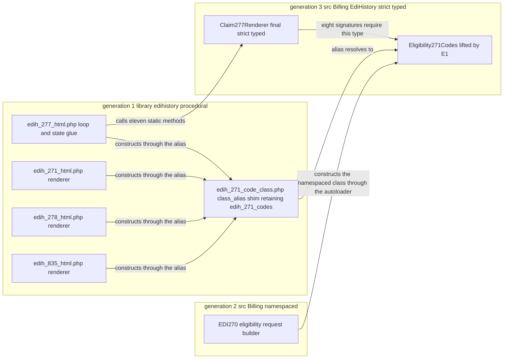

# OpenEMR Revenue Cycle and X12 EDI Extraction Roadmap

An ordered plan for finishing the extraction of this subsystem out of its legacy procedural tree, answering one question before any of the work starts: what should be modernized next, in what order, and how would anyone know behaviour was preserved?

**Scope and sources.** This document records where the legacy-to-modern extraction of OpenEMR's revenue-cycle and X12 EDI code has actually reached, proposes an order for the responsibilities that have not moved, and proposes the test surface that would make each move checkable. X12 is the electronic data interchange (EDI) standard that United States healthcare payers, providers and clearinghouses use to exchange claims, eligibility questions and payments. The current-state findings were traced in the four code trees the extraction spans - `library/edihistory/` and its `codes/` subdirectory, `src/Billing/EdiHistory/`, `src/Billing/` at large and `src/PaymentProcessing/` - together with the autoload configuration in `composer.json`, the two PHPUnit configurations, the static-analysis configuration and its baseline, the dependency-symbol whitelist, and the billing test tree. Conventions, the citation format, the VERIFIED and INFERRED notation and the source-of-truth ordering are defined once in [README.md](README.md) and are used here without variation and without restatement. Two analyses this document depends on are consumed rather than re-derived: the generation map and the cross-generation dependency cycle from [architecture.md](architecture.md), and the coupling and coverage measurements from [upgrade-risk-map.md](upgrade-risk-map.md).

**Provenance.** Every line anchor and every count below is relative to branch `master` at head commit `b7a7e690e419de3451740f995b768a8e8e5fba87`, on project version 8.3.0-dev (`version.php:L17-L20`), against a runtime floor of PHP 8.2.0 (`composer.json:L14`) with continuous integration exercising 8.2 through 8.6 (`.github/workflows/isolated-tests.yml:L30-L35`). **Nothing was executed to produce this document.** PHP, Composer and the test suites are not installed in the authoring environment, so no part of the subsystem was run, no test was executed and no refactor was rehearsed. Line counts, public surfaces and call-site inventories come from static reading and repository-wide search. Nothing below should be read as a recorded test result or as evidence that a proposed move has been attempted.

**How to read a proposal in a document full of findings.** [README.md](README.md) defines exactly two classes of claim about this codebase, VERIFIED and INFERRED, and this document adds neither a third class nor a fourth confidence level. What it adds is a category that is not a claim about the codebase at all: a **proposal**, meaning a target name, an order, a test or an acceptance criterion that this document recommends and that does not exist anywhere in the repository. Proposals are written in recommending language - proposed, would, should - and are never labelled, because labelling a recommendation VERIFIED would be a category error and labelling it INFERRED would imply it describes something already there. Where a sentence describes the code as it stands it carries VERIFIED and a citation; where it describes probable intent it carries INFERRED with a confidence and a basis; where it describes work that has not happened it is a proposal. No sentence does two of those three things at once.

## Table of Contents

- [The X12 terms this document uses](#the-x12-terms-this-document-uses)
- [Why Four Generations Coexist](#why-four-generations-coexist)
- [Current State](#current-state)
    - [Destination one the strict typed EdiHistory classes](#destination-one-the-strict-typed-edihistory-classes)
    - [Destination two the payment processing namespace](#destination-two-the-payment-processing-namespace)
    - [What remains in generation one](#what-remains-in-generation-one)
    - [The measurement that shows where the extraction has reached](#the-measurement-that-shows-where-the-extraction-has-reached)
    - [The one completed move and what it cost](#the-one-completed-move-and-what-it-cost)
- [The Ordering Principle](#the-ordering-principle)
- [Item Summary](#item-summary)
- [E1 the 271 and 277 code table](#e1-the-271-and-277-code-table)
    - [E1 responsibility](#e1-responsibility)
    - [E1 source file and line count](#e1-source-file-and-line-count)
    - [E1 the exact public surface that must be preserved](#e1-the-exact-public-surface-that-must-be-preserved)
    - [E1 proposed target namespace and class](#e1-proposed-target-namespace-and-class)
    - [E1 every call site to update](#e1-every-call-site-to-update)
    - [E1 why this position in the order](#e1-why-this-position-in-the-order)
    - [E1 blocking dependencies](#e1-blocking-dependencies)
    - [E1 proposed test surface](#e1-proposed-test-surface)
    - [E1 acceptance criteria](#e1-acceptance-criteria)
- [E2 to E15 the remaining responsibilities](#e2-to-e15-the-remaining-responsibilities)
    - [E2 the 835 code table](#e2-the-835-code-table)
    - [E3 the acknowledgement code functions](#e3-the-acknowledgement-code-functions)
    - [E4 retire the formatting backfill](#e4-retire-the-formatting-backfill)
    - [E5 the 835 renderer](#e5-the-835-renderer)
    - [E6 the 278 renderer](#e6-the-278-renderer)
    - [E7 the 271 renderer](#e7-the-271-renderer)
    - [E8 the acknowledgement rejection extractor](#e8-the-acknowledgement-rejection-extractor)
    - [E9 segment display formatting](#e9-segment-display-formatting)
    - [E10 the CSV index layer](#e10-the-csv-index-layer)
    - [E11 upload handling and file input output](#e11-upload-handling-and-file-input-output)
    - [E12 archival and restore](#e12-archival-and-restore)
    - [E13 consolidate the three trading partner loaders](#e13-consolidate-the-three-trading-partner-loaders)
    - [E14 finish the accounts receivable extraction](#e14-finish-the-accounts-receivable-extraction)
    - [E15 the 277 loop and state glue](#e15-the-277-loop-and-state-glue)
- [The Golden File X12 Corpus Strategy](#the-golden-file-x12-corpus-strategy)
    - [Fixture inventory per transaction type](#fixture-inventory-per-transaction-type)
    - [Proposed fixture location](#proposed-fixture-location)
    - [What round trip equivalence means for X12](#what-round-trip-equivalence-means-for-x12)
    - [A PHI free fixture capture method](#a-phi-free-fixture-capture-method)
    - [Which configuration the corpus runs under](#which-configuration-the-corpus-runs-under)
- [Target State After E1](#target-state-after-e1)
- [Do Not Extract](#do-not-extract)
- [Inference Register](#inference-register)
- [Related Documents](#related-documents)
- [Documentation Attribution](#documentation-attribution)

## The X12 terms this document uses

Every X12 term used below is expanded here, because this document has to stand alone for a reader who arrives at it directly. PHP and SQL fluency is assumed; knowledge of X12 is not.

| Term | What it means |
|------|---------------|
| **Transaction set** | One business document inside an X12 file, identified by a three-digit number. |
| **837** | The healthcare claim. **837P** is the professional flavour, built from the CMS-1500 data set; **837I** is the institutional flavour, built from the UB-04 data set. |
| **835** | Healthcare claim payment and remittance advice: the payer's statement of what it paid and what it adjusted. Also called an **ERA**, electronic remittance advice. |
| **270 / 271** | Eligibility and benefit inquiry, and its response. |
| **276 / 277** | Claim-status request, and its response. **277CA** is the claim-acknowledgement variant a clearinghouse returns. |
| **278** | Healthcare services review, which in practice means a prior-authorisation request or response. |
| **997 / 999** | Functional acknowledgements. The 997 is the older form and the 999 the HIPAA-mandated replacement; both report whether a submitted functional group was accepted or rejected and, if rejected, where. |
| **Envelope** | The nested headers and trailers that wrap transaction sets. **ISA** and its trailer **IEA** delimit the interchange; **GS** and its trailer **GE** delimit a functional group; **ST** and its trailer **SE** delimit one transaction set. |
| **Functional-group code** | The two-letter code in element GS01 that says which transaction type a group carries, for example `HP` for an 835 and `HC` for an 837. It is what selects the handler in this codebase. |
| **BHT** | Beginning of hierarchical transaction: the first segment inside an 837 or a 27x transaction set, carrying a reference identification and a creation date and time. |
| **Segment and element** | A segment is one line of an X12 file, named by its first element, for example `NM1` for a name. Elements are the delimiter-separated fields inside it. A composite element is subdivided again by a sub-element delimiter. |
| **CLP** | Claim payment information, the per-claim header inside an 835. |
| **SVC** | Service payment information, the per-service-line detail inside an 835. |
| **CAS** | Claim or service adjustment, carrying a group code, a reason code and an amount. |
| **PLB** | Provider-level adjustment: money moved at the provider level rather than against any single claim. |
| **MIA** | Medicare inpatient adjudication information, an 835 segment that appears on institutional Medicare Part A remittances. |
| **TRN, DTM, AMT, QTY, REF, STC, PER, PWK** | Trace number, date or time, monetary amount, quantity, reference identification, status information, administrative contact, and paperwork or attachment reference. |
| **IK3 and TA1** | Segments inside the acknowledgement family. IK3 names the segment in error inside a rejected transaction set; TA1 acknowledges the interchange envelope itself. |
| **Golden file** | A test fixture that pairs a fixed input with a stored, reviewed copy of the exact output the code produced when the fixture was accepted. A later run regenerates the output and compares it byte for byte against the stored copy, so any behavioural change shows up as a diff rather than as a silent difference in a dollar amount. |

## Why Four Generations Coexist

A reader who has not met this codebase before needs one paragraph of history, because the whole roadmap is a consequence of it.

VERIFIED: four architectural generations of the same subsystem are present in the tree at once and all four are reachable in a single request - a procedural tree under `library/edihistory/`, a namespaced but largely untyped tree under `src/Billing/`, four strict-typed classes under `src/Billing/EdiHistory/`, and a strict-typed payment namespace under `src/PaymentProcessing/`. The objective marker that separates the last two from the first two is `declare(strict_types=1)`, present in `src/Billing/EdiHistory/X12File.php:L20`, `src/Billing/EdiHistory/Claim277Renderer.php:L24`, `src/Billing/EdiHistory/EdiFormat.php:L22`, `src/Billing/EdiHistory/RemitAccounting.php:L13` and `src/PaymentProcessing/Recorder.php:L11`. The generation each of the 67 in-scope files belongs to, and the five mechanisms by which the generations reach one another, are established in [architecture.md](architecture.md) and are used here rather than repeated. The short version is that the subsystem grew by accretion rather than by replacement: each generation was added alongside its predecessor and the predecessor was left in place because something still called it. This document exists to turn that accretion back into a sequence.

## Current State

The extraction has two destinations, not one, and a plan that assumed a single destination would route work into the wrong namespace. Both are recorded below with what has arrived in each.

### Destination one the strict typed EdiHistory classes

VERIFIED: `src/Billing/EdiHistory/` holds four classes, all strict-typed, totalling 2,054 lines.

| Class | Lines | Declaration | What arrived |
|-------|------:|-------------|--------------|
| `X12File.php` | 1,566 | `class X12File` at `src/Billing/EdiHistory/X12File.php:L82` | A whole class body, lifted wholesale. Its own header records the lift and the preserved legacy name at `src/Billing/EdiHistory/X12File.php:L6-L7`. |
| `Claim277Renderer.php` | 373 | `final class Claim277Renderer` at `src/Billing/EdiHistory/Claim277Renderer.php:L30` | The per-segment case bodies of the 277 renderer. Its header names the file they came out of at `src/Billing/EdiHistory/Claim277Renderer.php:L13`. |
| `EdiFormat.php` | 83 | `final class EdiFormat` at `src/Billing/EdiHistory/EdiFormat.php:L26` | Three display formatting helpers, now the canonical implementations. |
| `RemitAccounting.php` | 32 | `class RemitAccounting` at `src/Billing/EdiHistory/RemitAccounting.php:L17` | The 835 balance test, `isBalanced()` at `src/Billing/EdiHistory/RemitAccounting.php:L27`, written fresh rather than lifted. |

VERIFIED: two of the four are `final` and two are not - `X12File` at `src/Billing/EdiHistory/X12File.php:L82` and `RemitAccounting` at `src/Billing/EdiHistory/RemitAccounting.php:L17` are plain classes. That matters to a roadmap because it decides whether a new class in the same directory may extend an existing one, and the answer differs by class.

### Destination two the payment processing namespace

VERIFIED: `src/PaymentProcessing/` holds 14 PHP files totalling 1,846 lines, of which 10 declare strict types, and it is the destination named by the deprecation notices inside the legacy accounts-receivable poster. Both notices read `@deprecated Use \OpenEMR\PaymentProcessing\Recorder::recordActivity directly`, at `src/Billing/SLEOB.php:L120` above `arPostPayment()` at `src/Billing/SLEOB.php:L122` and at `src/Billing/SLEOB.php:L221` above `arPostAdjustment()` at `src/Billing/SLEOB.php:L223`.

**One correction that changes how this destination should be planned against.** `src/PaymentProcessing/Recorder.php` is a **concrete class of 228 lines**, not an interface and not a contract. VERIFIED public and private surface:

```php
class Recorder                                                              // :L22
public const ADJUSTMENT_CODE_PATIENT_PAYMENT = 'patient_payment';           // :L27
public const PAYMENT_METHOD_CREDIT_CARD = 'credit_card';                    // :L29
public const PAYMENT_TYPE_PATIENT = 'patient';                              // :L31
public function getSessionIdForReference(string $reference): ?string         // :L43
public function createSession(array $data): string                          // :L70
public function recordActivity(array $data): void                           // :L143
private function getNextSequenceNumber(int|string $pid, int|string $enc)     // :L207
private static function formatMoney(Money $money): string                   // :L222
```

VERIFIED: `recordActivity()` wraps its writes in a transaction, `QueryUtils::inTransaction` at `src/PaymentProcessing/Recorder.php:L169`, which is the one thing this destination does that its legacy source does not. Describing it as a contract would invite an implementer to write an implementation of an interface that does not exist.

**And this destination is itself untested, which the roadmap has to name rather than assume away.** VERIFIED by search of the whole test tree: the only tests anywhere under a `PaymentProcessing` path exercise the Rainforest payment-gateway sub-namespace - `tests/Tests/Unit/PaymentProcessing/Rainforest/Apis/GetPayinComponentParametersTest.php`, `tests/Tests/Unit/PaymentProcessing/Rainforest/Webhooks/VerifierTest.php`, `tests/Tests/Unit/PaymentProcessing/Rainforest/Webhooks/DispatcherTest.php` and `tests/Tests/Isolated/PaymentProcessing/Rainforest/MetadataTest.php`. None of the four names `Recorder`, and no other test file does. Moving more accounts-receivable behaviour into `Recorder` therefore moves it into a class with no regression net, which is why item [E14](#e14-finish-the-accounts-receivable-extraction) makes covering `Recorder` a precondition of the move rather than a follow-up to it.

### What remains in generation one

VERIFIED: `library/edihistory/` holds 16 PHP files plus one spreadsheet, and the PHP totals 14,979 lines. The table groups them by the responsibility each carries, because the roadmap is ordered by responsibility rather than by file.

| Responsibility | Files and line counts | Roadmap item |
|----------------|----------------------|--------------|
| The 271 and 277 code table | `codes/edih_271_code_class.php` 2,432 | [E1](#e1-the-271-and-277-code-table) |
| The 835 code table | `codes/edih_835_code_class.php` 264 | [E2](#e2-the-835-code-table) |
| The acknowledgement code lookups | `codes/edih_997_codes.php` 175 | [E3](#e3-the-acknowledgement-code-functions) |
| Display formatting, now hollow delegates | the three functions at `library/edihistory/edih_csv_inc.php:L1070-L1103`, plus `edih_format_telephone()` at `library/edihistory/edih_csv_inc.php:L1047-L1059`, which did not move | [E4](#e4-retire-the-formatting-backfill) |
| Per-transaction rendering | `edih_835_html.php` 1,589, `edih_278_html.php` 916, `edih_271_html.php` 628, `edih_277_html.php` 307 | [E5](#e5-the-835-renderer), [E6](#e6-the-278-renderer), [E7](#e7-the-271-renderer); the 277 file holds no renderer any more and its remaining loop and state glue is [E15](#e15-the-277-loop-and-state-glue) |
| Acknowledgement rejection extraction | `edih_997_error.php` 335 | [E8](#e8-the-acknowledgement-rejection-extractor) |
| Segment display formatting | `edih_segments.php` 1,238 | [E9](#e9-segment-display-formatting) |
| The CSV index layer and the per-type parameter table | `edih_csv_inc.php` 1,892, `edih_csv_parse.php` 1,599, `edih_csv_data.php` 949 | [E10](#e10-the-csv-index-layer) |
| Upload handling and file input and output | `edih_uploads.php` 576, `edih_io.php` 753 | [E11](#e11-upload-handling-and-file-input-output) |
| Archival and restore | `edih_archive.php` 1,305 | [E12](#e12-archival-and-restore) |
| The X12 file class, already moved | `edih_x12file_class.php` 21, an alias and nothing else | none; complete |
| Code-table generation | `codes/code_formatter.ods`, not PHP | [Do Not Extract](#do-not-extract) |

Two responsibilities that belong to the same extraction sit outside `library/edihistory/` and are carried as items anyway: trading-partner loading, implemented three times across three trees, at [E13](#e13-consolidate-the-three-trading-partner-loaders); and the unfinished half of the accounts-receivable move, at [E14](#e14-finish-the-accounts-receivable-extraction).

### The measurement that shows where the extraction has reached

One pair of numbers says more about the state of this extraction than any inventory.

VERIFIED: `library/edihistory/edih_277_html.php` is **307** lines. The class extracted out of it, `src/Billing/EdiHistory/Claim277Renderer.php`, is **373**. The extracted renderer is larger than the legacy file that remains, and that inversion is the evidence for what actually moved: the per-segment case bodies went out and only the loop and state-machine glue stayed behind. VERIFIED: the legacy file still drives the whole render. It constructs the code table itself at `library/edihistory/edih_277_html.php:L96` and then calls the extracted static methods from inside its own loop.

A reader should not generalise that ratio into a rule, and the reason is worth stating plainly. INFERRED (confidence: Medium): the next renderer extraction will leave a remainder of the same shape, a caller that keeps its loop and delegates its per-case work. Basis: this is the only completed renderer extraction in the subsystem, so the pattern rests on a single instance; the whole-class move recorded at `library/edihistory/edih_x12file_class.php:L21` is a second instance of the same principle applied at a different granularity, which is corroboration rather than a second data point for renderers.

### The one completed move and what it cost

The 21-line file left behind by the `X12File` move is the working template for most of this roadmap, so it is worth reading in full before planning anything.

VERIFIED: `library/edihistory/edih_x12file_class.php` contains a docblock at `library/edihistory/edih_x12file_class.php:L3-L8` stating that the class body was lifted and the file remains so procedural callers keep resolving the unqualified symbol, `declare(strict_types=1)` at `library/edihistory/edih_x12file_class.php:L19`, and exactly one statement: `class_alias(\OpenEMR\Billing\EdiHistory\X12File::class, 'edih_x12_file');` at `library/edihistory/edih_x12file_class.php:L21`. VERIFIED: the shim is not autoloaded and still has to be required, at `interface/billing/edih_main.php:L73`.

VERIFIED: that move also had a cost outside both trees, and it is the cost every item in this roadmap will pay. `.phpstan/phpstan_legacy_aliases.php:L25` carries a second, identical `class_alias` call, executed as a static-analysis bootstrap file listed at `phpstan.neon.dist:L8`, because the analyser does not follow a runtime `class_alias`. Its own docblock states the coupling explicitly at `.phpstan/phpstan_legacy_aliases.php:L12-L14`: each alias must be paired with a runtime `class_alias` in the legacy file at the original path, and removing the legacy file or changing its alias target requires updating that bootstrap in lockstep. Any item below that keeps a legacy symbol alive by aliasing has to touch that file too, and an item that forgets it produces an analysis failure rather than a runtime one.

## The Ordering Principle

The order is stated before the items so that it can be audited rather than taken on trust. Three criteria decide it, applied in this priority:

1. **Break the dependency cycle first.** This outranks everything else because it is the only criterion that changes what is *possible* rather than what is convenient. VERIFIED: generation 3 contains a hard type dependency on generation 1 - `src/Billing/EdiHistory/Claim277Renderer.php:L28` imports the legacy code table and eight of its method signatures require that type - while generation 1 calls into generation 3 at `library/edihistory/edih_277_html.php:L24`. The bounded consequence, established in [architecture.md](architecture.md), is that those eight methods cannot be exercised without loading legacy procedural code. Until that edge is gone, every subsequent extraction into `src/Billing/EdiHistory/` inherits the same constraint, and every test written for one has to reach five directories up to a procedural file to get its collaborator. Ordering this second would mean paying that cost repeatedly and then removing it.
2. **Then take the highest-coupling responsibility.** This outranks size because coupling, not size, is what forces a change to be landed in several generations at once. The coupling figures used here are the repository-wide binding-reference counts from [upgrade-risk-map.md](upgrade-risk-map.md), not a bare-name search, and the reason they are the right signal is that the highest-consequence callers of this subsystem sit outside it. A responsibility with a high inbound count cannot be moved incrementally: every caller has to move in the same commit or the symbol resolves in some paths and not in others.
3. **Then the largest untested surface.** This is last because it is the criterion with the weakest claim on ordering: a large untested file is expensive to move but nothing about moving it first makes anything else cheaper. It breaks ties, and it explains why the renderers are ordered largest first among themselves once their shared blocker is gone.

One rule sits above all three and is not a criterion so much as a constraint: **no item may be ordered ahead of the item that unblocks it.** Where the three criteria and that constraint disagree, the constraint wins, and the item's own **why this position** field says so.

## Item Summary

Fifteen items cover every responsibility that has not moved. Each carries the same seven fields, without exception: responsibility, source files and line counts, proposed target namespace and class, why this position in the order, blocking dependencies, proposed test surface, and acceptance criteria. The table is a summary and not a substitute for the fields.

| Item | Responsibility | Source lines | Blocked by | Deciding criterion |
|------|----------------|-------------:|------------|--------------------|
| [E1](#e1-the-271-and-277-code-table) | The 271 and 277 code table | 2,432 | nothing | Criterion 1, the cycle |
| [E2](#e2-the-835-code-table) | The 835 code table | 264 | nothing | Criterion 2, and it is the second collaborator of E5 |
| [E3](#e3-the-acknowledgement-code-functions) | The acknowledgement code lookups | 175 | nothing | Criterion 2, lowest coupling of the three tables |
| [E4](#e4-retire-the-formatting-backfill) | Retire the formatting backfill | 101 call sites | nothing | Criterion 2 |
| [E5](#e5-the-835-renderer) | The 835 renderer | 1,589 | E1, E2, E4 | Criterion 3, largest renderer |
| [E6](#e6-the-278-renderer) | The 278 renderer | 916 | E1, E4 | Criterion 3 |
| [E7](#e7-the-271-renderer) | The 271 renderer | 628 | E1, E4 | Criterion 3 |
| [E8](#e8-the-acknowledgement-rejection-extractor) | Acknowledgement rejection extraction | 335 | E3, E4 | Criterion 3 |
| [E9](#e9-segment-display-formatting) | Segment display formatting | 1,238 | nothing | Criterion 3 |
| [E10](#e10-the-csv-index-layer) | The CSV index layer | 4,440 | E4 | Criterion 2, highest coupling in the tree |
| [E11](#e11-upload-handling-and-file-input-output) | Upload handling and file input and output | 1,329 | E10 | Criterion 2 |
| [E12](#e12-archival-and-restore) | Archival and restore | 1,305 | E10 | Criterion 3 |
| [E13](#e13-consolidate-the-three-trading-partner-loaders) | Trading-partner loading, three implementations | 496 plus two methods | nothing | Criterion 2 |
| [E14](#e14-finish-the-accounts-receivable-extraction) | The unfinished half of the accounts-receivable move | 4 helpers | a test for `Recorder` | Criterion 2 |
| [E15](#e15-the-277-loop-and-state-glue) | The 277 loop and state glue, the completion of the one finished renderer move | 307 | E1; and E5, E6, E7 to close the shim | The constraint rather than a criterion: it closes the shim E5 to E7 leave open |

Six items are blocked by nothing and are therefore available as starting points: E1, E2, E3, E4 and E9 can be taken in any order or in parallel, and E13 is independent of the whole `library/edihistory/` chain. Four of those six do block later items - E1 blocks the three renderer moves and the 277 completion at E15, E2 blocks E5, E3 blocks E8 and E4 blocks five items - which is why they are numbered ahead of what they gate rather than merely allowed to go first. E14 is the only item whose blocker is not another item: it waits on a test that requires no extraction to write. The numbering is the order the three criteria produce, and E1 is first for the structural reason set out in [E1 why this position in the order](#e1-why-this-position-in-the-order). Where an item sits later than its blockers require, its **why this position** field says which criterion put it there, and where a criterion and the no-item-before-its-blocker constraint disagree, the field says that too - E10 is the one item where they do.

## E1 the 271 and 277 code table

This item is specified to a depth at which it can be executed without any further investigation. Every fact it rests on is anchored, every call site is enumerated rather than sampled, and the fields that a plan usually leaves to the implementer - the target name, the compatibility strategy, the test that changes, the configuration it runs under and the definition of done - are all stated. A reader who finds a question they would have to answer before starting should treat that as a defect in this section.

### E1 responsibility

The 271 eligibility-response code lookup table: the data structure that turns a bare X12 code into the English phrase a screen displays. VERIFIED: despite its name it is not confined to the 271. It is consumed by the eligibility response renderer, the claim-status renderer, the services-review renderer and the remittance renderer, and by the eligibility request and response builder in generation 2, which is what makes it the most widely shared single artefact in the legacy tree.

VERIFIED: it is a root-namespace procedural class. It declares no namespace, so its symbol is global, and it sits outside every autoload rule the project defines, which is why every consumer either requires the file by path or relies on some earlier consumer having done so.

### E1 source file and line count

`library/edihistory/codes/edih_271_code_class.php`, **2,432 lines**. VERIFIED: it is the largest single file in the 67-file documented surface.

VERIFIED: almost all of it is one literal data structure rather than logic. The class opens at `library/edihistory/codes/edih_271_code_class.php:L26`, the private array that holds the code lists is declared at `library/edihistory/codes/edih_271_code_class.php:L30`, and the constructor body runs from `library/edihistory/codes/edih_271_code_class.php:L37` to `library/edihistory/codes/edih_271_code_class.php:L2386` doing nothing but assigning literal entries. That is 2,350 lines, or 96.6 percent of the file. Only two accessor methods follow it. The consequence for this item is favourable and worth stating early: there is almost no behaviour to preserve, so the risk is not algorithmic but clerical - a move that drops or mistypes an entry produces no error anywhere and shows up only as a code rendering as unknown on an eligibility or claim-status screen.

The scale of that clerical risk is quantified in [upgrade-risk-map.md](upgrade-risk-map.md) and is consumed here rather than re-derived: the table declares 56 element sets holding 2,073 code-to-description entries, the 277 renderer requests 10 of those sets, and 1,104 entries - just over half the table - sit in the 46 sets no test ever reads. That document also records the one trap in counting them, which an implementer writing a verification script needs before writing it: the keys are not written in one style, 1,128 being single-quoted and 945 double-quoted, so a census matching only single quotes returns 1,128 and silently misses 945 entries.

### E1 the exact public surface that must be preserved

VERIFIED: the entire surface is three members. A member census of the file returns exactly four declarations, one of them private, and nothing else.

```php
class edih_271_codes                                    // :L26
    private $code271 = [];                              // :L30
    function __construct(private $ds, private $dr)      // :L37
    public function get_271_code($elem, $code)          // :L2390
    public function get_keys()                          // :L2428
```

Three properties of that surface decide how the move has to be made.

**The constructor takes two delimiters and nothing else.** VERIFIED: `$ds` is the sub-element delimiter and `$dr` the repetition delimiter, and they are used only inside `get_271_code()` to split a composite or repeating code value before looking up each part, at `library/edihistory/codes/edih_271_code_class.php:L2395-L2417`. The object holds no file, no database handle and no request state. It is a value-lookup table, which the covering test's own docblock also calls it at `tests/Tests/Isolated/Billing/EdiHistory/Claim277RendererTest.php:L9`.

**The lookup method is untyped, and one consumer has already had to work around that.** VERIFIED: `get_271_code()` declares no parameter types and no return type, and on a miss it returns an interpolated diagnostic string rather than a null or an empty string, at `library/edihistory/codes/edih_271_code_class.php:L2419-L2421`. VERIFIED: the one strict-typed consumer therefore narrows every result, and its docblock says why in its own words at `src/Billing/EdiHistory/Claim277Renderer.php:L39-L41` - that the method is untyped and so returns mixed, and that a code lookup is always a string in practice so anything else collapses to the empty string. The narrowing helper is at `src/Billing/EdiHistory/Claim277Renderer.php:L42`. An implementer who adds a `: string` return type as part of this move would change behaviour for every untyped caller and would make that helper dead; the proposal below therefore keeps the signature and treats typing it as a separate, later change.

**The static analyser has recorded the untyped surface, by name.** VERIFIED: the baseline entries for this file include four for untyped constructor and method parameters at `.phpstan/baseline/missingType.parameter.php:L21855-L21872`, two for untyped returns naming `get_271_code()` and `get_keys()` at `.phpstan/baseline/missingType.return.php:L15050-L15057`, and one for the untyped property at `.phpstan/baseline/missingType.property.php:L4475-L4477`. Those messages carry the class name, so renaming the class changes the messages as well as the paths. That is a blocking dependency and is set out under [E1 blocking dependencies](#e1-blocking-dependencies).

### E1 proposed target namespace and class

**Proposed target: `OpenEMR\Billing\EdiHistory\Eligibility271Codes`, in a new file `src/Billing/EdiHistory/Eligibility271Codes.php`.**

The namespace is proposed rather than chosen freely: it is where the four existing generation-3 EDI classes live, and it is the namespace the file's principal consumer, `Claim277Renderer`, already occupies, so the import at `src/Billing/EdiHistory/Claim277Renderer.php:L28` disappears entirely rather than being rewritten. The class name follows the naming shape the directory already uses at `src/Billing/EdiHistory/Claim277Renderer.php:L30`, which is subject, then transaction number, then role; applied to a 271 code table that gives eligibility, 271, codes. The name deliberately does not advertise the wider 27x and 835 reuse, on the ground that the legacy symbol did not either and widening the name during a move would make the change harder to review, not easier.

**Proposed compatibility strategy: keep the legacy global symbol alive with a `class_alias` shim at the original path.** The pattern is not invented here; it is the one this repository already runs. VERIFIED: `library/edihistory/edih_x12file_class.php` is a 21-line file whose only statement is `class_alias(\OpenEMR\Billing\EdiHistory\X12File::class, 'edih_x12_file');` at `library/edihistory/edih_x12file_class.php:L21`, above a docblock at `library/edihistory/edih_x12file_class.php:L3-L8` that states exactly this purpose, and its analysis-time twin sits at `.phpstan/phpstan_legacy_aliases.php:L25`.

Applying that pattern to this item means, concretely:

- `library/edihistory/codes/edih_271_code_class.php` is reduced to a shim of the same shape, retaining its 2016 copyright attribution at `library/edihistory/codes/edih_271_code_class.php:L3-L24` and adding `class_alias(\OpenEMR\Billing\EdiHistory\Eligibility271Codes::class, 'edih_271_codes');`.
- The class body, including the 2,350-line constructor, moves unchanged into the new file with a namespace declaration and `declare(strict_types=1)` added. The two accessor bodies are not retyped and not reformatted, so the move is reviewable as a relocation.
- A matching line is added to `.phpstan/phpstan_legacy_aliases.php` beside the existing one at `.phpstan/phpstan_legacy_aliases.php:L25`, because that file's docblock at `.phpstan/phpstan_legacy_aliases.php:L12-L14` requires every runtime alias to be mirrored there.
- **The one namespaced consumer is migrated in the same commit rather than left on the alias.** `src/Billing/EDI270.php` is the only file outside the legacy tree that loads the code table itself, and its three references move together: the import at `src/Billing/EDI270.php:L27` is replaced with the namespaced one, the `require_once` at `src/Billing/EDI270.php:L35` is deleted, and the construction at `src/Billing/EDI270.php:L930` is renamed. Sites 1, 2 and 3 of the inventory below are one indivisible change; none of the three is optional and none may land without the other two.

**Why that one change is indivisible, stated as the two ways of getting it wrong.** Both halves fail, and they fail differently, which is why leaving either to an implementer's discretion would leave the item unexecutable.

VERIFIED: `src/Billing/EDI270.php` declares `namespace OpenEMR\Billing;` at `src/Billing/EDI270.php:L25`. Renaming the construction at `src/Billing/EDI270.php:L930` while leaving the legacy import at `src/Billing/EDI270.php:L27` in place therefore resolves the new short name against that namespace and looks for a class `OpenEMR\Billing\Eligibility271Codes`, which the move does not create. The import is what makes the short name mean the target class, so it is not a tidying step.

VERIFIED: the opposite half-measure - deleting the `require_once` at `src/Billing/EDI270.php:L35` while keeping alias-based construction - fails for an unrelated reason. The shim is not autoloaded: `composer.json:L177-L179` classmaps `library/classes` and no other directory, and the eight eagerly loaded files at `composer.json:L180-L189` include nothing under `library/edihistory/`. The alias therefore exists only after something has explicitly required the shim, and the sole production requirer of the code table outside `src/Billing/EDI270.php` itself is the operator screen at `interface/billing/edih_main.php:L84`. VERIFIED: two paths reach the construction without that screen - `interface/billing/edi_271.php:L65` calls `EDI270::parseEdi271()` directly, and `src/Billing/EDI270.php:L509` calls it from the real-time eligibility download - so on both of them the aliased global name would be undefined. This is the same property [architecture.md](architecture.md) establishes for the existing shim at `library/edihistory/edih_x12file_class.php:L21`, whose alias is available only once the screen that requires it at `interface/billing/edih_main.php:L73` has been entered.

**What the retained alias is for, stated narrowly so it is not read as a general reprieve.** It exists for the procedural consumers that explicitly load the shim, which are sites 6 through 10 below, every one of them reached through the sixteen requires the operator screen issues in one block at `interface/billing/edih_main.php:L71-L86`. It is not a licence to leave a namespaced consumer bound to the old name, because a namespaced consumer is served by the autoloader and a runtime `class_alias` is not.

**The alternative, and why this document does not propose it.** The legacy symbol could be dropped and every remaining site in the inventory below rewritten to the namespaced name in the same commit. That is fewer moving parts and no shim, and it would be defensible. It is not proposed here for a stated reason rather than a stylistic one: four of the binding sites sit in procedural files that carry no namespace declaration at all, so each needs a fully qualified name or a first-ever `use` statement; the dependency-symbol whitelist entry and the static-analysis alias mirror both have to come out in the same commit; and the test file has to change in that commit too instead of in one of its own. Retaining the alias narrows the first commit to the move itself plus the one namespaced consumer, and leaves rewriting the procedural call sites as separate, individually revertible commits. An implementer who prefers the direct rewrite should note that it removes nothing from the call-site inventory below; it changes what is done at sites 6 through 11 and nothing about sites 1 through 5.

### E1 every call site to update

VERIFIED by repository-wide search across all PHP, XML, JSON and Markdown files outside `vendor/` and `node_modules/`. The count is worth stating exactly, because the numbered table and the file total are two different figures and conflating them would understate the work. **Eleven numbered code sites, spread across seven code files.** Those seven are `src/Billing/EDI270.php` (three sites), `src/Billing/EdiHistory/Claim277Renderer.php` (two), `library/edihistory/edih_277_html.php`, `library/edihistory/edih_271_html.php`, `library/edihistory/edih_278_html.php`, `library/edihistory/edih_835_html.php` (two) and `interface/billing/edih_main.php`. **Two further files already reference the symbol today** and are not code sites: one existing test, `tests/Tests/Isolated/Billing/EdiHistory/Claim277RendererTest.php`, covered under [E1 proposed test surface](#e1-proposed-test-surface), and one existing configuration file, `.composer-require-checker.json:L48`. That is **nine files carrying a reference at the recorded commit**.

**One further configuration file must be updated even though it holds no reference today,** and it is the one an implementer is most likely to miss for exactly that reason: `.phpstan/phpstan_legacy_aliases.php` names only the `edih_x12_file` alias, at `.phpstan/phpstan_legacy_aliases.php:L25`, so a search for the 271 symbol does not find it. It acquires a line because the shim acquires a runtime alias, per the lockstep rule its own docblock states at `.phpstan/phpstan_legacy_aliases.php:L12-L14`. Counting it, the move touches ten files plus whatever the baseline regeneration rewrites.

This inventory is deliberately complete rather than representative: an item that is meant to be executable without further scoping cannot leave a call site for the implementer to find during the work.

| # | Site | What is there | What the move does to it |
|--:|------|---------------|--------------------------|
| 1 | `src/Billing/EDI270.php:L27` | `use edih_271_codes;` | Replaced by `use OpenEMR\Billing\EdiHistory\Eligibility271Codes;`. Mandatory, and in the same commit as sites 2 and 3 |
| 2 | `src/Billing/EDI270.php:L35` | `require_once(__DIR__ . "/../../library/edihistory/codes/edih_271_code_class.php");` | Deleted; the class is autoloaded once it is under `src/`. Mandatory, and in the same commit as sites 1 and 3 |
| 3 | `src/Billing/EDI270.php:L930` | `$codes = new edih_271_codes('*', '^');` inside `parseEdi271()` at `src/Billing/EDI270.php:L927` | Renamed to `new Eligibility271Codes('*', '^')`. Mandatory, and in the same commit as sites 1 and 2 |
| 4 | `src/Billing/EdiHistory/Claim277Renderer.php:L28` | `use edih_271_codes;` | Deleted outright; the target class becomes a same-namespace sibling |
| 5 | `src/Billing/EdiHistory/Claim277Renderer.php` eight signatures | The type appears in eight method signatures | Type name changed in eight places, listed below |
| 6 | `library/edihistory/edih_277_html.php:L96` | `$cd27x = new edih_271_codes($ds, $dr);` | Unchanged. This file binds to the aliased global name, which site 11 has already defined for it |
| 7 | `library/edihistory/edih_271_html.php:L57` | `$cd271 = new edih_271_codes($ds, $dr);` | Unchanged, as site 6 |
| 8 | `library/edihistory/edih_278_html.php:L53` | `$cd27x = new edih_271_codes($ds, $dr);` | Unchanged, as site 6 |
| 9 | `library/edihistory/edih_835_html.php:L1506` | `$cd27x = new edih_271_codes($ds, $dr);` | Unchanged, as site 6 |
| 10 | `library/edihistory/edih_835_html.php` three signatures | The type appears in three function signatures at `library/edihistory/edih_835_html.php:L25`, `library/edihistory/edih_835_html.php:L262` and `library/edihistory/edih_835_html.php:L810`, each as `edih_271_codes $codes27x, edih_835_codes $codes835` | Unchanged, as site 6; the three signatures keep naming the aliased global type |
| 11 | `interface/billing/edih_main.php:L84` | `require_once($srcDir . '/edihistory/codes/edih_271_code_class.php');` | Retained, and it is what defines the alias for sites 6 through 10, because the shim is not autoloaded. It is deleted only by the later commit that drops the alias |

**The eight type-hinted signatures at site 5, individually.** VERIFIED at each line:

```php
private static function code(edih_271_codes $cd, string $set, string $value): string   // :L42
public static function bht(array $sar, edih_271_codes $cd): array                      // :L76
public static function nm1(array $sar, string $cls, edih_271_codes $cd): array         // :L111
public static function per(array $sar, string $cls, edih_271_codes $cd): string        // :L138
public static function stc(array $sar, string $ds, string $cls, edih_271_codes $cd)    // :L182
public static function ref(array $sar, string $cls, edih_271_codes $cd): string        // :L296
public static function dtp(array $sar, string $cls, edih_271_codes $cd): string        // :L313
public static function svc(array $sar, string $ds, string $cls, bool $isRcv, edih_271_codes $cd): string  // :L336
```

**Three further sites that are not code and are the ones most easily missed.**

- **The dependency-symbol whitelist.** VERIFIED: `.composer-require-checker.json:L48` lists the bare string `edih_271_codes` inside the `symbol-whitelist` array declared at `.composer-require-checker.json:L2`. That whitelist exists so the unresolvable global symbol does not fail the check, which runs as `composer require-checker` at `composer.json:L313` and in continuous integration by way of `.github/workflows/composer-require-checker.yml`. Once the class is PSR-4, the namespaced references resolve on their own; the entry is still required for as long as procedural callers bind to the aliased global name, and should be removed in the same commit that drops the alias rather than in this one.
- **The static-analysis alias mirror.** `.phpstan/phpstan_legacy_aliases.php`, for the reason given above.
- **Three docblock `@uses` tags naming the legacy symbol**, at `library/edihistory/edih_277_html.php:L30`, `library/edihistory/edih_271_html.php:L34` and `library/edihistory/edih_278_html.php:L33`. They bind to nothing and cannot break a build. They are listed because leaving them behind leaves the tree describing a symbol that no longer exists, which is precisely the class of comment-versus-code contradiction catalogued in [README.md](README.md).

**Three dead sites that must be left alone rather than updated.** VERIFIED: `library/edihistory/edih_271_html.php:L27`, `library/edihistory/edih_278_html.php:L27` and `library/edihistory/edih_835_html.php:L18` each hold a commented-out `require_once` of the legacy path. They are not call sites, and an implementer who resurrects one while updating paths would reintroduce a load that the current design deliberately routes through `interface/billing/edih_main.php:L84`.

### E1 why this position in the order

The reason is structural and can be checked, not a preference.

VERIFIED: this file is the inbound end of the cross-generation dependency cycle described in [architecture.md](architecture.md). Generation 1 calls generation 3 at `library/edihistory/edih_277_html.php:L24`, generation 3 depends on generation 1 at `src/Billing/EdiHistory/Claim277Renderer.php:L28` and in the eight signatures above, and the legacy file supplies the instance itself at `library/edihistory/edih_277_html.php:L96`. Moving this one file into the same namespace as `Claim277Renderer` deletes the generation-3-to-generation-1 edge and leaves an ordinary one-directional dependency from generation 1 into generation 3. No other single move does that: extracting any renderer first would add a second modern class that depends on the legacy table, making the cycle wider rather than narrower.

VERIFIED: it also satisfies criterion 2 independently. Its inbound coupling of 8, taken from [upgrade-risk-map.md](upgrade-risk-map.md), is spread across all three generations that handle X12 - a generation-2 class requires it directly at `src/Billing/EDI270.php:L35`, a generation-3 class type-hints against it at `src/Billing/EdiHistory/Claim277Renderer.php:L28`, and four generation-1 files construct it - and only one of those edges is exercised by any test. A change to its shape has to land in three generations at once.

VERIFIED: and criterion 3, the largest untested surface, points at it too, at 2,432 lines with a coverage grade of `narrow` rather than `dedicated` in [upgrade-risk-map.md](upgrade-risk-map.md). All three criteria select the same item, which is the least ambiguous position in the whole roadmap.

### E1 blocking dependencies

Nothing blocks starting this item. Five things constrain how it is done, and each is concrete.

1. **The legacy renderers construct the class directly, with delimiter arguments.** VERIFIED at `library/edihistory/edih_277_html.php:L96`, `library/edihistory/edih_271_html.php:L57`, `library/edihistory/edih_278_html.php:L53` and `library/edihistory/edih_835_html.php:L1506`, each passing a sub-element delimiter and a repetition delimiter drawn from the file being rendered. There is no factory and no container binding to change, so the constructor signature has to survive the move verbatim.
2. **The Composer classmap does not cover this directory, which is why the requires exist at all.** VERIFIED: `composer.json:L174-L176` maps the `OpenEMR\` prefix to `src` under PSR-4, and `composer.json:L177-L179` adds a classmap over exactly one legacy directory, `library/classes`. `library/edihistory/` and `library/edihistory/codes/` appear in neither, and the eight eagerly loaded files at `composer.json:L180-L189` do not include them. That single fact explains the `require_once` at `src/Billing/EDI270.php:L35`, the sixteen requires at `interface/billing/edih_main.php:L71-L86` and the manual require inside the test - and it is also why the move fixes all three at once, because a class under `src/` is autoloaded by the PSR-4 rule with no configuration change at all.
3. **The static-analysis baseline holds 73 entries for this path, and they are matched strictly.** VERIFIED: the entries are distributed across eight identifier files - 58 in `.phpstan/baseline/offsetAccess.nonOffsetAccessible.php`, 4 in `.phpstan/baseline/missingType.parameter.php`, 3 in `.phpstan/baseline/argument.type.php`, 2 each in `.phpstan/baseline/binaryOp.invalid.php`, `.phpstan/baseline/encapsedStringPart.nonString.php` and `.phpstan/baseline/missingType.return.php`, and 1 each in `.phpstan/baseline/cast.string.php` and `.phpstan/baseline/missingType.property.php`. VERIFIED: the baseline is loaded as part of the analysis configuration at `.phpstan/phpstan.github.neon:L3`, which `phpstan.neon.dist:L1-L2` includes, and that same file sets `reportUnmatchedIgnoredErrors: true` at `.phpstan/phpstan.github.neon:L5`. An ignore entry whose path no longer exists is therefore reported as an error rather than skipped, so moving the file without regenerating the baseline fails analysis with 73 unmatched-ignore errors. The regeneration is scripted: `composer phpstan-baseline` at `composer.json:L302-L305` regenerates and re-splits it, using the splitter declared at `composer.json:L157`. Because the baseline messages name the class, as at `.phpstan/baseline/missingType.return.php:L15050-L15057`, a hand-edit of the paths alone is not sufficient.
4. **The covering test is not modifiable by this run and has to be modified by the implementer.** Described under the next field.
5. **The alias mirror has to move in lockstep**, per `.phpstan/phpstan_legacy_aliases.php:L12-L14`.

### E1 proposed test surface

The finding comes first, because this field is a proposal built on top of one. VERIFIED: exactly one test file reaches this class today, and it does so by requiring a procedural file five directory levels above itself.

VERIFIED: `tests/Tests/Isolated/Billing/EdiHistory/Claim277RendererTest.php` is 421 lines. It imports the legacy symbol at `tests/Tests/Isolated/Billing/EdiHistory/Claim277RendererTest.php:L23`, declares a typed property for it at `tests/Tests/Isolated/Billing/EdiHistory/Claim277RendererTest.php:L33`, opens a `setUpBeforeClass()` at `tests/Tests/Isolated/Billing/EdiHistory/Claim277RendererTest.php:L35` whose entire body is the require at `tests/Tests/Isolated/Billing/EdiHistory/Claim277RendererTest.php:L37`, and constructs the table per test at `tests/Tests/Isolated/Billing/EdiHistory/Claim277RendererTest.php:L43`. Its own docblock states the reason at `tests/Tests/Isolated/Billing/EdiHistory/Claim277RendererTest.php:L9-L10`: the collaborator lives outside the PSR-4 tree and is not autoloaded.

**That require is the concrete symptom this item removes.** It is not untidiness. It is the only reason a strict-typed final class in `src/` cannot be loaded under test on its own, and it is the observable form of the dependency cycle. Once the table is autoloadable, the `setUpBeforeClass()` hook has no remaining purpose.

**Proposed changes to the existing test.** This document does not make them; nothing under `tests/` is created or modified by this run.

- Delete `setUpBeforeClass()` at `tests/Tests/Isolated/Billing/EdiHistory/Claim277RendererTest.php:L35-L38` in full, including the require at `:L37`.
- Replace the import at `:L23` with the namespaced name of the target class. It cannot simply be deleted: VERIFIED, the test declares `namespace OpenEMR\Tests\Isolated\Billing\EdiHistory` at `tests/Tests/Isolated/Billing/EdiHistory/Claim277RendererTest.php:L21`, which is not the target namespace, so an import is still required and sits beside the existing sibling import at `:L24`.
- Change the property type at `:L33` and the construction at `:L43` to the new class name.
- Change nothing else. VERIFIED: the file is 421 lines long and carries **24 test methods and 43 assertion calls** between them. It is those 24 tests and their 43 assertions that are the regression net for this move, not the line count, and their expectations must not be adjusted to fit it: if an assertion fails after the move, the move is wrong.

**Proposed new test.** A dedicated test for the table itself, proposed at `tests/Tests/Isolated/Billing/EdiHistory/Eligibility271CodesTest.php`, sized to the clerical risk rather than to the line count. Five cases cover it, and the first of the five is the one that makes the item safe:

| Case | What it asserts | Why it is the right assertion |
|------|-----------------|-------------------------------|
| **Complete mapping** | Every one of the 2,073 key/value pairs, in all 56 sets, is byte-identical to a snapshot taken before the move | The only case that can detect a swapped, edited or transposed pair. The four below cannot: between them they assert set names, per-set totals, two delimiter branches and the miss string, and every one of those survives a value being changed to another value of the same shape |
| Set inventory | `get_keys()` returns exactly the 56 element sets, compared against a literal expected list | A dropped set is otherwise invisible; this is the single cheapest guard against the failure mode that matters |
| Entry count per set | The number of entries in each of the 56 sets matches a literal expected map | Catches a dropped or duplicated row inside a set without pinning 2,073 strings |
| Composite and repeating lookup | `get_271_code()` with a value containing the sub-element delimiter, and again with the repetition delimiter, returns the concatenated descriptions | These are the only two branches in the file with logic in them, at `library/edihistory/codes/edih_271_code_class.php:L2395-L2417` |
| Miss behaviour | A code absent from a present set, and a set absent entirely, each return the existing diagnostic string rather than an empty string or a null | Pins the untyped return that `src/Billing/EdiHistory/Claim277Renderer.php:L42` narrows, so a later decision to type it becomes a visible change |

The proposed test asserts current behaviour, including behaviour a reader might consider wrong. That is deliberate for a move: the purpose is to prove the relocation changed nothing, and improving the diagnostic-string return in the same commit would destroy that proof.

**How the complete mapping case is built, since it is not obvious and the public surface will not support it.** The table cannot be enumerated through the class's own API. VERIFIED: the property holding it is declared `private $code271 = []` at `library/edihistory/codes/edih_271_code_class.php:L30`; `get_keys()` returns `array_keys($this->code271)` at `library/edihistory/codes/edih_271_code_class.php:L2428-L2431`, which yields the 56 outer set names and nothing inside them; and `get_271_code()` at `library/edihistory/codes/edih_271_code_class.php:L2390` takes an element key *and* a code, so it can only answer for a pair the caller already knows. There is therefore no public route from the 56 set names to the 2,073 pairs beneath them, and any oracle that claims completeness has to read the private property directly by `ReflectionProperty`, or compare against a snapshot that was produced that way.

The mechanism, in the order a follow-on run would perform it:

1. **Before touching the class, generate the snapshot.** A one-off script reflects the private property on the pre-move class, sorts it canonically - `ksort` on the outer array and on each of the 56 inner arrays, so that a reordering which changes no pair does not show up as a difference - and writes it to `tests/Tests/Isolated/Billing/EdiHistory/fixtures/271-code-table.snapshot.php` as a `return [...]` literal. The generation step happens on the pre-move code and is committed *with* the move, which is what makes this an old-versus-new comparison rather than a self-consistency check.
2. **Record its digest in the test source, not in the fixture.** The script also prints the SHA-256 of the canonical serialization, and that hash is pinned as a literal inside the test file itself. Where it lives is the whole point of it, for the reason the next step gives.
3. **The test makes two assertions, and their order matters.** First `assertSame()` of the canonically sorted live property against the loaded snapshot. That single assertion is the complete oracle - it cannot pass if any one of the 2,073 keys or values differs by a byte - and it is deliberately first because it is the one that produces a usable failure: PHPUnit renders an array diff naming the offending set and key, where a hash comparison could only report that two hashes differ. Second, `assertSame()` of the pinned literal hash against the SHA-256 of the same canonical serialization. It has to be second because a failing assertion ends a PHPUnit test method immediately, so an assertion placed after a failure never runs at all; ordering them the other way would mean the readable diff was never produced on the failure that matters.

The second assertion is not redundant, and it is worth being explicit about what it catches that the first cannot. If someone changes the table and regenerates the snapshot in the same commit, the first assertion compares the new code against the new fixture and passes - the change is laundered. The pinned hash does not move with the fixture, because it lives in the test source, so that commit fails the second assertion and has to be looked at. In other words the array comparison proves the code matches the fixture, and the hash proves the fixture is still the one taken before the move.

Two properties of this design are deliberate. **The snapshot is exempt from the regeneration switch** that the corpus described later in this document uses. Regenerating a golden file is the correct response to an intended behavioural change; it is precisely the wrong response here, because E1 is defined as a move that changes no behaviour, so a regenerated snapshot would launder exactly the defect the case exists to catch. The follow-on run should either omit the environment-variable branch from this test or make it fail loudly while the item is open. **And reflection on a private property is acceptable here for a reason that will not generalise:** it is used to assert that data did not change during a relocation, not to test behaviour through a back door, and it becomes unnecessary the moment the table acquires an enumerating accessor - which is a later decision this item explicitly does not take.

### E1 acceptance criteria

Eight criteria, each checkable by a named command or a named observation. The item is done when all eight hold and not before.

1. **The legacy global symbol still resolves for every procedural caller.** Loading `interface/billing/edih_main.php` and rendering a 271, a 277, a 278 and an 835 through the EDI History screen produces the same HTML as before the move. The four constructions at `library/edihistory/edih_277_html.php:L96`, `library/edihistory/edih_271_html.php:L57`, `library/edihistory/edih_278_html.php:L53` and `library/edihistory/edih_835_html.php:L1506` each succeed.
2. **The namespaced consumer resolves the class with no include of its own.** `EDI270::parseEdi271()` executes to completion when it is entered from the batch eligibility response screen at `interface/billing/edi_271.php:L65`, with no `interface/billing/edih_main.php` in the request and with the `require_once` at `src/Billing/EDI270.php:L35` deleted; the construction at `src/Billing/EDI270.php:L930` resolves through the autoloader alone. This is the criterion that proves sites 1, 2 and 3 landed together, and it is checkable two ways: as a named observation, by posting a 271 response through that screen and confirming the parse log it writes rather than a class-not-found error; and as an automated check, by a new isolated test in `tests/Tests/Isolated/Billing/` that calls `EDI270::parseEdi271()` with a short synthetic 271 payload and asserts it returns without error. The automated form is the one to prefer, because `parseEdi271()` is reached from a second caller as well, the real-time download at `src/Billing/EDI270.php:L509`, and a test covers both entries at once where a screen walk covers one.
3. **`Claim277RendererTest` passes with no manual require.** Run under the secondary configuration, `vendor/bin/phpunit -c phpunit-isolated.xml`, or through the declared script at `composer.json:L310`. The `setUpBeforeClass()` hook at `tests/Tests/Isolated/Billing/EdiHistory/Claim277RendererTest.php:L35-L38` is gone, and all 24 of the file's test methods still pass under `phpunit-isolated.xml` with their 43 assertions unchanged and none edited. The criterion is stated in tests and assertions rather than in lines because lines do not pass or fail; a file can lose an entire test method without losing a single line if a method is merely renamed or commented, and the count that would catch that is the method count.
4. **The new table test passes under the same configuration**, `phpunit-isolated.xml`, and its complete-mapping case reports every one of the 2,073 key/value pairs identical to the snapshot taken before the move. The inventory and per-set-count cases pass as well, but they are not what closes this criterion: a move that swapped two descriptions would satisfy both of them and fail only the mapping case, so it is the mapping case that is the criterion and the other two that are the diagnostics.
5. **Static analysis passes at the configured level with no new baseline entries beyond the 73 relocated ones.** `composer phpstan` at `composer.json:L301` runs the analyser at `level: 10` per `phpstan.neon.dist:L9`. The 73 entries for the old path are gone and the same count reappears against the new path after `composer phpstan-baseline` at `composer.json:L302-L305`. A net increase in baseline entries means the move changed the code, not just its location.
6. **The three-member public surface is unchanged.** The constructor still takes two positional delimiter arguments in the same order, `get_271_code()` still takes an element key and a code and declares no return type, and `get_keys()` still returns the set keys. No parameter acquired a type and no return acquired one.
7. **The dependency check still passes.** `composer require-checker` at `composer.json:L313` succeeds. While the alias stands, the whitelist entry at `.composer-require-checker.json:L48` stays; the commit that drops the alias is the commit that removes it.
8. **The alias mirror matches the runtime alias.** `.phpstan/phpstan_legacy_aliases.php` names the new class beside the existing `edih_x12_file` entry at `.phpstan/phpstan_legacy_aliases.php:L25`, satisfying the lockstep rule its docblock states at `.phpstan/phpstan_legacy_aliases.php:L12-L14`.

**What this item explicitly does not do.** It does not add types to the moved surface, does not correct the diagnostic-string return, does not touch the 46 unread element sets, does not move the 835 code table that three of the same signatures also require, and does not remove any of the sixteen requires at `interface/billing/edih_main.php:L71-L86` other than by leaving the shim in place. Each of those is a later item or a later decision, and folding any of them in here would make the diff unreviewable.


## E2 to E15 the remaining responsibilities

Every item below carries the same seven fields as E1. They are shorter than E1 because E1 is the item a follow-on run is expected to execute first and therefore the one specified to executable depth; each item here is specified to planning depth, which means its source, target, order, blockers, test surface and definition of done are all named, and the per-line call-site enumeration is left to be produced by the same search method E1 publishes. Where a field says a figure comes from [upgrade-risk-map.md](upgrade-risk-map.md), it is consumed from there rather than re-measured.

### E2 the 835 code table

- **Responsibility.** The remittance-advice code lookup table: group codes, adjustment reason codes and the other code lists an 835 renders.
- **Source files and line counts.** `library/edihistory/codes/edih_835_code_class.php`, 264 lines. Coverage `none`, inbound coupling 2, last substantive change 2022-04-02, per [upgrade-risk-map.md](upgrade-risk-map.md). VERIFIED: its surface mirrors E1's exactly - `class edih_835_codes` at `library/edihistory/codes/edih_835_code_class.php:L43`, a private array at `library/edihistory/codes/edih_835_code_class.php:L47`, `function __construct(private $ds = '', private $dr = '')` at `library/edihistory/codes/edih_835_code_class.php:L54`, `public function get_835_code($elem, $code)` at `library/edihistory/codes/edih_835_code_class.php:L222` and `public function get_keys()` at `library/edihistory/codes/edih_835_code_class.php:L260`. The one difference from E1 is that both constructor parameters have defaults.
- **Proposed target namespace and class.** `OpenEMR\Billing\EdiHistory\Remittance835Codes`, in `src/Billing/EdiHistory/Remittance835Codes.php`, with a `class_alias` shim left at the original path in the shape of `library/edihistory/edih_x12file_class.php:L21` and mirrored in `.phpstan/phpstan_legacy_aliases.php`.
- **Why this position in the order.** Second because it is the same move as E1 against a surface an order of magnitude smaller, so it validates the E1 pattern cheaply, and because it is the second of the two collaborators every 835 rendering signature requires - VERIFIED at `library/edihistory/edih_835_html.php:L25`, `library/edihistory/edih_835_html.php:L262` and `library/edihistory/edih_835_html.php:L810`, each taking both tables. E5 cannot be attempted with only one of the two moved.
- **Blocking dependencies.** None. VERIFIED: the reference surface is unusually contained - all four sites are inside one file, the three signatures above plus the construction at `library/edihistory/edih_835_html.php:L1507`. The same three constraints as E1 apply in kind: the autoload gap at `composer.json:L177-L179`, the baseline entries for the path, and the alias mirror at `.phpstan/phpstan_legacy_aliases.php:L12-L14`.
- **Proposed test surface.** A dedicated test proposed at `tests/Tests/Isolated/Billing/EdiHistory/Remittance835CodesTest.php`, with the same four cases as E1's proposed table test: set inventory from `get_keys()`, per-set entry counts, composite and repeating lookup through the two delimiters, and miss behaviour. The set inventory is the case that matters, for the same clerical reason.
- **Acceptance criteria.** The legacy symbol still resolves at all four sites; the 835 history screen renders a remittance identically; the new test passes under `phpunit-isolated.xml`; the baseline entries for the path relocate with no net increase after `composer phpstan-baseline`; the three-member public surface including both parameter defaults is unchanged; the alias mirror names the new class.

### E3 the acknowledgement code functions

- **Responsibility.** The code lookups for the 997 and 999 functional acknowledgements: what an acceptance or rejection code means, and what an interchange-level TA1 acknowledgement code means.
- **Source files and line counts.** `library/edihistory/codes/edih_997_codes.php`, 175 lines. Coverage `none`, inbound coupling 2, last substantive change 2016-05-26, per [upgrade-risk-map.md](upgrade-risk-map.md).
- **Proposed target namespace and class.** `OpenEMR\Billing\EdiHistory\Acknowledgement997Codes`, a `final` class in `src/Billing/EdiHistory/Acknowledgement997Codes.php` exposing two static methods rather than instance methods. **This item's shape differs from E1 and E2 and the difference is the whole point of separating it.** VERIFIED: this file declares no class at all. It is two global functions, `edih_997_code_text($ak_seg_field, $ak_code)` at `library/edihistory/codes/edih_997_codes.php:L37` and `edih_997_ta1_code($code)` at `library/edihistory/codes/edih_997_codes.php:L130`, each holding its code lists as local arrays inside the function body. A `class_alias` cannot preserve a function symbol, so the compatibility device here is not an alias but the global-function backfill pattern the project already uses for formatting - VERIFIED at `library/edihistory/edih_csv_inc.php:L1070-L1103`, where each surviving global function is a one-line forward to a static method. Proposed: the two global functions stay at their current path as one-line forwards, and the code lists move into the class.
- **Why this position in the order.** Third because it is the lowest-coupling of the three code tables and the only one whose consumers all sit in a single file, so it is the safest place to establish the function-backfill shape before E4 removes the existing instance of that shape and E8 depends on it.
- **Blocking dependencies.** None. VERIFIED: all fifteen invocation sites are inside `library/edihistory/edih_997_error.php` - thirteen of `edih_997_code_text()` between `library/edihistory/edih_997_error.php:L234` and `library/edihistory/edih_997_error.php:L302`, and two of `edih_997_ta1_code()` at `library/edihistory/edih_997_error.php:L223` and `library/edihistory/edih_997_error.php:L224` - with `@uses` tags at `library/edihistory/edih_997_error.php:L196-L197`. The file is loaded by the operator screen at `interface/billing/edih_main.php:L86`.
- **Proposed test surface.** A dedicated test proposed at `tests/Tests/Isolated/Billing/EdiHistory/Acknowledgement997CodesTest.php` asserting, for each of the two lookups, a known code, an unknown code and an empty argument, plus one case per acknowledgement segment field the first function branches on. A second, smaller assertion is proposed and is specific to this item's shape: that the two surviving global functions return the same value as the static methods they forward to, so the backfill cannot drift from its target.
- **Acceptance criteria.** The fifteen invocation sites are unchanged and still resolve; the acknowledgement display for a rejected functional group is byte-identical; the new test passes under `phpunit-isolated.xml`; the baseline entries for the path relocate with no net increase; the two global functions remain callable with their existing signatures.

### E4 retire the formatting backfill

- **Responsibility.** Finish the formatting extraction by removing the global delegates that were left in place as a bridge, and move the one helper that never crossed.
- **Source files and line counts.** VERIFIED: the three delegates are already hollow - `edih_format_date()` at `library/edihistory/edih_csv_inc.php:L1070`, `edih_format_money()` at `library/edihistory/edih_csv_inc.php:L1084` and `edih_format_percent()` at `library/edihistory/edih_csv_inc.php:L1098`, each a single forward to a static method on `src/Billing/EdiHistory/EdiFormat.php`. VERIFIED: the class's own docblock states that they exist as a backfill until every legacy call site is migrated, at `src/Billing/EdiHistory/EdiFormat.php:L9-L11`, so this item is the completion the code itself names. VERIFIED: **101 executable invocation sites** of the four formatting helpers remain, every one of them inside `library/edihistory/` and none anywhere else in the repository. They divide as 73 in `edih_835_html.php`, 16 in `edih_278_html.php`, 11 in `edih_271_html.php` and 1 in `edih_997_error.php`. **That count is of executable calls only, and the distinction is not pedantic:** a plain text search for these four names returns 113 lines, and the twelve-line difference is made up of six commented-out calls and six docblock tags, none of which is work and each of which is accounted for below. Two further details in the count matter to the work and are easy to get wrong. VERIFIED: of the 101, **95 call the three backfilled helpers** - 67 in `edih_835_html.php`, 16 in `edih_278_html.php`, 11 in `edih_271_html.php` and 1 in `edih_997_error.php` - and the remaining **6 call a fourth helper that never moved at all**, `edih_format_telephone()`, which is still a real implementation rather than a forward, defined at `library/edihistory/edih_csv_inc.php:L1047-L1059` and called only from the 835 renderer, at `library/edihistory/edih_835_html.php:L396`, `library/edihistory/edih_835_html.php:L402`, `library/edihistory/edih_835_html.php:L408`, `library/edihistory/edih_835_html.php:L1081`, `library/edihistory/edih_835_html.php:L1087` and `library/edihistory/edih_835_html.php:L1093`. VERIFIED: `edih_277_html.php` holds **no invocation at all** - it names all three backfilled helpers in `@uses` docblock tags at `library/edihistory/edih_277_html.php:L31-L33` but calls none of them, because its case bodies are the ones that already left for `src/Billing/EdiHistory/Claim277Renderer.php`. A count taken from `@uses` tags rather than from calls would report that file as carrying work it does not carry.

  **The twelve non-executable occurrences, itemised, because the acceptance criterion below is a search and a search will find them.** VERIFIED: six are commented-out calls to `edih_format_date()`, all six in the 835 renderer, at `library/edihistory/edih_835_html.php:L360`, `library/edihistory/edih_835_html.php:L362`, `library/edihistory/edih_835_html.php:L363`, `library/edihistory/edih_835_html.php:L974`, `library/edihistory/edih_835_html.php:L976` and `library/edihistory/edih_835_html.php:L977`. VERIFIED: the other six are `@uses` docblock tags, three in `library/edihistory/edih_271_html.php:L35-L37` and three in `library/edihistory/edih_277_html.php:L31-L33`. Counting the six commented lines as call sites is the specific error to avoid, and it inflates the 835 renderer from 67 backfilled calls to 73 and the repository total from 95 to 101 - which happens to collide with the true all-helper total of 101 and so looks self-consistent while being wrong twice over. **They are still work, but a different kind:** all twelve name functions that this item deletes, so a follow-on run should remove the six dead commented lines and update the six docblock tags to the static-method names in the same commit. That is a tidy-up of references, not a rewrite of behaviour, and keeping it distinct from the 95 is what lets the acceptance criterion be stated as an exact search rather than an approximate one.
- **Proposed target namespace and class.** No new class. The 95 sites that call the three backfilled helpers are rewritten to `EdiFormat::date()`, `EdiFormat::money()` and `EdiFormat::percent()` on the existing `src/Billing/EdiHistory/EdiFormat.php`, and the three delegates are then deleted. The remaining 6 sites are handled by moving `edih_format_telephone()` into the same class as a new `EdiFormat::telephone()` and rewriting them to it, with a one-line global forward left in its place so that the move matches the pattern the other three are about to shed rather than inventing a second one.
- **Why this position in the order.** Fourth because it is the only item that shrinks the work of four later items rather than enlarging it: E5, E6, E7 and E8 each own one of the four files that hold those 101 sites, and doing the formatting rewrite in the same commit as a renderer extraction would mix a mechanical substitution into a behavioural move and make the diff unreviewable. It is not first because it unblocks nothing, and the cycle does.
- **Blocking dependencies.** None. Two cautions apply. VERIFIED: the legacy renderers are not autoloaded and reach these functions as globals, so a site rewritten to the static method needs the class name qualified or imported, and the procedural files have no namespace to import into - the fully qualified name is the only option that works uniformly. VERIFIED: `edih_format_telephone()` logs through `csv_edihist_log()` on the invalid-argument path at `library/edihistory/edih_csv_inc.php:L1052`, so moving it introduces a dependency from generation 3 on a generation-1 logging function that the other three helpers do not have; that dependency has to be resolved, by parameterising the logger or by leaving the validation branch in the global forward, and the item is not done until it is. A third caution is mechanical but will fail the build if missed. VERIFIED: seven static-analysis baseline entries name these four functions, and because unmatched ignored errors are reported as failures per `.phpstan/phpstan.github.neon:L5`, deleting the delegates without deleting the entries turns a clean analysis into a failing one. Four are global-namespace-function suppressions pathed to `library/edihistory/edih_csv_inc.php`, at `.phpstan/baseline/openemr.noGlobalNsFunctions.php:L4685` for `edih_format_date`, `.phpstan/baseline/openemr.noGlobalNsFunctions.php:L4690` for `edih_format_money`, `.phpstan/baseline/openemr.noGlobalNsFunctions.php:L4695` for `edih_format_percent` and `.phpstan/baseline/openemr.noGlobalNsFunctions.php:L4700` for `edih_format_telephone`. The other three suppress the same argument-type finding at three call sites, pathed to `edih_271_html.php` at `.phpstan/baseline/argument.type.php:L22835`, to `edih_278_html.php` at `.phpstan/baseline/argument.type.php:L22865` and to `edih_997_error.php` at `.phpstan/baseline/argument.type.php:L22955`; those three go away with the call-site rewrite rather than with the deletion, which is why they belong to this item and not to the renderer items.
- **Proposed test surface.** `tests/Tests/Isolated/Billing/EdiHistory/EdiFormatTest.php` already exists and covers the three moved helpers. Proposed additions: cases for `EdiFormat::telephone()` covering a ten-digit input, a formatted input with separators already present, and a short input that takes the invalid-argument branch. No new test file is needed for the call-site rewrite itself; its correctness is a byte-comparison question, which is what the corpus in [The Golden File X12 Corpus Strategy](#the-golden-file-x12-corpus-strategy) is for.
- **Acceptance criteria.** A repository-wide search for `edih_format_date`, `edih_format_money` and `edih_format_percent` returns **no occurrence of any kind** - not a definition, not a call, and not a commented line or `@uses` tag either - because all 95 executable sites across the four legacy files now name `EdiFormat`, the three delegate definitions are gone from `library/edihistory/edih_csv_inc.php`, and the twelve non-executable occurrences itemised above have been removed or updated with them. Stating the criterion as a zero-occurrence search rather than as a zero-call search is deliberate: a text search cannot distinguish a call from a comment, so a criterion phrased against calls alone would be untestable by the very command a reader would run to check it; rendering a 271, 277, 278, 835 and acknowledgement produces byte-identical HTML to a capture taken before the change; the seven baseline entries named under blocking dependencies are deleted and static analysis passes at `level: 10` per `phpstan.neon.dist:L9` with no unmatched ignored errors; `EdiFormatTest` passes under `phpunit-isolated.xml` with the telephone cases added.

### E5 the 835 renderer

- **Responsibility.** Turning a parsed 835 remittance advice into the HTML the EDI History screen displays, including the per-claim CLP summary, the per-service-line SVC detail and the adjustment segments.
- **Source files and line counts.** `library/edihistory/edih_835_html.php`, 1,589 lines in 4 top-level functions. Coverage `none`, inbound coupling 2, last substantive change 2026-07-23, high-risk per [upgrade-risk-map.md](upgrade-risk-map.md).
- **Proposed target namespace and class.** `OpenEMR\Billing\EdiHistory\Remittance835Renderer`, a `final` class of static segment renderers in `src/Billing/EdiHistory/Remittance835Renderer.php`, following the shape `src/Billing/EdiHistory/Claim277Renderer.php:L30` established: the per-segment case bodies move out as static methods that take a split segment and return the HTML it contributes, and the legacy file keeps its loop and its state. VERIFIED, and this is what fixes the boundary of the move: only one of the four functions in the file is called from outside it, `edih_835_html()` at `library/edihistory/edih_835_html.php:L1478`, reached from six sites in `library/edihistory/edih_io.php` between `library/edihistory/edih_io.php:L408` and `library/edihistory/edih_io.php:L638`. The three type-hinted functions at `library/edihistory/edih_835_html.php:L25`, `library/edihistory/edih_835_html.php:L262` and `library/edihistory/edih_835_html.php:L810` are internal helpers, called only from within this file, so their signatures are free to change and only the one external signature has to survive intact.
- **Why this position in the order.** First of the renderers because it is the largest, because it is the only one whose signatures require both code tables, and because it is the renderer that holds capability the modern parser lacks - VERIFIED: it renders the Medicare inpatient adjudication segment at `library/edihistory/edih_835_html.php:L531`, which the posting parser rejects at `src/Billing/ParseERA.php:L467-L468`. The per-transaction consequence of that asymmetry is set out in [transactions.md](transactions.md). Extracting this renderer is the point at which that capability becomes independently testable, which is why it leads its group rather than following the smaller two.
- **Blocking dependencies.** E1, E2 and E4, in that order and all three. E1 and E2 because both code tables appear in every one of its three signatures; E4 because 73 of the 101 formatting call sites are in this file, including all 6 of the telephone sites, and rewriting them during a segment extraction would hide the extraction inside a mechanical diff.
- **Proposed test surface.** A dedicated test proposed at `tests/Tests/Isolated/Billing/EdiHistory/Remittance835RendererTest.php`, built the same way `tests/Tests/Isolated/Billing/EdiHistory/Claim277RendererTest.php` is built: one data-provider case per segment method, each supplying a split segment and asserting the returned HTML. Three cases are proposed by name because they pin behaviour that nothing currently pins: a CLP claim header, a CAS adjustment carrying more than one reason code, and the MIA segment at `library/edihistory/edih_835_html.php:L531`. Paired with the corpus, the MIA case is what would let a future change to `src/Billing/ParseERA.php:L467-L468` be proved rather than argued. **Configuration: `phpunit-isolated.xml`**, which is where the sibling test it is modelled on already runs and which the `tests/Tests/Isolated` path requires; the renderer takes a parsed segment array and returns a string, reaching no data layer, so nothing about it needs the primary configuration.
- **Acceptance criteria.** Rendering every 835 fixture in the corpus produces HTML byte-identical to a capture taken before the extraction; the new test covers every extracted method; no method retains a parameter it does not use; static analysis passes at `level: 10` per `phpstan.neon.dist:L9` with no new baseline entries for the new file; the one external signature at `library/edihistory/edih_835_html.php:L1478` is unchanged, so none of its six callers in `library/edihistory/edih_io.php` needs an edit; and `Remittance835RendererTest` passes under `phpunit-isolated.xml`.

### E6 the 278 renderer

- **Responsibility.** Rendering a parsed 278 services-review response, which in practice is a prior-authorisation response.
- **Source files and line counts.** `library/edihistory/edih_278_html.php`, 916 lines in 2 top-level functions. Coverage `none`, inbound coupling 2, last substantive change 2018-09-26, high-risk per [upgrade-risk-map.md](upgrade-risk-map.md).
- **Proposed target namespace and class.** `OpenEMR\Billing\EdiHistory\ServicesReview278Renderer`, a `final` class of static segment renderers in `src/Billing/EdiHistory/ServicesReview278Renderer.php`. The name says services review rather than authorisation because that is what the transaction set is called, and because the same file renders both directions of the exchange. VERIFIED: the boundary is the same shape as E5's - the file defines two functions, the per-transaction loop at `library/edihistory/edih_278_html.php:L39` and the external entry point `edih_278_html()` at `library/edihistory/edih_278_html.php:L855`, and only the second is reached from outside.
- **Why this position in the order.** Second of the renderers by size, and it carries an asymmetry worth extracting deliberately rather than incidentally: VERIFIED, this transaction is parsed and displayed but never generated, a finding established in [transactions.md](transactions.md) from the functional-group dispatch map at `src/Billing/EdiHistory/X12File.php:L101-L102` among other evidence. That makes the renderer the entire modern surface of the 278, so it is the only place a 278 behaviour can be pinned at all.
- **Blocking dependencies.** E1 and E4. E1 because it constructs the 271 code table at `library/edihistory/edih_278_html.php:L53`; E4 because 16 of the 101 formatting sites are in this file.
- **Proposed test surface.** A dedicated test proposed at `tests/Tests/Isolated/Billing/EdiHistory/ServicesReview278RendererTest.php`, one data-provider case per extracted method. One case is proposed by name: the dental service segments the file's own header says it ignores, at `library/edihistory/edih_278_html.php:L31`, asserted as producing no output, so that a later decision to support them is a visible change rather than a silent one. **Configuration: `phpunit-isolated.xml`**, for the same reason as E5 - the extracted methods take a parsed segment array and return a string, so no bootstrap and no database is involved.
- **Acceptance criteria.** Rendering the 278 corpus fixtures produces byte-identical HTML; the new test covers every extracted method; the ignored-segment behaviour is pinned; the legacy entry-point signatures are unchanged; static analysis passes with no new baseline entries for the new file; and `ServicesReview278RendererTest` passes under `phpunit-isolated.xml`.

### E7 the 271 renderer

- **Responsibility.** Rendering a parsed 271 eligibility and benefit response for a patient.
- **Source files and line counts.** `library/edihistory/edih_271_html.php`, 628 lines in 2 top-level functions. Coverage `none`, inbound coupling 2, last substantive change 2018-09-26, high-risk per [upgrade-risk-map.md](upgrade-risk-map.md).
- **Proposed target namespace and class.** `OpenEMR\Billing\EdiHistory\Eligibility271Renderer`, a `final` class of static segment renderers in `src/Billing/EdiHistory/Eligibility271Renderer.php`. VERIFIED: the same two-function boundary again - the loop at `library/edihistory/edih_271_html.php:L43` and the external entry point `edih_271_html()` at `library/edihistory/edih_271_html.php:L568`.
- **Why this position in the order.** Third of the renderers by size. It is also the renderer whose transaction has a second, independent modern consumer - VERIFIED: `src/Billing/EDI270.php` parses a 271 itself, at `parseEdi271()` starting `src/Billing/EDI270.php:L927`, and builds its own code table for the purpose at `src/Billing/EDI270.php:L930` - so extracting the renderer creates the first opportunity to compare the two readings of the same transaction. That comparison is a follow-on question and is deliberately not folded into this item.
- **Blocking dependencies.** E1 and E4. E1 because it constructs the code table at `library/edihistory/edih_271_html.php:L57`; E4 because 11 of the 101 formatting sites are in this file. VERIFIED: this file also carries three of the twelve non-executable occurrences E4 itemises, as `@uses` tags at `library/edihistory/edih_271_html.php:L35-L37`, so a reader comparing a text search against this figure will find fourteen lines rather than eleven.
- **Proposed test surface.** A dedicated test proposed at `tests/Tests/Isolated/Billing/EdiHistory/Eligibility271RendererTest.php`, one data-provider case per extracted method, with a case for a benefit segment carrying a percentage value, because that is the one path in this renderer that reaches `EdiFormat::percent()` and therefore the one whose output depends on E4 having been done correctly. VERIFIED: the file has exactly one such call site, the EB08 benefit percentage at `library/edihistory/edih_271_html.php:L367`. **Configuration: `phpunit-isolated.xml`**, as for E5 and E6; the percentage case is the one that would fail first if E4 rewrote that site incorrectly, and it needs no data layer to do so.
- **Acceptance criteria.** Rendering the 271 corpus fixtures produces byte-identical HTML; the new test covers every extracted method; the legacy entry-point signatures are unchanged; static analysis passes with no new baseline entries for the new file; and `Eligibility271RendererTest` passes under `phpunit-isolated.xml`.

### E8 the acknowledgement rejection extractor

- **Responsibility.** Reading a 997 or 999 functional acknowledgement and reporting which submitted transaction sets were rejected and where, including the IK3 segment identifying the offending segment and the TA1 interchange acknowledgement.
- **Source files and line counts.** `library/edihistory/edih_997_error.php`, 335 lines in 3 top-level functions. Coverage `none`, inbound coupling 2, last substantive change 2018-09-26, high-risk per [upgrade-risk-map.md](upgrade-risk-map.md).
- **Proposed target namespace and class.** `OpenEMR\Billing\EdiHistory\Acknowledgement997Report`, a `final` class in `src/Billing/EdiHistory/Acknowledgement997Report.php` holding the rejection-extraction and report-building methods as static methods.
- **Why this position in the order.** After the renderers because it is smaller than all three and unblocks none of them, and after E3 because every one of its fifteen code lookups goes to the file E3 moves. It is worth doing before the CSV layer, though, because it is the one component whose output tells an operator that a claim was rejected, so it is the highest-value small target in the tree.
- **Blocking dependencies.** E3 and E4. E3 for the code lookups at `library/edihistory/edih_997_error.php:L223-L302`; E4 for the single formatting site in this file.
- **Proposed test surface.** A dedicated test proposed at `tests/Tests/Isolated/Billing/EdiHistory/Acknowledgement997ReportTest.php` with four cases: an accepted functional group, a rejected group with one IK3 segment, a rejected group with several, and an interchange rejected at TA1 level with no functional group inside it. The fourth case matters most because it is the shape that carries no transaction sets to iterate over.
- **Acceptance criteria.** The four cases pass under `phpunit-isolated.xml`; the acknowledgement display for each corpus acknowledgement fixture is byte-identical to a pre-change capture; the legacy entry points remain callable; static analysis passes with no new baseline entries for the new file.

### E9 segment display formatting

- **Responsibility.** Rendering an arbitrary X12 segment for display, independent of transaction type: the fallback view an operator sees for any segment no per-transaction renderer handles.
- **Source files and line counts.** `library/edihistory/edih_segments.php`, 1,238 lines in 8 top-level functions. Coverage `none`, inbound coupling 2, last substantive change 2025-09-28, `caution` per [upgrade-risk-map.md](upgrade-risk-map.md).
- **Proposed target namespace and class.** `OpenEMR\Billing\EdiHistory\SegmentDisplay`, a `final` class in `src/Billing/EdiHistory/SegmentDisplay.php`, with the eight global functions becoming static methods and one-line global forwards left behind in the shape of `library/edihistory/edih_csv_inc.php:L1070-L1103`.
- **Why this position in the order.** After the per-transaction renderers because they are the higher-value targets and this is their fallback, and before E11 because E11 is its only consumer. VERIFIED: of the eight functions this file defines, exactly one is called from outside it, `edih_display_text()` at `library/edihistory/edih_segments.php:L1062`, and every external call site is in `library/edihistory/edih_io.php` - **17 live calls** between `library/edihistory/edih_io.php:L384` and `library/edihistory/edih_io.php:L644`. The other seven functions are called only from inside this file. That makes it an unusually clean extraction target for its size.

  **Why the figure is 17 and not the 21 a text search reports**, since the gap is four lines and each of the four is a different kind of non-call. VERIFIED: three are commented-out, at `library/edihistory/edih_io.php:L393`, `library/edihistory/edih_io.php:L422` and `library/edihistory/edih_io.php:L643`, the last of these being a commented copy of the signature rather than a commented call. VERIFIED: the fourth is an `@uses` docblock tag at `library/edihistory/edih_io.php:L507`. Two further occurrences sit in the defining file and are neither calls nor references: at `library/edihistory/edih_segments.php:L1087` and `library/edihistory/edih_segments.php:L1101` the function's own name appears inside diagnostic **string literals** it returns on its error paths, which a search for the name followed by an opening parenthesis will match and a reader counting call sites must not. The rewrite therefore touches 17 lines in one file, and the four excluded lines in that file are a reference tidy-up in the same commit, exactly as [E4](#e4-retire-the-formatting-backfill) itemises for its own twelve.
- **Blocking dependencies.** None, and both of the dependencies a reader would expect are absent. VERIFIED: none of the 101 formatting call sites of E4 is in this file, so it does not wait on E4. VERIFIED: it does not call any of the three code tables either - the acknowledgement text function it does hold, `edih_997_text()` at `library/edihistory/edih_segments.php:L961`, is defined here rather than in `library/edihistory/codes/edih_997_codes.php` and is called once, at `library/edihistory/edih_segments.php:L1216`, from inside this same file - so it does not wait on E3.
- **Proposed test surface.** A dedicated test proposed at `tests/Tests/Isolated/Billing/EdiHistory/SegmentDisplayTest.php`, one case per extracted method, using segments drawn from the corpus rather than hand-written ones so that the fixtures and the unit tests agree on what a segment looks like. Two cases are proposed by name: a segment with an empty trailing element, and a segment containing a composite element, because those are the two shapes that distinguish a correct split from a plausible one. **Configuration: `phpunit-isolated.xml`**. VERIFIED: this is the one item of the four where that needs an argument rather than an assertion, because the file it extracts from also holds the subsystem's only database access - a single read at `library/edihistory/edih_io.php:L737`, in a different file from the eight functions being moved. None of the eight reaches it, so the isolated configuration holds; a follow-on run that later moved that read as well would have to revisit this choice.
- **Acceptance criteria.** The new test covers all eight extracted methods; the generic segment view for every corpus fixture is byte-identical to a pre-change capture; the eight global forwards remain callable with their existing signatures; static analysis passes with no new baseline entries for the new file; and `SegmentDisplayTest` passes under `phpunit-isolated.xml`.

### E10 the CSV index layer

- **Responsibility.** The filesystem index that is this subsystem's substitute for a database: the per-type parameter table that says which columns each tracked file type has, the writers that append to the index, the readers that query it, and the parsers that populate it from an X12 file.
- **Source files and line counts.** Three files, 4,440 lines: `library/edihistory/edih_csv_inc.php` 1,892 in 34 top-level functions, `library/edihistory/edih_csv_parse.php` 1,599 in 9, `library/edihistory/edih_csv_data.php` 949 in 4. Coverage `none` for all three. Inbound coupling 12 for `edih_csv_inc.php`, the highest in the legacy tree, and 2 each for the other two, per [upgrade-risk-map.md](upgrade-risk-map.md).
- **Proposed target namespace and class.** Three classes rather than one, because these are three responsibilities that happen to share a prefix: `OpenEMR\Billing\EdiHistory\FileTypeTable` for the per-type parameter table at `library/edihistory/edih_csv_inc.php:L718-L757` and the path helpers around it, `OpenEMR\Billing\EdiHistory\CsvIndex` for the index reads and writes, and `OpenEMR\Billing\EdiHistory\CsvParser` for the population logic in `library/edihistory/edih_csv_parse.php`. Global forwards are left behind for every function that survives, as elsewhere.
- **Why this position in the order.** This is the item criterion 2 would put first and the ordering constraint puts tenth, and the disagreement is worth showing rather than hiding. Its coupling is the highest in the tree and its 4,440 untested lines are the largest single surface, so both criterion 2 and criterion 3 select it early. It is nonetheless tenth because almost everything else calls into it: it defines the storage topology every other component writes into, described in [architecture.md](architecture.md), and it is the file that supplies the formatting delegates E4 removes. Moving it before its callers would mean moving it again after them.
- **Blocking dependencies.** E4, and E4 alone: the three delegates E4 deletes live at `library/edihistory/edih_csv_inc.php:L1070-L1103`, and this item would otherwise have to carry them into a namespace they are about to leave. VERIFIED: it does not wait on E9, because segment display is reached from `library/edihistory/edih_io.php` and not from any of these three files. A second constraint is not an item but a decision this item cannot avoid: VERIFIED, `library/edihistory/edih_csv_inc.php` is the file with the most recent substantive change in the whole legacy tree, 2026-07-24 per [upgrade-risk-map.md](upgrade-risk-map.md), so it is the one file here that is still being actively edited and the move has to be sequenced against whatever is being done to it.
- **Proposed test surface.** Three dedicated tests proposed, at `tests/Tests/Isolated/Billing/EdiHistory/FileTypeTableTest.php`, `CsvIndexTest.php` and `CsvParserTest.php` in the same directory. The parameter-table test is the one to write first and is the cheapest: assert the full set of tracked file types and, per type, the exact column list, which is the invariant every writer and reader in the layer depends on. The index test uses a temporary directory rather than the site directory. The parser test drives the corpus fixtures through the parser and asserts the index rows produced, which is the point at which the corpus stops being only a rendering oracle and becomes an indexing one.
- **Acceptance criteria.** The three tests pass under `phpunit-isolated.xml`; processing every corpus fixture produces index rows byte-identical to a pre-change capture; the tracked-type and column lists are unchanged; no global function used by another legacy file has lost its forward; static analysis passes with no new baseline entries for the new files.

### E11 upload handling and file input output

- **Responsibility.** Accepting an uploaded X12 file, deciding what it is, moving it into the right storage directory, and the input and output helpers the operator screen uses to list and display what is stored.
- **Source files and line counts.** Two files, 1,329 lines: `library/edihistory/edih_uploads.php` 576 in 6 top-level functions and `library/edihistory/edih_io.php` 753 in 15. Coverage `none` for both; inbound coupling 2 and 1; both high-risk per [upgrade-risk-map.md](upgrade-risk-map.md).
- **Proposed target namespace and class.** `OpenEMR\Billing\EdiHistory\UploadHandler` in `src/Billing/EdiHistory/UploadHandler.php` for the upload path, and `OpenEMR\Billing\EdiHistory\HistoryStore` in `src/Billing/EdiHistory/HistoryStore.php` for the input and output helpers, with global forwards left behind.
- **Why this position in the order.** After E10 because both files are consumers of the index layer, after E9 because `library/edihistory/edih_io.php` is that item's only consumer and moving a component before its consumer keeps the consumer's rewrite a single step, and because the upload path constructs the X12 file object at `library/edihistory/edih_uploads.php:L106` through the aliased legacy name, so it is the clearest single demonstration that the alias shims can be retired once their callers are namespaced.
- **Blocking dependencies.** E10. One property of this pair makes it the most interesting small item in the roadmap and is a constraint on the move: VERIFIED, the entire legacy tree touches the database exactly once, and the touch is here - a single read of the deposit header at `library/edihistory/edih_io.php:L737`, `SELECT reference, pay_total, global_amount FROM ar_session WHERE reference = ?`. Everything else in 14,979 lines is filesystem and CSV. A move that pulled that one query into a namespaced class without deciding whether it belongs there would put a revenue-cycle database read into a display helper; the item is not done until that decision is made and recorded.
- **Proposed test surface.** `tests/Tests/Isolated/Billing/EdiHistory/UploadHandlerTest.php` driving each corpus fixture through the upload path against a temporary directory and asserting the destination directory chosen and the index row written, plus a rejection case for a file that is not X12 at all. The input and output helpers are proposed to be covered by `HistoryStoreTest.php` in the same directory, except for the single database read, which cannot run under `phpunit-isolated.xml` and is proposed to be covered by a database-backed test under the primary configuration instead. Naming that split is the point: it is the one place in this roadmap where an item's test surface spans both configurations.
- **Acceptance criteria.** Both isolated tests pass under `phpunit-isolated.xml` and the database-backed test under `phpunit.xml`; uploading each corpus fixture produces the same destination path and the same index row as before; the deposit-header read returns the same values and its placement decision is recorded in the class docblock; global forwards remain callable.

### E12 archival and restore

- **Responsibility.** Moving aged files and index rows out of the live history tree into an archive, and restoring them.
- **Source files and line counts.** `library/edihistory/edih_archive.php`, 1,305 lines in 13 top-level functions. Coverage `none`, inbound coupling 2, last substantive change 2018-09-26, high-risk per [upgrade-risk-map.md](upgrade-risk-map.md).
- **Proposed target namespace and class.** `OpenEMR\Billing\EdiHistory\Archive` in `src/Billing/EdiHistory/Archive.php`, with global forwards left behind.
- **Why this position in the order.** Last of the `library/edihistory/` items. It is the only component in the subsystem that deletes or relocates stored artefacts, so it is the one whose defects are least recoverable, and it should be moved when the index layer beneath it is already namespaced and covered rather than while that layer is still moving. Its low coupling means nothing waits on it.
- **Blocking dependencies.** E10, because the archive operates on the index the CSV layer owns.
- **Proposed test surface.** `tests/Tests/Isolated/Billing/EdiHistory/ArchiveTest.php` against a temporary directory populated from the corpus, with cases for a file inside the ageing period, a file outside it, a file exactly on the boundary, and a restore that returns a previously archived file to the live tree with its index row intact. The boundary case is the one that matters, because an off-by-one there moves a file an operator still expects to find.
- **Acceptance criteria.** All four cases pass under `phpunit-isolated.xml`; an archive run over a populated temporary tree produces the same set of moved files and the same index state as before the change; a restore is proved to be the inverse of an archive for at least one fixture; global forwards remain callable.

### E13 consolidate the three trading partner loaders

- **Responsibility.** Loading a trading-partner configuration row. It is implemented three times, in three generations, and this item is a consolidation rather than a relocation.
- **Source files and line counts.** VERIFIED, the three implementations are: `library/classes/X12Partner.class.php`, 496 lines, `class X12Partner extends ORDataObject` at `library/classes/X12Partner.class.php:L17`, which documents every ISA and GS envelope element inline; `src/Billing/Claim.php:L162-L166`, `public function getX12Partner($x12_partner_id)`, a four-line `SELECT * FROM x12_partners WHERE id = ?` called at `src/Billing/Claim.php:L72`; and `src/Billing/EDI270.php:L744`, `public static function getX12Partner($id = 0)`, which sets a global at `src/Billing/EDI270.php:L747` and is called at `src/Billing/EDI270.php:L453` and `src/Billing/EDI270.php:L780`. VERIFIED: the second of those two carries its own instruction to be moved, `// @TODO move to class` at `src/Billing/EDI270.php:L746`.
- **Proposed target namespace and class.** `OpenEMR\Billing\X12PartnerRepository` in `src/Billing/X12PartnerRepository.php`, exposing a single-row read and an all-rows read, with the two generation-2 methods delegating to it and the legacy model left in place for the screens that edit partners.
- **Why this position in the order.** Independent of the `library/edihistory/` chain and takeable at any time, placed here because it is the highest-coupling duplication outside that chain and because the duplication itself is a live hazard: three readers of the same table can disagree about defaults. VERIFIED: the legacy model is never instantiated anywhere under `src/` - a repository-wide search for `new X12Partner` returns nine sites, in `controllers/`, `library/classes/` and `interface/billing/`, and none of them is in the modern namespace. Consolidating on that model would therefore move code backwards, which is why the proposal above does not.
- **Blocking dependencies.** None. One property of the legacy model is a hard constraint on the consolidation and must not be carried forward. VERIFIED: `library/classes/X12Partner.class.php:L37` declares `public $x12_version;` and assigns it a default at `library/classes/X12Partner.class.php:L68`, with accessors at `library/classes/X12Partner.class.php:L237`, `library/classes/X12Partner.class.php:L242` and `library/classes/X12Partner.class.php:L420` - and the column it names was dropped from the table by `sql/5_0_0-to-5_0_1_upgrade.sql:L513`, under the guard at `sql/5_0_0-to-5_0_1_upgrade.sql:L512`. The property has no backing column, which is registered as a defect candidate in [defect-candidates.md](defect-candidates.md). A consolidated reader that reproduced it would give the new class a field that can never be persisted.
- **Proposed test surface.** `tests/Tests/Services/Billing/X12PartnerRepositoryTest.php` under the primary configuration, because this item reads the database and cannot run under `phpunit-isolated.xml`. Cases: a partner row read by identifier, an identifier that matches nothing, the all-rows read against several partners, and one case asserting that the returned shape carries no field without a column, which is the assertion that keeps the orphan out.
- **Acceptance criteria.** The new test passes under `phpunit.xml`; both generation-2 methods delegate and their existing return shapes are unchanged so their callers need no edit; the `// @TODO` comment at `src/Billing/EDI270.php:L746` is removed because it has been done; the global assignment at `src/Billing/EDI270.php:L747` is either preserved deliberately or removed with its readers identified; no field without a backing column appears on the new class.

### E14 finish the accounts receivable extraction

- **Responsibility.** The half of the accounts-receivable move that did not happen: creating the deposit header, and the argument-shaping layer in front of the two writes that did move.
- **Source files and line counts.** Four helpers in `src/Billing/SLEOB.php`, 304 lines in total. VERIFIED, the split is exactly this. Two delegate to generation 4: `arPostPayment()` at `src/Billing/SLEOB.php:L122` and `arPostAdjustment()` at `src/Billing/SLEOB.php:L223`, each carrying the deprecation notice at `src/Billing/SLEOB.php:L120` and `src/Billing/SLEOB.php:L221`. Two do not: `arGetSession()` at `src/Billing/SLEOB.php:L70` runs its own read and its own `INSERT INTO ar_session`, and `arPostSession()` at `src/Billing/SLEOB.php:L93` runs a second, differently shaped insert into the same table. The precise line anchors for each of those writes, and the argument shaping the two delegating helpers do before delegating, are set out in [architecture.md](architecture.md) and are not repeated here.
- **Proposed target namespace and class.** No new class. The two session writers move onto the existing `OpenEMR\PaymentProcessing\Recorder`, which already has the surface for it and is not using it: VERIFIED, `getSessionIdForReference()` at `src/PaymentProcessing/Recorder.php:L43` and `createSession()` at `src/PaymentProcessing/Recorder.php:L70` exist and no caller in `src/Billing/SLEOB.php` reaches either. Session handling is available in the destination and still being done in the source at the same time. **All four public signatures stay where they are and the move happens behind them.** VERIFIED: the four are `arGetSession($payer_id, $reference, $check_date, $deposit_date = '', $pay_total = 0)` at `src/Billing/SLEOB.php:L70`, `arPostSession($payer_id, $check_number, $check_date, $pay_total, $post_to_date, $deposit_date, $debug)` at `src/Billing/SLEOB.php:L93`, `arPostPayment()` at `src/Billing/SLEOB.php:L122-L133` and `arPostAdjustment()` at `src/Billing/SLEOB.php:L223`. Each of the two session writers becomes a forwarding wrapper that shapes its arguments and calls the destination, which is exactly what the two already-delegating helpers do today, so the pattern is not invented for this item. Migrating the callers instead was considered and rejected for two reasons. VERIFIED: all three live call sites are screens or reports that this documentation set places outside the extraction, at `interface/reports/collections_report.php:L1327`, `interface/billing/sl_eob_invoice.php:L302` and `interface/billing/sl_eob_process.php:L277`. VERIFIED: two of the three consume the returned identifier immediately, the report passing it straight into `arPostAdjustment()` at `interface/reports/collections_report.php:L1328` and the remittance screen storing it in the array it later audits, at `interface/billing/sl_eob_process.php:L277-L285`, so a migration would have to change how those two obtain a session as well as where the write happens.
- **Why this position in the order.** Fourteenth, for one reason that has nothing to do with size. **The destination is untested.** VERIFIED: no test anywhere under `tests/` exercises `Recorder`; the only tests under a `PaymentProcessing` path cover the Rainforest sub-namespace, and its coverage cell in [upgrade-risk-map.md](upgrade-risk-map.md) is the literal `none` against an inbound coupling of 9. Moving money-writing behaviour into a class with no regression net inverts the purpose of the exercise, so the order puts a test for the destination ahead of the move. The one item numbered after this one, [E15 the 277 loop and state glue](#e15-the-277-loop-and-state-glue), sits there because of the shim-closing constraint stated in its own field and not because it is less urgent than this one, so nothing should be read into the adjacency.
- **Blocking dependencies.** A test for `src/PaymentProcessing/Recorder.php` covering `createSession()`, `getSessionIdForReference()` and `recordActivity()`, including the transaction at `src/PaymentProcessing/Recorder.php:L169`. That is the blocker, and it is not an item in this roadmap because writing it requires no extraction. A second constraint is a decision the move cannot dodge: INFERRED (confidence: Medium), the two session writers were left behind because they are not interchangeable and consolidating them is a behavioural change rather than a move. Basis: one reuses an existing row when one matches and otherwise inserts a small column set, while the other always inserts and sets a larger one including hardcoded literals, so a single replacement has to choose between those two behaviours. Whichever is chosen changes what some caller sees, and the item is not done until the choice is recorded with its consequence.
- **Proposed test surface.** `tests/Tests/Services/Billing/` under the primary configuration, because every path here writes to the database. Cases: creating a deposit for a reference that does not yet exist, the same reference twice, a deposit created through each of the two legacy shapes, and one case asserting that a failed activity write leaves no partial row, which is the assertion that proves the transaction at `src/PaymentProcessing/Recorder.php:L169` is doing what it looks like it does.
- **Acceptance criteria.** A test for `Recorder` exists and passes before any behaviour moves; after the move, posting a remittance through the EOB screen produces the same rows in `ar_session` and `ar_activity` as before, compared field by field; all four public signatures listed above are unchanged, including their optional parameters and those parameters' defaults, so that each of the three live call sites runs untouched; the two session writers return what they returned before, which means `arGetSession()` still returns the identifier of a matching row when one exists rather than always inserting, and `arPostSession()` still returns the new identifier on a live run and still returns nothing on a dry run, at `src/Billing/SLEOB.php:L98-L104`; that dry-run return is a latent contract rather than a desirable one and is registered as [DC-31](defect-candidates.md#dc-31-the-dry-run-branch-of-the-deposit-writer-returns-nothing), so if this item changes it the change is deliberate and recorded rather than incidental, and is made with its one caller's use of the value at `interface/billing/sl_eob_process.php:L277-L285` in front of the implementer; the chosen resolution of the two session-writer shapes is recorded in the class docblock with the behaviour that changed; no monetary value differs by a cent in the comparison.

### E15 the 277 loop and state glue

- **Responsibility.** The loop and state machine that remained in the 277 file after its per-segment case bodies were extracted. This is a completion rather than a first move, and it is the only item here whose collaborator already lives in generation 3: until it lands, the one renderer this subsystem has successfully extracted is still driven from generation 1.
- **Source files and line counts.** VERIFIED: `library/edihistory/edih_277_html.php`, 307 lines, holding two global functions and nothing else. `edih_277_transaction_html($obj277, string $bht03, bool $accordion = false)` at `library/edihistory/edih_277_html.php:L40` is the state machine: seven dispatch maps at `library/edihistory/edih_277_html.php:L45-L71`, three of them keyed by hierarchical level or loop and four selecting a section per loop, delimiter narrowing at `:L74-L84`, two guard returns at `:L88-L94`, the code-table construction at `:L96`, a header heredoc at `:L103-L110`, seven section accumulators at `:L113-L121`, three pieces of state carried across segments at `:L125-L127`, and a nested loop at `:L129-L131` whose switch dispatches on the segment identifier from `:L138`. `edih_277_html($filename, $bht03 = '')` at `:L271-L307` is the file-level entry: it resolves the file object through the CSV layer at `:L279` and calls the state machine once per transaction, at `:L286` for a single reference and at `:L300` for every transaction in the file. VERIFIED: the state machine calls all eleven public static methods of the extracted class, declared at `src/Billing/EdiHistory/Claim277Renderer.php:L58`, `src/Billing/EdiHistory/Claim277Renderer.php:L76`, `src/Billing/EdiHistory/Claim277Renderer.php:L111`, `src/Billing/EdiHistory/Claim277Renderer.php:L138`, `src/Billing/EdiHistory/Claim277Renderer.php:L161`, `src/Billing/EdiHistory/Claim277Renderer.php:L182`, `src/Billing/EdiHistory/Claim277Renderer.php:L261`, `src/Billing/EdiHistory/Claim277Renderer.php:L282`, `src/Billing/EdiHistory/Claim277Renderer.php:L296`, `src/Billing/EdiHistory/Claim277Renderer.php:L313` and `src/Billing/EdiHistory/Claim277Renderer.php:L336`; each is fully qualified here rather than shortened, because this field also cites line 138 of the legacy file and an abbreviated citation would collide with it. VERIFIED: the extracted class names this remnant in its own docblock, at `src/Billing/EdiHistory/Claim277Renderer.php:L8` and `src/Billing/EdiHistory/Claim277Renderer.php:L13`, so the split is recorded in the code rather than only inferred from the line counts.
- **Proposed target namespace and class.** The state machine moves onto the existing `src/Billing/EdiHistory/Claim277Renderer.php` as one public entry point taking the file object, the transaction reference and the accordion flag, so that the class renders a transaction end to end instead of supplying eleven pieces of one. The file-level function stays in generation 1 as a thin procedural entry, and that boundary is deliberate rather than an omission. VERIFIED: it obtains its file object from `csv_check_x12_obj()`, declared at `library/edihistory/edih_csv_inc.php:L582` and called at `library/edihistory/edih_277_html.php:L279`, and that function belongs to the file [E10 the CSV index layer](#e10-the-csv-index-layer) owns, so moving the entry as well would draw exactly the generation-3-to-generation-1 edge that [The Ordering Principle](#the-ordering-principle) exists to remove. VERIFIED: the four call sites therefore keep calling the same global name, at `library/edihistory/edih_io.php:L438`, `library/edihistory/edih_io.php:L474`, `library/edihistory/edih_io.php:L476` and `library/edihistory/edih_io.php:L632`, and no screen changes.
- **Why this position in the order.** Last, and this item's claim on its position is weaker than any other's, which is worth saying rather than dressing up. Its own move needs only E1, so it is available far earlier than its number suggests, and an implementer who wants it sooner is not violating the ordering by taking it. It is numbered last because the step that makes it worth landing as one commit is the construction rewrite at `library/edihistory/edih_277_html.php:L96`, and that rewrite only makes the alias shim deletable once [E5 the 835 renderer](#e5-the-835-renderer), [E6 the 278 renderer](#e6-the-278-renderer) and [E7 the 271 renderer](#e7-the-271-renderer) have taken the other three procedural constructions with them. Any position after E7 satisfies the no-item-before-its-blocker constraint; last is the position from which this item can close the shim rather than leave it half closed.
- **Blocking dependencies.** E1, for the construction at `library/edihistory/edih_277_html.php:L96`, and E5, E6 and E7 for the shim-closing half described above. Two constraints belong to the move itself. VERIFIED: the state machine logs through the generation-1 function `csv_edihist_log()`, declared at `library/edihistory/edih_csv_inc.php:L87` and called at `library/edihistory/edih_277_html.php:L92`, `library/edihistory/edih_277_html.php:L153` and `library/edihistory/edih_277_html.php:L175`. That is the same dependency [E4 retire the formatting backfill](#e4-retire-the-formatting-backfill) has to resolve for one helper, and it has to be resolved the same way here, by parameterising the logger or by returning the diagnostic to the procedural caller, because a moved loop that calls it directly points generation 3 back at generation 1. VERIFIED: the moved code also calls the application-wide escaping helpers `text()` and `attr()`, at `library/edihistory/edih_277_html.php:L86`, `:L87`, `:L101`, `:L102`, `:L236` and `:L237`; those are global across the whole application rather than part of `library/edihistory/`, so they are not a legacy-tree dependency and need no resolution. A third constraint is mechanical and will fail the build if missed. VERIFIED: four static-analysis baseline entries name these two functions, and because unmatched ignored errors are reported as failures per `.phpstan/phpstan.github.neon:L5`, moving the code without deleting them turns a clean analysis into a failing one. Two are global-namespace-function suppressions, at `.phpstan/baseline/openemr.noGlobalNsFunctions.php:L4395-L4397` for `edih_277_html` and `.phpstan/baseline/openemr.noGlobalNsFunctions.php:L4400-L4402` for `edih_277_transaction_html`; one is an untyped-parameter suppression at `.phpstan/baseline/missingType.parameter.php:L21895-L21897`; and the fourth is pathed to the caller rather than to this file, at `.phpstan/baseline/argument.type.php:L23425-L23427`, and goes away only if the surviving entry function types its first parameter.
- **Proposed test surface.** `tests/Tests/Isolated/Billing/EdiHistory/Claim277RendererTest.php` already exists, 421 lines and 24 test methods, and it is the concrete beneficiary of this item. VERIFIED: it can only reach its subject by requiring a procedural file five directories away, at `tests/Tests/Isolated/Billing/EdiHistory/Claim277RendererTest.php:L37`, and it constructs the legacy code table directly at `tests/Tests/Isolated/Billing/EdiHistory/Claim277RendererTest.php:L43`; E1 removes the first of those, and this item removes the reason a renderer test has to assemble a transaction segment by segment to test rendering one. Proposed additions, under `phpunit-isolated.xml`: one case rendering a whole 277 transaction from a synthetic fixture and asserting the order the seven accumulated sections are emitted in, one asserting that a reference absent from the file produces the not-found paragraph the guard at `library/edihistory/edih_277_html.php:L88-L90` produces today, one asserting the same for absent delimiters at `library/edihistory/edih_277_html.php:L91-L94`, and one 277CA case exercising the quantity prefix carried from one segment to the next at `library/edihistory/edih_277_html.php:L127`, because that is the only piece of loop state whose value has to survive an iteration.
- **Acceptance criteria.** Rendering a 277 and a 277CA produces byte-identical HTML to a capture taken before the change, which is what the corpus in [The Golden File X12 Corpus Strategy](#the-golden-file-x12-corpus-strategy) is for; `library/edihistory/edih_277_html.php` holds the file-level entry function and no state machine, and the construction at `library/edihistory/edih_277_html.php:L96` no longer names the legacy symbol; the renderer test requires nothing under `library/`; the four baseline entries named under blocking dependencies are deleted, or reduced to the one that survives with its reason recorded, and static analysis passes at `level: 10` per `phpstan.neon.dist:L9` with no unmatched ignored errors; the four call sites in `library/edihistory/edih_io.php` are untouched; and when this item and E5, E6 and E7 have all landed, the alias shim and its analysis-bootstrap counterpart are deleted together, which is a consequence of the four rather than a step inside any one of them.


## The Golden File X12 Corpus Strategy

Every item above carries an acceptance criterion of the same shape: the rendered or generated output is unchanged after the move. That criterion is only checkable against a copy of the output taken before the move, which is what the golden file defined in [The X12 terms this document uses](#the-x12-terms-this-document-uses) supplies. This section proposes the corpus of X12 inputs and stored outputs that would make those criteria checkable.

It is a proposal throughout. **No fixture file, no test file, no directory and no configuration entry is created by this run.** Every path, filename, environment variable and assertion named below is a recommendation. Where a sentence describes something already in the repository it carries VERIFIED and a citation; everything else is work that has not happened.

### Fixture inventory per transaction type

The corpus is a promotion of a practice this repository already has rather than a new invention, and the starting position matters because it changes how much of the corpus is actually new.

VERIFIED: X12 test data already exists here, built inline as PHP string literals rather than stored as files. `tests/Tests/Isolated/Billing/EdiHistory/X12FileIsolatedTest.php`, 415 lines, assembles a complete 270 eligibility-inquiry interchange in a private builder at `tests/Tests/Isolated/Billing/EdiHistory/X12FileIsolatedTest.php:L53`, whose ISA is composed at `:L55-L57`, writes it to a temporary path in `setUp()` at `:L46` through the write at `:L50`, and removes it in `tearDown()` at `:L78`. A second builder at `:L332` assembles an 837 claim interchange, and its comment at `:L334` records that it deliberately reuses the same valid 105-character ISA as the 270 builder. `tests/Tests/Isolated/Billing/ParseERATest.php`, 256 lines, assembles three 835 remittance fixtures in private builders at `tests/Tests/Isolated/Billing/ParseERATest.php:L34`, `:L60` and `:L86`, and puts each through one shared parse helper at `:L118`.

VERIFIED: nothing is stored on disk. A search of `tests/` for files carrying an X12 or EDI extension returns nothing, `tests/Tests/Isolated/Billing/` contains no fixture directory, and the only two files in the entire test tree carrying an `ISA*` literal are the two named above.

VERIFIED: four negative envelope cases already exist, all in `tests/Tests/Isolated/Billing/EdiHistory/X12FileIsolatedTest.php` - an ISA string too short to carry delimiters at `:L273`, a segment that is not an ISA at all at `:L280`, a truncated ISA with too few elements at `:L289`, and a 4010-era ISA with no repetition separator at `:L299`.

The proposal is therefore not to replace the inline builders. They are the right shape for discrete branch tests, they are fast, and they localise a regression to one method. The proposal is to add stored golden files alongside them for the whole-file comparisons the extraction items need, because an item whose acceptance criterion is "output unchanged" needs a stored output and an inline builder gives it nowhere to live.

The table below is the proposed inventory. Every fixture is a proposal and none of them exists yet; the citation in the final column is VERIFIED and is the reason the case would belong in the corpus.

One property of the table is worth reading before the rows rather than after them, because it decides where three of these fixtures can live. Three rows - `837p-minimal`, `837p-employment-pwk` and `837i-minimal` - are the outbound ones, and they are the only rows that could not run under the isolated configuration as things stand, for the reason given in [Which configuration the corpus runs under](#which-configuration-the-corpus-runs-under). Every other row is inbound: a file in, and text or a parsed structure out.

| Fixture | Transaction | What the fixture must exercise | Why this case is in the corpus |
|---------|-------------|--------------------------------|--------------------------------|
| `270-request` | 270 eligibility inquiry | Full ISA, GS, ST envelope; the HL hierarchical-level chain from payer to subscriber; one EQ eligibility-inquiry segment | Promotion of the builder VERIFIED at `tests/Tests/Isolated/Billing/EdiHistory/X12FileIsolatedTest.php:L53`, which already produces exactly this and throws it away at `:L78` |
| `271-response-requested-sets` | 271 eligibility response | Several EB eligibility-or-benefit segments carrying codes drawn only from the element sets the renderer actually asks for | E1 and E7 both turn on the code table. VERIFIED in [upgrade-risk-map.md](upgrade-risk-map.md): the renderer requests 10 of the 56 element sets the table declares, so a fixture that misses them proves nothing about either move |
| ~~`271-response-unrequested-set`~~ **withdrawn** | - | - | **This case cannot exist as a transaction fixture and is withdrawn from the corpus.** VERIFIED: every call site of `get_271_code()` in the repository passes a hardcoded literal set name - `'EB01'`, `'NM101'`, `'REF'`, `'DTP'`, `'AAA03'` and the rest - so the set requested is fixed by the *caller*, never by the transaction. No 271 payload, however constructed, can make a consumer ask for one of the 46 sets nobody asks for, which means a fixture aimed at them would exercise the parser and the renderer and never reach the sets it was written for. The responsibility it was meant to discharge is real and is discharged instead by the complete-mapping case of the [E1 proposed test surface](#e1-proposed-test-surface), which asserts all 56 sets and all 2,073 pairs directly against the table and needs no transaction at all |
| `276-inquiry` | 276 claim-status request | TRN trace-number segments at the levels the request carries | E9, and only E9. VERIFIED: the 276 has no renderer of its own and does not share the 277 renderer. The eligibility, status and authorisation family is dispatched at `library/edihistory/edih_io.php:L435-L446`; three of its five types have named renderers; the 276 falls to the else branch at `:L443`, whose comment at `:L444` states that HTML display is not available and segments are used instead, reaching generic segment display at `:L445`. VERIFIED: that display is `edih_display_text()`, declared at `library/edihistory/edih_segments.php:L1062`, which is E9's file, so this fixture guards E9 and touches neither renderer nor code table. VERIFIED: the 277 renderer could not accept a 276 even if it were handed one, because it hardcodes the claim-status-response type when it validates the parsed object at `library/edihistory/edih_277_html.php:L279` and returns a file-parse-error paragraph at `:L280-L282`. Nothing exercises the path today |
| `277-response` | 277 claim-status response | STC status segments at both claim and service level, with codes from the sets `Claim277Renderer` narrows | E1's only covered caller. VERIFIED: the existing assertions in `tests/Tests/Isolated/Billing/EdiHistory/Claim277RendererTest.php` turn on values only the legacy code table supplies, required at `tests/Tests/Isolated/Billing/EdiHistory/Claim277RendererTest.php:L37` |
| `278-response` | 278 services review | An authorisation response with its review-decision and service-detail segments | E6. VERIFIED in [transactions.md](transactions.md): the 278 is parse-and-display only, no generator exists, so the fixture is the only way to hold the renderer still |
| `835-balanced` | 835 remittance | CLP claim payment, SVC service payment and CAS adjustment segments whose arithmetic balances exactly | E2 and E5, and the balance test at `src/Billing/EdiHistory/RemitAccounting.php:L27-L31`, which compares a fee against a five-term sum in integer cents at `:L30` |
| `835-mia` | 835 remittance | One MIA Medicare inpatient adjudication segment inside an otherwise ordinary institutional remittance | The capability inversion. VERIFIED: the legacy renderer recognises the segment at `library/edihistory/edih_835_html.php:L531`, while the modern parser has no branch for it and falls through to the rejection at `src/Billing/ParseERA.php:L467-L468`, which returns `"Unknown or unexpected segment ID $segid"`. One fixture exercises both sides of that disagreement, and it is the fixture that proves whether E5 changed it |
| `835-plb` | 835 remittance | One PLB provider-level adjustment carrying a non-zero amount | The provider-level contradiction. VERIFIED: the parser deliberately keeps PLB out of accounts receivable and records it as a note, with the reason in the comment at `src/Billing/ParseERA.php:L429-L431`, while the balance test counts `plbadj` inside its accounted total at `src/Billing/EdiHistory/RemitAccounting.php:L29`. A fixture with a non-zero PLB makes the two components disagree on demand |
| `835-zero-paid-contractual` | 835 remittance | A zero payment with a contractual write-off adjustment | Promotion of the builder VERIFIED at `tests/Tests/Isolated/Billing/ParseERATest.php:L60`, which already covers the monetary-type behaviour that the surrounding assertions were written for |
| `837p-minimal` | 837P professional claim | One claim, one service line, one subscriber who is the patient | The generated side of the round trip. Nothing stored exercises `src/Billing/X125010837P.php` today |
| `837p-employment-pwk` | 837P professional claim | A claim flagged as employment-related, so the paperwork segment is emitted | VERIFIED: the PWK branch at `src/Billing/X125010837P.php:L785-L793` puts a freshly allocated interchange control number into the segment at `:L791`, which makes an employment-related claim non-deterministic in its body and not only in its envelope. A fixture that never sets the flag would hide that from the normalisation rules below |
| `837i-minimal` | 837I institutional claim | One institutional claim over the UB-04 data set | VERIFIED: the two generators do not build their envelopes the same way. The professional generator writes literal envelope control values at `src/Billing/X125010837P.php:L69`, `:L70` and `:L73`, while the institutional generator allocates live ones at `src/Billing/X125010837I.php:L59` and `:L70`. One 837I fixture is what would keep that asymmetry under observation |
| `999-accepted` | 999 acknowledgement | A functional group reported as accepted with no error detail | E3 and E8. VERIFIED: `FA` is one of the eight functional-group codes in the dispatch map at `src/Billing/EdiHistory/X12File.php:L101-L102`, and the acknowledgement path has no stored input at all today |
| `999-rejected` | 999 acknowledgement | A rejected group with IK3 naming the segment in error | Same two items. The rejection path is the half of the acknowledgement family that has behaviour worth preserving, because it is what an operator reads |
| `997-rejected` | 997 acknowledgement | The older acknowledgement form carrying its own rejection detail | E3 and E8. VERIFIED in [transactions.md](transactions.md): both forms are handled by one legacy extractor, so a corpus covering only the 999 leaves half of E8 unmeasured |
| `envelope-isa-105` | Any | An interchange header of exactly 105 characters | VERIFIED: the batch assembler measures the header and accepts only that length, at `src/Billing/BillingProcessor/BillingClaimBatch.php:L219-L222`. This is the positive case for that check |
| `envelope-isa-not-105` | Any | An interchange header whose *rebuilt* form is not 105 characters - see the harness note below, since this fixture needs one | The negative case for the same check. VERIFIED: the failure is `die()` at `src/Billing/BillingProcessor/BillingClaimBatch.php:L221`, and a second `die()` at `src/Billing/BillingProcessor/BillingClaimBatch.php:L226` covers content that does not begin with `ISA` at all. A stored fixture is how a follow-on run demonstrates that a replacement returns instead of terminating the request. This is the one fixture in the table that cannot be driven in-process, and [Which configuration the corpus runs under](#which-configuration-the-corpus-runs-under) specifies the harness it needs |
| `envelope-multi-gs` | Mixed | One interchange carrying two functional groups with different GS01 codes | VERIFIED: handler selection is keyed on that element alone, in the map at `src/Billing/EdiHistory/X12File.php:L101-L102`. Every other fixture in this table is single-group, so without this one the selection logic is never put under load |
| `envelope-duplicate-isa13` | Any | Two concatenated interchanges whose ISA13 interchange control numbers are identical | The one envelope case that loses data silently. VERIFIED: the walker keys its interchange inventory on ISA13, deriving the key at `src/Billing/EdiHistory/X12File.php:L656` and writing the six per-interchange fields under it at `:L657-L662`, so a second interchange bearing the same control number overwrites the first, while the interchange counter is incremented unconditionally at `:L664`. VERIFIED: both structural checks still pass, so nothing reports it - the interchange-to-trailer count comparison at `:L879` sees two against two, and the identifier comparison at `:L875` reads the shared value back and matches. VERIFIED: the same hazard was recognised and fixed one element over, the comment at `:L672-L673` giving concatenated envelopes and non-uniqueness as the reason the functional-group inventory is indexed by a counter at `:L674` instead of by GS06, while the interchange inventory was left keyed on its control number |

Three properties of that inventory are deliberate and worth stating so a follow-on run does not trim them, and the first two are easy to conflate.

First, three of the proposed cases - `835-mia`, `835-plb` and `envelope-isa-not-105` - are cases the current code gets wrong or handles abruptly, and each of those three is registered as a defect candidate in [defect-candidates.md](defect-candidates.md). Storing them would mean a later fix can be proved rather than asserted: the golden file changes, the diff is reviewed, and the change is the evidence.

Second, the two remaining envelope cases are not in that group and should not be described as though they were. `envelope-multi-gs` pins behaviour the subsystem handles rather than behaviour it gets wrong, so it carries no register entry: VERIFIED, two functional groups of different types are collected and reduced to a compound type string at `src/Billing/EdiHistory/X12File.php:L462-L465`, and the author's own comment at `:L464` records that the mixed result was not expected rather than that it is mishandled. `envelope-duplicate-isa13` is a genuine silent-loss edge that the register carries no entry for either, so it is offered here as a behaviour to pin rather than as a defect already accepted; a follow-on run that decides it is a defect should register it there first and cite it from here, per the closing rule of this document.

Third, one case was proposed here and has been withdrawn, and the reasoning is recorded rather than deleted because the need behind it stands even though the instrument did not. `271-response-unrequested-set` was intended to cover the part of E1 that has no consumer - the 46 element sets nothing requests - which is the part a coverage report ranks last and a refactor breaks first. It cannot do that. VERIFIED: the set name is chosen by the caller as a literal at every call site, never by anything in the transaction, so no input can steer a consumer to a set no consumer names. **The general lesson for a follow-on run is worth more than the case was:** a transaction fixture can only reach code that some transaction element can select, so a responsibility whose selector is a hardcoded literal has to be asserted directly against the unit that holds it. That is why the complete-mapping case in E1 asserts the table itself, and why it - not a fixture - is what protects the 46 unrequested sets.


### Proposed fixture location

VERIFIED: eight fixture directories already exist under `tests/`, and the majority idiom is a lowercase `fixtures` directory beside the test that reads it. Five follow it - `tests/Tests/Isolated/Common/Command/ReleasePrep/fixtures`, `tests/Tests/Isolated/Common/Twig/fixtures`, `tests/Tests/Isolated/PHPStan/Sql/fixtures`, `tests/Tests/Isolated/Release/fixtures` and `tests/Tests/Services/Common/Layouts/fixtures`. Two use a capitalised singular, `tests/Rector/Rules/Fixture` and `tests/Tests/Isolated/Core/Routing/Fixture`, and one is a shared `tests/Tests/Fixtures`. A separate payload tree exists at `tests/Tests/data/`, mirroring the test namespace and holding JSON, XML and key material rather than sitting beside a test. VERIFIED: `tests/Tests/Isolated/Billing/` has no fixture directory of any kind today.

The proposal is `tests/Tests/Isolated/Billing/EdiHistory/fixtures/`, one subdirectory per fixture named as in the table above, each holding the input interchange and, where the test compares output rather than asserting on a parsed structure, the stored expected output beside it. That location is preferred over `tests/Tests/data/` for three reasons: the corpus is read by isolated tests, the majority idiom places fixtures beside their test, and the golden-file precedent described next already lives in exactly that shape.

VERIFIED: `tests/Tests/Isolated/Release/ChangelogGeneratorFixtureTest.php` already implements golden-file comparison in this repository. It resolves the stored output per scenario at `tests/Tests/Isolated/Release/ChangelogGeneratorFixtureTest.php:L97`, reads it at `:L111`, asserts byte identity at `:L112-L118`, and carries a regeneration mode gated on an environment variable at `:L103` which overwrites the stored copy and skips the assertion at `:L104-L108`. The failure message at `:L116-L117` instructs the developer to rerun in that mode and commit the code change and the regenerated output together, and the class docblock repeats the instruction at `:L36-L38`. Every element of the corpus proposal below is that pattern applied to X12 rather than to markdown.

One inconsistency should be resolved deliberately rather than inherited. VERIFIED: the repository spells the regeneration switch two ways - `UPDATE_FIXTURE` at `tests/Tests/Isolated/Release/ChangelogGeneratorFixtureTest.php:L103`, and `UPDATE_FIXTURES` at `tests/Tests/Isolated/Common/Twig/TwigTemplateRenderTest.php:L62` and at `tests/Tests/Services/Common/Layouts/FieldRenderingSnapshotTest.php:L218`. The proposal is to use the plural form for the corpus, because the corpus regenerates many files in one run, and to name it in the test docblock the way the existing precedent does. The point is to choose one of the two that exist rather than to invent a third.

Three commit-time gates operate on any text file the corpus stores, and none of them excludes fixtures. VERIFIED: `trailing-whitespace` at `.pre-commit-config.yaml:L68` and `end-of-file-fixer` at `.pre-commit-config.yaml:L69` are declared with no `exclude` key at all, and `mixed-line-ending` with `--fix=lf` at `.pre-commit-config.yaml:L138-L140` likewise. Three consequences follow for stored X12, and a follow-on run should design around them rather than discover them at commit time:

- A stored interchange acquires exactly one terminating newline. The fixture reader must trim it, or every expected output must be written to include it. Choosing one and stating it in the test is what stops the corpus from failing for a reason that has nothing to do with X12.
- A segment whose text ends in padding loses that padding. This matters because X12 pads fixed-width elements with spaces, and the interchange header is the fixed-width segment that a length check depends on. The safe shape is one segment per line with the segment terminator last on the line, which is what the existing inline builders already produce - VERIFIED at `tests/Tests/Isolated/Billing/ParseERATest.php:L34`, where the segments are joined with a newline and each ends in the terminator.
- Line endings are normalised to LF, so no stored fixture can carry a carriage-return interchange. Real clearinghouse output frequently does. A test that needs to prove carriage-return handling has to build that input in code, which is a reason to keep the inline builders rather than convert all of them.

Spell checking needs the same forethought. VERIFIED: `.codespellrc:L21` already skips `**/tests/Tests/Isolated/Release/fixtures/*/expected.md`, and the comment immediately above it at `.codespellrc:L19-L20` records the reason - the file is regenerated output, so a hand correction inside it would be overwritten. Raw X12 is a denser instance of the same problem, being made almost entirely of two- and three-letter mnemonics and of party-name strings. The proposal is that the corpus item adds the equivalent skip entry for its own directory, in the same style and with the same kind of comment. **This run does not add it**, because this run modifies no configuration; it is named here so that a follow-on run budgets for it rather than meeting it at commit time. VERIFIED for completeness: `check-added-large-files` at `.pre-commit-config.yaml:L84` is declared with no arguments, so the hook default applies - no constraint on interchanges of the size the table describes, and one more reason not to store bulk captured files.


### What round trip equivalence means for X12

"Equivalent" cannot mean "identical bytes" for an X12 file, because parts of every interchange are generated fresh on each run and are supposed to be. It also must not mean "close enough", because the values a refactor is most likely to disturb are exactly the ones a loose comparison would forgive. The workable definition is narrow: **identical bytes after a fixed, published list of elements has been replaced with fixed placeholders, and nothing else touched.** The list has to be enumerated in the test, not applied by a general-purpose scrubber, so that an element becoming non-deterministic in future is a failure rather than a silent pass.

The two directions of the corpus are not symmetrical, and the asymmetry decides how much of the corpus is cheap.

**Inbound comparison needs exactly one normalisation rule, and it is a rule about the fixtures rather than about the output.** The tempting claim here is that inbound reads no clock at all, and that claim is true of the files and false of the call graph, so it is worth separating carefully.

What is true: VERIFIED, a search of `src/Billing/ParseERA.php`, `src/Billing/EdiHistory/Claim277Renderer.php` and all five legacy renderers for a *direct* current-time read - a bare `time()`, a single-argument `date()`, `strtotime('now')` or `new DateTime()` - returns no match in any of the seven files. VERIFIED, the remittance parser is clean transitively as well: it contains no clock read, no `date()` call and no call to any formatting helper at all, so nothing in the 835 parse path can vary with the system time.

What is nonetheless reachable: every renderer formats dates through one shared method, and that method reads the clock on one of its two branches. VERIFIED: `EdiFormat::date()` at `src/Billing/EdiHistory/EdiFormat.php:L42-L55` strips non-digits at `:L44`, and **when the result is exactly six digits it reads `date('Ymd')` at `src/Billing/EdiHistory/EdiFormat.php:L46`** and prepends the first two characters of today's date as the century. An eight-digit input never enters that branch. **This is not the century behaviour the rule register already documents, and the two must not be conflated:** [BR-E3](business-rules.md#br-e3-the-institutional-date-converter-hardcodes-the-century) covers a *hardcoded* century literal in the outbound institutional generator, which is deterministic and therefore harmless to a golden file; what is described here is a *clock-derived* century on an inbound formatting path, which is the one that makes output vary between runs. The renderers reach the method two ways: `src/Billing/EdiHistory/Claim277Renderer.php` calls it directly, and every legacy renderer calls it through the delegate at `library/edihistory/edih_csv_inc.php:L1070-L1075`, which is a plain forward. So the sentence "no renderer reads the clock" is accurate only at file scope, and a follow-on run relying on it would be relying on the wrong scope.

The consumer paths, enumerated, and split by whether the clock can actually affect the compared bytes:

| Path | Sites | Can reach the six-digit branch? |
|------|-------|---------------------------------|
| `Claim277Renderer`, unqualified element passed straight through | `src/Billing/EdiHistory/Claim277Renderer.php:L87`, `:L193`, `:L204`, `:L206` | **Yes.** Nothing constrains the element's width before the call |
| `Claim277Renderer`, date-qualified DTP element | `src/Billing/EdiHistory/Claim277Renderer.php:L319-L320` | **No.** The `D8` branch is reached only for that qualifier and the `RD8` branch slices its input to eight characters at `:L320`, so both arrive eight digits wide |
| Legacy renderers via the delegate | 30 live `edih_format_date()` calls - 13 in `edih_278_html.php`, 9 in `edih_271_html.php`, 7 in `edih_835_html.php`, 1 at `library/edihistory/edih_997_error.php:L221` | **Yes**, on the same basis as the first row |
| `EDI270::parseEdi271()` temporary file name | `src/Billing/EDI270.php:L934` | **Not output-affecting.** VERIFIED: `$target .= time();` builds a scratch filename, never rendered output, and this method is not on any golden-file comparison path. It is listed only so that a reader who greps for `time()` and finds it does not conclude the corpus is unsound |

**The rule that follows.** Every inbound fixture carries eight-digit `CCYYMMDD` dates in every date element. With that rule the six-digit branch is unreachable from the corpus, no renderer output varies with the clock, and the comparison is the simple one - the same fixture in, the same bytes out, with no exception list and no frozen clock. The rule belongs to the fixture author rather than to the harness, which is why it is cheaper than the outbound normalisation table above: it costs one convention instead of nine substitutions.

**And one deliberate exception, which must be marked if it is ever taken.** A fixture written specifically to pin the century-expansion behaviour is legitimate - it is the only way to hold that branch still - but it cannot be a plain golden-file case, because its expected output changes at a century boundary. Such a fixture must either assert the century-independent part of the rendered date rather than the whole string, or pin the clock, which is a code change to `EdiFormat` and therefore its own roadmap item rather than a corpus decision. No fixture proposed in the inventory above takes this exception.

**Outbound comparison needs the list.** The elements below are the complete set of values that vary between two runs of the same claim, VERIFIED individually. Everything not in this list is expected to be byte-stable and must be compared without mercy.

| Varying element | Where it is produced | Why it varies | Proposed treatment |
|-----------------|----------------------|---------------|--------------------|
| GS04 functional-group date, 837P | `src/Billing/X125010837P.php:L83` | Formats `$today`, assigned from `time()` at `src/Billing/X125010837P.php:L51` | Replace with a fixed date before comparison |
| GS05 functional-group time, 837P | `src/Billing/X125010837P.php:L84` | Same clock read | Replace with a fixed time |
| BHT04 creation date, 837P | `src/Billing/X125010837P.php:L112` | Same clock read | Replace with a fixed date |
| BHT05 creation time, 837P | `src/Billing/X125010837P.php:L113` | Same clock read | Replace with a fixed time |
| PWK06 attachment control number, 837P | `src/Billing/X125010837P.php:L791` | Allocates a live interchange control number inside the claim body, in the branch opened at `src/Billing/X125010837P.php:L785` | Replace with a fixed value; this is the one varying element that is not in an envelope, which is why the `837p-employment-pwk` fixture exists |
| ISA09 interchange date, 837I | `src/Billing/X125010837I.php:L54` | Formats `$today`, assigned from `time()` at `src/Billing/X125010837I.php:L28` | Replace with a fixed date |
| ISA10 interchange time, 837I | `src/Billing/X125010837I.php:L56` | Same clock read | Replace with a fixed time |
| ISA13 interchange control number, 837I | `src/Billing/X125010837I.php:L59` | Allocated by `BillingClaimBatchControlNumber::getIsa13()` at `src/Billing/BillingProcessor/BillingClaimBatchControlNumber.php:L22-L25`, which pads a database-allocated identifier to nine digits | Drive generation through the deterministic path described below, or replace with a fixed nine-digit value |
| GS04 functional-group date, 837I | `src/Billing/X125010837I.php:L68` | Same clock read | Replace with a fixed date |
| GS05 functional-group time, 837I | `src/Billing/X125010837I.php:L69` | Same clock read | Replace with a fixed time |
| GS06 group control number, 837I | `src/Billing/X125010837I.php:L70` | Allocated by `BillingClaimBatchControlNumber::getGs06()` at `src/Billing/BillingProcessor/BillingClaimBatchControlNumber.php:L27-L30` | As for ISA13 |
| BHT04 creation date, 837I | `src/Billing/X125010837I.php:L87` | Same clock read | Replace with a fixed date |
| BHT05 creation time, 837I | `src/Billing/X125010837I.php:L88` | Same clock read | Replace with a fixed time |
| Batch date and time strings | `src/Billing/BillingProcessor/BillingClaimBatch.php:L60-L62` | Three formats derived from the batch timestamp | Replace before comparing a whole batch file |
| Batch filename | `src/Billing/BillingProcessor/BillingClaimBatch.php:L64` | Built from the batch timestamp to the second | Compare the file contents, never the filename |

Three facts sit alongside that table and change how much of it a follow-on run actually has to implement.

**The professional generator's own interchange header is already fixed, and deliberately so.** VERIFIED: `src/Billing/X125010837P.php` writes literal values into ISA09 at `:L69`, ISA10 at `:L70` and ISA13 at `:L73`, and the comment on `:L69` records that these are placeholders replaced downstream. So an 837P captured at the generator, before the batch assembler rewrites the envelope, needs no envelope normalisation whatsoever - only the four GS and BHT elements and, in the employment case, PWK06. The institutional generator allocates live values in the same positions, which is why its row count above is larger.

**A deterministic path through the batch assembler already exists.** VERIFIED: `src/Billing/BillingProcessor/BillingClaimBatch.php:L63` sets the interchange control number to the literal `'000000001'` when the claim action contains `validate`, and only otherwise calls the allocator; `:L66` does the same for the group control number with the literal `'2'`. A corpus that drives generation through the validate action therefore gets stable control numbers with no normalisation at all, leaving only the clock. That is the recommended route, because it uses behaviour the code already has instead of adding a seam.

**Freezing the clock is a code change, not a test change.** VERIFIED: the timestamp is read inside the generators, at `src/Billing/X125010837P.php:L51` and `src/Billing/X125010837I.php:L28`, so no test can supply it without altering those files. VERIFIED: the tooling for the alternative is already in the dependency tree and already used - a frozen-clock double is imported at `tests/Tests/Isolated/Release/ChangelogGeneratorFixtureTest.php:L61` and constructed with a fixed instant at `:L92`, precisely so that a rendered date matches a stored expectation. What is missing is a seam to inject it into the generators. The recommendation is to normalise the four to six date and time elements first, and to treat clock injection as a later, separate change, because the ordering principle in this document forbids a behavioural change from riding along inside a move.

The reference identification carried in BHT03 deserves both halves of its story, and they are different kinds of statement.

- VERIFIED: it is a fixed literal at generation, `"0123"` at `src/Billing/X125010837P.php:L111` and at `src/Billing/X125010837I.php:L86`, and the batch assembler rewrites it to `1` at `src/Billing/BillingProcessor/BillingClaimBatch.php:L254`. Because it is constant, it needs no normalisation, and that is convenient for golden files - one fewer element on the exception list.
- Also VERIFIED, and separately: that same constancy is a defect. The element is meant to identify a submission, and every submission carries the same value. It is registered in [defect-candidates.md](defect-candidates.md), and the 2016 legacy documentation raised it too, with a suggested patch that was never applied. So the corpus should store the constant as it stands and the fixture should be expected to change when the defect is fixed, which is exactly what a golden file is for.

Finally, the values that must never appear on any exception list, whatever pressure a red test applies:

- Every monetary element. The whole purpose of the corpus is to prove that no dollar amount moved.
- Every code value - claim status, adjustment reason, adjustment group, service type, benefit code. These are the mappings the register in [business-rules.md](business-rules.md) documents, and a normalised code value would mask a mapping change.
- Segment order and segment count. VERIFIED: the transaction-set trailer emits an accumulated count, at `src/Billing/X125010837P.php:L1618-L1619`, and that counter is incremented across the whole build. A miscount is the class of defect this file has already had once, recorded in the historical-precedent appendix of [defect-candidates.md](defect-candidates.md), which is the strongest available argument for comparing the trailer strictly.
- Delimiters and the composite separator. A delimiter change is a whole-file behavioural change and would be indistinguishable from a formatting difference if normalised away.

### A PHI free fixture capture method

VERIFIED: the subsystem's own documentation warns that the information inside these files is protected health information under United States federal law and that the tooling should not be run where access is unrestricted, at `Documentation/Readme_edihistory.html:L52`. A corpus assembled from production traffic would put that information into version control permanently and irrevocably, so the method below is a constraint on the corpus rather than a preference about it.

**Synthesise; do not scrub.** Scrubbing is a filter that must be right every time, on files whose segment inventory varies by payer, and a single missed element is unrecoverable once committed. Synthesis starts from nothing sensitive, which materially reduces that exposure rather than eliminating it, and the reason it does not eliminate it is written into rule 2 below: a real file may be consulted so that a segment shape can be learned, and a value transcribed by hand beside that shape is precisely the mistake this method is trying to make unlikely. The residual risk is a human one, which is what rules 7 and 8 are for. This is also the practice the repository already follows. VERIFIED: both existing X12 builders are wholly synthetic - the 270 builder uses the placeholder party names `SENDER`, `RECEIVER`, `INSCO` and `PROV` and an invented subscriber, at `tests/Tests/Isolated/Billing/EdiHistory/X12FileIsolatedTest.php:L55-L70`, and the 835 builders use `TEST PAYER` and `TEST PROVIDER`, at `tests/Tests/Isolated/Billing/ParseERATest.php:L34`. The corpus proposal is to keep doing exactly that at a larger scale.

The proposed rules, in the order they matter:

1. **No real remittance, claim, acknowledgement or eligibility file is committed, at any time, under any path.** There is no gitignored staging area for one either, because the risk is the copy existing on a developer machine and not only the commit.
2. Every party name, identifier, member number, account number, date of birth and address is invented. Where a segment shape can only be learned from a real file, the shape is transcribed by hand into a synthetic file and the real file is never brought into the working tree.
3. Identifiers are chosen so they cannot collide with a real one - for example a provider identifier whose check digit deliberately fails, and member numbers of a form no payer issues. An invented value that happens to be valid is worse than an obviously invalid one, because it can be mistaken for real.
4. Monetary values are invented but arithmetically consistent, because several of the proposed fixtures exercise balancing and an inconsistent fixture would fail for the wrong reason. VERIFIED: the balance test compares a fee against a five-term sum in integer cents at `src/Billing/EdiHistory/RemitAccounting.php:L29-L30`, so the invented amounts have to add up exactly.
5. The interchange sender identifier carries an obviously synthetic marker, so that a fixture accidentally handed to a transport is recognisable as a test artifact at a glance rather than after transmission.
6. The corpus is never produced by pointing the subsystem at a live site's history directory. VERIFIED: that directory lives under the site directory, as the same 2016 documentation records at `Documentation/Readme_edihistory.html:L52`, and its layout is set out in [architecture.md](architecture.md).
7. **No fixture is committed on the authority of the person who wrote it.** A second engineer reviews every fixture against these rules before it lands, and the review is recorded on the change rather than given verbally. The reason is rule 2: the weak point of synthesis is a hand transcription taken from a real file, and the person who made that transcription is the least able to notice that a value came across with the shape.
8. **Every fixture passes a deterministic scan before commit, and its findings are failures rather than warnings.** The scan is mechanical, so that it does not depend on the reviewer's attention: it rejects a nine-digit sequence in a subscriber or member position, a ten-digit provider identifier whose check digit validates rather than fails as rule 3 requires, a date of birth inside a plausible living range, an interchange sender or receiver identifier that does not carry the synthetic marker rule 5 requires, and an address element in a real postal format. VERIFIED: no such gate exists in the repository today. The hooks configured in `.pre-commit-config.yaml` cover whitespace, end-of-file newlines, line endings, file size, merge conflicts, JSON and YAML shape and formatting, spelling, workflow and Dockerfile linting, PHP syntax, Composer validation and normalisation, code style, static analysis, automated refactoring, dependency requirement checking and commit-message format, and not one of them inspects file content for identifiers or for protected health information. Building that scan is therefore part of this corpus work and not an existing gate it can lean on.

One consequence should be stated plainly rather than left implicit: a synthetic corpus proves that behaviour did not change, and it does not prove that behaviour is correct against any payer's implementation guide. Those are different claims. Nothing in this roadmap asserts the second, and no item's acceptance criteria depend on it.

### Which configuration the corpus runs under

Two configurations, split by direction, and the split has to be settled before the first fixture is written rather than after: the inbound fixtures would run under `phpunit-isolated.xml`, and the outbound fixtures could not, for the reason set out in the split below. Nothing in this section describes a corpus that exists; it describes the configuration each half would need once it does.

VERIFIED: the isolated suite is declared at `phpunit-isolated.xml:L64-L67`; a dedicated workflow invokes it at `.github/workflows/isolated-tests.yml:L50` across a PHP 8.2 to 8.6 matrix declared at `.github/workflows/isolated-tests.yml:L30-L35`; and `composer.json:L310` names the shortcut that runs it. That is the same configuration [E1 proposed test surface](#e1-proposed-test-surface) names, so the inbound half of the corpus would sit beside the item tests rather than in a suite of its own. VERIFIED: that configuration fails on deprecations and on PHPUnit warnings, at `phpunit-isolated.xml:L26-L28`, so a corpus test that provokes one fails rather than passing with a notice - which is a property to design for, because the legacy tree being loaded under test is what tends to emit them.

Naming the configuration is not a formality. VERIFIED: the primary suite list at `phpunit.xml:L43-L93` does not include the isolated suite, so once the inbound half exists a reader who ran only the primary configuration would not see any of it execute, and would get no signal that there was anything there to execute.

That is the split stated at the top of this section, and these are its two halves in full:

- **The inbound fixtures would be isolated-safe as proposed.** Every one of them is a file in and text or a parsed structure out, and both existing inline X12 tests already run under the isolated configuration.
- **The outbound fixtures are not, without a decision.** Generating an 837 needs claim data, and the claim model reaches the database while assembling it. Two routes are available and the corpus item must pick one: generate the outbound golden files under the primary configuration against seeded data, which works immediately and costs a database; or give the generators a data source they can be handed, which is a code change and belongs in its own item rather than inside the corpus. The recommendation is the first, because it gets stored 837 output in place without a behavioural change, and because the second becomes much cheaper once the inbound chain E1 through E9 has already moved.

**One fixture needs a third arrangement, and it is not a configuration choice but a harness.** `envelope-isa-not-105` exists to drive the batch assembler into its length check, and that check does not throw or return - it ends the process. VERIFIED: `append_claim()` is declared at `src/Billing/BillingProcessor/BillingClaimBatch.php:L202` and reaches `die()` at `src/Billing/BillingProcessor/BillingClaimBatch.php:L221` when the rebuilt header is not 105 characters, with a second `die()` at `src/Billing/BillingProcessor/BillingClaimBatch.php:L226` for content that does not begin with `ISA`. VERIFIED: both configurations run their tests in a single process - `processIsolation="false"` at `phpunit-isolated.xml:L15` and at `phpunit.xml:L16` - so a test that reaches either `die()` takes the runner down with it and reports nothing at all, not even a failure. Five things have to be specified for this fixture to be executable, and none of them is the configuration alone:

- **Configuration.** `phpunit-isolated.xml`. VERIFIED: `append_claim()` reaches no database - it appends to a string buffer and counts segments - so the isolated configuration is admissible, and it is the same one the rest of the inbound corpus uses. This fixture's behaviour is registered as [DC-49](defect-candidates.md#dc-49-a-malformed-interchange-header-ends-the-request-after-the-claim-was-marked-billed), which names that same configuration for the half of the entry that asserts the termination itself, and for the same reason. Note that DC-49's *second* half names the primary configuration instead, because it asserts the `billing` rows the aborted run leaves behind rather than the output; the corpus fixture covers only the first half, and a follow-on run should not read the entry's primary-configuration route as applying here.
- **Harness.** A child process, following the precedent the isolated suite already contains at `tests/Tests/Isolated/Common/Command/RootCliGuardTest.php:L70-L90`: resolve the Composer autoloader at `tests/Tests/Isolated/Common/Command/RootCliGuardTest.php:L70`, write a short driver script to a temporary file at `:L73-L78`, run it through `Symfony\Component\Process\Process` at `:L83-L84`, and assert on the child's output at `:L85-L90`. VERIFIED: that component is a production dependency rather than a test-only one, at `composer.json:L130`, so it is available under both configurations without adding anything.
- **The oracle is output and a sentinel, never the exit status.** This is the detail that decides whether the case works at all: `die()` given a string argument prints the string and exits **zero**, so a child that terminated and a child that completed are indistinguishable by exit code. The driver script therefore echoes a sentinel of its own *after* the `append_claim()` call returns, and the assertions are that the child's output contains the length-check message and does **not** contain the sentinel. A replacement that throws or returns instead of terminating flips both halves at once, which is exactly the signal the fixture is for.
- **The argument is taken by reference.** VERIFIED: the signature is `append_claim(&$segs, $hcfa_txt = false)` at `src/Billing/BillingProcessor/BillingClaimBatch.php:L202`, so the driver assigns the fixture's segments to a variable and passes that variable; passing the parsed array inline is a fatal error before the check under test is ever reached.
- **What the fixture must actually contain, which is not what the case's name suggests.** The check does not measure the header it was given. It measures the header this method *rebuilds*: VERIFIED, at `src/Billing/BillingProcessor/BillingClaimBatch.php:L216-L217` the first 70 characters of the input header are kept and the rest is reassembled from the batch's own date, time and control number plus input elements 11, 12, 14 and 15, and the length tested at `:L219-L220` is the length of that result. So the widths the fixture controls are the first 70 characters and ISA11, ISA12, ISA14 and ISA15 - the date, time and ISA13 fields are overwritten and cannot move the total. For a conformant 5010 header those widths sum to exactly 105, which is why the positive case passes. The realistic way to produce the negative case is a header whose ISA06 or ISA08 is not padded to its fixed width of 15, which shifts the 70-character slice off the element boundary it assumes; inventing a header of some arbitrary other length is *not* reliably sufficient, because a length difference beyond the first 70 characters in a field that gets overwritten leaves the rebuilt total unchanged.

The two database-writing items in this roadmap, [E13 consolidate the three trading partner loaders](#e13-consolidate-the-three-trading-partner-loaders) and [E14 finish the accounts receivable extraction](#e14-finish-the-accounts-receivable-extraction), run under the primary configuration for the same reason and are unaffected by the corpus.


## Target State After E1

The following diagram answers one question: after E1 has moved the code table, which way do the remaining dependencies point?

**The diagram below depicts a proposed target state, not the repository as it stands.** Nothing in it exists yet. `Eligibility271Codes` is a proposed class name, the alias shim is a proposed file, and the edges are the dependencies that would exist if the item were carried out as specified. The current state, in which the same three components form a cycle, is diagrammed and cited in [architecture.md](architecture.md) and is not redrawn here.



Read the diagram by direction rather than by node count. Every edge crossing a generation boundary leaves generation 1 or generation 2 and enters generation 3, and the single edge inside generation 3 stays there. No edge leaves generation 3. That is the whole content of "the cycle is broken", and it is worth stating in that form because it is narrower than it sounds: legacy code still calls modern code afterwards, and it is meant to. Extraction is the deliberate creation of forward edges from the old tree into the new one. What must stop is the return trip.

The one generation-2 edge in the diagram is the reason sites 1, 2 and 3 of the call-site inventory are specified as one indivisible change. `EDI270` enters generation 3 directly rather than through the shim, and that is only true if the import, the `require_once` and the construction all move together. An implementer who renamed the construction and kept the legacy import, or who deleted the include and kept alias-based construction, would draw a generation-2 to generation-1 edge instead - and on the two paths that reach `parseEdi271()` without the operator screen, `interface/billing/edi_271.php:L65` and `src/Billing/EDI270.php:L509`, that edge does not resolve at all. The diagram is therefore a picture of the item done correctly, not of the only way it could be done.

The claim that E1 alone is enough to achieve this is VERIFIED rather than hoped for, and it rests on one measurement of the modern tree. VERIFIED: across all four classes in `src/Billing/EdiHistory/` there is exactly one import of a legacy symbol, `use edih_271_codes;` at `src/Billing/EdiHistory/Claim277Renderer.php:L28`, and it is the type in eight signatures at `:L42`, `:L76`, `:L111`, `:L138`, `:L182`, `:L296`, `:L313` and `:L336`. None of the four contains a `require` or `include` of any file under `library/`. VERIFIED: `src/Billing/EdiHistory/X12File.php` names its legacy predecessor only in documentation, at `src/Billing/EdiHistory/X12File.php:L6-L7` and `:L25`, while every `edih_x12_` identifier inside it is one of its own methods, so it carries no backward dependency at all; `src/Billing/EdiHistory/EdiFormat.php` mentions the legacy procedural include only in the docblock at `src/Billing/EdiHistory/EdiFormat.php:L6-L10`, and its relationship to generation 1 runs the other way because it supplies the implementations the global delegates forward to; and `src/Billing/EdiHistory/RemitAccounting.php` contains no legacy reference of any kind. Remove that one import and generation 3 depends on nothing legacy.

The generation-2 half of the same claim is worth separating from it, because E1 as specified achieves both and they are not the same statement. VERIFIED: exactly three root-namespace class imports exist anywhere under `src/Billing/` - the one above, the second import of the same legacy code table at `src/Billing/EDI270.php:L27`, and an unrelated import of the legacy insurer class at `src/Billing/Claim.php:L17`. E1 removes the first two, which is what lets the diagram draw `EDI270` into generation 3 rather than into the shim. It does not remove the third, and no reading of this item should suggest that generation 2 ends up free of legacy bindings: the insurer import at `src/Billing/Claim.php:L17` stays, and so does the one procedural include the accounts-receivable poster carries at `src/Billing/SLEOB.php:L17`. What E1 settles is this table and nothing else.

Two things the diagram deliberately does not claim. It does not show the generation-1 to generation-3 edges disappearing, because they do not and should not - they are the extraction working. And it does not show the shim as removable. VERIFIED: five call sites construct the class by its legacy name today, at `library/edihistory/edih_277_html.php:L96`, `library/edihistory/edih_271_html.php:L57`, `library/edihistory/edih_278_html.php:L53`, `library/edihistory/edih_835_html.php:L1506` and `src/Billing/EDI270.php:L930`. E1 as specified moves the last of those five, because it is the only one in a namespaced file and is therefore not served by a runtime alias at all. The four that remain are the procedural ones, and three of them go with their renderers, at [E5 the 835 renderer](#e5-the-835-renderer), [E6 the 278 renderer](#e6-the-278-renderer) and [E7 the 271 renderer](#e7-the-271-renderer). The fourth, `library/edihistory/edih_277_html.php:L96`, is carried by no *renderer* item, because that file's renderer has already been extracted and what remains of it is the loop and state glue E1 deliberately leaves alone. That remnant is owned by [E15 the 277 loop and state glue](#e15-the-277-loop-and-state-glue), which rewrites that one construction to the namespaced name, and doing so is the closing step that makes the shim deletable. Retiring the shim is therefore a consequence of finishing E5, E6, E7 and E15, not a step inside E1.

## Do Not Extract

Silence in a roadmap reads as permission, so the exclusions are listed with a reason each. Nothing below is scheduled, and a follow-on run that finds one of these files untouched should conclude that the omission was deliberate.

| Not extracted | Size | Reason |
|---------------|------|--------|
| `src/Billing/DaySheet/` | 4 classes, 226 lines: `BillRow.php` 74, `SlotTotals.php` 69, `DaySheetAggregator.php` 54, `DaySheetTotals.php` 29 | VERIFIED: already strict-typed and already in the modern namespace, with no legacy predecessor to lift. There is nothing to extract. VERIFIED and recorded rather than glossed: only two of the four are covered - `tests/Tests/Isolated/Billing/DaySheet/BillRowTest.php` and `tests/Tests/Isolated/Billing/DaySheet/DaySheetAggregatorTest.php` exist, and `DaySheetTotals.php` and `SlotTotals.php` have no test at all. Adding those two tests is worth doing and is not an extraction, so it is not an item here |
| `src/Billing/Hcfa1500.php` | 762 lines | The paper CMS-1500 claim form. VERIFIED in [architecture.md](architecture.md): a separate output channel consuming the same charge data, not part of the X12 path. Extracting it would widen the roadmap past the subsystem it is scoped to |
| `src/Billing/HCFAInfo.php` | 78 lines | Support for the same paper channel, same reason |
| `GeneratorHCFA.php`, `GeneratorHCFA_PDF.php`, `GeneratorHCFA_PDF_IMG.php`, `GeneratorUB04Form_PDF.php`, `GeneratorUB04NoForm.php` | 179, 234, 67, 88 and 64 lines under `src/Billing/BillingProcessor/Tasks/` | The paper and image output tasks. Same reason. One boundary correction belongs here so it is not mistaken for an oversight: VERIFIED, `src/Billing/BillingProcessor/Tasks/GeneratorUB04X12.php` is **not** in this bucket - it imports the institutional generator at `src/Billing/BillingProcessor/Tasks/GeneratorUB04X12.php:L26` and calls it at `:L46`, so despite the UB-04 name it is on the X12 path and is in scope for the corpus |
| `src/Billing/PaymentGateway.php` | 152 lines | Card-payment gateway support. Neither X12 nor legacy-procedural; unrelated to the extraction |
| `src/Billing/BillingReport.php` | 308 lines | The billing report screen's support code. In the billing namespace but outside the claim and remittance path |
| `library/edihistory/codes/code_formatter.ods` | Non-PHP | An OpenDocument spreadsheet. VERIFIED: it is not PHP, and a repository-wide search for its name returns no reference from any file, so nothing loads it and there is nothing in it to extract. INFERRED (confidence: Medium): it is the generator of the three code tables that sit beside it, and therefore the only surviving record of how those tables were produced. Basis: its name, its position in the same directory as the three tables, and the 2,073 hand-formatted entries that [upgrade-risk-map.md](upgrade-risk-map.md) counts in the largest of them, which is an implausible amount of material to have been typed by hand. On that basis it should be preserved rather than deleted when [E1 the 271 and 277 code table](#e1-the-271-and-277-code-table), [E2 the 835 code table](#e2-the-835-code-table) and [E3 the acknowledgement code functions](#e3-the-acknowledgement-code-functions) move their outputs |
| `interface/billing/` | 31 files | Boundary-only for its user-interface internals, by the scope of this documentation set. The lines at which these screens make accounts-receivable decisions are cited in [business-rules.md](business-rules.md) and [claim-lifecycle.md](claim-lifecycle.md); the screens themselves are not extraction targets here. One exception is already inside an item: the legacy loader at `interface/billing/edih_main.php:L71-L86` is a call site that E1 through E3 must edit, which is a citation in those items and not a proposal to restructure the screen |
| `library/classes/X12Partner.class.php` | 496 lines | Not extracted, and deliberately not consolidated onto either. [E13 consolidate the three trading partner loaders](#e13-consolidate-the-three-trading-partner-loaders) proposes a new reader and leaves this model in place, because the partner-editing screens use it and rewriting them is out of scope |
| The remittance parser and the two claim generators | `src/Billing/ParseERA.php` 561 lines, `src/Billing/X125010837P.php` and `src/Billing/X125010837I.php` | Not extracted by this roadmap, which is scoped to finishing the legacy-to-modern move. These three are already in the modern namespace; what they need is the corpus above and then a separate typing and decomposition effort. Naming them here prevents a follow-on run from reading their absence as a judgement that they are fine |


## Inference Register

[README.md](README.md) requires every inferred claim to carry a confidence level and a one-line basis. This section collects the ones this document makes, so that a reader can audit them together instead of finding them scattered through the items.

The register is short, and the reason is structural rather than a sign that inference was ducked. A roadmap's uncertainty does not sit in its findings; it sits in its proposals. The current state of an extraction is directly observable - a class either declares a namespace or it does not, a symbol either has a caller or it does not, a file either has a covering test or it does not - so the current-state, call-site and coverage claims in this document are VERIFIED with citations and there is nothing left to infer about them. What is genuinely uncertain is whether a proposed order, target name, test surface or acceptance criterion is the right one, and that uncertainty is handled by the proposal convention stated in the opening notes of this document rather than by dressing a recommendation up as an inference about the code. A reader who wants the document's soft spots should read the proposals, not this table.

| # | Inferred claim | Confidence | Basis | Where it is made |
|--:|----------------|------------|-------|------------------|
| 1 | The next renderer extraction will leave behind a remainder of the same shape as the first: a caller that keeps its loop and its state handling and delegates the per-case work | Medium | Only one renderer extraction has been completed in this subsystem, so the shape rests on a single instance. The whole-class move behind the alias at `library/edihistory/edih_x12file_class.php:L21` applies the same principle at a different granularity, which corroborates the principle without adding a second renderer data point | [The measurement that shows where the extraction has reached](#the-measurement-that-shows-where-the-extraction-has-reached) |
| 2 | The two deposit-header writers were left behind by the accounts-receivable extraction because they are not interchangeable, which makes consolidating them a behavioural change rather than a move | Medium | One reuses an existing row when a reference matches and otherwise inserts a small column set, while the other always inserts and sets a larger one including hardcoded literals. A single replacement therefore has to choose between two observable behaviours, and either choice changes what some caller sees | [E14 finish the accounts receivable extraction](#e14-finish-the-accounts-receivable-extraction) |

Three things this document deliberately does not infer, recorded so their absence is not read as an oversight:

- **Why four generations of the same subsystem coexist.** The historical intent behind that is [architecture.md](architecture.md)'s subject, and this document takes its conclusions rather than forming its own.
- **Whether any business rule is correct.** The register in [business-rules.md](business-rules.md) states rules and their inferred intent; the roadmap's job is to preserve behaviour across a move, which is a different and narrower claim. An item's acceptance criteria assert that output did not change, never that output is right.
- **Whether a suspected defect is a defect.** [defect-candidates.md](defect-candidates.md) owns that question. Where the corpus above stores a fixture for a defective case, it stores the current behaviour as the expectation precisely so that a later fix shows up as a reviewed diff rather than as a silent difference.

## Related Documents

| Document | What it gives you that this one does not |
|----------|------------------------------------------|
| [README.md](README.md) | The citation format, the VERIFIED and INFERRED notation and the source-of-truth ordering that this document applies without variation, and the scope of the documented subsystem |
| [architecture.md](architecture.md) | The four-generation map that every item's source and target are expressed in, the five mechanisms by which the generations reach one another, the cross-generation dependency cycle that decides the order, and the storage topology the corpus has to avoid drawing fixtures from |
| [claim-lifecycle.md](claim-lifecycle.md) | What the extracted and unextracted code does in sequence, stage by stage, including which tables and files each stage touches - context for judging what an item's acceptance criteria have to hold still |
| [transactions.md](transactions.md) | The per-transaction detail the corpus has to cover, including which transactions have no generator, which have no renderer of their own, and which trading-partner configuration columns change their output |
| [business-rules.md](business-rules.md) | The rules the code under extraction implements, which is what "behaviour preserved" means in practice for every acceptance criterion here |
| [upgrade-risk-map.md](upgrade-risk-map.md) | The coupling and coverage measurements this document consumes to order the items, the method behind them, and the commands to regenerate them when the anchors drift |
| [defect-candidates.md](defect-candidates.md) | The suspected defects behind the fixtures the corpus stores deliberately, each with its observable symptom and a proposed verification |
| extraction-roadmap.md | This document |

---

## Documentation Attribution

### Authorship

Compiled by static reading of the OpenEMR source tree, its test tree and its build configuration at branch `master`, commit `b7a7e690e419de3451740f995b768a8e8e5fba87`, on project version 8.3.0-dev (`version.php:L17-L20`).

### Method

Current state established by reading the four code trees the extraction spans and classifying each file by whether it declares strict types, then by locating every reference to each extraction candidate through repository-wide search across all PHP, XML, JSON and Markdown files outside `vendor/` and `node_modules/`. Ordering derived from three ranked criteria stated in [The Ordering Principle](#the-ordering-principle) and applied to measurements consumed from [architecture.md](architecture.md) and [upgrade-risk-map.md](upgrade-risk-map.md) rather than re-derived. Proposed test surfaces and the golden-file corpus were designed against the two PHPUnit configurations, the static-analysis configuration and its baseline, the dependency-symbol whitelist and the commit-time gates, each read directly. **No code was executed, no test suite was run and no move was rehearsed** in the production of this document; PHP, Composer and the test runners are not present in the authoring environment. Every claim rests on reading code, schema, tests and configuration, in the order of precedence defined in [README.md](README.md). Every proposal is a recommendation and is worded as one.

### Contributing

- Keep the seven fields on every item - responsibility, source files and line counts, proposed target, position rationale, blocking dependencies, proposed test surface, acceptance criteria. An item missing a field is not executable, which is the one property this document exists to have.
- Re-verify an item's call-site inventory before starting it rather than trusting the anchors here, and add any newly found site to the item instead of handling it silently during the work.
- Keep proposals worded as proposals. A target class name, a fixture path or an acceptance criterion is a recommendation, and labelling one VERIFIED would make a plan look like a finding.
- When an item is completed, move its responsibility from [What remains in generation one](#what-remains-in-generation-one) into the destination it landed in, and record what the move cost in gates and configuration as [The one completed move and what it cost](#the-one-completed-move-and-what-it-cost) does, so the next item is planned against the real price rather than the hoped-for one.
- Register a defect found while planning an item in [defect-candidates.md](defect-candidates.md) and cite it from here. Do not fix it inside a move: an item whose diff contains both a relocation and a behavioural change cannot be reviewed against its own acceptance criteria.

**Last Updated:** August 2026

**License:** GPL v3
