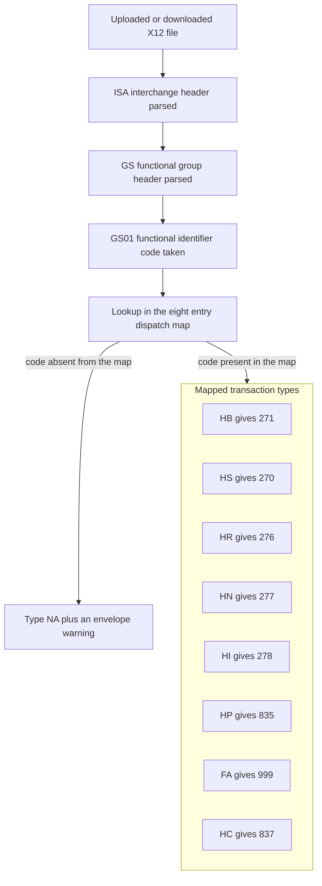
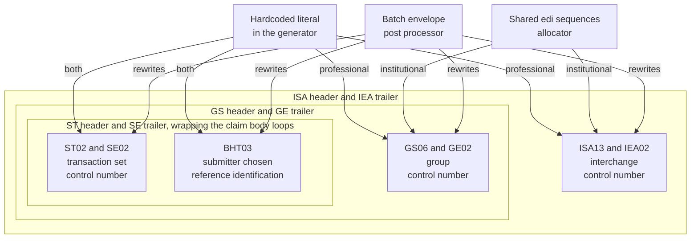
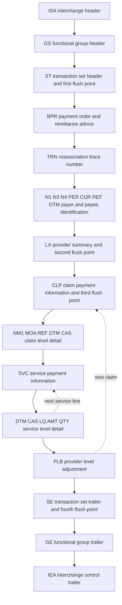

# OpenEMR X12 Transaction Reference

For each transaction type this codebase handles under X12, the electronic data interchange (EDI) standard that United States healthcare payers, providers and clearinghouses use to exchange claims, eligibility questions and payments: where it is built or read, what is non-obvious about the way it is built or read, and which trading-partner configuration changes it. A transaction type is one numbered message defined by that standard, and the nine this codebase handles are listed below.

**Scope and sources.** This document is the per-transaction reference for the nine X12 transaction types OpenEMR handles: the 837P and 837I claims, the 835 remittance advice, the 270 and 271 eligibility pair, the 276 and 277 claim-status pair, the 278 services review, and the 997 and 999 acknowledgement family. It is also the single place where the `x12_partners` trading-partner configuration and the `insurance_companies` payer-identity columns are documented; the sibling documents refer here rather than restating them. It was traced from the two claim generators `src/Billing/X125010837P.php` and `src/Billing/X125010837I.php`, the remittance parser `src/Billing/ParseERA.php`, the eligibility module `src/Billing/EDI270.php`, the file reader `src/Billing/EdiHistory/X12File.php`, the claim-status renderer `src/Billing/EdiHistory/Claim277Renderer.php`, the five legacy renderers and three code tables under `library/edihistory/`, the trading-partner model `library/classes/X12Partner.class.php`, the schema in `sql/database.sql`, and the billing test tree. Where a transaction takes part in the wider revenue cycle, the flow is in [claim-lifecycle.md](claim-lifecycle.md) and is cross-referenced rather than repeated; where a transaction embodies a decision about money or eligibility, the rule belongs to [business-rules.md](business-rules.md). Conventions, claim classes and the source-of-truth ordering are defined once in [README.md](README.md) and are used here without variation.

**Provenance.** Every line anchor below is relative to branch `master` at head commit `b7a7e690e419de3451740f995b768a8e8e5fba87`, on project version 8.3.0-dev (`version.php:L17-L20`). No code was executed to produce this document: PHP and Composer are not installed in the authoring environment, so every claim rests on static reading of file contents at that commit. Line counts, entry counts and column counts were derived by enumeration rather than carried over from any existing document.

## Table of Contents

- [The X12 Vocabulary Used in This Document](#the-x12-vocabulary-used-in-this-document)
    - [Envelope and structural terms](#envelope-and-structural-terms)
    - [Transaction set numbers](#transaction-set-numbers)
    - [Segment identifiers](#segment-identifiers)
    - [Code lists and other abbreviations](#code-lists-and-other-abbreviations)
- [How to Read a Transaction Section](#how-to-read-a-transaction-section)
- [How a File Reaches Its Handler](#how-a-file-reaches-its-handler)
    - [The functional group dispatch map](#the-functional-group-dispatch-map)
    - [The second dispatch map and where the two disagree](#the-second-dispatch-map-and-where-the-two-disagree)
    - [Where each type is stored and how it is recognised](#where-each-type-is-stored-and-how-it-is-recognised)
- [837P Professional Claim](#837p-professional-claim)
- [837I Institutional Claim](#837i-institutional-claim)
- [835 Remittance Advice](#835-remittance-advice)
- [270 Eligibility Benefit Inquiry](#270-eligibility-benefit-inquiry)
- [271 Eligibility Benefit Response](#271-eligibility-benefit-response)
- [276 Claim Status Inquiry](#276-claim-status-inquiry)
- [277 Claim Status Response](#277-claim-status-response)
- [278 Services Review](#278-services-review)
- [997 and 999 Acknowledgement](#997-and-999-acknowledgement)
- [Implementation Guide Version Census](#implementation-guide-version-census)
- [The x12_partners Configuration Reference](#the-x12_partners-configuration-reference)
    - [The column reference](#the-column-reference)
    - [Production by default](#production-by-default)
    - [The dead columns and their two mechanisms](#the-dead-columns-and-their-two-mechanisms)
    - [The processing format enumeration and its contested purpose](#the-processing-format-enumeration-and-its-contested-purpose)
    - [A property with no column](#a-property-with-no-column)
    - [Site globals that alter partner facing behaviour](#site-globals-that-alter-partner-facing-behaviour)
- [The insurance_companies Payer Identity Reference](#the-insurance_companies-payer-identity-reference)
- [Inference Register](#inference-register)
- [Related Documents](#related-documents)
- [Documentation Attribution](#documentation-attribution)

## The X12 Vocabulary Used in This Document

X12 knowledge is not assumed. Every term, segment identifier, loop identifier and code list this document uses is expanded here, so that the reference sections below can be read without a copy of an implementation guide to hand. The tables are descriptive of the standard, not of this codebase; what this codebase does with each of them is the subject of the sections that follow, and carries a citation there.

### Envelope and structural terms

| Term | What it is |
|------|-----------|
| Interchange | The outermost X12 wrapper. One file normally contains one interchange, opened by an ISA segment and closed by an IEA segment. |
| Functional group | A wrapper inside the interchange that holds transaction sets of one kind. Opened by a GS segment, closed by a GE segment. Its GS01 element, the functional identifier code, names the kind. |
| Transaction set | One business document, such as a single claim or a single remittance advice. Opened by an ST segment and closed by an SE segment. Its ST01 element names the transaction set number. |
| Segment | One line of an X12 file. It starts with a two-character or three-character segment identifier, holds elements separated by an element separator, and ends with a segment terminator. |
| Element and component | An element is one field of a segment. A composite element is subdivided further by a component separator. Both separators, and the segment terminator, are declared in the ISA segment of each file. |
| Loop | A named, repeatable group of segments. Loop identifiers in the implementation guides look like 1000A, 2000B or 2100C, and are how a guide says which occurrence of a repeated segment is meant. |
| Implementation guide | The payer-industry document that constrains the generic X12 standard into one usable form for one transaction. Its identifier, for example 005010X222A1, is carried in the GS08 element and usually repeated in ST03. |
| Trading partner | The counterparty an interchange is exchanged with, normally a clearinghouse or a payer. In this codebase a trading partner is a row of the `x12_partners` table, and its configuration is documented in [The x12_partners Configuration Reference](#the-x12_partners-configuration-reference). |

### Transaction set numbers

| Number | Name |
|--------|------|
| 837 | Health Care Claim. Two variants appear here: the 837P professional claim, submitted by physicians and other individual practitioners, and the 837I institutional claim, submitted by facilities on the UB-04 form layout. |
| 835 | Health Care Claim Payment and Advice, the payer's adjudication result and payment breakdown. Also called an ERA, an electronic remittance advice. |
| 270 | Health Care Eligibility Benefit Inquiry, a question about a patient's coverage. |
| 271 | Health Care Eligibility Benefit Response, the answer to a 270. |
| 276 | Health Care Claim Status Request, a question about a claim already submitted. |
| 277 | Health Care Claim Status Response, the answer to a 276. A 277CA is the claim-acknowledgement flavour of the same transaction set, which a payer or clearinghouse returns unsolicited to report which claims in a batch it accepted. |
| 278 | Health Care Services Review Information, used for prior authorisation and referral certification. |
| 997 | Functional Acknowledgment, the older syntax-level acknowledgement of a functional group. |
| 999 | Implementation Acknowledgment, its 5010-era replacement, which reports errors against an implementation guide rather than only against the generic syntax. |

### Segment identifiers

| Identifier | What it carries |
|-----------|-----------------|
| ISA | Interchange control header. Fixed-width. Declares the separators, the sender and receiver identifiers, the interchange control number in ISA13, whether an acknowledgement is requested in ISA14, and whether the interchange is test or production data in ISA15. |
| GS | Functional group header. GS01 is the functional identifier code, GS02 and GS03 the application sender and receiver codes, GS06 the group control number, GS08 the implementation guide identifier. |
| ST | Transaction set header. ST01 the transaction set number, ST02 the transaction set control number, ST03 the implementation convention reference. |
| SE | Transaction set trailer. SE01 the count of segments in the transaction set including ST and SE, SE02 the control number that must match ST02. |
| GE | Functional group trailer. GE01 the count of transaction sets, GE02 the control number that must match GS06. |
| IEA | Interchange control trailer. IEA01 the count of functional groups, IEA02 the control number that must match ISA13. |
| BHT | Beginning of hierarchical transaction. Opens the body of an 837, 270, 276 or 278. BHT03 is a reference identification the submitter chooses to identify the transaction. |
| HL | Hierarchical level. Builds the parent-and-child tree of an eligibility or authorisation transaction. |
| NM1 | Individual or organisational name, with an entity identifier code in NM101 and an identification code qualifier and value in NM108 and NM109. |
| N1, N3, N4 | Party identification, street address, and city, state and postal code. |
| PER | Administrative communications contact. |
| REF | Reference identification, qualified by REF01. |
| DTM and DTP | Date or time reference. DTM is used in the 835; DTP, which additionally carries a period format qualifier, is used in the eligibility and authorisation transactions. |
| DMG | Demographic information: date of birth, gender. |
| AMT | Monetary amount, qualified by AMT01. |
| QTY | Quantity, qualified by QTY01. |
| CUR | Currency. |
| TRN | Trace number, used to correlate a request with its response and to identify a payment. |
| PWK | Paperwork. Declares that a supporting document exists and how it is being transmitted. |
| LX | Assigned number, used in the 835 to open a service-provider summary and in other transactions to number a loop occurrence. |
| BPR | Beginning segment for payment order and remittance advice. The 835 payment instruction: amount, method, and the accounts it moves between. |
| CLP | Claim payment information. One per adjudicated claim in an 835: the submitter's claim identifier, the claim status code, the charged, paid and patient-responsibility amounts, and the payer's own claim identifier. |
| SVC | Service payment information. One per adjudicated service line inside a CLP. |
| CAS | Claim or service adjustment. Carries a group code and up to six triplets of reason code, amount and quantity, and is how an 835 explains any difference between charged and paid. |
| MIA | Inpatient adjudication information. Medicare Part A detail attached to a CLP: covered days, outlier and pass-through amounts, diagnosis-related-group amount, and remark codes. |
| MOA | Outpatient adjudication information, the outpatient counterpart of MIA. |
| PLB | Provider level adjustment. Money the payer moves at the provider level rather than against any one claim. |
| TS2 and TS3 | Provider supplemental summary information and provider summary information. Both are 835 summary segments. |
| LQ | Industry code identification, used in the 835 to introduce a remark code list. |
| RDM | Remittance delivery method. |
| EQ | Eligibility or benefit inquiry. The question a 270 asks, as a service type code in EQ01. |
| EB | Eligibility or benefit information. The answer a 271 gives, across an information code, a coverage level, a service type, an insurance type, a time period qualifier and a monetary or percentage amount. |
| AAA | Request validation. How a 271, 277 or 278 says the request itself could not be processed, and why. |
| STC | Status information. How a 277 reports a claim's status, as a composite of category, status and entity codes. |
| UM and HCR | Health care services review information and health care services review, the request and the decision segments of a 278. |
| PRV, MPI, INS, III, HI, HSD, CRC, CL1, CR1, CR2, CR5, CR6, SV1, SV2, SV3, TOO, MSG, LS, LE | Provider information; military personnel information; insured benefit; information; health care code information; health care services delivery; conditions indicator; institutional claim code; ambulance certification; chiropractic certification; home oxygen therapy certification; vision certification; professional service; institutional service line; dental service; tooth identification; free-form message text; and the loop header and loop trailer segments. These appear in the eligibility and authorisation renderers and are named where relevant below. |
| TA1 | Interchange acknowledgement. Reports on the ISA and IEA envelope itself, and can be returned inside a 997 or 999 or on its own. |
| AK1, AK2, AK3, AK4, AK5, AK9 | The 997 acknowledgement segments: functional group response header; transaction set response header; data segment note; data element note; transaction set response trailer; functional group response trailer. |
| IK2, IK3, IK4, IK5 | The 999 counterparts of AK2 through AK5, which additionally reference implementation guide loops. A 999 also uses a CTX segment to give the context of an error. |

### Code lists and other abbreviations

| Abbreviation | What it is |
|--------------|-----------|
| CARC | Claim Adjustment Reason Code, the code list used in the CAS segment to say why an amount was adjusted. |
| RARC | Remittance Advice Remark Code, the supplementary code list introduced by an LQ segment or carried in MIA and MOA. |
| DRG, DSH, MSP, PPS | Diagnosis Related Group; Disproportionate Share Hospital; Medicare Secondary Payer; Prospective Payment System. All four appear as MIA element names. |
| POS | Place of service code. |
| NPI | National Provider Identifier. |
| ETIN | Electronic Transmitter Identification Number, the identifier a clearinghouse issues to a submitter. |
| CAQH CORE | The Council for Affordable Quality Healthcare's Committee on Operating Rules for Information Exchange. Its connectivity rule defines the HTTP envelope used for real-time eligibility, and is the contract described in [270 Eligibility Benefit Inquiry](#270-eligibility-benefit-inquiry). |
| SFTP | SSH File Transfer Protocol, the batch transport this codebase uses for claims. |

## How to Read a Transaction Section

The nine transaction sections below share one internal template, and carry the same nine subsections in the same order, so that the same question can be answered for any transaction by looking in the same place.

| Subsection | What it answers |
|-----------|-----------------|
| Direction | Whether this codebase sends the transaction, receives it, or both. |
| Generated or parsed by | The file and line of the entry point. |
| Implementation-guide version string and how it is selected | Which guide identifier is emitted or read, and where that value comes from. For six of the nine the answer is that none is selected at all, and that is stated rather than omitted. |
| Envelope and control-number source | What each envelope element is set to, and where each control number comes from. |
| Segment-level notes | Non-obvious logic only. Where a segment behaves the way an implementation guide would lead a reader to expect, nothing is said about it. This is deliberate: an exhaustive segment transcription would be longer than the code and would go stale faster. |
| Per-partner configuration columns that affect it | Which columns of `x12_partners` change this transaction's output, with the line that reads each. |
| Rendering path | Which file under `library/edihistory/` displays the transaction in the EDI history browser, or the explicit statement that none exists together with what happens instead. |
| Test coverage | The covering test file, or the literal `none`. |
| Known gaps | What is missing, hardcoded, unreachable or asymmetric. |

Three conventions from [README.md](README.md) apply throughout and are not restated in each section. Claims traced in code are labelled VERIFIED and carry a citation. Claims about intent are labelled INFERRED and carry a confidence and a basis. Where code and a comment disagree, the code is authoritative and the comment is treated as evidence of intent only.

One caveat about test coverage, because it changes how the coverage subsections should be read. VERIFIED: thirteen of the sixteen billing test files live under `tests/Tests/Isolated/Billing/` and are collected only by the secondary configuration, whose isolated suite is declared at `phpunit-isolated.xml:L65-L67` and which is invoked by its own workflow at `.github/workflows/isolated-tests.yml:L50`. The primary suite list at `phpunit.xml:L43-L93` does not mention `tests/Tests/Isolated` at any point, so a reader who checks only the primary configuration will conclude that the classes those thirteen files cover are untested. Each coverage subsection below therefore names the configuration as well as the file.

## How a File Reaches Its Handler

An inbound X12 file arrives with no reliable indication of its type in its name, so the type is determined from its contents. This section documents how, because every inbound section below depends on it, and because there are two independent implementations of the same decision that do not agree on one code.

### The functional group dispatch map

This diagram answers: given an X12 file with no trustworthy filename, what determines which transaction handler reads it?



VERIFIED: the map is a private property of the modern file reader, declared across two physical lines at `src/Billing/EdiHistory/X12File.php:L101-L102`.

```php
private $gstype_ar = ['HB' => '271', 'HS' => '270', 'HR' => '276', 'HN' => '277',
                        'HI' => '278', 'HP' => '835', 'FA' => '999', 'HC' => '837'];
```

VERIFIED: the map is read through a single accessor. The accessor is `edih_gs_type()`, declared at `src/Billing/EdiHistory/X12File.php:L273`, whose body is one array lookup returning `false` on a miss at `src/Billing/EdiHistory/X12File.php:L276`. It is what actually selects the handler, and it is consulted at `src/Billing/EdiHistory/X12File.php:L400`, `src/Billing/EdiHistory/X12File.php:L423`, `src/Billing/EdiHistory/X12File.php:L449-L450`, `src/Billing/EdiHistory/X12File.php:L682-L683`, `src/Billing/EdiHistory/X12File.php:L1428` and `src/Billing/EdiHistory/X12File.php:L1455`.

| GS01 functional identifier code | Transaction type | Direction in this codebase | Handler |
|--------------------------------|------------------|---------------------------|---------|
| `HB` | 271 | Inbound | `library/edihistory/edih_271_html.php:L568` |
| `HS` | 270 | Outbound, and inbound only as an echo of what was sent | Generic segment display at `library/edihistory/edih_io.php:L445` |
| `HR` | 276 | Request type; generation absent, so structurally fileable only | Generic segment display at `library/edihistory/edih_io.php:L445` |
| `HN` | 277 | Inbound | `library/edihistory/edih_277_html.php:L271` |
| `HI` | 278 | Inbound only | `library/edihistory/edih_278_html.php:L855` |
| `HP` | 835 | Inbound | `library/edihistory/edih_835_html.php:L1478` for display, and the parser at `src/Billing/ParseERA.php:L85` for posting |
| `FA` | 999 | Inbound | `library/edihistory/edih_997_error.php:L320` |
| `HC` | 837 | Outbound | Generic segment display at `library/edihistory/edih_io.php:L401` |

Source: the map at `src/Billing/EdiHistory/X12File.php:L101-L102` for the first two columns; the routing branches at `library/edihistory/edih_io.php:L399-L448` for the last.

The direction column records what this codebase does with a type, not what the X12 standard says the type is for, and the 276 row is the reason the distinction has to be drawn. VERIFIED: the 276 is a request in the standard and is typed as a request by both index layers, yet no statement anywhere in the documented surface builds one, so the only 276 this system can hold is one that arrived already built. The evidence for that, category by category, is in [276 Claim Status Inquiry](#276-claim-status-inquiry); the same distinction is drawn for the index stores in [architecture.md](architecture.md).

Two behaviours of the map are worth stating because they are not visible from the map itself. VERIFIED: an unrecognised functional identifier code does not throw. It produces the literal type `NA` and appends a message to the envelope's own message list, at `src/Billing/EdiHistory/X12File.php:L682-L688`, so a file of an unhandled type is indexed as an unknown rather than rejected. VERIFIED: although the map's only entry for the acknowledgement family is `999`, the reader accepts either number when it looks a transaction up, at `src/Billing/EdiHistory/X12File.php:L827-L828`, which is what allows one code path to serve both the 997 and the 999.

### The second dispatch map and where the two disagree

VERIFIED: a second, independent type resolver exists in the legacy tree. `csv_file_type()` is declared at `library/edihistory/edih_csv_inc.php:L665`, holds its own map at `library/edihistory/edih_csv_inc.php:L679-L688`, and resolves either an internal type name or a GS01 code through the loop at `library/edihistory/edih_csv_inc.php:L692-L695`. It exists because the legacy index layer keys its comma-separated-value index files by an internal type name of the form `fNNN` rather than by a GS01 code.

The two maps agree on seven of eight codes and disagree on one. VERIFIED: `FA` resolves to the string `999` in the modern reader at `src/Billing/EdiHistory/X12File.php:L102`, and to the internal type `f997` in the legacy resolver at `library/edihistory/edih_csv_inc.php:L682`, whose entry lists `f999`, `f997`, `ack`, `ta1` and `FA` as aliases of one another. The practical consequence is that a 999 is displayed as a 999 and indexed as an `f997`, and it is why this document treats the two acknowledgement numbers in one section rather than two.

One guard in the legacy resolver is easy to misread and is documented here because its reason is recorded only in a comment. VERIFIED: the function rejects both the empty string and the string `'0'` before it does anything else, at `library/edihistory/edih_csv_inc.php:L669-L672`. INFERRED (confidence: High): the second rejection exists because `'0'` is a substring of the internal type name `f270`, so a loose substring test would match it. Basis: the comment immediately above the guard, at `library/edihistory/edih_csv_inc.php:L667-L668`, states exactly that, and the map is searched by substring at `library/edihistory/edih_csv_inc.php:L692-L695`.

### Where each type is stored and how it is recognised

Once a type is resolved, the legacy index layer needs to know which directory the file belongs in, which date column to key it by, and which filenames to accept. All three come from one parameter table.

| Internal type | Store directory | Claim-date column | Filename pattern source |
|---------------|-----------------|-------------------|-------------------------|
| `f837` | The outbound batch directory, `documents/edi` | `SvcDate` | `library/edihistory/edih_csv_inc.php:L738-L739` |
| `f997` | The history tree | `RspDate` | `library/edihistory/edih_csv_inc.php:L743-L744` |
| `f276` | The history tree | `ReqDate` | `library/edihistory/edih_csv_inc.php:L745-L746` |
| `f277` | The history tree | `SvcDate` | `library/edihistory/edih_csv_inc.php:L747-L748` |
| `f270` | The history tree | `ReqDate` | `library/edihistory/edih_csv_inc.php:L749-L750` |
| `f271` | The history tree | `RspDate` | `library/edihistory/edih_csv_inc.php:L751-L752` |
| `f278` | The history tree | `FileDate` | `library/edihistory/edih_csv_inc.php:L753-L754` |
| `f835` | The history tree | `SvcDate` | `library/edihistory/edih_csv_inc.php:L756-L757` |

Source: the parameter table at `library/edihistory/edih_csv_inc.php:L738-L757`. The storage topology those directories belong to, including why the remittance staging directory is not the same as the history tree's own remittance directory, is documented in [architecture.md](architecture.md) and is not repeated here.

Two of those rows carry a consequence for the sections below. VERIFIED: the outbound claim type is the only one whose store directory is outside the history tree, at `library/edihistory/edih_csv_inc.php:L738`, which is how a batch file written by the outbound pipeline becomes visible to the history browser without being copied. VERIFIED: the acknowledgement pattern at `library/edihistory/edih_csv_inc.php:L744` accepts four different extensions, which is the filesystem-level counterpart of the one-section-for-two-numbers treatment described above.

## 837P Professional Claim

The 837P is the professional health care claim: the transaction a physician practice sends to a clearinghouse or payer to be paid for services. It is the largest single generator in the subsystem and the one with no test coverage at all.

### Direction

Outbound only. Nothing in this codebase parses an inbound 837.

### Generated or parsed by

`X125010837P::genX12837P()`, declared at `src/Billing/X125010837P.php:L40-L50` in a 1,640-line file. It is called from exactly two places, both generator tasks of the batch pipeline: `src/Billing/BillingProcessor/Tasks/GeneratorX12.php:L70` for the single-file batch, and `src/Billing/BillingProcessor/Tasks/GeneratorX12Direct.php:L241` for the per-partner batch. The choice between them is the site global documented in [Site globals that alter partner facing behaviour](#site-globals-that-alter-partner-facing-behaviour). How those tasks fit into the pipeline is stage S4 of [claim-lifecycle.md](claim-lifecycle.md).

VERIFIED: the generator builds its own data model first, constructing a `Claim` object at `src/Billing/X125010837P.php:L53`, and every partner-derived and payer-derived value in the envelope comes through that object's accessors rather than from the raw table row.

### Implementation-guide version string and how it is selected

`005010X222A1`, and it is not selected at all: it is a class constant.

VERIFIED: the value is declared as `Claim::X12_VERSION` at `src/Billing/Claim.php:L29`, returned unconditionally by `x12gsversionstring()` at `src/Billing/Claim.php:L619-L622`, and written into two places in the envelope: the GS08 implementation guide identifier at `src/Billing/X125010837P.php:L87`, and the ST03 implementation convention reference at `src/Billing/X125010837P.php:L104`. There is no per-partner column and no branch. A site that must submit under a different professional guide revision cannot do so through configuration.

INFERRED (confidence: High): the constant was introduced to keep the two emission sites from drifting apart rather than to make the guide version configurable. Basis: both sites call the same accessor rather than repeating a literal, whereas the institutional generator repeats a literal in both of its equivalent positions, at `src/Billing/X125010837I.php:L73` and `src/Billing/X125010837I.php:L80`, and has drifted from its own commented-out accessor call at `src/Billing/X125010837I.php:L72` and `src/Billing/X125010837I.php:L79`.

### Envelope and control-number source

This diagram answers: for an 837, which envelope element holds which control number, and what supplies each value?



Reading the diagram: an edge labelled `professional` or `institutional` means only that generator takes the value from that source, and `rewrites` means the batch post-processor overwrites whatever the generator emitted. The four elements shown are the only ones in an 837 envelope that carry a control number or a submitter-chosen reference; every other envelope element is either partner-derived or a fixed literal, as the table below sets out.

The professional generator's own envelope is built element by element in three blocks, and every element that is not partner-derived is a literal.

| Element | Value as emitted | Anchor |
|---------|------------------|--------|
| ISA01 to ISA05 | Partner-derived, through the claim accessors | `src/Billing/X125010837P.php:L61-L65` |
| ISA06 interchange sender | Partner-derived, padded to fifteen characters | `src/Billing/X125010837P.php:L66` |
| ISA07 receiver qualifier | Partner-derived | `src/Billing/X125010837P.php:L67` |
| ISA08 interchange receiver | Partner-derived | `src/Billing/X125010837P.php:L68` |
| ISA09 interchange date | Literal `030911` | `src/Billing/X125010837P.php:L69` |
| ISA10 interchange time | Literal `1630` | `src/Billing/X125010837P.php:L70` |
| ISA11 repetition separator | Literal `^` | `src/Billing/X125010837P.php:L71` |
| ISA12 control version | Literal `00501` | `src/Billing/X125010837P.php:L72` |
| ISA13 interchange control number | Literal `000000001` | `src/Billing/X125010837P.php:L73` |
| ISA14 acknowledgement requested | Partner-derived | `src/Billing/X125010837P.php:L74` |
| ISA15 usage indicator | Partner-derived | `src/Billing/X125010837P.php:L75` |
| ISA16 component separator | Literal `:` | `src/Billing/X125010837P.php:L76` |
| GS01 functional identifier | Literal `HC` | `src/Billing/X125010837P.php:L80` |
| GS02 application sender | Partner-derived, falling back to the interchange sender | `src/Billing/X125010837P.php:L81` |
| GS03 application receiver | Partner-derived, falling back to the partner receiver identifier | `src/Billing/X125010837P.php:L82` |
| GS04 and GS05 | Generation date and time | `src/Billing/X125010837P.php:L83-L84` |
| GS06 group control number | Literal `1` | `src/Billing/X125010837P.php:L85` |
| GS07 responsible agency | Literal `X` | `src/Billing/X125010837P.php:L86` |
| GS08 implementation guide | The class constant | `src/Billing/X125010837P.php:L87` |
| ST01 transaction set | Literal `837` | `src/Billing/X125010837P.php:L102` |
| ST02 transaction set control number | Literal `0021` | `src/Billing/X125010837P.php:L103` |
| ST03 implementation convention | The class constant | `src/Billing/X125010837P.php:L104` |
| BHT01 hierarchical structure code | Literal `0019` | `src/Billing/X125010837P.php:L109` |
| BHT02 transaction set purpose | Literal `00`, original transmission | `src/Billing/X125010837P.php:L110` |
| BHT03 reference identification | Literal `0123` | `src/Billing/X125010837P.php:L111` |
| BHT04 and BHT05 | Creation date and time | `src/Billing/X125010837P.php:L112-L113` |
| BHT06 transaction type | `RP` for reporting when the encounter-claim flag is set, otherwise `CH` for chargeable | `src/Billing/X125010837P.php:L114` |
| SE01 segment count | The running segment counter | `src/Billing/X125010837P.php:L1619` |
| SE02 | Literal `0021`, matching the ST02 literal | `src/Billing/X125010837P.php:L1620` |
| GE01 and GE02 | Literals `1` and `1` | `src/Billing/X125010837P.php:L1624-L1627` |
| IEA01 and IEA02 | Literals `1` and `000000001` | `src/Billing/X125010837P.php:L1629-L1632` |

A single claim is never transmitted on its own, so every value in that table passes through the batch post-processor before it reaches a payer. What that pass does is not uniform, and the common summary that it "rewrites the envelope" is too coarse to act on: it overwrites nine of those elements, preserves most of the rest verbatim, re-emits four as its own literals, and discards the two trailers entirely before reissuing them once for the whole batch. VERIFIED, element by element, against `append_claim()` at `src/Billing/BillingProcessor/BillingClaimBatch.php:L202-L269` and `append_claim_close()` at `src/Billing/BillingProcessor/BillingClaimBatch.php:L272-L279`:

| Treatment | Elements | Where the batch decides it |
|-----------|----------|---------------------------|
| **Overwritten** with a batch-derived value | ISA09, ISA10, ISA13; GS04, GS05, GS06; ST02; BHT03; SE02 | ISA at `src/Billing/BillingProcessor/BillingClaimBatch.php:L216-L217`; GS at `src/Billing/BillingProcessor/BillingClaimBatch.php:L234-L236`; ST02 at `src/Billing/BillingProcessor/BillingClaimBatch.php:L242-L243`; BHT03 at `src/Billing/BillingProcessor/BillingClaimBatch.php:L254`; SE02 at `src/Billing/BillingProcessor/BillingClaimBatch.php:L260` |
| **Preserved** verbatim from whatever the generator emitted | ISA01 through ISA08 as one block, ISA11, ISA12, ISA14, ISA15; GS02, GS03, GS08; ST03, when non-empty; **BHT01, BHT02, BHT04, BHT05 and BHT06**; SE01 | ISA01-ISA08 survive because the batch copies the first 70 characters of the segment unchanged at `src/Billing/BillingProcessor/BillingClaimBatch.php:L216`, and the four later ISA elements are read back out of the exploded segment at `src/Billing/BillingProcessor/BillingClaimBatch.php:L216-L217`; GS at `src/Billing/BillingProcessor/BillingClaimBatch.php:L234-L236`; ST03 behind an emptiness test at `src/Billing/BillingProcessor/BillingClaimBatch.php:L244-L246`; the five BHT elements for the reason given below; SE01 at `src/Billing/BillingProcessor/BillingClaimBatch.php:L260` |
| **Re-emitted** as a batch literal, so the value is identical but the batch writes its own copy rather than reading the claim's | ISA16, GS01, GS07, ST01 | `src/Billing/BillingProcessor/BillingClaimBatch.php:L217` for the component separator, `src/Billing/BillingProcessor/BillingClaimBatch.php:L234` and `src/Billing/BillingProcessor/BillingClaimBatch.php:L236` for the two group literals, `src/Billing/BillingProcessor/BillingClaimBatch.php:L243` for the transaction-set identifier |
| **Discarded, then reissued once per batch** | GE01, GE02, IEA01, IEA02 | Every incoming trailer is skipped at `src/Billing/BillingProcessor/BillingClaimBatch.php:L264-L266`; the batch writes one GE at `src/Billing/BillingProcessor/BillingClaimBatch.php:L275` and one IEA at `src/Billing/BillingProcessor/BillingClaimBatch.php:L278` |

The five preserved BHT elements are the entry most likely to surprise a reader, because it is natural to read "the batch rewrites the BHT" - including the `rewrites` edge in the diagram above - as meaning the whole segment is reissued. VERIFIED: only BHT03 is. The batch replaces a single six-character needle by string position, `*0123*` becoming `*1*`, at `src/Billing/BillingProcessor/BillingClaimBatch.php:L254`, and copies the rest of the segment through untouched. BHT02 in particular keeps the generator's literal `00`, meaning original transmission, no matter how many times the same claim is regenerated and rebatched.

The stage-level narrative of this pass, with its state transitions and failure modes, is stage S5 of [claim-lifecycle.md](claim-lifecycle.md) and is not duplicated here.

INFERRED (confidence: Medium): the four literals the batch overwrites are placeholders the generator emits deliberately, in the expectation that the batch pass will replace them, rather than values that happen to be constant for want of anything better. Basis: three of the four are accompanied by in-code acknowledgements of their provisional status - the comment beside the interchange date at `src/Billing/X125010837P.php:L69` naming a screen that was once meant to substitute it, the note beside GS06 at `src/Billing/X125010837P.php:L85` that a tracking number is still to be added, and the batch's own comment at `src/Billing/BillingProcessor/BillingClaimBatch.php:L253` naming this generator as where the BHT03 needle is set. The confidence is Medium rather than High because no comment accompanies ST02, and because intent is being read from comments, which the source-of-truth ordering in [README.md](README.md) admits only as evidence of intent.

Two of those placeholders are worth separating out.

VERIFIED: the comment beside the interchange date at `src/Billing/X125010837P.php:L69` says the dummy value is replaced by a named screen, and the screen it names exists at `interface/billing/billing_process.php`, but that screen no longer performs any substitution: it is 65 lines long and delegates the whole run to the batch pipeline at `interface/billing/billing_process.php:L32-L33`. The substitution is actually performed by the batch post-processor. Under the source-of-truth ordering in [README.md](README.md) the code is authoritative and the comment records only where the work used to live.

VERIFIED: the BHT03 literal is not a placeholder in the ordinary sense but a search key. The batch post-processor locates it by string position, searching for the six-character sequence `*0123*`, at `src/Billing/BillingProcessor/BillingClaimBatch.php:L254`, and the comment directly above it at `src/Billing/BillingProcessor/BillingClaimBatch.php:L253` names this generator as where the needle is set. The two files are coupled by an undeclared string constant in two places.

### Segment-level notes

Six behaviours in this generator are not what an implementation guide would lead a reader to expect. Everything else in the 1,640 lines follows the guide closely enough to need no note.

**The submitter in loop 1000A has two mutually exclusive forms.** VERIFIED: the generator branches on the federal identifier type at `src/Billing/X125010837P.php:L120`, emitting a person-shaped NM1 when the practice bills under a social security number at `src/Billing/X125010837P.php:L121-L150` and an organisation-shaped NM1 otherwise at `src/Billing/X125010837P.php:L153-L181`. Inside both branches it additionally consults `x12_submitter_name()` at `src/Billing/X125010837P.php:L125`, `src/Billing/X125010837P.php:L128`, `src/Billing/X125010837P.php:L157` and `src/Billing/X125010837P.php:L158`. That accessor returns `false` unless a site global is set, at `src/Billing/Claim.php:L656-L658`, and only reads the partner column at `src/Billing/Claim.php:L660` when it is. The consequence is that the submitter name, and with it the administrative contact name, telephone number, electronic mail address and identification code emitted at `src/Billing/Claim.php:L820-L878`, switch from the practice's own values to a third party's values purely because a site-level checkbox is on. All four of those accessors read the `users` table keyed by the partner's submitter identifier, at `src/Billing/Claim.php:L826`, `src/Billing/Claim.php:L838`, `src/Billing/Claim.php:L861` and `src/Billing/Claim.php:L875`.

**A PWK paperwork segment is emitted for a document that has no transport.** VERIFIED: a comment block at `src/Billing/X125010837P.php:L778-L784` states that medical attachments are not implemented and records, as guidance for whoever implements them, which report type and transmission codes to use and that the batch control number belongs in the sixth element. Directly beneath it, a branch on whether the claim is employment-related at `src/Billing/X125010837P.php:L785` emits a PWK segment anyway, at `src/Billing/X125010837P.php:L786-L792`, with the report type code `OZ` at `src/Billing/X125010837P.php:L787`, the transmission code `EL` for electronic at `src/Billing/X125010837P.php:L788`, the identification qualifier `AC` at `src/Billing/X125010837P.php:L790`, and a freshly allocated control number as the attachment control number at `src/Billing/X125010837P.php:L791`. The claim therefore tells the payer that an electronically transmitted attachment exists and gives it a reference, and nothing in this codebase transmits one. The reason nothing does is documented in [The dead columns and their two mechanisms](#the-dead-columns-and-their-two-mechanisms): the trading-partner column that would hold the attachment endpoint has no operational consumer, being editable and persisted from the partner screen while no transport ever reads it back.

**That PWK segment departs from the file's own conventions twice.** VERIFIED: every other segment in the generator terminates with a tilde followed by a newline, which is what the generator tasks split on at `src/Billing/BillingProcessor/Tasks/GeneratorX12.php:L69` and `src/Billing/BillingProcessor/Tasks/GeneratorX12Direct.php:L241`; this one terminates with a bare tilde at `src/Billing/X125010837P.php:L792`. And no segment counter increment precedes it, unlike every other emission in the file, so the segment count the generator reports in SE01 at `src/Billing/X125010837P.php:L1619` is one lower than the number of segments actually present whenever the branch fires. Both observations are registered as defect candidates in [defect-candidates.md](defect-candidates.md).

**Empty trailing elements are stripped from the whole file in one pass at the end.** VERIFIED: immediately before returning, the generator runs a regular-expression replacement over the entire accumulated output at `src/Billing/X125010837P.php:L1635`, collapsing any run of element separators immediately before a segment terminator into the terminator alone. This is why segments in a generated file are shorter than the emission code suggests, and why reading the emission code alone will mislead anyone counting elements in a produced file.

**A claim with no charges is logged and then transmitted anyway.** VERIFIED: the generator sums the line charges at `src/Billing/X125010837P.php:L664-L668`, and when the total is zero it appends a plain English sentence to the by-reference log parameter declared at `src/Billing/X125010837P.php:L44`, at `src/Billing/X125010837P.php:L669-L671`. It does not return, skip the claim or raise anything. Execution falls straight through to the CLM segment at `src/Billing/X125010837P.php:L673-L691`, whose total-charge element is the same zero formatted to two decimal places at `src/Billing/X125010837P.php:L676`. A second message of the same shape is written per zero-charge procedure at `src/Billing/X125010837P.php:L1371`. The log string is initialised by the calling task at `src/Billing/BillingProcessor/Tasks/GeneratorX12.php:L66` and surfaced through `appendToLog()` at `src/Billing/BillingProcessor/Tasks/GeneratorX12.php:L80`, so the message reaches the operator's batch log and nothing stops the zero-value claim from reaching the payer.

**The encounter-claim flag reaches the payer identifier as well as BHT06.** VERIFIED: the same flag that selects `RP` over `CH` in the transaction header also selects the payer's alternate identifier instead of its primary one, at `src/Billing/X125010837P.php:L525`. One boolean therefore changes both what the transaction says it is for and which payer identifier it names.

### Per-partner configuration columns that affect it

| Column | Effect on this transaction | Read at |
|--------|---------------------------|---------|
| `x12_isa01` | ISA01 authorisation information qualifier | `src/Billing/Claim.php:L681` |
| `x12_isa02` | ISA02 authorisation information | `src/Billing/Claim.php:L686` |
| `x12_isa03` | ISA03 security information qualifier | `src/Billing/Claim.php:L691` |
| `x12_isa04` | ISA04 security information | `src/Billing/Claim.php:L695` |
| `x12_isa05` | ISA05 interchange sender qualifier | `src/Billing/Claim.php:L676` |
| `x12_sender_id` | ISA06 interchange sender, and the GS02 fallback | `src/Billing/Claim.php:L626` and `src/Billing/Claim.php:L717` |
| `x12_isa07` | ISA07 interchange receiver qualifier | `src/Billing/Claim.php:L700` |
| `x12_receiver_id` | ISA08 interchange receiver, and the GS03 fallback | `src/Billing/Claim.php:L666` and `src/Billing/Claim.php:L649` |
| `x12_isa14` | ISA14 acknowledgement requested | `src/Billing/Claim.php:L705` |
| `x12_isa15` | ISA15 usage indicator, test or production | `src/Billing/Claim.php:L710` |
| `x12_gs02` | GS02 application sender code | `src/Billing/Claim.php:L715` |
| `x12_gs03` | GS03 application receiver code when non-empty | `src/Billing/Claim.php:L646-L647` |
| `x12_submitter_name` | The loop 1000A submitter name, only when the site global is set | `src/Billing/Claim.php:L660` |
| `x12_submitter_id` | The key used to read the submitter's contact details from `users` | `src/Billing/Claim.php:L826`, `src/Billing/Claim.php:L838`, `src/Billing/Claim.php:L861`, `src/Billing/Claim.php:L875` |
| `name` | The loop 1000B receiver name | `src/Billing/Claim.php:L961` |
| `id_number` | The loop 1000B receiver identification code, with dashes removed | `src/Billing/Claim.php:L969` |
| `x12_sftp_local_dir` | The directory a per-partner batch file is written to, on the direct path only | `src/Billing/BillingProcessor/Tasks/GeneratorX12Direct.php:L115` |

The full column reference, including the columns that affect nothing, is in [The column reference](#the-column-reference).

### Rendering path

**None, and why.** VERIFIED: no file under `library/edihistory/` contains an HTML transaction renderer for the 837, and the routing branch proves it rather than merely failing to find one: the branch for the outbound claim type at `library/edihistory/edih_io.php:L399-L401` calls the generic segment display directly, with no HTML alternative offered, whereas the branch for the eligibility, status and authorisation family at `library/edihistory/edih_io.php:L435-L446` offers HTML renderers for three of its five types and falls back to the same generic display for the other two.

VERIFIED: what the legacy tree does with an 837 is index it and display it as raw segments. It reads the batch file the modern pipeline produces out of the outbound directory recorded at `library/edihistory/edih_csv_inc.php:L738`, and there is no `edih_837_html.php` and no 837 branch in the renderer dispatch chain. A reader looking for a legacy 837 renderer should stop looking.

INFERRED (confidence: Medium): no legacy 837 renderer was ever written, because outbound 837 generation never had a legacy counterpart to render from. Basis: the legacy tree renders inbound transactions and treats the one outbound type it tracks as read-only, per the comment at `library/edihistory/edih_csv_inc.php:L735`, which is consistent with generation having always lived elsewhere. This is a claim about what the repository's history does **not** contain, and no commit history was examined to establish it, so a deleted renderer cannot be ruled out on the evidence given here.

### Test coverage

`none`. VERIFIED by search: no file anywhere under `tests/` names either `X125010837P` or `genX12837P`. The largest generator in the subsystem, at 1,640 lines, has no test of any kind under either the primary configuration at `phpunit.xml:L43-L93` or the isolated configuration at `phpunit-isolated.xml:L65-L67`.

### Known gaps

- Four envelope control numbers are fixed literals in the generator and depend on a downstream pass to become unique: ISA13 at `src/Billing/X125010837P.php:L73`, GS06 at `src/Billing/X125010837P.php:L85` - which carries an in-code note that a tracking number is still to be added - ST02 at `src/Billing/X125010837P.php:L103` and BHT03 at `src/Billing/X125010837P.php:L111`. VERIFIED: the problem is not that a freshly generated claim is internally inconsistent. Each header literal matches its own trailer exactly: ISA13 `000000001` against IEA02 at `src/Billing/X125010837P.php:L1631`, GS06 `1` against GE02 at `src/Billing/X125010837P.php:L1626`, and ST02 `0021` against SE02 at `src/Billing/X125010837P.php:L1620`. Read on its own, one claim is a well-formed interchange. The problem is that the values are constants rather than allocations, so **every** claim the generator produces carries the same three control numbers, and uniqueness across claims is supplied only by the batch pass described above - ISA13 from the batch interchange control number, GS06 from the batch group number, ST02 renumbered per transaction set. Any path that reaches a payer without going through `append_claim()` therefore transmits duplicate control numbers, and control-number collision is the class of error a payer rejects at the interchange level rather than at the claim level.
- The BHT03 literal is the same fixed value for every claim, at `src/Billing/X125010837P.php:L111`. The 2016 legacy documentation recorded a defect claim about exactly this value and proposed a patch; the claim, the patch and what became of it belong to [defect-candidates.md](defect-candidates.md).
- The implementation guide version cannot be configured per partner, for the reason given above.
- Medical attachments are declared to the payer and not transmitted, as described in the segment notes.
- No test coverage at all.

## 837I Institutional Claim

The 837I is the institutional health care claim: what a facility sends for a stay or a hospital-based service. It is built from the UB-04 paper form layout rather than from the claim model directly, which makes it the most structurally unusual generator in the subsystem.

### Direction

Outbound only. Nothing in this codebase parses an inbound 837.

### Generated or parsed by

`X125010837I::generateX12837I()`, declared at `src/Billing/X125010837I.php:L26` in a 1,225-line file. Note the name: the professional generator is `genX12837P` and the institutional one is `generateX12837I`, which is a naming inconsistency worth knowing before searching for it. It is called from exactly one place, at `src/Billing/BillingProcessor/Tasks/GeneratorUB04X12.php:L46`.

VERIFIED: its fifth parameter is the UB-04 array, and the generator normalises that array to a fixed length before using it: a loop at `src/Billing/X125010837I.php:L34-L36` fills every index from 0 to 427 that is not already set with an empty string, guarded on the array being non-empty at `src/Billing/X125010837I.php:L33`. The array itself is built by a procedural function in the interface tree, `get_ub04_array()` at `interface/billing/ub04_dispose.php:L201`, which the calling task invokes at `src/Billing/BillingProcessor/Tasks/GeneratorUB04X12.php:L73` and `src/Billing/BillingProcessor/Tasks/GeneratorUB04X12.php:L79`, and whose per-run reset `ub04_dispose()` at `interface/billing/ub04_dispose.php:L20` the task calls during setup at `src/Billing/BillingProcessor/Tasks/GeneratorUB04X12.php:L67`.

The contract between the two is positional and undeclared: 428 array offsets, each corresponding to a numbered box of the UB-04 form, with no named constants on either side. INFERRED (confidence: High): the 428-element pad exists to prevent undefined-index notices rather than to express a form contract. Basis: it fills with the empty string rather than with any meaningful default, and it runs unconditionally over the whole range rather than over the offsets the generator actually reads.

### Implementation-guide version string and how it is selected

`005010X223A2`, and it is not selected at all: it is a literal repeated twice, and the accessor that would have supplied it is commented out beside each occurrence.

VERIFIED: the GS08 implementation guide identifier is the literal at `src/Billing/X125010837I.php:L73`, immediately below a commented-out call to the claim accessor at `src/Billing/X125010837I.php:L72`; and the ST03 implementation convention reference is the same literal at `src/Billing/X125010837I.php:L80`, immediately below the same commented-out call at `src/Billing/X125010837I.php:L79`. The accessor those two commented lines would have called returns the professional guide identifier, at `src/Billing/Claim.php:L619-L622`, which is the wrong guide for an institutional claim.

INFERRED (confidence: High): the accessor calls were commented out precisely because the shared constant is professional-only, and hardcoding was chosen over adding a second constant. Basis: the two commented-out lines call an accessor whose sole return value is the professional identifier declared at `src/Billing/Claim.php:L29`, and the literals that replaced them are the institutional identifier, so the substitution corrects a real mismatch rather than working around a missing value.

### Envelope and control-number source

The institutional envelope differs from the professional one in seven of the positions tabulated below - ISA09, ISA10, ISA13, GS06, GS08, ST03 and BHT06 - while the remaining six are identical. Six of those seven differences make the institutional envelope more nearly correct before post-processing, because they substitute real dates, allocated control numbers and the correct institutional implementation-guide identifiers for the professional generator's fixed literals. The seventh, BHT06, goes the other way and makes it strictly worse: for the reason set out below the table, the institutional transaction type can never take its reporting value, whereas the professional one can.

| Element | 837I value as emitted | Anchor | Compared with the 837P |
|---------|----------------------|--------|------------------------|
| ISA09 interchange date | The real generation date | `src/Billing/X125010837I.php:L54` | The 837P emits a fixed date |
| ISA10 interchange time | The real generation time | `src/Billing/X125010837I.php:L56` | The 837P emits a fixed time |
| ISA13 interchange control number | Allocated from the shared sequence | `src/Billing/X125010837I.php:L59` | The 837P emits a fixed literal |
| ISA14 and ISA15 | Partner-derived | `src/Billing/X125010837I.php:L60-L61` | Same |
| GS01 functional identifier | Literal `HC` | `src/Billing/X125010837I.php:L65` | Same |
| GS06 group control number | Allocated from the shared sequence | `src/Billing/X125010837I.php:L70` | The 837P emits the literal `1` |
| GS07 responsible agency | Literal `X` | `src/Billing/X125010837I.php:L71` | Same |
| GS08 implementation guide | Institutional literal | `src/Billing/X125010837I.php:L73` | The 837P uses the shared constant |
| ST01 transaction set | Literal `837` | `src/Billing/X125010837I.php:L77` | Same |
| ST02 transaction set control number | Literal `0021` | `src/Billing/X125010837I.php:L78` | Same |
| ST03 implementation convention | Institutional literal | `src/Billing/X125010837I.php:L80` | The 837P uses the shared constant |
| BHT01 to BHT05 | Structure code, purpose, the reference literal, date and time | `src/Billing/X125010837I.php:L84-L88` | Same, including the same `0123` reference literal at `src/Billing/X125010837I.php:L86` |
| BHT06 transaction type | Conditional on a variable that is never in scope | `src/Billing/X125010837I.php:L89` | The 837P conditions on a real parameter |

VERIFIED: the two allocated control numbers come from `BillingClaimBatchControlNumber`, whose interchange accessor pads a generated identifier to nine characters at `src/Billing/BillingProcessor/BillingClaimBatchControlNumber.php:L22-L25` and whose group accessor returns the same identifier unpadded at `src/Billing/BillingProcessor/BillingClaimBatchControlNumber.php:L27-L30`. Each call draws a fresh value, so within a single institutional claim the interchange control number at `src/Billing/X125010837I.php:L59` and the group control number at `src/Billing/X125010837I.php:L70` are two different numbers. Those two are the only allocator calls the institutional generator makes.

The professional generator's use of the same allocator is unrelated to its envelope and is easy to misread as a third envelope allocation, so it is stated separately. VERIFIED: the professional generator calls the allocator exactly once, at `src/Billing/X125010837P.php:L791`, and that call is not an envelope control number at all - it supplies PWK06, the attachment control number on the paperwork segment. It is also conditional, reached only when the claim is flagged as employment-related, per the branch at `src/Billing/X125010837P.php:L785`. For an ordinary professional claim the allocator is never called, and the envelope control numbers remain the fixed literals `000000001`, `1` and `0021` until the batch pass replaces them.

VERIFIED: the BHT06 transaction type is conditioned on a variable that the function never receives. The expression at `src/Billing/X125010837I.php:L89` tests `$encounter_claim`, and the signature at `src/Billing/X125010837I.php:L26` declares only five parameters, none of them that one. The null-coalescing guard in the expression makes it evaluate to false rather than raise a warning, so the institutional claim is always marked chargeable and can never be marked reporting. The professional generator, by contrast, receives the flag as its fifth parameter at `src/Billing/X125010837P.php:L45` and is given a real value by both of its callers, at `src/Billing/BillingProcessor/Tasks/GeneratorX12.php:L75` and `src/Billing/BillingProcessor/Tasks/GeneratorX12Direct.php:L246`, where it originates as a constructor-promoted property at `src/Billing/BillingProcessor/Tasks/GeneratorX12.php:L48-L51`. This is registered as a defect candidate in [defect-candidates.md](defect-candidates.md).

One further asymmetry belongs here because it is invisible from either generator. VERIFIED: the institutional task constructs its batch without passing the run context, at `src/Billing/BillingProcessor/Tasks/GeneratorUB04X12.php:L64`, whereas the professional task passes it at `src/Billing/BillingProcessor/Tasks/GeneratorX12.php:L96`. The batch constructor's context parameter defaults to an empty array at `src/Billing/BillingProcessor/BillingClaimBatch.php:L51`, and the two batch control numbers are chosen by testing the first claim's action for the word validate, at `src/Billing/BillingProcessor/BillingClaimBatch.php:L63` and `src/Billing/BillingProcessor/BillingClaimBatch.php:L66`. With no context that test can never succeed, so an institutional validation-only run consumes real sequence numbers while a professional validation-only run substitutes the fixed literals `000000001` and `2`.

### Segment-level notes

Three behaviours are non-obvious. The remainder of the file is a long, mechanical projection of UB-04 form boxes onto 837I loops, and needs no note.

**The generator's segment counter is local, not shared.** VERIFIED: it is initialised inside the function at `src/Billing/X125010837I.php:L31`, whereas the professional generator receives its counter by reference as its eighth parameter at `src/Billing/X125010837P.php:L48`, which is what allows the per-partner direct path to carry a running count across claims and write it back at `src/Billing/BillingProcessor/Tasks/GeneratorX12Direct.php:L253`. There is no institutional equivalent of the direct per-partner path, so there is nothing for a shared counter to accumulate across.

**Two administrative contact blocks are emitted from different loops, and both are partner-substitutable.** VERIFIED: a PER administrative communications contact is emitted at `src/Billing/X125010837I.php:L112-L116` and again at `src/Billing/X125010837I.php:L195-L199`, and in both places the name and telephone number come from accessors that switch to the trading partner's submitter when a site global is set, at `src/Billing/Claim.php:L822` and `src/Billing/Claim.php:L834`. That behaviour is set out under this section's per-partner configuration heading below, because it is a configuration effect rather than a segment-shape one. The receiver identity in loop 1000B is taken from the same partner accessors the professional generator uses, at `src/Billing/X125010837I.php:L124` and `src/Billing/X125010837I.php:L130`.

**Payer identity is resolved five separate times in the file.** VERIFIED: the primary and alternate payer identifiers are read at `src/Billing/X125010837I.php:L283`, `src/Billing/X125010837I.php:L285`, `src/Billing/X125010837I.php:L955`, `src/Billing/X125010837I.php:L958` and `src/Billing/X125010837I.php:L1185`. The two accessors behind them read different columns of `insurance_companies`, which is documented in [The insurance_companies Payer Identity Reference](#the-insurance_companies-payer-identity-reference). Service-line procedure codes are looked up per line, in a query at `src/Billing/X125010837I.php:L988-L998`.

### Per-partner configuration columns that affect it

The same envelope columns as the 837P, read through the same claim accessors, with one exception and one qualification that matters more than the exception. VERIFIED: the exception is that the institutional generator does not participate in the per-partner direct path, so `x12_sftp_local_dir` does not affect where its output is written.

**The qualification: the submitter substitution reaches the institutional claim in part, rather than not at all.** VERIFIED: the loop 1000A organisation name is *not* substituted. NM103 is the billing facility's own name, at `src/Billing/X125010837I.php:L94` and `src/Billing/X125010837I.php:L101`, and NM109 is that facility's federal employer identifier, at `src/Billing/X125010837I.php:L108`, whose accessor reads the facility row and no partner column at `src/Billing/Claim.php:L779-L782`.

VERIFIED: the two PER administrative contact blocks *are* substituted, both of them. Each calls `billingContactName()` and `billingContactPhone()` - at `src/Billing/X125010837I.php:L114` and `src/Billing/X125010837I.php:L116` in loop 1000A, and again at `src/Billing/X125010837I.php:L197` and `src/Billing/X125010837I.php:L199` in the billing-provider loop - and each of those two accessors tests `x12_submitter_name()` before doing anything else, at `src/Billing/Claim.php:L822` and `src/Billing/Claim.php:L834`. With the site global off they return the billing facility's attention line and telephone number, at `src/Billing/Claim.php:L823` and `src/Billing/Claim.php:L835`. With it on they read the partner's `x12_submitter_id` out of `users`, at `src/Billing/Claim.php:L826` and `src/Billing/Claim.php:L838`. The gate itself is the partner column, read at `src/Billing/Claim.php:L660`, so both institutional PER segments depend on `x12_submitter_name` and `x12_submitter_id` even though neither appears in an institutional NM1.

The practical consequence is a mixture the professional claim never produces: with the global on, an institutional claim carries the practice's own organisation name in loop 1000A and a third party's name and telephone number as the administrative contact in both PER segments. INFERRED (confidence: Low): this is an incomplete port of the professional substitution rather than a deliberate institutional variant. Basis: the two mechanisms differ only in which accessors the generator happens to call, no comment in either file distinguishes them, and the loop 1000A comment at `src/Billing/X125010837I.php:L98` records only that the loop "stays in the 837I".

VERIFIED: two of the four substitutable contact fields are genuinely professional-only. The contact electronic mail address at `src/Billing/Claim.php:L855-L864` and the identification code at `src/Billing/Claim.php:L869-L878` are called only from `src/Billing/X125010837P.php:L194-L195` and `src/Billing/X125010837P.php:L164`; a repository-wide search for either accessor returns no institutional call site. Every other row of the professional table above applies unchanged.

### Rendering path

**None, and why.** The same absence as the 837P, for the same reason and with the same citation at `library/edihistory/edih_io.php:L399-L401`: the legacy tree distinguishes only the outbound claim type `f837` and does not separate professional from institutional, so an institutional batch file is displayed as raw segments exactly as a professional one is.

### Test coverage

One test file, covering one static helper. VERIFIED: `tests/Tests/Isolated/Billing/X125010837IDateTest.php` is 40 lines and holds three tests, at `tests/Tests/Isolated/Billing/X125010837IDateTest.php:L22`, `tests/Tests/Isolated/Billing/X125010837IDateTest.php:L28` and `tests/Tests/Isolated/Billing/X125010837IDateTest.php:L34`. All three exercise only the six-digit-to-eight-digit date converter whose body is at `src/Billing/X125010837I.php:L21`, including the case where an empty input yields a two-character result. It runs under the isolated configuration at `phpunit-isolated.xml:L65-L67`, marked with a group attribute at `tests/Tests/Isolated/Billing/X125010837IDateTest.php:L19`.

The generator itself is untested. VERIFIED: no test anywhere under `tests/` calls `generateX12837I`.

### Known gaps

- BHT06 can never take its reporting value, for the reason given above.
- The implementation guide identifier is a literal in two places and cannot be configured, and the accessor that would have centralised it is commented out beside both.
- ST02 is still the fixed literal `0021` at `src/Billing/X125010837I.php:L78`, so the institutional generator depends on the batch rewriting for that one element even though it allocates the other two control numbers properly.
- A validation-only institutional run consumes sequence numbers from the shared allocator, for the context-argument reason given above.
- The UB-04 contract is 428 undeclared positional offsets shared between `interface/billing/ub04_dispose.php:L201` and this generator, with no named constants on either side.
- Only the static date helper is tested.

## 835 Remittance Advice

The 835 is the payer's answer to a claim: what it paid, what it did not pay, and why. It is also the transaction where this subsystem's most consequential asymmetry lives, so that fact opens the section rather than waiting for the gaps subsection.

**The headline fact: the legacy renderer understands segments the modern parser rejects.** VERIFIED: the legacy 835 renderer recognises the MIA inpatient adjudication segment at `library/edihistory/edih_835_html.php:L531`, described as inpatient adjudication information by the comment immediately beneath it at `library/edihistory/edih_835_html.php:L532`, and renders eight of its elements at `library/edihistory/edih_835_html.php:L538-L545`: covered days or visits, the prospective-payment-system operating outlier amount, lifetime psychiatric days, the diagnosis-related-group amount, a remittance advice remark code lookup, the disproportionate-share-hospital amount, the Medicare-secondary-payer pass-through amount and the capital amount. VERIFIED: the modern parser has no branch for MIA at all, so an MIA segment falls through the whole conditional chain to the final else at `src/Billing/ParseERA.php:L467` and returns the string reporting an unknown or unexpected segment identifier at `src/Billing/ParseERA.php:L468`.

That return abandons the rest of the parse rather than skipping the segment, so **a Medicare Part A remittance containing an MIA segment can be viewed in full in the EDI history browser and the claim carrying that segment can never be posted to accounts receivable.** Generation one of this subsystem is, in this one respect, more capable than generation two, which inverts the assumption that newer code supersedes older.

VERIFIED: the outcome is position-dependent rather than all-or-nothing, and this is the part most easily got wrong. The abandoning return happens inside the same segment walk that has been flushing completed claims to the posting callback all along, so any claim already closed by an earlier flush point - ST at `src/Billing/ParseERA.php:L144`, LX at `src/Billing/ParseERA.php:L229` or CLP at `src/Billing/ParseERA.php:L241` - has already been handed to the callback at `src/Billing/ParseERA.php:L81`, and the abort neither revisits nor reverses it. How much of a remittance is offered for posting therefore depends on where in the file the unrecognised segment sits: a file whose first claim carries an MIA offers nothing, while a file whose fortieth claim carries one offers the thirty-nine before it and loses the fortieth and everything after it. VERIFIED: what the parser offers and what accounts receivable records are two different quantities, because the parser does not write. The posting callback declared at `interface/billing/sl_eob_process.php:L297` writes only for a claim whose check the operator selected, at `interface/billing/sl_eob_process.php:L306`, which resolves to an encounter this practice holds, at `interface/billing/sl_eob_process.php:L336-L338`, and whose status is neither a denial nor a payment reversal, at `interface/billing/sl_eob_process.php:L379-L381` and `interface/billing/sl_eob_process.php:L404-L405`; every write is then guarded on the resulting error flag together with the dry-run flag, at `interface/billing/sl_eob_process.php:L507`, `interface/billing/sl_eob_process.php:L559`, `interface/billing/sl_eob_process.php:L621` and `interface/billing/sl_eob_process.php:L642`. The posted count is therefore at most the offered count and is zero in a dry run. The operator sees the same single sentence naming the segment in every one of those cases.

VERIFIED: re-submitting a remittance that failed part-way through double-posts the claims that did succeed, and nothing on the path prevents it. Commit mode reaches `SLEOB::arPostSession()`, which is an unconditional insert with no lookup of any kind at `src/Billing/SLEOB.php:L95-L102`, so a second deposit header is created and every claim before the unrecognised segment that posted on the first attempt posts again. The duplicate warning the screen offers cannot catch it, because the check compares `ar_session.reference` against the bare cheque number at `interface/billing/sl_eob_process.php:L241` while the commit path stores that reference prefixed with `ePay - ` at `src/Billing/SLEOB.php:L102`.

The rule this embodies belongs to [business-rules.md](business-rules.md); the suspicion that it is a defect rather than a decision, and the retry exposure, belong to [defect-candidates.md](defect-candidates.md); the stage at which the failure becomes visible, and what the operator sees, is stage S10 of [claim-lifecycle.md](claim-lifecycle.md).

The asymmetry has three tiers, not one, and the middle tier is the one most likely to be missed.

| Segment | Legacy renderer | Modern parser | Effect |
|---------|----------------|---------------|--------|
| MIA, inpatient adjudication | Recognised and rendered, at `library/edihistory/edih_835_html.php:L531` | No branch; falls to the catch-all at `src/Billing/ParseERA.php:L467-L468` | The parse is abandoned from that segment onward: claims flushed earlier were already handed to the posting callback, the claim carrying it and every claim after it are lost |
| RDM, remittance delivery method | Recognised and rendered, at `library/edihistory/edih_835_html.php:L1111`, decoding the by-mail code at `library/edihistory/edih_835_html.php:L1117-L1118` | No branch; falls to the same catch-all | The same position-dependent abandonment |
| MOA, outpatient adjudication | Recognised and rendered, at `library/edihistory/edih_835_html.php:L565` | Recognised and deliberately discarded, at `src/Billing/ParseERA.php:L318-L319`, which appends a warning saying the segment was ignored | The file posts, and the outpatient adjudication detail is silently dropped |

VERIFIED: MIA and RDM are absent from the parser by search, not by inference: neither identifier appears anywhere in `src/Billing/ParseERA.php`.

### Direction

Inbound only. Nothing in this codebase generates an 835.

### Generated or parsed by

Two independent readers, for two different purposes.

For posting, `ParseERA` at `src/Billing/ParseERA.php`, 561 lines, with three public entry points: `parseERA()` at `src/Billing/ParseERA.php:L85`, which is the full parse; `parseERA2100()` at `src/Billing/ParseERA.php:L21`, which is the claim-boundary flush described below; and `parseERAForCheck()` at `src/Billing/ParseERA.php:L482`, which is a deliberately minimal pre-pass.

For display, the legacy renderer at `library/edihistory/edih_835_html.php`, 1,589 lines, whose file-level entry point is at `library/edihistory/edih_835_html.php:L1478` and which is composed of three renderers: a claim summary at `library/edihistory/edih_835_html.php:L25`, a per-transaction view at `library/edihistory/edih_835_html.php:L262` and a payment-level view at `library/edihistory/edih_835_html.php:L810`.

The two readers never call each other and do not share a segment vocabulary. VERIFIED by enumeration: the parser recognises 27 distinct segment identifiers and the renderer's transaction walk recognises 25, with 23 in common. The renderer's two extras are MIA and RDM, the subject of the table above. The parser's four extras are ISA, GS, GE and IEA, which the renderer does not need because the envelope is handled separately by the file reader documented in [How a File Reaches Its Handler](#how-a-file-reaches-its-handler).

### Implementation-guide version string and how it is selected

None is selected, and none is checked. This is the most surprising single fact about the 835 handling and it is verified two ways.

VERIFIED: the parser reads only three elements of the GS functional group header, at `src/Billing/ParseERA.php:L140-L142`: the date, the time and the group control number. GS08, which carries the implementation guide identifier, is never read. VERIFIED: the parser reads only ST02 from the transaction set header, at `src/Billing/ParseERA.php:L146`; neither ST01, which names the transaction set, nor ST03, which repeats the implementation convention reference, is read at any point.

The consequence is that nothing in the posting path verifies that an inbound file is an 835 at all, still less which guide revision it claims to follow. Type determination happens only in the display path, through the functional-group map documented in [The functional group dispatch map](#the-functional-group-dispatch-map).

### Envelope and control-number source

Because the 835 is inbound, the envelope is not built but checked, and the checks are asymmetric.

| Element | Treatment | Anchor |
|---------|-----------|--------|
| ISA06, ISA08, ISA13 | Captured for later comparison | `src/Billing/ParseERA.php:L131-L133` |
| ISA separators | The element separator and the component separator are read from the ISA segment | `src/Billing/ParseERA.php:L119-L120` |
| Segment terminator | Not read from the file. Hardcoded to a tilde | `src/Billing/ParseERA.php:L87` |
| GS04, GS05, GS06 | Captured; GS08 ignored | `src/Billing/ParseERA.php:L140-L142` |
| ST02 | Captured as the expected transaction set control number, and the segment counter is reset | `src/Billing/ParseERA.php:L146-L147` |
| SE01 and SE02 | Both checked. A control number mismatch aborts the parse; a segment count mismatch aborts the parse | `src/Billing/ParseERA.php:L444-L450` |
| GE02 | Checked against the captured GS06; a mismatch aborts the parse | `src/Billing/ParseERA.php:L456-L458` |
| IEA02 | Checked against the captured ISA13; a mismatch aborts the parse | `src/Billing/ParseERA.php:L464-L466` |
| End of file | If the last segment seen was not IEA, the parse is reported as prematurely ended | `src/Billing/ParseERA.php:L474-L476` |

VERIFIED: the hardcoded segment terminator at `src/Billing/ParseERA.php:L87` is a genuine asymmetry rather than a simplification, because the parser does read the other two delimiters out of the file, at `src/Billing/ParseERA.php:L119-L120`. A payer that legitimately declares a different segment terminator in its ISA segment would have its file split incorrectly. This is registered as a defect candidate in [defect-candidates.md](defect-candidates.md).

VERIFIED: the segment counter that SE01 is compared against is incremented once per accepted segment, at `src/Billing/ParseERA.php:L471`, at the very end of the conditional chain. Any segment that returns early therefore never increments it, which is consistent because those returns abandon the parse entirely.

### Segment-level notes

This diagram answers: in what order does the parser expect an 835's segments, and at which four points does it hand a completed claim to its caller?



**The parse is streaming, and a claim is emitted at whichever boundary comes next.** VERIFIED: the four calls to `parseERA2100()` are at `src/Billing/ParseERA.php:L144` in the ST branch, `src/Billing/ParseERA.php:L229` in the LX branch, `src/Billing/ParseERA.php:L241` in the CLP branch and `src/Billing/ParseERA.php:L442` in the SE branch. The emission itself is a call to the caller's own closure at `src/Billing/ParseERA.php:L81`, guarded so that it fires only when the accumulated loop identifier is 2100 or 2110, at `src/Billing/ParseERA.php:L23`. Nothing is written to the database by the parser; what the caller does with each emitted claim is stage S11 of [claim-lifecycle.md](claim-lifecycle.md).

**An emission clears nothing, and only the CLP branch resets any part of the accumulated claim.** VERIFIED: `parseERA2100()` spans `src/Billing/ParseERA.php:L21-L83`, takes the accumulator by reference at `src/Billing/ParseERA.php:L21`, and contains no statement that unsets or empties any element of it; its only effect besides the call at `src/Billing/ParseERA.php:L81` is the optional balancing block at `src/Billing/ParseERA.php:L37-L80`. VERIFIED: the reset lives in the CLP branch of the caller and names exactly seven things - the warning text at `src/Billing/ParseERA.php:L243`, the subscriber last, first and middle name and member identifier at `src/Billing/ParseERA.php:L245-L248`, the crossover flag at `src/Billing/ParseERA.php:L249`, the corrected-insured flag at `src/Billing/ParseERA.php:L250` and the service-line array at `src/Billing/ParseERA.php:L251`. The ST and SE branches clear only the loop identifier and, for ST, the segment counter, at `src/Billing/ParseERA.php:L145-L147` and `src/Billing/ParseERA.php:L443`; the LX branch changes only the loop identifier at `src/Billing/ParseERA.php:L230`.

VERIFIED: everything else the claim loop populated therefore persists into the next claim until a segment of the same kind overwrites it - the patient name and member identifier from `src/Billing/ParseERA.php:L297-L300`, the rendering provider from `src/Billing/ParseERA.php:L307-L310`, the corrected member identifier from `src/Billing/ParseERA.php:L315`, the claim comment from `src/Billing/ParseERA.php:L323`, the claim-level date from `src/Billing/ParseERA.php:L327` and `src/Billing/ParseERA.php:L329`, the payer contact from `src/Billing/ParseERA.php:L335`, and the service-level date from `src/Billing/ParseERA.php:L393`. Because the posting path derives the service date from the last two of those at `interface/billing/sl_eob_process.php:L424`, a claim that omits a date is posted against the previous claim's date: that date selects the prior ledger lines the claim is compared against at `interface/billing/sl_eob_process.php:L474-L481`, dates any charge the remittance creates at `interface/billing/sl_eob_process.php:L514`, and decides whether the claim is requeued for the next payer at `interface/billing/sl_eob_process.php:L717`. The stage-level analysis, including which downstream decision each retained field reaches and the fact that the operator sees no indication of the substitution, is the S10 failure analysis in [claim-lifecycle.md](claim-lifecycle.md).

**The whitelist is of segment-and-loop pairs, not of segment identifiers.** VERIFIED: several branches test the current loop as well as the identifier, for example the two summary segments at `src/Billing/ParseERA.php:L231` and `src/Billing/ParseERA.php:L233`, which are ignored only inside loop 2000, and the outpatient adjudication segment at `src/Billing/ParseERA.php:L318`, which is discarded only inside loop 2100. A segment whose identifier is recognised but whose position is unexpected reaches the catch-all at `src/Billing/ParseERA.php:L467-L468` and aborts the parse exactly as an unrecognised identifier would. The 27 identifiers the parser accepts are ISA, GS, ST, BPR, TRN, CUR, REF, DTM, N1, N3, N4, PER, LX, TS2, TS3, CLP, CAS, NM1, MOA, AMT, QTY, SVC, LQ, PLB, SE, GE and IEA.

**Claim-level adjustments are modelled as a synthetic service line.** VERIFIED: when a CAS adjustment appears at claim level rather than against a service line, the parser creates a service item with a zero charge to hang it from, at `src/Billing/ParseERA.php:L275-L283`. The adjustment loop itself walks up to six triplets of reason code, amount and quantity, stepping three elements at a time from element two to element twenty, at `src/Billing/ParseERA.php:L285`.

**Provider-level adjustments are read and excluded from accounts receivable.** VERIFIED: the PLB branch at `src/Billing/ParseERA.php:L429-L440` loops the adjustments at `src/Billing/ParseERA.php:L432` and turns each reason-and-amount pair into a warning string at `src/Billing/ParseERA.php:L437-L438`; no line of the branch writes to any amount the parser hands on, so these dollars leave the parser as display text alone. The grounds for that treatment are recorded in the comment above the branch, at `src/Billing/ParseERA.php:L430-L431`, which says the amounts belong to the general ledger and should not alter the claim's accounts receivable; under the source-of-truth ordering that comment is evidence of what its author meant, while the exclusion itself is what the code establishes. That exclusion conflicts with how the modern balance test treats the same money, and the conflict is registered as a rule in [business-rules.md](business-rules.md) and as a defect candidate in [defect-candidates.md](defect-candidates.md); it is named here so that a reader of this section knows the amounts do reach the parser and are withheld from posting rather than never arriving.

**Claim balancing rewrites amounts before the claim is handed over, and it is gated by a site global.** VERIFIED: the balancing block at `src/Billing/ParseERA.php:L37-L79` runs only when `force_claim_balancing` is set, tested at `src/Billing/ParseERA.php:L37`. Inside it, the service payments are summed against the claim payment and the service adjustments against the charged amount less paid less patient responsibility, at `src/Billing/ParseERA.php:L38-L52`, with patient-responsibility adjustments excluded from the adjustment side by the group-code test at `src/Billing/ParseERA.php:L45`. Both running totals are rounded to two decimal places at `src/Billing/ParseERA.php:L51-L52` before being tested against zero at `src/Billing/ParseERA.php:L53`. If either is non-zero, an artificial service item named `Claim` is unshifted onto the front of the service list at `src/Billing/ParseERA.php:L54-L63`, a warning recording the insertion is appended at `src/Billing/ParseERA.php:L61-L62`, the residual payment is added to it at `src/Billing/ParseERA.php:L65`, and the residual adjustment is added as a synthetic adjustment whose group code and reason code are the literals `CR` and `Balancing` at `src/Billing/ParseERA.php:L65-L72`. The monetary consequences of this belong to [business-rules.md](business-rules.md).

**A missing production date is silently substituted.** VERIFIED: before balancing, an empty production date is replaced with the check date at `src/Billing/ParseERA.php:L25-L27`, with the comment above it explaining that adjustments are posted with the production date so it has to exist.

**The pre-pass reader recognises only five segments.** VERIFIED: `parseERAForCheck()` at `src/Billing/ParseERA.php:L482-L560` handles the interchange header as a no-op at `src/Billing/ParseERA.php:L523`, the payment order at `src/Billing/ParseERA.php:L524-L529`, the payer name at `src/Billing/ParseERA.php:L530-L533`, the payee name at `src/Billing/ParseERA.php:L534-L538` and the trace number at `src/Billing/ParseERA.php:L539-L546`, counts the checks it found at `src/Billing/ParseERA.php:L552`, and reports the same premature-end condition at `src/Billing/ParseERA.php:L555-L557`. Unlike the full parse, it does not take its callback as an argument: it calls a global function by a fixed name at `src/Billing/ParseERA.php:L553`, which couples it to whichever screen defines that name.

**The renderer performs its own balance test, using a different rule.** VERIFIED: the legacy renderer rounds its accumulated totals at `library/edihistory/edih_835_html.php:L1290` and then calls `RemitAccounting::isBalanced()` at `library/edihistory/edih_835_html.php:L1291`, rendering seven totals at `library/edihistory/edih_835_html.php:L1293-L1295`: fee, payment, claim-level adjustment, service-level adjustment, patient responsibility, service-level patient responsibility and provider-level adjustment. That the seventh of those is included in a calculation the parser excludes it from is the contradiction referred to above.

**The renderer draws its code descriptions from two code tables, one of which lives in the modern namespace.** VERIFIED: it constructs the shared eligibility code table at `library/edihistory/edih_835_html.php:L1506`, and the 835-specific table at `library/edihistory/codes/edih_835_code_class.php` populates its two largest lists from constants of a modern class, importing it at `library/edihistory/codes/edih_835_code_class.php:L41` and assigning the claim adjustment reason codes at `library/edihistory/codes/edih_835_code_class.php:L216` and the remittance advice remark codes at `library/edihistory/codes/edih_835_code_class.php:L219`. Those constants are enumerated in [Implementation Guide Version Census](#implementation-guide-version-census).

### Per-partner configuration columns that affect it

None. VERIFIED: `src/Billing/ParseERA.php` contains no reference to the `x12_partners` table or to any of its columns, and neither does `library/edihistory/edih_835_html.php`. An inbound remittance is parsed and displayed identically whichever trading partner delivered it.

One site-level global does affect it, and it changes money rather than presentation: the claim-balancing switch described in the segment notes, read at `src/Billing/ParseERA.php:L37`. Its declaration and default are in [Site globals that alter partner facing behaviour](#site-globals-that-alter-partner-facing-behaviour).

### Rendering path

`library/edihistory/edih_835_html.php`, 1,589 lines, entered at `library/edihistory/edih_835_html.php:L1478`. VERIFIED: the routing branch for the remittance type at `library/edihistory/edih_io.php:L402-L412` offers three ways in: raw segments when the requested format is segment display, at `library/edihistory/edih_io.php:L405`; a check-trace view at `library/edihistory/edih_io.php:L408`; and a single-claim view at `library/edihistory/edih_io.php:L411`.

A dedicated renderer is not what makes the 835 unusual. VERIFIED: three other inbound types have one too, each dispatched from its own branch of the same chain - the 277 to `edih_277_html()` at `library/edihistory/edih_io.php:L438`, the 271 to `edih_271_html()` at `library/edihistory/edih_io.php:L440` and the 278 to `edih_278_html()` at `library/edihistory/edih_io.php:L442`, with everything else falling to generic segment display at `library/edihistory/edih_io.php:L445`. The 270 and the 276 are what land in that fallback, which is why neither has a renderer section of its own in this document.

Two things about the 835 are genuinely unique, and both are visible above rather than asserted here.

- **It is the only inbound type whose routing branch offers three different views of the same file** - raw segments, a check-trace view and a single-claim view - at the three citations given in the paragraph above. Every other type offers one.
- **It is the only inbound type read by two independent readers belonging to two different generations of the subsystem.** The legacy renderer reads it to display it; `src/Billing/ParseERA.php` reads it to post it. VERIFIED: the two never call each other and do not share a segment vocabulary, which is the whole basis of the asymmetry documented at the head of this section.

### Test coverage

One test file, covering the full parse only. VERIFIED: `tests/Tests/Isolated/Billing/ParseERATest.php` is 256 lines, calls only `ParseERA::parseERA()` at `tests/Tests/Isolated/Billing/ParseERATest.php:L129`, and holds nine tests at `tests/Tests/Isolated/Billing/ParseERATest.php:L169-L255` concerned with the numeric typing of parsed amounts and with adjustment group codes. It runs under the isolated configuration at `phpunit-isolated.xml:L65-L67`. Its fixtures declare an implementation guide identifier in their GS segment, at `tests/Tests/Isolated/Billing/ParseERATest.php:L34-L55`, which the parser does not read.

`parseERAForCheck()` has no coverage, and it is live production code rather than a dead entry point. VERIFIED: the method is declared at `src/Billing/ParseERA.php:L482` and is called twice on the operator posting path, at `interface/billing/sl_eob_process.php:L816` and at `interface/billing/sl_eob_process.php:L850`, under a shared path comment at `interface/billing/sl_eob_process.php:L748`; a search of `tests/` for the method name returns no result, so its coverage is the literal `none`.

The legacy renderer's coverage is `none` as well, for all 1,589 lines of `library/edihistory/edih_835_html.php`, whose final line is `library/edihistory/edih_835_html.php:L1589`. VERIFIED by the same method: the only mention of that renderer anywhere under `tests/` is a comment describing the shape of an array it builds, inside a test for a different class, at `tests/Tests/Isolated/Billing/EdiHistory/RemitAccountingTest.php:L36`. No test loads it and none exercises any of its code. That is the condition of the whole legacy tree and is quantified in [upgrade-risk-map.md](upgrade-risk-map.md).

### Known gaps

- MIA and RDM abort the parse, as set out at the head of this section.
- MOA is discarded with a warning rather than posted, at `src/Billing/ParseERA.php:L318-L319`.
- The segment terminator is hardcoded at `src/Billing/ParseERA.php:L87` while the other two delimiters are read from the file.
- No transaction set number and no implementation guide identifier is ever checked, so nothing confirms an inbound file is an 835.
- Provider-level adjustments are excluded from accounts receivable at `src/Billing/ParseERA.php:L429-L431` and included in the renderer's balance calculation at `library/edihistory/edih_835_html.php:L1291`.
- The pre-pass reader reaches its caller through a global function name rather than a callback, at `src/Billing/ParseERA.php:L553`.
- The two readers' segment vocabularies differ in both directions and there is no shared definition of the accepted set.

## 270 Eligibility Benefit Inquiry

The 270 asks a payer whether a patient is covered and for what. It is the only transaction in this subsystem with two completely separate transports, one of which is an HTTP request rather than a file.

### Direction

Outbound. A 270 is also the only outbound transaction the codebase can build without going through the batch pipeline.

### Generated or parsed by

`EDI270` at `src/Billing/EDI270.php`, 1,162 lines, whose builders are one static method per segment. There are two assembly paths.

| Path | Assembler | Called from | Output |
|------|-----------|-------------|--------|
| Batch | `printElig()` at `src/Billing/EDI270.php:L328` | `interface/billing/edi_270.php:L198` | Echoed to the response body at `src/Billing/EDI270.php:L376` |
| Real time | `requestRealTimeEligible()` at `src/Billing/EDI270.php:L442` | `interface/billing/edi_270.php:L167`, and indirectly through `requestEligibleTransaction()` at `src/Billing/EDI270.php:L379` which dispatches to it at `src/Billing/EDI270.php:L425` | An HTTP POST at `src/Billing/EDI270.php:L852` |

VERIFIED: the batch path never writes a file to the server. `printElig()` echoes the assembled interchange at `src/Billing/EDI270.php:L376`, and the screen that calls it sets download headers first, at `interface/billing/edi_270.php:L192-L199`, naming the attachment from the partner name and a timestamp. The operator receives a text file in the browser. INFERRED (confidence: High): the batch 270 is therefore invisible to the EDI history browser unless an operator uploads the downloaded file back into it. Basis: the history index only records files that reach one of its store directories, whose parameter table is at `library/edihistory/edih_csv_inc.php:L738-L757`, and no code path writes a 270 into any of them.

VERIFIED: the real-time path is one transaction per request, which the comment at `src/Billing/EDI270.php:L440` states and the code enforces by validating and posting inside a per-row loop opened at `src/Billing/EDI270.php:L451`. Three preconditions are checked before assembly and any failure returns accumulated text rather than throwing: a missing provider identifier at `src/Billing/EDI270.php:L455-L457`, a missing payer eligibility identifier at `src/Billing/EDI270.php:L458-L460`, and a missing policy number or subscriber date of birth at `src/Billing/EDI270.php:L461-L463`, with the early return at `src/Billing/EDI270.php:L464-L466`.

### Implementation-guide version string and how it is selected

`005010X279A1`, hardcoded, and emitted in three distinct places rather than two.

VERIFIED: the GS08 implementation guide identifier is the literal at `src/Billing/EDI270.php:L92`; the ST03 implementation convention reference is the same literal at `src/Billing/EDI270.php:L105`; and the real-time HTTP envelope carries a third copy inside a payload-type declaration, as the string `X12_270_Request_005010X279A1` at `src/Billing/EDI270.php:L801-L802`. There is no accessor, no constant and no per-partner column, so the eligibility guide revision is fixed in three places that must be changed together.

### Envelope and control-number source

| Element | Value as emitted | Anchor |
|---------|------------------|--------|
| ISA01 authorisation qualifier | Literal `00` | `src/Billing/EDI270.php:L54` |
| ISA02 authorisation information | Ten spaces | `src/Billing/EDI270.php:L55` |
| ISA03 security qualifier | Literal `00` | `src/Billing/EDI270.php:L56` |
| ISA04 security information | Ten spaces | `src/Billing/EDI270.php:L61` |
| ISA05 sender qualifier | Partner-derived | `src/Billing/EDI270.php:L62` |
| ISA06 interchange sender | Partner-derived | `src/Billing/EDI270.php:L63` |
| ISA07 receiver qualifier | Partner-derived | `src/Billing/EDI270.php:L64` |
| ISA08 interchange receiver | Partner-derived | `src/Billing/EDI270.php:L65` |
| ISA09 and ISA10 | The real date and time | `src/Billing/EDI270.php:L66-L67` |
| ISA13 interchange control number | Allocated from the shared sequence | `src/Billing/EDI270.php:L70` |
| ISA14 acknowledgement requested | Partner-derived | `src/Billing/EDI270.php:L71` |
| ISA15 usage indicator | Partner-derived | `src/Billing/EDI270.php:L72` |
| GS01 functional identifier | Literal `HS` | `src/Billing/EDI270.php:L85` |
| GS04 group date | The real date | `src/Billing/EDI270.php:L88` |
| GS05 group time | The real time to the second | `src/Billing/EDI270.php:L89` |
| GS06 group control number | Allocated from the shared sequence | `src/Billing/EDI270.php:L90` |
| GS08 implementation guide | Hardcoded literal | `src/Billing/EDI270.php:L92` |
| ST01 transaction set | Literal `270` | `src/Billing/EDI270.php:L103` |
| ST02 transaction set control number | Literal `000000003` | `src/Billing/EDI270.php:L104` |
| ST03 implementation convention | Hardcoded literal | `src/Billing/EDI270.php:L105` |
| BHT01 hierarchical structure | Literal `0022` | `src/Billing/EDI270.php:L116` |
| BHT02 transaction set purpose | Literal `13`, request | `src/Billing/EDI270.php:L117` |
| BHT03 reference identification | Literal `PROVTest600` | `src/Billing/EDI270.php:L118` |
| BHT04 and BHT05 | Creation date and time | `src/Billing/EDI270.php:L121-L122` |
| SE02 | Literal `000000003`, matching ST02 | `src/Billing/EDI270.php:L288` |
| GE02 group control number | Literal `2` | `src/Billing/EDI270.php:L300` |
| IEA02 interchange control number | Literal `000000001` | `src/Billing/EDI270.php:L312` |

Four things about that table matter more than the rest.

VERIFIED: the four authorisation and security elements are literals, not partner values. The four `x12_partners` columns whose own schema comments describe them as a logon indicator, a logon, a password indicator and a password are documented in [The column reference](#the-column-reference) and are read only by the claim model, at `src/Billing/Claim.php:L681`, `src/Billing/Claim.php:L686`, `src/Billing/Claim.php:L691` and `src/Billing/Claim.php:L695`. The eligibility path ignores them entirely and emits the defaults at `src/Billing/EDI270.php:L54-L61`. A partner that requires interchange-level credentials can be configured for claims and cannot be configured for eligibility.

VERIFIED: the group and interchange trailers do not agree with their own headers. GS06 is allocated from the shared sequence at `src/Billing/EDI270.php:L90` while GE02 is the literal `2` at `src/Billing/EDI270.php:L300`; ISA13 is allocated at `src/Billing/EDI270.php:L70` while IEA02 is the literal `000000001` at `src/Billing/EDI270.php:L312`. X12 requires each trailer control number to match its header. Nothing in this codebase corrects it, because the 270 does not pass through the batch envelope post-processor that fixes the equivalent problem for claims. This is registered as a defect candidate in [defect-candidates.md](defect-candidates.md).

VERIFIED: the BHT03 reference identification is the literal `PROVTest600` at `src/Billing/EDI270.php:L118`, which is sent unchanged on production requests. The 270 has the same fixed-reference problem as the 837, with the additional feature that the fixed value contains the word Test.

VERIFIED: the group time is emitted with seconds, at `src/Billing/EDI270.php:L89`, although the comment beside it describes the four-digit hours-and-minutes form. Under the source-of-truth ordering the code is authoritative; the comment records the intent.

### Segment-level notes

**The hierarchical tree is built by an integer counter with three hardcoded shapes.** VERIFIED: `createHL()` at `src/Billing/EDI270.php:L129-L151` branches on the counter value alone. Counter 1 produces an information-source level with no parent and one subordinate, at `src/Billing/EDI270.php:L135-L138`; counter 2 produces an information-receiver level parented to 1, at `src/Billing/EDI270.php:L139-L142`; every higher counter produces a subscriber level parented to 2 with no subordinate, at `src/Billing/EDI270.php:L143-L146`. There is therefore no dependent level: a 270 built here can only ever ask about a subscriber, never about a dependent under a subscriber.

**The batch path emits one transaction set holding every subscriber.** VERIFIED: the header segments are emitted only on the first iteration, guarded at `src/Billing/EDI270.php:L338`, which advances the counter by two at `src/Billing/EDI270.php:L353` and seeds the segment count at `src/Billing/EDI270.php:L354`; each subsequent subscriber contributes six segments at `src/Billing/EDI270.php:L357-L363` and increments the count at `src/Billing/EDI270.php:L364`; and the three trailers are emitted only when the last row is reached, at `src/Billing/EDI270.php:L369-L374`.

**No trace number is ever emitted, and the code that would emit one is unreachable.** VERIFIED: `createTRN()` is declared at `src/Billing/EDI270.php:L223` as a non-static instance method, in a class whose constructor is private at `src/Billing/EDI270.php:L46-L48`, so no instance can be created and the method cannot be called. VERIFIED by search: nothing anywhere in `src/`, `interface/`, `library/` or `tests/` calls it. The batch assembler nonetheless maintains two counters for it, seeded at `src/Billing/EDI270.php:L335-L336` and incremented once per subscriber at `src/Billing/EDI270.php:L367-L368`, whose values are never read. The practical consequence is that a 270 built here carries no TRN trace number, so the 271 that comes back cannot be correlated to the request by trace. This is registered as a defect candidate in [defect-candidates.md](defect-candidates.md).

**The service type asked about is always the same.** VERIFIED: `createEQ()` at `src/Billing/EDI270.php:L272-L280` writes the literal `30` into EQ01 at `src/Billing/EDI270.php:L276`, which is the generic health-benefit-plan-coverage service type. Every 270 this codebase sends asks the same broad question; there is no way to inquire about a specific service type.

**Payer identity in the NM1 is selected by a site global.** VERIFIED: the payer branch of `createNM1()` sets the identification code qualifier to `PI`, payer identification, at `src/Billing/EDI270.php:L166`, and then chooses between two different `insurance_companies` columns at `src/Billing/EDI270.php:L167` depending on whether `enable_eligibility_requests` is set, writing the result into NM109 at `src/Billing/EDI270.php:L168`. The two columns and why having both is hazardous are documented in [The insurance_companies Payer Identity Reference](#the-insurance_companies-payer-identity-reference). The other three NM1 flavours are fixed: the facility uses a federal tax identification qualifier at `src/Billing/EDI270.php:L177-L178`, the provider a national provider identifier qualifier at `src/Billing/EDI270.php:L187-L188`, and the subscriber a member identification qualifier at `src/Billing/EDI270.php:L197-L198`.

**The service date in DTP03 is the one genuinely partner-configurable value on this path.** VERIFIED: `createDTP()` at `src/Billing/EDI270.php:L250-L269` first special-cases the qualifier for a plan begin date at `src/Billing/EDI270.php:L256-L257`, and otherwise selects the date by matching the partner's date-type column at `src/Billing/EDI270.php:L259-L263`: the appointment date for `A` at `src/Billing/EDI270.php:L260`, the insurance effective date for `E` at `src/Billing/EDI270.php:L261`, and today for anything else at `src/Billing/EDI270.php:L262`, with the chosen value written into DTP03 at `src/Billing/EDI270.php:L264`. The trading-partner model offers three values for that column at `library/classes/X12Partner.class.php:L428-L435`, of which the third, current date, has no explicit branch and reaches the default. VERIFIED: the default is today, so the current-date option produces the right date - by falling through to the default rather than by being matched.

INFERRED (confidence: Low): the agreement between the third option and the default is coincidental rather than intended. Basis: the two other options each have an explicit branch, so the absence of one for the third is a break in an otherwise complete pattern; but a default chosen precisely so that the third option needs no branch would look identical in the code, and nothing in the file distinguishes the two readings. The practical consequence is the same either way and is what matters to a maintainer: changing the default silently changes the behaviour of a configured option that has no branch of its own to protect it.

**Loop 1000A no longer uses the qualifier its own comment mentions.** VERIFIED: the batch assembler passes the provider entity code where an earlier version passed a facility code, and says so in the comment at `src/Billing/EDI270.php:L352`. Under the source-of-truth ordering the code is authoritative and the comment is a migration note.

**The real-time transport is a CAQH CORE multipart envelope, not a plain body.** VERIFIED: the request is assembled at `src/Billing/EDI270.php:L776-L876`. The endpoint comes from the partner's eligibility endpoint column at `src/Billing/EDI270.php:L798`. The credentials are the partner's file-transfer credentials reused as HTTP credentials: the password is decrypted from the file-transfer password column at `src/Billing/EDI270.php:L793` and the user name is the file-transfer login column at `src/Billing/EDI270.php:L794`. The body is a multipart form with ten named parts, declared as one array at `src/Billing/EDI270.php:L799-L841`, assembled into a stream at `src/Billing/EDI270.php:L848` and posted at `src/Billing/EDI270.php:L852`.

| Multipart part | Value | Anchor |
|----------------|-------|--------|
| `PayloadType` | `X12_270_Request_005010X279A1` | `src/Billing/EDI270.php:L801-L802` |
| `ProcessingMode` | `RealTime` | `src/Billing/EDI270.php:L805-L806` |
| `PayloadId` | A generated identifier | `src/Billing/EDI270.php:L809-L810`, built at `src/Billing/EDI270.php:L783-L789` |
| `TimeStamp` | The request timestamp | `src/Billing/EDI270.php:L813-L814`, built at `src/Billing/EDI270.php:L797` |
| `UserName` | The partner file-transfer login | `src/Billing/EDI270.php:L817-L818` |
| `Password` | The decrypted partner file-transfer password | `src/Billing/EDI270.php:L821-L822` |
| `SenderId` | The partner sender identifier | `src/Billing/EDI270.php:L825-L826` |
| `ReceiverId` | The partner receiver identifier | `src/Billing/EDI270.php:L829-L830` |
| `CORERuleVersion` | `2.2.0` | `src/Billing/EDI270.php:L833-L834` |
| `Payload` | The assembled 270 interchange | `src/Billing/EDI270.php:L837-L838` |

VERIFIED: three of those part names use a lower-case `d` in their identifier suffix rather than the upper-case `ID` a reader might expect - `PayloadId` at `src/Billing/EDI270.php:L809`, `SenderId` at `src/Billing/EDI270.php:L825` and `ReceiverId` at `src/Billing/EDI270.php:L829`. The table above reproduces those spellings exactly, so that a reader comparing this implementation against a payer's connectivity documentation is comparing the strings this code actually sends. Whether a given receiver matches part names case-sensitively is a property of that receiver and of the CAQH CORE connectivity rule, neither of which this repository contains, so no claim is made about it here.

VERIFIED: the response is subjected to a body-length consistency check at `src/Billing/EDI270.php:L856-L857` - the `Content-Length` header the responder declared is compared with the length of the body actually received - and then split by a multipart reader at `src/Billing/EDI270.php:L858`, with error text assembled at `src/Billing/EDI270.php:L860-L873`. VERIFIED: that comparison supplies no digest, no signature and no message authentication code, so it establishes only that the body arrived at its declared length. The text the code appends when it fails calls it an integrity test, at `src/Billing/EDI270.php:L861-L862`; under the source-of-truth ordering that is the wording of a message rather than a property of the check, and this document does not repeat the message's claim. Error detection in the calling screen is by substring: the dispatching wrapper looks for the literal text of an error prefix and, failing that, for the three letters of the request-validation segment identifier, at `src/Billing/EDI270.php:L429-L430`.

### Per-partner configuration columns that affect it

| Column | Effect on this transaction | Read at |
|--------|---------------------------|---------|
| `x12_isa05` | ISA05 sender qualifier | `src/Billing/EDI270.php:L62` |
| `x12_sender_id` | ISA06 interchange sender, and the CAQH sender part | `src/Billing/EDI270.php:L63`, `src/Billing/EDI270.php:L86` and `src/Billing/EDI270.php:L795` |
| `x12_isa07` | ISA07 receiver qualifier | `src/Billing/EDI270.php:L64` |
| `x12_receiver_id` | ISA08 interchange receiver, GS03, and the CAQH receiver part | `src/Billing/EDI270.php:L65`, `src/Billing/EDI270.php:L87` and `src/Billing/EDI270.php:L796` |
| `x12_isa14` | ISA14 acknowledgement requested | `src/Billing/EDI270.php:L71` |
| `x12_isa15` | ISA15 usage indicator | `src/Billing/EDI270.php:L72` |
| `x12_dtp03` | Which date is written into DTP03 | `src/Billing/EDI270.php:L259` |
| `x12_eligibility_endpoint` | The real-time HTTP endpoint | `src/Billing/EDI270.php:L798` |
| `x12_sftp_login` | The CAQH user name part | `src/Billing/EDI270.php:L794` |
| `x12_sftp_pass` | The CAQH password part, after decryption | `src/Billing/EDI270.php:L793` |
| `name` | The download filename of a batch 270 | `interface/billing/edi_270.php:L195` |

VERIFIED: `x12_dtp03` at `sql/database.sql:L10042` and `x12_eligibility_endpoint` at `sql/database.sql:L10053` are the only two columns in the whole table whose sole live consumer is the eligibility path. That census was produced by taking the consuming citation of every row of [The column reference](#the-column-reference) in turn, so it can be repeated from the table itself.

One property of the screen that consumes those columns is worth naming, because a reader who has just read that the endpoint and the transport credentials are live will reasonably ask who may send to them. VERIFIED: the batch eligibility screen checks a cross-site request token, and only when the posted body is non-empty, at `interface/billing/edi_270.php:L40-L42`, and contains no application permission check at all - a search of the file for the access-control helper and its check method returns no occurrence. VERIFIED: its transmit branch tests the submitted button name and the presence of a result set and nothing else, at `interface/billing/edi_270.php:L164-L167`, and the request it then makes carries the partner's transport credentials, decrypted at `src/Billing/EDI270.php:L793` and placed in the request body at `src/Billing/EDI270.php:L816-L823`, to the endpoint read at `src/Billing/EDI270.php:L798`. VERIFIED: the site switch `enable_eligibility_requests` decides only whether the transmit control is rendered, at `interface/billing/edi_270.php:L440-L442`, and is not tested in that branch, so on this screen it gates the offer and not the handler - the asymmetry registered as [BR-I6](business-rules.md#br-i6-one-switch-decides-what-the-interface-offers-and-which-payer-identifier-the-request-carries). This is flagged, flag-only, as item A9 of [Appendix A of defect-candidates.md](defect-candidates.md#appendix-a-security-sensitive-observations); it is a pre-existing condition of the source and is not pursued here.

### Rendering path

**None, and why.** VERIFIED: there is no 270 renderer, and the per-transaction routing branch does not share the 271 renderer with the 270 either, which is worth stating explicitly because sharing would be the natural assumption. The 271 renderer's file-level entry point hardcodes the eligibility-response type when it loads a parsed file, at `library/edihistory/edih_271_html.php:L574`, so it has no way to read a 270 as a 270. The per-transaction routing branch confirms the routing half: the eligibility, status and authorisation family is routed at `library/edihistory/edih_io.php:L435-L446`, where only the status response, the eligibility response and the authorisation response have named renderers, and the remaining two types, the 270 and the 276, fall to the else branch at `library/edihistory/edih_io.php:L443`, whose own comment at `library/edihistory/edih_io.php:L444` says that HTML display is not available and segments are to be used instead. A 270 reaching the history browser by that route is displayed as raw segments by `edih_display_text()` at `library/edihistory/edih_io.php:L445`.

VERIFIED: a second, live router does pass a 270 to this renderer, so the absence above is an absence of a 270 renderer and not of a path from a 270 to the 271 one. The whole-file display function `edih_disp_x12file()` calls `edih_271_html()` for either type at `library/edihistory/edih_io.php:L628-L629`, once the requested format is anything other than raw segments, that case having already returned at `library/edihistory/edih_io.php:L621`; the function is reached from the operator screen at `interface/billing/edih_main.php:L154` and `interface/billing/edih_main.php:L246`. Because the renderer then loads whatever it is given as an eligibility response at `library/edihistory/edih_271_html.php:L574`, the result is a 270 read with 271 element semantics rather than a rendered 270. What an individual 270 actually produces on that route depends on whether the argument is a bare filename or a full path, and that distinction, with the refactor consequence, is set out in [upgrade-risk-map.md](upgrade-risk-map.md).

### Test coverage

`tests/Tests/Isolated/Billing/EDI270Test.php`, 274 lines, running under the isolated configuration at `phpunit-isolated.xml:L65-L67`. VERIFIED: its 20 tests at `tests/Tests/Isolated/Billing/EDI270Test.php:L71-L273` exercise the transaction set header, the hierarchical transaction header, all three hierarchical level shapes, both reference flavours, the demographic segment, the date segment across all three partner date-type values and both qualifiers, the inquiry segment, all three trailers, and the relationship translator at `src/Billing/EDI270.php:L320-L324`.

VERIFIED by inspection of both files: the class declares twenty-eight public methods, its constructor being the only private member at `src/Billing/EDI270.php:L46`, and those 20 tests call eleven of the twenty-eight. The seventeen they do not call divide into two groups. Eight of them shape a transmitted 270 or read the answer to one: the interchange header builder `createISA()` at `src/Billing/EDI270.php:L50`, the functional group header builder `createGS()` at `src/Billing/EDI270.php:L81`, the name builder `createNM1()` at `src/Billing/EDI270.php:L154`, the unreachable trace-number builder `createTRN()` at `src/Billing/EDI270.php:L223`, both assembly paths - the batch assembler at `src/Billing/EDI270.php:L328` and the real-time assembler at `src/Billing/EDI270.php:L442` - the real-time HTTP request at `src/Billing/EDI270.php:L776` and the response parser at `src/Billing/EDI270.php:L927`. The other nine sit around those paths: the request dispatcher at `src/Billing/EDI270.php:L379`, the three eligibility display and reporting helpers at `src/Billing/EDI270.php:L520`, `src/Billing/EDI270.php:L604` and `src/Billing/EDI270.php:L1136`, the eligibility persistence routine at `src/Billing/EDI270.php:L679`, the partner and user lookups at `src/Billing/EDI270.php:L744` and `src/Billing/EDI270.php:L765`, the multipart response splitter at `src/Billing/EDI270.php:L878` and the patient matcher at `src/Billing/EDI270.php:L915`.

The boundary between what is covered and what is not runs between kinds of code rather than between the envelope and the body, and describing it as an envelope boundary would misstate it. VERIFIED: the covered set reaches inside the body. Five body-segment builders are asserted - the hierarchical level at `tests/Tests/Isolated/Billing/EDI270Test.php:L105-L146`, both reference flavours at `tests/Tests/Isolated/Billing/EDI270Test.php:L148-L167`, the demographic segment at `tests/Tests/Isolated/Billing/EDI270Test.php:L168-L187`, the date segment at `tests/Tests/Isolated/Billing/EDI270Test.php:L188-L229` and the inquiry segment at `tests/Tests/Isolated/Billing/EDI270Test.php:L230-L235` - alongside the two headers at `tests/Tests/Isolated/Billing/EDI270Test.php:L71-L104` and the three trailers at `tests/Tests/Isolated/Billing/EDI270Test.php:L236-L257`. VERIFIED: each of those assertions calls one static builder on its own, using the subscriber row and partner row built in the fixture at `tests/Tests/Isolated/Billing/EDI270Test.php:L27-L59`, and compares the returned segment against a literal after splitting it at `tests/Tests/Isolated/Billing/EDI270Test.php:L65-L69`. What is therefore untested is the composition rather than the segments: no test assembles a transaction set, none composes the interchange or functional group envelope, none opens a connection and none reads a payer's answer.

No ranking of this file against any other is offered, here or elsewhere in this document. VERIFIED: no coverage report was produced for this documentation set, so the only supportable statements are the ones above - which methods the tests name, and which they do not.

### Known gaps

- Both trailer control numbers are literals that cannot match their headers, as set out above.
- The BHT03 reference is a fixed literal containing the word Test, at `src/Billing/EDI270.php:L118`.
- No TRN trace number is emitted, and the builder for one is unreachable.
- Only one service type can be inquired about, at `src/Billing/EDI270.php:L276`.
- No dependent hierarchical level can be built, at `src/Billing/EDI270.php:L143-L146`.
- The four interchange authorisation and security elements ignore their partner columns.
- The implementation guide identifier is hardcoded in three places.
- The batch 270 is a browser download and never reaches the history index.
- The real-time path reuses file-transfer credentials as HTTP credentials, at `src/Billing/EDI270.php:L793-L794`.

## 271 Eligibility Benefit Response

The 271 is the payer's answer to a 270: which benefits are active, for which period, at what copayment or coinsurance, or why the question could not be answered.

### Direction

Inbound only. Nothing in this codebase generates a 271.

### Generated or parsed by

Two readers, as with the 835, and again for two different purposes.

For persistence, `EDI270::parseEdi271()` at `src/Billing/EDI270.php:L927-L1134`. It is reached two ways: from the real-time response handler on the same request that sent the 270, and from an upload screen at `interface/billing/edi_271.php:L65`. VERIFIED: that screen accepts a file, rejects anything over its size limit at `interface/billing/edi_271.php:L46-L48`, requires a plain-text content type at `interface/billing/edi_271.php:L49-L51`, refuses a list of executable extensions at `interface/billing/edi_271.php:L52-L55`, passes the file through the filesystem encryption accessor before storing it at `interface/billing/edi_271.php:L59-L60`, and back through the decrypting accessor to parse at `interface/billing/edi_271.php:L62-L65`.

**This document says "accessor" rather than "encrypted" for that pair of calls, because both are pass-throughs under one site setting.** VERIFIED: the writing accessor returns its argument unchanged when the site's filesystem-encryption setting is off, at `src/BC/Crypto/ContextualEncryptionTrait.php:L36-L37`, and the reading accessor returns its argument unchanged whenever the stored value carries no marker, at `src/BC/Crypto/ContextualEncryptionTrait.php:L62-L64`. The consequence for this transaction is that `parseEdi271()` receives the same bytes under either setting, so nothing in the parse described below varies with it.

For display, the legacy renderer at `library/edihistory/edih_271_html.php`, 628 lines, with a per-transaction renderer at `library/edihistory/edih_271_html.php:L43` and a file-level entry point at `library/edihistory/edih_271_html.php:L568`.

### Implementation-guide version string and how it is selected

None is selected, and none is read. VERIFIED: `parseEdi271()` handles the interchange header at `src/Billing/EDI270.php:L975-L980` and the transaction set trailer at `src/Billing/EDI270.php:L1104-L1111`, and has no branch for the functional group header at all, so GS08 is never seen. The transaction set header is likewise not among its branches, so ST03 is never seen. The renderer matches transaction sets to envelopes by control number rather than by version, at `library/edihistory/edih_271_html.php:L590-L600`.

### Envelope and control-number source

VERIFIED: the parser's envelope handling is minimal and its delimiters are not taken from the file. The interchange header branch at `src/Billing/EDI270.php:L975-L980` reads sender and control values; the transaction set trailer branch at `src/Billing/EDI270.php:L1104-L1111` closes the subscriber being accumulated; and the interchange trailer branch at `src/Billing/EDI270.php:L1113-L1122` is what triggers persistence, calling the save routine at `src/Billing/EDI270.php:L1120`.

VERIFIED: both delimiters are hardcoded. The file is split into segments on a literal tilde at `src/Billing/EDI270.php:L957` and each segment into elements on a literal asterisk at `src/Billing/EDI270.php:L967`, and the code table is constructed with literal separators at `src/Billing/EDI270.php:L930`. The ISA segment's declared separators are read into variables and then not used for splitting. A payer using non-default delimiters would not be parsed. This is registered as a defect candidate in [defect-candidates.md](defect-candidates.md).

### Segment-level notes

**Persistence is triggered by the interchange trailer, so a truncated file persists nothing.** VERIFIED: the save call is inside the IEA branch at `src/Billing/EDI270.php:L1120`. A 271 that ends before its interchange trailer, for any reason, leaves the accumulated subscriber unsaved and produces no error at that point.

**Elements are HTML-escaped during parsing, not during display.** VERIFIED: every element of every segment is trimmed and passed through the output-escaping helper at `src/Billing/EDI270.php:L971`, before any branch inspects it. The consequence is that values reaching the database have already been escaped for HTML, so a payer name containing an ampersand is stored in its escaped form. This is registered as a defect candidate in [defect-candidates.md](defect-candidates.md).

**Request-validation rejections are read and never persisted.** VERIFIED: the AAA branch at `src/Billing/EDI270.php:L1087-L1094` decodes the rejection into a local array which is only ever written to the log. Nothing stores the fact that the payer refused the inquiry, so a screen that reads the eligibility tables cannot distinguish a refused inquiry from one never sent. The calling wrapper compensates crudely, by searching the returned text for the three letters of the segment identifier at `src/Billing/EDI270.php:L430`.

**Benefit information is decoded through six element lookups against the largest legacy code table.** VERIFIED: the EB branch at `src/Billing/EDI270.php:L1067-L1085` resolves the information code, coverage level, service type, insurance type, time period qualifier and network indicator through six lookups at `src/Billing/EDI270.php:L1070-L1080`. The table it queries is `edih_271_codes` at `library/edihistory/codes/edih_271_code_class.php`, 2,432 lines and the largest single file in the legacy tree, holding 56 live code sets and exposing them through one accessor at `library/edihistory/codes/edih_271_code_class.php:L2390`. VERIFIED by enumeration: 57 assignments into the code array exist, of which one is commented out at `library/edihistory/codes/edih_271_code_class.php:L1396`, leaving 56 reachable sets. VERIFIED: this is one of only two places in all 46 files of `src/Billing/` that requires a legacy procedural file explicitly, importing the class at `src/Billing/EDI270.php:L27` and loading the file at `src/Billing/EDI270.php:L35`. That coupling, and the plan to remove it, are the subject of [extraction-roadmap.md](extraction-roadmap.md).

**Patient matching is by demographic comparison inside the demographic branch.** VERIFIED: the DMG branch at `src/Billing/EDI270.php:L1006-L1021` performs the match at `src/Billing/EDI270.php:L1013-L1020` rather than trusting the reference identifier the 270 sent, even though the 270 does send the patient identifier for exactly this purpose, at `src/Billing/EDI270.php:L214-L215`, and the parser does read it back at `src/Billing/EDI270.php:L1037-L1049`.

**Persistence spans three tables and refreshes one by deletion.** VERIFIED: `eligibilityVerificationSave()` at `src/Billing/EDI270.php:L679-L740` reads the patient's primary coverage row at `src/Billing/EDI270.php:L686-L691`, looks up any existing verification at `src/Billing/EDI270.php:L693-L697`, writes the verification with a replace statement at `src/Billing/EDI270.php:L701-L704`, deletes every benefit row for that verification at `src/Billing/EDI270.php:L710-L711`, and re-inserts one row per benefit at `src/Billing/EDI270.php:L734-L738`. The interchange sender identifier is stored in the verification's response column, at `src/Billing/EDI270.php:L683` and `src/Billing/EDI270.php:L702`. The table-level view of this, with the schema anchors, is stage S0 of [claim-lifecycle.md](claim-lifecycle.md), which is where the eligibility path sits in the revenue cycle; stage S8 is claim-status handling and writes nothing.

**The renderer recognises nineteen segment identifiers.** VERIFIED by enumeration of its comparisons: BHT, HL, AAA, NM1, PER, N3, N4, PRV, DMG, INS, DTP, MPI, EB, HSD, REF, MSG, III, LS and LE, beginning at `library/edihistory/edih_271_html.php:L91` and ending at `library/edihistory/edih_271_html.php:L524`. Four of those, the military personnel segment, the loop header, the loop trailer and the information segment, have no counterpart in the parser at all, so they can be viewed and never stored.

### Per-partner configuration columns that affect it

None on the parse path. VERIFIED: `parseEdi271()` reads no `x12_partners` column; the only partner-derived value it handles is the interchange sender identifier it reads out of the file itself at `src/Billing/EDI270.php:L975-L980`, which it then stores as an identifier of the responding partner at `src/Billing/EDI270.php:L683`.

One site-level global gates the log rather than the parse: the eligibility log is suppressed when `disable_eligibility_log` is set, tested at `src/Billing/EDI270.php:L1126` before the log text is assembled at `src/Billing/EDI270.php:L1127-L1128`. VERIFIED: the variable that assembly reads is assigned only inside the interchange trailer branch, at `src/Billing/EDI270.php:L1115-L1118`, so a 271 without an interchange trailer reaches the assembly with the variable unset. This is registered as a defect candidate in [defect-candidates.md](defect-candidates.md).

### Rendering path

`library/edihistory/edih_271_html.php`, 628 lines, entered at `library/edihistory/edih_271_html.php:L568` and routed from `library/edihistory/edih_io.php:L440`. VERIFIED: it validates the parsed file object against the eligibility-response type before rendering, at `library/edihistory/edih_271_html.php:L574`, and builds its code table at `library/edihistory/edih_271_html.php:L57`.

This renderer is shared in one direction only, and the direction matters. It is not shared with the 270, for the reason given in that section. It is, however, the source of the code table that four other renderers and the modern eligibility module all use.

### Test coverage

`none` for both readers. VERIFIED by search: no test anywhere under `tests/` names `parseEdi271`, and no test names `edih_271_html`. The code table the parser depends on is loaded by one test, but for a different subject: the claim-status renderer test requires it as a fixture dependency at `tests/Tests/Isolated/Billing/EdiHistory/Claim277RendererTest.php:L37`.

### Known gaps

- Both delimiters are hardcoded, at `src/Billing/EDI270.php:L957` and `src/Billing/EDI270.php:L967`.
- Values are HTML-escaped before storage, at `src/Billing/EDI270.php:L971`.
- Request-validation rejections are never persisted, at `src/Billing/EDI270.php:L1087-L1094`.
- Four segments the renderer displays have no parser branch and are never stored.
- Persistence depends on the interchange trailer arriving.
- No test coverage on either reader.

## 276 Claim Status Inquiry

The 276 asks a payer what has happened to a claim already submitted. **Nothing in this codebase builds one, and nothing renders one.** That is the headline fact of this section, and it is the opposite shape of the 278 asymmetry described below: the 276 is a type the legacy index layer is fully prepared to file and classify, with no producer at either end of it.

### Direction

Notionally outbound. In practice neither direction is implemented: no code constructs a 276, and no code parses one for content.

VERIFIED by exhaustive search: every occurrence of the string `276` in `src/`, `library/` and `interface/` that relates to this transaction type is one of three things. The first is the two dispatch maps, at `src/Billing/EdiHistory/X12File.php:L101` and `library/edihistory/edih_csv_inc.php:L684`. The second is the legacy index and display plumbing that files an already-existing 276 file, listed in the table below. The third is commented-out copies of the dispatch map, at `src/Billing/EdiHistory/X12File.php:L1030`, `src/Billing/EdiHistory/X12File.php:L1108`, `library/edihistory/edih_csv_parse.php:L1268`, `library/edihistory/edih_csv_parse.php:L1577`, `library/edihistory/edih_segments.php:L1184` and `library/edihistory/edih_io.php:L626`. There is no fourth category, and in particular there is no builder.

INFERRED (confidence: High): the 276 support that exists was written to file inquiries this system did not send. Basis: the legacy index classifies the type as submitted rather than as a response, at `library/edihistory/edih_csv_data.php:L65` and `library/edihistory/edih_csv_data.php:L612`, and keys it by a request date at `library/edihistory/edih_csv_inc.php:L746`, which is the treatment given to the 837 and the 270; yet unlike those two there is no code that produces the file being filed.

INFERRED (confidence: Low): the inquiries so filed are produced by an external tool or by a clearinghouse portal. Basis: nothing in the repository records or distinguishes the origin of an uploaded file, so these are candidate origins rather than findings, and the confidence is separated from the inference above precisely because the two rest on different amounts of evidence.

### Generated or parsed by

Not generated. Parsed only structurally, by the shared envelope and transaction locator rather than by any 276-specific reader.

| Capability | Where |
|-----------|-------|
| Recognised as a transaction type from its functional group | `src/Billing/EdiHistory/X12File.php:L101` |
| A transaction inside it is located by a trace number whose trace type code is one | `src/Billing/EdiHistory/X12File.php:L1100` |
| Transactions are delimited by the hierarchical transaction header | `src/Billing/EdiHistory/X12File.php:L1111` |
| Envelope and transaction rows are written to the index | `library/edihistory/edih_csv_parse.php:L488`, `library/edihistory/edih_csv_parse.php:L531`, `library/edihistory/edih_csv_parse.php:L652` |
| Response matching treats it as a request awaiting a 277 | `library/edihistory/edih_csv_parse.php:L991-L993` and `library/edihistory/edih_csv_parse.php:L1584` |
| Filed under its own directory, keyed by request date, matched by filename pattern | `library/edihistory/edih_csv_inc.php:L745-L746` |
| Labelled in the operator interface as a status request | `library/edihistory/edih_csv_inc.php:L775` |
| Given its own index rendering branch | `library/edihistory/edih_csv_data.php:L795` |

VERIFIED: the transaction locator expects the inquiry's trace number to carry trace type code one, at `src/Billing/EdiHistory/X12File.php:L1100`, which is the same expectation it applies to the 270. That expectation is unsatisfiable for a 270 this codebase produced, because no trace number is emitted at all, as [270 Eligibility Benefit Inquiry](#270-eligibility-benefit-inquiry) sets out. Whether it is satisfiable for a 276 depends entirely on the external tool that produced the file.

### Implementation-guide version string and how it is selected

None, in either direction. VERIFIED: no implementation guide identifier for the 276 exists anywhere in the codebase. The complete census of guide identifiers present in the tree is in [Implementation Guide Version Census](#implementation-guide-version-census), and the 276 is not in it.

### Envelope and control-number source

Not applicable to generation, since there is none. On the inbound side the envelope is handled generically: the file reader captures the interchange version from a fixed offset at `src/Billing/EdiHistory/X12File.php:L124` and exposes it at `src/Billing/EdiHistory/X12File.php:L203-L205`, and the envelope arrays are built with the functional group type resolved through the dispatch map at `src/Billing/EdiHistory/X12File.php:L682-L683`. Nothing 276-specific is read.

### Segment-level notes

One, and it concerns identification rather than content. VERIFIED: the 276 is one of six types whose transactions are delimited by the hierarchical transaction header rather than by the transaction set header, per the type test at `src/Billing/EdiHistory/X12File.php:L1111`, and one of two whose transaction identifier is a trace number with trace type code one, per `src/Billing/EdiHistory/X12File.php:L1100`. In the acknowledgement matcher it appears in a three-entry map of the element that carries each type's transaction identifier, at `library/edihistory/edih_csv_parse.php:L1068`, where it is one of the two entries pointing at the second element of a trace number; the third entry, the 837, points at the first element of a claim segment instead.

There are no segment-level notes beyond that, because no code inspects a 276's segments for meaning.

### Per-partner configuration columns that affect it

None. VERIFIED: no `x12_partners` column is read on any 276 code path, because there is no 276 code path that builds anything. The partner-derived claim-status endpoint column that would plausibly serve a 276 is one of the five endpoint and credential columns that are dead for the same single reason, documented in [The dead columns and their two mechanisms](#the-dead-columns-and-their-two-mechanisms), where the full dead set of six and the two distinct mechanisms behind it are set out.

### Rendering path

**None, and why.** VERIFIED: the 276 does not have a renderer and does not share the 277 renderer. The 277 renderer's file-level entry point hardcodes the claim-status-response type when it validates the parsed file object, at `library/edihistory/edih_277_html.php:L279`, so it cannot be handed a 276. The routing branch is explicit: the eligibility, status and authorisation family is dispatched at `library/edihistory/edih_io.php:L435-L446`, three of its five types have named renderers, and the 276 falls to the else branch at `library/edihistory/edih_io.php:L443`, whose comment at `library/edihistory/edih_io.php:L444` states that HTML display is not available and segments are used instead.

### Test coverage

`none`, for the transaction and for its entry in the dispatch map alike. VERIFIED: no test anywhere under `tests/` refers to the 276.

VERIFIED: the mapping of the `HR` functional identifier code to the 276, declared at `src/Billing/EdiHistory/X12File.php:L101`, is not asserted either. The file reader's type-mapping test at `tests/Tests/Isolated/Billing/EdiHistory/X12FileIsolatedTest.php:L173-L182` supplies five codes and only five - `HC`, `HP`, `HS`, `FA` and the lowercase `hc` - so `HR` is never passed to the accessor; the companion test at `tests/Tests/Isolated/Billing/EdiHistory/X12FileIsolatedTest.php:L184-L188` supplies `XX` and asserts only that an unrecognised code returns false. Neither test may be credited with this transaction's map entry, and the entry's coverage is the literal `none` until a test asserts `HR` by name.

### Known gaps

- No generator. The transaction the whole indexing apparatus is built to file cannot be produced by this system.
- No renderer.
- The trading-partner claim-status endpoint column that would carry a 276 over HTTP has no operational consumer. It is editable and persisted from the partner screen, and nothing reads the stored value.
- The trace-type expectation at `src/Billing/EdiHistory/X12File.php:L1100` is an assumption about a file this codebase did not write.

## 277 Claim Status Response

The 277 is the payer's or clearinghouse's answer about a claim: accepted, rejected, still in process, paid, and with what status codes. In the acknowledgement flavour, the 277CA, it is returned unsolicited to report which claims of a submitted batch were taken up. This codebase handles both in one reader, and it is the only inbound transaction whose display logic has been partly lifted into the modern namespace.

### Direction

Inbound only. Nothing in this codebase generates a 277.

### Generated or parsed by

Parsed structurally by the shared file reader, then rendered by a two-part renderer split across generations.

VERIFIED: the legacy half is `library/edihistory/edih_277_html.php`, 307 lines, with a per-transaction renderer at `library/edihistory/edih_277_html.php:L40` and a file-level entry point at `library/edihistory/edih_277_html.php:L271`. The modern half is `Claim277Renderer` at `src/Billing/EdiHistory/Claim277Renderer.php`, 373 lines, declared final at `src/Billing/EdiHistory/Claim277Renderer.php:L30` with a private constructor at `src/Billing/EdiHistory/Claim277Renderer.php:L32-L34`, exposing eleven public static methods.

| Method | Renders | Declared at |
|--------|---------|-------------|
| `rowClass` | The table row class for the current loop | `src/Billing/EdiHistory/Claim277Renderer.php:L58` |
| `bht` | The hierarchical transaction header, returning both markup and the reference identifier | `src/Billing/EdiHistory/Claim277Renderer.php:L76` |
| `nm1` | A name segment | `src/Billing/EdiHistory/Claim277Renderer.php:L111` |
| `per` | An administrative contact | `src/Billing/EdiHistory/Claim277Renderer.php:L138` |
| `trn` | A trace number | `src/Billing/EdiHistory/Claim277Renderer.php:L161` |
| `stc` | A status information segment, including its three composites | `src/Billing/EdiHistory/Claim277Renderer.php:L182` |
| `qtyString` | The quantity prefix a following amount segment consumes | `src/Billing/EdiHistory/Claim277Renderer.php:L261` |
| `amt` | A monetary amount, prefixed by that quantity string | `src/Billing/EdiHistory/Claim277Renderer.php:L282` |
| `ref` | A reference identification | `src/Billing/EdiHistory/Claim277Renderer.php:L296` |
| `dtp` | A date or time reference | `src/Billing/EdiHistory/Claim277Renderer.php:L313` |
| `svc` | A service payment line | `src/Billing/EdiHistory/Claim277Renderer.php:L336` |

VERIFIED: the legacy file calls into the modern class at twelve sites, at `library/edihistory/edih_277_html.php:L136`, `library/edihistory/edih_277_html.php:L141`, `library/edihistory/edih_277_html.php:L150`, `library/edihistory/edih_277_html.php:L163`, `library/edihistory/edih_277_html.php:L173`, `library/edihistory/edih_277_html.php:L183`, `library/edihistory/edih_277_html.php:L194`, `library/edihistory/edih_277_html.php:L201`, `library/edihistory/edih_277_html.php:L207`, `library/edihistory/edih_277_html.php:L215`, `library/edihistory/edih_277_html.php:L222` and `library/edihistory/edih_277_html.php:L229`, exercising all eleven methods, with the row-class helper called from two of them. It imports the class at `library/edihistory/edih_277_html.php:L24`.

That import is one half of a dependency cycle: a generation-1 file calls a generation-3 class which is in turn type-hinted against a generation-1 code table. The cycle itself, and the mechanism that permits it, are documented in [architecture.md](architecture.md); breaking it is the first item of [extraction-roadmap.md](extraction-roadmap.md).

### Implementation-guide version string and how it is selected

None is selected, and none is read. VERIFIED: neither the legacy renderer nor the modern class contains an implementation guide identifier or reads GS08 or ST03. The renderer matches transactions to envelopes by control number, and its only version-adjacent input is the parsed file object it is handed.

### Envelope and control-number source

Inbound, so the envelope is located rather than built.

VERIFIED: the file-level entry point at `library/edihistory/edih_277_html.php:L271` first validates the parsed object against the claim-status-response type at `library/edihistory/edih_277_html.php:L279`, returning a parse-error string at `library/edihistory/edih_277_html.php:L281` if that fails. It then takes one of two paths: a single-transaction path when a transaction reference was supplied, at `library/edihistory/edih_277_html.php:L285-L287`, or a loop over every transaction in the file at `library/edihistory/edih_277_html.php:L290-L303`, which emits an envelope-error string at `library/edihistory/edih_277_html.php:L292` when a transaction cannot be placed in an envelope.

VERIFIED: the transaction identifier the single-transaction path matches on is the reference identification of the hierarchical transaction header, which is what the per-transaction renderer takes as its second parameter at `library/edihistory/edih_277_html.php:L40` and what the modern header renderer returns alongside its markup, at `src/Billing/EdiHistory/Claim277Renderer.php:L76`. In the file reader, a 277 transaction is located by a trace number whose trace type code is two, at `src/Billing/EdiHistory/X12File.php:L1099`, which distinguishes it from the 276 and 270 expectation of code one at `src/Billing/EdiHistory/X12File.php:L1100`.

### Segment-level notes

**The status segment is the whole transaction, and it carries three separate status composites.** VERIFIED: the status renderer at `src/Billing/EdiHistory/Claim277Renderer.php:L182-L254` decodes STC01 as a three-part composite at `src/Billing/EdiHistory/Claim277Renderer.php:L186-L191`, resolving the status category, the status itself and an entity identifier through three separate code-table lookups, and then repeats the identical decoding for STC10 at `src/Billing/EdiHistory/Claim277Renderer.php:L212-L218` and for STC11 at `src/Billing/EdiHistory/Claim277Renderer.php:L223-L229`. A single status segment can therefore report three distinct statuses, and all three are rendered.

**The action code is translated by a four-entry map that passes anything else through.** VERIFIED: STC03 is matched at `src/Billing/EdiHistory/Claim277Renderer.php:L194-L201`, mapping an accepted code, a final code, a correct-and-resubmit code and a rejected code to English, returning the empty string for a missing element, and returning the raw element value for anything unrecognised. A payer sending an action code outside those four therefore displays the element's own value rather than an error, which is worth knowing when reading a screen. The cited range establishes that mapping and that fallback and nothing more; VERIFIED separately: the value the fallback returns is passed through the HTML-encoding helper before it reaches the page, at `src/Billing/EdiHistory/Claim277Renderer.php:L238`.

**Some segment elements are read by nothing, and one composite component has a single special case.** VERIFIED by enumeration of the element positions each method reads: STC07 is never read and never rendered, and it is the only one of the status segment's twelve elements that the status renderer at `src/Billing/EdiHistory/Claim277Renderer.php:L182-L254` leaves untouched; the service renderer at `src/Billing/EdiHistory/Claim277Renderer.php:L336-L372` likewise reads only the first four elements of the SVC service segment. Two inline comments record the same omissions, at `src/Billing/EdiHistory/Claim277Renderer.php:L205` for STC07 and at `src/Billing/EdiHistory/Claim277Renderer.php:L359` for the service elements; under the source-of-truth ordering those comments are the only evidence of why the positions are skipped, and the omission is all the code establishes. The fourth component of both STC10 and STC11 is compared against one literal value and, on a match only, labelled as prescription reject and payment codes, at `src/Billing/EdiHistory/Claim277Renderer.php:L217` and `src/Billing/EdiHistory/Claim277Renderer.php:L228`; any other value in that position is silently dropped.

**Whether a status row renders at all turns on a null-versus-empty-string distinction.** VERIFIED: the composite decoders initialise their outputs to null at `src/Billing/EdiHistory/Claim277Renderer.php:L185`, `src/Billing/EdiHistory/Claim277Renderer.php:L210` and `src/Billing/EdiHistory/Claim277Renderer.php:L221`, assign the empty string when a component is present but empty, and the row assembly then tests for null rather than for falsity at `src/Billing/EdiHistory/Claim277Renderer.php:L241`, `src/Billing/EdiHistory/Claim277Renderer.php:L242`, `src/Billing/EdiHistory/Claim277Renderer.php:L245`, `src/Billing/EdiHistory/Claim277Renderer.php:L246`, `src/Billing/EdiHistory/Claim277Renderer.php:L248` and `src/Billing/EdiHistory/Claim277Renderer.php:L249`. A present-but-empty component therefore renders an empty row, and an absent composite renders nothing. The docblock at `src/Billing/EdiHistory/Claim277Renderer.php:L176-L177` states the purpose of that scheme: keeping the decoded values local to one call so that codes cannot leak into a later status segment that has no composite of its own.

**The acknowledgement flavour depends on a segment order, and the dependency is guarded.** VERIFIED: the quantity prefix a following amount segment consumes is carried in a variable declared at `library/edihistory/edih_277_html.php:L127` and described by the comment at `library/edihistory/edih_277_html.php:L123-L124`. It is set by the quantity case at `library/edihistory/edih_277_html.php:L201`, consumed by the amount case at `library/edihistory/edih_277_html.php:L207`, cleared immediately afterwards at `library/edihistory/edih_277_html.php:L209`, and cleared again whenever the hierarchical level changes at `library/edihistory/edih_277_html.php:L156`. The comment at `library/edihistory/edih_277_html.php:L198-L199` records the expectation that quantity precedes amount in the acknowledgement flavour and that neither appears in a plain 277. Because of the two clearing points, an amount arriving without a preceding quantity renders with an empty prefix rather than with a stale one; this is an ordering assumption that has been closed rather than left open.

**A hierarchical level whose code is not in the map is logged and skipped, not rejected.** VERIFIED: the hierarchical level case looks the level code up in a map declared at `library/edihistory/edih_277_html.php:L45` and, on a miss, writes a log line at `library/edihistory/edih_277_html.php:L153` and continues with the previous loop cursor unchanged. The subsequent segments of that unrecognised level are therefore attributed to whichever level preceded it.

### Per-partner configuration columns that affect it

None. VERIFIED: neither `library/edihistory/edih_277_html.php` nor `src/Billing/EdiHistory/Claim277Renderer.php` reads any `x12_partners` column. A 277 renders identically whichever partner sent it.

### Rendering path

`library/edihistory/edih_277_html.php`, 307 lines, entered at `library/edihistory/edih_277_html.php:L271` and routed from `library/edihistory/edih_io.php:L438`. It builds its code table at `library/edihistory/edih_277_html.php:L96` and delegates every segment body to the modern class.

VERIFIED: this is the only rendering path in the subsystem that spans two generations. VERIFIED: the division of labour between the two halves is that the legacy file holds the loop, the switch and the state cursor while the modern class holds the per-segment rendering, and the modern class is the larger of the two at 373 lines against 307.

INFERRED (confidence: High): that division is the residue of an extraction performed on the legacy file, in which the case bodies were lifted into the class and the control flow was left behind. Basis: the two halves partition one renderer's responsibilities without overlap; the modern class exposes the eleven public static methods tabulated above and the legacy switch reaches them from the twelve call sites cited above, dispatching on eleven segment identifiers between `library/edihistory/edih_277_html.php:L139` and `library/edihistory/edih_277_html.php:L226`; the fit is close without being one method per segment type, because nine of the eleven render a segment while `rowClass()` and `qtyString()` are helpers the switch calls around them, so two cases have no renderer of their own - `HL`, which only recomputes the row class and writes its heading inline in the legacy file at `library/edihistory/edih_277_html.php:L151`, and `QTY`, whose stored output is emitted by the `AMT` case at `library/edihistory/edih_277_html.php:L207`; and seven of the eleven signatures are type-hinted against the legacy procedural code table class `edih_271_codes`, as is a private helper at `src/Billing/EdiHistory/Claim277Renderer.php:L42`, so the modern class cannot be used without loading legacy code - a dependency direction an independently written class would not have. No commit history was examined, so the sequence is inferred from the shape of the result rather than observed.

### Test coverage

`tests/Tests/Isolated/Billing/EdiHistory/Claim277RendererTest.php`, 421 lines, running under the isolated configuration at `phpunit-isolated.xml:L65-L67`. VERIFIED: it covers all eleven public methods across twenty-four tests at `tests/Tests/Isolated/Billing/EdiHistory/Claim277RendererTest.php:L47-L420`, including a test that the constructor is private at `tests/Tests/Isolated/Billing/EdiHistory/Claim277RendererTest.php:L415`. VERIFIED: that pair of figures is a static census of which methods the tests name, not a coverage measurement - no coverage report was produced for this documentation set - so it supports the statement that every public method is called by name and supports no comparison against any other file.

It also demonstrates the cycle. VERIFIED: to test a class in `src/`, the test must manually load a procedural file five directories away, at `tests/Tests/Isolated/Billing/EdiHistory/Claim277RendererTest.php:L37`, because the class it tests is type-hinted against a code table that lives in the legacy tree and is registered in no autoloader. It then constructs that code table directly at `tests/Tests/Isolated/Billing/EdiHistory/Claim277RendererTest.php:L43`.

The legacy half has `none`. VERIFIED: no test refers to `edih_277_html`.

### Known gaps

- The legacy half is untested, so the loop, the switch, the level map and the state cursor have no coverage while every case body does.
- An unrecognised hierarchical level attributes its segments to the previous level, at `library/edihistory/edih_277_html.php:L152-L154`.
- The fourth component of two status composites is recognised for exactly one value, at `src/Billing/EdiHistory/Claim277Renderer.php:L217` and `src/Billing/EdiHistory/Claim277Renderer.php:L228`.
- Nothing persists a 277: the transaction is displayed and indexed, and no claim status column anywhere is updated from it. Stage S8 of [claim-lifecycle.md](claim-lifecycle.md) is where that emptiness is recorded; the stages that do move `claims.status` are S4 for the billed value, S11 for the denied value and S12 for the requeued and forwarded values.

## 278 Services Review

The 278 carries prior authorisation and referral certification: the request a provider makes for approval, and the payer's decision.

**The headline fact: this is parse-and-display only. Nothing in this codebase constructs a 278.** VERIFIED five independent ways. First, the dispatch map has an entry for it at `src/Billing/EdiHistory/X12File.php:L102`, so the reader can identify one. Second, a full 916-line renderer exists at `library/edihistory/edih_278_html.php` and is routed to at `library/edihistory/edih_io.php:L442`. Third, an exhaustive search of `src/`, `library/` and `interface/` for the string `278` returns, apart from that map entry and the renderer, only commented-out copies of the map at `src/Billing/EdiHistory/X12File.php:L1030`, `src/Billing/EdiHistory/X12File.php:L1108`, `library/edihistory/edih_csv_parse.php:L1268`, `library/edihistory/edih_csv_parse.php:L1577`, `library/edihistory/edih_segments.php:L1184` and `library/edihistory/edih_io.php:L626`, plus index plumbing and one unrelated claim adjustment reason code at `src/Billing/BillingUtilities.php:L255`. Fourth, there is no builder class, no assembler function and no segment constructor for any 278 segment anywhere. Fifth, the prior-authorisation module directory `interface/modules/custom_modules/oe-module-prior-authorizations/` contains no reference to the 278, to X12 or to any trading partner, so the feature that would most obviously generate one does not.

The system can therefore read and display a payer's authorisation response, and cannot ask for an authorisation.

### Direction

Inbound only, in practice. The transaction set is bidirectional in the standard; only the inbound half is implemented here.

### Generated or parsed by

Not generated. Parsed structurally by the shared file reader and rendered by `library/edihistory/edih_278_html.php`, 916 lines, with a per-transaction renderer at `library/edihistory/edih_278_html.php:L39` and a file-level entry point at `library/edihistory/edih_278_html.php:L855`.

### Implementation-guide version string and how it is selected

None, in either direction. VERIFIED: no 278 implementation guide identifier exists anywhere in the tree, and the renderer reads neither GS08 nor ST03.

### Envelope and control-number source

Not applicable to generation. On the inbound side the 278 is one of six types whose transactions are delimited by the hierarchical transaction header, per the type test at `src/Billing/EdiHistory/X12File.php:L1111`, and it is the only type whose transaction identifier is a reference identification qualified as a patient account number rather than a trace number or a claim identifier, at `src/Billing/EdiHistory/X12File.php:L1101`.

### Segment-level notes

**The renderer's segment vocabulary is the widest in the subsystem, at twenty-five identifiers, and it is almost entirely clinical.** VERIFIED by enumeration of its comparisons: BHT at `library/edihistory/edih_278_html.php:L88`, NM1 at `library/edihistory/edih_278_html.php:L148`, N3 at `library/edihistory/edih_278_html.php:L190`, N4 at `library/edihistory/edih_278_html.php:L211`, PER at `library/edihistory/edih_278_html.php:L229`, AAA at `library/edihistory/edih_278_html.php:L257`, TRN at `library/edihistory/edih_278_html.php:L290`, UM at `library/edihistory/edih_278_html.php:L310`, HCR at `library/edihistory/edih_278_html.php:L359`, REF at `library/edihistory/edih_278_html.php:L385`, DMG at `library/edihistory/edih_278_html.php:L414`, INS at `library/edihistory/edih_278_html.php:L437`, DTP at `library/edihistory/edih_278_html.php:L455`, HI at `library/edihistory/edih_278_html.php:L481`, HSD at `library/edihistory/edih_278_html.php:L520`, CRC at `library/edihistory/edih_278_html.php:L555`, CL1 at `library/edihistory/edih_278_html.php:L578`, CR1 at `library/edihistory/edih_278_html.php:L600`, CR2 at `library/edihistory/edih_278_html.php:L625`, CR5 at `library/edihistory/edih_278_html.php:L642`, CR6 at `library/edihistory/edih_278_html.php:L675`, PWK at `library/edihistory/edih_278_html.php:L701`, MSG at `library/edihistory/edih_278_html.php:L727`, SV1 at `library/edihistory/edih_278_html.php:L743` and SV2 at `library/edihistory/edih_278_html.php:L786`. Six of those are certification segments for ambulance, chiropractic, home oxygen, vision and related services, which appear nowhere else in the subsystem.

**Two segment families are documented as deliberately skipped.** VERIFIED: the block comment at `library/edihistory/edih_278_html.php:L29-L31`, which opens `/*` rather than `/**` and is therefore not a docblock, records that the dental service line and the tooth identification segments are ignored. Under the source-of-truth ordering that is a statement of intent; what the code does is simply to have no case for either identifier, which the enumeration above confirms.

**The decision segment and the request segment are both rendered, so an inbound file shows both sides of the exchange.** VERIFIED: the request segment is rendered at `library/edihistory/edih_278_html.php:L310` and the decision segment at `library/edihistory/edih_278_html.php:L359`. A payer's 278 response echoes the request, which is how this display is useful at all given that the request was not built here. The caption the renderer gives the table names the transaction as a services review for certification or authorisation, at `library/edihistory/edih_278_html.php:L56`.

**Request-validation rejections are rendered, in a transaction type that has no persistence at all.** VERIFIED: the rejection segment is rendered at `library/edihistory/edih_278_html.php:L257`. Nothing about a 278 is ever written to the database, so the rejection exists only on the screen and in the file.

### Per-partner configuration columns that affect it

None. VERIFIED: `library/edihistory/edih_278_html.php` reads no `x12_partners` column.

### Rendering path

`library/edihistory/edih_278_html.php`, 916 lines, entered at `library/edihistory/edih_278_html.php:L855` and routed from `library/edihistory/edih_io.php:L442`. It builds its code table at `library/edihistory/edih_278_html.php:L53`.

This is the largest renderer for a transaction the system cannot produce, and the disparity is the point: 916 lines of display code for one direction of an exchange whose other direction is not implemented.

**The index listing that leads to this renderer has a branch of its own for this type, and the names it shows come from the transaction rather than from any table.** VERIFIED: the listing branch for this type opens at `library/edihistory/edih_csv_data.php:L873`, and the payer name and patient name it displays are composed by the index builder out of the file's own NM1 name segments, at `library/edihistory/edih_csv_parse.php:L862-L876` - NM1 being the X12 party-name segment, with the payer taken from loop 2000A and the patient from loop 2000C or 2000D. So an operator who finds a 278 in the browser by name has matched a string the payer sent, not a patient record this system holds.

### Test coverage

`none`. VERIFIED: no test anywhere under `tests/` refers to `edih_278_html` or to the 278.

### Known gaps

- No generator, as set out at the head of this section.
- The prior-authorisation module does not use this transaction.
- Nothing is persisted from a 278, so an authorisation number a payer returns cannot be attached to anything.
- Dental service lines and tooth identification are not rendered.
- No test coverage.

## 997 and 999 Acknowledgement

An acknowledgement tells a submitter whether the interchange, the functional group and each transaction set inside it were syntactically acceptable. The 997 reports against the generic X12 syntax; the 999 reports against an implementation guide as well. This codebase treats them as one type, and this section is one section for the same reason the code is one path.

### Direction

Inbound only. VERIFIED: nothing in this codebase generates an acknowledgement of either number. A search of `src/`, `library/` and `interface/` for the construction of an AK1, AK5, AK9, IK3, IK5 or TA1 segment returns no write site at all; every occurrence of those identifiers is a read-side comparison - in the extractor at `library/edihistory/edih_997_error.php:L69`, `library/edihistory/edih_997_error.php:L82`, `library/edihistory/edih_997_error.php:L148` and `library/edihistory/edih_997_error.php:L164`, in the index parser at `library/edihistory/edih_csv_parse.php:L1100` and `library/edihistory/edih_csv_parse.php:L1208`, and in the segment library at `library/edihistory/edih_segments.php:L983` and `library/edihistory/edih_segments.php:L1001`.

**Why no generator exists is not settled by the code, and the obvious explanation for it is false.** VERIFIED: this system does receive interchanges from trading partners, so the absence cannot be explained by saying there is nothing here to acknowledge. Three inbound interchange readers exist. The eligibility response is parsed at `src/Billing/EDI270.php:L927`, reached both from an operator upload at `interface/billing/edi_271.php:L65` and from the body of a live real-time response, which is returned at `src/Billing/EDI270.php:L875` and parsed at `src/Billing/EDI270.php:L509`. The remittance advice is parsed at `src/Billing/ParseERA.php:L85`, reached from the intake screen at `interface/billing/era_payments.php:L144`. The claim status and services review responses are read by the file reader and rendered through `library/edihistory/edih_277_html.php` and `library/edihistory/edih_278_html.php`. One of those three arrives over a connection this system opened, rather than as a file an operator supplied.

INFERRED (confidence: Low): the absence of a generator is a scope decision rather than an unfinished feature. Basis: every acknowledgement code path in the repository reads rather than writes, and the index configuration treats both numbers as a received file type, at `library/edihistory/edih_csv_inc.php:L682` with an admitting filename pattern at `library/edihistory/edih_csv_inc.php:L744`, so the design consistently places this system on the receiving side of an acknowledgement rather than the sending side. The confidence is Low deliberately, and the reason is worth stating: no integration contract, partner specification or configuration column anywhere in the repository records whether any trading partner expects an acknowledgement back from this system. Whether the absence is correct or is a gap therefore cannot be decided from the code, and this document does not decide it.

### Generated or parsed by

`library/edihistory/edih_997_error.php`, 335 lines. Its extractor is `edih_997_errdata()` at `library/edihistory/edih_997_error.php:L41`, which walks the acknowledgement and builds a rejection list, and its file-level entry point is at `library/edihistory/edih_997_error.php:L320-L335`, which validates the parsed object at `library/edihistory/edih_997_error.php:L325`, calls the extractor at `library/edihistory/edih_997_error.php:L327`, builds a report at `library/edihistory/edih_997_error.php:L328` and returns a bad-path message at `library/edihistory/edih_997_error.php:L330-L331` when the file cannot be resolved.

Code descriptions come from `library/edihistory/codes/edih_997_codes.php`, 175 lines, whose segment-code lookup is at `library/edihistory/codes/edih_997_codes.php:L37` with four tables at `library/edihistory/codes/edih_997_codes.php:L44`, `library/edihistory/codes/edih_997_codes.php:L60`, `library/edihistory/codes/edih_997_codes.php:L81` and `library/edihistory/codes/edih_997_codes.php:L91`, and whose interchange-acknowledgement lookup is at `library/edihistory/codes/edih_997_codes.php:L130` with its table at `library/edihistory/codes/edih_997_codes.php:L134`.

### Implementation-guide version string and how it is selected

None is read. VERIFIED: the extractor reads no functional group header and no transaction set header version element; it dispatches only on the acknowledgement segment identifiers listed below. It handles the 997 and the 999 segment families in the same branches, which is what makes the two numbers one path.

### Envelope and control-number source

Inbound. VERIFIED: the extractor takes its delimiters from the parsed file object at `library/edihistory/edih_997_error.php:L45-L48`, but sets the segment terminator itself to a literal tilde at `library/edihistory/edih_997_error.php:L50`. The file reader has already accepted either acknowledgement number by that point, at `src/Billing/EdiHistory/X12File.php:L827-L828`.

VERIFIED: the two dispatch maps disagree about this type, as [The second dispatch map and where the two disagree](#the-second-dispatch-map-and-where-the-two-disagree) sets out. The functional group code resolves to the string `999` for display at `src/Billing/EdiHistory/X12File.php:L102` and to the internal type `f997` for indexing at `library/edihistory/edih_csv_inc.php:L682`, whose entry lists both numbers plus two other aliases. The filename pattern that admits a file of this type accepts four extensions, at `library/edihistory/edih_csv_inc.php:L744`.

### Segment-level notes

**Which element carries accept or reject, and which identifies the offending segment.** These are the two questions a reader of an acknowledgement most needs answered, so they are stated plainly.

VERIFIED: **acceptance or rejection of the functional group is carried in AK901**, read at `library/edihistory/edih_997_error.php:L175`, whose comment on the same line records that the code A means accepted and R means rejected. VERIFIED: **the offending segment is identified by AK301, or IK301 in a 999**, read at `library/edihistory/edih_997_error.php:L111`, alongside its position in the transaction set at `library/edihistory/edih_997_error.php:L112`, the implementation guide loop it sits in at `library/edihistory/edih_997_error.php:L113`, and the syntax error code at `library/edihistory/edih_997_error.php:L114`.

The whole segment walk is as follows, and it is one loop with one branch per identifier, opened at `library/edihistory/edih_997_error.php:L67`.

| Segment | What is read | Anchor |
|---------|-------------|--------|
| TA1, interchange acknowledgement | The interchange control number, date, time and acknowledgement code, plus a note code | `library/edihistory/edih_997_error.php:L69-L80` |
| AK1, functional group response header | The functional identifier code and group control number of the group being acknowledged | `library/edihistory/edih_997_error.php:L82-L89` |
| AK2 or IK2, transaction set response header | The transaction set identifier and control number of the set being acknowledged | `library/edihistory/edih_997_error.php:L91-L100` |
| AK3 or IK3, data segment note | The offending segment identifier, its position, its loop and the error code | `library/edihistory/edih_997_error.php:L102-L117` |
| CTX, context | Either the trigger-segment context or the business-unit context | `library/edihistory/edih_997_error.php:L119-L136` |
| AK4 or IK4, data element note | The offending element position, its reference number, the error code and the bad value | `library/edihistory/edih_997_error.php:L138-L146` |
| AK5 or IK5, transaction set response trailer | The transaction set acknowledgement code and up to four syntax error codes | `library/edihistory/edih_997_error.php:L148-L162` |
| AK9, functional group response trailer | The functional group acknowledgement code, the counts of transaction sets included, received and accepted, and up to five group-level error codes | `library/edihistory/edih_997_error.php:L164-L186` |

**The rejection list is indexed by segment error, and the index starts below the array.** VERIFIED: the index is initialised to minus one at `library/edihistory/edih_997_error.php:L56` and is advanced only inside the segment-note branch, at `library/edihistory/edih_997_error.php:L105`. Every other branch that writes rejection detail writes at the current index. A context segment or an element note that arrives before the first segment note therefore writes at index minus one. This is registered as a defect candidate in [defect-candidates.md](defect-candidates.md).

**The transaction set trailer is read only when a segment error has already been seen.** VERIFIED: an error flag is raised in the segment-note branch at `library/edihistory/edih_997_error.php:L106`, the transaction set trailer branch is entered only when that flag is set, at `library/edihistory/edih_997_error.php:L149`, its five elements are read at `library/edihistory/edih_997_error.php:L151-L155`, and the flag is cleared at `library/edihistory/edih_997_error.php:L157`. A transaction set rejected at the set level rather than at a segment level, which is a legitimate acknowledgement shape, is therefore not recorded. This is registered as a defect candidate in [defect-candidates.md](defect-candidates.md).

**The group trailer's counts are captured, and the discrepancy between them is the useful signal.** VERIFIED: the count of transaction sets included is read at `library/edihistory/edih_997_error.php:L176`, the count received at `library/edihistory/edih_997_error.php:L177` and the count accepted at `library/edihistory/edih_997_error.php:L178`. A difference between received and accepted is what tells an operator that some claims in a batch were dropped, and the stage at which that becomes visible is stage S7 of [claim-lifecycle.md](claim-lifecycle.md).

**Context matching for a rejected claim uses a per-type element map.** VERIFIED: the acknowledgement matcher in the index layer holds a map at `library/edihistory/edih_csv_parse.php:L1068` naming which element of a context segment identifies the transaction: the claim identifier for an 837, and the second element of a trace number for a 270 and a 276. Since no 270 this codebase produces carries a trace number, and no 276 is produced at all, the only entry of that map reachable from this system's own output is the 837 entry.

### Per-partner configuration columns that affect it

None. VERIFIED: `library/edihistory/edih_997_error.php` reads no `x12_partners` column. Whether an acknowledgement is requested at all is a partner setting, however: the acknowledgement-requested element of the interchange header is partner-derived on both outbound paths, at `src/Billing/Claim.php:L705` for claims and `src/Billing/EDI270.php:L71` for eligibility, and the trading-partner model's own comment on that column at `library/classes/X12Partner.class.php:L32` records its two values.

### Rendering path

`library/edihistory/edih_997_error.php` is both the extractor and the renderer, entered at `library/edihistory/edih_997_error.php:L320`. There is no separate display file, which is the one respect in which the acknowledgement family is simpler than every other inbound type.

### Test coverage

`none`. VERIFIED: no test anywhere under `tests/` refers to `edih_997_error` or to `edih_997_codes`.

VERIFIED: the reader's acceptance of either acknowledgement number, at `src/Billing/EdiHistory/X12File.php:L827-L832`, has the literal coverage `none` as well. The narrowest true statement about the adjacent tests is that one of them maps the `FA` functional identifier code to 999: `tests/Tests/Isolated/Billing/EdiHistory/X12FileIsolatedTest.php:L173-L182` asserts that mapping among four others, and `tests/Tests/Isolated/Billing/EdiHistory/X12FileIsolatedTest.php:L184-L188` asserts only that an unrecognised code returns false. Both call the map accessor directly and neither runs the envelope parser, so neither reaches the branch that treats a transaction set numbered 997 exactly as it treats one numbered 999.

VERIFIED: one further test does drive a transaction set numbered 999 through the envelope parser without reaching that branch's body. The unknown-functional-group test at `tests/Tests/Isolated/Billing/EdiHistory/X12FileIsolatedTest.php:L314-L330` builds a file whose ST segment carries 999, and an unrecognised group code does not stop the parse - it records the type `NA` and a message at `src/Billing/EdiHistory/X12File.php:L682-L688` and continues - so the transaction set type taken from ST01 at `src/Billing/EdiHistory/X12File.php:L710` does satisfy the acknowledgement test at `src/Billing/EdiHistory/X12File.php:L827`. Its fixture carries no TA1 interchange acknowledgement segment, however, so the trace capture inside the branch at `src/Billing/EdiHistory/X12File.php:L828-L831` is never entered, and the test's single assertion concerns the unknown-group message rather than the branch. Acknowledgement-number handling is consequently unasserted in every direction.

### Known gaps

- The rejection index can be minus one, as set out above.
- A transaction set rejected without a segment-level error is not recorded.
- The segment terminator is hardcoded at `library/edihistory/edih_997_error.php:L50` although the other delimiters come from the parsed object.
- The two dispatch maps disagree on this type's name, so it is displayed under one number and indexed under another.
- No test coverage.

## Implementation Guide Version Census

The per-transaction sections above answer the guide-version question nine times. This section collects the answers, because the pattern across them is a fact in its own right and because a reader searching for a guide identifier needs to know how few of them exist.

VERIFIED by exhaustive search of `src/`, `library/` and `interface/` for the guide-identifier pattern: exactly four distinct implementation guide identifiers appear in those three trees, and only three of them are ever emitted into a transaction. A fifth, the remittance guide identifier `005010X221A1`, exists nowhere in those trees at all and appears only inside the remittance parser's own test fixtures, at `tests/Tests/Isolated/Billing/ParseERATest.php:L38`, `tests/Tests/Isolated/Billing/ParseERATest.php:L64` and `tests/Tests/Isolated/Billing/ParseERATest.php:L90`.

| Transaction | Guide identifier | How it is supplied | Anchors |
|-------------|------------------|--------------------|---------|
| 837P professional | `005010X222A1` | A class constant, emitted through one accessor into GS08 and ST03 | `src/Billing/Claim.php:L29`, `src/Billing/Claim.php:L619-L622`, `src/Billing/X125010837P.php:L87`, `src/Billing/X125010837P.php:L104` |
| 837I institutional | `005010X223A2` | A literal repeated in GS08 and ST03, with the accessor call commented out beside each | `src/Billing/X125010837I.php:L73`, `src/Billing/X125010837I.php:L80` |
| 270 eligibility | `005010X279A1` | A literal in GS08 and ST03, plus a third copy inside the real-time payload-type declaration | `src/Billing/EDI270.php:L92`, `src/Billing/EDI270.php:L105`, `src/Billing/EDI270.php:L801-L802` |
| 835, 271, 276, 277, 278, 997, 999 | None exists | Nothing generates them and nothing reads GS08 or ST03 on any inbound path | See the individual sections |

Two further facts complete the picture.

VERIFIED: the trading-partner model carries its own copy of the professional identifier, assigned in its constructor at `library/classes/X12Partner.class.php:L68`, and offers it as one of two options in a selection list at `library/classes/X12Partner.class.php:L420-L426`. The second option, at `library/classes/X12Partner.class.php:L424`, is the fourth identifier `004010X098A1`, a 4010-era predecessor of the professional guide; it occurs in exactly one other place in the subsystem, as the commented-out constructor assignment sitting immediately above the live one at `library/classes/X12Partner.class.php:L67`. VERIFIED: no generator consults this property. Every reference to it across `src/`, `library/` and `interface/` is inside the model itself, at `library/classes/X12Partner.class.php:L37`, `library/classes/X12Partner.class.php:L67-L68`, `library/classes/X12Partner.class.php:L237-L239`, `library/classes/X12Partner.class.php:L242-L244` and `library/classes/X12Partner.class.php:L420-L426`, with one further mention inside a commented-out legacy index header at `library/edihistory/edih_csv_inc.php:L1674`. The value is therefore selectable and settable but never read by anything that builds a transaction, and the property it lands in has no backing column, which is the subject of [A property with no column](#a-property-with-no-column).

VERIFIED: the only inbound version value read anywhere is the interchange control version, taken from a fixed byte offset of the interchange header at `src/Billing/EdiHistory/X12File.php:L124` and exposed at `src/Billing/EdiHistory/X12File.php:L203-L205`. That is the X12 syntax version, not an implementation guide identifier, and it is captured for display rather than checked.

The three hardcoded X12 code lists the subsystem ships are a related surface, because they are what turn payer codes into English and they too are fixed rather than configurable. VERIFIED by enumeration at the recorded commit:

| Constant | Entries | Range | Anchor |
|----------|--------:|-------|--------|
| `CLAIM_STATUS_CODES_CLP02`, the CLP02 claim status code list | 17 | The first is processed as primary, the last is reviewed | `src/Billing/BillingUtilities.php:L22-L40`, entries at `src/Billing/BillingUtilities.php:L23-L39` |
| `CLAIM_ADJUSTMENT_REASON_CODES`, the CARC list used in CAS | 291 | The first is the deductible amount, the last a liability jurisdictional fee schedule adjustment | `src/Billing/BillingUtilities.php:L42-L334`, entries at `src/Billing/BillingUtilities.php:L43-L333` |
| `REMITTANCE_ADVICE_REMARK_CODES`, the RARC list used in LQ, MIA and MOA | 1,083 | The first concerns an X-ray not taken in the past twelve months | `src/Billing/BillingUtilities.php:L336-L1420`, entries at `src/Billing/BillingUtilities.php:L337-L1419` |

That is 1,391 hardcoded code-table entries in one modern class, and the legacy 835 code table depends on two of the three: it imports the modern class at `library/edihistory/codes/edih_835_code_class.php:L41` and assigns the adjustment reason codes at `library/edihistory/codes/edih_835_code_class.php:L216` and the remark codes at `library/edihistory/codes/edih_835_code_class.php:L219`. The claim status list is additionally read by the posting screen at `interface/billing/sl_eob_process.php:L358` and the adjustment reason list at `interface/billing/sl_eob_process.php:L598`.

The two other legacy code tables are self-contained. VERIFIED: the eligibility table at `library/edihistory/codes/edih_271_code_class.php` is 2,432 lines holding 56 live code sets, exposed through one accessor at `library/edihistory/codes/edih_271_code_class.php:L2390` and a key lister at `library/edihistory/codes/edih_271_code_class.php:L2428`; the acknowledgement table at `library/edihistory/codes/edih_997_codes.php` is 175 lines with two accessors at `library/edihistory/codes/edih_997_codes.php:L37` and `library/edihistory/codes/edih_997_codes.php:L130`. All three legacy tables are loaded eagerly by the operator screen, at `interface/billing/edih_main.php:L84-L86`.

## The x12_partners Configuration Reference

A trading partner is one row of `x12_partners`. Its columns are where payer-facing envelope behaviour is decided, and none of them is documented anywhere else in the repository. This section is the single definition point: the transaction sections above cite it, and so do the sibling documents.

### The column reference

VERIFIED by enumeration of the base schema definition at `sql/database.sql:L10025-L10059`: the table declares **32 columns**, on `sql/database.sql:L10026` through `sql/database.sql:L10057`, followed by the primary key clause at `sql/database.sql:L10058` and the engine clause at `sql/database.sql:L10059`. A count of 33 is what results from treating the primary key clause as a column, and is wrong.

Column comments are treated as first-class evidence in this one table, for a schema-level reason rather than a stylistic one: the schema declares no check constraint anywhere, so where a column has a meaningful vocabulary that vocabulary is recorded only in a comment, in the trading-partner model's inline notes, or in neither.

| Column | DDL anchor | Default | What it maps to | Live or dead | Consuming citation |
|--------|-----------|---------|-----------------|--------------|--------------------|
| `id` | `sql/database.sql:L10026` | `0` | The key every claim, batch and transport row joins on | Live | `src/Billing/BillingProcessor/BillingClaim.php:L137` |
| `name` | `sql/database.sql:L10027` | null | Loop 1000B receiver name on a claim; the download filename of a batch 270 | Live | `src/Billing/Claim.php:L961`, `interface/billing/edi_270.php:L195` |
| `id_number` | `sql/database.sql:L10028` | null | Loop 1000B receiver identification code, with dashes stripped | Live on claims only | `src/Billing/Claim.php:L969` |
| `x12_sender_id` | `sql/database.sql:L10029` | null | ISA06, the GS02 fallback, and the CAQH sender part | Live | `src/Billing/Claim.php:L626`, `src/Billing/Claim.php:L717`, `src/Billing/EDI270.php:L795` |
| `x12_receiver_id` | `sql/database.sql:L10030` | null | ISA08, the GS03 fallback, and the CAQH receiver part | Live | `src/Billing/Claim.php:L666`, `src/Billing/Claim.php:L649`, `src/Billing/EDI270.php:L796` |
| `processing_format` | `sql/database.sql:L10031` | null | No envelope element. Read per claim and stored with it | Live on claims only, purpose contested | `src/Billing/BillingProcessor/BillingClaim.php:L137-L142` |
| `x12_isa01` | `sql/database.sql:L10032` | `00` | ISA01. Comment describes it as a logon-required indicator | Live on claims only | `src/Billing/Claim.php:L681` |
| `x12_isa02` | `sql/database.sql:L10033` | Ten spaces | ISA02. Comment describes it as the user logon | Live on claims only | `src/Billing/Claim.php:L686` |
| `x12_isa03` | `sql/database.sql:L10034` | `00` | ISA03. Comment describes it as a password-required indicator | Live on claims only | `src/Billing/Claim.php:L691` |
| `x12_isa04` | `sql/database.sql:L10035` | Ten spaces | ISA04. Comment describes it as the user password. Returned as stored and emitted on every claim interchange. **Security-sensitive:** flagged as item A3 of [Appendix A](defect-candidates.md#appendix-a-security-sensitive-observations), and the administrative route on which it is edited and stored is flagged there as items A6 through A8 | Live on claims only | `src/Billing/Claim.php:L695` |
| `x12_isa05` | `sql/database.sql:L10036` | `ZZ` | ISA05 interchange sender qualifier | Live | `src/Billing/Claim.php:L676`, `src/Billing/EDI270.php:L62` |
| `x12_isa07` | `sql/database.sql:L10037` | `ZZ` | ISA07 interchange receiver qualifier | Live | `src/Billing/Claim.php:L700`, `src/Billing/EDI270.php:L64` |
| `x12_isa14` | `sql/database.sql:L10038` | `0` | ISA14 acknowledgement requested. Model comment records that 0 is no and 1 is yes | Live | `src/Billing/Claim.php:L705`, `src/Billing/EDI270.php:L71` |
| `x12_isa15` | `sql/database.sql:L10039` | `P` | ISA15 usage indicator. See [Production by default](#production-by-default) | Live | `src/Billing/Claim.php:L710`, `src/Billing/EDI270.php:L72` |
| `x12_gs02` | `sql/database.sql:L10040` | Empty string | GS02 application sender code | Live on claims only | `src/Billing/Claim.php:L715` |
| `x12_per06` | `sql/database.sql:L10041` | Empty string | Nothing. Its accessor has no callers | Dead | `src/Billing/Claim.php:L725` |
| `x12_dtp03` | `sql/database.sql:L10042` | `A` | Selects which date the 270 writes into DTP03 | Live on eligibility only | `src/Billing/EDI270.php:L259` |
| `x12_gs03` | `sql/database.sql:L10043` | null | GS03 application receiver code when non-empty | Live on claims only | `src/Billing/Claim.php:L646-L647` |
| `x12_submitter_id` | `sql/database.sql:L10044` | null | The key used to read the submitter contact block from `users`. Affects both claim generators: name and telephone number on the professional and institutional claim, electronic mail address and identification code on the professional claim only | Live on claims only, both 837P and 837I | `src/Billing/Claim.php:L826`, `src/Billing/Claim.php:L838`, `src/Billing/Claim.php:L861`, `src/Billing/Claim.php:L875` |
| `x12_submitter_name` | `sql/database.sql:L10045` | null | Two roles. It supplies the loop 1000A submitter name on the professional claim, and it is the gate on the contact block for both claim types: non-empty here plus the site global on is what switches PER to the partner's submitter. The institutional claim uses it only as that gate, never as an NM1 name | Live on claims only, both 837P and 837I | `src/Billing/Claim.php:L660`, consumed as a gate at `src/Billing/Claim.php:L822` and `src/Billing/Claim.php:L834` |
| `x12_sftp_login` | `sql/database.sql:L10046` | null | The file-transfer user, and the CAQH user name part | Live | `src/Billing/BillingProcessor/X12RemoteTracker.php:L91`, `src/Billing/EDI270.php:L794` |
| `x12_sftp_pass` | `sql/database.sql:L10047` | null | The file-transfer password, and the CAQH password part. Encrypted on write by the partner-edit controller at `controllers/C_X12Partner.class.php:L79-L83`, but only conditionally: the encrypt method at `src/BC/Crypto/ContextualEncryptionTrait.php:L20-L29` returns its argument unchanged at `src/BC/Crypto/ContextualEncryptionTrait.php:L25-L27` whenever the `database_encryption` global it is constructed from at `src/BC/Crypto/Crypto.php:L65` is off. That global is declared at `library/globals.inc.php:L1028-L1033`, is operator-editable and defaults to on at `library/globals.inc.php:L1031`. **Security-sensitive:** flagged as item A4 of [Appendix A](defect-candidates.md#appendix-a-security-sensitive-observations), with the administrative route flagged there as items A6 through A8 | Live | `src/Billing/BillingProcessor/X12RemoteTracker.php:L90`, `src/Billing/EDI270.php:L793` |
| `x12_sftp_host` | `sql/database.sql:L10048` | null | The file-transfer host | Live on claims only | `src/Billing/BillingProcessor/X12RemoteTracker.php:L89` |
| `x12_sftp_port` | `sql/database.sql:L10049` | null | The file-transfer port | Live on claims only | `src/Billing/BillingProcessor/X12RemoteTracker.php:L89` |
| `x12_sftp_local_dir` | `sql/database.sql:L10050` | null | Where a per-partner batch file is written and later read from | Live on claims only | `src/Billing/BillingProcessor/Tasks/GeneratorX12Direct.php:L115`, `src/Billing/BillingProcessor/X12RemoteTracker.php:L75`, `interface/billing/get_claim_file.php:L71` |
| `x12_sftp_remote_dir` | `sql/database.sql:L10051` | null | The directory changed into on the partner's server | Live on claims only | `src/Billing/BillingProcessor/X12RemoteTracker.php:L99` |
| `x12_token_endpoint` | `sql/database.sql:L10052` | null | Nothing | Dead | `library/classes/X12Partner.class.php:L457-L464` |
| `x12_eligibility_endpoint` | `sql/database.sql:L10053` | null | The real-time 270 HTTP endpoint | Live on eligibility only | `src/Billing/EDI270.php:L798` |
| `x12_claim_status_endpoint` | `sql/database.sql:L10054` | null | Nothing | Dead | `library/classes/X12Partner.class.php:L477-L484` |
| `x12_attachment_endpoint` | `sql/database.sql:L10055` | null | Nothing | Dead | `library/classes/X12Partner.class.php:L487-L494` |
| `x12_client_id` | `sql/database.sql:L10056` | null | Nothing | Dead | `library/classes/X12Partner.class.php:L437-L444` |
| `x12_client_secret` | `sql/database.sql:L10057` | null | Nothing. **Security-sensitive:** flagged as item A5 of [Appendix A](defect-candidates.md#appendix-a-security-sensitive-observations) | Dead | `library/classes/X12Partner.class.php:L447-L454` |

The consuming citation column names one live reader per column, or, for a dead column, the accessor pair in the trading-partner model that is its only reader. The complete per-column census behind the live-or-dead verdicts was taken by searching the whole repository for each column name and excluding `library/classes/X12Partner.class.php`, which declares an accessor for almost everything and is therefore not evidence of use.

One note on that table before the columns that need their own subsections.

VERIFIED: **sixteen** columns are read by exactly one of the two outbound paths and not by the other - fourteen claim-side and two eligibility-side. The arithmetic of the table above closes on those figures: the thirty-two columns declared at `sql/database.sql:L10025-L10059` are six dead plus twenty-six live, and the twenty-six live are these sixteen one-sided columns plus ten that both paths read. The ten shared are `id`, `name`, `x12_sender_id`, `x12_receiver_id`, `x12_isa05`, `x12_isa07`, `x12_isa14`, `x12_isa15`, `x12_sftp_login` and `x12_sftp_pass`.

The fourteen claim-side columns fall into five roles, which is the useful way to read them, because a partner missing one role fails differently from a partner missing another.

| Role on the claim path | Columns | Consuming citation |
|------------------------|---------|--------------------|
| Interchange authorisation and security | `x12_isa01`, `x12_isa02`, `x12_isa03`, `x12_isa04` | `src/Billing/Claim.php:L681`, `src/Billing/Claim.php:L686`, `src/Billing/Claim.php:L691`, `src/Billing/Claim.php:L695` |
| Application sender and receiver codes | `x12_gs02`, `x12_gs03` | `src/Billing/Claim.php:L715`, `src/Billing/Claim.php:L646-L647` |
| Submitter identity | `x12_submitter_id`, `x12_submitter_name` | `src/Billing/Claim.php:L826`, `src/Billing/Claim.php:L660` |
| Claim identity and routing | `id_number`, `processing_format` | `src/Billing/Claim.php:L969`, `src/Billing/BillingProcessor/BillingClaim.php:L137-L142` |
| Claim transport | `x12_sftp_host`, `x12_sftp_port`, `x12_sftp_local_dir`, `x12_sftp_remote_dir` | `src/Billing/BillingProcessor/X12RemoteTracker.php:L89` for the first two, `src/Billing/BillingProcessor/Tasks/GeneratorX12Direct.php:L115`, `src/Billing/BillingProcessor/X12RemoteTracker.php:L99` |

The two eligibility-side columns are the date-type column `x12_dtp03`, at `src/Billing/EDI270.php:L259`, and the real-time endpoint `x12_eligibility_endpoint`, at `src/Billing/EDI270.php:L798`.

Nine of those sixteen form the envelope-and-contact subset - the four interchange authorisation and security columns, the two application codes, the two submitter columns and `x12_dtp03` - and they are the ones a reader comparing two envelopes side by side would notice, because each maps to a segment element. The remaining seven do not map to any envelope element at all: four are transport parameters, one is the loop 1000B receiver identification code, one is the per-claim processing format, and one is the eligibility endpoint. Each verdict was taken by searching `src/`, `library/` and `interface/` for the column name and excluding the trading-partner model, and in every one of the sixteen cases the search returned reads from one path only. A partner configured for claims is therefore not fully configured for eligibility, and the reverse - and the gap is wider than the envelope: a claims partner with no eligibility endpoint cannot answer a real-time request, and an eligibility partner with no transport parameters cannot deliver a batch.

VERIFIED: claims-only means the claim path rather than the professional generator. Both submitter columns are reached from both claim generators, because both call the contact accessors that consult them - the professional generator at `src/Billing/X125010837P.php:L191-L195` and `src/Billing/X125010837P.php:L164`, the institutional generator at `src/Billing/X125010837I.php:L114-L116` and `src/Billing/X125010837I.php:L197-L199`. What differs between the two is how much of the substitution lands, which is set out in the 837I section above. VERIFIED: the four transport columns carry the same label for a wider reason again - three of them are read by no generator at all, only by the background transfer service, at `src/Billing/BillingProcessor/X12RemoteTracker.php:L89` and `src/Billing/BillingProcessor/X12RemoteTracker.php:L99`, while the local directory is read by the per-insurer generator as well, at `src/Billing/BillingProcessor/Tasks/GeneratorX12Direct.php:L115`. None of the four is on the eligibility path, which reaches its partner over HTTP rather than by file transfer.

VERIFIED: the two file-transfer directory columns are named for a protocol but are used as local filesystem paths as well as remote ones. The local one is created if absent, at `src/Billing/BillingProcessor/Tasks/GeneratorX12Direct.php:L102`, guarded by the existence tests at `src/Billing/BillingProcessor/Tasks/GeneratorX12Direct.php:L93-L99`, and is later used to serve a download at `interface/billing/get_claim_file.php:L71`, which has nothing to do with file transfer.

### Production by default

This is the single highest-consequence entry in the table, and it appears in no existing documentation.

VERIFIED: the interchange usage indicator column is declared not null with a default of the production value, at `sql/database.sql:L10039`. The ISA15 element is the interchange usage indicator, where the code T means test data and the code P means production data; the trading-partner model's own inline comment records exactly that vocabulary at `library/classes/X12Partner.class.php:L33`. There is no check constraint on the column, because the schema declares none anywhere.

The operational consequence is that **a partner row inserted without this column transmits live production claims unless an operator explicitly switches it to test mode.** VERIFIED: the value reaches the wire unmodified on both outbound paths, at `src/Billing/Claim.php:L710` for claims, emitted at `src/Billing/X125010837P.php:L75` and `src/Billing/X125010837I.php:L61`, and at `src/Billing/EDI270.php:L72` for eligibility, where the comment beside the emission repeats the same vocabulary. VERIFIED: the batch envelope post-processor preserves the element rather than rewriting it. When it rebuilds the interchange header it substitutes only the date, the time and the control number, and copies the usage indicator across from the claim's own header, at `src/Billing/BillingProcessor/BillingClaimBatch.php:L216-L217`.

**The scope of that consequence needs stating precisely, because the default governs one creation path and not the other.** VERIFIED: a column default in MySQL applies only to an insert that omits the column, so the statement above is verified for inserts that rely on it - an upgrade script, a direct insert, or any writer that does not name `x12_isa15`. VERIFIED: the trading-partner edit screen is not such a writer. The model declares the property at `library/classes/X12Partner.class.php:L33` and its constructor leaves it uninitialised while explicitly seeding four of its siblings, at `library/classes/X12Partner.class.php:L60-L75`; the edit template renders it as a two-option select seeded from the model's own option list, at `templates/x12_partners/general_edit.html:L93-L96` and `library/classes/X12Partner.class.php:L397-L402`; the controller base assigns any posted field for which a matching setter exists, at `library/classes/Controller.class.php:L98-L115`, reaching the setter at `library/classes/X12Partner.class.php:L322-L325`; and the controller then persists the object, at `controllers/C_X12Partner.class.php:L67-L85`. The value a partner created through that screen carries is therefore whatever the form submitted, and no statement in this document claims which of the two values that is. A reader auditing an installation should read the stored column rather than infer it from the schema.

The rule this states belongs to [business-rules.md](business-rules.md); it is recorded here because this is the column reference and a reader consulting the table needs the default's meaning at the point of use, including the limit of what the default decides.

### The dead columns and their two mechanisms

Six of the 32 columns are read by nothing that acts on their value. They are dead for two entirely different reasons, and collapsing them into one figure loses the more interesting of the two.

**Mechanism one, five columns with an accessor and no operational consumer.** VERIFIED: the token endpoint at `sql/database.sql:L10052`, the claim status endpoint at `sql/database.sql:L10054`, the attachment endpoint at `sql/database.sql:L10055`, the client identifier at `sql/database.sql:L10056` and the client secret at `sql/database.sql:L10057` are each read in code only by the getter and setter pair the trading-partner model declares for them, at `library/classes/X12Partner.class.php:L437-L494`. Nothing anywhere else in `src/`, `library/`, `interface/` or `tests/` reads any of the five.

**Dead here means no consumer acts on the value, not that the value is never read.** This is the distinction to hold on to, because the five are not invisible to an operator. VERIFIED: all five are rendered as editable text fields on the trading-partner edit screen, each reading its value through the model getter cited above - the client identifier at `templates/x12_partners/general_edit.html:L179-L184`, the client secret at `templates/x12_partners/general_edit.html:L186-L191`, the token endpoint at `templates/x12_partners/general_edit.html:L193-L198`, the claim status endpoint at `templates/x12_partners/general_edit.html:L207-L212` and the attachment endpoint at `templates/x12_partners/general_edit.html:L214-L219`. VERIFIED: a posted value is stored. The controller does not name these fields individually; it delegates to the controller base's generic setter walk at `controllers/C_X12Partner.class.php:L76`, which iterates the posted fields and calls any matching setter it finds, at `library/classes/Controller.class.php:L104-L112`, and then persists the object at `controllers/C_X12Partner.class.php:L85`. So an operator can type an endpoint or a credential into any of the five, save it, and see it again on reload, while no claim-status integration, no attachment transport and no token client ever reads it back. The consequence for an audit is that a populated column here is evidence of an operator's intent and not of a configured integration.

**Three properties of that administrative route are named here, and only named, because this is the section in which a reader learns the route exists.** It is the route on which every column in [The column reference](#the-column-reference) is edited and stored, credential columns included. VERIFIED: the controller base's permission map names two controllers at `library/classes/Controller.class.php:L52-L55`, and the trading-partner controller declared in the same class at `library/classes/Controller.class.php:L45` is not one of them, so the check at `library/classes/Controller.class.php:L131-L144` returns at `library/classes/Controller.class.php:L133-L135` without testing anything on this route. VERIFIED: no cross-site request token exists on the route or in the form it renders, which is declared at `templates/x12_partners/general_edit.html:L11` - so the generic setter walk cited above accepts any field with a matching setter, which is what makes the endpoint columns writable as well as readable. VERIFIED: the stored transport password is decrypted at `controllers/C_X12Partner.class.php:L52` before the partner is handed to the template at `controllers/C_X12Partner.class.php:L55`, and the template writes the returned value into an input at `templates/x12_partners/general_edit.html:L151`. Those three are flagged, flag-only and with no analysis beyond the one line each, as items A6, A7 and A8 of [Appendix A of defect-candidates.md](defect-candidates.md#appendix-a-security-sensitive-observations). All three are pre-existing conditions of the source; nothing in this documentation set changes any of them, and this document does not pursue them further.

VERIFIED: what makes the five dead is that no consumer other than the administrative render-and-persist path above acts on their values, regardless of what they were for.

INFERRED (confidence: Medium): together the five form one coherent unimplemented feature - a client identifier and secret used to obtain a token from a token endpoint, in order to call a claim-status endpoint and an attachment endpoint - which is the shape of an OAuth-secured HTTP integration for the 276 and for medical attachments. Basis: the six endpoint-shaped columns form one contiguous block in the schema at `sql/database.sql:L10052-L10057`, these five are its dead members, and their names correspond one-for-one to the parameters such an integration requires, with no member of the set that the reading leaves unexplained. The confidence is Medium because the inference rests on column naming and adjacency alone; no code, comment or migration in the repository states the intent, and the same five columns would fit more than one client-credentials design.

**It is important to say precisely why the dead set is these five and not six.** VERIFIED: the eligibility endpoint at `sql/database.sql:L10053` sits in the middle of the same block of six endpoint-shaped columns and is **live**: it is read by the trading-partner model at `library/classes/X12Partner.class.php:L467-L474` and, unlike its five neighbours, by the real-time eligibility request at `src/Billing/EDI270.php:L798`. One of the six columns of a would-be HTTP integration was wired up, and it is the eligibility one.

Two facts elsewhere in this document sit alongside the dead five. VERIFIED: the professional generator promises a payer an electronically transmitted attachment at `src/Billing/X125010837P.php:L786-L792` while no transport for one exists anywhere in the subsystem. VERIFIED: the 276 has no generator at all, as [276 Claim Status Inquiry](#276-claim-status-inquiry) sets out.

INFERRED (confidence: Medium): those two absences and the two dead endpoints are the same unbuilt feature seen from two directions - the segment and the column are both parts of an integration that was designed and never finished. Basis: each dead endpoint corresponds to exactly one of the two missing capabilities, and the claim segment that announces an attachment is emitted with no code path that could deliver it. This is a causal reading rather than an observation; the code establishes that both the endpoints and the capabilities are absent, not that one absence explains the other.

**Mechanism two, one column with an accessor whose accessor has no callers.** VERIFIED: the submitter access number column at `sql/database.sql:L10041` is read by exactly one line of code, at `src/Billing/Claim.php:L725`, inside the accessor `x12gsper06()` declared at `src/Billing/Claim.php:L723-L726`. That accessor is called from nowhere: a search of `src/`, `library/`, `interface/` and `tests/` for its name returns only its own declaration. The column therefore has a live-looking consumer that is itself unreachable, which is why a search that stops at the first hit will classify it as live.

The trading-partner model records what the column is for, in an inline comment at `library/classes/X12Partner.class.php:L36` describing it as the submitter's electronic data interchange access number. INFERRED (confidence: Medium): the intent was to emit it as the sixth element of the administrative contact segment in loop 1000A, which the accessor's name states. Basis: the accessor name encodes both the segment and the element position, and the professional generator does emit that segment, at `src/Billing/X125010837P.php:L189-L196`, without calling this accessor.

### The processing format enumeration and its contested purpose

VERIFIED: the column is an enumeration of six values, declared at `sql/database.sql:L10031` as `standard`, `medi-cal`, `cms`, `proxymed`, `oa_eligibility` and `availity_eligibility`, defaulting to null. Two of the six are eligibility-flavoured rather than claim-flavoured, which is the concrete artifact behind any statement that this subsystem has partner-specific branches.

VERIFIED: it is read once per claim. The batch pipeline queries it by partner identifier at `src/Billing/BillingProcessor/BillingClaim.php:L137`, executes that query at `src/Billing/BillingProcessor/BillingClaim.php:L138`, and assigns the result to the claim's target property at `src/Billing/BillingProcessor/BillingClaim.php:L142`, with the comment above the query at `src/Billing/BillingProcessor/BillingClaim.php:L136` describing the value as an indicator of which trading partner was used.

**Two readings of what it does exist, and both are documented here because the code and its own docblock disagree.**

The code shows what is verifiable: the value is read from the partner row and stored on the claim. That is all `src/Billing/BillingProcessor/BillingClaim.php:L136-L142` does with it, and no branch anywhere in either generator tests it.

The docblock on the property states the author's doubt that it affects output at all. VERIFIED: the docblock at `src/Billing/BillingProcessor/BillingClaim.php:L81-L89` says the indicator does not appear to have any effect on output format other than to indicate what was selected and to store it with the claim in the billing table.

Higher-level descriptions of this subsystem treat the column as a routing key that selects a per-partner output format. **That routing claim is unverified.** Applying the source-of-truth ordering from [README.md](README.md): the code establishes that the value is read and stored, which is a VERIFIED behaviour at `src/Billing/BillingProcessor/BillingClaim.php:L136-L142`; the docblock is evidence of intent only and cannot establish a negative; and no branch on the value was found, which is consistent with the docblock but is not proof that none exists in a path not examined. The honest position is that this column selects nothing that this reading could find, and that the field's own author recorded the same conclusion.

### A property with no column

VERIFIED: the trading-partner model declares a version property at `library/classes/X12Partner.class.php:L37`, assigns the professional implementation guide identifier to it in the constructor at `library/classes/X12Partner.class.php:L68` with an earlier 4010-era value commented out immediately above at `library/classes/X12Partner.class.php:L67`, and offers it through a two-option selection list at `library/classes/X12Partner.class.php:L420-L426`.

VERIFIED: there is no such column in the current schema. It was added by an early upgrade script at `sql/2_6_0-to-2_6_1_upgrade.sql:L102` and dropped by a later one at `sql/5_0_0-to-5_0_1_upgrade.sql:L513`, inside a guard that runs the drop only when the column is present, at `sql/5_0_0-to-5_0_1_upgrade.sql:L512-L514`. It does not appear anywhere in `sql/database.sql:L10025-L10059`.

The generation-1 model therefore carries a property with no backing column, and a selection list offering two values for a setting that cannot be stored. Both citations are given rather than reconciled, because reconciling them would mean choosing which of the two to believe, and the correct answer is that both are accurate about different things: the property exists in the class and the column does not exist in the database.

VERIFIED by enumeration, because it settles how the model and the schema line up. The model declares 34 public properties, at `library/classes/X12Partner.class.php:L19-L54`, plus one constructor-promoted property at `library/classes/X12Partner.class.php:L60`, giving 35. Exactly three of the 35 have no column of the same name in `sql/database.sql:L10025-L10059`, and the remaining 32 match the 32 columns exactly, with no column left unrepresented. The three are the processing-format option list at `library/classes/X12Partner.class.php:L39`, which the constructor fills from the enumeration itself at `library/classes/X12Partner.class.php:L64`; the submitter option list at `library/classes/X12Partner.class.php:L22`, which nothing ever assigns, because its own accessor at `library/classes/X12Partner.class.php:L109-L118` builds and returns a local variable of the same name at `library/classes/X12Partner.class.php:L113-L118` and never touches the property; and this version orphan at `library/classes/X12Partner.class.php:L37`. Of those three, this is the only one that was ever a column.

The dead-configuration reading of this observation belongs to [defect-candidates.md](defect-candidates.md).

### Site globals that alter partner facing behaviour

Four site-level globals change what a partner receives or how it is reached. They are named here, with their declarations and defaults, because a reader of the column reference will otherwise conclude that the columns tell the whole story. The rules all four embody are registered in group I of [business-rules.md](business-rules.md) and are not duplicated here: `force_claim_balancing` as [BR-I1](business-rules.md#br-i1-claim-balancing-is-on-by-default), `gen_x12_based_on_ins_co` as [BR-I2](business-rules.md#br-i2-one-switch-changes-the-output-channel-and-the-submitter-identity), `auto_sftp_claims_to_x12_partner` as [BR-I4](business-rules.md#br-i4-one-switch-decides-whether-anything-is-transmitted-at-all) and `enable_eligibility_requests` as [BR-I6](business-rules.md#br-i6-one-switch-decides-what-the-interface-offers-and-which-payer-identifier-the-request-carries).

| Global | Declared at | Default | Effect | Consumers |
|--------|------------|--------:|--------|-----------|
| `gen_x12_based_on_ins_co` | `library/globals.inc.php:L1543-L1548` | `0` at `library/globals.inc.php:L1546` | Selects the per-partner direct generator instead of the single-batch generator, and unlocks the loop 1000A submitter substitution | `src/Billing/BillingProcessor/BillingProcessor.php:L165`, `src/Billing/BillingProcessor/BillingProcessor.php:L168`, `src/Billing/X125010837P.php:L94`, `src/Billing/X125010837P.php:L97`, `src/Billing/X125010837P.php:L377`, `src/Billing/X125010837P.php:L1614`, `src/Billing/Claim.php:L656` |
| `auto_sftp_claims_to_x12_partner` | `library/globals.inc.php:L1550-L1555` | `0` at `library/globals.inc.php:L1553` | Creates a transport outbox row per partner in a batch and triggers the file transfer | `src/Billing/BillingProcessor/BillingClaimBatch.php:L172`, `src/Billing/BillingProcessor/Tasks/GeneratorX12.php:L211`, `src/Billing/BillingProcessor/Tasks/GeneratorX12Direct.php:L284`, `library/billing_sftp_service.php:L25` |
| `enable_eligibility_requests` | `library/globals.inc.php:L2060-L2065` | `0` at `library/globals.inc.php:L2063` | Two effects, and only the second is about content. It gates whether an eligibility request is offered - with it off, the batch eligibility screen emits no Request Eligibility control and the patient insurance card is handed the same flag in its template data - and, when a request is built, it selects which `insurance_companies` payer identifier the 270 writes into NM109: the eligibility identifier when on, the primary payer identifier when off. The two screens differ in whether the switch is also tested on the server, which is [BR-I6](business-rules.md#br-i6-one-switch-decides-what-the-interface-offers-and-which-payer-identifier-the-request-carries) | `src/Billing/EDI270.php:L167`, `src/Patient/Cards/InsuranceViewCard.php:L62`, `src/Patient/Cards/InsuranceViewCard.php:L164`, `interface/billing/edi_270.php:L440-L442` |
| `force_claim_balancing` | `library/globals.inc.php:L1297-L1302` | `1` at `library/globals.inc.php:L1300`, that is on | Rewrites remittance amounts so that service payments and adjustments sum to the claim totals | `src/Billing/ParseERA.php:L37` |

One correction belongs here, because the description of the first global is easy to get wrong and this document must not repeat it. VERIFIED: `gen_x12_based_on_ins_co` does **not** redirect envelope receiver identity from the partner row to the payer row. Receiver identity always comes from the partner row, through `src/Billing/Claim.php:L666` for ISA08 and `src/Billing/Claim.php:L646-L649` for GS03, on both settings of the global. What the global actually does is two things: it makes the processor choose the direct generator task, at `src/Billing/BillingProcessor/BillingProcessor.php:L165` and `src/Billing/BillingProcessor/BillingProcessor.php:L168`, which writes one batch file per trading partner into that partner's own local directory using the per-partner setup at `src/Billing/BillingProcessor/Tasks/GeneratorX12Direct.php:L85-L140`; and it unlocks the submitter-name substitution at `src/Billing/Claim.php:L656-L658`, which in turn switches the four administrative contact accessors to read the `users` table. The name of the global describes an intent; the code describes a mechanism.

VERIFIED: the balancing global's default is on, declared at `library/globals.inc.php:L1297-L1302` with the default value `1` at `library/globals.inc.php:L1300`, which means the amount rewriting described in [835 Remittance Advice](#835-remittance-advice) is the out-of-the-box behaviour rather than an opt-in.

## The insurance_companies Payer Identity Reference

A payer is a row of `insurance_companies`. Its identity columns are the second half of the configuration surface, because which identifier a transaction carries and which partner it is routed to are both decided here rather than in `x12_partners`.

VERIFIED from the schema definition at `sql/database.sql:L3279-L3297`.

| Column | DDL anchor | What it is | Read at |
|--------|-----------|-----------|---------|
| `cms_id` | `sql/database.sql:L3284` | Payer identifier number one. Emitted as the primary payer identifier on a claim, and as the 270 payer identifier when the eligibility global is off | `src/Billing/Claim.php:L1287`, `src/Billing/EDI270.php:L167`, `src/Billing/EDI270.php:L410` |
| `ins_type_code` | `sql/database.sql:L3285` | The payer's insurance type, used on claims and on the paper form | `src/Billing/Claim.php:L1126`, `src/Billing/Hcfa1500.php:L200-L203` |
| `x12_receiver_id` | `sql/database.sql:L3286` | Payer identifier number two. Same column name as the partner column of the same name, and a different thing | `src/Services/InsuranceCompanyService.php:L138`, `library/classes/InsuranceCompany.class.php:L41` |
| `x12_default_partner_id` | `sql/database.sql:L3287` | Preselects the trading partner on the claim queue screen. Not a router: what the pipeline uses is the operator's submitted choice | `interface/billing/billing_report.php:L1127`, preselecting at `interface/billing/billing_report.php:L1150-L1152` |
| `alt_cms_id` | `sql/database.sql:L3288` | Payer identifier number three. Emitted instead of the primary one when a claim is marked as an encounter claim | `src/Billing/Claim.php:L1295` |
| `inactive` | `sql/database.sql:L3289` | Whether the payer is offered for selection. Both payer-list helpers exclude a row that has it set, at `library/patient.inc.php:L82-L90` and `library/patient.inc.php:L113-L123` | Not read on any X12 path |
| `eligibility_id` | `sql/database.sql:L3290` | Payer identifier number four, used only on the eligibility path | `src/Billing/EDI270.php:L167`, `src/Billing/EDI270.php:L411`, `src/Billing/EDI270.php:L458` |
| `x12_default_eligibility_id` | `sql/database.sql:L3291` | The routing partner for a real-time eligibility request, but only on the patient insurance card path. The eligibility batch screen never reads it | `src/Billing/EDI270.php:L412` |
| `cqm_sop` | `sql/database.sql:L3292` | A quality-measure source-of-payment code, per its own comment at `sql/database.sql:L3292` | Not read on any X12 path |

**Routing is decided by entry point rather than by a payer default, and there are three different answers.** This is the correction a reader most needs in this section, because both default columns read like routing keys and only one of them is one.

VERIFIED: **a claim submitted from the Billing Manager is routed by the operator's selection, and the payer default only preselects that selection.** The queue screen reads `x12_default_partner_id` once per effective coverage row, at `interface/billing/billing_report.php:L1127`, keeps it in a local variable for the coverage row it marks as chosen, at `interface/billing/billing_report.php:L1134`, and uses that variable only to mark one option of a separate partner select, at `interface/billing/billing_report.php:L1150-L1152`. That select is an ordinary form control listing every configured partner plus an explicit unassigned option, built at `interface/billing/billing_report.php:L1143-L1154`. What the pipeline consumes is whatever was submitted in it: the claim object takes the submitted partner element at `src/Billing/BillingProcessor/BillingClaim.php:L119` and derives its processing format from that partner rather than from the payer, at `src/Billing/BillingProcessor/BillingClaim.php:L137-L142`. An operator who changes the select sends the claim to a different partner, and the payer row records nothing about it.

VERIFIED: **the eligibility batch screen consults no payer default at all.** Its partner comes from a submitted form field, read at `interface/billing/edi_270.php:L58` and resolved at `interface/billing/edi_270.php:L59`, with the select built from the partner list at `interface/billing/edi_270.php:L407-L419`. When nothing was submitted the resolver is called with an empty argument, and it then returns every partner row rather than a default one - the single-row lookup at `src/Billing/EDI270.php:L752` is guarded on a positive identifier at `src/Billing/EDI270.php:L751`, so an empty argument takes the loop at `src/Billing/EDI270.php:L754-L758` instead. So on that screen `x12_default_eligibility_id` is never consulted, and the screen warns that clearinghouse information is required, at `interface/billing/edi_270.php:L420-L421`.

VERIFIED: **the one place a payer default really does route is the patient insurance card.** The eligibility query selects `x12_default_eligibility_id` as the partner at `src/Billing/EDI270.php:L412`, inside `requestEligibleTransaction()` declared at `src/Billing/EDI270.php:L379`, and that method has exactly one caller in the repository, at `src/Patient/Cards/InsuranceViewCard.php:L167`, itself reached only when the eligibility global is on and the request carries a status-update parameter, per `src/Patient/Cards/InsuranceViewCard.php:L164-L165`.

**Three payer identifiers plus a fourth, and two default partners: why that combination is still a hazard.** VERIFIED: a claim to a given payer is identified by `cms_id` at `src/Billing/Claim.php:L1287`, or by `alt_cms_id` at `src/Billing/Claim.php:L1295` when the encounter-claim flag is set. An eligibility request to the same payer is identified by `eligibility_id` or `cms_id` at `src/Billing/EDI270.php:L167` depending on a site global. Nothing constrains those identifiers to agree, and nothing constrains the two default-partner columns to agree either.

The consequence is that a claim and an eligibility request for the same patient and the same payer can be sent to two different trading partners carrying two different payer identifiers, and nothing in the schema, the screens or the pipeline reconciles them. It is worse than a mismatch between two configured defaults, because only one of the three routes above is configured at all: the claim's partner is whatever was submitted in a select, and the batch eligibility partner likewise. An eligibility check that succeeds therefore does not establish that a claim to the same payer will reach anyone.

One further hazard is a defect rather than a design consequence, and it is registered as such in [defect-candidates.md](defect-candidates.md) rather than explained here. VERIFIED: in the generation-1 payer model, the accessor pair for the default claims partner reads and writes the payer's receiver identifier property instead of its own, at `library/classes/InsuranceCompany.class.php:L288` and `library/classes/InsuranceCompany.class.php:L293`, and the name lookup at `library/classes/InsuranceCompany.class.php:L299` therefore keys the partner-name map with a property named for the receiver identifier. VERIFIED: the name it resolves is nonetheless the right one, because the only writer of that property is the setter the persistence layer invokes for the default-partner column; what the misrouting costs is that the receiver column has no accessor in this model at all, so it is unreachable in either direction, and the declared property named for the default partner is never assigned. The eligibility equivalents are correct, at `library/classes/InsuranceCompany.class.php:L302-L310`. The full account is [DC-81](defect-candidates.md#dc-81-the-payer-model-routes-its-default-partner-accessors-through-the-receiver-property).

## Inference Register

Every claim this document makes about the code is either traced in the code and carries a citation, or is an inference about intent labelled `INFERRED` with a confidence and a basis. Statements about this document itself, such as what it covers or where a subject is documented instead, are neither and are not registered. Every labelled inference in the body appears below, so that the document's whole inferential surface can be read at a glance.

| Inference | Confidence | Basis | Related citation |
|-----------|-----------:|-------|------------------|
| The professional guide identifier was made a constant to keep its two emission sites from drifting, not to make the version configurable | High | Both sites call one accessor, whereas the institutional generator repeats a literal in both equivalent positions and has drifted from its own commented-out accessor calls | `src/Billing/Claim.php:L29`, `src/Billing/X125010837I.php:L72-L73` |
| The 428-element pad in the institutional generator exists to prevent undefined-index notices rather than to express a form contract | High | It fills with the empty string rather than any meaningful default, and runs over the whole range rather than over the offsets actually read | `src/Billing/X125010837I.php:L33-L37` |
| The institutional accessor calls were commented out because the shared constant is professional-only, and hardcoding was chosen over adding a second constant | High | The commented-out lines call an accessor whose sole return value is the professional identifier, and the literals that replaced them are the institutional identifier | `src/Billing/X125010837I.php:L72`, `src/Billing/Claim.php:L29` |
| The partial submitter substitution on the institutional claim, where the PER contact is replaced but the NM1 organisation name is not, is an incomplete port of the professional behaviour rather than a deliberate variant | Low | The two differ only in which accessors each generator happens to call, and no comment in either file distinguishes them; but a deliberate institutional variant would look identical in the code | `src/Billing/X125010837I.php:L98`, `src/Billing/X125010837I.php:L114-L116`, `src/Billing/Claim.php:L822` |
| The legacy resolver rejects the string zero because it is a substring of an internal type name | High | The comment immediately above the guard says exactly that, and the map is searched by substring | `library/edihistory/edih_csv_inc.php:L667-L672` |
| The batch 270 is invisible to the EDI history browser unless an operator uploads the downloaded file back into it | High | The history index only records files reaching one of its store directories, and no code path writes a 270 into any of them | `src/Billing/EDI270.php:L376`, `library/edihistory/edih_csv_inc.php:L738-L757` |
| The 276 support that exists was written to file inquiries produced elsewhere, not inquiries this system sent | High | The index classifies the type as submitted and keys it by a request date, the treatment given to the 837 and 270, yet no code produces the file being filed | `library/edihistory/edih_csv_data.php:L65`, `library/edihistory/edih_csv_inc.php:L746` |
| The 276 inquiries so filed are produced by an external tool or by a clearinghouse portal | Low | Nothing in the repository records or distinguishes the origin of an uploaded file, so these are candidate origins rather than findings; the confidence is separated from the inference above because the two rest on different amounts of evidence | `library/edihistory/edih_csv_inc.php:L746`, `library/edihistory/edih_csv_data.php:L612` |
| The four envelope literals the batch overwrites are placeholders the generator emits deliberately, expecting replacement | Medium | Three of the four carry in-code acknowledgements of their provisional status; ST02 carries none, and intent is being read from comments | `src/Billing/X125010837P.php:L69`, `src/Billing/X125010837P.php:L85`, `src/Billing/BillingProcessor/BillingClaimBatch.php:L253` |
| No legacy 837 renderer was ever written, because outbound generation never had a legacy counterpart to render from | Medium | The legacy tree renders inbound types and treats its one outbound store as read-only; this is a claim about absence and no commit history was examined | `library/edihistory/edih_csv_inc.php:L735`, `library/edihistory/edih_csv_inc.php:L738` |
| The agreement between the third date-type option and the default is coincidental rather than intended | Low | The other two options each have an explicit branch, so the third is a break in the pattern; but a default chosen so the third needs no branch would look identical | `src/Billing/EDI270.php:L259-L263`, `library/classes/X12Partner.class.php:L428-L435` |
| The two-generation split of the 277 renderer is the residue of an extraction, the case bodies having been lifted out and the control flow left behind | High | The halves partition one renderer without overlap, twelve call sites in the legacy switch resolve to eleven public methods of which nine render a segment and two are helpers, and seven of the eleven are type-hinted against a legacy class | `src/Billing/EdiHistory/Claim277Renderer.php:L58-L336`, `library/edihistory/edih_277_html.php:L40` |
| The absence of an acknowledgement generator is a scope decision rather than an unfinished feature | Low | Every acknowledgement code path in the repository reads rather than writes, and the index treats both numbers as a received file type; but this system does receive interchanges, and no integration contract, partner specification or configuration column records whether a partner expects one back, so the question cannot be settled from the code | `library/edihistory/edih_997_error.php:L69-L80`, `library/edihistory/edih_csv_inc.php:L682` |
| The five dead partner columns form one coherent unimplemented OAuth-secured HTTP integration for the 276 and for attachments | Medium | The six endpoint-shaped columns are one contiguous schema block and the five dead names map one-for-one onto that design; no code, comment or migration states the intent | `sql/database.sql:L10052-L10057` |
| The missing 276 generator and the unsendable attachment promise are the same unbuilt feature as the two dead endpoints | Medium | Each dead endpoint corresponds to exactly one missing capability; the code establishes both absences but not that one explains the other | `src/Billing/X125010837P.php:L786-L792`, `sql/database.sql:L10054-L10055` |
| The submitter access number column was intended for the sixth element of the loop 1000A administrative contact segment | Medium | The accessor name encodes both the segment and the element position, and the generator emits that segment without calling the accessor | `src/Billing/Claim.php:L723-L726`, `src/Billing/X125010837P.php:L189-L196` |

Sixteen inferences, of which seven are High confidence, five are Medium and four are Low. Each corresponds to exactly one `INFERRED` label in the body above. Every other statement this document makes about the code was verified against the cited range at the recorded commit.


## Related Documents

- [README.md](README.md) defines the citation format, the verified-and-inferred notation and the source-of-truth ordering this document uses, and indexes the whole set.
- [architecture.md](architecture.md) explains the four coexisting generations this document's citations move between, the mechanisms that let them call one another, the dependency cycle the 277 renderer takes part in, and the storage topology the type-to-directory table above refers to.
- [claim-lifecycle.md](claim-lifecycle.md) is where each transaction sits in the revenue cycle: the eligibility persistence in stage S0, the batch envelope rewriting in stage S5, the acknowledgement counts in stage S7, the claim-status handling in stage S8, the remittance flush points in stage S10, and what an operator sees when any of them fails.
- [business-rules.md](business-rules.md) registers the decisions this document points at: the production-by-default usage indicator, the claim-balancing rewriting, the provider-level adjustment exclusion and the remittance capability inversion.
- [defect-candidates.md](defect-candidates.md) registers the suspected defects named throughout. Its [Appendix A](defect-candidates.md#appendix-a-security-sensitive-observations) carries the security-sensitive observations this reading encountered on the paths this documentation set names, one line and one severity each; that appendix states its own scope, which is narrower than the subsystem's full exposure, and the specific rows this document points at are named where it points at them.
- [upgrade-risk-map.md](upgrade-risk-map.md) turns the per-transaction test-coverage findings into a per-file risk classification.
- [extraction-roadmap.md](extraction-roadmap.md) plans the removal of the legacy code-table dependency that the 271, 277, 278 and 835 renderers and the modern eligibility module all share.

---
## Documentation Attribution

### Authorship

This document was produced by reading the X12 generators, parsers, renderers and code tables of OpenEMR's revenue cycle, together with the trading-partner and payer schema and the billing test tree, at branch `master`, head commit `b7a7e690e419de3451740f995b768a8e8e5fba87`. It builds on the collective work of the OpenEMR community, and in particular on the 2016 account of the legacy EDI history tree at `Documentation/Readme_edihistory.html:L4`, which is cited for its agreements and contradictions with observed code in [architecture.md](architecture.md) and is neither corrected nor superseded.

### Method

The transaction inventory was taken from the dispatch expression at `src/Billing/EdiHistory/X12File.php:L101-L102` rather than from filenames or from existing documentation, and every absence recorded here was established by search rather than by failing to find something. Segment-level notes were restricted to logic that departs from what an implementation guide would lead a reader to expect; no segment was transcribed exhaustively. Column counts, code-table entry counts, segment-vocabulary counts and file line counts were enumerated at the recorded commit. Facts were established from executable code first, schema definitions second, tests third, and comments last and only as evidence of intent, for the reasons set out in [README.md](README.md). No code was executed and no tests were run: PHP and Composer are not installed in the authoring environment, so every claim here rests on static reading. No source file, test, manifest or gate configuration was modified in producing it.

### Contributing

OpenEMR is an open-source project. To improve these documents:

- **Report Issues:** [GitHub Issues](https://github.com/openemr/openemr/issues)
- **Discuss:** [Community Forum](https://community.open-emr.org/)
- **Submit Changes:** [Pull Requests](https://github.com/openemr/openemr/pulls)

**Last Updated:** August 2026
**License:** GPL v3
