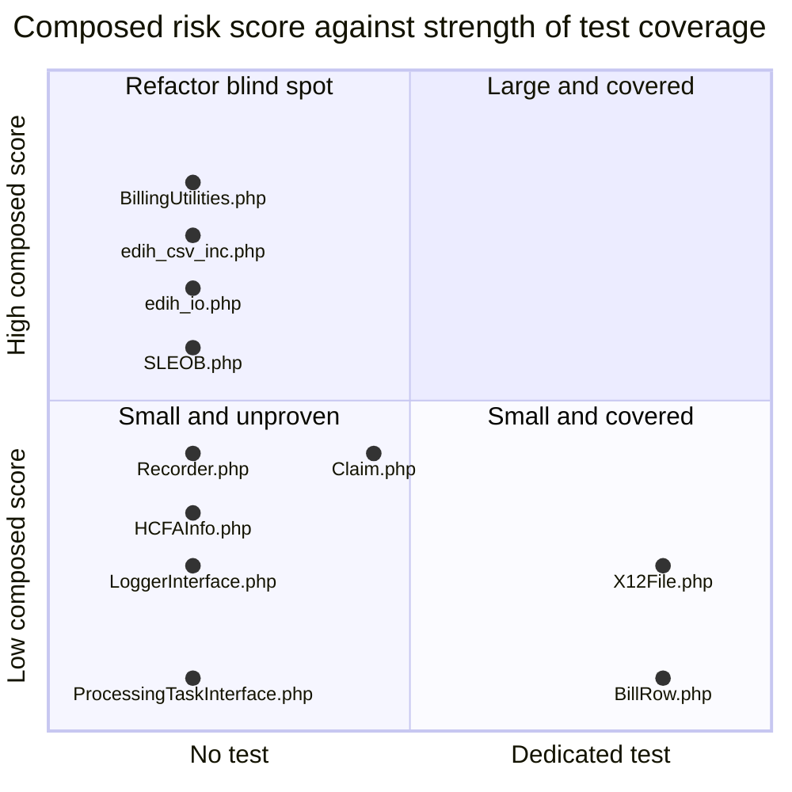

# OpenEMR Revenue Cycle and X12 EDI Upgrade Risk Map

One row per in-scope file answering a single question before you edit it: if I change this file, how likely am I to break something silently?

**Scope and sources.** This document classifies the refactor risk of all 67 files of OpenEMR's revenue-cycle and X12 EDI subsystem - X12 being the electronic data interchange (EDI) standard that United States healthcare payers, providers and clearinghouses use to exchange claims, eligibility questions and payments - and publishes the method that produced the classification so that the table can be regenerated rather than hand-maintained. It rests on four independently derived signals per file: a git-history classification that separates substantive change from mechanical sweeps, a test-coverage map built by matching test files to the classes they actually exercise, an inbound-coupling count taken across the whole repository, and executable size. The measured inputs were taken from `git log` over the 46 files of `src/Billing/`, the 17 of `library/edihistory/`, three reachable models in `library/classes/` and one class in `src/PaymentProcessing/`; from all 571 files of the test tree; from the two PHPUnit configurations and the workflows that invoke them; and from the static-analysis configuration. Conventions, the citation format, the VERIFIED and INFERRED notation and the source-of-truth ordering are defined once in [README.md](README.md) and are used here without variation. The generation each file belongs to, and the reason four generations of the same subsystem coexist at all, are established in [architecture.md](architecture.md) and are used here rather than restated: in short, the subsystem grew by accretion rather than replacement, so a legacy procedural tree, a namespaced but untyped tree, a strict-typed extraction target and a strict-typed payment namespace are all present and all reachable in one request.

**Provenance.** Every line anchor and every history figure below is relative to branch `master` at head commit `b7a7e690e419de3451740f995b768a8e8e5fba87`, on project version 8.3.0-dev (`version.php:L17-L20`). The full history is present at that commit - `git rev-list --count` returns 13,041 - which is what makes the substantive-change analysis executable rather than aspirational. No code was executed to produce this document and **no test suite was run**: PHP and Composer are not installed in the authoring environment, so every claim rests on static reading of file contents plus `git log`. Where this document says a file is covered by a test, it means that test exists on disk and exercises that class; it does not mean the test was run here, and nothing below should be read as a recorded test result.

## Table of Contents

- [Method](#method)
    - [The X12 terms this document uses](#the-x12-terms-this-document-uses)
    - [Why the raw commit history is not a usable age signal](#why-the-raw-commit-history-is-not-a-usable-age-signal)
    - [Signal 1 the mechanical versus substantive commit classifier](#signal-1-the-mechanical-versus-substantive-commit-classifier)
    - [Signal 2 the coverage column](#signal-2-the-coverage-column)
    - [Signal 3 inbound coupling measured across the whole repository](#signal-3-inbound-coupling-measured-across-the-whole-repository)
    - [Signal 4 executable size](#signal-4-executable-size)
    - [How the four signals compose into a classification](#how-the-four-signals-compose-into-a-classification)
    - [Static analysis cleanliness is a separate axis from behavioural safety](#static-analysis-cleanliness-is-a-separate-axis-from-behavioural-safety)
- [Master Risk Table](#master-risk-table)
- [The Test Surface Behind the Coverage Column](#the-test-surface-behind-the-coverage-column)
    - [The sixteen billing test files](#the-sixteen-billing-test-files)
    - [Two covering tests that live outside the billing directories](#two-covering-tests-that-live-outside-the-billing-directories)
    - [Which configuration each covering test runs under](#which-configuration-each-covering-test-runs-under)
    - [Three files that load under test without being tested](#three-files-that-load-under-test-without-being-tested)
    - [What carries the literal none](#what-carries-the-literal-none)
- [High Risk Justifications](#high-risk-justifications)
    - [src/Billing/BillingUtilities.php](#srcbillingbillingutilitiesphp)
    - [library/edihistory/codes/edih_271_code_class.php](#libraryedihistorycodesedih_271_code_classphp)
    - [library/edihistory/edih_csv_inc.php](#libraryedihistoryedih_csv_incphp)
    - [library/edihistory/edih_csv_parse.php](#libraryedihistoryedih_csv_parsephp)
    - [library/edihistory/edih_archive.php](#libraryedihistoryedih_archivephp)
    - [library/edihistory/edih_io.php](#libraryedihistoryedih_iophp)
    - [src/Billing/X125010837P.php](#srcbillingx125010837pphp)
    - [library/edihistory/edih_835_html.php](#libraryedihistoryedih_835_htmlphp)
    - [library/edihistory/edih_csv_data.php](#libraryedihistoryedih_csv_dataphp)
    - [library/edihistory/edih_278_html.php](#libraryedihistoryedih_278_htmlphp)
    - [library/edihistory/edih_271_html.php](#libraryedihistoryedih_271_htmlphp)
    - [library/edihistory/edih_uploads.php](#libraryedihistoryedih_uploadsphp)
    - [library/classes/X12Partner.class.php](#libraryclassesx12partnerclassphp)
    - [library/edihistory/edih_997_error.php](#libraryedihistoryedih_997_errorphp)
    - [src/Billing/BillingReport.php](#srcbillingbillingreportphp)
    - [src/Billing/SLEOB.php](#srcbillingsleobphp)
    - [src/Billing/Claim.php](#srcbillingclaimphp)
    - [src/Billing/BillingProcessor/X12RemoteTracker.php](#srcbillingbillingprocessorx12remotetrackerphp)
- [Aggregate Views](#aggregate-views)
    - [Risk by generation](#risk-by-generation)
    - [Size versus test coverage](#size-versus-test-coverage)
    - [Baselined static analysis findings by generation](#baselined-static-analysis-findings-by-generation)
- [How to Re-run This Analysis](#how-to-re-run-this-analysis)
- [Related Documents](#related-documents)
- [Documentation Attribution](#documentation-attribution)

## Method

The method comes before the results deliberately. A risk table for this subsystem is only trustworthy if a reader can see how each cell was derived, because the most obvious derivation - how long ago was this file last changed - produces an answer that is not merely imprecise here but actively wrong, and a reader who assumed the obvious derivation would draw the opposite conclusion from the right one.

### The X12 terms this document uses

The signals below reference transaction identifiers and envelope segments, so those are expanded here once. Every one is an X12 transaction set or segment identifier rather than an OpenEMR concept.

| Term | Expansion |
|------|-----------|
| 837 | The claim transaction set; the message that asks a payer to pay |
| 837P | The professional flavour of the 837, used for clinician claims |
| 837I | The institutional flavour of the 837, used for facility claims |
| 835 | Remittance advice; the payer's statement of what it paid and what it denied |
| 270 | Eligibility and benefit inquiry; asks whether a patient is covered |
| 271 | Eligibility and benefit response; the answer to a 270 |
| 276 | Claim status request; asks what happened to a claim already sent |
| 277 | Claim status response; the answer to a 276 |
| 278 | Services review, that is, a prior-authorisation request or response |
| 997 | Functional acknowledgement; reports whether a transmitted batch parsed |
| 999 | Implementation acknowledgement; the later replacement for the 997 |
| ISA | Interchange control header; the outermost envelope segment of a transmission |
| GS | Functional group header; groups transactions of one type inside an interchange |
| ST | Transaction set header; opens one individual transaction inside a group |
| MIA | Medicare inpatient adjudication information, a segment carried inside an 835 |
| PWK | Paperwork segment, which points at an attachment supporting a claim |
| BHT | Beginning of hierarchical transaction, the segment that opens an 837 |

### Why the raw commit history is not a usable age signal

VERIFIED: the four largest and most consequential files in this subsystem were all touched within the last four months of the recorded commit. The professional claim generator was last touched on 2026-04-08, the billing utility layer on 2026-04-08, the legacy comma-separated-value index layer on 2026-07-24 and the lifted X12 file class on 2026-07-23. Taken at face value those dates say every one of them is actively maintained, and they say the legacy file is the best maintained of the four, because its date is the most recent.

VERIFIED: that reading is wrong, and the same history shows why once commit subjects are inspected rather than only commit dates. `library/edihistory/edih_csv_parse.php` was last touched on 2026-07-23, and the last commit to it that changed what it does was `7a3ad84a3` of **2016-08-13**, nearly ten years earlier. `library/edihistory/codes/edih_997_codes.php` was last touched on 2026-04-29 and last substantively changed by `4854c13d0` of **2016-05-26**, which is the commit that first imported the subsystem. Five further legacy files - `library/edihistory/edih_271_html.php`, `library/edihistory/edih_278_html.php`, `library/edihistory/edih_archive.php`, `library/edihistory/edih_uploads.php` and `library/edihistory/edih_x12file_class.php` - all carry 2026 dates and all trace back to `86f08600c` of 2018-09-26 for their last behavioural change.

The gap between the two readings is produced by repository-wide mechanical sweeps, which touch every file in the tree and therefore reset every file's modification date at once. Separating those from real change is the first signal, and it is the signal the other three depend on.

### Signal 1 the mechanical versus substantive commit classifier

The classifier is stated here as a rule that a reader can apply to any commit, not as a list of the commits that happened to appear in this run.

**Stage one, the commit type.** VERIFIED: this repository enforces Conventional Commits. It requires `ramsey/conventional-commits` as a development dependency (`composer.json:L154`), exposes a validation script for it (`composer.json:L297`), and pins the permitted type vocabulary explicitly to `build`, `chore`, `ci`, `docs`, `feat`, `fix`, `perf`, `refactor`, `revert`, `style` and `test` (`composer.json:L265-L277`), with type case forced lower and scope case forced kebab (`composer.json:L262-L264`). Commit type is therefore a machine-readable field rather than a matter of interpretation. A commit whose type is `refactor`, `style`, `chore`, `ci`, `build`, `docs` or `test` is classified **mechanical**: by the definition of those types the author is asserting that behaviour did not change.

**Stage two, the commit breadth.** Stage one alone is insufficient, and the reason is the single most important thing to know about reading this repository's history. VERIFIED: the largest mechanical sweeps in this subsystem's history do not carry the `refactor` type at all. `83dd873b3 fix: use https in @link header tags (#10869)` touches **1,909 files**. `ebe6c2f59 fix(phpdoc): repair legacy parse errors across the codebase (#11904)` touches **1,196**. `e3bd356a7 feat(session): porting core and portal apps to HttpSessionFactory (#10244)` touches **781**. `b8e228c39 fix: correct typos in library files (#10339)` touches 81 and `917b195bc fix: correct typos in src/ files (#10343)` touches 72. A classifier that trusted the type field would record all five as substantive change and would report almost every file in this subsystem as behaviourally maintained in 2026.

So the second stage is a breadth test: **a commit that touches 50 or more files is mechanical regardless of its declared type.** The five commits just cited are all above it, at 72, 81, 781, 1,196 and 1,909 files, while the targeted behavioural changes to these same files sit well below it - `cbc9a9231` touches 30, `7f8b94865` 18, `0c0f2b68d` 12, `82e9f11a7` 11, `02475cb7e` 11, `43d1cf412` 9, `bfcb2eff1` 7, `f8a69b7e2` 5, `e392a30ba` 5, `4573bc83f` 4, `bcd189855` 3, `1c0d77361` 3, `5826c57e3` 2 and `f451a0933` 1.

The threshold is nevertheless a **chosen parameter and not a boundary the data forces**, and saying otherwise would be exactly the kind of unearned confidence this document is meant to avoid. VERIFIED: the breadth distribution across the 321 distinct commits that reach these 67 files is continuous through the range that matters, with commits at 44, 45 and 48 files immediately below the threshold and at 52, 53 and 57 immediately above it. There is no empty gap to hide a boundary in.

What justifies 50 is therefore not a gap but **measured insensitivity**, which is the stronger claim of the two because it can be checked. VERIFIED: recomputing the last-substantive-change column at every threshold from 45 to 57 inclusive produces an identical result for all 67 rows. Outside that band the column does start to move: at a threshold of 40, eleven rows change, because narrow-looking sweeps in the 40-to-49 range begin to be read as behavioural; at 75, six rows change in the opposite direction, as genuine multi-file fixes start being discarded as sweeps. The first row to move at all is `src/Billing/InsurancePolicyTypes.php`, at a threshold of 58, and even that movement is cosmetic: it relabels `8d6dc1cf7`, a 57-file commit, as substantive, and that commit is the one that created the file - which the row already reports as its added date. Any threshold in the low fifties yields the same document.

INFERRED (confidence: Medium): the continuity of the breadth distribution around 50 reflects a real editorial middle ground rather than a measurement artifact, since a change touching forty to sixty files in this repository can genuinely be either a bounded feature or a partial sweep. Basis: commits at both 44 and 57 files exist in these paths and read as different kinds of work from their subjects alone.

**Stage three, the remainder.** A commit that survives both stages and carries the type `fix`, `feat`, `perf` or `revert` is classified **substantive**. VERIFIED examples from the history of `src/Billing/X125010837P.php`, all narrow and all behavioural: `0d85baa83 fix: edi segment count for ordering provider (#7922)`, which touches exactly one file; `1de5ae614 fix: 837 professional HL count (#6472)`, five files; `8493cde76 fix: x12837 billing 5 or 9 digit zip check (#7760)`, three files; and `3c7dc04fa fix(claims): other payer claim control number for secondary claims (#11150)`, one file. For contrast, the mechanical sweeps that also touch that file are `be636987b refactor: replace $GLOBALS access with OEGlobalsBag across the codebase (#11017)` at 705 files, `c28f4a030 refactor(globals): use getBoolean() for boolean OEGlobalsBag settings (#11050)` at 181, `591b9eda2 refactor(php): Change null to strict string defined function call args` at 814, `ca96b43e0 refactor(php): convert if/else to ternary` at 249 and `545332a95 refactor(php): long array to short array` at 1,222.

**Stage four, commits that predate enforcement.** VERIFIED: 444 of the 983 file-commit pairs reaching these 67 files carry no conventional type at all, against 272 typed `refactor`, 160 `fix`, 69 `chore`, 28 `feat`, 6 `style`, 2 `bug`, 1 `test` and 1 the malformed `fixes`. Those 983 pairs are 321 distinct commits, counted once per in-scope file each one touches, which is why the figure equals the sum of the change-frequency column in the table below rather than a commit count. For an untyped commit that also passed the breadth test, the subject line is matched against a mechanical-intent keyword set - coding-standard and PSR moves, PHP version sweeps, namespace and autoload changes, escaping and sanitising passes, typo and comment passes, linter and static-analyser passes, formatting, short-array and ternary conversions, renames and relocations - and is classified mechanical on a match and substantive otherwise. This stage is the only judgemental part of the classifier, it applies to no commit newer than the enforcement of Conventional Commits, and its effect on the table is visible: it is what makes `library/edihistory/edih_csv_parse.php` report 2016 rather than 2019.

The **Last substantive change** column carries the date and short hash of the newest commit to that file that survives all four stages. Seven files carry `none ever` instead, with the date they were added: for each of them, every commit that has ever touched that path is mechanical by this classifier, which is a fact about the file rather than a gap in the data. Four of the seven are the `src/Billing/DaySheet/` classes and one is `src/Billing/EdiHistory/Claim277Renderer.php`, all five of which were created by extraction commits typed `refactor`, so the label is accurate rather than anomalous: those files have genuinely never had their behaviour deliberately changed since the day the code was moved into them.

### Signal 2 the coverage column

The coverage column names a test file or carries the literal `none`. It was built by matching test files to the classes they **actually exercise**, established by reading each test's imports and its constructor calls, and not by matching file names.

Matching by name would have produced false confidence in both directions, and both directions actually occur here. VERIFIED: matching by name would have credited coverage that does not exist, because the largest single file in the legacy tree is loaded by a test that asserts nothing about it - `tests/Tests/Isolated/Billing/EdiHistory/Claim277RendererTest.php:L37` requires `library/edihistory/codes/edih_271_code_class.php` by relative path five directory levels up, and `tests/Tests/Isolated/Billing/EdiHistory/Claim277RendererTest.php:L43` constructs it, but every assertion in that file is about `Claim277Renderer`. VERIFIED: matching by name or by directory would equally have missed coverage that does exist, because two in-scope files are covered by tests that live nowhere near the billing test directories and are named after something else entirely; both are identified in [Two covering tests that live outside the billing directories](#two-covering-tests-that-live-outside-the-billing-directories).

The search was therefore run across the entire test tree, all 571 PHP files under `tests/`, rather than across the two billing test directories. Where the column carries `none`, that is the result of a search that returned nothing for that file's fully-qualified class name, for a binding use of its short class name, for a call to any of its global functions and for a require of its path.

### Signal 3 inbound coupling measured across the whole repository

The coupling column counts the distinct repository files that reference the row's file. VERIFIED: measuring that only inside the documented subsystem would be close to meaningless, because the highest-consequence callers are outside it. Of the 31 files that reference `src/Billing/BillingUtilities.php`, 22 are outside the 67-file documented surface, and 17 of those are screens or a portal page: `interface/billing/sl_eob_process.php`, `interface/billing/ub04_dispose.php`, `interface/forms/fee_sheet/new.php`, `interface/forms/eye_mag/save.php`, eight files under `interface/patient_file/`, three under `interface/reports/`, and `portal/portal_payment.php`. A subsystem-only count would report 9 and would understate the blast radius of that file by more than three times.

The count is a binding-reference count rather than a text search for a bare name, because a bare-name search on this repository is unusable. VERIFIED: searching the repository for the short name `LoggerInterface` returns 133 files, almost all of them users of the unrelated PSR-3 logging interface of the same name, and searching for `Controller` returns 384. A file is counted as an inbound reference only when it contains the target's fully-qualified class name, or uses the target's short name in a binding position - `new`, a static call, `extends`, `implements`, `instanceof` or a `use` import - from within the same namespace or a parent or child of it, or calls one of the target's global functions, or requires the target by path. Under that rule the two collisions above resolve to 12 and 18, both of which are genuine.

The corpus excludes `.git`, `vendor`, `node_modules`, the static-analysis temporary directory, `docs/`, and the row's own file. It also excludes `.phpstan/baseline`, and that exclusion is not cosmetic: those 168 files are PHP arrays enumerating suppressed findings by path, so they contain a literal reference to almost every source file in the repository and will match any path-shaped search pattern. Leaving them in inflates a count without adding a single real caller - for `library/edihistory/edih_csv_inc.php` they alone contribute 20 spurious matches.

Two limits of this count are worth stating so it is not over-read, and the first cuts the opposite way from the direction a reader might assume. Because a reference must appear in a binding position, a file that names the symbol only in a comment is **not** counted, so the figure understates the work of renaming something: `src/Billing/BillingProcessor/BillingLogger.php` and `src/Billing/BillingProcessor/Traits/WritesToBillingLog.php` both describe `LoggerInterface` in prose comments without ever binding to it, and neither appears in its count of 12. And the count is static rather than a call graph, so it cannot see dynamic dispatch, and a class reached only through a variable class name would be undercounted.

### Signal 4 executable size

The size column is the file's line count, taken with `wc -l` at the recorded commit. Size is included because it is the crudest and most reliable proxy for how much behaviour a change has to avoid disturbing, and because in this subsystem it correlates inversely with coverage rather than positively.

Size is discounted to zero for a file whose only declaration is an interface, on the objective marker that it declares an `interface` and no `class`. VERIFIED: four files meet that marker - `src/Billing/BillingProcessor/GeneratorCanValidateInterface.php`, `src/Billing/BillingProcessor/GeneratorInterface.php`, `src/Billing/BillingProcessor/LoggerInterface.php` and `src/Billing/BillingProcessor/ProcessingTaskInterface.php`. They hold no statements, so there is no behaviour in them to break; what a change to them can break is compilation of the classes that implement them, which the coupling signal already measures. Their coverage contribution is discounted for the same reason: an interface has no behaviour for a test to assert.

One row is not PHP at all. `library/edihistory/codes/code_formatter.ods` is an OpenDocument spreadsheet, so it has no line count and contributes none of the 14,979 lines counted for `library/edihistory/`; it is carried as a row because the file is in scope and silence about it would be indistinguishable from having missed it.

### How the four signals compose into a classification

A risk classification is a judgement, not a measurement, so the judgement is published as arithmetic rather than asserted. Each signal contributes points, the points are summed, and the sum falls into a band. Nothing else feeds the classification, so any reader who disagrees with a row can recompute it from the row's own four measured cells.

| Signal | Points |
|--------|--------|
| Size 1000 lines or more | 3 |
| Size 300 to 999 lines | 2 |
| Size 100 to 299 lines | 1 |
| Size under 100 lines, or a declaration-only interface | 0 |
| Coverage cell is `none` | 3 |
| Coverage cell names a test, or the file is a declaration-only interface | 0 |
| Inbound coupling 20 or more | 3 |
| Inbound coupling 10 to 19 | 2 |
| Inbound coupling 4 to 9 | 1 |
| Inbound coupling 3 or fewer | 0 |
| Last substantive change 2019 or earlier | 2 |
| Last substantive change 2020 to 2024, or no substantive change ever | 1 |
| Last substantive change 2025 or later | 0 |
| Change frequency 25 commits or more | 1 |

| Band | Total | Reading |
|------|-------|---------|
| `safe` | 3 or below | Small, covered, or narrowly referenced. A change here is verifiable by the existing evidence |
| `caution` | 4 to 6 | One or two signals are adverse. A change here needs a specific verification argument |
| `high-risk` | 7 or above | Large, uncovered and widely referenced at once. A change here can alter behaviour with nothing in the repository able to detect it |

The volatility band deserves one word of explanation, because it points the opposite way from intuition. An old last-substantive-change date scores **more** risk, not less. A file whose behaviour has not been deliberately touched since 2016 is not thereby proven stable; it is a file where nobody currently working on the codebase has demonstrated that they understand it, and where the accumulated mechanical sweeps have rewritten its syntax without anybody re-verifying its output. High change frequency scores an additional point for the complementary reason: a file that has needed 25 or more commits is a file that has repeatedly been found wrong.

**Escalation rule E.** A file is escalated to `high-risk` regardless of its score when a specific silent-failure or silent-money defect has been traced in it, on the reasoning that a defect which produces no operator-visible signal removes the last line of defence that a low score was relying on. Escalation is never applied on a general impression; it is applied only with the citation that justifies it, and the four escalated rows each name theirs: `src/Billing/BillingProcessor/X12RemoteTracker.php:L112-L121`, `src/Billing/SLEOB.php:L41-L42`, `src/Billing/Claim.php:L289` and `library/edihistory/edih_835_html.php:L531`. Escalated rows are marked as such in the table so that the arithmetic and the override are never confused with each other. The underlying defects are registered, with their symptoms and their proposed verifications, in [defect-candidates.md](defect-candidates.md).

Applying the arithmetic and the escalation rule to the 67 rows yields **18 high-risk, 31 caution and 18 safe**.

### Static analysis cleanliness is a separate axis from behavioural safety

This is the distinction a naive risk map would get wrong, and it would get it wrong in both directions: it would read a clean static-analysis result as evidence that untested legacy code is safe, and it would read the absence of a static-analysis complaint about a covered modern class as adding nothing.

VERIFIED: the repository runs its static analyser at maximum strictness. `phpstan.neon.dist:L9` is `level: 10`, which is the highest level the analyser offers, and the analysed paths include the whole of the three trees this subsystem lives in - `interface` at `phpstan.neon.dist:L53`, `library` at `phpstan.neon.dist:L55` and `src` at `phpstan.neon.dist:L63`.

VERIFIED: **that strictness is applied on top of a large suppression baseline, and the baseline is where most of this subsystem's findings currently sit.** `phpstan.neon.dist:L2` includes `.phpstan/phpstan.github.neon`, whose `.phpstan/phpstan.github.neon:L3` loads `baseline/loader.php`, which in turn loads 168 per-rule baseline files from `.phpstan/baseline/`; the mechanism is the `shipmonk/phpstan-baseline-per-identifier` development dependency at `composer.json:L157`, with regeneration scripts at `composer.json:L302-L304`. Those 168 files hold 73,842 ignore entries suppressing 139,720 finding occurrences across 3,426 paths repository-wide. Of those, **3,024 entries suppressing 6,738 occurrences fall on 55 of the 67 files documented here**, and 988 entries suppressing 3,169 occurrences fall on `library/edihistory/` alone.

The consequence is the one to carry away, and it is stronger than the naive version of the same point rather than weaker. All 14,979 procedural lines of `library/edihistory/` pass the strict analysis gate in continuous integration while having zero test coverage - so a green analysis run is not evidence of behavioural safety there. But it is not even evidence of static cleanliness, because the analyser's findings on that tree were not fixed; they were recorded and excluded. `.phpstan/phpstan.github.neon:L5` sets `reportUnmatchedIgnoredErrors: true`, so the baseline is at least self-policing - an entry that stops matching fails the build - which means the baseline is an accurate census of open findings rather than a stale one. Treating either axis as a proxy for the other would misclassify the highest-risk files in this subsystem as safe, which is exactly why static analysis contributes no points to the composition rule above.

INFERRED (confidence: High): the 133 baseline entries suppressing 413 occurrences on `src/Billing/EdiHistory/X12File.php` - a strict-typed, fully covered, generation-3 class - are inherited from its legacy origin rather than newly introduced, because the file was created by lifting existing procedural code wholesale rather than by being written fresh. Basis: it is the only one of the eight strict-typed files in the subsystem that carries any baseline entries at all, and the other seven carry none.

## Master Risk Table

All 67 in-scope files appear below, sorted by risk band, then by composed score, then by size. Every cell is a measured value or, in the case of the risk band, an arithmetic consequence of the four measured values to its left as defined in [How the four signals compose into a classification](#how-the-four-signals-compose-into-a-classification). Line counts are `wc -l` at the recorded commit. Commit counts are all commits reaching that path, mechanical and substantive together, so the column measures churn rather than behavioural change; the behavioural-change date is the column beside it.

Coverage cells are paths relative to `tests/Tests/`, which is what makes each one's configuration determinable without a second lookup: a path beginning `Isolated/` runs only under `phpunit-isolated.xml`, a path beginning `Services/` runs under the `services` suite of `phpunit.xml`, and a path beginning `RestControllers/` runs under the `controllers` suite of the same file. The full mapping, and why the distinction matters, is in [Which configuration each covering test runs under](#which-configuration-each-covering-test-runs-under).

Files with nothing notable about them still carry a row, and the sections after the table say so in a line rather than omitting them, because an omitted file is indistinguishable from a file nobody looked at.
| File | Lines | Last substantive change | Commits | Covering tests | Inbound coupling | Risk |
|------|------:|-------------------------|--------:|----------------|-----------------:|------|
| `src/Billing/BillingUtilities.php` | 1996 | 2025-01-01 (`05203599a`) | 25 | `none` | 31 | **high-risk** (score 10) |
| `library/edihistory/codes/edih_271_code_class.php` | 2432 | 2016-08-13 (`7a3ad84a3`) | 17 | `none` | 8 | **high-risk** (score 9) |
| `library/edihistory/edih_csv_inc.php` | 1892 | 2026-07-24 (`4573bc83f`) | 45 | `none` | 14 | **high-risk** (score 9) |
| `library/edihistory/edih_csv_parse.php` | 1599 | 2016-08-13 (`7a3ad84a3`) | 23 | `none` | 4 | **high-risk** (score 9) |
| `library/edihistory/edih_archive.php` | 1305 | 2018-09-26 (`86f08600c`) | 18 | `none` | 2 | **high-risk** (score 8) |
| `library/edihistory/edih_io.php` | 753 | 2018-12-22 (`50698f87b`) | 27 | `none` | 1 | **high-risk** (score 8) |
| `src/Billing/X125010837P.php` | 1640 | 2026-04-08 (`3c7dc04fa`) | 41 | `none` | 3 | **high-risk** (score 7) |
| `library/edihistory/edih_835_html.php` | 1589 | 2026-07-23 (`bcd189855`) | 30 | `none` | 3 | **high-risk** (score 7, escalated) |
| `library/edihistory/edih_csv_data.php` | 949 | 2019-05-03 (`77a726d59`) | 24 | `none` | 2 | **high-risk** (score 7) |
| `library/edihistory/edih_278_html.php` | 916 | 2018-09-26 (`86f08600c`) | 16 | `none` | 2 | **high-risk** (score 7) |
| `library/edihistory/edih_271_html.php` | 628 | 2018-09-26 (`86f08600c`) | 15 | `none` | 2 | **high-risk** (score 7) |
| `library/edihistory/edih_uploads.php` | 576 | 2018-09-26 (`86f08600c`) | 22 | `none` | 2 | **high-risk** (score 7) |
| `library/classes/X12Partner.class.php` | 496 | 2026-04-17 (`0c0f2b68d`) | 27 | `none` | 4 | **high-risk** (score 7) |
| `library/edihistory/edih_997_error.php` | 335 | 2019-01-19 (`309583b8e`) | 22 | `none` | 2 | **high-risk** (score 7) |
| `src/Billing/BillingReport.php` | 308 | 2024-11-15 (`d92b33d11`) | 24 | `none` | 7 | **high-risk** (score 7) |
| `src/Billing/SLEOB.php` | 304 | 2026-02-09 (`4ca569023`) | 19 | `none` | 10 | **high-risk** (score 7, escalated) |
| `src/Billing/Claim.php` | 2287 | 2026-06-18 (`5826c57e3`) | 53 | `Isolated/Billing/ClaimCountMethodsTest.php` | 6 | **high-risk** (score 5, escalated) |
| `src/Billing/BillingProcessor/X12RemoteTracker.php` | 216 | 2025-08-23 (`fe597b9b8`) | 11 | `none` | 3 | **high-risk** (score 4, escalated) |
| `library/edihistory/edih_segments.php` | 1238 | 2025-09-28 (`7209da131`) | 24 | `none` | 2 | caution (score 6) |
| `src/Billing/EDI270.php` | 1162 | 2024-10-24 (`13d175253`) | 30 | `Isolated/Billing/EDI270Test.php` | 4 | caution (score 6) |
| `src/Billing/Hcfa1500.php` | 762 | 2023-05-25 (`82e9f11a7`) | 12 | `none` | 3 | caution (score 6) |
| `src/Billing/BillingProcessor/Tasks/GeneratorX12Direct.php` | 370 | 2023-10-04 (`02475cb7e`) | 22 | `none` | 1 | caution (score 6) |
| `library/edihistory/codes/edih_997_codes.php` | 175 | 2016-05-26 (`4854c13d0`) | 11 | `none` | 2 | caution (score 6) |
| `src/Billing/BillingProcessor/Traits/WritesToBillingLog.php` | 43 | 2021-01-29 (`e3fa29dc6`) | 2 | `none` | 10 | caution (score 6) |
| `library/edihistory/edih_x12file_class.php` | 21 | 2018-09-26 (`86f08600c`) | 28 | `none` | 1 | caution (score 6) |
| `library/classes/InsuranceCompany.class.php` | 416 | 2026-06-21 (`bfcb2eff1`) | 44 | `Services/InsuranceCompanyServiceTest.php` | 15 | caution (score 5) |
| `library/classes/Controller.class.php` | 316 | 2026-07-15 (`7f8b94865`) | 55 | `RestControllers/ControllerRoutingTest.php` | 18 | caution (score 5) |
| `library/edihistory/edih_277_html.php` | 307 | 2026-07-23 (`f451a0933`) | 19 | `none` | 3 | caution (score 5) |
| `library/edihistory/codes/edih_835_code_class.php` | 264 | 2022-04-02 (`564935ccd`) | 19 | `none` | 2 | caution (score 5) |
| `src/Billing/BillingProcessor/Tasks/GeneratorHCFA_PDF.php` | 234 | 2023-06-15 (`40636e7d9`) | 13 | `none` | 2 | caution (score 5) |
| `src/PaymentProcessing/Recorder.php` | 228 | 2026-02-03 (`da996a38f`) | 5 | `none` | 9 | caution (score 5) |
| `src/Billing/BillingProcessor/BillingProcessor.php` | 223 | 2024-04-30 (`14e7854b0`) | 16 | `none` | 2 | caution (score 5) |
| `src/Billing/BillingProcessor/Tasks/GeneratorX12.php` | 219 | 2023-10-04 (`02475cb7e`) | 18 | `none` | 1 | caution (score 5) |
| `src/Billing/BillingProcessor/Tasks/GeneratorUB04X12.php` | 160 | 2024-04-30 (`14e7854b0`) | 9 | `none` | 1 | caution (score 5) |
| `src/Billing/BillingProcessor/Tasks/AbstractGenerator.php` | 115 | 2026-02-06 (`5da24e5f4`) | 13 | `none` | 8 | caution (score 5) |
| `src/Billing/BillingProcessor/BillingClaim.php` | 239 | 2023-06-15 (`40636e7d9`) | 12 | `Isolated/Billing/BillingClaimTest.php` | 15 | caution (score 4) |
| `src/Billing/BillingProcessor/Tasks/GeneratorHCFA.php` | 179 | 2025-06-20 (`43d1cf412`) | 7 | `none` | 1 | caution (score 4) |
| `src/Billing/PaymentGateway.php` | 152 | 2025-06-20 (`43d1cf412`) | 13 | `none` | 2 | caution (score 4) |
| `src/Billing/BillingProcessor/Tasks/GeneratorUB04Form_PDF.php` | 88 | 2024-04-30 (`14e7854b0`) | 5 | `none` | 1 | caution (score 4) |
| `src/Billing/HCFAInfo.php` | 78 | none ever (added 2020-04-26) | 5 | `none` | 1 | caution (score 4) |
| `src/Billing/DaySheet/SlotTotals.php` | 69 | none ever (added 2026-04-27) | 1 | `none` | 2 | caution (score 4) |
| `src/Billing/BillingProcessor/Tasks/GeneratorHCFA_PDF_IMG.php` | 67 | 2022-08-10 (`692311fc0`) | 10 | `none` | 1 | caution (score 4) |
| `src/Billing/BillingProcessor/Tasks/GeneratorUB04NoForm.php` | 64 | 2024-04-30 (`14e7854b0`) | 5 | `none` | 1 | caution (score 4) |
| `src/Billing/BillingProcessor/Tasks/AbstractProcessingTask.php` | 59 | 2023-06-27 (`68c25b4f1`) | 5 | `none` | 3 | caution (score 4) |
| `src/Billing/InsurancePolicyTypes.php` | 54 | none ever (added 2024-02-02) | 3 | `none` | 3 | caution (score 4) |
| `src/Billing/BillingProcessor/Tasks/GeneratorExternal.php` | 50 | 2021-01-29 (`e3fa29dc6`) | 3 | `none` | 1 | caution (score 4) |
| `src/Billing/BillingProcessor/Tasks/TaskReopen.php` | 49 | 2023-06-27 (`68c25b4f1`) | 4 | `none` | 1 | caution (score 4) |
| `src/Billing/BillingProcessor/Tasks/TaskMarkAsClear.php` | 39 | 2021-04-23 (`f8790fbfa`) | 4 | `none` | 1 | caution (score 4) |
| `src/Billing/DaySheet/DaySheetTotals.php` | 29 | none ever (added 2026-04-27) | 1 | `none` | 2 | caution (score 4) |
| `src/Billing/EdiHistory/X12File.php` | 1566 | 2026-07-14 (`1c0d77361`) | 6 | `Isolated/Billing/EdiHistory/X12FileIsolatedTest.php` | 3 | safe (score 3) |
| `src/Billing/X125010837I.php` | 1225 | 2025-09-28 (`1a78ec8f1`) | 13 | `Isolated/Billing/X125010837IDateTest.php` | 2 | safe (score 3) |
| `src/Billing/ParseERA.php` | 561 | 2026-05-20 (`e392a30ba`) | 17 | `Isolated/Billing/ParseERATest.php` | 4 | safe (score 3) |
| `src/Billing/EdiHistory/Claim277Renderer.php` | 373 | none ever (added 2026-07-24) | 1 | `Isolated/Billing/EdiHistory/Claim277RendererTest.php` | 2 | safe (score 3) |
| `src/Billing/BillingProcessor/BillingClaimBatch.php` | 280 | 2024-04-30 (`14e7854b0`) | 12 | `Isolated/Billing/BillingClaimBatchTest.php` | 8 | safe (score 3) |
| `src/Billing/InvoiceSummary.php` | 255 | 2023-10-22 (`f8a69b7e2`) | 19 | `Services/Billing/InvoiceSummaryTest.php` | 7 | safe (score 3) |
| `src/Billing/BillingProcessor/LoggerInterface.php` | 26 | 2021-01-29 (`e3fa29dc6`) | 2 | `none` | 12 | safe (score 3) |
| `src/Billing/BillingProcessor/GeneratorInterface.php` | 25 | 2021-01-29 (`e3fa29dc6`) | 2 | `none` | 10 | safe (score 3) |
| `src/Billing/MiscBillingOptions.php` | 161 | 2025-10-17 (`f2aca57f9`) | 10 | `Services/Billing/MiscBillingOptionsTest.php` | 4 | safe (score 2) |
| `src/Billing/BillingProcessor/BillingClaimBatchControlNumber.php` | 31 | 2023-10-04 (`02475cb7e`) | 1 | `Services/Billing/BillingClaimBatchControlNumberTest.php` | 5 | safe (score 2) |
| `src/Billing/BillingProcessor/GeneratorCanValidateInterface.php` | 23 | 2021-01-29 (`e3fa29dc6`) | 2 | `none` | 7 | safe (score 2) |
| `src/Billing/BillingProcessor/BillingLogger.php` | 140 | 2026-05-06 (`cbc9a9231`) | 13 | `Isolated/Billing/BillingLoggerTest.php` | 3 | safe (score 1) |
| `src/Billing/DaySheet/BillRow.php` | 74 | none ever (added 2026-04-27) | 1 | `Isolated/Billing/DaySheet/BillRowTest.php` | 3 | safe (score 1) |
| `src/Billing/DaySheet/DaySheetAggregator.php` | 54 | none ever (added 2026-04-27) | 1 | `Isolated/Billing/DaySheet/DaySheetAggregatorTest.php` | 2 | safe (score 1) |
| `src/Billing/BillingProcessor/ProcessingTaskInterface.php` | 22 | 2021-01-29 (`e3fa29dc6`) | 2 | `none` | 3 | safe (score 1) |
| `library/edihistory/codes/code_formatter.ods` | n/a | 2016-05-26 (`4854c13d0`) | 1 | `none` | 0 | safe (score 0) |
| `src/Billing/EdiHistory/EdiFormat.php` | 83 | 2026-07-24 (`4573bc83f`) | 2 | `Isolated/Billing/EdiHistory/EdiFormatTest.php` | 3 | safe (score 0) |
| `src/Billing/EdiHistory/RemitAccounting.php` | 32 | 2026-07-23 (`bcd189855`) | 1 | `Isolated/Billing/EdiHistory/RemitAccountingTest.php` | 2 | safe (score 0) |

## The Test Surface Behind the Coverage Column

Coverage in this subsystem is real, and it is distributed almost exactly inversely to risk. The four smallest, newest, strict-typed classes are the only part of the subsystem with a safety net, and the largest and most consequential files have nothing at all. This section publishes the whole evidence base for the coverage column so that a reader can audit any cell in the table.

### The sixteen billing test files

VERIFIED: the billing test directories hold **16 files totalling 2,994 lines**. Thirteen are under `tests/Tests/Isolated/Billing/` and three under `tests/Tests/Services/Billing/`.

| Test file, relative to `tests/Tests/` | Lines | Class it exercises |
|---------------------------------------|------:|--------------------|
| `Isolated/Billing/EdiHistory/Claim277RendererTest.php` | 421 | `src/Billing/EdiHistory/Claim277Renderer.php` |
| `Isolated/Billing/EdiHistory/X12FileIsolatedTest.php` | 415 | `src/Billing/EdiHistory/X12File.php` |
| `Isolated/Billing/EDI270Test.php` | 274 | `src/Billing/EDI270.php` |
| `Isolated/Billing/ParseERATest.php` | 256 | `src/Billing/ParseERA.php` |
| `Isolated/Billing/BillingClaimBatchTest.php` | 243 | `src/Billing/BillingProcessor/BillingClaimBatch.php` |
| `Isolated/Billing/BillingClaimTest.php` | 229 | `src/Billing/BillingProcessor/BillingClaim.php` |
| `Isolated/Billing/BillingLoggerTest.php` | 225 | `src/Billing/BillingProcessor/BillingLogger.php` |
| `Services/Billing/MiscBillingOptionsTest.php` | 173 | `src/Billing/MiscBillingOptions.php` |
| `Isolated/Billing/EdiHistory/RemitAccountingTest.php` | 137 | `src/Billing/EdiHistory/RemitAccounting.php` |
| `Isolated/Billing/ClaimCountMethodsTest.php` | 128 | `src/Billing/Claim.php` |
| `Isolated/Billing/DaySheet/DaySheetAggregatorTest.php` | 122 | `src/Billing/DaySheet/DaySheetAggregator.php` |
| `Isolated/Billing/EdiHistory/EdiFormatTest.php` | 119 | `src/Billing/EdiHistory/EdiFormat.php` |
| `Services/Billing/BillingClaimBatchControlNumberTest.php` | 83 | `src/Billing/BillingProcessor/BillingClaimBatchControlNumber.php` |
| `Services/Billing/InvoiceSummaryTest.php` | 83 | `src/Billing/InvoiceSummary.php` |
| `Isolated/Billing/DaySheet/BillRowTest.php` | 46 | `src/Billing/DaySheet/BillRow.php` |
| `Isolated/Billing/X125010837IDateTest.php` | 40 | `src/Billing/X125010837I.php` |

Two readings of that table are worth making explicit because both are easy to get wrong.

The four generation-3 extraction targets are the only fully covered group: `Claim277Renderer`, `X12File`, `EdiFormat` and `RemitAccounting` each have a dedicated test, and the first two are the two largest test files in the set. That is a coverage distribution shaped by the extraction rather than by risk - the classes that were pulled out most recently are the ones that acquired tests, because a test was written as part of pulling them out.

**Only two of the four `DaySheet/` classes are covered.** `BillRow.php` has `Isolated/Billing/DaySheet/BillRowTest.php` and `DaySheetAggregator.php` has `Isolated/Billing/DaySheet/DaySheetAggregatorTest.php`; `DaySheetTotals.php` and `SlotTotals.php` have nothing, and both carry `none` in the master table. Describing the directory as covered would be wrong for half of it.

Two files are covered far more narrowly than a bare test name suggests, which is why the master table's coverage cell should always be read alongside the size cell. VERIFIED: `tests/Tests/Isolated/Billing/ClaimCountMethodsTest.php` reaches its subject through an anonymous subclass whose constructor is overridden to a no-op at `tests/Tests/Isolated/Billing/ClaimCountMethodsTest.php:L42-L46`, and the only methods it drives are `procCount()` and `payerCount()`, both of which read two array properties and nothing else. Two accessor methods of a 2,287-line class are covered; the claim data model itself is not, and the real constructor - the part that queries the database - is bypassed rather than exercised. The test's own docblock at `:L35-L39` says so. VERIFIED: `tests/Tests/Isolated/Billing/X125010837IDateTest.php` is 40 lines and covers date derivation only, in a 1,225-line institutional claim generator.

### Two covering tests that live outside the billing directories

VERIFIED: searching all 571 files of the test tree rather than the two billing directories finds two further in-scope files with genuine direct coverage, neither of which is named after its subject and neither of which lives anywhere near `tests/Tests/Isolated/Billing/`.

`library/classes/InsuranceCompany.class.php` is covered by `tests/Tests/Services/InsuranceCompanyServiceTest.php`, 483 lines. It constructs the legacy class directly at `tests/Tests/Services/InsuranceCompanyServiceTest.php:L405` and `:L430`, calls `persist()` on it at `:L409`, `:L434`, `:L447` and `:L459`, and names the relevant cases explicitly as legacy-persistence tests at `:L396` and `:L422`.

`library/classes/Controller.class.php` is covered by `tests/Tests/RestControllers/ControllerRoutingTest.php`, 235 lines. It builds partial mocks of the legacy class at `tests/Tests/RestControllers/ControllerRoutingTest.php:L52`, `:L100`, `:L137` and `:L170`, and reflects directly on its `methodExists` method at `:L207`.

**The covered census is therefore 18 of 67 files, not 16, and 49 carry the literal `none`.** The two additions are the concrete payoff of matching by class exercised rather than by file name, and they are the reason [Signal 2 the coverage column](#signal-2-the-coverage-column) insists on that method: a directory-scoped or name-scoped search would have reported both files as untested and would have overstated this subsystem's uncovered surface by two of its more heavily referenced models.

One near miss belongs here so it is not mistaken for coverage. VERIFIED: `library/classes/X12Partner.class.php` carries `none`. The test tree mentions the trading-partner concept only through the method name `extractUniqueX12Partners`, which belongs to a different class; nothing in `tests/` constructs `X12Partner` or calls its methods.

### Which configuration each covering test runs under

This is the subtlety most likely to mislead a reader who checks coverage the obvious way, by opening the project's PHPUnit configuration and looking for the billing suite.

VERIFIED: **13 of the 16 billing test files run only under a secondary configuration.** The primary configuration's suite list runs from `phpunit.xml:L43` to `phpunit.xml:L93`, with its first entry `<testsuite name="ECQM">` at `phpunit.xml:L44`, and it contains no reference to the isolated directory at all - the only mention of the word in that file is a comment at `phpunit.xml:L5`. The isolated tests are declared instead in `phpunit-isolated.xml`, whose `isolated` suite at `phpunit-isolated.xml:L65-L67` points at `tests/Tests/Isolated`, and they are executed by a dedicated workflow: `.github/workflows/isolated-tests.yml:L50` is `vendor/bin/phpunit -c phpunit-isolated.xml \`, under the workflow named at `.github/workflows/isolated-tests.yml:L7`. The same configuration is also invoked at `.github/workflows/windows-tests.yml:L105`, and locally through the `phpunit-isolated` script at `composer.json:L310`. A reader who checked only `phpunit.xml` would conclude that `ParseERA`, `EDI270`, `BillingClaim`, `BillingClaimBatch`, `BillingLogger`, `Claim`, `X125010837I`, both covered `DaySheet/` classes and all four generation-3 classes are untested. All 13 are tested; they are tested somewhere else.

The remaining five covering tests run under the primary configuration, in two different suites.

| Covering test | Configuration | Suite | Continuous integration entry point |
|---------------|---------------|-------|------------------------------------|
| The 13 files under `Isolated/Billing/` | `phpunit-isolated.xml` | `isolated`, at `phpunit-isolated.xml:L65-L67` | `.github/workflows/isolated-tests.yml:L50` |
| `Services/Billing/BillingClaimBatchControlNumberTest.php` | `phpunit.xml` | `services`, at `phpunit.xml:L67-L69` | `.github/actions/test-actions-core/action.yml:L127-L130` |
| `Services/Billing/InvoiceSummaryTest.php` | `phpunit.xml` | `services`, at `phpunit.xml:L67-L69` | `.github/actions/test-actions-core/action.yml:L127-L130` |
| `Services/Billing/MiscBillingOptionsTest.php` | `phpunit.xml` | `services`, at `phpunit.xml:L67-L69` | `.github/actions/test-actions-core/action.yml:L127-L130` |
| `Services/InsuranceCompanyServiceTest.php` | `phpunit.xml` | `services`, at `phpunit.xml:L67-L69` | `.github/actions/test-actions-core/action.yml:L127-L130` |
| `RestControllers/ControllerRoutingTest.php` | `phpunit.xml` | `controllers`, at `phpunit.xml:L73-L75` | `.github/workflows/integration-tests.yml:L100` |

VERIFIED: the `services` suite carries one further wrinkle. It is absent from the suite list at `.github/workflows/integration-tests.yml:L100`, which runs `common`, `controllers`, `fixtures`, `validators` and `unit`, so the four `services` tests above are not reached by that workflow. They are reached instead by the containerised action at `.github/actions/test-actions-core/action.yml:L127-L130`, which is consumed by `.github/workflows/docker-test-core.yml:L99` and `:L122`. VERIFIED: the front-controller workflow reaches none of these, because `.github/workflows/test-frontcontroller.yml:L85` runs only the `api` suite from the matrix at `:L28-L29`.

The practical consequence for anyone planning a refactor: **name the configuration when you claim a change is covered.** Running `phpunit.xml` alone exercises 5 of the 18 covered files. Running `phpunit-isolated.xml` alone exercises 13. Neither alone exercises the set.

### Three files that load under test without being tested

These three cases are the reason the coverage column is a judgement about what is asserted rather than a report of what is loaded. All three carry `none`.

VERIFIED: `library/edihistory/codes/edih_271_code_class.php` is loaded and constructed by a test but nothing asserts anything about it. `tests/Tests/Isolated/Billing/EdiHistory/Claim277RendererTest.php:L35` opens `public static function setUpBeforeClass(): void` and `:L37` is `require_once __DIR__ . '/../../../../../library/edihistory/codes/edih_271_code_class.php';` - five directory levels up, by relative filesystem path, into the legacy procedural tree. `:L43` then constructs the legacy class. It is loaded because the modern class under test cannot be loaded without it, and every assertion in the file is about `Claim277Renderer`. That single `require_once` is simultaneously a coverage fact and a design finding: **a strict-typed generation-3 class is not independently loadable**, which is exactly the condition that the first item of [extraction-roadmap.md](extraction-roadmap.md) exists to remove, and the citation above is the concrete symptom that item can be verified against.

VERIFIED: the same pattern appears in a second form in `tests/Tests/Isolated/Billing/EdiHistory/X12FileIsolatedTest.php`. Rather than requiring a legacy file, it declares a local substitute for a legacy global helper that the class under test calls: the substitute is `tests/Tests/Isolated/Billing/EdiHistory/X12FileIsolatedTest.php:L33-L38`, guarded by `if (!function_exists('text'))`, and bracketed by coverage-exclusion markers at `:L32` and `:L39`. The class is testable only because the test supplies a piece of the legacy environment itself, which is the same finding as the `require_once` above in a different disguise.

VERIFIED: two further tests mention legacy function names in comments only and load no legacy file - `tests/Tests/Isolated/Billing/EdiHistory/EdiFormatTest.php:L48` and `tests/Tests/Isolated/Billing/EdiHistory/RemitAccountingTest.php:L36`. A text search for legacy symbol names across the test tree finds these, which is precisely why the coverage method requires a binding reference rather than a textual one.

### What carries the literal none

Each of the following was established by a search that returned nothing, not by an assumption that legacy code is untested.

- The professional claim generator `src/Billing/X125010837P.php`, 1,640 lines, which builds every 837P this system sends.
- The billing utility layer `src/Billing/BillingUtilities.php`, 1,996 lines, which performs the claim write path.
- The accounts-receivable poster `src/Billing/SLEOB.php`, 304 lines.
- The transport tracker `src/Billing/BillingProcessor/X12RemoteTracker.php`, 216 lines.
- The batch processor itself, `src/Billing/BillingProcessor/BillingProcessor.php`, and the trait `src/Billing/BillingProcessor/Traits/WritesToBillingLog.php`.
- **All eleven concrete task classes** under `src/Billing/BillingProcessor/Tasks/`, together with both abstract bases in that directory. This includes both non-direct generators, `GeneratorX12.php` and `GeneratorUB04X12.php`, and the direct generator `GeneratorX12Direct.php`.
- The paper-claim and gateway files `src/Billing/Hcfa1500.php`, `src/Billing/HCFAInfo.php`, `src/Billing/PaymentGateway.php`, `src/Billing/BillingReport.php` and `src/Billing/InsurancePolicyTypes.php`.
- `src/Billing/DaySheet/DaySheetTotals.php` and `src/Billing/DaySheet/SlotTotals.php`, the two uncovered members of an otherwise covered directory.
- The trading-partner model `library/classes/X12Partner.class.php`.
- The accounts-receivable contract `src/PaymentProcessing/Recorder.php`, which is the destination named by the deprecation notice at `src/Billing/SLEOB.php:L221`. The target of the in-progress extraction is itself untested, which the roadmap has to plan around rather than assume away.
- The four declaration-only interfaces in `src/Billing/BillingProcessor/`. They have no behaviour to assert, which is why the composition rule discounts their coverage rather than penalising it.
- **All 14,979 PHP lines of `library/edihistory/`**, across all 16 of its PHP files, plus the non-PHP `library/edihistory/codes/code_formatter.ods`.

VERIFIED for scale, and stated because the risk table's coupling column depends on it: `interface/billing/` contains exactly 31 top-level PHP files, and none of them is covered by any test either. They are outside the 67-file documented surface, so they have no row here, but they are the largest single group of inbound callers counted in the coupling column.

## High Risk Justifications

One subsection per high-risk row, in table order. Each names the specific lines that make a change to that file hazardous, so that the classification can be argued with on the evidence rather than accepted on authority. Where a subsection rests on a suspected defect, that defect is registered with its symptom and its proposed verification in [defect-candidates.md](defect-candidates.md); this document does not restate the defect, it uses it as risk evidence.

### src/Billing/BillingUtilities.php

1,996 lines, coverage `none`, inbound coupling 31, 25 commits, last substantive change 2025-01-01 (`05203599a`). The highest composed score in the subsystem, at 10 of a possible 12.

This file is the claim write path, and every hazard in it is a hazard to a database row that money is later computed from. VERIFIED: it inserts the charge row into the `billing` queue at `src/Billing/BillingUtilities.php:L1467`. VERIFIED: it allocates the claim version by reading the current maximum and adding one, at `src/Billing/BillingUtilities.php:L1679`, then writes two `claims` rows at `src/Billing/BillingUtilities.php:L1688` and `src/Billing/BillingUtilities.php:L1698`, then advances the encounter's billed-level watermark at `src/Billing/BillingUtilities.php:L1722` behind a guard at `:L1720-L1721`. VERIFIED: the first of those two `claims` writes assembles part of its own statement text at runtime, a `SET` fragment built in code before the statement is issued, and the comment immediately above it at `src/Billing/BillingUtilities.php:L1686` says as much. A statement whose column list is assembled at runtime cannot be checked statically for which columns it actually writes, so a refactor of this region cannot be verified by reading it.

VERIFIED: this region is at least wrapped in a transaction - `src/Billing/BillingUtilities.php:L1677` opens a `QueryUtils::inTransaction` closure around the version allocation and the two inserts - which means an interrupted write does not leave a half-written claim. That is a mitigation of one failure mode and not of the one that matters here: a transaction guarantees the writes happen together, not that they write the right values.

The coupling figure is what turns a large uncovered file into a high-risk one. VERIFIED: of the 31 files that reference it, 22 are outside the 67-file documented surface, and 17 of those are user-facing entry points - `interface/billing/sl_eob_process.php`, `interface/billing/ub04_dispose.php`, `interface/forms/fee_sheet/new.php`, `interface/forms/eye_mag/save.php`, eight files under `interface/patient_file/`, three under `interface/reports/`, and `portal/portal_payment.php`. A behavioural change here surfaces on seventeen screens that no test touches.

### library/edihistory/codes/edih_271_code_class.php

2,432 lines, coverage `none`, inbound coupling 8, 17 commits, last substantive change 2016-08-13 (`7a3ad84a3`). The largest single file in the subsystem.

VERIFIED: almost the entire file is one data structure. `library/edihistory/codes/edih_271_code_class.php:L26` declares the class, `:L30` declares the private array that holds the code tables, and `:L37` is a constructor that populates roughly 2,350 lines of literal code-list entries. Only two accessor methods follow, at `:L2390` and `:L2428`. The risk is therefore not algorithmic complexity but silent data loss: a refactor that drops or mistypes one entry produces no error anywhere, and the effect is a code that renders as unknown on an eligibility or claim-status screen instead of as its meaning.

VERIFIED: it is also the inbound edge of the cross-generation dependency cycle described in [architecture.md](architecture.md). Three of its eight referencing files span all three of the generations that handle X12: `src/Billing/EDI270.php` requires it directly, `src/Billing/EdiHistory/Claim277Renderer.php` type-hints against it, and `library/edihistory/edih_277_html.php` uses it from the legacy side. A change to its public shape has to be landed in three generations at once, and nothing in `tests/` will report a mistake.

The date column is the strongest single illustration of why the classifier in this document exists. This file's last mechanical touch is 2026-01-24; its last behavioural change is 2016-08-13, nine and a half years earlier.

### library/edihistory/edih_csv_inc.php

1,892 lines, coverage `none`, inbound coupling 14, **45 commits - the highest churn of any file in the legacy tree**, last substantive change 2026-07-24 (`4573bc83f`).

VERIFIED: this file owns the storage-path contract that the whole EDI History subsystem depends on. `library/edihistory/edih_csv_inc.php:L332` tests for the site directory global and `:L335` returns the composed history path; when the global is absent, `:L337-L338` logs and returns false rather than raising. Every file the subsystem writes, indexes, archives or reads back is located relative to the value returned at `:L335`, so a change to that single expression relocates the entire on-disk estate, and the failure mode when it returns false is a logged message rather than an exception.

Its risk is compounded by being simultaneously the most-changed legacy file and one of the most-referenced: 14 files reference it, including the operator-facing entry point `interface/billing/edih_main.php`. A file that has needed 45 commits is a file whose behaviour has repeatedly been found wrong, and there is no test to catch the forty-sixth.

### library/edihistory/edih_csv_parse.php

1,599 lines, coverage `none`, inbound coupling 4, 23 commits, last substantive change 2016-08-13 (`7a3ad84a3`).

VERIFIED: 1,599 lines are divided among only 9 functions, which begin at `library/edihistory/edih_csv_parse.php:L43`, `:L83`, `:L245` and `:L412`. Functions of that size cannot be changed in a locally reasoned way: a variable set near the top of one of them is still live hundreds of lines later, which is the structural precondition for state leaking between iterations of a loop.

VERIFIED: this is the misleading-date exemplar named in [Why the raw commit history is not a usable age signal](#why-the-raw-commit-history-is-not-a-usable-age-signal). Its last commit is dated 2026-07-23 and its last behavioural change is dated 2016-08-13. Anyone triaging this subsystem by modification date would place it among the best-maintained files in the tree; it is among the least.

### library/edihistory/edih_archive.php

1,305 lines, coverage `none`, inbound coupling 2, 18 commits, last substantive change 2018-09-26 (`86f08600c`).

VERIFIED: 1,305 lines across 13 functions, beginning at `library/edihistory/edih_archive.php:L36`, `:L170`, `:L226` and `:L267`. This is the only archival routine anywhere in the subsystem, so it is the only code that moves or removes the files that every other component reads. The low coupling count understates its consequence rather than mitigating it: a file that deletes and relocates other components' inputs is dangerous in proportion to what it touches on disk, not in proportion to how many callers it has, and the coupling signal cannot see that.

INFERRED (confidence: Medium): a mistake in this file would be discovered late rather than immediately, because archival acts on ageing artifacts rather than on the ones currently being processed. Basis: its inputs are selected by age, so a wrongly archived or wrongly retained file is not read again until an operator goes looking for history.

### library/edihistory/edih_io.php

753 lines, coverage `none`, inbound coupling 1, 27 commits, last substantive change 2018-12-22 (`50698f87b`).

VERIFIED: 753 lines across 15 functions, beginning at `library/edihistory/edih_io.php:L20`, `:L39`, `:L50` and `:L77`.

VERIFIED: **this file contains the only database statement in all 14,979 PHP lines of `library/edihistory/`.** A search for query calls across the whole legacy tree returns exactly one hit, at `library/edihistory/edih_io.php:L737`, which reads the deposit reference and two monetary totals from the accounts-receivable session header. That single statement is correctly parameterised. What follows it is not comparably careful: `library/edihistory/edih_io.php:L739` interpolates the values it just read straight into HTML output without escaping, and `library/edihistory/edih_io.php:L740` decides whether a check has already been posted by comparing a `decimal` column against the strings `'0'` and `'0.00'` with a type-strict comparison, so the decision depends on the textual form the driver happens to return rather than on the numeric value.

That one statement is why the file is high-risk out of proportion to its coupling count of 1: it is the sole seam between a filesystem subsystem and the accounts-receivable ledger, and both the escaping and the comparison on the two lines after it are registered in [defect-candidates.md](defect-candidates.md).

### src/Billing/X125010837P.php

1,640 lines, coverage `none`, inbound coupling 3, **41 commits**, last substantive change 2026-04-08 (`3c7dc04fa`). This file generates every 837P professional claim the system transmits.

Its classification does not rest on the observation that it is large and uncovered. It rests on **demonstrated recurrence**: this file has already been found wrong, in precisely the class of defect that a refactor of a claim generator is most likely to reintroduce, and it has been found wrong more than once.

VERIFIED: `0d85baa83 fix: edi segment count for ordering provider (#7922)`, a single-file commit, fixed the segment count emitted for an ordering provider. An 837 declares how many segments it contains in its trailer, and a wrong count is rejected by the receiving clearinghouse rather than silently absorbed, so this is a defect class that stops claims. VERIFIED: `1de5ae614 fix: 837 professional HL count (#6472)`, a five-file commit, fixed the hierarchical-level count in the same file - the same class of counting defect, at a different level of the transaction. VERIFIED: two further narrow behavioural fixes land in the same file, `8493cde76 fix: x12837 billing 5 or 9 digit zip check (#7760)` at three files and `3c7dc04fa fix(claims): other payer claim control number for secondary claims (#11150)` at one. Four narrow behavioural corrections, two of them to counters, in a file with no test.

VERIFIED: two specific regions make a change here hazardous. `src/Billing/X125010837P.php:L111` emits a hardcoded literal as the reference identification of the transaction's opening `BHT` segment - the value is written inline rather than derived - and the identical literal appears in the institutional generator at `src/Billing/X125010837I.php:L86`, so the two generators duplicate the constant rather than sharing it. And `src/Billing/X125010837P.php:L785-L793` emits a `PWK` paperwork segment, which tells the payer that an attachment supports this claim, on a branch whose condition tests whether the claim is employment-related; the region immediately above it, `:L778-L784`, is a standing note about the attachment handling that segment implies. A claim can therefore assert an attachment exists, and nothing in this file establishes that one was transmitted.

### library/edihistory/edih_835_html.php

1,589 lines, coverage `none`, inbound coupling 3, 30 commits, last substantive change 2026-07-23 (`bcd189855`). Composed score 7, and **escalated** under rule E.

VERIFIED: this legacy renderer recognises a segment that the modern remittance parser refuses. `library/edihistory/edih_835_html.php:L531` matches the `MIA` segment - Medicare inpatient adjudication information - and renders it. The modern parser reaches the opposite conclusion for the same input: `src/Billing/ParseERA.php:L467-L468` returns an unknown-segment error for any segment identifier outside its whitelist, after the mismatch test at `src/Billing/ParseERA.php:L464-L465`.

The escalation follows from the operator-visible consequence rather than from the file's size. An 835 remittance carrying that segment displays correctly in the EDI History browser and cannot be posted to accounts receivable, and the two facts are produced by two different components, so an operator sees a remittance that is evidently readable and evidently will not post. A generation-1 file is more capable than its generation-2 replacement in this one respect, which inverts the assumption a refactor would naturally make - that deleting the older renderer loses nothing. It loses this. The capability gap is registered as a rule in [business-rules.md](business-rules.md) and as a defect in [defect-candidates.md](defect-candidates.md).

### library/edihistory/edih_csv_data.php

949 lines, coverage `none`, inbound coupling 2, 24 commits, last substantive change 2019-05-03 (`77a726d59`).

VERIFIED: 949 lines across only 4 functions, at `library/edihistory/edih_csv_data.php:L47`, `:L213`, `:L291` and `:L464`. An average of 237 lines per function is the structural risk here: there is no unit of this file small enough to reason about in isolation, and no test to substitute for that reasoning. It sits in the comma-separated-value index layer alongside `edih_csv_inc.php` and `edih_csv_parse.php`, so the three of them share responsibility for the filesystem index that the operator interface reads, and all three carry `none`.

### library/edihistory/edih_278_html.php

916 lines, coverage `none`, inbound coupling 2, 16 commits, last substantive change 2018-09-26 (`86f08600c`).

VERIFIED: 916 lines in **two functions**, at `library/edihistory/edih_278_html.php:L39` and `:L855`. The first is over eight hundred lines long. That is the highest lines-per-function ratio in the subsystem, and it is the reason this file scores as it does despite modest coupling.

VERIFIED: it is also the only place in the repository that understands a 278 services-review transaction at all. The 278 is handled asymmetrically - parsed and displayed, never generated - as established in [transactions.md](transactions.md). There is consequently no second implementation to compare against and no round-trip to check a change with: whatever this file does with a 278 is the definition of what the system does with a 278.

### library/edihistory/edih_271_html.php

628 lines, coverage `none`, inbound coupling 2, 15 commits, last substantive change 2018-09-26 (`86f08600c`).

VERIFIED: 628 lines in two functions, at `library/edihistory/edih_271_html.php:L43` and `:L568`. VERIFIED: this renderer serves two transaction types rather than one, because the 270 eligibility inquiry has no renderer of its own and shares this one, as recorded in [transactions.md](transactions.md). A change made while thinking about eligibility responses therefore also changes how eligibility requests are displayed, and the file's name gives no hint of the second responsibility.

### library/edihistory/edih_uploads.php

576 lines, coverage `none`, inbound coupling 2, 22 commits, last substantive change 2018-09-26 (`86f08600c`).

VERIFIED: 576 lines across 6 functions, at `library/edihistory/edih_uploads.php:L22`, `:L56`, `:L88` and `:L178`. This is the subsystem's ingestion boundary: everything a payer or clearinghouse sends arrives through here before any parser sees it. Its risk is that it handles input that the system does not control, on a path with no test, in a file whose behaviour was last deliberately changed in 2018. Observations about its handling of untrusted input are flagged, without deep analysis, in the security appendix of [defect-candidates.md](defect-candidates.md).

### library/classes/X12Partner.class.php

496 lines, coverage `none`, inbound coupling 4, 27 commits, last substantive change 2026-04-17 (`0c0f2b68d`).

VERIFIED: `library/classes/X12Partner.class.php:L17` declares the class as an extension of the legacy data-object base, and `:L24-L40` documents the meaning of individual `ISA` interchange-header and `GS` functional-group-header element positions as inline comments on the properties that carry them. That is the only place in the repository where those element positions are explained, and per the source-of-truth ordering in [README.md](README.md) those comments are evidence of intent rather than of behaviour - so a refactor has to re-derive from the generators what the comments assert.

VERIFIED: `library/classes/X12Partner.class.php:L69-L70` hardcodes the interchange identification qualifiers rather than deriving them from configuration, so a partner requiring different qualifiers cannot be configured without editing this file. VERIFIED: 496 lines hold 74 methods, which is a very high method count for the size and indicates an accessor-per-column shape rather than behaviour.

Two facts make it more hazardous than its coupling count of 4 suggests. It is one of three parallel trading-partner loading implementations in the subsystem, as [architecture.md](architecture.md) records, so a change here fixes or breaks only one third of partner loading. And its coverage cell is a genuine `none` rather than an unexamined one: the test tree mentions the trading-partner concept only through a method name belonging to another class.

### library/edihistory/edih_997_error.php

335 lines, coverage `none`, inbound coupling 2, 22 commits, last substantive change 2019-01-19 (`309583b8e`).

VERIFIED: 335 lines across 3 functions, at `library/edihistory/edih_997_error.php:L41`, `:L203` and `:L320`. This file extracts rejections from the 997 functional acknowledgement and 999 implementation acknowledgement - the transactions in which a clearinghouse reports that a transmitted batch of claims did or did not parse. It is the only code that answers "was the batch accepted", so a change that causes it to miss a rejection converts a rejected batch into one that appears to have been accepted. The consequence is a claim that will never be paid and never be chased, and there is no test asserting the extraction.

### src/Billing/BillingReport.php

308 lines, coverage `none`, inbound coupling 7, 24 commits, last substantive change 2024-11-15 (`d92b33d11`).

VERIFIED: this file mutates the charge queue's state in bulk. `src/Billing/BillingReport.php:L225-L239` is a routine that builds a placeholder list with `str_repeat` at `:L236` and then, at `:L237`, issues an update that sets `billed = 1` on every `billing` row whose identifier appears in a caller-supplied list. The statement is correctly parameterised, and this document makes no injection claim about it. The risk is the semantics rather than the construction: a single call flips the billed state of an arbitrary set of charge rows, and the billed flag is what determines whether a charge is ever queued for a claim again. A charge wrongly marked billed simply stops being billable, silently.

VERIFIED: the file carries other write and read points at `src/Billing/BillingReport.php:L24`, `:L149`, `:L182`, `:L188`, `:L218` and `:L242`. Seven files reference it, and none of them is a test.

### src/Billing/SLEOB.php

304 lines, coverage `none`, inbound coupling 10, 19 commits, last substantive change 2026-02-09 (`4ca569023`). Composed score 7, and **escalated** under rule E.

This is the accounts-receivable poster, so every line in it is one line from a patient- or payer-facing dollar amount, and three regions each independently justify the classification.

VERIFIED: `src/Billing/SLEOB.php:L41-L42` builds a query in which the patient identifier is interpolated into the statement text while the value beside it is bound as a parameter. The inconsistency within a single statement is the finding; the security dimension of it is flagged, not analysed, in the appendix of [defect-candidates.md](defect-candidates.md), and it is the escalation trigger for this row because the data reaching it comes from a remittance file the payer supplies.

VERIFIED: `src/Billing/SLEOB.php:L98-L104` is a dry-run branch that falls off the end of its function, so the debug path returns nothing rather than returning what the real path returns. A caller that treats the dry run as a preview of the real behaviour is comparing a value against nothing. The session insert it bypasses is at `src/Billing/SLEOB.php:L95-L97`.

VERIFIED: `src/Billing/SLEOB.php:L285-L288` decides which payer to advance a claim to by converting the encounter's billed-level watermark to a number and then testing it with a mixed `&&` and `||` condition that is not parenthesised, so the grouping is determined by operator precedence rather than stated. This is the tertiary-payer boundary, and it is silent by design: nothing is displayed when the advance does not happen.

VERIFIED: `src/Billing/SLEOB.php:L221` marks part of this file deprecated in favour of `src/PaymentProcessing/Recorder.php`. A file that is both deprecated and uncovered is the worst combination for a refactor, because the deprecation invites change while the absent coverage removes the means of validating it - and, as the coverage census records, the replacement is untested too.

### src/Billing/Claim.php

2,287 lines, coverage `tests/Tests/Isolated/Billing/ClaimCountMethodsTest.php`, inbound coupling 6, **53 commits - the highest of any file in `src/Billing/`**, last substantive change 2026-06-18 (`5826c57e3`). Composed score 5, and **escalated** under rule E.

This is the only high-risk row whose coverage cell names a test, and the reason it is still high-risk is the gap between what the cell says and what the test does. VERIFIED: the covering test drives two accessor methods through an anonymous subclass whose constructor is overridden to a no-op at `tests/Tests/Isolated/Billing/ClaimCountMethodsTest.php:L42-L46`. The real constructor, which is where this class assembles the claim from the database, is never executed by any test. A coverage cell reading as covered, over a 2,287-line class of which two accessors are exercised, is the single most misleading cell in the master table, and it is called out here so that nobody treats it as a safety net.

VERIFIED: the escalation trigger is an invisible cross-generation dependency. `src/Billing/Claim.php:L288` reads the payer row and `src/Billing/Claim.php:L289` constructs `InsuranceCompany`, a root-namespace legacy class, with no import declaring it - the imports at `src/Billing/Claim.php:L20-L25` are all within the modern namespace. The class is resolvable only because the autoload configuration maps the legacy class directory, as [architecture.md](architecture.md) records. The consequence for a refactor is that reading this file's header gives no indication that it depends on generation-1 code at all, so the dependency is invisible to exactly the inspection a developer performs first.

### src/Billing/BillingProcessor/X12RemoteTracker.php

216 lines, coverage `none`, inbound coupling 3, 11 commits, last substantive change 2025-08-23 (`fe597b9b8`). Composed score 4, and **escalated** under rule E. This is the lowest-scoring high-risk row, and the escalation is the entire justification.

VERIFIED: a failed upload is recorded as a success. The upload-failure branch at `src/Billing/BillingProcessor/X12RemoteTracker.php:L112-L117` handles the error and then does not skip the rest of the loop body, in contrast with the directory-change error branch at `src/Billing/BillingProcessor/X12RemoteTracker.php:L104`, which does skip it. Control therefore reaches `src/Billing/BillingProcessor/X12RemoteTracker.php:L120-L121`, which sets the status to the success constant and persists it, over a stale comment at `:L119`. VERIFIED: the error constant the failure branch is meant to record is declared at `src/Billing/BillingProcessor/X12RemoteTracker.php:L30` with a misspelling in the identifier itself, and the table it writes is named at `:L33`.

The operator-visible symptom is the reason a 216-line file with a coupling count of 3 sits in this section: an undelivered transmission is displayed as delivered. Nothing is shown to be wrong, so nothing prompts anyone to resend, and the claims in that batch are never paid and never chased. The defect and its proposed verification are registered in [defect-candidates.md](defect-candidates.md).

**A note on the path.** This class lives at `src/Billing/BillingProcessor/X12RemoteTracker.php`, inside the batch-pipeline directory. There is no transport tracker at the top level of `src/Billing/`, so a citation that omits the `BillingProcessor/` path segment does not resolve to anything and should be corrected wherever it appears.

## Aggregate Views

### Risk by generation

The generations are defined in [architecture.md](architecture.md) and are used here rather than restated. Every one of the 67 files belongs to exactly one of them, and the line totals below reconcile to that document's figures.

| Generation | Files | PHP lines | high-risk | caution | safe |
|------------|------:|----------:|----------:|--------:|-----:|
| 1, legacy procedural | 20 | 16,207 | 12 | 7 | 1 |
| 2, namespaced but untyped | 38 | 13,906 | 6 | 21 | 11 |
| 3, strict-typed extraction target | 8 | 2,280 | 0 | 2 | 6 |
| 4, strict-typed payment namespace | 1 | 228 | 0 | 1 | 0 |
| **Total** | **67** | **32,621** | **18** | **31** | **18** |

Three readings follow directly from that table.

**Risk is concentrated in generation 1 to a degree that no single file's row conveys.** Twelve of the twenty generation-1 files are high-risk - 60 percent of that generation against 16 percent of generation 2 - and the one generation-1 file classified safe is `library/edihistory/codes/code_formatter.ods`, which is a spreadsheet rather than code. In executable terms, generation 1 has no safe files at all.

**Generation 3 has no high-risk files, and that is the extraction working.** All eight strict-typed files are safe or caution, and the two caution rows are `src/Billing/DaySheet/DaySheetTotals.php` and `src/Billing/DaySheet/SlotTotals.php`, both of which score there only because they carry `none` in the coverage column. The four EDI-related generation-3 classes are the only group in the subsystem where a change can be validated by running something. That is the empirical argument for continuing the extraction rather than working around it, which is what [extraction-roadmap.md](extraction-roadmap.md) sequences.

**Generation 4 is a single caution row rather than a safe one, and it matters for planning.** `src/PaymentProcessing/Recorder.php` is the destination named by the deprecation notice at `src/Billing/SLEOB.php:L221`, and it carries `none`. Migrating accounts-receivable posting into it moves logic from an untested file into another untested file, which is a real constraint on the roadmap rather than a footnote.

### Size versus test coverage

This is the inverse distribution stated numerically. Coverage is not merely sparse; it is concentrated in the smallest files.

| Size band | Files | Covered | Covered lines | Coverage `none` | Uncovered lines |
|-----------|------:|--------:|--------------:|----------------:|----------------:|
| 1,000 lines and above | 12 | 4 | 6,240 | 8 | 13,691 |
| 300 to 999 lines | 16 | 4 | 1,666 | 12 | 6,704 |
| 100 to 299 lines | 16 | 5 | 1,075 | 11 | 2,165 |
| Under 100 lines | 22 | 5 | 274 | 17 | 806 |
| Not applicable, non-PHP | 1 | 0 | 0 | 1 | 0 |
| **Total** | **67** | **18** | **9,255** | **49** | **23,366** |

VERIFIED: **23,366 of the 32,621 in-scope PHP lines, or 71.6 percent, sit in files with no test at all.** Eight of the twelve files over a thousand lines are uncovered, and those eight alone account for 13,691 lines - more than the total covered surface across all 67 files.

The four covered files above a thousand lines deserve their caveats stated rather than counted, because two of the four are covered far more thinly than the count implies. `src/Billing/EdiHistory/X12File.php` at 1,566 lines has a 415-line dedicated test, and `src/Billing/EDI270.php` at 1,162 lines has a 274-line dedicated test; both are genuine. `src/Billing/Claim.php` at 2,287 lines has a 128-line test that drives two accessors through a bypassed constructor, and `src/Billing/X125010837I.php` at 1,225 lines has a 40-line test covering date derivation. Counting the latter two as covered is defensible for the table and misleading as a refactor plan, which is why the first is escalated to high-risk and the second is not called safe on coverage grounds alone.

One further asymmetry: 18 files are high-risk and they hold 20,221 lines, 62.0 percent of the subsystem, while the 18 safe files hold 4,931 lines, 15.1 percent. Risk in this subsystem is not spread thin across many small files; it is concentrated in a small number of very large ones.

The following chart answers one question: where does a file sit when its composed risk score is plotted against how strongly it is covered?



The chart plots a representative subset of 11 of the 67 files rather than all of them; the complete data for every file remains in [Master Risk Table](#master-risk-table), and every label above is the basename of exactly one row there, so it can be searched for directly.

The selection rule is mechanical, because the alternative is a chart that cannot be read. Mermaid's `quadrantChart` performs no label de-collision: two files plotted at the same coordinate have their labels printed on the same baseline, one over the other, and both become illegible. Since the vertical position is a composed score that takes only eleven distinct values across 67 files, and the horizontal position takes three, the 67 rows collapse onto at most 33 available points. VERIFIED: plotting all of them would put fourteen labels on the single point where a composed score of 4 meets a coverage cell of `none`, ten more on the point for score 7, and eight on the point for score 5. The subset therefore takes **at most one file per plotted coordinate** - for each composed score, one file whose coverage cell is `none` and, where the same score also has a covered file, one of those - which is what allows the same score to appear once on each side of the chart. Three scores are omitted outright: 6, because it maps exactly onto the horizontal midline and would straddle two quadrants rather than sit in either; 0, because it maps onto the bottom border of the frame; and 2, because no covered file at that score has a basename short enough to render inside the right border. Those omissions cost nothing that the table does not still carry.

INFERRED (confidence: High): a reader who regenerates this chart after the code moves will reintroduce collisions unless the same one-file-per-coordinate rule is reapplied. Basis: the collision behaviour is a property of the diagram library rather than of this data, and it reproduces identically outside a browser in the reference renderer, so nothing about a future data set will prevent it.

Both axes are derived from the master table rather than invented for the chart. The vertical position is the composed score of [How the four signals compose into a classification](#how-the-four-signals-compose-into-a-classification) divided by its maximum of 12, so a point above the midline is a file scoring 7 or more, which is the high-risk band. The horizontal position encodes coverage strength in three steps: 0.20 for a coverage cell of `none`, 0.45 for a file whose named test exercises only a small part of it, and 0.85 for a file with a dedicated test. The middle step sits left of centre deliberately, because narrow coverage is nearer to no coverage than to real coverage for refactor purposes; the file plotted there is `src/Billing/Claim.php`, whose test bypasses the real constructor at `tests/Tests/Isolated/Billing/ClaimCountMethodsTest.php:L42-L46` and drives two accessors through the resulting stub.

The upper-left quadrant is the finding, and each of the four files plotted in it is uncovered and consequential at once. `src/Billing/BillingUtilities.php` writes the claim rows at `src/Billing/BillingUtilities.php:L1688` and `:L1698`. `library/edihistory/edih_csv_inc.php` owns the storage path that every other legacy script resolves through, at `library/edihistory/edih_csv_inc.php:L335`. `library/edihistory/edih_io.php` holds the only database statement in the entire 14,979-line legacy tree at `library/edihistory/edih_io.php:L737`, interpolates its result into markup unescaped at `:L739` and compares a decimal column against a string literal at `:L740`. `src/Billing/SLEOB.php` builds a query from payer-supplied remittance data at `src/Billing/SLEOB.php:L41-L42` and decides which payer level to advance a claim to with an unparenthesised mixed condition at `:L285-L288` that displays nothing when the advance does not happen.

The upper-right quadrant is empty, and that emptiness is not an artefact of the subset. VERIFIED: not one file in the master table scores 7 or more and also names a covering test, so nothing can be plotted there at all. Of the eighteen high-risk rows, seventeen carry the literal `none` and exactly one names a test - `src/Billing/Claim.php` - and that row reaches the high-risk band by escalation from a composed score of 5, so it plots below the midline rather than in the empty quadrant. The largest genuinely covered file, `src/Billing/EdiHistory/X12File.php`, sits in the lower-right because its dedicated 415-line test is precisely what pulled its score down.

### Baselined static analysis findings by generation

This view exists because a reader who runs the static analyser and sees it pass will otherwise draw the wrong conclusion, for the reasons set out in [Static analysis cleanliness is a separate axis from behavioural safety](#static-analysis-cleanliness-is-a-separate-axis-from-behavioural-safety).

VERIFIED: 3,024 baseline ignore entries suppressing 6,738 finding occurrences fall on 55 of the 67 files documented here, and 988 entries suppressing 3,169 occurrences fall on `library/edihistory/` alone. Only 12 of the 67 files carry no baseline entry at all: `src/Billing/InsurancePolicyTypes.php`, `src/Billing/BillingProcessor/BillingClaimBatchControlNumber.php`, `src/Billing/BillingProcessor/Traits/WritesToBillingLog.php`, all four files under `src/Billing/DaySheet/`, three of the four under `src/Billing/EdiHistory/`, `library/edihistory/edih_x12file_class.php` and the non-PHP `library/edihistory/codes/code_formatter.ods`.

The distribution is the point. Eleven of the twelve genuinely clean files are the newest code in the subsystem, and the fourth generation-3 class - `src/Billing/EdiHistory/X12File.php`, with 133 entries suppressing 413 occurrences - is the one that was lifted from legacy code wholesale rather than written fresh. A green analysis run over `library/edihistory/` reports that 3,169 known findings are still where they were recorded, not that there are none.

## How to Re-run This Analysis

Line anchors drift and history grows, so this table is designed to be regenerated rather than hand-maintained. The commands below are the actual basis of every column above, run against branch `master` at commit `b7a7e690e419de3451740f995b768a8e8e5fba87`. **A future reader should re-run them rather than trusting a stale table**, and should treat any disagreement between a re-run and the figures above as evidence that the code moved rather than that the command is wrong.

Establish the in-scope file list once. All 67 paths are enumerated in the master table above, and the same set can be rebuilt from the tree:

```bash
{
  find src/Billing -name '*.php'
  find library/edihistory -name '*.php'
  ls library/edihistory/codes/code_formatter.ods
  printf '%s\n' library/classes/X12Partner.class.php \
                library/classes/InsuranceCompany.class.php \
                library/classes/Controller.class.php \
                src/PaymentProcessing/Recorder.php
} | sort -u > /tmp/edi-inscope.txt
wc -l < /tmp/edi-inscope.txt    # expect 67
```

**The size column.** The non-PHP spreadsheet has no meaningful line count and is reported as not applicable:

```bash
while read -r f; do
  case "$f" in *.ods) printf '%s\tn/a\n' "$f"; continue;; esac
  printf '%s\t%s\n' "$f" "$(wc -l < "$f")"
done < /tmp/edi-inscope.txt
```

**The change-frequency column** counts every commit reaching the path at its current name, mechanical and substantive together:

```bash
while read -r f; do
  printf '%s\t%s\n' "$f" "$(git log --oneline -- "$f" | wc -l)"
done < /tmp/edi-inscope.txt
```

Do not add `--follow` to that command. It crosses renames, and much of this subsystem was relocated when the modern namespace was created, so the figures it returns are not comparable with the table above: for `src/Billing/X125010837P.php` the command as written returns 41 and the same command with `--follow` returns 60. Both numbers are true and they answer different questions. The table reports the former, on the reasoning that a file's churn under its present identity is what a developer editing it today is exposed to, and that a rename is itself one of the mechanical events the classifier is built to discount.

**The last-substantive-change column** applies the classifier of [Signal 1 the mechanical versus substantive commit classifier](#signal-1-the-mechanical-versus-substantive-commit-classifier) to each commit, newest first, and reports the first one that survives it. Breadth is the number of files the commit changed, which is what the second stage tests:

```bash
substantive_head() {
  git log --format='%h%x09%s' -- "$1" | while IFS=$'\t' read -r h subj; do
    case "$subj" in
      refactor*|style*|chore*|ci*|build*|docs*|test*) continue ;;
    esac
    breadth=$(git show --pretty=format: --name-only "$h" | grep -c .)
    [ "$breadth" -ge 50 ] && continue
    printf '%s\t%s\t%s files\t%s\n' "$(git log -1 --date=short --format=%ad "$h")" "$h" "$breadth" "$subj"
    return
  done
}
substantive_head src/Billing/X125010837P.php
substantive_head library/edihistory/edih_csv_parse.php
```

Run those two calls side by side to reproduce the misleading-date finding: the generator reports a 2026 date and the legacy parser reports 2016, while `git log -1 --format=%ad` reports 2026 for both. To inspect the breadth distribution that justifies the threshold of 50:

```bash
git log --format='%h%x09%s' -- src/Billing/X125010837P.php | while IFS=$'\t' read -r h subj; do
  printf '%5s\t%s\t%s\n' "$(git show --pretty=format: --name-only "$h" | grep -c .)" "$h" "$subj"
done | sort -rn
```

Because the threshold is a chosen parameter rather than a boundary the data forces, re-check its insensitivity before trusting a regenerated column. Parameterise `substantive_head` on the threshold and compare the whole column across a range of values:

```bash
substantive_at() {   # $1 = threshold, $2 = file
  git log --format='%h%x09%s' -- "$2" | while IFS=$'\t' read -r h subj; do
    case "$subj" in refactor*|style*|chore*|ci*|build*|docs*|test*) continue ;; esac
    [ "$(git show --pretty=format: --name-only "$h" | grep -c .)" -ge "$1" ] && continue
    git log -1 --date=short --format=%ad "$h"
    return
  done
}
for t in 40 45 50 55 57 58 75; do
  printf '%s\t' "$t"
  while read -r f; do
    case "$f" in *.ods) continue ;; esac
    printf '%s ' "$(substantive_at "$t" "$f")"
  done < /tmp/edi-inscope.txt
  printf '\n'
done
```

Every line from 45 through 57 is identical. If a re-run finds the identical band has narrowed or moved, the classifier parameter needs revisiting before the table is republished, and the method section above needs its band updated with it.

**The coverage column.** Match by the class actually exercised, never by file name. For a namespaced class, search the whole test tree for a binding reference; for a legacy procedural file, search for a require of its path or a call to one of its global functions:

```bash
# namespaced class, for example OpenEMR\Billing\BillingUtilities
grep -rln --include='*.php' -e 'Billing\\BillingUtilities' -e 'BillingUtilities::' tests/

# legacy procedural file, for example the 271 code tables
grep -rn --include='*.php' -e 'edih_271_code_class' -e 'new edih_271_codes' tests/

# global-namespace legacy class, for example X12Partner
grep -rn --include='*.php' -E 'new \\?X12Partner|\\?X12Partner::' tests/
```

An empty result is the evidence for the literal `none`. A non-empty result must then be read, not just counted, because a hit can be an incidental load rather than coverage - the three cases in [Three files that load under test without being tested](#three-files-that-load-under-test-without-being-tested) are all non-empty results that still resolve to `none`. Having found a covering test, determine its configuration from its path and confirm the suite still declares it:

```bash
grep -n 'testsuite name=' phpunit.xml phpunit-isolated.xml
grep -n 'phpunit' .github/workflows/isolated-tests.yml
```

**The inbound-coupling column.** Count distinct referencing files under the binding-reference rule of [Signal 3 inbound coupling measured across the whole repository](#signal-3-inbound-coupling-measured-across-the-whole-repository), excluding the row's own file and the directories that would produce noise:

```bash
candidates() {
  # $1 = a fully-qualified name, global class name or function name pattern
  # $2 = the row's own file, excluded from its own count
  grep -rl --include='*.php' \
    --exclude-dir=vendor --exclude-dir=node_modules --exclude-dir=.git \
    --exclude-dir=tmp-phpstan --exclude-dir=docs --exclude-dir=baseline \
    -E "$1" . | grep -v -F "$2" | sort -u
}
candidates 'Billing\\BillingUtilities|BillingUtilities::' src/Billing/BillingUtilities.php | wc -l
```

`--exclude-dir=baseline` is mandatory rather than tidy, for the reason given in [Signal 3 inbound coupling measured across the whole repository](#signal-3-inbound-coupling-measured-across-the-whole-repository): the static-analysis baseline files enumerate suppressed findings by path and will match any path-shaped pattern. Omitting it turns the count for `library/edihistory/edih_csv_inc.php` from a real figure into one inflated by 20 non-callers.

Treat the output as a **candidate list, not the answer.** For a class whose short name is unambiguous the candidate list is the answer, and the command above returns 31 for the billing utility layer, matching its table row exactly. For anything whose short name collides with an unrelated symbol, or whose callers sit in the same namespace and therefore need no import, the candidates must then be filtered by the namespace-relatedness half of the rule, which a single `grep` cannot express. Reproduce that narrowing on the worst case:

```bash
EX="--exclude-dir=vendor --exclude-dir=node_modules --exclude-dir=.git"
EX="$EX --exclude-dir=tmp-phpstan --exclude-dir=docs --exclude-dir=baseline"
grep -rl --include='*.php' $EX 'LoggerInterface' . | wc -l                      # 133 candidates
grep -rl --include='*.php' $EX 'BillingProcessor\\LoggerInterface' . | wc -l    # 11 by import
grep -rn --include='*.php' 'instanceof LoggerInterface' src/Billing/            # the 12th
```

The first command returns 133, nearly all of them users of the unrelated PSR-3 interface of the same name. The second narrows to the 11 task classes that import the billing one explicitly. The third finds the twelfth and last genuine reference, an `instanceof` test at `src/Billing/BillingProcessor/BillingProcessor.php:L197` that needs no import because it sits in the same namespace as the interface. Twelve is the table figure, and no single pattern produces it - which is the whole reason this column is described as a rule to apply rather than a command to run.

**The static-analysis axis.** The level, the analysed paths and the suppression baseline are all read from configuration rather than inferred:

```bash
sed -n '1,12p' phpstan.neon.dist                       # includes and level
sed -n '1,8p' .phpstan/phpstan.github.neon             # the baseline loader
ls .phpstan/baseline | grep -v '^loader\.php$' | wc -l # per-rule baseline files
grep -rho "'count' => [0-9]*" .phpstan/baseline | wc -l          # ignore entries
grep -rho "'count' => [0-9]*" .phpstan/baseline \
  | awk '{s += $3} END {print s}'                                # occurrences
```

The baseline files are PHP arrays rather than neon documents, so the suppression count lives in a `'count' => N` array key and a neon-style `count: N` search returns nothing at all.

Attributing suppressions to individual files needs each count paired with the `'path'` key that follows it, and the paths are written relative to the baseline directory so the leading `/../../` has to be stripped before they can be matched. Do not attempt that pairing with `grep -A1` piped into `paste`: the group separators `grep` emits between non-adjacent matches shift the pairing and silently halve the result, which is how a run can report 498 entries where there are 988. Pair the two keys explicitly instead:

```bash
python3 - library/edihistory/ <<'EOF'
import glob, re, sys
prefix = sys.argv[1]
pat = re.compile(r"'count' => (\d+),\s*'path' => __DIR__ \. '([^']+)'")
n = occ = 0
for f in glob.glob('.phpstan/baseline/*.php'):
    if f.endswith('loader.php'):
        continue
    for c, p in pat.findall(re.sub(r'\s+', ' ', open(f).read())):
        if p.replace('/../../', '', 1).lstrip('/').startswith(prefix):
            n += 1
            occ += int(c)
print(n, 'entries', occ, 'occurrences')
EOF
```

Pass a directory prefix to total a tree, a full path to total one file, or an empty string to total the repository. The three figures quoted in this document come from exactly that: `library/edihistory/` reports 988 entries and 3,169 occurrences, `src/Billing/EdiHistory/X12File.php` reports 133 and 413, and an empty prefix reports 73,842 and 139,720.

**The composition.** With the four columns in hand, the risk band is arithmetic and involves no further judgement: apply the point table in [How the four signals compose into a classification](#how-the-four-signals-compose-into-a-classification), then apply escalation rule E only where a silent-failure or silent-money defect is registered in [defect-candidates.md](defect-candidates.md) with a citation. Anything that cannot be justified by those two steps does not belong in the risk column.

A final caution about what these commands do and do not establish. They measure history, size, references and configuration. They do not run the test suite, and nothing in this document did: the classifications above rest on static reading of code plus `git log`, so a re-run reproduces the same table without proving that any covered file currently passes its test. Verifying that requires executing `phpunit.xml` and `phpunit-isolated.xml`, which is outside the scope of this document.

## Related Documents

| Document | What it gives you that this one does not |
|----------|------------------------------------------|
| [README.md](README.md) | The citation format, the VERIFIED and INFERRED notation and the source-of-truth ordering that this document applies without variation |
| [architecture.md](architecture.md) | The definition of the four generations used in the aggregate views, and why they coexist |
| [claim-lifecycle.md](claim-lifecycle.md) | What the high-risk files do in sequence, stage by stage, with the tables and files each stage touches |
| [transactions.md](transactions.md) | Per-transaction detail behind the asymmetries cited here, including why the 278 has no generator and why the 270 and 276 have no renderer of their own |
| [business-rules.md](business-rules.md) | The rules that the high-risk files implement, including the remittance capability gap cited above |
| [defect-candidates.md](defect-candidates.md) | The suspected defects that trigger escalation rule E, each with its observable symptom and a proposed verification |
| [extraction-roadmap.md](extraction-roadmap.md) | What to do about the high-risk classifications, in order, with the test surface each item needs |
| upgrade-risk-map.md | This document |

---

## Documentation Attribution

### Authorship

Compiled by static reading of the OpenEMR source tree and its git history at branch `master`, commit `b7a7e690e419de3451740f995b768a8e8e5fba87`, on project version 8.3.0-dev (`version.php:L17-L20`).

### Method

Four measured signals per file - substantive-change recency from a classified `git log`, test coverage matched by class exercised across all 571 files of the test tree, inbound coupling counted repository-wide under a binding-reference rule, and executable size - composed into a published point table, with escalation applied only on a cited defect. Every command used is reproduced in [How to Re-run This Analysis](#how-to-re-run-this-analysis). No code was executed and no test suite was run in the production of this document; claims rest on reading code, schema and history, in the order of precedence defined in [README.md](README.md).

### Contributing

- Re-run the commands in [How to Re-run This Analysis](#how-to-re-run-this-analysis) rather than editing cells by hand, and record the commit the re-run was made against.
- Treat a coverage cell as `none` until a binding reference is found in `tests/`, and treat an incidental load as `none` as well.
- Escalate a row above its arithmetic only with a citation, and register the underlying defect in [defect-candidates.md](defect-candidates.md) rather than describing it here.

**Last Updated:** August 2026

**License:** GPL v3
