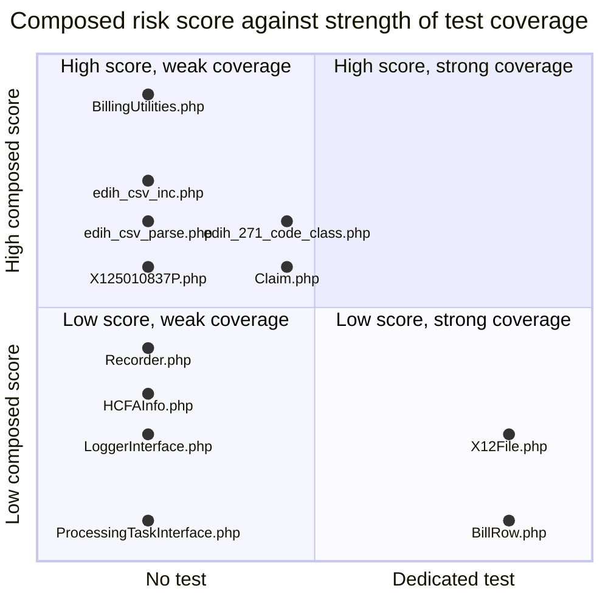

# OpenEMR Revenue Cycle and X12 EDI Upgrade Risk Map

One row per in-scope file answering a single question before you edit it: if I change this file, how likely am I to break something silently?

**Scope and sources.** This document classifies the refactor risk of all 67 files of OpenEMR's revenue-cycle and X12 EDI subsystem - X12 being the electronic data interchange (EDI) standard that United States healthcare payers, providers and clearinghouses use to exchange claims, eligibility questions and payments - and publishes the method that produced the classification so that the table can be regenerated rather than hand-maintained. It rests on four independently derived signals per file: a git-history classification that separates substantive change from mechanical sweeps, a test-coverage map built by matching test files to the classes they actually exercise, an inbound-coupling count taken across the whole repository, and executable size. The measured inputs were taken from `git log` over the 46 files of `src/Billing/`, the 17 of `library/edihistory/`, three reachable models in `library/classes/` and one class in `src/PaymentProcessing/`; from all 571 PHP files under `tests/`; from the two PHPUnit configurations and the workflows that invoke them; and from the static-analysis configuration. Conventions, the citation format, the VERIFIED and INFERRED notation and the source-of-truth ordering are defined once in [README.md](README.md) and are used here without variation. The generation each file belongs to, and the reason four generations of the same subsystem coexist at all, are established in [architecture.md](architecture.md) and are used here rather than restated: in short, the subsystem grew by accretion rather than replacement, so a legacy procedural tree, a namespaced but untyped tree, a strict-typed extraction target and a strict-typed payment namespace are all present and all reachable in one request.

**Provenance.** Every line anchor and every history figure below is relative to branch `master` at head commit `b7a7e690e419de3451740f995b768a8e8e5fba87`, on project version 8.3.0-dev (`version.php:L17-L20`). The full history is present at that commit - `git rev-list --count` returns 13,041 - which is what makes the substantive-change analysis executable rather than aspirational. No code was executed to produce this document and **no test suite was run**: PHP and Composer are not installed in the authoring environment, so every claim rests on static reading of file contents plus `git log`. Where this document says a file is covered by a test, it means that test exists on disk and exercises that class; it does not mean the test was run here, and nothing below should be read as a recorded test result.

## Table of Contents

- [Method](#method)
    - [The X12 terms this document uses](#the-x12-terms-this-document-uses)
    - [Why the raw commit history is not a usable age signal](#why-the-raw-commit-history-is-not-a-usable-age-signal)
    - [Signal 1 the mechanical versus substantive commit classifier](#signal-1-the-mechanical-versus-substantive-commit-classifier)
    - [Signal 2 the coverage column](#signal-2-the-coverage-column)
    - [Signal 3 inbound coupling measured across the whole repository](#signal-3-inbound-coupling-measured-across-the-whole-repository)
    - [Signal 4 executable size](#signal-4-executable-size)
    - [How the four signals compose into a classification](#how-the-four-signals-compose-into-a-classification)
    - [Static analysis cleanliness is a separate axis from behavioural safety](#static-analysis-cleanliness-is-a-separate-axis-from-behavioural-safety)
- [Master Risk Table](#master-risk-table)
- [The Test Surface Behind the Coverage Column](#the-test-surface-behind-the-coverage-column)
    - [The sixteen billing test files](#the-sixteen-billing-test-files)
    - [Two covering tests that live outside the billing directories](#two-covering-tests-that-live-outside-the-billing-directories)
    - [Which configuration each covering test runs under](#which-configuration-each-covering-test-runs-under)
    - [What loading under test does and does not prove](#what-loading-under-test-does-and-does-not-prove)
    - [What carries the literal none](#what-carries-the-literal-none)
- [High Risk Justifications](#high-risk-justifications)
    - [src/Billing/BillingUtilities.php](#srcbillingbillingutilitiesphp)
    - [library/edihistory/edih_csv_inc.php](#libraryedihistoryedih_csv_incphp)
    - [library/edihistory/codes/edih_271_code_class.php](#libraryedihistorycodesedih_271_code_classphp)
    - [library/edihistory/edih_csv_parse.php](#libraryedihistoryedih_csv_parsephp)
    - [library/edihistory/edih_archive.php](#libraryedihistoryedih_archivephp)
    - [library/edihistory/edih_io.php](#libraryedihistoryedih_iophp)
    - [src/Billing/Claim.php](#srcbillingclaimphp)
    - [src/Billing/X125010837P.php](#srcbillingx125010837pphp)
    - [library/edihistory/edih_835_html.php](#libraryedihistoryedih_835_htmlphp)
    - [library/edihistory/edih_csv_data.php](#libraryedihistoryedih_csv_dataphp)
    - [library/edihistory/edih_278_html.php](#libraryedihistoryedih_278_htmlphp)
    - [library/edihistory/edih_271_html.php](#libraryedihistoryedih_271_htmlphp)
    - [library/edihistory/edih_uploads.php](#libraryedihistoryedih_uploadsphp)
    - [library/classes/X12Partner.class.php](#libraryclassesx12partnerclassphp)
    - [library/edihistory/edih_997_error.php](#libraryedihistoryedih_997_errorphp)
    - [src/Billing/BillingReport.php](#srcbillingbillingreportphp)
    - [src/Billing/BillingProcessor/X12RemoteTracker.php](#srcbillingbillingprocessorx12remotetrackerphp)
- [Notable Caution Rows](#notable-caution-rows)
    - [src/Billing/SLEOB.php](#srcbillingsleobphp)
- [Aggregate Views](#aggregate-views)
    - [Risk by generation](#risk-by-generation)
    - [Size versus test coverage](#size-versus-test-coverage)
    - [Baselined static analysis findings by generation](#baselined-static-analysis-findings-by-generation)
- [How to Re-run This Analysis](#how-to-re-run-this-analysis)
- [Related Documents](#related-documents)
- [Documentation Attribution](#documentation-attribution)

## Method

The method comes before the results deliberately. A risk table for this subsystem is only trustworthy if a reader can see how each cell was derived, because the most obvious derivation - how long ago was this file last changed - produces an answer that is not merely imprecise here but actively wrong, and a reader who assumed the obvious derivation would draw the opposite conclusion from the right one.

### The X12 terms this document uses

The signals below reference transaction identifiers and envelope segments, so those are expanded here once. Every one is an X12 transaction set or segment identifier rather than an OpenEMR concept.

| Term | Expansion |
|------|-----------|
| 837 | The claim transaction set; the message that asks a payer to pay |
| 837P | The professional flavour of the 837, used for clinician claims |
| 837I | The institutional flavour of the 837, used for facility claims |
| 835 | Remittance advice; the payer's statement of what it paid and what it denied |
| 270 | Eligibility and benefit inquiry; asks whether a patient is covered |
| 271 | Eligibility and benefit response; the answer to a 270 |
| 276 | Claim status request; asks what happened to a claim already sent |
| 277 | Claim status response; the answer to a 276 |
| 278 | Services review, that is, a prior-authorisation request or response |
| 997 | Functional acknowledgement; reports whether a transmitted batch parsed |
| 999 | Implementation acknowledgement; the later replacement for the 997 |
| ISA | Interchange control header; the outermost envelope segment of a transmission |
| GS | Functional group header; groups transactions of one type inside an interchange |
| ST | Transaction set header; opens one individual transaction inside a group |
| MIA | Medicare inpatient adjudication information, a segment carried inside an 835 |
| PWK | Paperwork segment, which points at an attachment supporting a claim |
| BHT | Beginning of hierarchical transaction, the segment that opens an 837 |

### Why the raw commit history is not a usable age signal

VERIFIED: four of the most consequential files in this subsystem, chosen here because each one owns a whole responsibility rather than because of where they rank by size, were all touched within the last four months of the recorded commit. The professional claim generator was last touched on 2026-04-08, the billing utility layer on 2026-04-08, the legacy comma-separated-value index layer on 2026-07-24 and the lifted X12 file class on 2026-07-23. Taken at face value those dates say every one of them is actively maintained, and they say the legacy file is the best maintained of the four, because its date is the most recent.

VERIFIED: that reading is wrong, and the same history shows why once commit subjects are inspected rather than only commit dates. `library/edihistory/edih_csv_parse.php` was last touched on 2026-07-23, and the last commit to it that changed what it does was `7a3ad84a3` of **2016-08-13**, nearly ten years earlier. `library/edihistory/codes/edih_997_codes.php` was last touched on 2026-04-29 and last substantively changed by `4854c13d0` of **2016-05-26**, which is the commit that first imported the subsystem. Five further legacy files - `library/edihistory/edih_271_html.php`, `library/edihistory/edih_278_html.php`, `library/edihistory/edih_archive.php`, `library/edihistory/edih_uploads.php` and `library/edihistory/edih_997_error.php` - all carry 2026 dates and all trace back to `86f08600c` of 2018-09-26 for their last behavioural change. `library/edihistory/edih_x12file_class.php` shows the same pattern with a different endpoint: last touched 2026-04-28, last behaviourally changed by `95105d6c6` of 2020-12-19.

The gap between the two readings is produced by repository-wide mechanical sweeps, which touch every file in the tree and therefore reset every file's modification date at once. Separating those from real change is the first signal, and it is the signal the other three depend on.

### Signal 1 the mechanical versus substantive commit classifier

The classifier is stated here as a rule that a reader can apply to any commit, not as a list of the commits that happened to appear in this run. It has five stages and one published exception list, applied in this order to each commit that touches the file under test: the override register, the commit type, the commit breadth, a test on what the commit actually changed **in that file**, the declared-type remainder, and a keyword test that reaches only commits predating this repository's commit-message enforcement.

The order is load-bearing rather than cosmetic, and the reason is the central weakness of any history classifier built on commit metadata. A type and a subject line describe a commit as a whole, and a commit as a whole is frequently not what happened to one file inside it. So the register runs first, because a diff that has been read line by line must not be overturned by a heuristic; and the per-file diff test runs ahead of both type tests, because a commit's own label must never be allowed to promote a change that did not alter a single statement in this file. The two stages that reason from prose alone are the last two, and their measured influence on the published column is reported below rather than assumed to be small.

**Stage one, the commit type.** VERIFIED: this repository enforces Conventional Commits. It requires `ramsey/conventional-commits` as a development dependency (`composer.json:L154`), exposes a validation script for it (`composer.json:L297`), and pins the permitted type vocabulary explicitly to `build`, `chore`, `ci`, `docs`, `feat`, `fix`, `perf`, `refactor`, `revert`, `style` and `test` (`composer.json:L265-L277`), with type case forced lower and scope case forced kebab (`composer.json:L262-L264`). Commit type is therefore a machine-readable field rather than a matter of interpretation. A commit whose type is `refactor`, `style`, `chore`, `ci`, `build`, `docs` or `test` is classified **mechanical**: by the definition of those types the author is asserting that behaviour did not change.

**Stage two, the commit breadth.** Stage one alone is insufficient, and the reason is the single most important thing to know about reading this repository's history. VERIFIED: the largest mechanical sweeps in this subsystem's history do not carry the `refactor` type at all. `83dd873b3 fix: use https in @link header tags (#10869)` touches **1,909 files**. `ebe6c2f59 fix(phpdoc): repair legacy parse errors across the codebase (#11904)` touches **1,196**. `e3bd356a7 feat(session): porting core and portal apps to HttpSessionFactory (#10244)` touches **781**. `b8e228c39 fix: correct typos in library files (#10339)` touches 81 and `917b195bc fix: correct typos in src/ files (#10343)` touches 72. A classifier that trusted the type field would record all five as substantive change and would report almost every file in this subsystem as behaviourally maintained in 2026.

So the second stage is a breadth test: **a commit that touches 50 or more files is mechanical regardless of its declared type.** The five commits just cited are all above it, at 72, 81, 781, 1,196 and 1,909 files, while the targeted behavioural changes to these same files sit well below it - `cbc9a9231` touches 30, `7f8b94865` 18, `0c0f2b68d` 12, `82e9f11a7` 11, `02475cb7e` 11, `43d1cf412` 9, `bfcb2eff1` 7, `f8a69b7e2` 5, `e392a30ba` 5, `4573bc83f` 4, `bcd189855` 3, `1c0d77361` 3, `5826c57e3` 2 and `f451a0933` 1.

The threshold is nevertheless a **chosen parameter and not a boundary the data forces**, and saying otherwise would be exactly the kind of unearned confidence this document is meant to avoid. VERIFIED: the breadth distribution across the 321 distinct commits that reach these 67 files is continuous through the range that matters, with commits at 44, 45 and 48 files immediately below the threshold and at 52, 53 and 57 immediately above it. There is no empty gap to hide a boundary in.

What justifies 50 is therefore not a gap but **measured insensitivity**, which is the stronger claim of the two because it can be checked. VERIFIED: recomputing the last-substantive-change column at every threshold from 45 to 57 inclusive produces an identical result for all 67 rows. Outside that band the column does start to move, and it moves in opposite directions on the two sides. At a threshold of 40, eleven rows move **earlier**, because commits touching 40 to 49 files begin to be discarded as sweeps and the classifier falls back to an older behavioural change; five of those eleven are legacy procedural scripts that fall back from 2018 to 2016, and six are small modern files that fall back to `none ever`. At 75, two rows move **later**, because commits touching 50 to 74 files begin to be accepted as behavioural, and one of those two is the single known blind spot of stage three recorded below rather than a genuine behavioural change. The first row to move at all is `src/Billing/InsurancePolicyTypes.php`, at a threshold of 58, and even that movement is cosmetic: it relabels `8d6dc1cf7`, a 57-file commit, as substantive, and that commit is the one that created the file - which the row already reports as its added date. Any threshold in the low fifties yields the same document.

INFERRED (confidence: Medium): the continuity of the breadth distribution around 50 reflects a real editorial middle ground rather than a measurement artifact, since a change touching forty to sixty files in this repository can genuinely be either a bounded feature or a partial sweep. Basis: commits at both 44 and 57 files exist in these paths and read as different kinds of work from their subjects alone.

**Stage three, what the commit changed in this file.** The first two stages read the commit. This one reads the diff, and it exists because the first two cannot answer the question the column actually asks. A type and a subject line describe a commit as a whole, and a commit as a whole is routinely not what happened to one file inside it: a narrow, correctly typed `fix` can reach eight files and change behaviour in one of them while renaming a variable in the other seven. So the third stage takes the commit's diff **for this one path**, reduces it to the lines added and removed, discards blank lines and every line whose first non-space character opens or continues a comment, and classifies the commit **mechanical for this file** when nothing remains. It says nothing about the commit's other files, which is the point.

VERIFIED: the clearest single case is the one this stage was found by. `50698f87b creating ParseERA class and updating X12 5010 remit codes (#2056)` of 2018-12-22 is untyped and narrow enough to pass the breadth test, and its entire effect on `library/edihistory/edih_io.php` is two comment lines re-pointing a reference from a retired procedural include to the namespaced class that replaced it. Nothing executable in that file changed. Without this stage it is the file's reported last substantive change, and the row claims a behavioural change that did not occur.

VERIFIED: the stage fires on exactly five file-commit pairs across all 67 files, and each was read line by line before being accepted. `756555081` adds a single comment line to `library/classes/Controller.class.php`. `50698f87b` changes two comment lines in `library/edihistory/edih_io.php`, as above. `3b56fed34` corrects one word inside a docblock in `src/Billing/BillingProcessor/BillingClaim.php`. `5da24e5f4 fix(phpstan): remove dead code and fix @param false docblocks (#10624)` changes one docblock parameter-type line in `src/Billing/BillingProcessor/Tasks/AbstractGenerator.php` and the equivalent line in `src/Billing/X125010837P.php`, and nothing else in either. Only one of the five is reachable, because the other four are older than a surviving commit in their own file, so the stage changes the reported date of exactly one row: `src/Billing/BillingProcessor/Tasks/AbstractGenerator.php` moves from `5da24e5f4` to `43d1cf412` of 2025-06-20.

Two properties of the test have to be stated or a reimplementation will produce different dates. VERIFIED: a **binary** diff is not line-comparable, and a naive implementation reads it as zero changed lines and therefore as mechanical. `git show --unified=0` reports only that the files differ, so the test returns a sentinel for a binary path and the stage does not fire; without that guard `library/edihistory/codes/code_formatter.ods` would be reported as `none ever` instead of carrying the 2016 import commit it does carry. And the comment test matches a line whose **first** non-space character opens a comment, which leaves one blind spot: a change confined to a trailing comment on a line whose leading token is code is not detected. VERIFIED: there is exactly one such pair in this history. `917b195bc fix: correct typos in src/ files (#10343)` corrects a spelling inside a trailing comment on a segment-building line in `src/Billing/X125010837I.php`, so the reduced diff is one line long although the emitted bytes are identical. It reaches no published cell, because at 72 files it is discarded on breadth at the published threshold; it is the reason the threshold sweep at 75 moves two rows rather than one. Closing that blind spot would require a quote-aware parse of PHP line content to tell a comment marker from the same characters inside a string literal, which is a larger and more failure-prone rule than the one case it corrects, so the limit is published instead of patched.

**Stage four, the remainder.** A commit that survives the first three stages and declares **any** type not in the mechanical set of stage one is classified **substantive**. The rule is a fall-through rather than a whitelist, which is deliberate: it means an author's own declaration of a behavioural change is honoured even when the type is off-vocabulary, and it is why the two irregular types in this history are kept rather than silently discarded. VERIFIED: the declared types occurring in these paths are `refactor`, `fix`, `chore`, `feat`, `style`, `bug`, `test` and the malformed `fixes`, and no others, so stage one removes four of the eight and stage four accepts the remaining four - `fix`, `feat`, `bug` and `fixes`. The canonical substantive types `perf` and `revert` would be accepted on the same rule but do not occur here. VERIFIED examples from the history of `src/Billing/X125010837P.php`, all narrow and all behavioural: `0d85baa83 fix: edi segment count for ordering provider (#7922)`, which touches exactly one file; `1de5ae614 fix: 837 professional HL count (#6472)`, five files; `8493cde76 fix: x12837 billing 5 or 9 digit zip check (#7760)`, three files; and `3c7dc04fa fix(claims): other payer claim control number for secondary claims (#11150)`, one file. For contrast, the mechanical sweeps that also touch that file are `be636987b refactor: replace $GLOBALS access with OEGlobalsBag across the codebase (#11017)` at 705 files, `c28f4a030 refactor(globals): use getBoolean() for boolean OEGlobalsBag settings (#11050)` at 181, `591b9eda2 refactor(php): Change null to strict string defined function call args` at 814, `ca96b43e0 refactor(php): convert if/else to ternary` at 249 and `545332a95 refactor(php): long array to short array` at 1,222.

**Stage five, commits that predate enforcement.** VERIFIED: 444 of the 983 file-commit pairs reaching these 67 files carry no conventional type at all, against 272 typed `refactor`, 160 `fix`, 69 `chore`, 28 `feat`, 6 `style`, 2 `bug`, 1 `test` and 1 the malformed `fixes`. Those 983 pairs are 321 distinct commits, counted once per in-scope file each one touches, which is why the figure equals the sum of the change-frequency column in the table below rather than a commit count. For an untyped commit that also passed the breadth test and left at least one changed statement in this file, the subject line is matched against a mechanical-intent keyword set - coding-standard and PSR moves, PHP version sweeps, namespace and autoload changes, escaping and sanitising passes, typo and comment passes, linter and static-analyser passes, formatting, short-array and ternary conversions, renames and relocations - and is classified mechanical on a match and substantive otherwise. This stage is the only judgemental part of the classifier, and it applies to no commit newer than the enforcement of Conventional Commits.

Its effect is bounded, and the bound is measured rather than asserted. VERIFIED: 133 of the 321 distinct commits reaching these 67 files arrive at stage five, that is, they carry no type, pass the breadth test, and changed at least one statement in the file being classified; the keyword set calls 34 of them mechanical and 99 substantive. VERIFIED, and this is the figure that matters most about it: deleting stage five altogether and accepting every untyped survivor as substantive changes the reported date of **none of the 67 rows**. The only judgemental stage decides no published cell. It is kept because it is what makes this a rule a reader can apply to a commit rather than a description of the commits that happen to be in this history - a future untyped sweep of fewer than fifty files would need it - and it is reported as inert because a reader is entitled to know how much of the column rests on a keyword list. The answer here is none of it.

The stages that do decide cells are the two grounded in diffs, and their influence is published as a sensitivity ladder so that any reimplementation can be checked against it. VERIFIED by recomputation across all 66 PHP paths: a classifier built from the first two stages alone disagrees with the published column on **seven** rows; adding stage three brings the disagreement to **six**; adding stages four and five brings it to **five**; adding the override register brings it to **zero**. Stage three alone accounts for `src/Billing/BillingProcessor/Tasks/AbstractGenerator.php`. The register accounts for the remaining five, which are `src/Billing/BillingUtilities.php`, `library/edihistory/edih_io.php`, `library/edihistory/edih_x12file_class.php`, `src/Billing/HCFAInfo.php` and `src/Billing/EdiHistory/X12File.php`.

VERIFIED: `library/edihistory/edih_271_html.php` is worth setting out because it is the case where two stages agree and only one of them is a reason. Its newest narrow untyped commit is `e71a3ff9a fixes for edihistory, remove jquery ui residuals, replace php each function removed in php8 (#4613)` of 2021-09-05. Stage three does not discard it, because its effect on this file is a real statement change from a removed language construct to its replacement. Stage five discards it, because the subject contains a PHP version sweep. The register discards it as well, on the ground that actually reading the change shows it to be a one-for-one substitution of an equivalent loop construct with no difference in what the renderer emits. Both routes yield the 2018-09-26 date the table reports, and the register entry exists anyway: a verdict that rests on a reading of the diff is evidence, whereas the same verdict reached because the words `php8` appeared in a subject line is a coincidence that happened to point the right way.

**The override register.** Two kinds of change defeat every mechanical test above. A commit can be mixed, changing behaviour in one file and doing housekeeping in another, in which case no property of the commit is a safe guide to either. And a change can alter statements without altering behaviour, or the reverse, in a way only a reader can see: substituting one escaping helper for a call that expands to the same thing changes a statement and nothing else, while adding an escaping call where there was none changes the bytes a browser receives. So the classifier carries an exception list, and it is published in full rather than described, because an unpublished exception list is indistinguishable from hand-editing the results.

Ten file-commit pairs are registered. Each was read as a reduced diff before being entered, and the reason is recorded beside it so that a reader can reject any entry on the evidence rather than having to take it.

| Commit | File | Verdict | What the reduced diff shows |
|--------|------|---------|------------------------------|
| `05203599a` | `src/Billing/BillingUtilities.php` | mechanical | One parameter declaration changes from an implicit nullable to an explicit one, for a PHP 8.4 deprecation. The parameter that follows it has no default either, so no call site can behave differently |
| `1c0d77361` | `src/Billing/EdiHistory/X12File.php` | mechanical | Two `return` statements are dropped from constructors. The pull request states in terms that there is no behaviour change, on the ground that constructor return values have never been observable |
| `e71a3ff9a` | `library/edihistory/edih_271_html.php` | mechanical | A removed language construct is replaced by its one-for-one equivalent in a single loop header |
| `309583b8e` | `library/edihistory/edih_997_error.php` | mechanical | An escaping call is replaced by the helper that expands to exactly it. VERIFIED: `library/htmlspecialchars.inc.php:L66-L69` defines the replacement as the composition it replaces |
| `5d34515d6` | `library/edihistory/edih_archive.php` | mechanical | A class name is restyled from upper case to studly case. PHP class names are case-insensitive, so the resolved class is the same one |
| `5d34515d6` | `library/edihistory/edih_uploads.php` | mechanical | The same restyling in a second file of the same commit |
| `e71a3ff9a` | `library/edihistory/edih_io.php` | **substantive** | The same commit as the `edih_271_html.php` entry above, and in this file it does two other things: it excludes a named log file from a directory scan, and it adds a second string form to a monetary equality test. Both change what the file decides |
| `95105d6c6` | `library/edihistory/edih_x12file_class.php` | **substantive** | An escaping call is **added** to a value that was previously concatenated into markup raw. The emitted bytes change |
| `0adb391b7` | `src/Billing/HCFAInfo.php` | **substantive** | A method becomes static. The call convention changes and the method loses access to instance state |
| `5b0515185` | `library/edihistory/edih_csv_inc.php` | **substantive** | The subsystem's entire on-disk history root moves from a top-level site directory into the site documents directory. This is the single most consequential change ever made to the storage-path contract that every other legacy script resolves through |

Two rules govern the register, and both are stated so that entries can be predicted rather than negotiated.

- **The escaping family.** Substituting one escaping helper for a call that expands to the same composition is mechanical, because the emitted bytes are identical by definition. **Adding or removing** escaping where there was none is substantive, because the emitted bytes differ. That single distinction separates `309583b8e` from `95105d6c6` above, and the two look almost identical in a diff.
- **A rejected rule.** An earlier draft generalised the escaping case into "a commit whose changed lines form the same multiset before and after is mechanical", which is attractive because it needs no reading. It was rejected because it is wrong here. VERIFIED: `316002f58 fix(edihistory): move use statement out of docblock (#12223)` moves an identical import line out of a comment block and into file scope in `library/edihistory/edih_csv_inc.php`. The multiset of line contents is unchanged and the effect is that an inert comment becomes a live import. The rule would have discarded it; reading it does not.

An entry is added only after the reduced diff has been read, and on one of two grounds: the mechanical stages reach the opposite verdict, or they reach the right verdict for the wrong reason, as with `e71a3ff9a` on `library/edihistory/edih_271_html.php` above. Every entry costs the classifier its main virtue in that one place, so the split is published rather than left to be counted. VERIFIED: of the ten entries, **six** reverse what the mechanical stages alone would decide and **four** confirm it. Five of the six reversals change a reported date. The sixth, `5b0515185` on `library/edihistory/edih_csv_inc.php`, is older than a surviving commit in that file and so changes no date, but it does correct the count of substantive commits published for it in [library/edihistory/edih_csv_inc.php](#libraryedihistoryedih_csv_incphp), where the stage-five keyword set had wrongly discarded a storage-path move on the word `fold`. Ten entries against 983 file-commit pairs is the price of the column being about behaviour rather than about commit messages.

The stages that reason from prose are **not** what produces the oldest dates in the table, and it would be easy to assume otherwise. `library/edihistory/edih_csv_parse.php` reports 2016 because of stage two, not stage five and not the register: every commit to it since then is either typed mechanical or a repository-wide sweep, including `ebe6c2f59 fix(phpdoc): repair legacy parse errors across the codebase (#11904)` at 1,196 files and `83dd873b3 fix: use https in @link header tags (#10869)` at 1,909, both of which carry the substantive type `fix` and are discarded on breadth alone.

The **Last substantive change** column carries the date and short hash of the newest commit to that file that survives all five stages and the register. Six files carry `none ever` instead, with the date they were added: for each of them, every commit that has ever touched that path is mechanical by this classifier, which is a fact about the file rather than a gap in the data. Four of the six are the `src/Billing/DaySheet/` classes and one is `src/Billing/EdiHistory/Claim277Renderer.php`, all five of which were created by extraction commits typed `refactor`, so the label is accurate rather than anomalous: those files have genuinely never had their behaviour deliberately changed since the day the code was moved into them. The sixth is `src/Billing/InsurancePolicyTypes.php`, whose only three commits are the 57-file change that created it and two later sweeps, and which is also the first row the threshold sweep above moves, at 58, for exactly that reason.

### Signal 2 the coverage column

The coverage column names a test file or carries the literal `none`. It was built by matching test files to the classes they **actually exercise**, established by reading each test's imports and its constructor calls, and not by matching file names.

Matching by name, or by text, would have produced false confidence in both directions, and both directions actually occur here. VERIFIED: a textual match would have credited coverage that does not exist, because two tests name legacy symbols in comments only and load no legacy file at all - `tests/Tests/Isolated/Billing/EdiHistory/EdiFormatTest.php:L48` and `tests/Tests/Isolated/Billing/EdiHistory/RemitAccountingTest.php:L36` - so a search for those symbols returns hits that assert nothing about the files they name. VERIFIED: matching by name or by directory would equally have missed coverage that does exist, and it would have missed it three times over. Two in-scope files are covered by tests that live nowhere near the billing test directories and are named after something else entirely; both are identified in [Two covering tests that live outside the billing directories](#two-covering-tests-that-live-outside-the-billing-directories). The third is the largest single file in the subsystem, `library/edihistory/codes/edih_271_code_class.php`, whose only covering test is named after a different class in a different generation: `tests/Tests/Isolated/Billing/EdiHistory/Claim277RendererTest.php:L37` requires the legacy code table by relative path five directory levels up, `:L43` constructs it, and the assertions that follow turn on values only that table supplies. That coverage is real, indirect and narrow all at once, which is why it is recorded as `narrow` rather than as either `none` or a dedicated test; it is set out in [What loading under test does and does not prove](#what-loading-under-test-does-and-does-not-prove).

The search was therefore run across the entire test tree, all 571 PHP files under `tests/`, rather than across the two billing test directories. Where the column carries `none`, that is the result of a search that returned nothing for that file's fully-qualified class name, for a binding use of its short class name, for a call to any of its global functions and for a require of its path.

One clarification of that denominator, because 571 is not the file count of `tests/`. VERIFIED: `tests/` holds 843 regular files and 571 of them are PHP. The other 272 are 137 HTML fixtures, 37 Bats shell tests, 31 JSON fixtures, 17 XML configurations, 11 markdown files and a remainder of shell, JavaScript, spreadsheet and certificate files, none of which can bind a class, call a global function or require a path, so confining the search to PHP loses no coverage. VERIFIED: exactly three of the 272 mention an in-scope symbol at all, and all three are release-changelog fixtures quoting one pull-request title verbatim - `tests/Tests/Isolated/Release/fixtures/8_2_0/prs.json` and the two `expected.md` files under the same fixture directory - which is precisely the kind of textual hit the matching rule above exists to reject.

The column records **two things rather than one**: whether a covering test exists at all, and how much of the file it reaches. A coverage cell is read as **dedicated** when the test constructs the row's own class as shipped and asserts on its behaviour, and as **narrow** when the test reaches only a fragment - a single static helper, a stub subclass that bypasses or re-implements the constructor, or a collaborator exercised only through the output of the class actually under test - so that the file as shipped is largely never executed. Five rows are narrow, each on a marker in the test file itself rather than on an impression, and each is marked `narrow` beside its test path in the master table.

| File | Covering test | The marker that makes it narrow |
|------|---------------|----------------------------------|
| `src/Billing/Claim.php` | `Isolated/Billing/ClaimCountMethodsTest.php` | An anonymous subclass whose constructor is overridden to an empty body at `tests/Tests/Isolated/Billing/ClaimCountMethodsTest.php:L42-L46`, so the real constructor - where the claim is assembled from the database - never runs, and only two accessors are asserted |
| `src/Billing/X125010837I.php` | `Isolated/Billing/X125010837IDateTest.php` | All three test methods drive one static date helper, at `tests/Tests/Isolated/Billing/X125010837IDateTest.php:L22-L39`. Nothing constructs the generator and no segment is emitted or asserted |
| `src/Billing/BillingProcessor/BillingClaimBatch.php` | `Isolated/Billing/BillingClaimBatchTest.php` | A stub subclass at `tests/Tests/Isolated/Billing/BillingClaimBatchTest.php:L186-L224` whose replacement constructor at `:L188-L217` sets the batch fields by hand instead of calling the parent, so the real constructor at `src/Billing/BillingProcessor/BillingClaimBatch.php:L49-L67` never runs and the two control numbers are literals rather than allocated values. What the stub does reach is genuine: nine inherited accessors and mutators at `src/Billing/BillingProcessor/BillingClaimBatch.php:L72-L139`, and the protected partner extractor at `:L191-L200` three times through a public wrapper the stub adds at `tests/Tests/Isolated/Billing/BillingClaimBatchTest.php:L220-L223`. The only call that appends content is one `append_claim()` at `tests/Tests/Isolated/Billing/BillingClaimBatchTest.php:L132`, passed the paper flag, so it takes the early return at `src/Billing/BillingProcessor/BillingClaimBatch.php:L204-L207` and never the X12 branch from `:L209` where the envelope is assembled. `write_batch_file()` at `:L153` and `append_claim_close()` at `:L272` are never called |
| `src/Billing/BillingProcessor/BillingClaim.php` | `Isolated/Billing/BillingClaimTest.php` | A stub subclass declared at `tests/Tests/Isolated/Billing/BillingClaimTest.php:L195` whose constructor re-implements the identifier split and the payer-type mapping rather than inheriting them, at `tests/Tests/Isolated/Billing/BillingClaimTest.php:L197-L228`, so the real constructor at `src/Billing/BillingProcessor/BillingClaim.php:L105-L143` never runs and the identifier and payer-type assertions exercise the test's copy of that logic rather than the class's. What the stub does reach is genuine: twelve inherited getters, setters and the serializer at `src/Billing/BillingProcessor/BillingClaim.php:L148-L238`. Three of the fourteen tests construct nothing at all and only read the constant families at `src/Billing/BillingProcessor/BillingClaim.php:L22-L29` and `:L76-L79` |
| `library/edihistory/codes/edih_271_code_class.php` | `Isolated/Billing/EdiHistory/Claim277RendererTest.php` | The file is reached only as a collaborator of the class the test is named for. It is constructed at `tests/Tests/Isolated/Billing/EdiHistory/Claim277RendererTest.php:L43` and passed into the renderer, so its one lookup method is exercised, but only for the code sets that a 277 happens to need: VERIFIED, the table declares 56 element sets and the renderer requests 10 of them, so 46 are never reached by any test |

That distinction is not descriptive only: it feeds the arithmetic below, and it is the reason four of those five rows are not classified `safe`. A binary covered-or-not column would have scored all five as fully covered, and would have reported the 1,225-line institutional generator and the class that writes the batch envelope as `safe` on the strength of a 40-line date test and a stub that never writes a batch file. It would also have moved the 2,432-line legacy code table two points down the scale on the strength of ten of its fifty-six code sets being read through somebody else's test.

### Signal 3 inbound coupling measured across the whole repository

The coupling column counts the distinct repository files that reference the row's file. VERIFIED: measuring that only inside the documented subsystem would be close to meaningless, because the highest-consequence callers are outside it. Of the 31 files that reference `src/Billing/BillingUtilities.php`, 20 are outside the 67-file documented surface, and 17 of those are screens or a portal page: `interface/billing/sl_eob_process.php`, `interface/billing/ub04_dispose.php`, `interface/forms/fee_sheet/new.php`, `interface/forms/eye_mag/save.php`, nine files under `interface/patient_file/`, three under `interface/reports/`, and `portal/portal_payment.php`. The remaining three are libraries rather than entry points. A subsystem-only count would report 11 - ten within `src/Billing/` and one under `library/edihistory/` - and would understate the blast radius of that file by nearly three times.

The count is a binding-reference count rather than a text search for a bare name, because a bare-name search on this repository is unusable. VERIFIED: searching the repository for the short name `LoggerInterface` returns 133 files, almost all of them users of the unrelated PSR-3 logging interface of the same name, and searching for `Controller` returns 384. A file is counted as an inbound reference only when it contains the target's fully-qualified class name, or uses the target's short name in a binding position - `new`, a static call, `extends`, `implements`, `instanceof` or a `use` import - from within the same namespace or a parent or child of it, or calls one of the target's global functions, or requires the target by path. Under that rule the two collisions above resolve to 12 and 17, and both of those figures are the ones the master table carries. Reaching them takes three narrowings and not one: **narrowing one** is the binding-position rule just stated, **narrowing two** is code text in place of raw file text, and **narrowing three** is the exact symbol in place of a prefix of it. The paragraphs below give the second and third in order, with the file each one removes, because a reader who stops after the first will land on a different number.

The corpus excludes `.git`, `vendor`, `node_modules`, the static-analysis temporary directory, `docs/`, and the row's own file. It also excludes `.phpstan/baseline`, and that exclusion is not cosmetic: those 168 files are PHP arrays enumerating suppressed findings by path, so they contain a literal reference to almost every source file in the repository and will match any path-shaped search pattern. Leaving them in inflates a count without adding a single real caller - for `library/edihistory/edih_csv_inc.php` they alone contribute 20 spurious matches.

**Narrowing two, code text in place of raw file text.** Before matching, each candidate file has its comments and its string literals removed - `//` and `#` line comments, `/* */` block comments including docblocks, and single- and double-quoted literals - and the binding-position test is applied to what remains. Without that step the count drifts away from the rule it claims to follow, because a docblock `@param` line, a `@see` tag or a translated screen label reads to a plain search exactly like a binding use. One clause of the rule is exempt, and the exemption has to be published or the rule contradicts itself: the require-by-path clause is matched against text from which only the comments have been removed, because a require path is necessarily a string literal and stripping literals would discard every one of them. VERIFIED: the three require sites that exemption preserves are `interface/billing/edih_main.php:L84-L85`, `src/Billing/EDI270.php:L35` and `tests/Tests/Isolated/Billing/EdiHistory/Claim277RendererTest.php:L37`.

VERIFIED: this narrowing lowers eight of the 67 counts and raises none - `library/classes/Controller.class.php` from 19 to 18, `library/classes/InsuranceCompany.class.php` from 15 to 13, `library/edihistory/edih_csv_inc.php` from 14 to 12, `src/Billing/SLEOB.php` from 10 to 9, `library/edihistory/edih_csv_parse.php` from 4 to 2, and `library/edihistory/edih_277_html.php`, `library/edihistory/edih_835_html.php` and `src/Billing/X125010837P.php` from 3 to 2 each. What it removes is ordinary comment traffic, and four of the removals are worth naming because they are the extraction's own paper trail: `src/Billing/BillingUtilities.php:L1493` names `SLEOB` in a comment without binding to it, `src/Billing/EdiHistory/X12File.php:L1493` names `edih_835_html.php` in a comment, and the docblocks at `src/Billing/EdiHistory/Claim277Renderer.php:L13` and `src/Billing/EdiHistory/EdiFormat.php:L9` name the legacy files their classes were lifted out of. A count that included those would report the extraction's own provenance notes as live coupling.

**Narrowing three, the exact symbol in place of a prefix of it.** A short name in a binding position still matches when it is no more than the first segment of a longer namespace-qualified name, so the binding test is additionally required to end at the symbol: the match is rejected when the next character is a namespace separator or another identifier character. VERIFIED: this narrowing changes one of the eight figures above and leaves the other seven exactly where narrowing two left them. `library/classes/Controller.class.php` falls from 18 to 17, and the file it removes is `interface/modules/zend_modules/module/Acl/config/module.config.php:L29`, where `new Controller\AclController` binds to a class inside a `Controller` namespace and not to the legacy `Controller` base at all. For comparison, the file narrowing two removed from that same count is `portal/patient/fwk/libs/verysimple/Phreeze/PortalController.php`, whose only two mentions are the docblock lines `:L702` and `:L890`. VERIFIED: the seven unchanged figures are unchanged for a structural reason rather than by luck - four of them are legacy procedural files matched by a require path or by one of their own global function names, and neither of those can carry a namespace prefix, while for the three remaining class-named targets, `library/classes/InsuranceCompany.class.php`, `src/Billing/SLEOB.php` and `src/Billing/X125010837P.php`, the exact-symbol test removes nothing.

The master table carries the figures that survive all three narrowings. One of the corrections crosses a band boundary in the point table below: `src/Billing/SLEOB.php` at 9 scores one coupling point rather than the two it would score at 10.

Two limits of this count are worth stating so it is not over-read, and the first cuts the opposite way from the direction a reader might assume. Because a reference must appear in a binding position, a file that names the symbol only in a comment is **not** counted, so the figure understates the work of renaming something: `src/Billing/BillingProcessor/BillingLogger.php` and `src/Billing/BillingProcessor/Traits/WritesToBillingLog.php` both describe `LoggerInterface` in prose comments without ever binding to it, and neither appears in its count of 12. And the count is static rather than a call graph, so it cannot see dynamic dispatch, and a class reached only through a variable class name would be undercounted.

### Signal 4 executable size

The size column is the file's line count, taken with `wc -l` at the recorded commit. Size is included because it is the crudest and most reliable proxy for how much behaviour a change has to avoid disturbing, and because in this subsystem it correlates inversely with coverage rather than positively.

Size is discounted to zero for a file whose only declaration is an interface, on the objective marker that it declares an `interface` and no `class`. VERIFIED: four files meet that marker - `src/Billing/BillingProcessor/GeneratorCanValidateInterface.php`, `src/Billing/BillingProcessor/GeneratorInterface.php`, `src/Billing/BillingProcessor/LoggerInterface.php` and `src/Billing/BillingProcessor/ProcessingTaskInterface.php`. They hold no statements, so there is no behaviour in them to break; what a change to them can break is compilation of the classes that implement them, which the coupling signal already measures. Their coverage contribution is discounted for the same reason: an interface has no behaviour for a test to assert.

One row is not PHP at all. `library/edihistory/codes/code_formatter.ods` is an OpenDocument spreadsheet, so it has no line count and contributes none of the 14,979 lines counted for `library/edihistory/`; it is carried as a row because the file is in scope and silence about it would be indistinguishable from having missed it.

Its size cell is therefore not applicable rather than zero, and the point table below is applied to the cells it does have: 0 for size, 3 for a coverage cell of `none`, 0 for a coupling count of 0, 2 for a last substantive change of 2016 and 0 for a single commit, composing to 5 and landing in `caution`. That is the arithmetic applied honestly rather than a claim that a spreadsheet is dangerous to edit. What the score is really reporting is that nothing in this repository would notice if its contents changed, which for a file that generates three PHP code tables is a real statement rather than an artefact.

### How the four signals compose into a classification

A risk classification is a judgement, not a measurement, so the judgement is published as arithmetic rather than asserted. Each signal contributes points, the points are summed, and the sum falls into a band. Nothing else feeds the classification, so any reader who disagrees with a row can recompute it from the row's own four measured cells.

| Signal | Points |
|--------|--------|
| Size 1000 lines or more | 3 |
| Size 300 to 999 lines | 2 |
| Size 100 to 299 lines | 1 |
| Size under 100 lines, or a declaration-only interface | 0 |
| Coverage cell is `none` | 3 |
| Coverage cell names a test marked `narrow` | 2 |
| Coverage cell names a dedicated test, or the file is a declaration-only interface | 0 |
| Inbound coupling 20 or more | 3 |
| Inbound coupling 10 to 19 | 2 |
| Inbound coupling 4 to 9 | 1 |
| Inbound coupling 3 or fewer | 0 |
| Last substantive change 2019 or earlier | 2 |
| Last substantive change 2020 to 2024, or no substantive change ever | 1 |
| Last substantive change 2025 or later | 0 |
| Change frequency 25 commits or more | 1 |

| Band | Total | Reading |
|------|-------|---------|
| `safe` | 3 or below | Small, covered, or narrowly referenced. A change here is verifiable by the existing evidence |
| `caution` | 4 to 6 | One or two signals are adverse. A change here needs a specific verification argument |
| `high-risk` | 7 or above | Large, uncovered and widely referenced at once. A change here can alter behaviour with nothing in the repository able to detect it |

The volatility band deserves one word of explanation, because it points the opposite way from intuition. An old last-substantive-change date scores **more** risk, not less. A file whose behaviour has not been deliberately touched since 2016 is not thereby proven stable; it is a file where nobody currently working on the codebase has demonstrated that they understand it, and where the accumulated mechanical sweeps have rewritten its syntax without anybody re-verifying its output. High change frequency scores an additional point for a complementary reason, and a narrower one than the raw number suggests. VERIFIED: this column counts every commit reaching the file, mechanical and substantive together, as [How to re-run this analysis](#how-to-re-run-this-analysis) states, so a high count is not a count of occasions on which the file was found wrong. What it measures is edit exposure: how often the file has fallen inside somebody's blast radius, whether or not that person was reasoning about what it does. A file edited 45 times, mostly by sweeps, with no test to catch a slip in any of them, has accumulated more opportunity for an unnoticed change than a file edited twice - and that, rather than demonstrated recurrence, is what the point is for. Where a recurrence claim is made about a specific file in the sections below, it is made from the commit subjects and cited, not from this column.

**Escalation rule E.** A file is escalated to `high-risk` above its arithmetic when **both** of two conditions hold. First, a specific silent-failure or silent-money defect has been traced **in that same file**, cited to a line range in it, on the reasoning that a defect producing no operator-visible signal removes the last line of defence a low score was relying on. Second, the file's composed score is below 7, so that the escalation actually changes the row's band rather than restating it. Both conditions are checkable from the citation and the score, so a reader can confirm or reject any escalation without having to share a judgement.

Exactly one row satisfies both conditions, and it names its citation. `src/Billing/BillingProcessor/X12RemoteTracker.php`, composed score 4, on `src/Billing/BillingProcessor/X12RemoteTracker.php:L112-L121`, where a failed upload is overwritten with the success status and the status column is the only place the transport records a verdict. Escalated rows are marked as such in the table so that the arithmetic and the override are never confused with each other. The underlying defect is registered, with its symptom and its proposed verification, in [defect-candidates.md](defect-candidates.md).

Three rows that a reader might expect to be escalated are not, and in each case the reason is one of the two conditions rather than a change of view about the file. `src/Billing/Claim.php` reaches 7 on its own arithmetic once its narrow coverage is scored as narrow, so it fails the second condition and escalation would add nothing to it. `library/edihistory/edih_835_html.php` also reaches 7 on its own arithmetic, and it fails the first condition as well: the defect that makes it interesting is a segment it renders and the modern parser rejects, and the rejecting line is cited in `src/Billing/ParseERA.php` rather than in this file.

`src/Billing/SLEOB.php` is the third, and it is the one where the rule as published had to be applied against the temptation to escalate anyway. Its composed score is 6, so it passes the second condition, and the tertiary-payer boundary at `src/Billing/SLEOB.php:L285-L288` is a genuine defect cited in the file itself. It fails the **first** condition, on the operator-visible half of it. VERIFIED: the only caller that reaches this routine invokes it inside the guard at `interface/billing/sl_eob_process.php:L717`, and then prints a message whenever the crossover test at `interface/billing/sl_eob_process.php:L720` is not met - a fixed sentence about secondary paper billing, at `interface/billing/sl_eob_process.php:L721-L725`. The message does not depend on what the routine did, so a signal always reaches the screen and a tertiary requeue is *misreported* rather than unreported - and misreporting is a different fault from silence, however unhelpful it is in practice. Rule E as written asks whether a signal exists, not whether it is accurate, so the honest application of it leaves this row at `caution` on its arithmetic. The alternative would have been to widen rule E to cover misleading signals as well as absent ones, which would be a defensible method but a different one, and rewriting the rule to reach a row already chosen is precisely the move this document's published-arithmetic approach exists to prevent. The row's evidence is set out in full at [src/Billing/SLEOB.php](#srcbillingsleobphp), and the misleading message is registered as a rule in [business-rules.md](business-rules.md) and as a defect in [defect-candidates.md](defect-candidates.md).

Applying the arithmetic and the escalation rule to the 67 rows yields **17 high-risk, 35 caution and 15 safe**.

### Static analysis cleanliness is a separate axis from behavioural safety

This is the distinction a naive risk map would get wrong, and it would get it wrong in both directions: it would read a clean static-analysis result as evidence that untested legacy code is safe, and it would read the absence of a static-analysis complaint about a covered modern class as adding nothing.

VERIFIED: the repository runs its static analyser at maximum strictness. `phpstan.neon.dist:L9` is `level: 10`, which is the highest level the analyser offers, and the analysed paths include the whole of the three trees this subsystem lives in - `interface` at `phpstan.neon.dist:L53`, `library` at `phpstan.neon.dist:L55` and `src` at `phpstan.neon.dist:L63`.

VERIFIED: **that strictness is applied on top of a large suppression baseline, and the baseline is where most of this subsystem's findings currently sit.** `phpstan.neon.dist:L2` includes `.phpstan/phpstan.github.neon`, whose `.phpstan/phpstan.github.neon:L3` loads `baseline/loader.php`, which in turn loads 168 per-rule baseline files from `.phpstan/baseline/`; the mechanism is the `shipmonk/phpstan-baseline-per-identifier` development dependency at `composer.json:L157`, with regeneration scripts at `composer.json:L302-L304`. Those 168 files hold 73,842 ignore entries suppressing 139,720 finding occurrences across 3,426 paths repository-wide. Of those, **3,024 entries suppressing 6,738 occurrences fall on 55 of the 67 files documented here**, and 988 entries suppressing 3,169 occurrences fall on `library/edihistory/` alone.

The consequence is the one to carry away, and it is stronger than the naive version of the same point rather than weaker. All 14,979 procedural lines of `library/edihistory/` pass the strict analysis gate in continuous integration while 12,547 of them, across 15 of the tree's 16 PHP files, have no test coverage at all and the sixteenth has only the narrow, indirect coverage recorded in [Signal 2 the coverage column](#signal-2-the-coverage-column) - so a green analysis run is not evidence of behavioural safety there. But it is not even evidence of static cleanliness, because the analyser's findings on that tree were not fixed; they were recorded and excluded. `.phpstan/phpstan.github.neon:L5` sets `reportUnmatchedIgnoredErrors: true`, so the baseline is at least self-policing - an entry that stops matching fails the build - which means the baseline is an accurate census of open findings rather than a stale one. Treating either axis as a proxy for the other would misclassify the highest-risk files in this subsystem as safe, which is exactly why static analysis contributes no points to the composition rule above.

INFERRED (confidence: High): the 133 baseline entries suppressing 413 occurrences on `src/Billing/EdiHistory/X12File.php` - a strict-typed generation-3 class with a dedicated test - are inherited from its legacy origin rather than newly introduced, because the file was created by lifting existing procedural code wholesale rather than by being written fresh. Basis: it is the only one of the eight strict-typed files in the subsystem that carries any baseline entries at all, and the other seven carry none.

## Master Risk Table

All 67 in-scope files appear below, sorted by risk band, then by composed score, then by size. Every cell is a measured value or, in the case of the risk band, an arithmetic consequence of the four measured values to its left as defined in [How the four signals compose into a classification](#how-the-four-signals-compose-into-a-classification). Line counts are `wc -l` at the recorded commit. Commit counts are all commits reaching that path, mechanical and substantive together, so the column measures churn rather than behavioural change; the behavioural-change date is the column beside it.

Coverage cells are paths relative to `tests/Tests/`, which is what makes each one's configuration determinable without a second lookup: a path beginning `Isolated/` runs only under `phpunit-isolated.xml`, a path beginning `Services/` runs under the `services` suite of `phpunit.xml`, and a path beginning `RestControllers/` runs under the `controllers` suite of the same file. The full mapping, and why the distinction matters, is in [Which configuration each covering test runs under](#which-configuration-each-covering-test-runs-under).

Files with nothing notable about them still carry a row, and the sections after the table say so in a line rather than omitting them, because an omitted file is indistinguishable from a file nobody looked at.
| File | Lines | Last substantive change | Commits | Covering tests | Inbound coupling | Risk |
|------|------:|-------------------------|--------:|----------------|-----------------:|------|
| `src/Billing/BillingUtilities.php` | 1996 | 2023-06-15 (`40636e7d9`) | 25 | `none` | 31 | **high-risk** (score 11) |
| `library/edihistory/edih_csv_inc.php` | 1892 | 2026-07-24 (`4573bc83f`) | 45 | `none` | 12 | **high-risk** (score 9) |
| `library/edihistory/codes/edih_271_code_class.php` | 2432 | 2016-08-13 (`7a3ad84a3`) | 17 | `Isolated/Billing/EdiHistory/Claim277RendererTest.php`, narrow | 8 | **high-risk** (score 8) |
| `library/edihistory/edih_csv_parse.php` | 1599 | 2016-08-13 (`7a3ad84a3`) | 23 | `none` | 2 | **high-risk** (score 8) |
| `library/edihistory/edih_archive.php` | 1305 | 2018-09-26 (`86f08600c`) | 18 | `none` | 2 | **high-risk** (score 8) |
| `src/Billing/Claim.php` | 2287 | 2026-06-18 (`5826c57e3`) | 53 | `Isolated/Billing/ClaimCountMethodsTest.php`, narrow | 6 | **high-risk** (score 7) |
| `src/Billing/X125010837P.php` | 1640 | 2026-04-08 (`3c7dc04fa`) | 41 | `none` | 2 | **high-risk** (score 7) |
| `library/edihistory/edih_835_html.php` | 1589 | 2026-07-23 (`bcd189855`) | 30 | `none` | 2 | **high-risk** (score 7) |
| `library/edihistory/edih_csv_data.php` | 949 | 2019-05-03 (`77a726d59`) | 24 | `none` | 2 | **high-risk** (score 7) |
| `library/edihistory/edih_278_html.php` | 916 | 2018-09-26 (`86f08600c`) | 16 | `none` | 2 | **high-risk** (score 7) |
| `library/edihistory/edih_io.php` | 753 | 2021-09-05 (`e71a3ff9a`) | 27 | `none` | 1 | **high-risk** (score 7) |
| `library/edihistory/edih_271_html.php` | 628 | 2018-09-26 (`86f08600c`) | 15 | `none` | 2 | **high-risk** (score 7) |
| `library/edihistory/edih_uploads.php` | 576 | 2018-09-26 (`86f08600c`) | 22 | `none` | 2 | **high-risk** (score 7) |
| `library/classes/X12Partner.class.php` | 496 | 2026-04-17 (`0c0f2b68d`) | 27 | `none` | 4 | **high-risk** (score 7) |
| `library/edihistory/edih_997_error.php` | 335 | 2018-09-26 (`86f08600c`) | 22 | `none` | 2 | **high-risk** (score 7) |
| `src/Billing/BillingReport.php` | 308 | 2024-11-15 (`d92b33d11`) | 24 | `none` | 7 | **high-risk** (score 7) |
| `src/Billing/BillingProcessor/X12RemoteTracker.php` | 216 | 2025-08-23 (`fe597b9b8`) | 11 | `none` | 3 | **high-risk** (score 4, escalated) |
| `library/edihistory/edih_segments.php` | 1238 | 2025-09-28 (`7209da131`) | 24 | `none` | 2 | caution (score 6) |
| `src/Billing/EDI270.php` | 1162 | 2024-10-24 (`13d175253`) | 30 | `Isolated/Billing/EDI270Test.php` | 4 | caution (score 6) |
| `src/Billing/Hcfa1500.php` | 762 | 2023-05-25 (`82e9f11a7`) | 12 | `none` | 3 | caution (score 6) |
| `src/Billing/BillingProcessor/Tasks/GeneratorX12Direct.php` | 370 | 2023-10-04 (`02475cb7e`) | 22 | `none` | 1 | caution (score 6) |
| `src/Billing/SLEOB.php` | 304 | 2026-02-09 (`4ca569023`) | 19 | `none` | 9 | caution (score 6) |
| `src/Billing/BillingProcessor/BillingClaim.php` | 239 | 2023-06-15 (`40636e7d9`) | 12 | `Isolated/Billing/BillingClaimTest.php`, narrow | 15 | caution (score 6) |
| `library/edihistory/codes/edih_997_codes.php` | 175 | 2016-05-26 (`4854c13d0`) | 11 | `none` | 2 | caution (score 6) |
| `src/Billing/BillingProcessor/Traits/WritesToBillingLog.php` | 43 | 2021-01-29 (`e3fa29dc6`) | 2 | `none` | 10 | caution (score 6) |
| `src/Billing/X125010837I.php` | 1225 | 2025-09-28 (`1a78ec8f1`) | 13 | `Isolated/Billing/X125010837IDateTest.php`, narrow | 2 | caution (score 5) |
| `library/classes/InsuranceCompany.class.php` | 416 | 2026-06-21 (`bfcb2eff1`) | 44 | `Services/InsuranceCompanyServiceTest.php` | 13 | caution (score 5) |
| `library/classes/Controller.class.php` | 316 | 2026-07-15 (`7f8b94865`) | 55 | `RestControllers/ControllerRoutingTest.php` | 17 | caution (score 5) |
| `library/edihistory/edih_277_html.php` | 307 | 2026-07-23 (`f451a0933`) | 19 | `none` | 2 | caution (score 5) |
| `src/Billing/BillingProcessor/BillingClaimBatch.php` | 280 | 2024-04-30 (`14e7854b0`) | 12 | `Isolated/Billing/BillingClaimBatchTest.php`, narrow | 8 | caution (score 5) |
| `library/edihistory/codes/edih_835_code_class.php` | 264 | 2022-04-02 (`564935ccd`) | 19 | `none` | 2 | caution (score 5) |
| `src/Billing/BillingProcessor/Tasks/GeneratorHCFA_PDF.php` | 234 | 2023-06-15 (`40636e7d9`) | 13 | `none` | 2 | caution (score 5) |
| `src/PaymentProcessing/Recorder.php` | 228 | 2026-02-03 (`da996a38f`) | 5 | `none` | 9 | caution (score 5) |
| `src/Billing/BillingProcessor/BillingProcessor.php` | 223 | 2024-04-30 (`14e7854b0`) | 16 | `none` | 2 | caution (score 5) |
| `src/Billing/BillingProcessor/Tasks/GeneratorX12.php` | 219 | 2023-10-04 (`02475cb7e`) | 18 | `none` | 1 | caution (score 5) |
| `src/Billing/BillingProcessor/Tasks/GeneratorUB04X12.php` | 160 | 2024-04-30 (`14e7854b0`) | 9 | `none` | 1 | caution (score 5) |
| `src/Billing/BillingProcessor/Tasks/AbstractGenerator.php` | 115 | 2025-06-20 (`43d1cf412`) | 13 | `none` | 8 | caution (score 5) |
| `library/edihistory/edih_x12file_class.php` | 21 | 2020-12-19 (`95105d6c6`) | 28 | `none` | 1 | caution (score 5) |
| `library/edihistory/codes/code_formatter.ods` | n/a | 2016-05-26 (`4854c13d0`) | 1 | `none` | 0 | caution (score 5) |
| `src/Billing/BillingProcessor/Tasks/GeneratorHCFA.php` | 179 | 2025-06-20 (`43d1cf412`) | 7 | `none` | 1 | caution (score 4) |
| `src/Billing/PaymentGateway.php` | 152 | 2025-06-20 (`43d1cf412`) | 13 | `none` | 2 | caution (score 4) |
| `src/Billing/BillingProcessor/Tasks/GeneratorUB04Form_PDF.php` | 88 | 2024-04-30 (`14e7854b0`) | 5 | `none` | 1 | caution (score 4) |
| `src/Billing/HCFAInfo.php` | 78 | 2020-12-12 (`0adb391b7`) | 5 | `none` | 1 | caution (score 4) |
| `src/Billing/DaySheet/SlotTotals.php` | 69 | none ever (added 2026-04-27) | 1 | `none` | 2 | caution (score 4) |
| `src/Billing/BillingProcessor/Tasks/GeneratorHCFA_PDF_IMG.php` | 67 | 2022-08-10 (`692311fc0`) | 10 | `none` | 1 | caution (score 4) |
| `src/Billing/BillingProcessor/Tasks/GeneratorUB04NoForm.php` | 64 | 2024-04-30 (`14e7854b0`) | 5 | `none` | 1 | caution (score 4) |
| `src/Billing/BillingProcessor/Tasks/AbstractProcessingTask.php` | 59 | 2023-06-27 (`68c25b4f1`) | 5 | `none` | 3 | caution (score 4) |
| `src/Billing/InsurancePolicyTypes.php` | 54 | none ever (added 2024-02-02) | 3 | `none` | 3 | caution (score 4) |
| `src/Billing/BillingProcessor/Tasks/GeneratorExternal.php` | 50 | 2021-01-29 (`e3fa29dc6`) | 3 | `none` | 1 | caution (score 4) |
| `src/Billing/BillingProcessor/Tasks/TaskReopen.php` | 49 | 2023-06-27 (`68c25b4f1`) | 4 | `none` | 1 | caution (score 4) |
| `src/Billing/BillingProcessor/Tasks/TaskMarkAsClear.php` | 39 | 2021-04-23 (`f8790fbfa`) | 4 | `none` | 1 | caution (score 4) |
| `src/Billing/DaySheet/DaySheetTotals.php` | 29 | none ever (added 2026-04-27) | 1 | `none` | 2 | caution (score 4) |
| `src/Billing/EdiHistory/X12File.php` | 1566 | 2026-07-07 (`5e16a7498`) | 6 | `Isolated/Billing/EdiHistory/X12FileIsolatedTest.php` | 3 | safe (score 3) |
| `src/Billing/ParseERA.php` | 561 | 2026-05-20 (`e392a30ba`) | 17 | `Isolated/Billing/ParseERATest.php` | 4 | safe (score 3) |
| `src/Billing/EdiHistory/Claim277Renderer.php` | 373 | none ever (added 2026-07-24) | 1 | `Isolated/Billing/EdiHistory/Claim277RendererTest.php` | 2 | safe (score 3) |
| `src/Billing/InvoiceSummary.php` | 255 | 2023-10-22 (`f8a69b7e2`) | 19 | `Services/Billing/InvoiceSummaryTest.php` | 7 | safe (score 3) |
| `src/Billing/BillingProcessor/LoggerInterface.php` | 26 | 2021-01-29 (`e3fa29dc6`) | 2 | `none` | 12 | safe (score 3) |
| `src/Billing/BillingProcessor/GeneratorInterface.php` | 25 | 2021-01-29 (`e3fa29dc6`) | 2 | `none` | 10 | safe (score 3) |
| `src/Billing/MiscBillingOptions.php` | 161 | 2025-10-17 (`f2aca57f9`) | 10 | `Services/Billing/MiscBillingOptionsTest.php` | 4 | safe (score 2) |
| `src/Billing/BillingProcessor/BillingClaimBatchControlNumber.php` | 31 | 2023-10-04 (`02475cb7e`) | 1 | `Services/Billing/BillingClaimBatchControlNumberTest.php` | 5 | safe (score 2) |
| `src/Billing/BillingProcessor/GeneratorCanValidateInterface.php` | 23 | 2021-01-29 (`e3fa29dc6`) | 2 | `none` | 7 | safe (score 2) |
| `src/Billing/BillingProcessor/BillingLogger.php` | 140 | 2026-05-06 (`cbc9a9231`) | 13 | `Isolated/Billing/BillingLoggerTest.php` | 3 | safe (score 1) |
| `src/Billing/DaySheet/BillRow.php` | 74 | none ever (added 2026-04-27) | 1 | `Isolated/Billing/DaySheet/BillRowTest.php` | 3 | safe (score 1) |
| `src/Billing/DaySheet/DaySheetAggregator.php` | 54 | none ever (added 2026-04-27) | 1 | `Isolated/Billing/DaySheet/DaySheetAggregatorTest.php` | 2 | safe (score 1) |
| `src/Billing/BillingProcessor/ProcessingTaskInterface.php` | 22 | 2021-01-29 (`e3fa29dc6`) | 2 | `none` | 3 | safe (score 1) |
| `src/Billing/EdiHistory/EdiFormat.php` | 83 | 2026-07-24 (`4573bc83f`) | 2 | `Isolated/Billing/EdiHistory/EdiFormatTest.php` | 3 | safe (score 0) |
| `src/Billing/EdiHistory/RemitAccounting.php` | 32 | 2026-07-23 (`bcd189855`) | 1 | `Isolated/Billing/EdiHistory/RemitAccountingTest.php` | 2 | safe (score 0) |


## The Test Surface Behind the Coverage Column

Coverage in this subsystem is real, and it is distributed almost exactly inversely to risk. The four generation-3 EDI extraction targets are the only group in which every member has a dedicated test of its own, while seven of the twelve files over a thousand lines have no test at all. This section publishes the whole evidence base for the coverage column so that a reader can audit any cell in the table.

### The sixteen billing test files

VERIFIED: the billing test directories hold **16 files totalling 2,994 lines**. Thirteen are under `tests/Tests/Isolated/Billing/` and three under `tests/Tests/Services/Billing/`.

| Test file, relative to `tests/Tests/` | Lines | Class it exercises |
|---------------------------------------|------:|--------------------|
| `Isolated/Billing/EdiHistory/Claim277RendererTest.php` | 421 | `src/Billing/EdiHistory/Claim277Renderer.php` |
| `Isolated/Billing/EdiHistory/X12FileIsolatedTest.php` | 415 | `src/Billing/EdiHistory/X12File.php` |
| `Isolated/Billing/EDI270Test.php` | 274 | `src/Billing/EDI270.php` |
| `Isolated/Billing/ParseERATest.php` | 256 | `src/Billing/ParseERA.php` |
| `Isolated/Billing/BillingClaimBatchTest.php` | 243 | `src/Billing/BillingProcessor/BillingClaimBatch.php` |
| `Isolated/Billing/BillingClaimTest.php` | 229 | `src/Billing/BillingProcessor/BillingClaim.php` |
| `Isolated/Billing/BillingLoggerTest.php` | 225 | `src/Billing/BillingProcessor/BillingLogger.php` |
| `Services/Billing/MiscBillingOptionsTest.php` | 173 | `src/Billing/MiscBillingOptions.php` |
| `Isolated/Billing/EdiHistory/RemitAccountingTest.php` | 137 | `src/Billing/EdiHistory/RemitAccounting.php` |
| `Isolated/Billing/ClaimCountMethodsTest.php` | 128 | `src/Billing/Claim.php` |
| `Isolated/Billing/DaySheet/DaySheetAggregatorTest.php` | 122 | `src/Billing/DaySheet/DaySheetAggregator.php` |
| `Isolated/Billing/EdiHistory/EdiFormatTest.php` | 119 | `src/Billing/EdiHistory/EdiFormat.php` |
| `Services/Billing/BillingClaimBatchControlNumberTest.php` | 83 | `src/Billing/BillingProcessor/BillingClaimBatchControlNumber.php` |
| `Services/Billing/InvoiceSummaryTest.php` | 83 | `src/Billing/InvoiceSummary.php` |
| `Isolated/Billing/DaySheet/BillRowTest.php` | 46 | `src/Billing/DaySheet/BillRow.php` |
| `Isolated/Billing/X125010837IDateTest.php` | 40 | `src/Billing/X125010837I.php` |

Two readings of that table are worth making explicit because both are easy to get wrong.

The four generation-3 extraction targets are the only group in which every member has a dedicated test: `Claim277Renderer`, `X12File`, `EdiFormat` and `RemitAccounting` each have one, and the first two are the two largest test files in the set. That is a coverage distribution shaped by the extraction rather than by risk - the classes that were pulled out most recently are the ones that acquired tests, because a test was written as part of pulling them out.

**What that group's coverage cells do and do not establish.** The evidence behind those four cells is the existence of a dedicated test that exercises behaviour, and nothing stronger, so the phrase to use for them is that each has a dedicated test rather than that each is fully covered. VERIFIED: no coverage report was produced for this document, because nothing was executed - PHP, Composer and the test suites are not installed in the authoring environment, as the attribution section records - so no statement here rests on measured line or branch coverage. VERIFIED: the largest of the four shows why the distinction is not pedantic. `src/Billing/EdiHistory/X12File.php` declares **22 public methods**, at `src/Billing/EdiHistory/X12File.php:L191` through `src/Billing/EdiHistory/X12File.php:L1220`, and its 415-line test declares 25 test methods and never names three of them: the envelope walker at `src/Billing/EdiHistory/X12File.php:L580`, the segment splitter at `src/Billing/EdiHistory/X12File.php:L905` and the segment finder at `src/Billing/EdiHistory/X12File.php:L1220`. A search of `tests/Tests/Isolated/Billing/EdiHistory/X12FileIsolatedTest.php` for each of those three names returns nothing. Those cells are therefore evidence that a change breaking the tested paths would be caught, not evidence that a change anywhere in the class would be.

**Only two of the four `DaySheet/` classes are covered.** `BillRow.php` has `Isolated/Billing/DaySheet/BillRowTest.php` and `DaySheetAggregator.php` has `Isolated/Billing/DaySheet/DaySheetAggregatorTest.php`; `DaySheetTotals.php` and `SlotTotals.php` have nothing, and both carry `none` in the master table. Describing the directory as covered would be wrong for half of it.

Two files are covered far more narrowly than a bare test name suggests, which is why the master table's coverage cell should always be read alongside the size cell. VERIFIED: `tests/Tests/Isolated/Billing/ClaimCountMethodsTest.php` reaches its subject through an anonymous subclass whose constructor is overridden to a no-op at `tests/Tests/Isolated/Billing/ClaimCountMethodsTest.php:L42-L46`, and the only methods it drives are `procCount()` and `payerCount()`, both of which read two array properties and nothing else. Two accessor methods of a 2,287-line class are covered; the claim data model itself is not, and the real constructor - the part that queries the database - is bypassed rather than exercised. The test's own docblock at `:L35-L39` says so. VERIFIED: `tests/Tests/Isolated/Billing/X125010837IDateTest.php` is 40 lines and covers date derivation only, in a 1,225-line institutional claim generator.

### Two covering tests that live outside the billing directories

VERIFIED: searching all 571 PHP files under `tests/` rather than the two billing directories finds two further in-scope files with genuine direct coverage, neither of which is named after its subject and neither of which lives anywhere near `tests/Tests/Isolated/Billing/`.

`library/classes/InsuranceCompany.class.php` is covered by `tests/Tests/Services/InsuranceCompanyServiceTest.php`, 483 lines. It constructs the legacy class directly at `tests/Tests/Services/InsuranceCompanyServiceTest.php:L405` and `:L430`, calls `persist()` on it at `:L409`, `:L434`, `:L447` and `:L459`, and names the relevant cases explicitly as legacy-persistence tests at `:L396` and `:L422`.

`library/classes/Controller.class.php` is covered by `tests/Tests/RestControllers/ControllerRoutingTest.php`, 235 lines. It builds partial mocks of the legacy class at `tests/Tests/RestControllers/ControllerRoutingTest.php:L52`, `:L100`, `:L137` and `:L170`, and reflects directly on its `methodExists` method at `:L207`.

**The covered census is therefore 19 of 67 files, not 16, and 48 carry the literal `none`.** Two of the three additions are the ones above, and they are the concrete payoff of matching by class exercised rather than by file name: a directory-scoped or name-scoped search would have reported both files as untested and would have overstated this subsystem's uncovered surface by two of its more heavily referenced models. The third addition comes from the same method applied inside the billing directories rather than outside them - `library/edihistory/codes/edih_271_code_class.php`, reached as a collaborator of the class its covering test is named for, and recorded as `narrow` for the reasons set out in [What loading under test does and does not prove](#what-loading-under-test-does-and-does-not-prove).

One near miss belongs here so it is not mistaken for coverage. VERIFIED: `library/classes/X12Partner.class.php` carries `none`. The test tree mentions the trading-partner concept only through the method name `extractUniqueX12Partners`, which belongs to a different class; nothing in `tests/` constructs `X12Partner` or calls its methods.

### Which configuration each covering test runs under

This is the subtlety most likely to mislead a reader who checks coverage the obvious way, by opening the project's PHPUnit configuration and looking for the billing suite.

VERIFIED: **13 of the 16 billing test files run only under a secondary configuration.** The primary configuration's suite list runs from `phpunit.xml:L43` to `phpunit.xml:L93`, with its first entry `<testsuite name="ECQM">` at `phpunit.xml:L44`, and it contains no reference to the isolated directory at all - the only mention of the word in that file is a comment at `phpunit.xml:L5`. The isolated tests are declared instead in `phpunit-isolated.xml`, whose `isolated` suite at `phpunit-isolated.xml:L65-L67` points at `tests/Tests/Isolated`, and they are executed by a dedicated workflow: `.github/workflows/isolated-tests.yml:L50` is `vendor/bin/phpunit -c phpunit-isolated.xml \`, under the workflow named at `.github/workflows/isolated-tests.yml:L7`. The same configuration is also invoked at `.github/workflows/windows-tests.yml:L105`, and locally through the `phpunit-isolated` script at `composer.json:L310`. A reader who checked only `phpunit.xml` would conclude that `ParseERA`, `EDI270`, `BillingClaim`, `BillingClaimBatch`, `BillingLogger`, `Claim`, `X125010837I`, both covered `DaySheet/` classes, all four generation-3 classes and the legacy `edih_271_code_class` code table are untested. All 14 of those in-scope files are tested; they are tested somewhere else.

The remaining five covering tests run under the primary configuration, in two different suites.

| Covering test | Configuration | Suite | Continuous integration entry point |
|---------------|---------------|-------|------------------------------------|
| The 13 files under `Isolated/Billing/` | `phpunit-isolated.xml` | `isolated`, at `phpunit-isolated.xml:L65-L67` | `.github/workflows/isolated-tests.yml:L50` |
| `Services/Billing/BillingClaimBatchControlNumberTest.php` | `phpunit.xml` | `services`, at `phpunit.xml:L67-L69` | `.github/actions/test-actions-core/action.yml:L127-L130` |
| `Services/Billing/InvoiceSummaryTest.php` | `phpunit.xml` | `services`, at `phpunit.xml:L67-L69` | `.github/actions/test-actions-core/action.yml:L127-L130` |
| `Services/Billing/MiscBillingOptionsTest.php` | `phpunit.xml` | `services`, at `phpunit.xml:L67-L69` | `.github/actions/test-actions-core/action.yml:L127-L130` |
| `Services/InsuranceCompanyServiceTest.php` | `phpunit.xml` | `services`, at `phpunit.xml:L67-L69` | `.github/actions/test-actions-core/action.yml:L127-L130` |
| `RestControllers/ControllerRoutingTest.php` | `phpunit.xml` | `controllers`, at `phpunit.xml:L73-L75` | `.github/workflows/integration-tests.yml:L100` |

VERIFIED: the `services` suite carries one further wrinkle. It is absent from the suite list at `.github/workflows/integration-tests.yml:L100`, which runs `common`, `controllers`, `fixtures`, `validators` and `unit`, so the four `services` tests above are not reached by that workflow. They are reached instead by the containerised action at `.github/actions/test-actions-core/action.yml:L127-L130`, which is consumed by `.github/workflows/docker-test-core.yml:L99` and `:L122`. VERIFIED: the front-controller workflow reaches none of these, because `.github/workflows/test-frontcontroller.yml:L85` runs only the `api` suite from the matrix at `:L28-L29`.

The practical consequence for anyone planning a refactor: **name the configuration when you claim a change is covered.** Running `phpunit.xml` alone exercises 5 of the 19 covered files. Running `phpunit-isolated.xml` alone exercises 14. Neither alone exercises the set.

### What loading under test does and does not prove

These three cases are the reason the coverage column is a judgement about what is asserted rather than a report of what is loaded. They resolve three different ways, which is the point: one is genuine but narrow coverage, one is a testability finding rather than a coverage fact, and one is a textual hit that is no coverage at all.

VERIFIED: `library/edihistory/codes/edih_271_code_class.php` is loaded and constructed by a test named for a different class, and the assertions that follow do depend on it. `tests/Tests/Isolated/Billing/EdiHistory/Claim277RendererTest.php:L35` opens `public static function setUpBeforeClass(): void` and `:L37` is `require_once __DIR__ . '/../../../../../library/edihistory/codes/edih_271_code_class.php';` - five directory levels up, by relative filesystem path, into the legacy procedural tree. `:L43` then constructs the legacy class and every subsequent test passes it into the renderer. Nothing in the file asserts on the code table by name, but several assertions cannot pass unless its lookups return the right strings: `tests/Tests/Isolated/Billing/EdiHistory/Claim277RendererTest.php:L85` expects the rendered type to read `Status`, which is the table's own entry at `library/edihistory/codes/edih_271_code_class.php:L42`; `:L87` expects `Response - further updates to follow`, which is the entry at `library/edihistory/codes/edih_271_code_class.php:L54`; and `:L228` expects the claim-status text that the table supplies at `library/edihistory/codes/edih_271_code_class.php:L1670`. That is coverage, and the column records it - but it is `narrow`, because VERIFIED the table declares 56 element sets and a 277 asks for 10 of them, so 46 sets, holding 1,104 of the table's 2,073 code entries, are never read by any test. A refactor of the file is therefore checked at ten doors and unchecked at forty-six.

The same `require_once` is also a design finding independent of coverage: **a strict-typed generation-3 class is not independently loadable**, which is exactly the condition that the first item of [extraction-roadmap.md](extraction-roadmap.md) exists to remove, and the citation above is the concrete symptom that item can be verified against. The two facts are worth keeping apart, because the extraction is motivated by the loading problem whether or not the table happens to be covered.

VERIFIED: the same pattern appears in a second form in `tests/Tests/Isolated/Billing/EdiHistory/X12FileIsolatedTest.php`. Rather than requiring a legacy file, it declares a local substitute for a legacy global helper that the class under test calls: the substitute is `tests/Tests/Isolated/Billing/EdiHistory/X12FileIsolatedTest.php:L33-L38`, guarded by `if (!function_exists('text'))`, and bracketed by coverage-exclusion markers at `:L32` and `:L39`. The class is testable only because the test supplies a piece of the legacy environment itself, which is the same finding as the `require_once` above in a different disguise.

VERIFIED: two further tests mention legacy function names in comments only and load no legacy file - `tests/Tests/Isolated/Billing/EdiHistory/EdiFormatTest.php:L48` and `tests/Tests/Isolated/Billing/EdiHistory/RemitAccountingTest.php:L36`. A text search for legacy symbol names across the test tree finds these, which is precisely why the coverage method requires a binding reference rather than a textual one.

### What carries the literal none

Each of the following was established by a search that returned nothing, not by an assumption that legacy code is untested.

- The professional claim generator `src/Billing/X125010837P.php`, 1,640 lines, which builds every 837P this system sends.
- The billing utility layer `src/Billing/BillingUtilities.php`, 1,996 lines, which performs the claim write path.
- The accounts-receivable poster `src/Billing/SLEOB.php`, 304 lines.
- The transport tracker `src/Billing/BillingProcessor/X12RemoteTracker.php`, 216 lines.
- The batch processor itself, `src/Billing/BillingProcessor/BillingProcessor.php`, and the trait `src/Billing/BillingProcessor/Traits/WritesToBillingLog.php`.
- **All eleven concrete task classes** under `src/Billing/BillingProcessor/Tasks/`, together with both abstract bases in that directory. This includes both non-direct generators, `GeneratorX12.php` and `GeneratorUB04X12.php`, and the direct generator `GeneratorX12Direct.php`.
- The paper-claim and gateway files `src/Billing/Hcfa1500.php`, `src/Billing/HCFAInfo.php`, `src/Billing/PaymentGateway.php`, `src/Billing/BillingReport.php` and `src/Billing/InsurancePolicyTypes.php`.
- `src/Billing/DaySheet/DaySheetTotals.php` and `src/Billing/DaySheet/SlotTotals.php`, the two uncovered members of an otherwise covered directory.
- The trading-partner model `library/classes/X12Partner.class.php`.
- The concrete accounts-receivable recorder `src/PaymentProcessing/Recorder.php`. VERIFIED: it is a class and not an interface - `class Recorder` is declared at `src/PaymentProcessing/Recorder.php:L22` under `declare(strict_types=1)` at `:L11`, and it carries three public methods at `:L43`, `:L70` and `:L143` plus two private helpers at `:L207` and `:L222`. It is the destination named by the deprecation notice at `src/Billing/SLEOB.php:L221`. The target of the in-progress extraction is itself untested, which the roadmap has to plan around rather than assume away.
- The four declaration-only interfaces in `src/Billing/BillingProcessor/`. They have no behaviour to assert, which is why the composition rule discounts their coverage rather than penalising it.
- **12,547 of the 14,979 PHP lines of `library/edihistory/`**, across 15 of its 16 PHP files, plus the non-PHP `library/edihistory/codes/code_formatter.ods`. The sixteenth file is the exception in this whole tree and the only one that does not carry `none`: `library/edihistory/codes/edih_271_code_class.php`, 2,432 lines, whose coverage is the narrow, indirect kind recorded in [What loading under test does and does not prove](#what-loading-under-test-does-and-does-not-prove). Every other legacy script, including all thirteen top-level ones, has nothing.

VERIFIED for scale, and stated because the risk table's coupling column depends on it: `interface/billing/` contains exactly 31 top-level PHP files, and none of them is covered by any test either. They are outside the 67-file documented surface, so they have no row here, but screens are where the bulk of the counted inbound references live, which is why excluding them would gut the column: of the 20 external callers of `src/Billing/BillingUtilities.php` itemised in [Signal 3 inbound coupling measured across the whole repository](#signal-3-inbound-coupling-measured-across-the-whole-repository), 17 are screens or a portal page and only three are libraries.

## High Risk Justifications

One subsection per high-risk row, in table order. Each names the specific lines that make a change to that file hazardous, so that the classification can be argued with on the evidence rather than accepted on authority. Where a subsection rests on a suspected defect, that defect is registered with its symptom and its proposed verification in [defect-candidates.md](defect-candidates.md); this document does not restate the defect, it uses it as risk evidence.

### src/Billing/BillingUtilities.php

1,996 lines, coverage `none`, inbound coupling 31, 25 commits, last substantive change 2023-06-15 (`40636e7d9`). The highest composed score in the subsystem, at 11 of a possible 12.

A note on that date, because this row is the clearest illustration of why the classifier reads diffs and not only commit messages. VERIFIED: the newest narrow commit touching this file is `05203599a fix: fixes for php 8.4 (#7893)` of 2025-01-01, which is typed `fix` and touches few enough files to pass the breadth test, so the type-driven stages accept it. Its entire effect here is to rewrite one parameter declaration from an implicit nullable to an explicit one, which PHP 8.4 deprecated; the parameter after it carries no default either, so no call site can pass a different set of arguments than before. The commit that actually changed what this file decides is `40636e7d9` of 2023-06-15, which adds a coverage end-date predicate and its bound parameter to the primary-insurance copay lookup. Crediting the 2025 date would have moved this row into the newest volatility band and reported the file as behaviourally maintained two years more recently than it is, which is the opposite of the truth for the highest-risk file in the subsystem. The correction is registered in [Signal 1 the mechanical versus substantive commit classifier](#signal-1-the-mechanical-versus-substantive-commit-classifier), and it costs the row a point rather than saving it one: an older last substantive change scores more risk, not less.

This file is the claim write path, and every hazard in it is a hazard to a database row that money is later computed from. VERIFIED: it inserts the charge row into the `billing` queue at `src/Billing/BillingUtilities.php:L1467`. VERIFIED: it allocates the claim version by reading the current maximum and adding one, at `src/Billing/BillingUtilities.php:L1679`, then writes exactly one `claims` row, then advances the encounter's billed-level watermark at `src/Billing/BillingUtilities.php:L1722` behind a guard at `:L1720-L1721`. VERIFIED: the single row is written through one of two mutually exclusive statement variants selected by the crossover test at `src/Billing/BillingUtilities.php:L1685`. The two `INSERT INTO claims` texts at `src/Billing/BillingUtilities.php:L1688` and `src/Billing/BillingUtilities.php:L1698` are the two arms of that `if`/`else`, they assign to the same `$sql` variable, and control converges on the one `sqlStatement()` call at `src/Billing/BillingUtilities.php:L1707`. VERIFIED: the two arms do not write the same columns. The non-crossover arm interpolates a `SET` fragment assembled in code, which the comment immediately above it at `src/Billing/BillingUtilities.php:L1686` identifies as a dynamic fragment, and binds that fragment's parameters at `:L1694`; the crossover arm at `:L1697` uses a fixed statement that writes only the status and the version, at `:L1701-L1702`, and so discards the assembled fragment entirely. A statement whose column list is assembled at runtime cannot be checked statically for which columns it actually writes, and a reader of this region cannot tell from the insert texts alone which of the two ran, so a refactor of it cannot be verified by reading it.

VERIFIED: this region is at least partly wrapped in a transaction - `src/Billing/BillingUtilities.php:L1677` opens a `QueryUtils::inTransaction` closure around the version allocation and the insert, and closes it at `:L1708`. VERIFIED: that closure does not serialise the allocation. `QueryUtils::inTransaction()` is declared at `src/Common/Database/QueryUtils.php:L388`, and its body begins a transaction, invokes the callable, commits it, and rolls the transaction back on a throwable; it takes no lock and sets no isolation level. The allocation it wraps is a plain unlocked read, `SELECT IFNULL(MAX(version), 0) + 1` at `src/Billing/BillingUtilities.php:L1678-L1681`, and `version` is not an independent counter but the third column of the claims primary key, declared across `patient_id`, `encounter_id` and `version` at `sql/database.sql:L392`. INFERRED (confidence: High): two allocations running concurrently for the same encounter can therefore read the same maximum and collide on that key rather than queueing behind one another. Basis: the read takes no lock, and the uniqueness that would reject the second write is the primary key itself, so nothing between the read and the insert orders them. VERIFIED: the encounter watermark update at `src/Billing/BillingUtilities.php:L1722` is outside that closure, so the claim row and the watermark that records it having been billed are not written atomically. The transaction is therefore a mitigation of one failure mode and not of the one that matters here: it constrains when the write happens, not which values it writes.

The coupling figure is what turns a large uncovered file into a high-risk one. VERIFIED: of the 31 files that reference it, 20 are outside the 67-file documented surface, and 17 of those are user-facing entry points - `interface/billing/sl_eob_process.php`, `interface/billing/ub04_dispose.php`, `interface/forms/fee_sheet/new.php`, `interface/forms/eye_mag/save.php`, nine files under `interface/patient_file/`, three under `interface/reports/`, and `portal/portal_payment.php`. The other three outside the surface are libraries: `library/FeeSheet.class.php`, `library/api.inc.php` and `library/contraception_billing_scan.inc.php`. A behavioural change here surfaces on seventeen screens that no test touches.

### library/edihistory/edih_csv_inc.php

1,892 lines, coverage `none`, inbound coupling 12, **45 commits - the highest churn of any file in the legacy tree**, last substantive change 2026-07-24 (`4573bc83f`).

VERIFIED: this file owns the storage-path contract that the whole EDI History subsystem depends on. `library/edihistory/edih_csv_inc.php:L332` tests for the site directory global and `:L335` returns the composed history path; when the global is absent, `:L337-L338` logs and returns false rather than raising. Every file the subsystem writes, indexes, archives or reads back is located relative to the value returned at `:L335`, so a change to that single expression relocates the entire on-disk estate, and the failure mode when it returns false is a logged message rather than an exception.

Its risk is compounded by being simultaneously the most-edited legacy file and one of the most-referenced: 12 files reference it, including the operator-facing entry point `interface/billing/edih_main.php`. VERIFIED: the 45 is edit exposure and not a defect count - 8 of those 45 commits survive the classifier as substantive and 37 do not. Reading the eight is what the column cannot do for you. One is the subsystem's original import, `4854c13d0` of 2016-05-26. Two are 2026 commits typed `fix`, `4573bc83f` and `316002f58`; both survive on their diffs rather than on their labels, the first because it rewrites a formatting helper and gives it a return type, the second because it moves a `use` statement out of a docblock and thereby turns an inert comment into a live import. The five in between are corrections in the ordinary sense: `7a3ad84a3` of 2016-08-13 for file-type and newline errors in the scan, `b8963a5ca` of 2017-06-28 described only as a security fix, `86f08600c` of 2018-09-26, the writable-directory relocation `5b0515185` of 2019-03-09, and `77a726d59` of 2019-05-03 for warnings. So this file has been behaviourally corrected seven times since its import, the last two of them cosmetic in appearance and structural in effect, and there is no test that would catch the eighth.

VERIFIED: one of those eight is in the classifier's override register, and it is the one with the largest consequence. `5b0515185 fold writable directories into documents directory (#2254)` of 2019-03-09 is untyped and touches 24 files, so it reaches the keyword stage, where the word `fold` matches the relocation pattern and the commit is discarded as a move. Reading its effect on this file shows the opposite: it relocates the subsystem's entire on-disk history root out of a top-level site directory and into the site documents directory. That is the storage-path contract every other legacy script resolves through, established in this file at `library/edihistory/edih_csv_inc.php:L335`. A keyword set cannot tell a directory rename in a build script from a relocation of a subsystem's whole storage root, which is why the register exists and why this entry is in it.

### library/edihistory/codes/edih_271_code_class.php

2,432 lines, coverage `Isolated/Billing/EdiHistory/Claim277RendererTest.php` marked `narrow`, inbound coupling 8, 17 commits, last substantive change 2016-08-13 (`7a3ad84a3`). The largest single file in the subsystem, and the only file in `library/edihistory/` that any test reaches at all.

VERIFIED: almost the entire file is one data structure. `library/edihistory/codes/edih_271_code_class.php:L26` declares the class, `:L30` declares the private array that holds the code tables, and `:L37` opens a constructor whose body runs to `:L2386` - 2,350 lines, or 96.6 percent of the file - and does nothing but assign literal code-list entries. Only two accessor methods follow, at `:L2390` and `:L2428`. The risk is therefore not algorithmic complexity but silent data loss: a refactor that drops or mistypes one entry produces no error anywhere, and the effect is a code that renders as unknown on an eligibility or claim-status screen instead of as its meaning.

That is exactly the failure mode its coverage does least to catch, which is why the row stays high-risk at a score of 8 rather than dropping into `caution`. VERIFIED: the covering test exercises the lookup method, and three of its assertions turn on entries at `library/edihistory/codes/edih_271_code_class.php:L42`, `:L54` and `:L1670`, so the mechanism is checked. VERIFIED: the table declares 56 element sets and the 277 renderer requests 10, so 46 sets are never read under test, and the file holds 2,073 code-to-description entries of which the suite pins a handful. The split matters more than the total: 969 entries sit in the ten sets the renderer asks for, and 1,104 - just over half the table - sit in the forty-six it never asks for. One caution about reproducing that count, because a careless enumeration understates it by nearly half: the entries are not written in one style. Within the constructor span `library/edihistory/codes/edih_271_code_class.php:L37-L2386`, 1,128 keys are single-quoted and 945 are double-quoted, so a census that matches only `'key' =>` returns 1,128 and misses the rest. A refactor that dropped an entry in one of the 46 unread sets would pass the whole suite. The coverage cell is worth 2 points rather than 3 because something would catch a change that broke the lookup outright; it is not worth 0 because nothing would catch a change that quietly lost a row of data.

VERIFIED: it is also the inbound edge of the cross-generation dependency cycle described in [architecture.md](architecture.md). Three of its eight referencing files span all three of the generations that handle X12: `src/Billing/EDI270.php` requires it directly, `src/Billing/EdiHistory/Claim277Renderer.php` type-hints against it, and `library/edihistory/edih_277_html.php` uses it from the legacy side. A change to its public shape has to be landed in three generations at once, and only one of those three edges is exercised by a test: the renderer's. A change that broke the two eligibility-side consumers would leave the suite green.

The date column is the strongest single illustration of why the classifier in this document exists. This file's last mechanical touch is 2026-01-24; its last behavioural change is 2016-08-13, nine and a half years earlier.

### library/edihistory/edih_csv_parse.php

1,599 lines, coverage `none`, inbound coupling 2, 23 commits, last substantive change 2016-08-13 (`7a3ad84a3`). Composed score 8.

VERIFIED: this file is the write side of the history index, and its risk is what it owns rather than how large it is. Six of its nine functions are per-transaction-type index builders - the remittance builder at `library/edihistory/edih_csv_parse.php:L83`, the claim builder at `:L245`, the claim-status builder at `:L412`, the authorisation builder at `:L724`, the acknowledgement builder at `:L1023` and the eligibility builder at `:L1251` - dispatched by type at `:L1562`. Every row the operator interface can list, search or link to for every tracked transaction type originates in one of those six functions, and the row layout they produce is declared nowhere: there is no header constant, no schema and no validation of it anywhere in the subsystem.

VERIFIED: the builders accumulate into a deeply nested array across several enclosing loops rather than returning a value per iteration. In the claim-status builder, an element is written to `$ret_ar[$icn]['claim'][$cdx]['SvcDate']` at `library/edihistory/edih_csv_parse.php:L705` and the array is returned at `:L715`, with five loops closing between those two lines at `:L709-L713`; the interchange-control-number key `$icn` is bound by the outermost of them and the claim index `$cdx` by an inner one, so both are live for hundreds of lines. A mis-set index in that shape does not fail, it writes into another claim's row - which is the concrete form the leaking-state hazard takes here, and the reason a change in one of these functions cannot be reasoned about locally.

VERIFIED: its behavioural history is two commits. Of 23 commits reaching this file, only `4854c13d0` of 2016-05-26, the subsystem's original import, and `7a3ad84a3` of 2016-08-13 survive the classifier as substantive; the other 21 never intended to change what it does. The single corrective commit in the file's entire history fixed file-type handling and newline handling in the x12 file scan - the two assumptions a rewrite of a parser is most likely to re-break - and nothing has re-verified them in the decade since.

VERIFIED: this is the misleading-date exemplar named in [Why the raw commit history is not a usable age signal](#why-the-raw-commit-history-is-not-a-usable-age-signal). Its last commit is dated 2026-07-23 and its last behavioural change is dated 2016-08-13. Anyone triaging this subsystem by modification date would place it among the best-maintained files in the tree; it is among the least.

### library/edihistory/edih_archive.php

1,305 lines, coverage `none`, inbound coupling 2, 18 commits, last substantive change 2018-09-26 (`86f08600c`).

VERIFIED: 1,305 lines across 13 functions, beginning at `library/edihistory/edih_archive.php:L36`, `:L170`, `:L226` and `:L267`. This is the only archival routine anywhere in the subsystem, in the sense that it is the only code whose whole purpose is to relocate and delete the files every other component reads. VERIFIED: it is not the only code that relocates or deletes them. `library/edihistory/edih_csv_inc.php:L469` renames every index file in the CSV directory to an `old_` prefix, `:L498` moves remittance files out of the staging directory into a per-type directory, and `:L238` unlinks a log file; `library/edihistory/edih_uploads.php:L144` renames an accepted upload into place and `:L151` and `:L235` remove it again when a later step fails. Those are single-file steps inside a larger operation, whereas all 1,305 lines here exist to move and delete in bulk. The low coupling count understates its consequence rather than mitigating it: a file that deletes and relocates other components' inputs is dangerous in proportion to what it touches on disk, not in proportion to how many callers it has, and the coupling signal cannot see that.

INFERRED (confidence: Medium): a mistake in this file would be discovered late rather than immediately, because archival acts on ageing artifacts rather than on the ones currently being processed. Basis: its inputs are selected by age, so a wrongly archived or wrongly retained file is not read again until an operator goes looking for history.

### library/edihistory/edih_io.php

753 lines, coverage `none`, inbound coupling 1, 27 commits, last substantive change 2021-09-05 (`e71a3ff9a`). Composed score 7.

A note on that date, because this row is the one that produced stage three of the classifier and it moves in both directions. VERIFIED: the type-driven stages report `50698f87b creating ParseERA class and updating X12 5010 remit codes (#2056)` of 2018-12-22, and its whole effect on this file is two comment lines re-pointing a reference at the class that replaced a retired include; nothing executable changed, so it is not a behavioural change and stage three discards it. VERIFIED: the keyword stage then discards the next candidate too, `e71a3ff9a fixes for edihistory, remove jquery ui residuals, replace php each function removed in php8 (#4613)` of 2021-09-05, on the PHP version sweep in its subject - and that commit is the exact shape the register exists for. VERIFIED: it touches twelve files, six of them in scope here, and it does three different things across those six. In `library/edihistory/edih_271_html.php` and `library/edihistory/edih_277_html.php` it substitutes a removed loop construct for its one-for-one equivalent and changes nothing else. In `library/edihistory/edih_segments.php` it drops an emphasis wrapper from emitted markup. And in three files it changes a decision: this one, where it excludes a named log file from a directory scan and adds a second string form to a monetary equality test, both of which are decisions this file makes, plus `library/edihistory/edih_csv_inc.php` and `library/edihistory/edih_835_html.php`. Those two need no register entry of their own, because both rows report a 2026 commit and the classifier never walks back as far as 2021 for either. So the register carries the pair for this file, the reported date is 2021-09-05, and the row's volatility point falls from two to one, taking the composed score from 8 to 7. It stays `high-risk`, and the reason it stays is worth stating plainly: the correction moved the date three years later and the row did not become safer, because size, absent coverage and what this file owns are what put it here.

VERIFIED: 753 lines across 15 functions, beginning at `library/edihistory/edih_io.php:L20`, `:L39`, `:L50` and `:L77`.

VERIFIED: **this file contains the only database statement in all 14,979 PHP lines of `library/edihistory/`.** A search for query calls across the whole legacy tree returns exactly one hit, at `library/edihistory/edih_io.php:L737`, which reads the deposit reference and two monetary totals from the accounts-receivable session header. That single statement is correctly parameterised. What follows it is not comparably careful: `library/edihistory/edih_io.php:L739` interpolates the values it just read straight into HTML output without escaping, and `library/edihistory/edih_io.php:L740` decides whether a check has already been posted by comparing a `decimal` column against the strings `'0'` and `'0.00'` with a type-strict comparison, so the decision depends on the textual form the driver happens to return rather than on the numeric value.

That one statement is why the file is high-risk out of proportion to its coupling count of 1: it is the sole seam between a filesystem subsystem and the accounts-receivable ledger, and both the escaping and the comparison on the two lines after it are registered in [defect-candidates.md](defect-candidates.md).

### src/Billing/Claim.php

2,287 lines, coverage `tests/Tests/Isolated/Billing/ClaimCountMethodsTest.php` marked `narrow`, inbound coupling 6, **53 commits - the highest of any file in `src/Billing/`**, last substantive change 2026-06-18 (`5826c57e3`). Composed score 7, of which 2 points are the narrow-coverage tier, so this row reaches the high-risk band on its own arithmetic and needs no escalation.

This is one of only two high-risk rows whose coverage cell names a test - the other is `library/edihistory/codes/edih_271_code_class.php`, counted in [Size versus test coverage](#size-versus-test-coverage) - and in both cases the reason the row is still high-risk is the gap between what the cell says and what the test does. VERIFIED: the covering test drives two accessor methods through an anonymous subclass whose constructor is overridden to a no-op at `tests/Tests/Isolated/Billing/ClaimCountMethodsTest.php:L42-L46`. The real constructor, which is where this class assembles the claim from the database, is never executed by any test. A coverage cell reading as covered, over a 2,287-line class of which two accessors are exercised, is the widest gap between cell and test in the master table, and it is called out here so that nobody treats it as a safety net.

VERIFIED: a second hazard in this file, independent of the coverage gap, is a cross-generation dependency that the header declares without locating. `src/Billing/Claim.php:L288` reads the payer row and `src/Billing/Claim.php:L289` constructs `InsuranceCompany`, a root-namespace legacy class. The dependency is imported: `src/Billing/Claim.php:L17` is `use InsuranceCompany;`, sitting immediately above the eight modern-namespace imports at `src/Billing/Claim.php:L18-L25`. What that line does not carry is any indication of where the class lives, because it names no namespace and no path; it resolves only because the autoload configuration maps the legacy class directory, as [architecture.md](architecture.md) records, and what it resolves to is `library/classes/InsuranceCompany.class.php`, in a different generation and a different tree. The consequence for a refactor is that the single import in this file that crosses a generation boundary is also the only one that says nothing about where it points, while every other import in the block is explicit about its namespace - so the header ranks the riskiest of its dependencies as the least conspicuous.

### src/Billing/X125010837P.php

1,640 lines, coverage `none`, inbound coupling 2, **41 commits**, last substantive change 2026-04-08 (`3c7dc04fa`). This file generates every 837P professional claim the system transmits.

Its classification does not rest on the observation that it is large and uncovered. It rests on **demonstrated recurrence**: this file has already been found wrong, in precisely the class of defect that a refactor of a claim generator is most likely to reintroduce, and it has been found wrong more than once.

VERIFIED: `0d85baa83 fix: edi segment count for ordering provider (#7922)`, a single-file commit, fixed the segment count emitted for an ordering provider. An 837 declares how many segments it contains in its trailer, and a wrong count is rejected by the receiving clearinghouse rather than silently absorbed, so this is a defect class that stops claims. VERIFIED: `1de5ae614 fix: 837 professional HL count (#6472)`, a five-file commit, fixed the hierarchical-level count in the same file - the same class of counting defect, at a different level of the transaction. VERIFIED: two further narrow behavioural fixes land in the same file, `8493cde76 fix: x12837 billing 5 or 9 digit zip check (#7760)` at three files and `3c7dc04fa fix(claims): other payer claim control number for secondary claims (#11150)` at one. Four narrow behavioural corrections, two of them to counters, in a file with no test.

VERIFIED: two specific regions make a change here hazardous. `src/Billing/X125010837P.php:L111` emits a hardcoded literal as the reference identification of the transaction's opening `BHT` segment - the value is written inline rather than derived - and the identical literal appears in the institutional generator at `src/Billing/X125010837I.php:L86`, so the two generators duplicate the constant rather than sharing it. And `src/Billing/X125010837P.php:L785-L793` emits a `PWK` paperwork segment, which tells the payer that an attachment supports this claim, on a branch whose condition tests whether the claim is employment-related; the region immediately above it, `:L778-L784`, is a standing note about the attachment handling that segment implies. A claim can therefore assert an attachment exists, and nothing in this file establishes that one was transmitted.

### library/edihistory/edih_835_html.php

1,589 lines, coverage `none`, inbound coupling 2, 30 commits, last substantive change 2026-07-23 (`bcd189855`). Composed score 7, which reaches the high-risk band on the arithmetic alone.

VERIFIED: this legacy renderer recognises a segment that the modern remittance parser refuses. `library/edihistory/edih_835_html.php:L531` matches the `MIA` segment - Medicare inpatient adjudication information - and renders it. The modern parser reaches the opposite conclusion for the same input: `src/Billing/ParseERA.php:L467-L468` returns an unknown-segment error for any segment identifier outside its whitelist, after the mismatch test at `src/Billing/ParseERA.php:L464-L465`.

The classification is carried by size and by absent coverage, so it needs no override; escalation rule E does not apply here, because the line that produces the mismatch is cited in `src/Billing/ParseERA.php` rather than in this file. What this subsection adds beyond the arithmetic is the operator-visible consequence. An 835 remittance carrying that segment displays correctly in the EDI History browser and cannot be fully posted to accounts receivable, and the two facts are produced by two different components, so an operator sees a remittance that is evidently readable and will nonetheless not post in full. VERIFIED: the shortfall is position-dependent rather than total, and the position dependence is in what the parser emits rather than in what accounts receivable records. The unrecognised segment aborts the parse at `src/Billing/ParseERA.php:L467-L468`, but the walk that reaches that line has been emitting completed claims all along, at the ST, LX and CLP flush points at `src/Billing/ParseERA.php:L144`, `src/Billing/ParseERA.php:L229` and `src/Billing/ParseERA.php:L241`, each of which ends in the single callback statement at `src/Billing/ParseERA.php:L81`. So every claim closed before the segment arrived was handed to the posting callback, and the claim carrying it and every claim after it were never handed over. VERIFIED: being handed over is not the same as being posted, and the difference matters here because the parser is not what writes. The posting callback declared at `interface/billing/sl_eob_process.php:L297` writes only for a claim whose check the operator selected, at `interface/billing/sl_eob_process.php:L306`, which resolves to an encounter this practice holds, at `interface/billing/sl_eob_process.php:L336-L338`, and whose status is neither a denial nor a payment reversal, at `interface/billing/sl_eob_process.php:L379-L381` and `interface/billing/sl_eob_process.php:L404-L405`; each of those raises the flag that becomes the error flag at `interface/billing/sl_eob_process.php:L433`, on which every write is guarded together with the dry-run flag, at `interface/billing/sl_eob_process.php:L507`, `:L559`, `:L621` and `:L642`. How much of the remittance reaches accounts receivable therefore depends both on where in the file the segment sits and on how many of the claims before it cleared those guards, and the operator is given the same single message either way. The stage-level account, including the duplicate-deposit hazard that re-posting such a file creates, is the S10 failure analysis in [claim-lifecycle.md](claim-lifecycle.md), and the two readers' segment vocabularies are compared in [transactions.md](transactions.md). A generation-1 file is more capable than its generation-2 replacement in this one respect, which inverts the assumption a refactor would naturally make - that deleting the older renderer loses nothing. It loses this. The capability gap is registered as a rule in [business-rules.md](business-rules.md) and as a defect in [defect-candidates.md](defect-candidates.md).

### library/edihistory/edih_csv_data.php

949 lines, coverage `none`, inbound coupling 2, 24 commits, last substantive change 2019-05-03 (`77a726d59`).

VERIFIED: this file is the read side of the same index, and each of its four functions renders one operator-facing screen: the processing result at `library/edihistory/edih_csv_data.php:L47`, the denied-claims list at `:L213`, the per-encounter claim history at `:L291` and the index table itself at `:L464`. Three of the four are reached directly from the input and output router - the denied-claims list from `library/edihistory/edih_io.php:L308`, the index table from `:L702` and the claim history from `:L713` - so a fault in any of them is a fault the operator sees rather than one a log records.

VERIFIED: it reads index rows by numeric offset, and that positional agreement is the real hazard. At `library/edihistory/edih_csv_data.php:L245-L251` it takes the filename from offset 5, the patient identifier from offset 2, the transaction control number from offset 4, the response type from offset 6 and the error flag from offset 7, and turns them straight into the query parameters of the links it emits; it prints offset 0 as the first visible cell at `:L260`. Nothing declares that column order on either side of the contract. The offsets here have to match whatever the six builders in `edih_csv_parse.php` wrote, and no constant, comment or test states what that is. VERIFIED: the failure mode of a drifted offset is not an error. A link is emitted with a value from the wrong column, so the operator is shown the wrong file or the wrong transaction, or a not-found, with nothing to indicate that the index rather than the request was at fault.

VERIFIED: 4 of its 24 commits survive the classifier as substantive, the last being `77a726d59` of 2019-05-03. It sits in the comma-separated-value index layer alongside `edih_csv_inc.php` and `edih_csv_parse.php`; the three of them hold the write side, the read side and the storage paths of one undeclared data contract, and all three carry `none`.

### library/edihistory/edih_278_html.php

916 lines, coverage `none`, inbound coupling 2, 16 commits, last substantive change 2018-09-26 (`86f08600c`).

VERIFIED: 916 lines in **two functions**, at `library/edihistory/edih_278_html.php:L39` and `:L855`. The first is over eight hundred lines long. That is the highest lines-per-function ratio in the subsystem, and it is the reason this file scores as it does despite modest coupling.

VERIFIED: it is the only rich dedicated HTML renderer for the 278 in the repository, and it is not the only code that assigns meaning to 278 segments. The distinction matters to a refactor, because it decides whether a change here can be checked against anything. Two other readers interpret the same transaction:

- **The generic segment display**, `edih_278_text()`, declared at `library/edihistory/edih_segments.php:L808` and selected for the `HI` functional group at `library/edihistory/edih_segments.php:L1210-L1213`. VERIFIED: it is not a blind segment dump. It recognises the transaction-opening segment at `library/edihistory/edih_segments.php:L862-L871`, decodes the six hierarchical level codes into named loops - information source, information receiver, subscriber, dependent, patient event and service - at `library/edihistory/edih_segments.php:L874-L906`, the six assignments running from `library/edihistory/edih_segments.php:L881` to `library/edihistory/edih_segments.php:L896`, and maps name-segment entity codes onto the loops beneath them at `library/edihistory/edih_segments.php:L910-L933`.
- **The index builder**, `edih_278_csv_data()`, declared at `library/edihistory/edih_csv_parse.php:L724` and running to `library/edihistory/edih_csv_parse.php:L953`. VERIFIED: it decodes the request-purpose code carried in the second element of the transaction-opening segment into cancel, request, response and reply at `library/edihistory/edih_csv_parse.php:L802-L817`, the segment being matched at `library/edihistory/edih_csv_parse.php:L794`, and files the result as the index row's authorisation column.

So there is a second and a third interpretation to compare a change against, and a refactor of this file should be assessed against both rather than treated as unilateral - which is a materially different task from having no reference at all. VERIFIED: what none of the three gives is a round trip, because the 278 is handled asymmetrically - parsed and displayed, never generated - as established in [transactions.md](transactions.md). No fixture in the repository pairs a 278 input with an expected rendering, and no test covers any of the three readers, so the check available is a reading of two other implementations rather than an executable one.

### library/edihistory/edih_271_html.php

628 lines, coverage `none`, inbound coupling 2, 15 commits, last substantive change 2018-09-26 (`86f08600c`).

VERIFIED: 628 lines in two functions, at `library/edihistory/edih_271_html.php:L43` and `:L568`. VERIFIED: this renderer serves one transaction type, the 271 eligibility response. Its file-level entry point hardcodes that file type when it loads a parsed file, at `library/edihistory/edih_271_html.php:L574`. The 270 eligibility inquiry has no renderer of its own. VERIFIED: which display it gets instead depends on the route taken to reach it. On the per-transaction route it is not served by this file either, and falls to the raw segment display, as both [architecture.md](architecture.md) and [transactions.md](transactions.md) record; on the whole-file route it is handed to this renderer and read with 271 semantics. That divergence is the risk in this file and is set out below.

VERIFIED: the risk here is that the two routers which reach this file disagree about that. The per-transaction router `edih_disp_x12trans()` names this renderer for the 271 only, at `library/edihistory/edih_io.php:L440`, and lets a 270 fall through to `edih_display_text()` at `library/edihistory/edih_io.php:L443-L445` under a comment saying HTML display is not available. The whole-file router `edih_disp_x12file()` calls it for either type, at `library/edihistory/edih_io.php:L628-L629`. VERIFIED: what a 270 arriving by the second route actually gets is decided outside this file, by the path helper `csv_check_filepath()` at `library/edihistory/edih_csv_inc.php:L620`, which returns an already-readable path unchanged at `:L624-L626` before it consults the type at all, and only uses the type to resolve a bare filename inside that type's directory at `:L633-L637`. So a bare 270 filename fails the lookup and the renderer returns the parse-error string at `library/edihistory/edih_271_html.php:L618`, while a full path to a readable 270 loads and is interpreted with 271 element semantics. Neither outcome is a rendered 270, and the two are reached by the same call. A refactor of this file has to preserve or deliberately resolve that inconsistency rather than assume a shared responsibility that the code does not implement.

### library/edihistory/edih_uploads.php

576 lines, coverage `none`, inbound coupling 2, 22 commits, last substantive change 2018-09-26 (`86f08600c`).

VERIFIED: 576 lines across 6 functions, at `library/edihistory/edih_uploads.php:L22`, `:L56`, `:L88` and `:L178`. This is the subsystem's ingestion boundary: everything a payer or clearinghouse sends arrives through here before any parser sees it. Its risk is that it handles input that the system does not control, on a path with no test, in a file whose behaviour was last deliberately changed in 2018. Observations about its handling of untrusted input are flagged, without deep analysis, in the security appendix of [defect-candidates.md](defect-candidates.md).

### library/classes/X12Partner.class.php

496 lines, coverage `none`, inbound coupling 4, 27 commits, last substantive change 2026-04-17 (`0c0f2b68d`).

VERIFIED: `library/classes/X12Partner.class.php:L17` declares the class as an extension of the legacy data-object base, and `:L24-L40` documents the meaning of individual `ISA` interchange-header and `GS` functional-group-header element positions as inline comments on the properties that carry them. That makes it the repository's most compact property-level reference for those element positions, one line per stored column, and it is not the only explanation of them. VERIFIED: the generators annotate the same positions at the point of emission - `src/Billing/EDI270.php:L53-L72` labels ISA01 through ISA15 element by element as it builds the interchange header, `src/Billing/EDI270.php:L80-L93` labels GS01 through GS08 as it builds the functional group header, and `src/Billing/Claim.php:L634-L650` explains in a comment block why the application receiver code GS03 may differ from the interchange receiver identifier ISA08 and what the accessor does about it. Per the source-of-truth ordering in [README.md](README.md) all of those are comments, so all of them are evidence of intent rather than of behaviour; the difference that matters for a refactor is that the generators' annotations sit beside the assignment that actually reaches the wire, which makes them the ones to verify against. A change here has to be reconciled with those two generators rather than treated as the sole account of what an element position means.

VERIFIED: `library/classes/X12Partner.class.php:L69-L70` assigns the mutually-defined value to both interchange identification qualifiers, the sender qualifier `ISA05` and the receiver qualifier `ISA07`. Those two assignments are constructor defaults for a new, unpopulated object, not a hardcoded override: they run before the constructor's own load step at `:L72-L74`, which calls `populate()` only when an identifier was supplied, so for any partner loaded by identifier the stored row wins. VERIFIED: both qualifiers are persisted per partner - `x12_isa05` at `sql/database.sql:L10036` and `x12_isa07` at `sql/database.sql:L10037`, each `char(2)` defaulting to the same mutually-defined value - and the class exposes live accessors for them at `:L287-L294` and `:L297-L304`. VERIFIED: the outbound paths read the loaded values rather than the defaults. `src/Billing/Claim.php:L674-L676` and `:L698-L700` return the two qualifiers from the partner row, and the two claim generators emit them at `src/Billing/X125010837P.php:L65` and `:L67` and at `src/Billing/X125010837I.php:L49` and `:L51`; the eligibility path reads the same two columns directly at `src/Billing/EDI270.php:L62` and `:L64`. A partner requiring different qualifiers is therefore configured by changing its row, and the risk in this file is not that the values are fixed. VERIFIED: 496 lines hold 74 methods, which is a very high method count for the size and indicates an accessor-per-column shape rather than behaviour.

Two facts make it more hazardous than its coupling count of 4 suggests. It is one of three parallel trading-partner loading implementations in the subsystem, as [architecture.md](architecture.md) records, so a change here fixes or breaks only one third of partner loading. And its coverage cell is a genuine `none` rather than an unexamined one: the test tree mentions the trading-partner concept only through a method name belonging to another class.

### library/edihistory/edih_997_error.php

335 lines, coverage `none`, inbound coupling 2, 22 commits, last substantive change 2018-09-26 (`86f08600c`).

A note on that date, because it is a row where the first two stages of the classifier get the answer wrong and the two later stages agree on the right one. Stages one and two report `309583b8e consolidate attr_url function (#2143)` of 2019-01-19, which is untyped and touches few enough files to pass the breadth test. It is discarded twice over. The keyword stage matches its subject on both `consolidate` and `attr_url`; and the override register carries it as well, on the stronger ground that the change substitutes one escaping call for the helper that expands to exactly it - VERIFIED at `library/htmlspecialchars.inc.php:L66-L69`, where the replacement is defined as the composition it replaces, so the escaped output is identical by definition rather than by inspection. The surviving commit is `86f08600c` of 2018-09-26. Both dates fall in the same volatility band, so the composed score of 7 is the same either way; the date itself is corrected because the table claims to report behavioural change and that commit is not one.

VERIFIED: 335 lines across 3 functions, at `library/edihistory/edih_997_error.php:L41`, `:L203` and `:L320`. This file extracts rejections from the 997 functional acknowledgement and 999 implementation acknowledgement - the transactions in which a clearinghouse reports that a transmitted batch of claims did or did not parse. It is the only code that presents those rejections to an operator, and it is not the only code that reads the accept-or-reject element. VERIFIED: the index builder tests the same element and keeps only the failures - `library/edihistory/edih_csv_parse.php:L1208` matches the transaction-set response segment in both its 997 and 999 spellings, `:L1211` skips the entry when the response code is `A` for accepted, and the branch from `:L1213` increments a rejection count and writes a claim row instead; and the generic segment display `edih_997_text()`, declared at `library/edihistory/edih_segments.php:L961` and selected for the acknowledgement group at `library/edihistory/edih_segments.php:L1216`, prints the same segments without extracting a verdict from them. A change that causes this file to miss a rejection therefore converts a rejected batch into one that appears on the operator's screen to have been accepted, while the index built beside it tests that element independently. The consequence is a claim that will never be paid and never be chased, and no test asserts either extraction.

### src/Billing/BillingReport.php

308 lines, coverage `none`, inbound coupling 7, 24 commits, last substantive change 2024-11-15 (`d92b33d11`).

VERIFIED: this file mutates the charge queue's state in bulk. `src/Billing/BillingReport.php:L225-L239` is a routine that builds a placeholder list with `str_repeat` at `:L236` and then, at `:L237`, issues an update that sets `billed = 1` on every `billing` row whose identifier appears in a caller-supplied list. The statement is correctly parameterised, and this document makes no injection claim about it. The risk is the semantics rather than the construction: a single call flips the billed state of an arbitrary set of charge rows, and the billed flag is what determines whether a charge is ever queued for a claim again. A charge wrongly marked billed simply stops being billable, silently.

VERIFIED: the file carries other write and read points at `src/Billing/BillingReport.php:L24`, `:L149`, `:L182`, `:L188`, `:L218` and `:L242`. Seven files reference it, and none of them is a test.

### src/Billing/BillingProcessor/X12RemoteTracker.php

216 lines, coverage `none`, inbound coupling 3, 11 commits, last substantive change 2025-08-23 (`fe597b9b8`). Composed score 4, and **escalated** under rule E. This is the lowest-scoring high-risk row, and the escalation is the entire justification.

VERIFIED: a failed upload is recorded as a success. The upload-failure branch at `src/Billing/BillingProcessor/X12RemoteTracker.php:L112-L117` handles the error and then does not skip the rest of the loop body, in contrast with the directory-change error branch at `src/Billing/BillingProcessor/X12RemoteTracker.php:L104`, which does skip it. Control therefore reaches `src/Billing/BillingProcessor/X12RemoteTracker.php:L120-L121`, which sets the status to the success constant and persists it, over a stale comment at `:L119`. VERIFIED: the error constant the failure branch is meant to record is declared at `src/Billing/BillingProcessor/X12RemoteTracker.php:L30` with a misspelling in the identifier itself, and the table it writes is named at `:L33`.

The operator-visible symptom is the reason a 216-line file with a coupling count of 3 sits in this section: an undelivered transmission is displayed as delivered. VERIFIED: both writes happen. The failure branch persists the error status at `src/Billing/BillingProcessor/X12RemoteTracker.php:L116` and appends the failure text to the row's message list at `:L114-L115`, and then `:L120-L121` overwrites the status with the success constant and persists the row again. The row therefore ends with a status of success and a message column that still contains the upload failure, the messages being json-encoded into the `text` column declared at `sql/database.sql:L14155` by the update path at `src/Billing/BillingProcessor/X12RemoteTracker.php:L165-L170`. INFERRED (confidence: High): claims in such a batch go unpaid and unchased until their absence is noticed by some other route. Basis: the status column is the only field the transport records a verdict in and it has been set to success, so nothing in the code retries the upload or raises a failure of its own accord; what happens next depends on practice workflow, which is outside this repository. VERIFIED: the persisted message is nonetheless reachable without a database client, which bounds that inference rather than removing it. The tracker screen's AJAX endpoint decodes the message list into its response at `library/ajax/billing_tracker_ajax.php:L50`, and the row-detail formatter renders each entry as an information-styled alert at `interface/billing/billing_tracker.php:L143-L147`, shown when an operator clicks a row open at `interface/billing/billing_tracker.php:L174-L187`. The failure text is therefore discoverable by manually expanding a row whose status column reads success; what is absent is any retry, any failure marking on the row itself, and any proactive alert. The defect and its proposed verification are registered in [defect-candidates.md](defect-candidates.md).

**A note on the path.** This class lives at `src/Billing/BillingProcessor/X12RemoteTracker.php`, inside the batch-pipeline directory. There is no transport tracker at the top level of `src/Billing/`, so a citation that omits the `BillingProcessor/` path segment does not resolve to anything and should be corrected wherever it appears.

## Notable Caution Rows

One `caution` row carries enough evidence to be argued about, and it is set out here rather than left to its table cells. A `caution` classification is not a clean bill of health: the band means one or two signals are adverse and that a change needs a specific verification argument, as [How the four signals compose into a classification](#how-the-four-signals-compose-into-a-classification) defines it. This section exists because the row below is the one most likely to be read as safer than it is, and because it is the row where the escalation rule was applied against the temptation to override it.

### src/Billing/SLEOB.php

304 lines, coverage `none`, inbound coupling 9, 19 commits, last substantive change 2026-02-09 (`4ca569023`). Composed score 6, which is the top of the `caution` band, and **not escalated** - the reasoning is in [How the four signals compose into a classification](#how-the-four-signals-compose-into-a-classification) and is summarised again below.

This is the accounts-receivable poster, so every line in it is one line from a patient- or payer-facing dollar amount, and four regions each independently justify treating it as the most consequential `caution` row in the subsystem. Read the band as a statement about the evidence rather than about the stakes: the stakes here are money, and what keeps the row out of `high-risk` is arithmetic and a rule, not a judgement that a change would be harmless.

VERIFIED: `src/Billing/SLEOB.php:L41-L42` builds a query in which the patient identifier is interpolated into the statement text while the value beside it is bound as a parameter. The inconsistency within a single statement is the finding, and the data reaching it comes from a remittance file the payer supplies. The security dimension of it is flagged, not analysed, in the appendix of [defect-candidates.md](defect-candidates.md). It does not meet the silent-failure condition of rule E: a malformed or hostile identifier here produces a failing or wrong query rather than a silent one.

VERIFIED: `src/Billing/SLEOB.php:L98-L104` is a dry-run branch that falls off the end of its function, so the debug path returns nothing rather than returning what the real path returns. A caller that treats the dry run as a preview of the real behaviour is comparing a value against nothing. The session insert it bypasses is at `src/Billing/SLEOB.php:L95-L97`.

VERIFIED: `src/Billing/SLEOB.php:L285-L288` decides which payer to advance a claim to by converting the encounter's billed-level watermark to a number and then testing it with a mixed `&&` and `||` condition that is not parenthesised, so the grouping is determined by operator precedence rather than stated. This is the tertiary-payer boundary, and it is the region that would have carried an escalation. It does not, and the reason is narrow and worth stating exactly. VERIFIED: the caller invokes this routine inside the guard at `interface/billing/sl_eob_process.php:L717` and then prints a fixed sentence about secondary paper billing at `interface/billing/sl_eob_process.php:L721-L725` whenever the crossover test at `:L720` is not met, without consulting what the routine did. A signal therefore always reaches the operator, and a claim requeued to the tertiary payer that just paid it is reported as though it had advanced to secondary. Rule E asks whether a signal exists, not whether it is correct, so the row keeps its arithmetic band - but a reader planning a change here should treat the reported outcome as unreliable rather than absent. The rule is registered in [business-rules.md](business-rules.md) and the defect in [defect-candidates.md](defect-candidates.md).

VERIFIED: `src/Billing/SLEOB.php:L221` marks part of this file deprecated in favour of `src/PaymentProcessing/Recorder.php`. A file that is both deprecated and uncovered is the worst combination for a refactor, because the deprecation invites change while the absent coverage removes the means of validating it - and, as the coverage census records, the replacement is untested too.

## Aggregate Views

### Risk by generation

The generations are defined in [architecture.md](architecture.md) and are used here rather than restated. Every one of the 67 files belongs to exactly one of them, and the line totals below reconcile to that document's figures.

| Generation | Files | PHP lines | high-risk | caution | safe |
|------------|------:|----------:|----------:|--------:|-----:|
| 1, legacy procedural | 20 | 16,207 | 12 | 8 | 0 |
| 2, namespaced but untyped | 38 | 13,906 | 5 | 24 | 9 |
| 3, strict-typed extraction target | 8 | 2,280 | 0 | 2 | 6 |
| 4, strict-typed payment namespace | 1 | 228 | 0 | 1 | 0 |
| **Total** | **67** | **32,621** | **17** | **35** | **15** |

Three readings follow directly from that table.

**Risk is concentrated in generation 1 to a degree that no single file's row conveys.** Twelve of the twenty generation-1 files are high-risk - 60 percent of that generation against 13 percent of generation 2 - and **not one generation-1 file is classified safe**. That is a literal zero in the column rather than a caveat about executable lines: the remaining eight generation-1 rows are all `caution`, including the non-PHP `library/edihistory/codes/code_formatter.ods`, which composes to 5 on a coverage cell of `none` and a last substantive change in 2016.

**Generation 3 has no high-risk files, and that is the extraction working.** All eight strict-typed files are safe or caution, and the two caution rows are `src/Billing/DaySheet/DaySheetTotals.php` and `src/Billing/DaySheet/SlotTotals.php`, both of which score there only because they carry `none` in the coverage column. The four EDI-related generation-3 classes are the only group in the subsystem in which every member's change can be validated by running something. Individual files elsewhere can be: `src/Billing/EDI270.php` and `src/Billing/ParseERA.php` both carry dedicated tests in the master table. No other directory has one for every file it holds - not even `src/Billing/DaySheet/`, where two of the four carry `none`. That is the empirical argument for continuing the extraction rather than working around it, which is what [extraction-roadmap.md](extraction-roadmap.md) sequences.

**Generation 4 is a single caution row rather than a safe one, and it matters for planning.** `src/PaymentProcessing/Recorder.php` is the destination named by the deprecation notice at `src/Billing/SLEOB.php:L221`, and it carries `none`. Migrating accounts-receivable posting into it moves logic from an untested file into another untested file, which is a real constraint on the roadmap rather than a footnote.

### Size versus test coverage

This is the inverse distribution stated numerically. Coverage is sparse, and it does not scale with size: the share of a band's lines that sits under a dedicated test - the covered lines below, less the narrow ones itemised underneath the table - falls from 25.4 percent under a hundred lines to 13.7 percent at a thousand lines and above. The fall is not monotonic, because the 100-to-299 band dips below the 300-to-999 band.

| Size band | Files | Covered | Covered lines | Coverage `none` | Uncovered lines |
|-----------|------:|--------:|--------------:|----------------:|----------------:|
| 1,000 lines and above | 12 | 5 | 8,672 | 7 | 11,259 |
| 300 to 999 lines | 16 | 4 | 1,666 | 12 | 6,704 |
| 100 to 299 lines | 16 | 5 | 1,075 | 11 | 2,165 |
| Under 100 lines | 22 | 5 | 274 | 17 | 806 |
| Not applicable, non-PHP | 1 | 0 | 0 | 1 | 0 |
| **Total** | **67** | **19** | **11,687** | **48** | **20,934** |

VERIFIED: **20,934 of the 32,621 in-scope PHP lines, or 64.2 percent, sit in files with no test at all.** Seven of the twelve files over a thousand lines are uncovered, and those seven alone account for 11,259 lines - more than half the uncovered surface, and more than a third of the subsystem.

One qualification belongs immediately beside those figures, because the covered column is the softer of the two. Of the 11,687 covered lines, 6,463 sit in files whose coverage cell is marked `narrow`: the 2,432-line legacy code table, the 2,287-line claim model, the 1,225-line institutional generator, the 280-line batch class and the 239-line claim wrapper. Only the remaining 5,224 sit in files with a dedicated test. Read that way the distribution is starker than the band totals suggest: **16.0 percent of the subsystem's lines are covered by a test that exercises the file as shipped, and 55.3 percent of the covered total is narrow coverage.**

The five covered files above a thousand lines deserve their caveats stated rather than counted, because three of the five are covered far more thinly than the count implies. `src/Billing/EdiHistory/X12File.php` at 1,566 lines has a 415-line dedicated test, and `src/Billing/EDI270.php` at 1,162 lines has a 274-line dedicated test; both are genuine. The other three are narrow. `src/Billing/Claim.php` at 2,287 lines has a 128-line test that drives two accessors through a bypassed constructor; `src/Billing/X125010837I.php` at 1,225 lines has a 40-line test covering date derivation; and `library/edihistory/codes/edih_271_code_class.php` at 2,432 lines is read only through the test of a different class, for ten of its fifty-six code sets. This table counts all three as covered, because a test does exist for each. The point table does not: it reads the `narrow` marker defined in [Signal 2 the coverage column](#signal-2-the-coverage-column) as 2 points rather than 0, which is what keeps `src/Billing/Claim.php` and the code table in the high-risk band on arithmetic alone and places `src/Billing/X125010837I.php` in `caution` rather than `safe`. The two smaller narrow rows, `src/Billing/BillingProcessor/BillingClaimBatch.php` and `src/Billing/BillingProcessor/BillingClaim.php`, are `caution` for the same reason.

One further asymmetry: 17 files are high-risk and they hold 19,917 lines, 61.1 percent of the subsystem; the 35 caution files hold 9,278 lines, 28.4 percent; and the 15 safe files hold 3,426 lines, 10.5 percent. Risk in this subsystem is not spread thin across many small files; it is concentrated in a small number of very large ones.

The following chart answers one question: where does a file sit when its composed risk score is plotted against how strongly it is covered?



The chart plots a representative subset of 12 of the 67 files rather than all of them; the complete data for every file remains in [Master Risk Table](#master-risk-table), and every label above is the basename of exactly one row there, so it can be searched for directly.

The selection rule is mechanical, because the alternative is a chart that cannot be read. Mermaid's `quadrantChart` performs no label de-collision: two files plotted at the same coordinate have their labels printed on the same baseline, one over the other, and both become illegible. Since the vertical position is a composed score that takes only eleven distinct values across 67 files, and the horizontal position takes three, the 67 rows collapse onto at most 33 available points. VERIFIED: plotting all of them would put fourteen labels on the single point where a composed score of 4 meets a coverage cell of `none`, ten more on the point where score 7 meets `none` and ten on the point where score 5 meets `none`. The subset therefore takes **at most one file per plotted coordinate** - for each composed score, one file whose coverage cell is `none`, and for four of the scores one covered file as well - which is what allows the same score to appear at more than one horizontal position. Three scores are omitted outright: 6, because it maps exactly onto the horizontal midline and would straddle two quadrants rather than sit in either; 0, because it maps onto the bottom border of the frame; and 2, because no covered file at that score has a basename short enough to render inside the right border. The score-6 omission costs one row a reader will look for: `src/Billing/SLEOB.php`, whose composed score is 6, so its evidence is in [src/Billing/SLEOB.php](#srcbillingsleobphp) rather than on the chart. The one-file-per-coordinate rule costs a second, and for a different reason: `library/edihistory/edih_io.php` scores 7 with a coverage cell of `none`, which is the coordinate `src/Billing/X125010837P.php` already occupies, so it is read out in the quadrant reading below and its evidence is in [library/edihistory/edih_io.php](#libraryedihistoryedih_iophp) rather than on the chart. Those omissions cost nothing that the table does not still carry.

INFERRED (confidence: High): a reader who regenerates this chart after the code moves will reintroduce collisions unless the same one-file-per-coordinate rule is reapplied. Basis: the collision behaviour is a property of the diagram library rather than of this data, and it reproduces identically outside a browser in the reference renderer, so nothing about a future data set will prevent it.

Both axes are derived from the master table rather than invented for the chart. The vertical position is the composed score of [How the four signals compose into a classification](#how-the-four-signals-compose-into-a-classification) divided by its maximum of 12, so a point above the midline is a file scoring 7 or more, which is the high-risk band. The horizontal position encodes coverage strength in three steps: 0.20 for a coverage cell of `none`, 0.45 for a cell marked `narrow`, and 0.85 for a file with a dedicated test. Those are the same three tiers the point table scores, at 3, 2 and 0 points respectively, so the two axes are not independent inventions - the horizontal position and the coverage component of the vertical position are the same measurement read two ways. The middle step sits left of centre deliberately, because narrow coverage is nearer to no coverage than to real coverage for refactor purposes. Two files are plotted there: `src/Billing/Claim.php`, whose test bypasses the real constructor at `tests/Tests/Isolated/Billing/ClaimCountMethodsTest.php:L42-L46` and drives two accessors through the resulting stub, and `library/edihistory/codes/edih_271_code_class.php`, which is reached only as a collaborator of the class its covering test is named for and for ten of its fifty-six code sets.

The upper-left quadrant is the finding: every file plotted in it scores 7 or more while its coverage is `none` or `narrow`. Four are uncovered outright. `src/Billing/BillingUtilities.php` writes the claim rows at `src/Billing/BillingUtilities.php:L1688` and `:L1698`. `library/edihistory/edih_csv_inc.php` owns the storage path that every other legacy script resolves through, at `library/edihistory/edih_csv_inc.php:L335`. `library/edihistory/edih_csv_parse.php` is the write side of the history index that path roots: six of its nine functions build the index rows for one transaction type each, dispatched by type at `library/edihistory/edih_csv_parse.php:L1562`, and they accumulate into a nested array whose keys stay live across the five enclosing loops that close between the write at `:L705` and the return at `:L715`. `src/Billing/X125010837P.php` builds every outbound professional claim, plants a hardcoded transaction-set reference at `src/Billing/X125010837P.php:L111` that the batch class has to locate and overwrite, and carries a paperwork segment whose own comment block at `src/Billing/X125010837P.php:L778-L784` records the attachment feature as unimplemented immediately above the segment that points at an attachment. A fifth uncovered file belongs in this quadrant and is not drawn in it: `library/edihistory/edih_io.php` scores 7 with a coverage cell of `none` as well, so the one-file-per-coordinate rule stated above hands that coordinate to `src/Billing/X125010837P.php`; it holds the only database statement in the entire 14,979-line legacy tree at `library/edihistory/edih_io.php:L737`, interpolates its result into markup unescaped at `:L739` and compares a decimal column against a string literal at `:L740`. The remaining two files in that quadrant are the narrowly covered ones, and they plot at 0.45 rather than 0.20 for that reason alone: `src/Billing/Claim.php`, and `library/edihistory/codes/edih_271_code_class.php`, whose 2,073 code entries are read under test for ten of the fifty-six sets they are grouped into.

The upper-right quadrant is empty, and that emptiness is not an artefact of the subset. VERIFIED: of the seventeen high-risk rows, fifteen carry the literal `none` and exactly two name a covering test - `src/Billing/Claim.php` and `library/edihistory/codes/edih_271_code_class.php` - and both are marked `narrow`, so both plot at 0.45, left of centre, and land in the upper-left rather than the upper-right. Not one file in the master table both scores 7 or more and names a dedicated test, so the upper-right cannot be populated at all. The largest genuinely covered file, `src/Billing/EdiHistory/X12File.php`, sits in the lower-right because its dedicated 415-line test is precisely what pulled its score down to 3 points of size and nothing else.

### Baselined static analysis findings by generation

This view exists because a reader who runs the static analyser and sees it pass will otherwise draw the wrong conclusion, for the reasons set out in [Static analysis cleanliness is a separate axis from behavioural safety](#static-analysis-cleanliness-is-a-separate-axis-from-behavioural-safety).

VERIFIED: 3,024 baseline ignore entries suppressing 6,738 finding occurrences fall on 55 of the 67 files documented here, and 988 entries suppressing 3,169 occurrences fall on `library/edihistory/` alone. Only 12 of the 67 files carry no baseline entry at all: `src/Billing/InsurancePolicyTypes.php`, `src/Billing/BillingProcessor/BillingClaimBatchControlNumber.php`, `src/Billing/BillingProcessor/Traits/WritesToBillingLog.php`, all four files under `src/Billing/DaySheet/`, three of the four under `src/Billing/EdiHistory/`, `library/edihistory/edih_x12file_class.php` and the non-PHP `library/edihistory/codes/code_formatter.ods`.

The distribution is the point. Eleven of the twelve genuinely clean files are the newest code in the subsystem, and the fourth generation-3 class - `src/Billing/EdiHistory/X12File.php`, with 133 entries suppressing 413 occurrences - is the one that was lifted from legacy code wholesale rather than written fresh. A green analysis run over `library/edihistory/` reports that 3,169 known findings are still where they were recorded, not that there are none.

## How to Re-run This Analysis

Line anchors drift and history grows, so this table is designed to be regenerated rather than hand-maintained. The commands below are the actual basis of every column above, run against branch `master` at commit `b7a7e690e419de3451740f995b768a8e8e5fba87`. **A future reader should re-run them rather than trusting a stale table**, and should treat any disagreement between a re-run and the figures above as evidence that the code moved rather than that the command is wrong.

Establish the in-scope file list once. All 67 paths are enumerated in the master table above, and the same set can be rebuilt from the tree. The list goes to a `mktemp` file whose path is carried in `$inscope` and removed by an `EXIT` trap, so nothing is left in a shared location and no second reader can collide with a fixed name; the consequence is that the remaining blocks in this section read `$inscope` and must therefore be run in the same shell session as this one.

```bash
inscope=$(mktemp) || exit 1
trap 'rm -f "$inscope"' EXIT
{
  find src/Billing -name '*.php'
  find library/edihistory -name '*.php'
  ls library/edihistory/codes/code_formatter.ods
  printf '%s\n' library/classes/X12Partner.class.php \
                library/classes/InsuranceCompany.class.php \
                library/classes/Controller.class.php \
                src/PaymentProcessing/Recorder.php
} | sort -u > "$inscope"
wc -l < "$inscope"    # expect 67
```

**The size column.** The non-PHP spreadsheet has no meaningful line count and is reported as not applicable:

```bash
while read -r f; do
  case "$f" in *.ods) printf '%s\tn/a\n' "$f"; continue;; esac
  printf '%s\t%s\n' "$f" "$(wc -l < "$f")"
done < "$inscope"
```

**The change-frequency column** counts every commit reaching the path at its current name, mechanical and substantive together:

```bash
while read -r f; do
  printf '%s\t%s\n' "$f" "$(git log --oneline -- "$f" | wc -l)"
done < "$inscope"
```

Do not add `--follow` to that command. It crosses renames, and much of this subsystem was relocated when the modern namespace was created, so the figures it returns are not comparable with the table above: for `src/Billing/X125010837P.php` the command as written returns 41 and the same command with `--follow` returns 60. Both numbers are true and they answer different questions. The table reports the former, on the reasoning that a file's churn under its present identity is what a developer editing it today is exposed to, and that a rename is itself one of the mechanical events the classifier is built to discount.

**The last-substantive-change column** applies the classifier of [Signal 1 the mechanical versus substantive commit classifier](#signal-1-the-mechanical-versus-substantive-commit-classifier) to each commit, newest first, and reports the first one that survives it. All five stages and the override register are reproduced below in full - the register, the mechanical type set, the breadth threshold, the per-file diff test, the substantive-type fall-through and the keyword set of the final stage - because a partial implementation of this classifier does not merely lose precision, it returns different dates, and the sensitivity ladder in [Signal 1 the mechanical versus substantive commit classifier](#signal-1-the-mechanical-versus-substantive-commit-classifier) measures on how many rows. The first two stages express cleanly in shell, but the diff test needs a per-line filter over `git show` output and the last stage needs a regular expression over the subject line, so the whole classifier is given as one script rather than split across two languages. Save it as `classify.py` in the repository root, which is the name the commands further down invoke.

```python
#!/usr/bin/env python3
"""The complete five-stage classifier behind the last-substantive-change column.

Usage: classify.py <path>   ->  prints "<date> <hash> <subject>", or "none ever"
Set BREADTH_THRESHOLD in the environment to re-run at another stage-two value.
"""
import os
import re
import subprocess
import sys

BREADTH_THRESHOLD = int(os.environ.get('BREADTH_THRESHOLD', '50'))

# Stage one: types whose own definition asserts that behaviour did not change.
MECHANICAL_TYPES = {'refactor', 'style', 'chore', 'ci', 'build', 'docs', 'test'}

# Stage four needs no type set of its own: any declared type that survives
# stage one is substantive, which is what keeps the off-vocabulary types in
# this history (bug, and the malformed fixes) rather than discarding them.

# A Conventional Commits type, with an optional scope and an optional bang.
TYPE = re.compile(r'^([a-z]+)(\([^)]*\))?!?:', re.I)

# Stage five: mechanical intent in the subject of a commit that declares no type.
MECHANICAL_INTENT = re.compile(
    r'psr[- ]?[0-9]*'
    r'|coding standard|codesniffer|phpcbf|phpcs|phpstan|psalm|rector|lint'
    r'|php ?[578](\.[0-9]+)?\b|php ?version|php ?7|php ?8'
    r'|namespace|autoload'
    r'|escap|sanitiz|sanitis|html ?escap|attr_url|variable binding|https'
    r'|typo|comment|whitespace|indent|format|casing'
    r'|short array|ternary|null coalesc'
    r'|renam|relocat|\bmove\b|\bmoved\b|\bfold\b|migrate|consolidate'
    r'|jquery|deprecated|strict',
    re.I,
)

# Stage three: a changed line is a statement unless it is blank or its first
# non-space character opens or continues a comment. The negative lookahead
# keeps a PHP 8 attribute, #[Something], out of the comment class.
COMMENT_LINE = re.compile(r'^(//|#(?!\[)|/\*|\*|\*/)')

# The override register, consulted before every stage. Each key is a
# (commit, path) pair whose reduced diff was read line by line; the reason for
# every entry is published in the register table of Signal 1.
OVERRIDES = {
    ('05203599a', 'src/Billing/BillingUtilities.php'): 'mechanical',
    ('1c0d77361', 'src/Billing/EdiHistory/X12File.php'): 'mechanical',
    ('e71a3ff9a', 'library/edihistory/edih_271_html.php'): 'mechanical',
    ('309583b8e', 'library/edihistory/edih_997_error.php'): 'mechanical',
    ('5d34515d6', 'library/edihistory/edih_archive.php'): 'mechanical',
    ('5d34515d6', 'library/edihistory/edih_uploads.php'): 'mechanical',
    ('e71a3ff9a', 'library/edihistory/edih_io.php'): 'substantive',
    ('95105d6c6', 'library/edihistory/edih_x12file_class.php'): 'substantive',
    ('0adb391b7', 'src/Billing/HCFAInfo.php'): 'substantive',
    ('5b0515185', 'library/edihistory/edih_csv_inc.php'): 'substantive',
}

_breadth = {}


def breadth(commit):
    """The number of files the commit changed."""
    if commit not in _breadth:
        out = subprocess.run(
            ['git', 'show', '--pretty=format:', '--name-only', commit],
            capture_output=True, text=True, check=True).stdout
        _breadth[commit] = sum(1 for line in out.splitlines() if line.strip())
    return _breadth[commit]


def statement_lines(commit, path):
    """Lines this commit changed in this one file, blanks and comments dropped.

    Returns -1 for a binary diff, which reports no lines at all and must never
    be read as zero: doing so classifies every commit touching a binary path
    as mechanical and reports the path as never substantively changed.
    """
    out = subprocess.run(
        ['git', 'show', '-m', '--first-parent', '--format=', '--unified=0',
         commit, '--', path],
        capture_output=True, text=True, check=True).stdout
    kept = 0
    for line in out.splitlines():
        if line.startswith('Binary files') or line.startswith('GIT binary patch'):
            return -1
        if line[:1] not in '+-' or line.startswith(('+++', '---')):
            continue
        body = line[1:].strip()
        if not body or COMMENT_LINE.match(body):
            continue
        kept += 1
    return kept


def classify(commit, subject, path):
    if (commit, path) in OVERRIDES:
        return OVERRIDES[(commit, path)]
    declared = TYPE.match(subject)
    kind = declared.group(1).lower() if declared else None
    if kind in MECHANICAL_TYPES:
        return 'mechanical'
    if breadth(commit) >= BREADTH_THRESHOLD:
        return 'mechanical'
    if statement_lines(commit, path) == 0:
        return 'mechanical'
    if kind is not None:
        return 'substantive'
    return 'mechanical' if MECHANICAL_INTENT.search(subject) else 'substantive'


log = subprocess.run(
    ['git', 'log', '--format=%h%x09%ad%x09%s', '--date=short', '--', sys.argv[1]],
    capture_output=True, text=True, check=True).stdout
for line in log.splitlines():
    commit, date, subject = line.split('\t', 2)
    if classify(commit, subject, sys.argv[1]) == 'substantive':
        print(date, commit, subject)
        break
else:
    print('none ever')
```

Five details of that script are the ones most easily lost when reimplementing it from the prose, and each of them changes the output. **The register is consulted ahead of every stage**, so no later rule can overturn a verdict that was reached by reading a diff, and every hand-read verdict stays visible in one place instead of being spread through the control flow. **Stage three returns minus one rather than zero for a binary diff**: `git show --unified=0` on a binary path prints a single line saying the files differ and no changed lines at all, so an implementation that counts zero changed lines and stops there calls every commit touching `library/edihistory/codes/code_formatter.ods` mechanical and reports that row as `none ever` rather than 2016-05-26. **Stage four is a fall-through and not a whitelist**: it accepts any declared type that stage one did not remove, which is what stops two off-vocabulary types in this history from being dropped. VERIFIED: `bug` occurs on two file-commit pairs and the malformed `fixes` on one, all three substantive, and no declared type other than the eight censused above occurs in these paths at all. An implementation that tested membership of a fixed substantive set instead would agree with this one on every commit present - the four accepted types are exactly `fix`, `feat`, `bug` and `fixes` either way - but it would diverge the moment a new type appeared, and it would diverge in the direction of discarding a change its own author had declared behavioural. **Stage five runs only when no type is declared**, so it can never override an author's own assertion. And **the type pattern is anchored and tolerates a scope and a bang**, so `fix(claims):` and `refactor!:` are both recognised as typed rather than falling through to the keyword stage.

VERIFIED: run across all 67 in-scope paths, this script reproduces the **Last substantive change** cell of every row exactly as published, the six `none ever` rows included; the sixty-seventh is the non-PHP spreadsheet, which it reads at all only because of the binary guard just described. Reduced implementations do not reproduce the column, and the divergence is measured rather than asserted: the first two stages alone disagree on seven rows, adding stage three brings that to six, adding stages four and five brings it to five, and the register closes the last five. That ladder and the rows behind each step of it are in [Signal 1 the mechanical versus substantive commit classifier](#signal-1-the-mechanical-versus-substantive-commit-classifier). It is the reason the complete version is published here rather than summarised.

Run it against two files side by side to reproduce the misleading-date finding:

```bash
python3 classify.py src/Billing/X125010837P.php
python3 classify.py library/edihistory/edih_csv_parse.php
git log -1 --date=short --format=%ad -- src/Billing/X125010837P.php
git log -1 --date=short --format=%ad -- library/edihistory/edih_csv_parse.php
```

The first two disagree by nearly ten years - 2026-04-08 against 2016-08-13 - while the last two both report 2026. To inspect the breadth distribution that justifies the threshold of 50:

```bash
git log --format='%h%x09%s' -- src/Billing/X125010837P.php | while IFS=$'\t' read -r h subj; do
  printf '%5s\t%s\t%s\n' "$(git show --pretty=format: --name-only "$h" | grep -c .)" "$h" "$subj"
done | sort -rn
```

Because the threshold is a chosen parameter rather than a boundary the data forces, re-check its insensitivity before trusting a regenerated column. The script above reads the threshold from the environment for exactly this purpose, so the sweep needs no second implementation and cannot drift from the one that produced the table:

```bash
for th in 40 45 50 55 57 58 75; do
  printf '%s\t' "$th"
  while read -r f; do
    case "$f" in *.ods) continue ;; esac
    BREADTH_THRESHOLD=$th python3 classify.py "$f" | cut -d' ' -f1 | tr '\n' ' '
  done < "$inscope"
  printf '\n'
done
```

Every line from 45 through 57 is identical, which is the measured insensitivity the method section relies on. The three lines outside that band move in both directions, and the direction is worth checking rather than assuming: a **lower** threshold discards more commits as sweeps and so pushes dates **earlier**, while a **higher** one accepts more of them and pushes dates **later**. How many rows move at 40, at 58 and at 75, and which rows they are, is recorded in [Signal 1 the mechanical versus substantive commit classifier](#signal-1-the-mechanical-versus-substantive-commit-classifier), so a regenerated sweep can be checked against it line for line. If a re-run finds the identical band has narrowed or moved, the classifier parameter needs revisiting before the table is republished, and the method section above needs its band updated with it.

**The coverage column.** Match by the class actually exercised, never by file name. For a namespaced class, search the whole test tree for a binding reference; for a legacy procedural file, search for a require of its path or a call to one of its global functions:

```bash
# namespaced class, for example OpenEMR\Billing\BillingUtilities
grep -rln --include='*.php' -e 'Billing\\BillingUtilities' -e 'BillingUtilities::' tests/

# legacy procedural file, for example the 271 code tables
grep -rn --include='*.php' -e 'edih_271_code_class' -e 'new edih_271_codes' tests/

# global-namespace legacy class, for example X12Partner
grep -rn --include='*.php' -E 'new \\?X12Partner|\\?X12Partner::' tests/
```

An empty result is the evidence for the literal `none`. A non-empty result must then be read, not just counted, because a hit can be an incidental load, or a mention in a comment, rather than coverage - the three cases in [What loading under test does and does not prove](#what-loading-under-test-does-and-does-not-prove) are non-empty results that resolve three different ways, and only one of them resolves to a coverage cell that names a test. Having found a covering test, determine its configuration from its path and confirm the suite still declares it:

```bash
grep -n 'testsuite name=' phpunit.xml phpunit-isolated.xml
grep -n 'phpunit' .github/workflows/isolated-tests.yml
```

**The inbound-coupling column.** Count distinct referencing files under the binding-reference rule of [Signal 3 inbound coupling measured across the whole repository](#signal-3-inbound-coupling-measured-across-the-whole-repository), excluding the row's own file and the directories that would produce noise:

```bash
candidates() {
  # $1 = a fully-qualified name, global class name or function name pattern
  # $2 = the row's own file, excluded from its own count
  grep -rl --include='*.php' \
    --exclude-dir=vendor --exclude-dir=node_modules --exclude-dir=.git \
    --exclude-dir=tmp-phpstan --exclude-dir=docs --exclude-dir=baseline \
    -E "$1" . | grep -v -F "$2" | sort -u
}
candidates 'Billing\\BillingUtilities|BillingUtilities::' src/Billing/BillingUtilities.php | wc -l
```

`--exclude-dir=baseline` is mandatory rather than tidy, for the reason given in [Signal 3 inbound coupling measured across the whole repository](#signal-3-inbound-coupling-measured-across-the-whole-repository): the static-analysis baseline files enumerate suppressed findings by path and will match any path-shaped pattern. Omitting it turns the count for `library/edihistory/edih_csv_inc.php` from a real figure into one inflated by 20 non-callers.

Treat the output as a **candidate list, not the answer.** For a class whose short name is unambiguous the candidate list is the answer, and the command above returns 31 for the billing utility layer, matching its table row exactly. For anything whose short name collides with an unrelated symbol, or whose callers sit in the same namespace and therefore need no import, the candidates must then be filtered by the namespace-relatedness half of the rule, which a single `grep` cannot express. Reproduce that narrowing on the worst case:

```bash
EX="--exclude-dir=vendor --exclude-dir=node_modules --exclude-dir=.git"
EX="$EX --exclude-dir=tmp-phpstan --exclude-dir=docs --exclude-dir=baseline"
grep -rl --include='*.php' $EX 'LoggerInterface' . | wc -l                      # 133 candidates
grep -rl --include='*.php' $EX 'BillingProcessor\\LoggerInterface' . | wc -l    # 11 by import
grep -rn --include='*.php' 'instanceof LoggerInterface' src/Billing/            # the 12th
```

The first command returns 133, nearly all of them users of the unrelated PSR-3 interface of the same name. The second narrows to the 11 task classes that import the billing one explicitly. The third finds the twelfth and last genuine reference, an `instanceof` test at `src/Billing/BillingProcessor/BillingProcessor.php:L197` that needs no import because it sits in the same namespace as the interface. Twelve is the table figure, and no single pattern produces it - which is the whole reason this column is described as a rule to apply rather than a command to run.

Narrowings two and three of [Signal 3 inbound coupling measured across the whole repository](#signal-3-inbound-coupling-measured-across-the-whole-repository) are the other half of the same problem, and neither is expressible as a `grep` either. Narrowing two needs comments and string literals removed before the pattern is applied, which is a parse rather than a match. Narrowing three needs the match to end at the symbol, because a short name in a binding position also matches the first segment of a longer namespace-qualified name - `new Controller\AclController` satisfies any word-boundary pattern for `Controller` while binding to a different class entirely. Both are short enough to publish in full:

```python
#!/usr/bin/env python3
"""Narrowings two and three of the inbound-coupling rule, which no grep expresses.

Usage: coupling.py <short-class-name> <the-row-s-own-path>
Prints the candidate count after each narrowing, and the files each one drops.
"""
import os
import re
import sys

SKIP = {'.git', 'vendor', 'node_modules', 'tmp-phpstan', 'docs'}
BIND = r'(?:new|extends|implements|instanceof)\s+'


def code_text(src, keep_literals=False):
    """Remove comments, and string literals unless keep_literals is set."""
    out, i, n = [], 0, len(src)
    while i < n:
        c = src[i]
        if c == '/' and src[i + 1:i + 2] == '/':
            j = src.find('\n', i)
            i = n if j < 0 else j
        elif c == '#' and src[i + 1:i + 2] != '[':
            j = src.find('\n', i)
            i = n if j < 0 else j
        elif c == '/' and src[i + 1:i + 2] == '*':
            j = src.find('*/', i + 2)
            i = n if j < 0 else j + 2
        elif c in '"\'' and not keep_literals:
            q, i = c, i + 1
            while i < n:
                if src[i] == '\\':
                    i += 2
                    continue
                if src[i] == q:
                    i += 1
                    break
                i += 1
        else:
            out.append(c)
            i += 1
    return ''.join(out)


def main(cls, own):
    short = re.compile(r'(?<![A-Za-z0-9_\\])' + BIND + r'\\?' + cls + r'\b'
                       r'|(?<![A-Za-z0-9_\\])\\?' + cls + r'::')
    exact = re.compile(r'(?<![A-Za-z0-9_\\])' + BIND + r'\\?' + cls + r'(?![A-Za-z0-9_\\])'
                       r'|(?<![A-Za-z0-9_\\])\\?' + cls + r'::(?![A-Za-z0-9_]*\\)')
    path = re.compile(re.escape(os.path.basename(own)))
    raw, code, sym = set(), set(), set()
    for root, dirs, files in os.walk('.'):
        dirs[:] = [d for d in dirs if d not in SKIP and d != 'baseline']
        for f in files:
            if not f.endswith('.php'):
                continue
            p = os.path.join(root, f)
            if os.path.abspath(p) == os.path.abspath(own):
                continue
            src = open(p, encoding='utf-8', errors='ignore').read()
            bare = code_text(src)
            required = path.search(code_text(src, keep_literals=True))
            if short.search(src) or path.search(src):
                raw.add(p)
            if short.search(bare) or required:
                code.add(p)
            if exact.search(bare) or required:
                sym.add(p)
    print('raw file text      ', len(raw))
    print('narrowing two      ', len(code), 'dropped', sorted(raw - code))
    print('narrowing three    ', len(sym), 'dropped', sorted(code - sym))


main(sys.argv[1], sys.argv[2])
```

The script implements the binding positions `new`, `extends`, `implements` and `instanceof`, the static-call position, and the require-by-path clause - the last against text from which only the comments have been removed, for the reason given in narrowing two. It does not implement the fully-qualified-name clause or the global-function-name clause, so a target that needs either of those, which is every legacy procedural file, takes one added alternative in both expressions. Run against the second of the two collisions above it prints 19, 18 and 17, which is how the master table's figure for `library/classes/Controller.class.php` is reached and the reason that row is not 18. Against `InsuranceCompany` it prints 15, 13 and 13, and against `src/Billing/SLEOB.php` 10, 9 and 9, matching both of those rows and showing narrowing three changing nothing once no namespace prefix is in play.

**The static-analysis axis.** The level, the analysed paths and the suppression baseline are all read from configuration rather than inferred:

```bash
sed -n '1,12p' phpstan.neon.dist                       # includes and level
sed -n '1,8p' .phpstan/phpstan.github.neon             # the baseline loader
ls .phpstan/baseline | grep -v '^loader\.php$' | wc -l # per-rule baseline files
grep -rho "'count' => [0-9]*" .phpstan/baseline | wc -l          # ignore entries
grep -rho "'count' => [0-9]*" .phpstan/baseline \
  | awk '{s += $3} END {print s}'                                # occurrences
```

The baseline files are PHP arrays rather than neon documents, so the suppression count lives in a `'count' => N` array key and a neon-style `count: N` search returns nothing at all.

Attributing suppressions to individual files needs each count paired with the `'path'` key that follows it, and the paths are written relative to the baseline directory so the leading `/../../` has to be stripped before they can be matched. Do not attempt that pairing with `grep -A1` piped into `paste`: the group separators `grep` emits between non-adjacent matches shift the pairing and silently halve the result, which is how a run can report 498 entries where there are 988. Pair the two keys explicitly instead:

```bash
python3 - library/edihistory/ <<'EOF'
import glob, re, sys
prefix = sys.argv[1]
pat = re.compile(r"'count' => (\d+),\s*'path' => __DIR__ \. '([^']+)'")
n = occ = 0
for f in glob.glob('.phpstan/baseline/*.php'):
    if f.endswith('loader.php'):
        continue
    for c, p in pat.findall(re.sub(r'\s+', ' ', open(f).read())):
        if p.replace('/../../', '', 1).lstrip('/').startswith(prefix):
            n += 1
            occ += int(c)
print(n, 'entries', occ, 'occurrences')
EOF
```

Pass a directory prefix to total a tree, a full path to total one file, or an empty string to total the repository. The three figures quoted in this document come from exactly that: `library/edihistory/` reports 988 entries and 3,169 occurrences, `src/Billing/EdiHistory/X12File.php` reports 133 and 413, and an empty prefix reports 73,842 and 139,720.

**The composition.** With the four columns in hand, the risk band is arithmetic and involves no further judgement: apply the point table in [How the four signals compose into a classification](#how-the-four-signals-compose-into-a-classification), reading the coverage cell as three tiers rather than two, then apply escalation rule E only where both of its conditions hold - a silent-failure or silent-money defect cited to a line range **in that same file** and registered in [defect-candidates.md](defect-candidates.md), and a composed score below 7 so that the escalation changes the band rather than restating it. Anything that cannot be justified by those two steps does not belong in the risk column.

A final caution about what these commands do and do not establish. They measure history, size, references and configuration. They do not run the test suite, and nothing in this document did: the classifications above rest on static reading of code plus `git log`, so a re-run reproduces the same table without proving that any covered file currently passes its test. Verifying that requires executing `phpunit.xml` and `phpunit-isolated.xml`, which is outside the scope of this document.

## Related Documents

| Document | What it gives you that this one does not |
|----------|------------------------------------------|
| [README.md](README.md) | The citation format, the VERIFIED and INFERRED notation and the source-of-truth ordering that this document applies without variation |
| [architecture.md](architecture.md) | The definition of the four generations used in the aggregate views, and why they coexist |
| [claim-lifecycle.md](claim-lifecycle.md) | What the high-risk files do in sequence, stage by stage, with the tables and files each stage touches |
| [transactions.md](transactions.md) | Per-transaction detail behind the asymmetries cited here, including why the 278 has no generator and why the 270 and 276 have no renderer of their own |
| [business-rules.md](business-rules.md) | The rules that the high-risk files implement, including the remittance capability gap cited above |
| [defect-candidates.md](defect-candidates.md) | The suspected defects that trigger escalation rule E, each with its observable symptom and a proposed verification |
| [extraction-roadmap.md](extraction-roadmap.md) | What to do about the high-risk classifications, in order, with the test surface each item needs |
| upgrade-risk-map.md | This document |

---

## Documentation Attribution

### Authorship

Compiled by static reading of the OpenEMR source tree and its git history at branch `master`, commit `b7a7e690e419de3451740f995b768a8e8e5fba87`, on project version 8.3.0-dev (`version.php:L17-L20`).

### Method

Four measured signals per file - substantive-change recency from a classified `git log`, test coverage matched by class exercised across all 571 PHP files under `tests/` and graded dedicated or narrow, inbound coupling counted repository-wide under a binding-reference rule applied to code text only, and executable size - composed into a published point table, with escalation applied only where a defect is cited in the same file and the escalation changes the band. Every command used is reproduced in [How to Re-run This Analysis](#how-to-re-run-this-analysis). No code was executed and no test suite was run in the production of this document; claims rest on reading code, schema and history, in the order of precedence defined in [README.md](README.md).

### Contributing

- Re-run the commands in [How to Re-run This Analysis](#how-to-re-run-this-analysis) rather than editing cells by hand, and record the commit the re-run was made against.
- Treat a coverage cell as `none` until a binding reference is found in `tests/`, and treat an incidental load as `none` as well. Mark a cell `narrow` when the covering test reaches only a static helper or a stub that bypasses or re-implements the constructor, and cite the line in the test that shows it.
- Escalate a row above its arithmetic only when the defect is cited to a line range in that same file and the row's composed score is below 7, and register the underlying defect in [defect-candidates.md](defect-candidates.md) rather than describing it here.

**Last Updated:** August 2026

**License:** GPL v3
